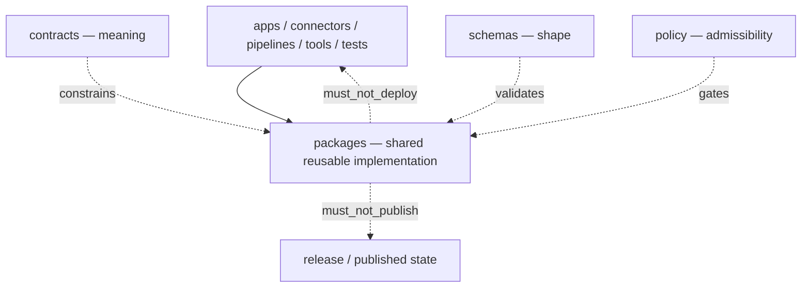

<!-- [KFM_META_BLOCK_V2]
doc_id: kfm://doc/packages-readme
title: packages/ — Governed Shared Implementation Package Root
type: readme; root-readme; canonical-packages-root; shared-library-boundary; mixed-language-workspace; package-maturity-index; drift-index
version: v0.5
status: draft; repository-grounded; canonical-root-confirmed; directory-rules-v2-adopted; mixed-maturity; bounded-implementation-candidates; package-wide-ci-unestablished; distribution-unverified; non-authoritative
owners: OWNER_TBD — Package steward · Architecture steward · Consumer owners · Contract/schema/policy stewards · Security and supply-chain reviewer · Validation/CI steward · Docs steward
created: 2026-06-15
updated: 2026-08-09
supersedes: v0.4 packages root contract
prepared_under_prompt: KFM Repository Build-Out & Markdown Modernization Implementation Agent v6.0.0
policy_label: "public-doctrine; packages-root; shared-reusable-code; non-deployable; governed-interface-only; mixed-maturity; distribution-unverified; correction-aware; rollback-aware"
current_path: packages/README.md
truth_posture: >
  CONFIRMED canonical packages root; ADR-0029 adoption of Directory Rules v2;
  same-path PLACE outcome; main@854a74c9bca86e06474ff0b6a88845a9851e69ff;
  prior blob 3a248f9debb5e8f4c74d33c37584e144ba84e620; twenty-one direct
  child package directories; pnpm@11.17.0 workspace and lock contract; root
  Hatchling distribution limited to src/kfm; package-specific deterministic
  no-network evidence for connectors-core, evidence-resolver, and schema-registry;
  mixed remaining package maturity; CODEOWNERS routing; no package authority over
  contracts, schemas, policy, evidence, lifecycle, release, deployment, or publication /
  PROPOSED package maturity, admission, dependency-direction, compatibility,
  distribution, correction, and rollback contracts /
  CONFLICTED MapLibre naming, evidence-family overlap, apps/packages drift, stale
  connectors-core and schema-registry child README snapshots, and test-home boundaries /
  UNKNOWN complete dependency/consumer graph, aggregate package CI, Python lock model,
  supported APIs across the tree, distribution, deployment, runtime health, and public effects /
  NEEDS VERIFICATION named owners, independent review, child README reconciliation,
  license/supply-chain closure, compatibility windows, and rollback drills
evidence_snapshot:
  repository: bartytime4life/Kansas-Frontier-Matrix
  repository_id: "1059091169"
  visibility: public
  base_ref: main
  base_commit: 854a74c9bca86e06474ff0b6a88845a9851e69ff
  base_tree: 9780b2efc396a06cbbe197e4754c7e78fb31b0b1
  prior_blob: 3a248f9debb5e8f4c74d33c37584e144ba84e620
  directory_rules_blob: fd49a0b83e55cef52c1124281f093e263526898d
  root_package_manifest_blob: 5cba790c88c40b885cc65fe2d585f3205aa1ef9d
  root_python_manifest_blob: 1d3f2e5cc3e85c55ef48d21b4a25f1d70f8f9c9f
  makefile_blob: 4abc7f941ce25d7d14703e87e387cef6e96d1592
  dependency_scan_workflow_blob: 76de593984c51a52cf598bd3e9e999b8f94268cb
  ui_build_workflow_blob: 52382d796a8dd5ecafc39a801515aff0a8b013f8
  connector_gate_workflow_blob: 04c4a9bb445a79fe7ce2bfb485d32adb2e5435c5
  schema_registry_workflow_blob: 938a37ad95ee4487c42212f28ecf185ee87ab8ec
  codeowners_blob: dd2a84aa514d8ecd9208bc347f90f9a2ed37dd61
  connectors_core_manifest_blob: ea94c0b24f50a68f3d59becbb34625c42298d7d9
  connectors_core_test_blob: 3f5257eff23f2b29c8395adb12eee57c61d9f987
  schema_registry_core_blob: 29f992677799fc4cc759d1ee532d7a7c91d4d1b3
  schema_registry_readme_blob: 6b7a1a58286f0f44a1718a937b18ff4fd69121ed
  direct_child_package_directories: "21"
related:
  - ../README.md
  - ../package.json
  - ../pnpm-workspace.yaml
  - ../pnpm-lock.yaml
  - ../pyproject.toml
  - ../Makefile
  - ../docs/doctrine/directory-rules.md
  - ../docs/adr/ADR-0029-adopt-directory-governance-standard-v2.md
  - ../docs/doctrine/trust-membrane.md
  - ../docs/doctrine/lifecycle-law.md
  - ../contracts/README.md
  - ../schemas/README.md
  - ../policy/README.md
  - ../data/README.md
  - ../release/README.md
  - ../apps/README.md
  - ../connectors/README.md
  - ../pipelines/README.md
  - ../tools/README.md
  - ../tests/README.md
  - ../fixtures/README.md
  - ../.github/CODEOWNERS
  - ../.github/workflows/dependency-scan.yml
  - ../.github/workflows/ui-build.yml
  - ../.github/workflows/connector-gate.yml
  - ../.github/workflows/schema-registry-package.yml
notes:
  - "v0.5 repins this root contract to current main and adopted Directory Rules v2."
  - "This same-path documentation change changes no package code, dependency, lockfile, workflow, consumer, lifecycle object, release, deployment, or public behavior."
  - "Historical generated receipts remain immutable records for the bytes they originally hashed; this change does not rewrite them."
  - "The direct-child inventory is navigation, not a supported-capability or implementation-attestation catalog."
[/KFM_META_BLOCK_V2] -->

<a id="top"></a>
<a id="packages"></a>

# `packages/` — Governed Shared Implementation Package Root

> **Purpose:** own reusable, non-deployable implementation libraries shared across KFM applications, pipelines, connectors, tools, workers, tests, and governed interfaces—without becoming a second authority for truth, contracts, schemas, policy, lifecycle state, release, or publication.

<p>
  <a href="#status"></a>
  <a href="#authority-level"></a>
  <a href="#current-bounded-package-inventory"></a>
  <a href="#status"></a>
  <a href="#workspace-build-and-distribution-boundaries"></a>
</p>

> [!IMPORTANT]
> A package name, README, manifest, workflow, version, or successful import does not prove a supported capability. Current evidence is mixed: `connectors-core`, `evidence-resolver`, and `schema-registry` have bounded implementation/test evidence; many other lanes remain documentation boundaries, scaffolds, placeholders, conflicts, or unverified.

> [!CAUTION]
> [`apps/packages/`](../apps/packages/README.md) is a frozen drift guard, not another package root. Software package distribution is also not KFM release or publication.

<a id="quick-jump"></a>

**Navigation:** [Purpose](#purpose) · [Authority](#authority-level) · [Status](#status) · [Belongs](#what-belongs-here) · [Exclusions](#what-does-not-belong-here) · [Validation](#validation) · [Inventory](#current-bounded-package-inventory) · [Trust membrane](#trust-membrane-and-public-paths) · [Delivery](#repository-change-and-delivery-contract) · [Rollback](#compatibility-versioning-correction-and-rollback)

---

<a id="1-purpose"></a>

## Purpose

`packages/` is the canonical responsibility root for implementation behavior reusable by more than one deployable or bounded context. Packages should be deterministic where practical, explicit about effects, independently testable, and subordinate to KFM's authority roots.

```text
packages/       reusable non-deployable implementation
apps/           deployable processes and user surfaces
connectors/     source/provider acquisition and admission edges
pipelines/      lifecycle transformations and orchestration
tools/          repository-wide validators, generators, and operators
contracts/      semantic meaning
schemas/        machine shape
policy/         admissibility and obligations
data/           lifecycle, evidence, receipt, proof, registry, and published instances
release/        promotion, release, correction, withdrawal, and rollback decisions
```

A package may implement a helper used by a governed flow. Importability does not grant evidence, policy, release, or publication authority.

[Back to top](#top)

---

<a id="2-placement-and-authority"></a>

## Authority level

**Canonical shared-implementation root under Directory Rules v2 as adopted by [ADR-0029](../docs/adr/ADR-0029-adopt-directory-governance-standard-v2.md).**

| Question | Answer |
|---|---|
| What does a package own? | Reusable implementation logic and its package-local API/build/test boundary. |
| What does it not own? | Truth, semantic contracts, canonical schemas, policy source, source admission, lifecycle state, evidence closure, release decisions, deployment, or publication. |
| May it perform effects? | Only through explicit, injected, tested interfaces; hidden network/store/model/policy/release effects are denied. |
| May it be deployable? | No; deployables belong under [`apps/`](../apps/README.md). |
| May it be distributed? | Only through a separately reviewed software-distribution contract; distribution does not publish KFM claims or data. |

### Dependency-direction rule

```text
apps / connectors / pipelines / tools / tests
                       |
                       v
                    packages
                       |
      explicit references to contracts / schemas / policy
```

Packages must not import deployables, connector executables, pipeline runners, operator commands, or release stores. Package-to-package dependencies must be declared, acyclic, reviewed, and compatible.

[Back to top](#top)

---

## Status

### Evidence snapshot

| Surface | Current finding | Bounded conclusion |
|---|---|---|
| Target | `packages/README.md` at `main@854a74c9bca86e06474ff0b6a88845a9851e69ff`; prior blob `3a248f9debb5e8f4c74d33c37584e144ba84e620`. | Same-path `PLACE` update. |
| Placement authority | ADR-0029 accepts the exact Directory Rules v2 bytes at [`docs/doctrine/directory-rules.md`](../docs/doctrine/directory-rules.md). | v2 controls root purpose, direct-child map, dependency direction, README fields, and review triggers. |
| Direct children | Exactly twenty-one direct child package directories plus this README. | Current direct map only; not recursive maturity proof. |
| Node workspace | [`package.json`](../package.json) pins `pnpm@11.17.0`, Node `>=22.13 <23`, and `apps/*`/`packages/*`; root generic scripts fail closed with `WORKFLOW_HOLD`. | Manager/workspace identity exists; aggregate package commands do not. |
| Python root | [`pyproject.toml`](../pyproject.toml) builds only `src/kfm`. | Child Python packages are independently configured; no root child-package lock/build model. |
| Package CI | Dedicated no-network evidence exists for connectors-core and schema-registry; evidence-resolver has bounded validation. | Lane-specific evidence, not package-wide certification. |
| Review | [CODEOWNERS](../.github/CODEOWNERS) routes `/packages/` to `@bartytime4life`. | Routing is not approval, independence, or release authority. |
| Distribution/runtime | Complete consumers, registry publication, deployment, production support, and health were not established. | `UNKNOWN`. |

### Current bounded conclusions

- **CONFIRMED:** canonical root, adopted placement authority, twenty-one direct lanes, pinned pnpm workspace, separate Python child projects, and mixed package maturity.
- **PROPOSED:** the maturity, admission, dependency, distribution, compatibility, correction, and rollback contracts below.
- **UNKNOWN / NEEDS VERIFICATION:** recursive inventory, complete dependency/consumer graph, aggregate CI, supported APIs across all lanes, Python lock strategy, software distribution, deployment, runtime health, owners, and independent review.

### Truth labels used here

`CONFIRMED` = pinned evidence; `PROPOSED` = design not yet current; `UNKNOWN` = insufficient evidence; `NEEDS VERIFICATION` = concrete check remains; `CONFLICTED` = admissible evidence points to competing responsibilities or claims.

[Back to top](#top)

---

<a id="3-root-contract"></a>
<a id="9-package-responsibilities"></a>

## What belongs here

- deterministic helpers, value objects, canonicalization, temporal, geometry, identity, and hashing implementations;
- contract/schema adapters and generated carriers subordinate to canonical sources;
- finite-outcome, evidence-resolution, policy-evaluation, redaction, catalog, and release-candidate helpers that do not own the decision;
- shared domain helpers that preserve domain meaning;
- governed UI components consuming explicit public-safe props;
- package-local manifests, source, deliberate exports, unit tests, README, changelog, and build configuration.

### Root contract

Every implementation-bearing child must make identity, purpose, owner, runtime, manifest, source root, exports, inputs, outputs, prohibited effects, authority bindings, dependencies, consumers, tests, versioning, deprecation, correction, and rollback inspectable. A README-only or scaffold lane must say so and must not claim a supported API, build, test pass, consumer, distribution, or production behavior.

[Back to top](#top)

---

<a id="6-exclusions"></a>

## What does NOT belong here

| Excluded responsibility | Canonical owner |
|---|---|
| Deployable service, UI shell, worker, or CLI | [`apps/`](../apps/README.md) |
| Source-specific acquisition or credentials | [`connectors/`](../connectors/README.md) |
| Lifecycle transformation/orchestration | [`pipelines/`](../pipelines/README.md) |
| Repository-wide validator/operator | [`tools/`](../tools/README.md) |
| Semantic contract | [`contracts/`](../contracts/README.md) |
| Canonical schema | [`schemas/`](../schemas/README.md) |
| Policy rule or permission decision | [`policy/`](../policy/README.md) |
| RAW/WORK/QUARANTINE/PROCESSED/catalog/triplet/receipt/proof/published instance | [`data/`](../data/README.md) |
| Release manifest, promotion/correction/withdrawal/rollback decision | [`release/`](../release/README.md) |
| Secret, private endpoint, protected coordinate, or production credential | Approved external secret/restricted-data control |

Capability-shaped names such as `release`, `schema-registry`, `source-registry`, `evidence`, or `api` never transfer their namesake authority into `packages/`.

[Back to top](#top)

---

<a id="5-inputs"></a>

## Inputs

Package APIs should accept explicit primitives, contract-shaped values, governed references, released/public-safe payloads, internal candidates with lifecycle labels, synthetic fixtures, validated non-secret configuration, and injected effect adapters. A supplied reference is not proof that its target exists, is admissible, or is released.

### Input rules

No implicit production stores, credentials, source systems, model providers, policy bundles, network, clock, randomness, filesystem writes, subprocesses, or telemetry. Sensitive inputs must be minimized, transformed before ordinary use, and excluded from logs/fixtures unless explicitly governed.

[Back to top](#top)

---

## Outputs

Allowed outputs include pure values, typed adapters, finite helper outcomes, candidate records, governed UI props/components, deterministic test support, software build artifacts, and bounded diagnostics. Outputs remain candidates or implementation values until owning validation, policy, review, persistence, release, and publication controls act on them.

Packages must not write authoritative records directly to canonical data, proof, policy, source-registry, release, or public API surfaces.

[Back to top](#top)

---

<a id="11-inspection-path"></a>
<a id="12-validation-expectations"></a>

## Validation

### Current repository validation posture

| Surface | Scope | Limit |
|---|---|---|
| Root generic npm scripts | Fail closed with `WORKFLOW_HOLD`. | No aggregate package execution. |
| `make validate` | Schema and contract checks. | No package API/consumer proof. |
| [`dependency-scan`](../.github/workflows/dependency-scan.yml) | Point-in-time root Python audit plus lock-backed pnpm audit/readiness classification. | Not vulnerability absence, license/provenance admission, or release. |
| [`connector-gate`](../.github/workflows/connector-gate.yml) | Compiles/imports connectors-core and runs deterministic no-network tests plus connector boundary checks. | Not live-source correctness, source rights, connector-run receipt closure, release, or publication. |
| [`schema-registry-package`](../.github/workflows/schema-registry-package.yml) | No-network package tests, fixture snapshot, and generated receipt integrity. | Not schema authority, consumer adoption, or release. |
| [`ui-build`](../.github/workflows/ui-build.yml) | Explorer Web build/test with exact pnpm/frozen lock. | Not package-root coverage. |

### Minimum package evidence

Manifest and license; non-placeholder source; deliberate exports; positive and negative tests; contract/schema agreement; no-hidden-effect checks; representative consumer agreement; dependency-cycle/direction checks; deterministic supply-chain resolution; compatibility/migration/rollback tests; documentation parity; stable fail-closed CI.

### Inspection commands—not supported build claims

```bash
find packages -mindepth 1 -maxdepth 1 -type d -print | sort
find packages -mindepth 2 -maxdepth 4 \
  \( -name package.json -o -name pyproject.toml -o -name tsconfig.json \) \
  -print | sort
find tests fixtures -type f 2>/dev/null | grep -E '(^|/)packages(/|_)' | sort
git grep -nE '(@kfm/|from (connectors_core|evidence_resolver|schema_registry)\b)' \
  -- apps packages pipelines tools tests
```

### Validation outcome for this README change

Documentation-only validation covers UTF-8/LF/final newline, metadata parse, one H1, heading order, language-tagged fences, unique preserved anchors, internal fragments, new relative links, HTML/Mermaid balance, secret-pattern screening, exact diff, and remote byte read-back. No package runtime execution is claimed for this edit.

[Back to top](#top)

---

## Review burden

[CODEOWNERS](../.github/CODEOWNERS) routes `/packages/` to `@bartytime4life`; that is not independent approval. Review depth scales from evidence/link accuracy for docs, to package/consumer/contract/compatibility review for API changes, to supply-chain and security review for dependencies/builds, and domain/policy/release specialists for trust-bearing helpers.

Generated receipts, green tests, commits, software packages, and pull requests do not substitute for human review or governed publication.

[Back to top](#top)

---

## Related folders

[`apps/`](../apps/README.md) · [`connectors/`](../connectors/README.md) · [`pipelines/`](../pipelines/README.md) · [`tools/`](../tools/README.md) · [`tests/`](../tests/README.md) · [`fixtures/`](../fixtures/README.md) · [`contracts/`](../contracts/README.md) · [`schemas/`](../schemas/README.md) · [`policy/`](../policy/README.md) · [`data/`](../data/README.md) · [`release/`](../release/README.md)

[Back to top](#top)

---

## ADRs

- [ADR-0029](../docs/adr/ADR-0029-adopt-directory-governance-standard-v2.md) — accepted placement authority.
- [ADR-0001](../docs/adr/ADR-0001-schema-home--schemas-contracts-v1-is-canonical.md) — schema-home lineage; verify current status before relying on it.
- [ADR-0004](../docs/adr/ADR-0004-apps-governed-api-is-the-trust-membrane.md) — governed API boundary lineage.
- [ADR-0006](../docs/adr/ADR-0006-maplibre-boundary--only-maplibreadapter-imports-maplibre.md) and ADR-0007 — renderer/package naming lineage; repin current status before structural work.

An accepted ADR or migration record is required before changing the canonical root, creating parallel authority, promoting `apps/packages/`, or renaming/moving a package where compatibility or authority changes.

[Back to top](#top)

---

## Last reviewed

| Field | Value |
|---|---|
| Review date | 2026-08-09 |
| Base | `main@854a74c9bca86e06474ff0b6a88845a9851e69ff`; tree `9780b2efc396a06cbbe197e4754c7e78fb31b0b1` |
| Prior target | blob `3a248f9debb5e8f4c74d33c37584e144ba84e620`; SHA-256 `123091fb6dd42d41325ab1e0d600c059ef18e965e56731dde1c1d98355d60742` |
| Placement | Same-path `PLACE`; no root, authority, lifecycle, or compatibility-topology change |
| Review triggers | Root class/owner/writer/consumer change; package add/remove/rename; aggregate CI; manager/lock/distribution change; material child evidence drift; security/correction/rollback event |

[Back to top](#top)

---

<a id="repository-change-and-delivery-contract"></a>

## Repository change and delivery contract

Use the smallest coherent, dependency-closed feature-branch slice: pin base and target bytes; freeze writable paths; inspect direct consumers and governing contracts/tests/workflows; validate changed behavior; review the complete diff; push without force; verify branch/head/remote bytes; and deliver one draft PR by default.

For this update, the writable manifest is only `packages/README.md`. Known child README drift is disclosed rather than silently expanded into independently owned files. Merge, distribution, release, deployment, promotion, publication, source activation, repository settings, and administrative bypass remain separate transitions. Pending hosted CI is reported independently.

Rollback before merge is branch/PR abandonment. After merge, use a transparent revert or forward-fix PR; never rewrite shared history or recreate parallel authority.

[Back to top](#top)

---

<a id="8-diagram"></a>

## Operating model and dependency direction


```mermaid
flowchart TB
    CONSUMERS["apps / connectors / pipelines / tools / tests"] --> PACKAGES["packages — shared reusable implementation"]
    CONTRACTS["contracts — meaning"] -. constrains .-> PACKAGES
    SCHEMAS["schemas — shape"] -. validates .-> PACKAGES
    POLICY["policy — admissibility"] -. gates .-> PACKAGES
    PACKAGES -. must_not_deploy .-> CONSUMERS
    PACKAGES -. must_not_publish .-> RELEASE["release / published state"]
```

### Package dependency constraints

Consumer-to-package is allowed through deliberate APIs. Package-to-package requires declared acyclic dependencies. Package-to-app/pipeline/tool executable is denied. Package-to-authority stores uses explicit immutable inputs/adapters and no direct writes. Generated code records source identity, generator/version, digest, and regeneration/rollback instructions.

[Back to top](#top)

---

<a id="7-package-map"></a>

## Current bounded package inventory

```text
packages/
├── README.md
├── api/
├── catalog/
├── citation/
├── connectors-core/
├── domains/
├── envelopes/
├── evidence/
├── evidence-resolver/
├── geo/
├── hashing/
├── identity/
├── maplibre/
├── pipelines-core/
├── policy-runtime/
├── redaction/
├── release/
├── schema-registry/
├── source-registry/
├── taxonomy/
├── temporal/
└── ui/
```

| Lane | Current bounded posture |
|---|---|
| `api`, `catalog`, `citation`, `geo`, `hashing`, `identity`, `policy-runtime`, `redaction`, `release`, `source-registry`, `temporal` | Existing package boundaries; current capability must be established from current manifest/source/tests/consumers. |
| `domains`, `envelopes`, `pipelines-core` | Umbrella/shared-boundary lanes; domain meaning and executable orchestration remain elsewhere. |
| [`connectors-core`](connectors-core/README.md) | `kfm-connectors-core` `0.0.1`, pure source-agnostic abstractions, deterministic tests, and partial CI. **Bounded implementation candidate; child README drift; license/distribution/live-source/consumer closure held.** |
| [`evidence`](evidence/README.md) | Documentation boundary with unresolved overlap across resolver/identity/hashing/citation. |
| [`evidence-resolver`](evidence-resolver/README.md) | Bounded internal v1alpha1 candidate; public API, consumers, distribution, and production behavior held. |
| [`maplibre`](maplibre/README.md) | Existing renderer helper lane; naming/adapter/consumer decision must be repinned before structural change. |
| [`schema-registry`](schema-registry/README.md) | Read-only local registry, CLI, deterministic tests/fixtures, duplicate/symlink denial, and no-network CI. **Bounded implementation candidate; child README drift; schema authority remains external.** |
| `taxonomy` | Documentation boundary; shared taxonomy authority unresolved. |
| `ui` | Shared UI lane; exports/build/accessibility/consumers require current child evidence. |

### Inventory rules

This map proves direct children only. Current implementation/tests/workflows outrank stale prose for current behavior, but stale prose must be corrected. Do not count `apps/packages/`; do not create a parallel MapLibre/evidence authority; add new rows only after current-revision verification.

[Back to top](#top)

---

## Package maturity model

| State | Minimum evidence |
|---|---|
| `README_ONLY` | Boundary documentation; no implementation claim. |
| `SCAFFOLD` | Manifest/source layout; may be placeholder. |
| `CANDIDATE` | Non-placeholder API, deterministic tests, explicit dependencies/effects. |
| `IMPLEMENTATION_BEARING` | Supported exports, contract/schema agreement, robust negative tests. |
| `CONSUMER_VERIFIED` | Representative pinned consumers pass agreement tests. |
| `DISTRIBUTION_READY` | Reproducible locked build, license/security/provenance/version/withdrawal closure. |
| `DEPRECATED` / `RETIRED` | Replacement, migration, sunset, lineage, and rollback evidence. |

### Graduation evidence

A polished README, nonzero version, successful import, green audit, build artifact, merged PR, or registry upload does not independently graduate a package.

[Back to top](#top)

---

## Workspace, build, and distribution boundaries

### Current mixed-language posture

- Node: `pnpm@11.17.0`, Node `>=22.13 <23`, `pnpm-workspace.yaml`, and `pnpm-lock.yaml`; generic root commands intentionally hold.
- Python: root Hatchling build covers `src/kfm`; child projects vary independently.
- Validation: package-specific workflows exist, but no aggregate package/consumer matrix is established.
- Supply chain: root Python audit is point-in-time/unlocked; pnpm audit is lock-backed and registry-dependent; neither proves provenance, licensing, compatibility, or vulnerability absence.

### Distribution is a separate control plane

Distribution requires owner/consumer identity, supported runtime/API, deterministic dependencies/build, license/notices, vulnerability/provenance review, registry controls, version/compatibility, correction/withdrawal, and rollback. `private: true` is not a security boundary; `license = { text = "TBD" }` blocks responsible distribution. No package distribution is approved here.

[Back to top](#top)

---

<a id="4-trust-membrane-rule"></a>

## Trust membrane and public paths

```text
released public-safe records -> governed API/interface -> package adapter/component -> client

DENY: client -> package -> RAW / WORK / QUARANTINE / canonical store / direct model runtime
```

Packages may preserve evidence/policy/release metadata, render negative states, and build candidates. They may not fabricate EvidenceBundles, self-allow policy, bypass redaction, expose restricted reasons, promote lifecycle state, approve releases, or publish.

[Back to top](#top)

---

<a id="10-child-package-expectations"></a>

## Child package contract

### Identity and boundary

Stable name, purpose, owner, maturity, authority limits, consumers, and prohibited effects.

### Manifest and source

Manifest/build backend/runtime/dependencies/license; deliberate source root and exports; generated-file provenance.

### Trust and effects

Pinned contracts/schemas/policy profiles; explicit network/storage/model/clock/randomness/telemetry interfaces; sensitive-data posture.

### Tests and consumers

Positive/negative/unit/contract/consumer tests; deterministic fixtures; stable CI; no zero-test or placeholder-script success.

### Lifecycle and maintenance

Versioning, compatibility, migration, deprecation, vulnerability response, correction, downstream invalidation, withdrawal, and rollback. Generated authoring receipts are process memory, not approval.

[Back to top](#top)

---

## Compatibility, overlap, and drift register

| Item | State | Safe posture |
|---|---:|---|
| MapLibre package naming | `CONFLICTED / NEEDS REPINNING` | Keep current path; no parallel package or rename without current decision, consumer, migration, and rollback evidence. |
| Evidence-family overlap | `CONFLICTED` | Partition responsibilities before broad implementation; no duplicate APIs. |
| `apps/packages/` | `ANOMALY` | Keep frozen as drift guard; never treat as shared-package authority. |
| `packages/schema-registry` vs `schemas/` | `BOUNDARY ACTIVE` | Read-only helper only; canonical schemas remain under `schemas/`. |
| `packages/release` vs root `release/` | `NAME COLLISION` | Helper candidates only; decisions/records remain under root `release/`. |
| Connectors-core child README | `CONFIRMED DRIFT` | Reconcile separately; do not overclaim live connectors/distribution/consumers. |
| Schema-registry child README | `CONFIRMED DRIFT` | Reconcile separately; retain helper-only boundary. |
| Package-local vs root tests/fixtures | `NEEDS VERIFICATION` | Keep local unit and cross-cutting proof responsibilities non-competing. |

[Back to top](#top)

---

<a id="13-safe-change-pattern"></a>

## Package admission and graduation

### New package admission sequence

Prove reusable responsibility; search for an existing owner; avoid authority-shaped names; identify real consumers; define effects; create the smallest complete README/manifest/source/export/test slice; test negative behavior; run consumer agreement; record compatibility/rollback; then update this index.

### Graduation gates

Complete manifest/license; deliberate exports; non-placeholder implementation; collected passing tests; pinned contract/schema/policy dependencies; explicit effects; representative consumers; dependency/security/license review; documentation parity; actionable compatibility and rollback.

### Safe change pattern for an existing package

Read boundary/manifest/source/tests/consumers/history; preserve authority; prefer compatible changes; regenerate from canonical sources; run package and consumer tests; record security/dependency/sensitivity impact; update docs/migration/provenance; keep rollback possible.

[Back to top](#top)

---

## Compatibility, versioning, correction, and rollback

### Compatibility

Package, contract, schema, policy, data release, and publication versions are distinct. Shims need owners, consumers, expiry, tests, and removal criteria. Moves/renames require import compatibility and migration, not documentation aliases alone.

### Correction and security response

A defect may invalidate consumer outputs, generated adapters, pipeline candidates, receipts, evidence candidates, UI behavior, or released derivatives. Trace impact, patch the package, rerun agreement tests, issue governed corrections/withdrawals where required, rebuild derivatives, and verify cache invalidation.

### Rollback

Record last-known-good commit/version, affected exports/consumers, dependency lock state, reverse migration, feature flag/adapter, verification commands, and downstream correction implications. README rollback is ordinary Git rollback and changes no runtime or public state by itself.

[Back to top](#top)

---

<a id="14-definition-of-done"></a>

## Definition of done

### Root README

Current purpose/authority/direct-child map; evidence labels; accurate workspace/validation/maturity; belongs/prohibited; exposure/effects; owners/review/ADRs; drift; compatibility/correction/rollback; stable anchors; valid links/rendering.

### Implementation-bearing child package

Correct placement; complete manifest/license; deliberate exports; non-placeholder implementation; deterministic positive/negative tests; contract/schema/policy agreement; explicit effects; verified consumers; supply-chain closure; documentation parity; compatibility/correction/rollback; no authority bypass.

[Back to top](#top)

---

<a id="15-open-verification-items"></a>

## Open verification register

- recursive package and generated-file inventory;
- named owners and independent review routes;
- Python child workspace/build/lock model;
- aggregate package/consumer CI and dependency graph;
- supported APIs/exports/consumers per lane;
- connectors-core and schema-registry child README reconciliation;
- MapLibre and evidence-family boundary decisions;
- `apps/packages/` disposition and test-home split;
- license, registry, provenance, vulnerability, withdrawal, correction, and rollback policy;
- deployment/runtime use and health.

[Back to top](#top)

---

## Evidence ledger

| Evidence | Observation |
|---|---|
| ADR-0029 + Directory Rules v2 | Accepted packages-root placement and ROOT_FULL/direct-child rules. |
| Root package/Python manifests + Makefile | Pinned pnpm workspace, separate root Python build, no aggregate package suite. |
| Dependency-scan/ui-build | Bounded workflow definitions; hosted outcomes remain separate. |
| Connectors-core manifest/source/tests/workflow | Bounded internal candidate; no live-source/distribution/public authority. |
| Schema-registry source/CLI/tests/workflow | Bounded read-only local helper; no schema authority. |
| Direct package directory read | Exactly twenty-one direct package directories at the pinned base. |
| Child README comparison | Connectors-core and schema-registry prose materially lags current implementation. |
| Consumers/distribution/deployment/runtime | Not established. |

Repository reads and committed tests do not replace executed exact-head checks, recursive dependency analysis, registry/deployment evidence, runtime logs, or consumer telemetry.

[Back to top](#top)

---

## v0.4 to v0.5 material-change ledger

| v0.4 material | v0.5 disposition |
|---|---|
| Canonical purpose/authority/trust membrane | Preserved and repinned to adopted v2. |
| Legacy anchors and root-contract coverage | Preserved. |
| Placeholder-heavy conclusion | Corrected to mixed maturity with bounded candidates. |
| Twenty-one-lane inventory | Preserved, made exact, and converted to v2 direct-child map. |
| Connectors-core/schema-registry rows | Corrected from stale placeholder snapshots using current code/tests/workflows; uncertainty retained. |
| Workspace/dependency posture | Updated to fail-closed root scripts and current audit definitions. |
| Change discipline | Added branch/draft-PR delivery and terminal boundaries. |
| Historical receipts | Preserved unchanged for their original bytes. |
| Long-form repetition | Consolidated without removing material authority, validation, drift, compatibility, correction, rollback, or uncertainty. |

[Back to top](#top)

---

## v0.2 to v0.3 no-loss ledger

The v0.2 purpose, authority, trust membrane, inputs, exclusions, package map, diagram, package responsibilities, inspection commands, validation expectations, safe-change pattern, definition of done, open items, stable fragments, and status summary remain represented in the current sections. Historical wording remains recoverable through Git history.

[Back to top](#top)

---

## Change history

### v0.5 — 2026-08-09

Repinned current evidence and adopted placement authority; corrected package maturity drift; added v2 direct-child map and v6 delivery contract; consolidated repeated prose; changed documentation only.

### v0.4 — 2026-07-29

Recorded exact pnpm workspace/lock and locked-audit readiness posture.

### v0.3 — 2026-07-23

Expanded the root contract, bounded inventory, maturity model, validation, admission, distribution, correction, and rollback guidance.

### v0.2 — 2026-06-15

Replaced the initial stub with the first governed packages-root contract.

[Back to top](#top)

---

<a id="status-summary"></a>

## Status summary

`packages/` is the canonical root for reusable, non-deployable implementation libraries. Current evidence shows twenty-one direct lanes and mixed maturity: three bounded implementation candidates plus documentation boundaries, scaffolds, conflicts, and unverified packages. It does not establish aggregate CI, complete consumers, approved software distribution, deployment, operational support, KFM release authority, or publication.

The safe next work is lane-specific: reconcile stale child docs, choose a package with real consumers, close API/test/dependency/license/compatibility gaps, run consumer agreement, and preserve correction/rollback—without inferring authority from names, workflows, artifacts, or prose.

<p align="right"><a href="#top">Back to top</a></p>
