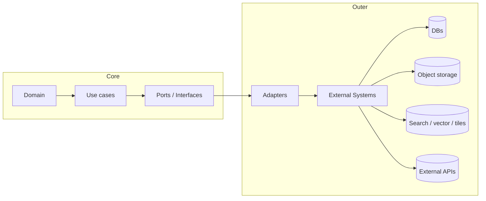
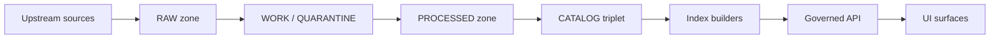

<!-- [KFM_META_BLOCK_V2]
doc_id: kfm://doc/36b72426-fbd2-42d9-9144-5def5c6ed797
title: packages/adapters
type: standard
version: v1
status: draft
owners: KFM Engineering
created: 2026-02-22
updated: 2026-02-25
policy_label: public
related:
  - ../../docs/architecture/
  - ../../docs/MASTER_GUIDE_v13.md
tags: [kfm, adapters, clean-architecture, governance, policy]
notes:
  - This README is a scaffold; update the adapter registry + directory tree as concrete adapters land.
  - 2026-02-25: clarified truth-path boundaries, shared adapter context, and fail-closed policy/error rules.
[/KFM_META_BLOCK_V2] -->

# packages/adapters
Replaceable infrastructure bridges (DBs, object stores, indexes, external APIs) that implement KFM ports without leaking domain logic or making policy decisions.


## Quick navigation
- [Where this package fits](#where-this-package-fits)
- [Acceptable inputs](#acceptable-inputs)
- [Exclusions](#exclusions)
- [Layering contract](#layering-contract)
- [Trust membrane rules](#trust-membrane-rules)
- [Truth path and promotion boundaries](#truth-path-and-promotion-boundaries)
- [Directory layout](#directory-layout)
- [Adapter registry](#adapter-registry)
- [Shared adapter context](#shared-adapter-context)
- [Adding a new adapter](#adding-a-new-adapter)
- [Testing and QA gates](#testing-and-qa-gates)
- [Security governance and sensitive locations](#security-governance-and-sensitive-locations)
- [Observability and error model](#observability-and-error-model)
- [References](#references)

---

## Where this package fits

This package is the **Adapters** layer in KFM’s clean architecture.

Adapters:
- implement **ports/interfaces** defined upstream (typically in an interfaces/contracts package)
- talk to real systems (network, filesystem, vendor SDKs)
- apply **policy obligations** (generalize, suppress, watermark, notice) only when instructed by a policy decision
- emit **audit-friendly events** (or propagate an `audit_ref`) so upstream can produce run receipts and provenance

Adapters do **not** decide what is allowed — they enforce a decision and fail closed when context is missing.

---

<a id="what-belongs-here"></a>

## Acceptable inputs

Adapters are the “outer ring” implementation details that connect KFM’s use cases to real systems:

- Datastores: PostGIS, graph DB, search/vector index, object storage
- File formats + IO: GeoParquet/GeoJSON readers, catalog writers, tile packagers
- External HTTP APIs: geocoding, metadata services, authority datasets
- Policy tooling: policy evaluation clients, obligation application helpers
- Audit/provenance sinks: run-receipt writer, append-only audit ledger writer

> Rule of thumb: if it talks to the network, filesystem, or a vendor SDK — it’s probably an adapter.

---

<a id="what-does-not-belong-here"></a>

## Exclusions

Adapters must not contain:

- Domain rules (“what is true”, “what should be published”, “how to interpret history”)
- Policy decisions (allow/deny), governance shortcuts (“just return it”), or “secret bypasses”
- UI logic
- Schemas as the source of truth (schemas belong in `contracts/` / `schemas/` / a contracts package)

Adapters may contain representation-level transforms (rows → domain objects, bytes → features), but transforms must be deterministic and testable.

---

## Layering contract

KFM follows a clean-layered architecture:

**Domain → Use cases → Interfaces (ports) → Adapters (infrastructure)**



---

<a id="non-negotiables-trust-membrane"></a>

## Trust membrane rules

Adapters are part of the “trust membrane” boundary between core logic and the outside world.

Non-negotiables:
1. **No bypass**: core logic never reaches DBs/files/APIs directly — only via ports.
2. **Fail closed**: if an adapter is asked to return or persist governed data without a policy context, it must deny/throw.
3. **No hidden side effects**: “read” operations must not mutate state unless modeled as an explicit command.
4. **Determinism**: identical inputs (including obligations) produce identical outputs, or nondeterminism is explicitly documented and tested.
5. **Auditable**: adapter operations must be traceable via an `audit_ref` and stable identifiers/digests handled upstream.

---

## Truth path and promotion boundaries

Adapters must not create “truth” — they materialize projections and serve bytes derived from **promoted** dataset versions.

Conceptual flow:



Adapter implications:
- Canonical stores (object storage, catalogs, audit ledger) must be treated as source-of-truth inputs for rebuilds.
- Rebuildable projections (PostGIS tables, search indexes, graph projections, tile bundles) must be reproducible from promoted artifacts.
- Runtime adapters (tile serving, feature queries, exports) must verify **dataset version promotion** (or receive a pre-validated handle) before serving.

> NOTE: Exact zone paths and directory names must match the repo’s actual layout.

---

## Directory layout

> Status: Not confirmed in repo. Adjust to match the actual package layout.

Typical layout we expect:

```text
packages/
└─ adapters/                                     # Infrastructure adapters (implement ports; talk to real systems)
   ├─ README.md                                   # This file
   ├─ package.json                                # Workspace package manifest (if applicable)
   │
   ├─ src/
   │  ├─ index.ts                                 # Public exports (barrel) for adapters package
   │  │
   │  ├─ shared/                                  # Cross-adapter helpers (timeouts, retries, redaction utils, logging)
   │  ├─ postgis/                                 # PostGIS repository implementations (SQL runners, migrations if applicable)
   │  ├─ graph/                                   # Graph store adapters (drivers, query runners, projections)
   │  ├─ search/                                  # Search/vector adapters (OpenSearch/Elasticsearch/vector services)
   │  ├─ object-store/                            # Object storage adapters (S3/MinIO; digest addressing; metadata)
   │  ├─ tiles/                                   # Tile adapters (PMTiles/MBTiles read/write; tile policy enforcement)
   │  ├─ policy/                                  # Policy adapters (PDP client, decision normalization, obligation application)
   │  └─ audit/                                   # Audit sinks (append-only ledger clients, receipt writers)
   │
   └─ tests/                                      # Adapter tests (contract/integration; minimal unit tests)
      ├─ contract/                                # Contract tests (port expectations + error shapes)
      ├─ integration/                             # Service-backed tests (DB/OPA/S3/search/neo4j)
      └─ fixtures/                                # Deterministic fixtures (synthetic; no secrets)
```

---

## Adapter registry

Keep this table current as adapters land. The “Port” column should reference the port name/type the adapter implements.

| Adapter | External system | Port | Purpose | Policy surface | Required tests |
|---|---|---|---|---|---|
| `PostGISRepository` | PostGIS | `*RepositoryPort` | Rebuildable feature tables and query projections | Must not serve unpromoted versions; must respect row/column redactions | Contract + integration |
| `GraphAdapter` | Neo4j or graph DB | `GraphPort` | Traverse relationships and provenance edges | Prevent overfetch; block PII joins without policy | Contract + policy fixtures |
| `SearchIndexAdapter` | OpenSearch/Elastic/vector | `SearchPort` | Full-text + vector retrieval | Redact/snippet safely; prevent leakage via highlights | Contract + redaction tests |
| `ObjectStoreAdapter` | S3/MinIO | `ArtifactStorePort` | Immutable artifacts + checksums | Enforce access to restricted artifacts; no path traversal | Integrity + integration |
| `TileStoreAdapter` | PMTiles/MBTiles/CDN | `TilePort` | Tile packaging + serving | Enforce sensitive-geometry obligations at serve time | Golden fixtures + policy |
| `PolicyEvalClient` | OPA / PDP | `PolicyPort` | Evaluate allow/deny + obligations | Must be deny-by-default; normalize decision shape | Fixture-driven policy tests |
| `AuditLedgerWriter` | Ledger store | `AuditPort` | Append-only run records and decisions | Must not leak restricted details in events | Integration + immutability checks |

> TIP: When adding a new row, include the minimum verification command or test target that proves it works end-to-end.

---

## Shared adapter context

Adapters should receive a consistent context envelope so they can fail closed and remain auditable.

Recommended minimum context (shape is illustrative):

```ts
export type AdapterContext = {
  auditRef: string;               // required
  policyContext: PolicyContext;   // required for governed reads/writes
  purpose: string;                // "index_build" | "api_read" | "export" | ...
  actor?: { id: string; roles?: string[] };
  requestId?: string;
  datasetVersionId?: string;
};
```

Rules:
- `policyContext` missing ⇒ deny/throw (do not “assume public”).
- `auditRef` missing ⇒ deny/throw for any operation that touches governed artifacts or projections.

---

## Adding a new adapter

### 1) Define or reference the port first
- Ensure the port/interface exists in the interfaces layer (e.g., `packages/interfaces`, `contracts/`, or equivalent).
- Keep ports small, stable, and testable.
- Ports must carry enough context to support policy + auditing (e.g., `policyContext`, `auditRef`, `purpose`).

### 2) Implement the adapter

Hard requirements:
- Explicit timeouts
- Bounded retries
- Structured errors with a stable taxonomy
- No secrets in code or committed config
- Deterministic serialization for anything persisted as canonical

### 3) Add tests

Minimum test set:
- Contract tests: port contract + error shapes + “fail closed” behavior
- Integration tests: runs against a real dependency in CI (containerized DB, mock server, etc.)
- Policy fixture tests: proves restricted content cannot leak; obligations produce generalized outputs

### 4) Document it
- Add an entry to the adapter registry.
- Add a short runbook in the adapter folder (or link to ops docs).
- If the adapter introduces a new external dependency, add an ADR.

---

## Testing and QA gates

Adapters are where trust membrane regressions happen. CI should treat these as promotion-critical.

### Gate checklist
- [ ] Policy tests green for allow, deny, and obligations scenarios
- [ ] No-sensitive-output tests green for coordinates, PII, restricted media
- [ ] Contract tests green for all ports implemented here
- [ ] Integration tests green against real dependencies
- [ ] Audit reference propagated so upstream can emit receipts and provenance
- [ ] Determinism checks for canonical artifacts and stable digests

> WARNING: If an adapter cannot run its integration tests in CI, it must provide a hermetic test double plus a scheduled job that runs the real test elsewhere. No silent gaps.

---

## Security governance and sensitive locations

Adapters must assume data can be sensitive by default.

### Sensitive location protection
For archaeology, sensitive species, living persons, etc:
- Support dual outputs: restricted precise + public generalized when allowed
- Ensure tests confirm no precise coordinates leak into public outputs
- Ensure serving paths enforce policy at request time (no bypass via static hosting)

### Secrets and supply chain
- Prefer short-lived credentials; never commit secrets
- Pin dependency versions where feasible
- Record adapter version/build info in receipts for reproducibility

---

## Observability and error model

### Logging
Adapters should emit structured logs and metrics with:
- `auditRef`
- `requestId` / trace id
- `port` and `adapter` name
- policy decision metadata (reason codes) without leaking sensitive payloads

### Error model
Adapters should throw/return errors that are:
- Typed (config, auth, timeout, upstream, validation, policy-deny)
- Safe to display (no secrets, no raw SQL, no private URLs unless policy allows)
- Mapped at the API boundary to stable error codes

---

## References

- `../../docs/architecture/` (system design + ADRs)
- `../../docs/MASTER_GUIDE_v13.md` (repo standards and directory conventions)
- `../../policy/` (policy bundles + fixtures) *(path may differ)*
- `../../contracts/` (schemas and API contracts) *(path may differ)*

---

<details>
<summary>Appendix: adapter template (pseudo-code)</summary>

```ts
// Port (interface) — belongs outside adapters
export interface ArtifactStorePort {
  put(
    ctx: { auditRef: string; policyContext: PolicyContext },
    blob: Uint8Array
  ): Promise<{ digest: string }>;

  get(
    ctx: { auditRef: string; policyContext: PolicyContext },
    digest: string
  ): Promise<Uint8Array>;
}

// Adapter — belongs here
export class S3ArtifactStoreAdapter implements ArtifactStorePort {
  constructor(private readonly cfg: { bucket: string; timeoutMs: number }) {}

  async put(ctx, blob) {
    assertPolicyContext(ctx.policyContext); // fail closed
    assertAuditRef(ctx.auditRef);           // fail closed
    const digest = sha256(blob);

    await withTimeout(this.cfg.timeoutMs, () =>
      s3Put(this.cfg.bucket, digest, blob)
    );

    return { digest };
  }

  async get(ctx, digest) {
    assertPolicyContext(ctx.policyContext); // fail closed
    assertAuditRef(ctx.auditRef);           // fail closed
    return await withTimeout(this.cfg.timeoutMs, () =>
      s3Get(this.cfg.bucket, digest)
    );
  }
}
```

</details>

---

[Back to top](#packagesadapters)
