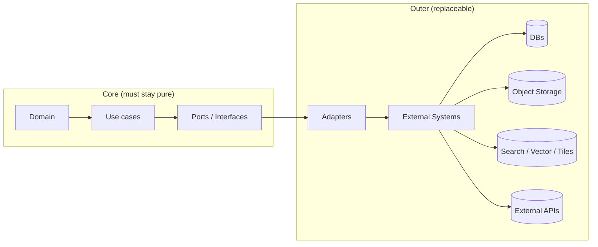

<!-- [KFM_META_BLOCK_V2]
doc_id: kfm://doc/36b72426-fbd2-42d9-9144-5def5c6ed797
title: packages/adapters
type: standard
version: v1
status: draft
owners: KFM Engineering
created: 2026-02-22
updated: 2026-02-22
policy_label: public
related:
  - ../../docs/architecture/
  - ../../docs/MASTER_GUIDE_v13.md
tags: [kfm, adapters, clean-architecture, governance, policy]
notes:
  - This README is a scaffold; update the adapter registry + directory tree as concrete adapters land.
[/KFM_META_BLOCK_V2] -->

# packages/adapters
Replaceable infrastructure bridges (DBs, object stores, indexes, external APIs) that implement KFM “ports” without leaking policy or domain logic.


## Quick navigation
- [What belongs here](#what-belongs-here)
- [What does not belong here](#what-does-not-belong-here)
- [Layering contract](#layering-contract)
- [Directory layout](#directory-layout)
- [Adapter registry](#adapter-registry)
- [Adding a new adapter](#adding-a-new-adapter)
- [Testing and QA gates](#testing-and-qa-gates)
- [Security governance and sensitive locations](#security-governance-and-sensitive-locations)
- [Observability and error model](#observability-and-error-model)
- [References](#references)

---

## What belongs here

Adapters are the “outer ring” implementation details that connect KFM’s **use-cases** to real systems:

- Datastores: PostGIS, graph DB, search/vector index, object storage
- File formats + IO: GeoParquet/GeoJSON readers, catalog writers, tile packagers
- External HTTP APIs: geocoding, metadata services, authority datasets
- Policy engines / guards: evaluation client, obligation application helpers
- Audit / provenance sinks: run-receipt writer, append-only audit ledger writer

> **Rule of thumb:** if it talks to the network, filesystem, or a vendor SDK — it’s probably an adapter.

---

## What does not belong here

Adapters **must not** contain:

- Domain rules (“what is true”, “what should be published”, “how to interpret history”)
- Policy decisions (allow/deny) or governance shortcuts (“just return it”)
- UI logic
- Schema definitions as the source of truth (schemas belong in `schemas/` or a contracts package)

> **NOTE:** Adapters *may* contain **representation-level transforms** (e.g., converting rows → domain objects),
> but those transforms must be deterministic and testable.

---

## Layering contract

KFM follows a clean-layered architecture: **Domain → Use cases → Interfaces (ports) → Adapters (infrastructure)**.



### Non-negotiables (trust membrane)
1. **No bypass:** core logic never reaches DBs/files/APIs directly — only via ports.
2. **Default deny:** if an adapter is asked to return data without a policy context, it must **fail closed**.
3. **No hidden side effects:** adapters must not mutate state in response to “read” operations unless explicitly modeled as a command.
4. **Determinism:** given the same inputs (including policy obligations), adapters must produce identical outputs (or explicitly documented nondeterminism).
5. **Auditable:** adapter operations must be traceable via an audit reference / run receipt emitted upstream.

---

## Directory layout

> **Status:** *Not confirmed in repo.* Adjust to match the actual package layout.

Typical layout we expect for this package:

```text
packages/
└─ adapters/                                     # Infrastructure adapters (implement ports; talk to real systems)
   ├─ README.md                                   # What belongs here, boundaries, and testing expectations
   ├─ package.json                                # Workspace package manifest (if using npm/pnpm/yarn workspaces)
   │
   ├─ src/
   │  ├─ index.ts                                 # Public exports (barrel) for adapter package
   │  │
   │  ├─ shared/                                  # Cross-adapter utilities (retries, timeouts, logging helpers, redaction utils)
   │  ├─ postgis/                                 # PostGIS repository implementations (SQL + migrations where applicable)
   │  ├─ graph/                                   # Graph store adapters (Neo4j drivers, Cypher runners, projections)
   │  ├─ search/                                  # Search/vector adapters (OpenSearch/Elasticsearch/vector services)
   │  ├─ object-store/                            # Object storage adapters (S3/MinIO; digest addressing; metadata)
   │  ├─ tiles/                                   # Tile adapters (PMTiles writers/readers, tile cache interfaces)
   │  ├─ policy/                                  # Policy client adapters (OPA eval, decision normalization, obligations apply)
   │  └─ audit/                                   # Audit sinks (append-only ledger, run receipts, export hooks)
   │
   └─ tests/                                      # Adapter tests (mostly contract/integration; minimal unit)
      ├─ contract/                                # Contract tests (port expectations + error shapes)
      ├─ integration/                             # Service-backed tests (DB/OPA/S3/search/neo4j)
      └─ fixtures/                                # Deterministic fixtures (synthetic; no secrets)
```

---

## Adapter registry

Keep this table current as adapters land. The “Port (Interface)” column should reference the port type/name that the adapter implements.

| Adapter | Port (Interface) | Purpose | Key risks | Required tests |
|---|---|---|---|---|
| `PostGISRepository` | `*RepositoryPort` | Read/write rebuildable feature tables | SQL injection, spatial index drift | Contract + integration |
| `GraphAdapter` | `GraphPort` | Traverse relationships / provenance edges | Overfetch + PII joins | Contract + policy fixtures |
| `SearchIndexAdapter` | `SearchPort` | Full-text + vector retrieval | Prompt injection via docs, leakage | Contract + redaction tests |
| `ObjectStoreAdapter` | `ArtifactStorePort` | Immutable artifacts + checksums | Integrity loss, path traversal | Integrity + integration |
| `TileStoreAdapter` | `TilePort` | PMTiles/MBTiles read/serve | Sensitive coord leakage | Golden fixtures + policy |
| `PolicyEvalClient` | `PolicyPort` | Evaluate allow/deny + obligations | “Allow by default” bug | Fixture-driven policy tests |
| `AuditLedgerWriter` | `AuditPort` | Append-only run records and decisions | Tampering, missing events | Integration + immutability checks |

> **TIP:** When adding a new row, include the *minimum* verification command or test target that proves it works end-to-end.

---

## Adding a new adapter

### 1) Define / reference the port first
- Ensure the port/interface exists in the **interfaces layer** (e.g., `packages/interfaces`, `src/interfaces`, or equivalent).
- The port should be **small, stable, and testable**.
- The port must carry enough context to support auditing and policy (e.g., `actor`, `purpose`, `policy_context`, `audit_ref`).

### 2) Implement the adapter
**Hard requirements:**
- Explicit timeouts
- Bounded retries
- Structured errors
- No secrets in code / config files
- Deterministic serialization for anything persisted as “canonical”

### 3) Add tests (fail-closed by default)
Minimum test set:
- **Contract tests:** given the port contract, the adapter returns expected values for representative inputs.
- **Integration tests:** runs against a local/CI dependency (containerized DB, mock server, etc.).
- **Policy fixture tests:** proves restricted content cannot leak; obligations produce generalized outputs.

### 4) Document it
- Add an entry to the [Adapter registry](#adapter-registry).
- Add a short runbook in the adapter folder (or link to ops docs).
- If the adapter introduces a new external dependency, add an ADR (architecture decision record).

---

## Testing and QA gates

Adapters are often where “trust membrane” regressions happen. CI should treat these as **promotion gates**:

### Gate checklist (minimum)
- [ ] **Policy tests green** (public vs restricted vs obligated-generalized scenarios)
- [ ] **No-sensitive-output tests green** (coords, PII, restricted media)
- [ ] **Contract tests green** (ports satisfied)
- [ ] **Integration tests green** (real service, not just mocks)
- [ ] **Audit event emitted** (run record includes decision + inputs/outputs digests)
- [ ] **Determinism checks** for canonical artifacts (stable digests)

> **WARNING:** If an adapter cannot run its integration tests in CI, it must provide a hermetic test double plus a scheduled job that runs the real integration test elsewhere. No silent gaps.

---

## Security governance and sensitive locations

Adapters must assume that data can be sensitive by default.

### Sensitive locations
For archaeology, sensitive species, living persons, etc:
- Support dual outputs: **restricted precise** + **public generalized** (when allowed).
- Ensure tests confirm **no precise coordinates** leak to public outputs.
- Ensure the UI can show a notice that data is generalized (reason + policy label).

### Secrets and supply chain
- Prefer short-lived credentials; never commit secrets.
- Pin dependency versions where feasible.
- Record adapter version/build info in run receipts for reproducibility.

---

## Observability and error model

### Logging
Adapters should emit structured logs and metrics with:
- `audit_ref` (or equivalent)
- `request_id` / trace id
- `port` + `adapter` name
- policy decision metadata (reason codes) **without leaking sensitive payloads**

### Error model (recommended)
Adapters should throw/return errors that are:
- **typed** (category: config, auth, timeout, upstream, validation, policy-deny)
- **safe to display** (no secrets, no raw SQL, no private URLs unless policy allows)
- **mapped** at the API boundary to stable error codes

---

## References

- `../../docs/architecture/` (system design + ADRs)
- `../../docs/MASTER_GUIDE_v13.md` (repo standards and directory conventions)
- `../../policy/` or `../../packages/policy/` (default-deny rules + fixtures) *(path may differ)*
- `../../schemas/` (contract schemas and validation)

---

<details>
<summary>Appendix: adapter template (pseudo-code)</summary>

```ts
// Port (interface) — belongs outside adapters
export interface ArtifactStorePort {
  put(ctx: { auditRef: string; policyContext: PolicyContext }, blob: Uint8Array): Promise<{ digest: string }>;
  get(ctx: { auditRef: string; policyContext: PolicyContext }, digest: string): Promise<Uint8Array>;
}

// Adapter — belongs here
export class S3ArtifactStoreAdapter implements ArtifactStorePort {
  constructor(private readonly cfg: { bucket: string; timeoutMs: number }) {}

  async put(ctx, blob) {
    assertPolicyContext(ctx.policyContext); // fail closed
    const digest = sha256(blob);
    await withTimeout(this.cfg.timeoutMs, () => s3Put(this.cfg.bucket, digest, blob));
    return { digest };
  }

  async get(ctx, digest) {
    assertPolicyContext(ctx.policyContext); // fail closed
    return await withTimeout(this.cfg.timeoutMs, () => s3Get(this.cfg.bucket, digest));
  }
}
```

</details>

---

[Back to top](#packagesadapters)
