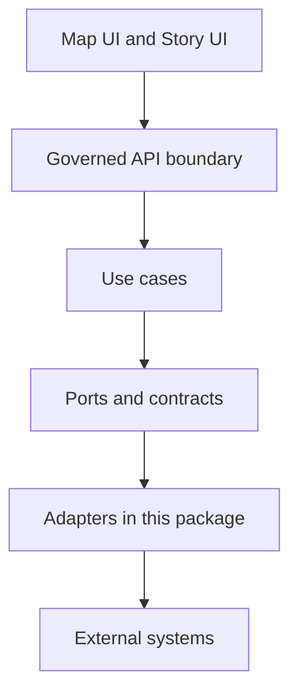

<!-- [KFM_META_BLOCK_V2]
doc_id: kfm://doc/4d8bcfd0-1b15-4a9f-bb93-bcb677c2ca89
title: packages/adapters/src — Adapter implementations
type: standard
version: v1
status: draft
owners: TBD
created: 2026-02-25
updated: 2026-02-25
policy_label: restricted
related:
  - ../README.md
  - ../../README.md
tags: [kfm, adapters, interfaces]
notes:
  - Scope: source-level adapter implementations only (no build output).
  - Replace all TBDs once repo conventions/contracts are confirmed.
[/KFM_META_BLOCK_V2] -->

<a id="top"></a>

# `packages/adapters/src`

**Implementation layer for adapters** that connect KFM domain/use-cases to external systems (HTTP APIs, databases, object stores, indexes, queues) **through governed interfaces**.


> NOTE (needs repo confirmation): this README assumes a TypeScript monorepo and a ports/adapters architecture.
> If the implementation language or directory conventions differ, update the examples and the “Directory layout” section.

## Quick links

- [What belongs here](#what-belongs-here)
- [Where it fits](#where-it-fits)
- [Adapter contracts](#adapter-contracts)
- [Directory layout](#directory-layout)
- [Adapter registry](#adapter-registry)
- [Adding a new adapter](#adding-a-new-adapter)
- [Testing](#testing)
- [Security and governance](#security-and-governance)
- [Observability](#observability)
- [Further reading](#further-reading)

---

## What belongs here

This directory is **source code only** for adapter implementations.

### Acceptable inputs

- Adapter implementations that satisfy an explicit **port/interface** from the core system (a “driver” for an external system).
- Mapping/translation code:
  - external schema → internal DTOs
  - internal commands → external API calls/queries
- I/O concerns and hard problems that should *not* live in the domain layer:
  - timeouts, retries, backoff, idempotency keys
  - pagination/cursor handling
  - rate limiting / quota handling
  - serialization/deserialization, validation at the boundary
- Policy-aware wrappers (redaction, classification checks) **at the boundary**.

### Exclusions

- ❌ Domain logic, business rules, or policy decisions (those belong in **Domain / Use cases / Policy layer**).
- ❌ UI concerns (rendering, view models).
- ❌ Direct storage access from UI/client code (all access must cross the governed API boundary).
- ❌ Secrets (API keys, passwords) committed to the repo.
- ❌ Large fixtures, exports, or data dumps.
- ❌ Generated build output (`dist/`, `build/`) or compiled artifacts.

[Back to top](#top)

---

## Where it fits

Adapters should be the **only** place that knows *how* to talk to external systems. Everything else talks to *ports*.



**Invariants we protect here (trust membrane):**

- Clients/UI do not talk to databases, buckets, or indexes directly.
- Use-cases call ports; adapters implement ports.
- Adapters enforce *technical* safety (timeouts, retries, allowlists) and *policy hooks* (redaction/classification gates), but do not invent business rules.

[Back to top](#top)

---

## Adapter contracts

Every adapter should make these properties obvious in code review.

### Contract checklist

| Concern | Requirement | Why it matters |
|---|---|---|
| **Explicit port** | Implements a named interface (port) owned by core/domain | Prevents infrastructure leaking into domain |
| **Deterministic mapping** | Mapping code is side-effect free and unit tested | Keeps behavior stable and reviewable |
| **Timeouts** | All network / DB calls have timeouts | Prevents hanging requests |
| **Retry policy** | Retries are bounded, jittered, and idempotent | Avoids thundering herds and data corruption |
| **Error model** | Errors are classified and mapped to a standard shape | Keeps clients predictable |
| **Policy hooks** | Sensitive outputs are checked/redacted before returning | Prevents accidental disclosure |
| **Audit/provenance** | Emits enough context for an audit trail | Supports reproducibility & governance |

### Recommended error taxonomy (example)

Use a small, typed set of errors so callers can make safe decisions:

- `AuthError` (credentials invalid / expired)
- `PermissionError` (caller not allowed)
- `NotFoundError`
- `ValidationError` (bad inputs at boundary)
- `UpstreamError` (5xx from external system)
- `TransientError` (timeouts, network partitions)
- `InvariantError` (programmer error; bug)

> Keep error messages safe to log. Put sensitive details in structured fields that are redacted or dropped.

[Back to top](#top)

---

## Directory layout

> NOTE: The tree below is a **recommended** structure to keep this folder navigable.
> Replace it with the **actual** tree once the repo conventions are confirmed.

```text
src/
  index.ts              # Public exports for the adapters package
  registry.ts           # Adapter registration/factory (DI composition point)
  errors/               # Typed error helpers + mapping utilities
  policy/               # Boundary policy helpers (classification, redaction hooks)
  http/                 # HTTP-based adapters (REST/GraphQL/etc.)
  storage/              # Storage adapters (DB/object store)
  indexing/             # Index/search adapters
  telemetry/            # Logging/metrics/tracing helpers used by adapters
  __tests__/            # Unit tests (if colocated in src in this repo)
```

### Conventions

- One adapter per folder/module, named for the external system + responsibility.
- Keep mapping functions small and pure; keep I/O code thin.
- Prefer dependency injection (pass clients in) over global singletons.

[Back to top](#top)

---

## Adapter registry

Keep a lightweight registry here so reviewers can answer: *“What adapters exist, what do they touch, and who owns them?”*

> Replace the placeholder entries with real adapters.

| Adapter ID | Port (interface) | External system | Data classification | Owner | Status |
|---|---|---|---|---|---|
| `exampleAdapter` | `ExamplePort` | `example.com API` | `public` | `TBD` | `draft` |
| `TBD` | `TBD` | `TBD` | `TBD` | `TBD` | `TBD` |

[Back to top](#top)

---

## Adding a new adapter

### 1) Confirm the port (interface) exists

- If the port does not exist, **add it to the contracts layer** first.
- The port should express *domain-friendly* methods and types (no vendor SDK types).

> Repo-specific location is TBD (common patterns: `packages/contracts`, `packages/core`, `packages/domain`).

### 2) Implement the adapter

Create a module under `src/<category>/<adapterName>/` and implement the port.

```ts
// PSEUDOCODE — adapt to your repo's actual port names and wiring.
import type { FooPort } from "@kfm/contracts"; // TODO: confirm import path

export class FooHttpAdapter implements FooPort {
  constructor(
    private readonly baseUrl: string,
    private readonly fetchImpl: typeof fetch,
    private readonly timeoutMs: number,
  ) {}

  async getFoo(id: string) {
    // 1) Validate inputs (boundary)
    if (!id) throw new ValidationError("id is required");

    // 2) Apply timeouts + safe retries (bounded)
    const res = await this.fetchWithTimeout(`${this.baseUrl}/foo/${encodeURIComponent(id)}`);

    // 3) Map upstream errors into local error taxonomy
    if (res.status === 404) throw new NotFoundError("foo not found");
    if (res.status === 401 || res.status === 403) throw new PermissionError("forbidden");

    // 4) Deserialize + validate response shape
    const data = await res.json();

    // 5) Policy hook: redact/classify before returning
    return redactFooIfNeeded(data);
  }

  private async fetchWithTimeout(url: string) {
    const controller = new AbortController();
    const t = setTimeout(() => controller.abort(), this.timeoutMs);
    try {
      return await this.fetchImpl(url, { signal: controller.signal });
    } catch (e) {
      throw new TransientError("upstream fetch failed", { cause: e });
    } finally {
      clearTimeout(t);
    }
  }
}
```

### 3) Register it (composition root)

Wire the adapter in `registry.ts` (or your repo’s DI container). Keep side-effects **out** of module top-level.

### 4) Add tests

Minimum expectation:

- **Unit tests** for mapping + error mapping
- **Contract tests** against a mock server / test container (if applicable)
- **Policy tests** proving sensitive fields are redacted/blocked appropriately

### 5) Update this README

- Add the adapter to the [Adapter registry](#adapter-registry)
- Add any new config keys and their semantics

[Back to top](#top)

---

## Testing

> Commands depend on the workspace toolchain. Use the project standard (pnpm/yarn/npm) and keep tests fast.

Examples (adjust to repo):

```bash
# from repo root
pnpm -C packages/adapters test
pnpm -C packages/adapters lint
```

### Recommended test matrix

| Test type | Scope | Runs in CI? | Notes |
|---|---|---:|---|
| Unit | Pure mapping + error shaping | ✅ | No network |
| Contract | Adapter ↔ mock/stubbed external system | ✅ | Validates request/response assumptions |
| Integration | Adapter ↔ real external system (ephemeral) | ⚠️ | Prefer nightly / gated |
| Policy | Redaction/classification invariants | ✅ | Fail closed |

[Back to top](#top)

---

## Security and governance

### Non-negotiables

- **No secrets in code or fixtures.** Use the repo’s secret management approach.
- **Do not log sensitive payloads.** Use structured logs + redaction.
- **Fail closed** when policy classification is unknown.
- **Avoid precise coordinates for protected/vulnerable sites** unless policy explicitly permits it.
- **Outbound allowlists** for HTTP adapters (hostnames, ports).
- **Least privilege** for database roles and API scopes.

### Audit & provenance

If an adapter returns data that could affect user-facing claims, emit an audit record with:

- who/what initiated the request (request id, actor, client)
- what external source was queried (system name, dataset/version if known)
- what policy decision was applied (allowed/denied/redacted)
- checksums or stable identifiers where feasible

[Back to top](#top)

---

## Observability

At minimum, every adapter should expose:

- **Structured logs** (no secrets)
- **Latency metrics** (p50/p95/p99)
- **Error rate metrics** by error class
- **Retry counts** and **circuit breaker** state (if used)
- **Tracing spans** around network / DB calls (if tracing is enabled in the repo)

[Back to top](#top)

---

## Further reading

These are optional references that informed the style of this directory:

- *Undisturbed REST* (API longevity and error modeling)
- *Kubernetes Security and Observability* (holistic security + observability mindset)

[Back to top](#top)
