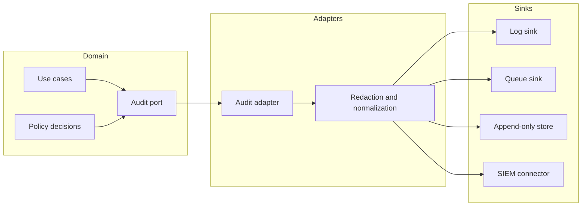

<!-- [KFM_META_BLOCK_V2]
doc_id: kfm://doc/66d24638-d88e-46c3-b458-dfc276c4b2b9
title: Audit Adapters
type: standard
version: v1
status: draft
owners: TODO
created: 2026-02-25
updated: 2026-02-25
policy_label: restricted
related:
  - packages/adapters/README.md
  - packages/adapters/src/README.md
  - packages/adapters/src/audit
tags: [kfm, adapters, audit, governance]
notes:
  - This README is a directory contract + implementation guide for audit adapters.
  - Update “Not confirmed in repo” sections once the actual module surfaces are verified.
[/KFM_META_BLOCK_V2] -->

# Audit adapters
Adapter-layer implementations for emitting **governed, redacted audit events** to external sinks (logs, queues, storage, SIEM), without leaking secrets or bypassing policy boundaries.

**Status:** `draft` · **Policy:** `restricted` · **Owners:** `TODO`  


---

## Quick navigation
- [What lives here](#what-lives-here)
- [Where this fits](#where-this-fits)
- [Audit event contract](#audit-event-contract)
- [Sink registry](#sink-registry)
- [How to add a sink](#how-to-add-a-sink)
- [Governance and safety](#governance-and-safety)
- [Testing and promotion gates](#testing-and-promotion-gates)
- [Troubleshooting](#troubleshooting)
- [Appendix](#appendix)

---

## What lives here

This directory is the **adapter layer** for audit emission.

### Purpose
- Provide **concrete implementations** that take a *normalized audit event* (from a port/interface defined elsewhere) and persist/forward it to one or more destinations.
- Enforce **redaction**, **classification labeling**, and **audit integrity** rules at the boundary.

### Acceptable inputs
- A normalized `AuditEvent` object (or equivalent) from a domain/use-case layer.
- A clock/time source and correlation identifiers (trace/request IDs).
- Sink configuration (e.g., destination, credentials reference, batching strategy) **via configuration**, not hard-coded.

### Exclusions
- ❌ Business logic (“should this action be allowed?”) — belongs in policy/use-case layers.
- ❌ Direct database access from UI/clients — audit must flow through the governed interfaces/ports.
- ❌ Logging raw secrets (tokens, passwords, API keys, session cookies), raw private coordinates, or unredacted PII.
- ❌ One-off ad-hoc formats that break traceability (e.g., free-form strings without structured fields).

> **WARNING:** Audit is a security feature. Treat all audit output as potentially sensitive and **default-deny** on uncertainty.

[Back to top](#audit-adapters)

---

## Where this fits

This repo uses (or intends to use) a layered model: **Domain → Use cases → Interfaces/Ports → Adapters → Infrastructure**.  
This directory is in the **Adapters** layer.



**Non-negotiable invariants**
- Adapters must **not** bypass policy boundaries (no “silent” extra data capture).
- Audit emission must be **traceable** (correlation IDs + stable schema).
- Redaction must be **testable** and **enforced by default**.

[Back to top](#audit-adapters)

---

## Directory tree

> **Not confirmed in repo:** This is an *expected* layout. Adjust to the actual module structure once verified.

```text
packages/adapters/src/audit/
├─ README.md
├─ index.ts                 # exports (proposed)
├─ types.ts                 # AuditEvent / Sink interfaces (proposed)
├─ redaction/               # redaction rules (proposed)
│  └─ redact.ts
├─ sinks/                   # sink implementations (proposed)
│  ├─ console.ts
│  ├─ http.ts
│  ├─ file.ts
│  └─ ...
└─ __tests__/               # contract + redaction tests (proposed)
   ├─ redaction.spec.ts
   └─ sinks.contract.spec.ts
```

[Back to top](#audit-adapters)

---

## Audit event contract

> **Goal:** A single, stable **event envelope** that can support security audits, data provenance, and policy traceability.

### Minimum envelope fields (recommended)
These fields should exist in *some form* even if naming differs:

| Field | Type | Notes |
|---|---|---|
| `event_id` | string | Unique identifier (UUID/ULID). |
| `occurred_at` | string | ISO-8601 timestamp. |
| `event_type` | string | Stable category, e.g. `api.request`, `policy.decision`, `data.promote`. |
| `actor` | object | Who/what initiated the action (user/service). |
| `action` | string | Verb-like intent, e.g. `READ`, `PROMOTE`, `EXPORT`. |
| `target` | object | What the action was applied to. |
| `outcome` | string | `success` / `failure` (or richer). |
| `correlation` | object | `trace_id`, `request_id`, job/run IDs. |
| `policy` | object | Policy label(s) and decision reference(s). |
| `sensitivity` | object | Classification + redaction markers. |

### Redaction markers
To preserve traceability without leaking sensitive content, include:
- `redactions_applied: string[]` (e.g., `["token", "email", "precise_location"]`)
- `data_classes_present: string[]` (e.g., `["PII", "CREDENTIAL", "LOCATION"]`)

### Example event (JSON)
```json
{
  "event_id": "01J0Z3F5N6K3R5YV6J9Q2H8T4A",
  "occurred_at": "2026-02-25T21:39:00.000Z",
  "event_type": "policy.decision",
  "actor": { "type": "user", "id": "user_123", "roles": ["analyst"] },
  "action": "PUBLISH",
  "target": { "type": "dataset", "id": "kfm://dataset/abcd" },
  "outcome": "denied",
  "correlation": { "trace_id": "trace_9f2c", "request_id": "req_71a1" },
  "policy": { "label": "restricted", "decision_id": "pol_55c8", "version": "TODO" },
  "sensitivity": {
    "data_classes_present": ["PII"],
    "redactions_applied": ["email"]
  },
  "details": {
    "reason_code": "MISSING_APPROVAL",
    "human_message": "Promotion requires governance approval."
  }
}
```

> **NOTE:** Do not store raw request/response bodies in audit by default. If you must capture payload evidence, store a **reference** to a governed evidence store with separate access controls.

[Back to top](#audit-adapters)

---

## Sink registry

> **Not confirmed in repo:** Populate this table with the sinks that actually exist.

| Sink | Use when | Output format | Delivery | Notes |
|---|---|---:|---|---|
| `console` | local dev | JSONL | best-effort | Avoid in prod unless explicitly approved. |
| `file` | batch jobs | JSONL | buffered | Ensure rotation + permissions. |
| `http` | central collector | JSON | retry | Use mTLS/OAuth; never embed secrets in logs. |
| `queue` | async pipelines | JSON | at-least-once | Requires idempotency by `event_id`. |
| `db_append_only` | compliance | structured | transactional | Prefer write-once/append-only semantics. |

[Back to top](#audit-adapters)

---

## How to add a sink

1. **Implement the sink interface**
   - Must accept the normalized event and return success/failure.
   - Must not mutate the event (treat as immutable).

2. **Enforce redaction**
   - Apply shared redaction utilities before writing.
   - Add unit tests proving secrets/PII are removed or transformed.

3. **Define failure semantics**
   - Decide whether failures are:
     - *blocking* (fail closed for high-risk operations), or
     - *non-blocking* (best-effort, but emit metrics/alerts).
   - Document the choice in code and tests.

4. **Register the sink**
   - Add to the factory/registry (if present).
   - Update the [Sink registry](#sink-registry) table.

5. **Add contract tests**
   - “Given an event, the sink produces valid output and never logs forbidden fields.”

### Example sink interface (TypeScript-like, adjust to project)
```ts
export interface AuditSink {
  readonly name: string;
  write(event: AuditEvent): Promise<void>;
  flush?(): Promise<void>; // optional for batching
  close?(): Promise<void>;
}
```

[Back to top](#audit-adapters)

---

## Governance and safety

### Data handling rules (default)
- Treat audit as **restricted** unless explicitly labeled otherwise.
- Never log:
  - passwords, API keys, bearer tokens, session cookies
  - full raw payloads containing PII
  - precise private locations (use coarse geography if location is needed)
- Prefer **opaque identifiers** over direct identifiers (e.g., `user_123` not email).
- If unsure whether a field is sensitive: **redact** and emit `redactions_applied += ["unknown_sensitive"]`.

### Integrity and traceability
- Use stable identifiers:
  - `event_id` must be unique and persistent
  - include correlation identifiers whenever available
- If a sink is used for compliance/regulatory audit:
  - ensure append-only semantics and retention policies are enforced **outside** the app as well.

[Back to top](#audit-adapters)

---

## Testing and promotion gates

> **Proposed gates (not confirmed in repo):** enforce these in CI for adapters/audit.

### Must-pass checklist
- [ ] Lint / formatting
- [ ] Typecheck (if applicable)
- [ ] Unit tests for redaction rules
- [ ] Contract tests for each sink
- [ ] “Forbidden fields” snapshot test (ensures secrets never appear)
- [ ] Structured schema validation for sample fixtures
- [ ] Load test for batching/backpressure behavior (if sink batches)

### Definition of done for an audit change
- [ ] Updated fixtures + schema (if envelope changes)
- [ ] Backwards compatibility note (if a downstream consumer is impacted)
- [ ] Documented failure semantics (block vs best-effort)
- [ ] Updated this README registry table (if sink set changes)

[Back to top](#audit-adapters)

---

## Troubleshooting

| Symptom | Likely cause | What to check |
|---|---|---|
| Missing audit events | sink not registered / disabled | config + sink registry wiring |
| Events present but uncorrelated | missing trace/request IDs | upstream context propagation |
| Sensitive data leaked | redaction not applied or incomplete | redaction tests + forbidden-fields tests |
| High latency | synchronous sink on hot path | async queue sink + batching |
| Duplicates downstream | at-least-once delivery | idempotency by `event_id` |

[Back to top](#audit-adapters)

---

## Appendix

<details>
<summary><strong>A. Example redaction rules (illustrative)</strong></summary>

```txt
- Replace tokens with "[REDACTED]"
- Hash stable identifiers when required (salted, managed outside code)
- Strip high-cardinality or sensitive headers:
  - Authorization
  - Cookie
  - X-Api-Key
- Coarsen locations:
  - keep city/region
  - remove exact coordinates
```
</details>

<details>
<summary><strong>B. Open questions to resolve (align README to repo)</strong></summary>

- What is the canonical audit port/interface name and location?
- What policy labels are valid in this repo (public/restricted/…)? Are there sub-labels?
- Which sinks exist today and where are they configured?
- Are failures blocking for any event types (authz, promotion, access control)?
- What is the downstream consumer contract (schema versioning)?
</details>
