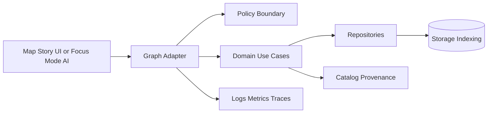
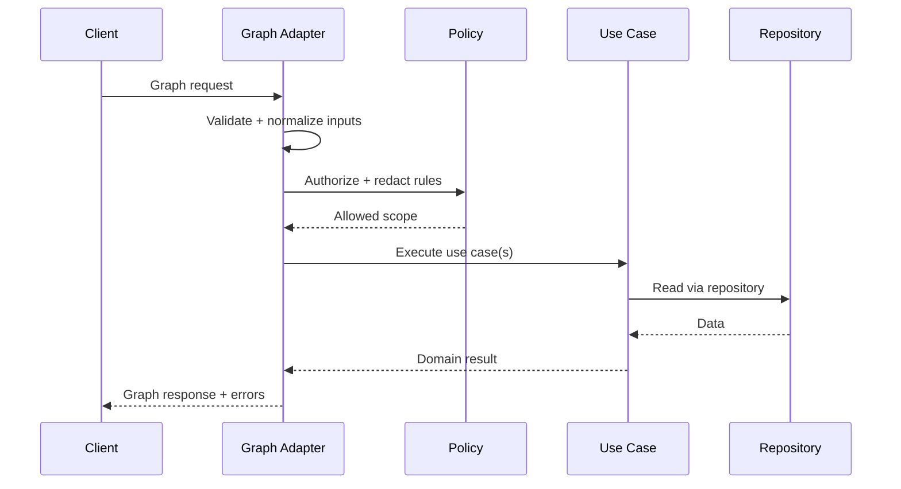

<!-- [KFM_META_BLOCK_V2]
doc_id: kfm://doc/6c9e9ad0-8b5b-4c5b-a8e7-8f5f9f87e5d2
title: Graph Adapter
type: standard
version: v1
status: draft
owners: TBD
created: 2026-02-25
updated: 2026-02-25
policy_label: public
related:
  - packages/adapters/README.md
  - packages/interfaces/README.md
  - packages/domain/README.md
  - packages/policy/README.md
  - packages/api/README.md
  - docs/architecture/README.md
  - docs/governance/README.md
  - docs/observability/README.md
tags: [kfm, adapters, graph]
notes:
  - This README is intentionally conservative: it avoids asserting repo-specific details that must be verified.
  - Replace TODOs with links/paths/commands verified in-repo.
[/KFM_META_BLOCK_V2] -->

<a id="top"></a>

# Graph Adapter

**Purpose:** Provide a governed **graph interface** (e.g., GraphQL resolvers or graph-style query endpoints) that translates external graph requests into **domain use cases** while enforcing **policy, provenance, and audit** boundaries.

> Status: **draft** (template) • Owners: **TBD** • Policy label: **public**


---

## Quick navigation

- [What this is](#what-this-is)
- [Where this fits](#where-this-fits)
- [Responsibilities and non-goals](#responsibilities-and-non-goals)
- [Request lifecycle](#request-lifecycle)
- [Directory layout](#directory-layout)
- [Conventions](#conventions)
- [Local development](#local-development)
- [Testing and gates](#testing-and-gates)
- [Security, policy, and governance](#security-policy-and-governance)
- [Observability](#observability)
- [Troubleshooting](#troubleshooting)

---

## What this is

This folder implements the **Graph adapter** for the Kansas-Matrix-System layering model:

- **Domain**: business rules, entities, and use cases
- **Interfaces (contracts)**: stable boundary types (DTOs, ports), policy hooks, error model
- **Adapters (this)**: protocol-specific translation (graph schema/resolvers), validation, authn/authz integration, audit emission
- **Infrastructure**: databases, object stores, indices, queues, external SaaS

The Graph adapter is the “front door” for graph-shaped queries used by Map/Story UI and Focus Mode AI workflows. It must remain **thin**: orchestration and translation only.

> **NOTE**
> This README does not assume a specific graph protocol. If this adapter is GraphQL, document the schema location and server integration point. If it is a different graph protocol, update terms accordingly.

[Back to top](#top)

---

## Where this fits

High-level system path (conceptual):



**Hard invariant:** clients never access storage directly; all access flows through governed boundaries.

[Back to top](#top)

---

## Responsibilities and non-goals

### Responsibilities

- **Protocol translation**: graph query → domain request(s) → graph response
- **Policy enforcement**: authorization, sensitivity controls, redaction, field-level filtering
- **Validation**: input shape, pagination limits, sort constraints, ID formats
- **Audit + provenance hooks**: emit an audit record per request and ensure responses are traceable to evidence/provenance where required
- **Error normalization**: convert internal failures into a stable graph error model

### Non-goals

- Implementing business logic (belongs in domain use cases)
- Direct database/index access (belongs behind repositories/infrastructure)
- “Smart” inference that bypasses evidence/policy (belongs in Focus Mode AI, behind governance)

[Back to top](#top)

---

## Request lifecycle

A typical request should follow a predictable pipeline:



**Audit expectation (recommended):**
- request id / trace id
- actor (subject), tenant/workspace, purpose
- policy decision summary
- input shape metadata (not full payload if sensitive)
- evidence/provenance pointers (where applicable)

[Back to top](#top)

---

## Directory layout

> **IMPORTANT**
> The exact layout below is **proposed**. Replace it with the **actual** tree once verified in-repo.

### Expected structure (proposed)

```text
packages/adapters/src/graph/
  README.md
  index.ts                  # Adapter entrypoint (exports schema/resolvers/handler)
  server.ts                 # Wiring into HTTP server (if applicable)
  schema/                   # Graph schema definitions
    *.graphql | *.gql
  resolvers/                # Field resolvers / query & mutation handlers
    *.ts
  mappers/                  # Domain ↔ graph mapping functions (pure)
    *.ts
  policy/                   # Adapter-side policy hooks (thin, delegates to policy pkg)
    *.ts
  validation/               # Input validation + pagination constraints
    *.ts
  __tests__/                # Unit + contract tests
    *.test.ts
```

### Acceptable inputs

- Graph schema & resolver code
- Pure mapping functions (domain ↔ graph)
- Adapter-level validation and normalization
- Policy boundary integration glue (no policy rules defined here unless explicitly owned by adapters)

### Exclusions

- Database clients, SQL strings, direct ORM usage
- Index clients (OpenSearch/Elastic/Neo4j/etc.) directly from resolvers
- Data pipelines, ETL, batch jobs
- Domain decisions (pricing rules, eligibility, canonical truth)

[Back to top](#top)

---

## Conventions

### Thin resolver rule

Resolvers should:

1. Validate/normalize inputs
2. Call a **domain use case** (or interface port)
3. Map domain output → graph output
4. Attach policy + provenance metadata as required

Avoid:

- branching business logic
- multi-step orchestration without a use case
- ad-hoc querying of storage

### Evidence discipline

If this graph interface is used for user-facing narratives (Map/Story UI) or for Focus Mode AI claims:

- Prefer returning **evidence references** alongside any computed assertion.
- If evidence is unavailable, return a safe/explicit state (e.g., `UNKNOWN`, `INSUFFICIENT_EVIDENCE`) rather than inventing detail.

### Pagination defaults

- Enforce **bounded** pagination at the adapter boundary.
- Require explicit limits; cap maximum page size.

> TODO: Document actual defaults once confirmed in code (e.g., `defaultLimit`, `maxLimit`).

[Back to top](#top)

---

## Local development

> TODO: Replace the commands below with repo-verified commands.

### Run the graph server (example)

```bash
# from repo root
# (choose your package manager)
# pnpm -C packages/adapters dev --filter graph
# yarn workspace @kfm/adapters dev:graph
# npm run dev --workspace packages/adapters -- --graph
```

### Typecheck

```bash
# TODO: replace
# pnpm -C packages/adapters typecheck
```

### Lint

```bash
# TODO: replace
# pnpm -C packages/adapters lint
```

[Back to top](#top)

---

## Testing and gates

### What to test here

- **Resolver unit tests** (input → use case call → mapped output)
- **Policy tests** (field-level redaction, deny-by-default behavior)
- **Contract tests** (schema compatibility, error model stability)
- **Golden tests** for evidence/provenance payloads (if applicable)

### Promotion gates (recommended)

- [ ] Typecheck passes
- [ ] Lint passes
- [ ] Unit + contract tests pass
- [ ] Policy tests pass
- [ ] Audit event emitted for each request path
- [ ] No direct storage access from adapter code

> TODO: Link to CI config/gates once available.

[Back to top](#top)

---

## Security, policy, and governance

### Default-deny posture

- If sensitivity/permissions are unclear, **deny** or **return redacted**.
- Never expose precise locations for vulnerable/private/culturally restricted sites unless policy explicitly allows.

### Authentication and authorization

> TODO: Document the auth mechanism used by the graph adapter:
> - JWT / session / mTLS
> - tenant scoping
> - RBAC / ABAC rules

### Data handling rules

- Do not log raw sensitive payloads.
- Prefer structured logs with redacted fields.
- Ensure policy labels propagate into responses.

[Back to top](#top)

---

## Observability

Minimum recommended signals:

- request count, latency, error rate per resolver
- policy-deny counts
- cache hit rate (if any)
- audit emission failures
- resolver-level tracing spans

> TODO: Link to `docs/observability/README.md` and describe the logging/tracing library once confirmed.

[Back to top](#top)

---

## Troubleshooting

### “Resolver returned null”

- Check whether policy redaction removed the field.
- Verify the use case returned data under the caller’s scope.
- Ensure mapping code handles `undefined`/`null` explicitly.

### “Forbidden / not authorized”

- Confirm the caller identity is present in request context.
- Inspect policy decision logs (redacted).

### “N+1 queries”

- Add batching at the use case boundary (preferred).
- If GraphQL: consider DataLoader-style batching (but keep it adapter-only; do not hide domain problems).

[Back to top](#top)

---

## Updating this README

When you wire this adapter into the real repo:

1. Replace **TODO** badges with real CI links.
2. Replace “Expected structure” with the actual directory tree.
3. Document the actual schema entrypoint and server integration.
4. Document the exact audit/provenance requirements for graph responses.
