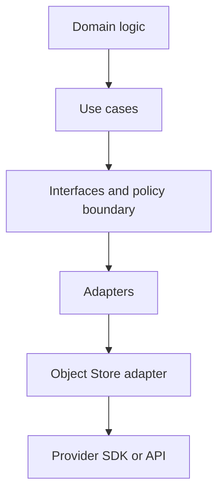

<!-- [KFM_META_BLOCK_V2]
doc_id: kfm://doc/5b2b0d6a-6b9b-4d65-b0de-4f3a2af5a9b7
title: Object Store Adapter
type: standard
version: v1
status: draft
owners: TBD
created: 2026-02-25
updated: 2026-02-25
policy_label: restricted
related:
  - packages/adapters/src/object-store
tags: [kfm, adapters, storage, object-store]
notes:
  - Template README generated without repo scan; replace TODOs with repo-specific details.
[/KFM_META_BLOCK_V2] -->

# Object Store Adapter
One-line purpose: **a governed abstraction for storing and retrieving binary objects (blobs) via a policy-safe interface.**


> [!NOTE]
> This README is written to be **repo-safe by default** (no assumptions about implementation details).  
> Replace `TODO` placeholders once the actual module API, provider(s), and config conventions are confirmed.

---

## Quick navigation
- [What this is](#what-this-is)
- [Where it fits](#where-it-fits)
- [Scope](#scope)
- [Interface contract](#interface-contract)
- [Configuration](#configuration)
- [Security and governance](#security-and-governance)
- [Usage examples](#usage-examples)
- [Testing](#testing)
- [Troubleshooting](#troubleshooting)
- [Directory contents](#directory-contents)
- [Definition of done](#definition-of-done)

---

## What this is

This directory contains an **Object Store adapter**: a thin boundary that abstracts object/blob storage behind a consistent interface, so higher layers can:

- store large artifacts (ETL outputs, exported tiles, attachments, run receipts, etc.)
- retrieve objects efficiently (streaming where possible)
- enforce **minimum invariants** (content identity, metadata, and audit hooks)
- swap or mock providers without changing domain/use-case logic

---

## Where it fits

KFM layering model (conceptual):



**Hard rule (trust membrane):** UI/clients must not directly access the object store. All access must flow through governed APIs/policy boundary.

---

## Scope

### In scope
- Basic object operations: `put/get/head/list/delete` (or equivalent)
- Streaming-friendly reads/writes for large objects
- Provider-agnostic metadata handling (content type, checksums, size)
- Support for **pre-signed URLs** (optional; governed + time-bounded)
- Observability hooks (logs/metrics/traces) and audit envelope support

### Out of scope
- Data cataloging and provenance graphs (belongs in catalog/provenance layer)
- Authorization decisions (belongs in policy boundary; adapter enforces only minimum safety)
- Data validation/QA promotion gating (belongs in pipeline + promotion gates)
- Client-side SDKs or browser direct-to-bucket uploads without policy mediation

---

## Interface contract

> [!IMPORTANT]
> The exact interface names/types below are **Proposed** until verified in repo.  
> Update this section to match the code in `packages/adapters/src/object-store/*`.

### Core concepts

| Term | Meaning |
|---|---|
| **bucket/container** | Provider namespace for objects |
| **key** | Path-like identifier inside bucket (`raw/...`, `processed/...`, etc.) |
| **object** | Binary payload + metadata |
| **etag/versionId** | Provider-specific identity/version tokens |
| **checksum** | Strong hash used for integrity (prefer SHA-256) |

### Proposed operations matrix

| Operation | Typical signature | Notes / invariants |
|---|---|---|
| Put | `put(key, body, metadata)` | Must support content type + checksum (or compute) |
| Get | `get(key)` | Prefer streaming; avoid buffering large objects |
| Head | `head(key)` | Must return size + checksum (if stored) + last modified |
| List | `list(prefix)` | Paginated; never unbounded in memory |
| Delete | `delete(key)` | Idempotent preferred |
| Copy/Move | `copy(src, dst)` | Keep metadata explicit; don’t assume provider copies tags |
| Signed URL | `signGet(key, ttl)` | TTL must be bounded by policy |
| Exists | `exists(key)` | Convenience wrapper around head |

### Error model (recommended)
Normalize provider SDK errors into a small set:

- `NotFound`
- `Forbidden`
- `Conflict`
- `ValidationError`
- `TransientError` (retryable)
- `UnknownError`

---

## Configuration

> [!NOTE]
> Names below are examples. Align with the repo’s actual config system (env vars, config files, DI container, etc.).

### Minimum required config (provider-agnostic)

| Setting | Example | Why it matters |
|---|---|---|
| provider | `s3` / `gcs` / `azure` / `filesystem` | Select implementation |
| bucket | `kfm-artifacts` | Namespace and access policy |
| prefix (optional) | `work/` | Multi-tenant / environment isolation |
| region (if needed) | `us-east-1` | Provider routing |
| endpoint (if needed) | `https://...` | S3-compatible / private endpoints |
| credentials | `via workload identity` | Prefer non-static creds |

### Example env var mapping

```bash
# Provider selection
OBJECT_STORE_PROVIDER=s3

# Namespace
OBJECT_STORE_BUCKET=kfm-artifacts
OBJECT_STORE_PREFIX=work/

# Provider-specific (example)
OBJECT_STORE_REGION=us-east-1
OBJECT_STORE_ENDPOINT=https://s3.example.internal
```

---

## Security and governance

### Baseline security expectations
- **TLS in transit** to provider endpoints
- **Encryption at rest** (provider-managed or customer-managed keys)
- **Least privilege**: restrict to required buckets/prefixes and operations
- **No secrets in object metadata** (metadata is frequently logged or indexed)
- **Retry discipline** for transient failures (bounded retries, jitter, timeouts)

### Trust membrane invariants
- The adapter should be callable only from server-side workloads operating behind policy.
- Any capability that bypasses policy (e.g., signed URLs) must:
  - be generated by a governed service
  - include **short TTL**
  - be scoped to a single object + method (GET vs PUT)
  - be auditable (who/why/what/ttl)

### Data lifecycle zones
If your repo uses KFM zones, prefer explicit prefixes (example only):

- `raw/` — immutable ingested inputs
- `work/` — intermediate artifacts / quarantine
- `processed/` — validated, transformed outputs
- `published/` — governed public-facing exports

> [!WARNING]
> Do not expose precise locations, sensitive site artifacts, or culturally restricted materials via signed URLs or public buckets. When classification is unclear, default-deny and escalate for governance review.

---

## Usage examples

> These are **illustrative**. Replace with real imports and function names once verified.

### Put + head (TypeScript-like pseudocode)

```ts
// pseudo-code — adjust to match repo API
const store = createObjectStore({
  provider: process.env.OBJECT_STORE_PROVIDER,
  bucket: process.env.OBJECT_STORE_BUCKET,
  prefix: process.env.OBJECT_STORE_PREFIX,
});

const key = "work/runs/2026-02-25/run-1234/receipt.json";

await store.put(key, Buffer.from(JSON.stringify(receipt)), {
  contentType: "application/json",
  checksumSha256: "<sha256-hex>",
  metadata: {
    // keep metadata non-sensitive
    runId: "run-1234",
    zone: "work",
  },
});

const info = await store.head(key);
console.log(info.sizeBytes, info.checksumSha256);
```

### Stream a large object to disk (Node-like pseudocode)

```ts
// pseudo-code — prefer streaming to avoid buffering large artifacts
const readStream = await store.getStream("processed/exports/big-file.tif");
await pipeline(readStream, fs.createWriteStream("/tmp/big-file.tif"));
```

---

## Testing

Recommended testing approach (provider-agnostic):

1. **Contract tests** against a mocked provider implementation
2. **Integration tests** against a local emulator or test account
3. **Failure mode tests** (timeouts, 403, 404, partial reads)

Suggested integration targets (pick what matches your provider):
- S3-compatible: MinIO
- GCS: emulator or dedicated test project
- Azure Blob: storage emulator or test account

> [!TIP]
> Keep integration tests deterministic: fixed buckets, per-test prefixes, and automatic cleanup.

---

## Troubleshooting

### Common symptoms

| Symptom | Likely cause | What to check |
|---|---|---|
| 403 Forbidden | IAM/policy denies prefix or action | role bindings, bucket policy, KMS grants |
| 404 NotFound | wrong key/prefix or eventual consistency edge | normalized key construction, list vs head |
| timeouts | too-large payload, missing multipart/chunking | client timeouts, streaming, multipart thresholds |
| corrupt downloads | missing checksum or wrong content encoding | checksum validation, content-type, compression |

### Logging guidance
Log **events**, not secrets:
- bucket, key (redact if sensitive), size, checksum, provider request id
- latency, retry count, error class

---

## Directory contents

> [!NOTE]
> Replace the tree below with the actual contents once verified.

```text
packages/adapters/src/object-store/
  README.md                # this file
  (TBD) index.(ts|js)       # public exports
  (TBD) types.(ts|js)       # interface + error types
  (TBD) providers/          # provider implementations (s3/gcs/azure/local)
  (TBD) __tests__/          # unit/contract tests
```

---

## Definition of done

- [ ] Interface contract matches code (no “Proposed” placeholders remain)
- [ ] At least one provider implementation is documented (including auth)
- [ ] Contract tests exist and run in CI
- [ ] Integration test strategy is documented and reproducible
- [ ] Signed URL behavior is documented with TTL/policy constraints
- [ ] Observability fields (request id, checksum, size, latency) are standardized
- [ ] Data classification guidance is present for sensitive artifacts

---

<details>
<summary>Appendix: Recommended key naming conventions</summary>

- Prefer stable, hierarchical keys:
  - `zone/<dataset-or-domain>/<yyyy-mm-dd>/<run-id>/<artifact>`
- Avoid user-controlled raw keys without sanitization.
- Consider content-addressed storage for immutable artifacts:
  - `processed/<sha256>/<filename>`
- Keep keys free of secrets or personal data.

</details>

<p align="right"><a href="#object-store-adapter">Back to top</a></p>
