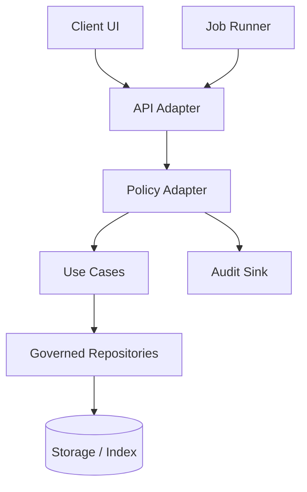
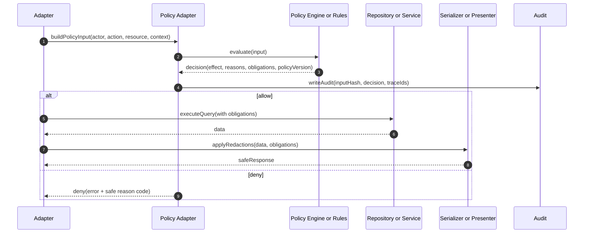

<!-- [KFM_META_BLOCK_V2]
doc_id: kfm://doc/959302e3-2019-4796-a2ea-efc20a187427
title: Policy Adapter
type: standard
version: v1
status: draft
owners: TBD (Platform / Governance)
created: 2026-02-25
updated: 2026-02-25
policy_label: restricted
related:
  - packages/adapters/README.md
  - packages/core/src/policy (if/when created)
tags: [kfm, policy, adapters]
notes:
  - Default-deny. Treat Unknowns as TODOs and wire to repo conventions.
[/KFM_META_BLOCK_V2] -->

# Policy Adapter
**Purpose:** a single, auditable **policy boundary** for adapters (HTTP, jobs, CLI, etc.) to enforce *who can do what* and *what must be redacted/filtered* before data crosses the trust membrane.

**Status:** Draft • **Owners:** TBD (Platform / Governance)


> ⚠️ **Default-deny:** If a request cannot be evaluated with high confidence, **deny** and emit an audit record.

---

## Quick navigation
- [What lives here](#what-lives-here)
- [Where this fits](#where-this-fits)
- [Policy evaluation flow](#policy-evaluation-flow)
- [Decision model](#decision-model)
- [How to use from an adapter](#how-to-use-from-an-adapter)
- [Adding or changing policy](#adding-or-changing-policy)
- [Tests and promotion gates](#tests-and-promotion-gates)
- [FAQ](#faq)
- [Appendix](#appendix)

---

## What lives here

This directory contains **adapter-layer** code that:
- Translates an incoming request (HTTP, event, internal job) into a **policy input**
- Evaluates policy (local rules or a policy engine) to produce a **decision**
- Returns **obligations** (e.g., field redaction, row filters, rate limits, logging constraints)
- Emits an **audit record** suitable for reproduction and governance review

### Acceptable inputs
- Policy evaluation helpers and adapters (e.g., `evaluatePolicy(...)`, `enforceDecision(...)`)
- Types that describe policy input/output at the adapter boundary
- Opinionated utilities for:
  - field-level redaction / masking
  - coarse-location generalization for sensitive/vulnerable sites
  - attaching policy metadata to downstream calls (trace/audit IDs)

### Exclusions
Do **not** put these in `src/policy/`:
- **Domain logic** (belongs in domain / use-cases)
- **Direct storage access** (DB, object storage, search indexes) — adapters must call governed repositories/services instead
- **UI concerns** (formatting, view models)
- Secrets, credentials, private keys, or long-lived tokens
- “Temporary” bypasses (e.g., `allowAll`, `skipPolicy`) — use explicit test-only fakes where needed

---

## Where this fits

This policy adapter is part of the **trust membrane** and should be called by any adapter that:
1) reads or writes governed data, or  
2) returns user-visible claims, or  
3) triggers irreversible side effects.



**Key invariant:** *No adapter should fetch or return protected data before a policy decision is applied.*

[Back to top](#policy-adapter)

---

## Policy evaluation flow



---

## Decision model

> This README describes the **contract we want** at the boundary.  
> If the current code differs, treat this section as a TODO and align it with real types.

### Policy input (recommended)
A policy input should be fully determined from adapter state (never from “ambient” globals).

- **actor**: who is asking (user/service), including roles/claims, tenant/org, and auth strength
- **action**: what they want to do (verb)
- **resource**: what they want to access (type + identifiers + sensitivity label)
- **context**: request metadata (purpose-of-use, ip, time, traceId, zone)

### Policy decision (recommended)
A decision should be explicit and audit-friendly.

- **effect**: `allow | deny`
- **reasons**: stable reason codes (safe to surface)
- **obligations**: transformations/constraints that must be applied
- **policyVersion**: identifier for traceability
- **decisionId**: unique ID for correlating logs/audits

### Obligations (examples)
Obligations are how we avoid “allow but unsafe”.

- `redact.fields`: list of field paths to remove/mask
- `filter.rows`: row-level predicate (or a query constraint object)
- `limit.rate`: per-principal quotas
- `mask.location`: coarsen coordinates for sensitive/vulnerable sites
- `log.level`: constrain what can be logged

---

## How to use from an adapter

> The names below are **illustrative**. Wire them to your actual module exports.

```ts
// packages/adapters/src/<some-adapter>/handler.ts (example)
import { evaluatePolicy, enforceDecision } from "../policy"; // TODO: update import path

export async function handler(req: Request): Promise<Response> {
  const input = {
    actor: req.auth?.principal,
    action: "dataset.read",
    resource: { type: "dataset", id: req.params.datasetId, sensitivity: "published" },
    context: { traceId: req.traceId, purpose: req.headers["x-purpose-of-use"] },
  };

  const decision = await evaluatePolicy(input);

  // Throws/returns a safe error if denied
  enforceDecision(decision);

  // Apply obligations to downstream queries + responses
  const data = await loadDataset(req.params.datasetId, { policy: decision });

  const safe = applyObligationsToResponse(data, decision.obligations); // TODO: implement
  return Response.json(safe);
}
```

### Error model
- **Denied** should return:
  - an HTTP status appropriate to auth posture (commonly `403` or `404` to avoid enumeration)
  - a **stable reason code** (safe) + correlation IDs
- Never return raw rule text or sensitive attributes in error messages.

---

## Adding or changing policy

### Change checklist
1. **Name the action** (verb) and the **resource type** (noun).
2. Define the **minimum attributes** needed to decide (avoid over-collection).
3. Add/modify rule(s) with **default-deny** behavior.
4. Add tests:
   - allow case(s)
   - deny case(s)
   - obligation correctness (redaction/filtering)
5. Ensure audits include:
   - `policyVersion`
   - `decisionId`
   - input hash (not raw PII)
6. Update the policy registry/matrix (see below).

### Policy registry template
> Replace this with a real registry once the project has a canonical location.

| Action | Resource | Typical principals | Obligations | Notes |
|---|---|---|---|---|
| `dataset.read` | `dataset` | `viewer`, `analyst` | redact fields, row filters | TODO |
| `dataset.write` | `dataset` | `editor`, `steward` | validate zone promotion gates | TODO |

---

## Tests and promotion gates

This directory is **gated** because it affects safety and correctness.

### Definition of Done
- [ ] Default-deny enforced for unknown actions/resources
- [ ] Unit tests cover allow/deny + obligations
- [ ] Decision includes stable reason codes + policy version
- [ ] Audit emission is verified (or a test double is used)
- [ ] No sensitive data is logged (PII, exact vulnerable coordinates)
- [ ] Adapter integration tests prove “no data before policy”

### Suggested CI gates (wire to repo CI)
- [ ] `lint`
- [ ] `typecheck`
- [ ] `test` (unit + integration)
- [ ] `policy-contract` (snapshot of decision schema)
- [ ] `no-bypass` (static check forbidding `skipPolicy` in non-test code)

---

## FAQ

### Why is this in `adapters/` and not `core/`?
Policy enforcement is an **interface concern**: it sits between external inputs and internal use-cases.  
Core/domain code may define *concepts* (e.g., sensitivity labels), but adapters own the *enforcement boundary*.

### What if a use case needs policy decisions?
Prefer passing a **decision** (or a constrained capability) down from the adapter, rather than having use-cases perform policy lookups directly. This keeps the boundary explicit and auditable.

### How do we handle culturally restricted/vulnerable locations?
Default to:
- coarse geography (region/county) instead of exact coordinates
- explicit obligations like `mask.location`
- “needs governance review” when sensitivity is unclear

---

## Appendix

### Suggested directory layout (verify against repo)
> This is a *recommended* structure only. Run `tree packages/adapters/src/policy` and update.

```text
packages/adapters/src/policy/
  README.md                # you are here
  index.ts                 # public exports
  types.ts                 # PolicyInput/Decision/Obligation
  engines/                 # OPA or rule engine adapters
  rules/                   # local rule definitions (if used)
  audit/                   # audit emitters + schemas
  __tests__/               # unit tests
```

### Minimum verification steps
- Locate the actual policy entrypoint(s): `rg "evaluatePolicy|policy" packages/adapters/src`
- Ensure every governed adapter calls policy before reads/writes
- Confirm audit sink wiring and redaction behavior with an integration test

[Back to top](#policy-adapter)
