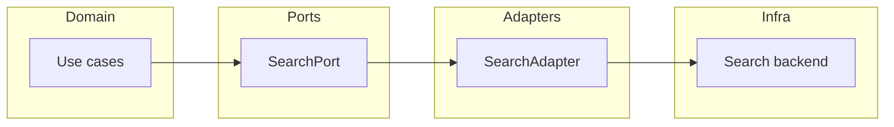

<!-- [KFM_META_BLOCK_V2]
doc_id: kfm://doc/db7e6259-309c-4bf4-82ad-2e7e1c0f9076
title: Search Adapter
type: standard
version: v1
status: draft
owners: TBD
created: 2026-02-25
updated: 2026-02-25
policy_label: restricted
related:
  - packages/adapters/README.md
  - packages/adapters/src/README.md
tags: [kfm, adapters, search]
notes:
  - Scaffold README. Verify exports and configuration keys against implementation.
  - Default-deny: do not leak non-authorized or non-published data via search.
[/KFM_META_BLOCK_V2] -->

# Search Adapter
Backend-agnostic, **governed** search integration for the KFM system.


> **NOTE**  
> This README is intentionally “scaffold-first.” The request that created it did not include the current repo tree or exports for `packages/adapters/src/search/`.  
> Replace **TODO** markers with the actual symbols, config keys, and file structure from this directory.

---

## Navigation
- [Purpose](#purpose)
- [Where this fits](#where-this-fits)
- [Responsibilities](#responsibilities)
- [Architecture](#architecture)
- [Contract](#contract)
- [Configuration](#configuration)
- [Security and governance](#security-and-governance)
- [Observability](#observability)
- [Testing](#testing)
- [Change management](#change-management)
- [Directory rules](#directory-rules)

---

## Purpose
This directory contains the **Search Adapter**: a boundary module that connects KFM application code to a concrete search backend (e.g., hosted search, DB FTS, vector DB), while preserving the **trust membrane**:

- **No bypassing policy**: callers must not be able to retrieve results they aren’t allowed to see.
- **No direct storage access from UI/clients**: search access must remain behind governed interfaces.
- **Evidence-friendly**: search behavior changes should be traceable (config + code + tests + rollout notes).

---

## Where this fits
`packages/adapters/src/search` is part of the **Adapters layer**: it implements the “how” of talking to an external search system.



**Rule of thumb:** Domain code depends on `SearchPort` (an interface). Only adapters depend on concrete backends.

---

## Responsibilities
### This adapter **should**
- Provide a stable API for:
  - text search, filters, pagination, sorting
  - optional facets/aggregations
  - optional vector / semantic retrieval (if supported)
- Enforce **policy-safe filtering** (at minimum: index scoping + field allowlists + caller-scoped constraints).
- Normalize and validate queries so backend quirks do not leak into domain code.
- Emit metrics/logs suitable for debugging and audit (without logging sensitive user input verbatim).

### This adapter **must not**
- Index or return content from non-promoted zones (e.g., raw/quarantine) unless explicitly policy-approved.
- Act as a “backdoor API” into private data stores.
- Accept arbitrary backend query DSL passthrough that could enable injection, field exfiltration, or policy bypass.

---

## Architecture
### Key boundary decisions
1. **Policy boundary first**  
   The adapter is not “just a client.” It is part of the safety envelope around search.

2. **Backend-agnostic contract**  
   Your domain should not know whether the backend is Postgres FTS, OpenSearch, Typesense, Algolia, or a vector DB.

3. **Deterministic request normalization**  
   Two semantically identical requests should normalize to the same canonical form (useful for caching, audit, and debugging).

---

## Contract
> **STATUS:** Proposed (verify against implementation)  
> Replace names and fields with the actual exports/types used in this repo.

```ts
// PROPOSED: keep the real version in code as the source of truth.
export type SearchPolicyContext = {
  actorId?: string;          // who is asking (if applicable)
  tenantId?: string;         // multi-tenant scoping (if applicable)
  policyLabels?: string[];   // caller entitlements / policy tags
};

export type SearchRequest = {
  q?: string;                           // text query
  filters?: Record<string, string[]>;   // allowlisted fields only
  sort?: { field: string; dir: "asc" | "desc" }[];
  limit?: number;
  cursor?: string;                      // opaque pagination token
  includeFields?: string[];             // allowlist enforced
  // vector?: { embedding: number[]; k: number }; // optional
};

export type SearchHit<TDoc = unknown> = {
  id: string;
  score?: number;
  doc?: TDoc;               // optionally partial fields only
  highlights?: Record<string, string[]>;
};

export type SearchResponse<TDoc = unknown> = {
  hits: Array<SearchHit<TDoc>>;
  total?: number;           // if supported / not too expensive
  nextCursor?: string;
  facets?: Record<string, Array<{ value: string; count: number }>>;
};

export interface SearchPort {
  search<TDoc = unknown>(
    req: SearchRequest,
    ctx: SearchPolicyContext
  ): Promise<SearchResponse<TDoc>>;

  // Optional but recommended:
  health?(): Promise<{ ok: boolean; details?: Record<string, unknown> }>;
}
```

### Capability matrix
| Feature | Required | Notes |
|---|---:|---|
| Query validation | ✅ | Reject unsupported filters/fields early. |
| Field allowlist | ✅ | Prevents accidental PII leakage. |
| Pagination | ✅ | Prefer opaque cursor tokens. |
| Sorting | ✅ | Only allow indexed/approved fields. |
| Facets | 🟨 | Optional; depends on backend and use case. |
| Highlighting | 🟨 | Optional; ensure HTML-safe output. |
| Vector search | 🟨 | Optional; must be gated + tested. |

---

## Configuration
> **STATUS:** Unknown (verify in repo)  
> Document the exact config keys once you confirm the backend.

**Recommended pattern**
- A single configuration object assembled in one place (env → config → adapter).
- Explicit validation at startup (fail closed if required keys missing).

```ts
// PROPOSED shape
type SearchConfig = {
  backend: "opensearch" | "typesense" | "postgres" | "other";
  endpoint?: string;
  apiKey?: string;
  indexName?: string;
  timeoutMs?: number;
};
```

**Minimum verification steps**
- Locate where this adapter is instantiated (factory or DI container).
- List all required env vars / config keys.
- Add a “config contract test” (ensures missing keys fail fast).

---

## Security and governance
### Default-deny constraints
- **Index scoping:** restrict queries to the correct tenant/environment/index set.
- **Field scoping:** response fields must be allowlisted. Prefer returning only IDs + small safe metadata.
- **Filter scoping:** filters must be allowlisted and normalized; no raw DSL passthrough.
- **Rate limiting:** enforce upstream (API gateway) and/or in adapter where appropriate.

### Sensitive inputs
- Treat search queries as potentially sensitive (names, addresses, case IDs, etc.).
- Avoid logging raw `q` strings. Prefer:
  - hashed/fingerprinted query string
  - length + language hints
  - selected filters (after allowlist)

### Data lifecycle (promotion gates)
Search indexes should be populated only from **Published** (or otherwise approved) datasets.

Checklist for indexing/promoting content into searchable state:
- [ ] Dataset identity + schema recorded
- [ ] License confirmed
- [ ] Sensitivity classification confirmed
- [ ] Validation/QA checks passed
- [ ] Provenance + checksums recorded
- [ ] Audit record emitted for the indexing run

---

## Observability
### Metrics (recommended)
- `search_requests_total{backend, status}`
- `search_latency_ms_bucket{backend}`
- `search_results_count_bucket`
- `search_rejected_total{reason}` (policy denial, invalid filter, etc.)

### Structured logs (recommended fields)
- `request_id` (correlation)
- `actor_id` / `tenant_id` (if applicable)
- `backend`
- `index`
- `normalized_query_fingerprint`
- `filters_allowlisted_count`
- `limit`
- `result_count`
- `duration_ms`
- `error_code` (stable internal code, not vendor text)

---

## Testing
### Contract tests (high value)
- A single suite that runs against any backend implementation of `SearchPort`:
  - pagination invariants
  - allowlist behavior
  - normalization behavior
  - policy constraints (“cannot retrieve forbidden doc”)

### Integration tests
- Run against a disposable backend (containerized if possible).
- Seed with a small fixture dataset.

### Performance / safety tests
- “Worst reasonable query” latency bounds.
- Max query length handling.
- Filter explosion prevention.

---

## Change management
Search changes can be **high-impact** (ranking, filters, tokenization, analyzers, embeddings).

**Definition of done for changes**
- [ ] Updated contract tests
- [ ] Backward compatibility reviewed (no breaking response shape without versioning)
- [ ] Rollout plan documented (canary + rollback)
- [ ] Reindex plan documented (if schema/analyzers changed)
- [ ] Audit + metrics reviewed in staging

---

## Directory rules
### Directory purpose
This directory contains **search adapter code only** (i.e., code that implements the search port and talks to a concrete backend).

### Acceptable inputs
- Backend client wrappers and mappers
- Query normalization/validation helpers
- Response shaping/field allowlisting
- Adapter-level telemetry instrumentation
- Adapter-specific integration test utilities (if colocated by convention)

### Exclusions
- ❌ Domain logic (ranking rules should be in domain, not vendor query DSL)
- ❌ Direct DB access used by UI/clients
- ❌ Data pipeline code for building indexes (belongs in pipelines/jobs)
- ❌ Secrets checked into repo

### Directory tree
```text
packages/adapters/src/search/
  README.md  # This document
  # TODO: run a tree/listing and document the real files in this folder
```

---

<details>
  <summary>Appendix: Quick “fill the TODOs” checklist</summary>

1. Run (from repo root): `git ls-files packages/adapters/src/search`  
2. Replace the “Directory tree” section with the real output + one-line descriptions.
3. Confirm actual exports (e.g., `index.ts`) and replace the “Contract” snippet to match.
4. Document the real config keys and defaults.
5. Add or reference:
   - contract tests
   - integration test strategy
   - runbook for reindex/backfill (if applicable)

</details>

---

**Back to top:** [Navigation](#navigation)
