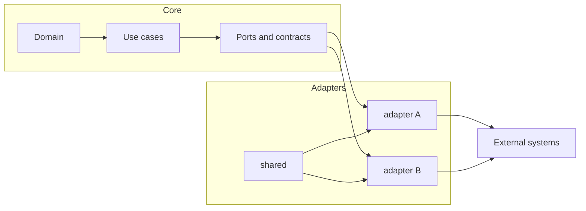

<!-- [KFM_META_BLOCK_V2]
doc_id: kfm://doc/c95a5ce5-5ebe-49e9-9239-799baac50577
title: packages/adapters/src/shared/README.md
type: standard
version: v1
status: draft
owners: TBD
created: 2026-02-25
updated: 2026-02-25
policy_label: restricted
related:
  - packages/adapters/README.md
  - packages/adapters/src/README.md
tags: [kfm, adapters, shared]
notes:
  - Shared primitives for adapter implementations. Keep dependency-light and policy-aware.
[/KFM_META_BLOCK_V2] -->

# `packages/adapters/src/shared`

Shared, dependency-light building blocks used by multiple adapter implementations (HTTP clients, auth helpers, retry/backoff, error normalization, telemetry glue).


> **Owners:** TBD  
> **Stability:** ⚠️ Shared code is a force-multiplier. Changes here can break multiple adapters. Prefer additive changes and keep exports stable.

---

## Quick links

- [Purpose](#purpose)
- [Where this fits](#where-this-fits)
- [What belongs here](#what-belongs-here)
- [What must not go here](#what-must-not-go-here)
- [Directory layout](#directory-layout)
- [Conventions](#conventions)
- [Governance and security](#governance-and-security)
- [Add a new shared utility](#add-a-new-shared-utility)
- [Troubleshooting](#troubleshooting)

---

## Purpose

This folder exists to **prevent copy-paste divergence** across adapters by centralizing the boring-but-critical plumbing:

- Consistent **error shapes** and error mapping
- Consistent **request metadata** (correlation IDs, user agent, timeouts)
- Consistent **retry/backoff** and (optionally) circuit breaking
- Consistent **telemetry/logging hooks**
- Small **pure utilities** that are used everywhere

The goal is *not* to build a “framework.” It’s to provide a thin, governed set of primitives that make adapters safer and more uniform.

[Back to top](#packagesadapterssrcshared)

---

## Where this fits

Adapters are part of the “policy/edge” of the system: they translate between our internal contracts and external services (HTTP APIs, queues, file stores, GIS services, etc.).



**Invariant:** Adapter code should not smuggle domain decisions. It should implement translation, policy enforcement, and I/O boundaries.

[Back to top](#packagesadapterssrcshared)

---

## What belongs here

✅ Good candidates for `shared/`:

- **Transport helpers**: HTTP client wrappers, pagination helpers, multipart/form-data helpers, request signing helpers *(implementation-specific; keep optional)*
- **Auth primitives**: token fetch/refresh scaffolding, header injection helpers *(do not embed secrets)*
- **Error normalization**: map external error formats → internal error contracts
- **Telemetry glue**: correlation IDs, spans, structured log wrappers
- **Retry/backoff**: small, well-tested utilities with safe defaults
- **Runtime guards**: input validation helpers (if already used in the repo) *(do not introduce heavy deps without review)*

A good heuristic: if *three* adapters want it, it probably belongs here.

[Back to top](#packagesadapterssrcshared)

---

## What must not go here

❌ Keep these out of `shared/`:

- **Domain logic** (business rules, policy decisions that belong in domain/use-case layers)
- **Storage clients** that bypass governed repositories (DB drivers, direct SQL, direct bucket access)
- **UI concerns** (React components, browser-only code)
- **Secrets** or secret lookup logic (no hardcoded keys, no reading env vars at import time)
- **One-off adapter hacks** (if it’s unique to one integration, keep it in that adapter)

> **Default-deny rule:** If you’re unsure whether something is “shared,” keep it local to an adapter first. Promote only after reuse is demonstrated.

[Back to top](#packagesadapterssrcshared)

---

## Directory layout

> ⚠️ **Not confirmed in repo.** This is a recommended structure. Align with the existing folder layout if it differs.

```text
packages/adapters/src/shared/
  README.md                # this doc
  errors/                  # normalized error types + mapping helpers
  http/                    # HTTP client wrappers, timeouts, retry integration
  auth/                    # token/header helpers (no secrets)
  telemetry/               # correlation IDs, tracing/log glue
  types/                   # cross-adapter TypeScript types
  utils/                   # small pure utilities (string/date/object helpers)
  index.ts                 # optional: curated public exports
```

[Back to top](#packagesadapterssrcshared)

---

## Conventions

### Design rules

- **Dependency-light:** avoid adding heavy dependencies here unless they are already a repo-standard.
- **No side effects on import:** importing a helper must not perform I/O, read environment variables, or mutate globals.
- **Stable exports:** prefer additive changes; deprecate before removal.
- **Typed contracts:** surface typed inputs/outputs; avoid “any” leakage.
- **Explicit timeouts & retries:** never rely on “defaults” for I/O boundaries.

### Error contract expectations

All adapter errors should be representable in a common shape:

- **Category** (e.g., auth, rate_limit, timeout, upstream, validation, unknown)
- **Retryable** boolean
- **Safe message** for logs/UI (no secrets)
- **Raw cause** (optional, guarded) for debugging

If you introduce a new error type, ensure there is a mapping strategy for at least one external system and a clear fallback.

[Back to top](#packagesadapterssrcshared)

---

## Governance and security

Adapters are part of the **trust membrane**.

Minimum expectations for shared adapter primitives:

- **No secrets in logs.** Redact tokens/keys/PII by default.
- **No coordinate leakage** for sensitive locations unless policy explicitly permits it (prefer coarse geography).
- **Auditability:** shared helpers that perform I/O should make it easy to attach:
  - correlation ID
  - request ID
  - actor/system identity (if available)
  - timestamps and durations
  - upstream endpoint identifiers (not full payloads)

> If the system has an explicit policy engine or redaction layer, integrate with it here.  
> If not, **do not invent one** in `shared/`—create a small contract and route it through governance review.

[Back to top](#packagesadapterssrcshared)

---

## Add a new shared utility

### Checklist

- [ ] At least **2–3 adapters** need it (or there is a clear near-term plan).
- [ ] Public API surface is **small** and named clearly.
- [ ] Unit tests cover the “sharp edges” (timeouts, retries, error mapping).
- [ ] No secrets, no PII, no accidental logging of payloads.
- [ ] Documentation added/updated (this README + inline docstrings).
- [ ] If behavior-affecting: include an ADR or small design note *(preferred)*.

### Suggested workflow

1. Start local (inside one adapter) and prove the abstraction.
2. Extract into `shared/` with tests.
3. Replace local copies with the shared import.
4. Add a short entry in a **Shared Registry** table (below).

[Back to top](#packagesadapterssrcshared)

---

## Shared registry

> Keep this table current as `shared/` grows.  
> If you don’t have these modules yet, leave rows empty until created.

| Module | Responsibility | Example exports | Notes |
|---|---|---|---|
| `errors/*` | Normalize upstream failures into internal error contracts | `AdapterError`, `mapUpstreamError()` | Avoid leaking raw upstream payloads |
| `http/*` | HTTP client wrappers with timeouts/retry hooks | `request()`, `withRetry()` | Prefer explicit timeouts |
| `telemetry/*` | Correlation ID + logging/tracing helpers | `withCorrelationId()` | Avoid global mutable state |
| `utils/*` | Pure utilities | `safeJsonParse()` | Keep small and well-tested |

[Back to top](#packagesadapterssrcshared)

---

## Troubleshooting

### “A change in shared broke multiple adapters”

- Confirm whether the change modified an exported type/function signature.
- Prefer a deprecation path:
  - keep old export
  - add new export
  - migrate consumers
  - remove only after a gate/major version bump

### “We need a new dependency in shared”

- Validate it is already a repo standard; otherwise, propose an ADR.
- Check bundle/runtime targets (Node vs edge vs browser).
- Prefer tiny, dependency-free utilities for common needs.

[Back to top](#packagesadapterssrcshared)
