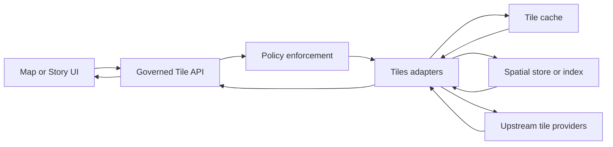

<!-- [KFM_META_BLOCK_V2]
doc_id: kfm://doc/3115c284-395f-4824-9450-30f3bd740270
title: Tiles adapters
type: standard
version: v1
status: draft
owners: TBD
created: 2026-02-25
updated: 2026-02-25
policy_label: restricted
related:
  - packages/adapters/src/tiles/
tags: [kfm, adapters, tiles]
notes:
  - This README was generated as a scaffold; update TODOs after confirming the actual adapter interfaces and directory layout in-repo.
[/KFM_META_BLOCK_V2] -->

# Tiles adapters

> Governed adapters for retrieving, generating, and caching map tiles behind the system’s policy boundary.


<!-- TODO: replace placeholder badges with real CI/coverage/license badges once repo paths are confirmed -->

**Status:** draft • **Owners:** TBD • **Policy label:** restricted

## Navigation

- [Purpose](#purpose)
- [Where this fits](#where-this-fits)
- [Architecture](#architecture)
- [Directory contract](#directory-contract)
- [Adapter contract](#adapter-contract)
- [Adding a new adapter](#adding-a-new-adapter)
- [Governance and security](#governance-and-security)
- [Testing and promotion gates](#testing-and-promotion-gates)
- [Troubleshooting](#troubleshooting)

---

## Purpose

This directory is intended to hold the **tile adapter layer**: code that turns a high-level “tile request”
into tile bytes (raster or vector) **without bypassing governance**.

In Kansas-Matrix terms, adapters should be “edge translators” between:
- governed interfaces (tile API / internal service calls), and
- concrete backends (tile caches, spatial stores, upstream tile providers)

while preserving the **trust membrane**: policy decisions, provenance, and auditability.

> **NOTE**
> This README does **not** assume any specific backend (PostGIS, MBTiles, WMTS, etc.) because the actual
> implementations were not provided alongside this request. Treat backend-specific items below as guidance, not fact.

[Back to top](#tiles-adapters)

---

## Where this fits

**Layering invariant (must hold):**
- UI/clients never access storage directly.
- All tile generation / retrieval must pass through a **governed API** + **policy enforcement point (PEP)**.
- Adapters must not embed business/policy logic; they should *consume* policy decisions and apply them.

[Back to top](#tiles-adapters)

---

## Architecture



**Intentional constraints:**
- The **PEP** is the decision boundary: allow/deny, redaction level, rate limits, attribution requirements.
- Adapters may cache tiles, but cache keys must include any policy-relevant dimensions (tenant, auth scope,
  redaction level, time slice, etc.) so that cached results cannot cross policy contexts.

[Back to top](#tiles-adapters)

---

## Directory contract

### What belongs here

- Tile adapter implementations (one per backend/provider or per format)
- Adapter registration/lookup (an internal registry), if the repo uses one
- Tile request/response types and lightweight helpers specific to tiles
- Cache utilities specific to tile keys, headers, encodings
- Contract tests + fixtures for adapters (including “golden tiles” where feasible)

### What must not go here

- UI components, map styling/UI state, Story nodes
- Direct database access that bypasses repositories/governed interfaces
- Secrets (API keys, tokens) or hard-coded credentials
- One-off scripts that are not covered by tests/audit requirements
- Any logic that “decides” access (that belongs to policy/governance)

[Back to top](#tiles-adapters)

---

## Adapter contract

Because the concrete codebase interfaces were not provided, **treat the following as a reference contract**.

### Inputs

A tile adapter typically needs:

- **TileKey**: `{ z, x, y }` (and optionally `tms` vs `xyz`)
- **Layer or dataset identifier**: a stable ID, not a human label
- **Format**: e.g. vector tile vs raster tile, plus content type
- **Variant selectors**: time slice, style, band, resolution, etc.
- **Request context**: policy context (tenant/scope), request ID, trace/span, locale

### Outputs

Adapters should return:

- tile bytes (or a stream)
- `contentType` (and `contentEncoding` if compressed)
- cache directives (ETag, max-age) *as permitted by policy*
- attribution payload if required (or a reference to it)

### Pseudocode interface

```ts
// PSEUDOCODE — update to match the repo’s actual language + conventions.
export type TileKey = { z: number; x: number; y: number };

export type TileRequest = {
  key: TileKey;
  layerId: string;
  format?: string;
  variant?: Record<string, string | number | boolean>;
  policyContext: {
    tenantId?: string;
    subjectId?: string;
    decisionId?: string;
    redactionLevel?: string;
  };
  trace?: {
    requestId?: string;
    spanId?: string;
  };
};

export type TileResponse = {
  status: 200 | 204 | 304;
  bytes?: Uint8Array;
  contentType?: string;
  headers?: Record<string, string>;
};

export interface TileAdapter {
  id: string; // stable adapter ID
  supports(req: TileRequest): boolean;
  getTile(req: TileRequest): Promise<TileResponse>;
  // Optional: metadata for capabilities, bounds, zooms, attribution
  getMetadata?(): Promise<Record<string, unknown>>;
}
```

[Back to top](#tiles-adapters)

---

## Adding a new adapter

Minimum additive workflow (recommended):

1. **Define the adapter boundary**
   - What backend/provider is it adapting?
   - What formats does it produce (vector/raster)?
   - What policy dimensions must be part of cache keys?

2. **Implement the adapter**
   - Validate inputs (bounds checking for `z/x/y`, format allowlist, size limits)
   - Fail closed on unknown/unsupported requests

3. **Register it**
   - Add it to an adapter registry (or export it from the module entrypoint) so callers do not instantiate it ad hoc.

4. **Add tests**
   - Contract tests: given a request, adapter returns correct status/content-type and stable bytes
   - Policy-coupling tests: cache keys include redaction/tenant/scope dimensions
   - Negative tests: invalid coordinates, unsupported zooms, unsupported formats

5. **Update documentation**
   - Add a row to the “Adapter inventory” table (below)
   - Note any licensing/attribution obligations

[Back to top](#tiles-adapters)

---

## Governance and security

### Default-deny behavior

Adapters must:
- reject requests they don’t understand (instead of “best guess”)
- avoid leaking sensitive details in error messages (no dataset internals, no raw SQL errors)
- ensure **policy context is required**, not optional, for any non-public tiles

### Location sensitivity

If tiles can reveal sensitive site locations (vulnerable, private, culturally restricted):
- do not expose “raw, highest precision” tiles by default
- respect redaction generalization rules (coarsening, masking, aggregation)
- ensure caching cannot mix redaction levels

### Licensing and attribution

If you ingest tiles or data from upstream providers:
- capture license + attribution requirements as metadata
- ensure attribution can be returned to the caller or displayed in UI
- ensure any usage limits are enforced upstream of the adapter (preferably at policy / gateway)

[Back to top](#tiles-adapters)

---

## Testing and promotion gates

A tile adapter is eligible for promotion only when it has:

- [ ] **Metadata**: identity, supported formats, spatial extent, zoom range, attribution requirements
- [ ] **Provenance hooks**: enough logging/audit fields to trace inputs → transforms → output
- [ ] **QA checks**: coordinate validation, size limits, “no mixed policy contexts” cache keys
- [ ] **License checks**: provider terms are compatible with intended use
- [ ] **Security checks**: no secrets in code/config; safe error handling; rate limiting defined
- [ ] **Deterministic tests** (where feasible): golden tiles or snapshot-based tests

[Back to top](#tiles-adapters)

---

## Adapter inventory

> **NOTE**
> Fill this table in once actual adapter implementations are confirmed in-repo.

| Adapter ID | Backend/provider | Tile type | Formats | Cacheable | Notes |
|---|---|---:|---|---:|---|
| TODO | TODO | TODO | TODO | TODO | TODO |

[Back to top](#tiles-adapters)

---

## Troubleshooting

Common failure modes:

- **Blank map / missing tiles**
  - Verify adapter supports the requested format and zoom range
  - Check policy decision: request may be denied or redacted to empty tiles

- **Tiles “leaking” across tenants/scopes**
  - Audit cache key composition; policy dimensions must be included

- **Slow tile rendering**
  - Confirm cache headers + CDN usage where allowed
  - Ensure adapter uses bounded concurrency and timeouts for upstream calls

- **Mismatched projections or tile scheme**
  - Confirm the tile coordinate scheme (XYZ vs TMS) and projection assumptions in the caller

[Back to top](#tiles-adapters)

---

## Appendix

<details>
<summary><strong>Suggested (not confirmed) directory layout</strong></summary>

This is a *proposal* only. Replace with the real tree once you confirm the codebase.

```text
packages/adapters/src/tiles/
  README.md
  adapters/
    <adapter-name>/
  cache/
  types/
  __tests__/
```

</details>
