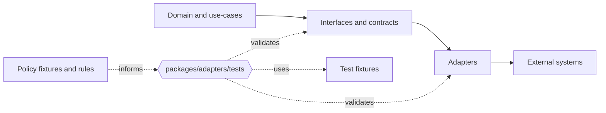

<!-- [KFM_META_BLOCK_V2]
doc_id: kfm://doc/cce871fd-df29-43a8-b63a-05cd0b92dabf
title: packages/adapters/tests — Adapter test harness
type: standard
version: v1
status: draft
owners: TODO
created: 2026-02-25
updated: 2026-02-25
policy_label: public
related:
  - packages/adapters/README.md
tags: [kfm, adapters, tests]
notes:
  - This README describes what belongs in packages/adapters/tests and how it supports KFM policy/contract gates.
[/KFM_META_BLOCK_V2] -->

# packages/adapters/tests

**Purpose:** Adapter-level tests (unit + contract + policy) that keep integrations deterministic, governed, and “trust-membrane” compliant.


 <!-- TODO: replace with real workflow badge -->


---

## Quick navigation

- [What this directory is](#what-this-directory-is)
- [What belongs here](#what-belongs-here)
- [What must-not belong here](#what-must-not-belong-here)
- [Test types](#test-types)
- [Directory layout](#directory-layout)
- [Running tests](#running-tests)
- [Writing a new adapter test](#writing-a-new-adapter-test)
- [CI gates](#ci-gates)
- [Assumptions and verification checklist](#assumptions-and-verification-checklist)

---

## What this directory is

This folder is the **test harness for adapter implementations** shipped in `packages/adapters`.

Adapters are where we connect KFM interfaces (ports/contracts) to **external systems** (APIs, files, queues, map engines, storage, etc.). That makes them:

- High-risk for **policy leaks** (restricted fields, precise coordinates, rights metadata).
- High-risk for **contract drift** (schema changes, breaking response shapes, time semantics).
- High-risk for **trust-membrane violations** (bypassing interfaces or policy enforcement).

This directory exists to keep adapter behavior **provable, reproducible, and merge-blocking when wrong**.



[Back to top](#packagesadapterstests)

---

## What belongs here

✅ Put these things in `packages/adapters/tests/`:

- **Unit tests** for adapter logic (pure transforms, mapping, pagination, retries, error mapping).
- **Contract tests** that validate adapter outputs against stable schemas / DTOs.
- **Policy tests** that prove “deny-by-default” behavior for restricted fields/locations.
- **Fixtures** (synthetic or properly-cleared) that make tests deterministic.
- **Test doubles** for external dependencies (mock servers, fake clients, in-memory stores).

### Test data policy (non-negotiable)

- Fixtures must be **non-sensitive** and **license-cleared**.
- Prefer **redacted + minimized** examples that still exercise edge cases.
- Never commit: API keys, tokens, private URLs, personal data, precise restricted coordinates.

[Back to top](#packagesadapterstests)

---

## What must-not belong here

🚫 Do **not** place these in `packages/adapters/tests/`:

- “Golden” outputs that are not traceable to a fixture + schema.
- Integration tests that require **real production credentials**.
- Tests that hit real external services by default (unless explicitly gated/marked and skipped in CI).
- Any data or metadata that would violate policy labels (e.g., restricted site coordinates).

If a test requires privileged data to be meaningful, treat it as **restricted test collateral** and keep it out of the repo (or behind the repo’s approved secret + access workflow).

[Back to top](#packagesadapterstests)

---

## Test types

| Type | Goal | Determinism | Typical dependency strategy | Failure should block merge? |
|---|---|---:|---|:---:|
| Unit | Validate pure adapter logic | High | No network; pure functions | ✅ |
| Contract | Validate output shape + semantics | High | Local fixtures + schema validation | ✅ |
| Policy | Validate allow/deny + obligations | High | Policy fixtures + deny-by-default checks | ✅ |
| Integration (local) | Validate wiring across modules | Medium | Local containers / mock servers | ✅ (if stable) |
| E2E (optional) | Validate UI/runtime behavior | Low–Med | Dedicated env, recorded artifacts | ⚠️ usually separate |

> TIP: Prefer **fixtures-driven** tests that run the same in CI and locally.

[Back to top](#packagesadapterstests)

---

## Directory layout

> NOTE: This is a **suggested** structure. Adjust to match the repo’s conventions.

```text
packages/adapters/
  tests/
    README.md
    fixtures/
      README.md
      ...
    unit/
      ...
    contract/
      ...
    policy/
      ...
    integration/
      ...
```

If the repository already uses a different test layout, keep this README updated so contributors can find things quickly.

[Back to top](#packagesadapterstests)

---

## Running tests

Because the monorepo’s tooling may vary, treat the commands below as **templates** and verify them against `packages/adapters/package.json` and the repo root scripts.

```sh
# From repo root (verify: npm / pnpm / yarn)
<pm> -w test

# Run only adapters tests (verify workspace filtering syntax)
<pm> -w test --filter adapters

# If tests are grouped by folder, run a subset (verify runner flags)
<pm> -w test -- <runner-args> packages/adapters/tests/contract
```

Minimum verification steps:

1. Inspect `packages/adapters/package.json` for `"test"` scripts.
2. Inspect the repo root `package.json` / workspace tool config for filtering syntax.
3. Confirm the test runner (e.g., Jest/Vitest/Pytest/etc.) and standard flags.

[Back to top](#packagesadapterstests)

---

## Writing a new adapter test

### 1) Decide what you are proving

- **Contract:** “Given input X, adapter produces DTO shape Y.”
- **Policy:** “Given restricted policy label, adapter denies/leaves out fields Z.”
- **Trust membrane:** “Adapter only calls approved interface clients; no direct storage access.”

### 2) Add a minimal fixture

- Keep it small.
- Include edge cases: missing fields, invalid times, pagination boundaries, “unknown” enums, etc.

### 3) Add the test

Use the repo’s test runner conventions. Prefer:

- **Table-driven** tests over one-off tests.
- **Schema validation** as the primary assertion for contracts.
- **Explicit allow/deny** fixtures for policy decisions.

### 4) Make failures actionable

When a test fails, the output should tell the contributor:

- what contract/policy was violated,
- which fixture triggered it,
- and what to change (schema, adapter mapping, or policy rules).

[Back to top](#packagesadapterstests)

---

## CI gates

This directory is expected to support KFM’s “fail-closed” posture:

- **Contract tests must fail** if schemas drift.
- **Policy tests must fail** if deny-by-default is violated.
- **Adapters must not bypass** governance enforcement paths.

Suggested CI checklist for this folder:

- [ ] Contract tests validate adapter outputs against schemas/DTOs.
- [ ] Policy tests run against fixtures (allow/deny + obligations).
- [ ] Tests are deterministic (no network unless explicitly mocked/recorded).
- [ ] No secrets present in fixtures.

[Back to top](#packagesadapterstests)

---

## Assumptions and verification checklist

### Assumptions (explicit)

- The repo treats adapters as the boundary to external systems.
- The repo enforces “policy + contract tests” as a merge/promotion gate.
- The repo prefers fixtures-driven testing for reproducibility.

### Unknowns (verify in repo)

- Which test runner is used (Jest/Vitest/Pytest/…).
- Whether schemas live under `contracts/`, `schemas/`, `api/contracts/`, etc.
- Whether “policy tests” live in this package or a shared policy module.

### Minimum verification steps (convert unknown → confirmed)

1. List `packages/adapters/` and confirm adapter submodules and current test layout.
2. Find existing schema/contract locations and align contract tests to them.
3. Locate policy bundle + fixtures and confirm how they are executed in CI.

---

<details>
<summary>Appendix: Suggested naming conventions</summary>

- `*.unit.test.*` — unit tests
- `*.contract.test.*` — schema/DTO tests
- `*.policy.test.*` — policy allow/deny tests
- `fixtures/*.json` — deterministic fixture inputs/expected outputs (no secrets)

</details>
