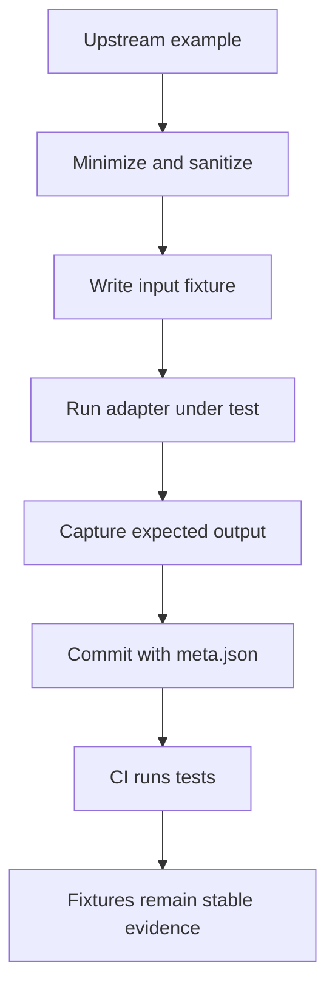

<!-- [KFM_META_BLOCK_V2]
doc_id: kfm://doc/6c5b0f9f-8d6b-4e88-9a31-6d6f0e82c0a5
title: Adapter Test Fixtures
type: standard
version: v1
status: draft
owners: TBD (packages/adapters maintainers)
created: 2026-02-25
updated: 2026-02-25
policy_label: restricted
related:
  - packages/adapters/tests
tags: [kfm, adapters, tests, fixtures]
notes:
  - Directory contract + governance rules for test fixtures used by adapter tests.
[/KFM_META_BLOCK_V2] -->

# Adapter test fixtures
Deterministic, documented inputs/expected outputs used to validate `packages/adapters` behavior in tests.


## Quick navigation
- [Purpose](#purpose)
- [Where this fits](#where-this-fits)
- [Directory contract](#directory-contract)
- [Fixture structure](#fixture-structure)
- [Naming conventions](#naming-conventions)
- [How to add a fixture](#how-to-add-a-fixture)
- [How to use fixtures in tests](#how-to-use-fixtures-in-tests)
- [Updating fixtures safely](#updating-fixtures-safely)
- [Governance and safety rules](#governance-and-safety-rules)
- [Troubleshooting](#troubleshooting)

---

## Purpose
This directory contains **test fixtures** for adapter-layer tests:
- **Inputs** that simulate upstream systems (APIs, files, schemas, edge cases).
- **Expected outputs** (“goldens”) that capture adapter behavior and policy boundaries.
- **Error specimens** to validate failure modes and default-deny behavior.

> **NOTE**
> Fixtures are part of the *test evidence* for adapter behavior. Treat them as governed artifacts: small, intentional, and auditable.

## Where this fits
`packages/adapters/tests/fixtures/` is a shared fixture store for tests in `packages/adapters/tests/**`.

Typical use cases:
- Parsing and normalizing external payloads (JSON, GeoJSON, CSV, XML).
- Verifying adapter mapping to internal contracts.
- Proving redaction/default-deny behavior when inputs are missing, malformed, or sensitive.

---

## Directory contract

### What belongs here
Fixtures **MUST** be:
- **Deterministic**: same input → same output (no timestamps, random IDs, nondeterministic ordering).
- **Minimal**: smallest payload that reproduces the test case.
- **Documented**: include provenance + intent (see [Fixture structure](#fixture-structure)).
- **Safe**: no secrets, no PII, no precise sensitive locations (see [Governance and safety rules](#governance-and-safety-rules)).

Examples of good fixture content:
- Minimal “happy path” payloads.
- Payloads with **known edge cases** (nulls, weird encodings, partial data).
- Explicit **policy boundary tests** (fields that must be dropped/redacted/blocked).

### What must not go here
Fixtures **MUST NOT** include:
- **Secrets**: tokens, API keys, passwords, private certificates.
- **Production exports** (or anything derived from restricted/consent-limited sources without explicit approval).
- Large “data dumps” that don’t add test value.
- Personal data (names, emails, phone numbers, addresses), even if “public”.
- Exact coordinates for vulnerable/private/culturally restricted sites (use coarse/generalized geometry instead).

> **WARNING**
> If you are unsure whether a sample is safe to commit, do not commit it. Use synthetic data or a generalized sample and document the transformation.

---

## Fixture structure

This repo does not require a single rigid layout, but fixtures **SHOULD** follow a consistent “case folder” pattern for traceability:

```text
fixtures/
  <case-name>/
    meta.json            # (recommended) provenance + policy label + notes
    input.*              # upstream payload (JSON/GeoJSON/CSV/…)
    expected.*           # normalized output or golden result
    notes.md             # optional extra context
```

### Recommended `meta.json` schema
Use a small metadata file to keep fixtures self-describing.

```json
{
  "id": "adapter-case-name",
  "title": "Human-readable title of the fixture",
  "purpose": "What behavior this fixture is validating",
  "source": {
    "kind": "synthetic | derived | captured",
    "reference": "Short description or internal link/path (no secrets)",
    "license": "SPDX-ish identifier if known, else 'unknown'"
  },
  "data_profile": {
    "contains_real_user_data": false,
    "contains_precise_locations": false,
    "redactions_applied": ["removed emails", "generalized geometry to ~10km"]
  },
  "policy_label": "public | restricted | ...",
  "created": "2026-02-25",
  "updated": "2026-02-25",
  "integrity": {
    "input_sha256": "…",
    "expected_sha256": "…"
  }
}
```

> **TIP**
> If you don’t want to maintain hashes manually, it’s still valuable to include the rest of the fields (purpose/source/policy). Hashing can be added later.

---

## Naming conventions

### Case folder names
Use lowercase kebab-case:
- ✅ `stac-item-minimal`
- ✅ `geojson-multipolygon-hole`
- ✅ `http-429-retry-after`
- ❌ `TestData1`
- ❌ `Some Fixture`

### File naming (suggested)
- `input.<ext>`: raw upstream payload
- `expected.<ext>`: canonical/normalized output
- `error.<ext>`: expected error shape (only if needed)
- `schema.<ext>`: schema or contract used in the test (rare)

Keep extensions meaningful: `.json`, `.geojson`, `.csv`, `.txt`, `.ndjson`, `.xml`.

---

## How to add a fixture

1. **Create a new case folder**
   - `fixtures/<case-name>/`

2. **Add the smallest input**
   - Save as `input.*`
   - Remove unrelated fields; keep only what the adapter needs to exercise the path.

3. **Add the expected output**
   - Save as `expected.*`
   - Normalize ordering and formatting (consistent whitespace; stable key order if applicable).

4. **Add `meta.json`**
   - Document provenance, safety, and intent.
   - If derived from a real payload, explicitly document the redactions/generalizations.

5. **Wire it into a test**
   - Every fixture should be referenced by at least one test.
   - If no test uses it, it will drift and become untrustworthy.

6. **Run the relevant test suite**
   - Ensure the test passes locally and in CI.

### Definition of done checklist
- [ ] Fixture is minimal and deterministic
- [ ] Fixture includes provenance + policy label (`meta.json` recommended)
- [ ] Fixture contains no secrets/PII/precise sensitive locations
- [ ] Fixture is referenced by at least one test
- [ ] Tests pass

---

## How to use fixtures in tests

Below are patterns you can adapt to your test runner.

### Node (CommonJS) example
```js
const { readFileSync } = require("node:fs");
const { join } = require("node:path");

function readFixture(relPath) {
  return readFileSync(join(__dirname, "fixtures", relPath), "utf8");
}

// Example usage:
const input = JSON.parse(readFixture("stac-item-minimal/input.json"));
```

### Node (ESM) example
```ts
import { readFileSync } from "node:fs";
import { fileURLToPath } from "node:url";
import { dirname, join } from "node:path";

const __dirname = dirname(fileURLToPath(import.meta.url));

export function readFixtureText(relPath: string): string {
  return readFileSync(join(__dirname, "fixtures", relPath), "utf8");
}
```

> **TIP**
> Prefer reading fixtures as UTF-8 text and parsing in-test. This keeps the fixture format explicit and avoids hidden transforms.

---

## Updating fixtures safely

Fixtures should change **only** when:
- The adapter contract intentionally changes, or
- The fixture was wrong and you are fixing it, or
- You are improving determinism/minimality without changing meaning.

Guidelines:
- Prefer a **small, reviewable diff** over large re-recordings.
- If regenerating output, ensure the test asserts the new output is correct (not just “updated”).
- Keep “golden” outputs stable; if they churn, the fixture isn’t doing its job.

If your test runner supports an “update snapshots” mode, use it cautiously:
- Update **only** the affected case(s).
- Review the diffs as if they were code changes.

---

## Governance and safety rules

Fixtures participate in the trust boundary. Apply default-deny:

### Data sensitivity
- Treat all fixture data as **restricted** unless explicitly labeled otherwise.
- Never include private/personally identifying data.
- Never include secrets, credentials, or internal URLs with tokens.

### Location sensitivity
If a fixture includes geometry or coordinates:
- Use synthetic points, or
- Generalize to coarse areas (e.g., simplified polygon, reduced precision), and
- Document the generalization/redaction in `meta.json`.

### Provenance discipline
If a fixture is derived from real-world data:
- Record the source in `meta.json`
- Record license/usage constraints if known
- Record any redaction steps

---

## Troubleshooting

### “Fixture differs across machines”
Common causes:
- Newlines or encoding differences (LF vs CRLF)
- Key ordering in JSON serialization
- Locale-dependent formatting
- Floating point precision

Fixes:
- Normalize line endings
- Ensure stable sort order before writing expected outputs
- Avoid locale formatting; use explicit formats
- Round floats before asserting

### “Fixture is too big”
- Reduce to the minimum reproducer.
- Split into multiple targeted cases.
- Consider compressing only if your tests truly need a large payload.

---

## Appendix: Fixture lifecycle diagram



<details>
<summary>Why we keep fixtures small and documented</summary>

Small fixtures:
- speed up test runs,
- make diffs reviewable,
- reduce the risk of accidentally committing sensitive data, and
- help isolate adapter behavior (instead of testing everything at once).

</details>

---

<sub><a href="#adapter-test-fixtures">Back to top</a></sub>
