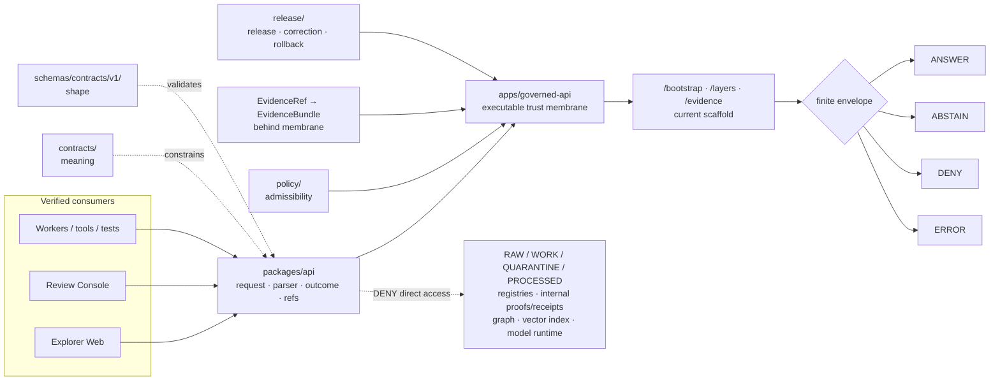

<!-- [KFM_META_BLOCK_V2]
doc_id: kfm://doc/packages-api-readme
title: packages/api/ — Governed API Client-Support Package Boundary
type: readme; package-readme; shared-library-boundary; api-client-support; trust-membrane-adjacent
version: v0.3
status: draft; repository-grounded; canonical-package-lane; README-only; no-package-manifest; no-source-tree; no-dedicated-package-tests; consumer-unverified; subordinate-to-governed-api; non-authoritative
owners: "NEEDS VERIFICATION — CODEOWNERS routes /packages/ to @bartytime4life; no accepted package steward, API package owner, compatibility owner, or independent reviewer assignment was verified"
created: 2026-06-13
updated: 2026-07-23
supersedes: v0.2 documentation at the same path; no package code, manifest, export, schema, contract, policy, route, test, fixture, workflow, runtime behavior, release object, deployment, or public behavior is superseded
prepared_under_prompt: KFM Markdown Engineering, Modernization & GitHub Documentation Implementation Agent v5.0.0
policy_label: "public-doc; packages; api-client-support; shared-library; non-deployable; no-truth-authority; no-schema-authority; no-contract-authority; no-policy-authority; no-evidence-authority; no-lifecycle-authority; no-release-authority; governed-interface-only; finite-outcomes; cite-or-abstain; correction-aware; rollback-aware"
current_path: packages/api/README.md
owning_root: packages/
responsibility: own reusable, non-deployable API client, envelope, request, response, reference, compatibility, and deterministic test-support code shared by verified KFM consumers without becoming the executable API, a second trust membrane, or an authority for contracts, schemas, policy, evidence, lifecycle state, release, correction, rollback, or publication
truth_posture: >
  CONFIRMED target README and prior blob; Directory Rules v1.4 package placement and README contract;
  packages root v0.3 shared-library boundary; CODEOWNERS /packages route; current bounded search returning
  packages/api/README.md as the only package-local result; exact absence at checked paths of package.json,
  pyproject.toml, src/README.md, and tests/packages/api/README.md; RuntimeResponseEnvelope contract, paired
  PROPOSED schema, validator wrapper, Governed API WSGI scaffold, three registered GET routes, fail-closed
  ABSTAIN stub, focused route test, Make targets, and command-bearing api-test workflow / PROPOSED future
  package implementation, generated types, client transport, fixture builders, compatibility adapters, package
  manifest, source layout, test suite, consumer migration, and distribution / CONFLICTED intended
  RuntimeResponseEnvelope client surface versus the current route test validating a DecisionEnvelope-shaped
  subset; package name implying API authority versus its required non-authoritative helper role / UNKNOWN
  implementation language, package manager, exports, imports, consumers, generator, complete recursive tree,
  package-specific CI, release cadence, registry distribution, deployment use, runtime health, and public effect /
  NEEDS VERIFICATION accepted owners, envelope-integration decision, package admission, dependency direction,
  compatibility policy, test and fixture homes, generated-code rules, consumer inventory, and rollback drill
evidence_snapshot:
  repository: bartytime4life/Kansas-Frontier-Matrix
  repository_id: "1059091169"
  visibility: public
  base_ref: main
  base_commit: 7d5b7e80a493fe817f2c5378bb77ab5f247e8d87
  prior_blob: 975956a8fac3e075409728fbf54307bd9eb2babc
  packages_root_blob: 154e1c9a8b841397bceb52e6b4933b241906ab9a
  directory_rules_blob: 2affb080e6f0043867c64c7f06c1ca52030fbd55
  codeowners_blob: dd2a84aa514d8ecd9208bc347f90f9a2ed37dd61
  adr_0004_blob: 11b86c462d474385befba0fb2115af9885f592af
  runtime_response_contract_blob: b81d67dccdd8470e066ab8247eb93c5df67a6679
  runtime_response_schema_blob: 5105d419432a27176a8ee10870d75400cfa2ab8c
  runtime_response_validator_blob: 11ddc64c4299d103b0eef383c2f7bdd3bb12f1f9
  governed_api_readme_blob: 4f21150852f133ba919b11f4f8792185fa870dae
  governed_api_main_blob: bcc8d3a0ddba4b225e962b594d548819df0cbb71
  governed_api_routes_blob: 3418168d0b267160d6ad6dd87f289e880ef4a024
  governed_api_stub_blob: 5d7c137d2e78ddfca35a1356a96333ac2e84952b
  governed_api_route_test_blob: 6474cef4f7378515ab673c288fc9daea19e388a9
  api_workflow_blob: 5ec0ff53cc874935ed8ef5de791b70a52635ef33
  bounded_package_search: "packages/api returned packages/api/README.md and no additional package-local result"
  checked_absent_paths:
    - packages/api/package.json
    - packages/api/pyproject.toml
    - packages/api/src/README.md
    - tests/packages/api/README.md
related:
  - ../README.md
  - ../../apps/governed-api/README.md
  - ../../apps/governed-api/src/governed_api/main.py
  - ../../apps/governed-api/src/governed_api/routes/registry.py
  - ../../apps/governed-api/src/governed_api/stub.py
  - ../../apps/governed-api/tests/test_abstain_routes.py
  - ../../contracts/runtime/runtime_response_envelope.md
  - ../../schemas/contracts/v1/runtime/runtime_response_envelope.schema.json
  - ../../tools/validators/validate_runtime_response_envelope.py
  - ../../fixtures/contracts/v1/runtime/runtime_response_envelope/
  - ../../docs/doctrine/directory-rules.md
  - ../../docs/doctrine/trust-membrane.md
  - ../../docs/doctrine/lifecycle-law.md
  - ../../docs/architecture/governed-api.md
  - ../../docs/adr/ADR-0004-apps-governed-api-is-the-trust-membrane.md
  - ../../.github/CODEOWNERS
  - ../../.github/workflows/api-test.yml
  - ../../Makefile
tags: [kfm, packages, api, client-support, shared-library, governed-api, trust-membrane, runtime-response-envelope, decision-envelope, finite-outcomes, evidence-refs, policy-state, freshness, correction, compatibility, tests, rollback]
notes:
  - "v0.3 is a same-path, documentation-only modernization grounded in current repository evidence."
  - "The first twelve H2 sections follow the Directory Rules README contract used by the current packages root."
  - "The package remains README-only at checked and indexed paths; this document does not create or imply implementation."
  - "The adjacent Governed API has a bounded three-route WSGI scaffold that returns ABSTAIN / NOT_IMPLEMENTED; this is fail-closed readiness evidence, not a complete trust membrane."
  - "The current route test validates a DecisionEnvelope-shaped subset, while RuntimeResponseEnvelope remains the intended client-facing contract family; package generation is held until that integration is resolved."
  - "No generated provenance receipt is added because the authorized change is limited to this README."
[/KFM_META_BLOCK_V2] -->

<a id="top"></a>
<a id="packages-api"></a>

# `packages/api/` — Governed API Client-Support Package Boundary

> **One-line purpose.** Define the reusable, non-deployable API client-support lane for KFM applications, workers, tools, tests, and examples—while preserving `apps/governed-api/` as the executable trust membrane and keeping contracts, schemas, policy, evidence, lifecycle state, release, correction, and rollback in their authority roots.

<p>
  <a href="#status"></a>
  <a href="#authority-level"></a>
  <a href="#status"></a>
  <a href="#current-adjacent-governed-api-scaffold"></a>
  <a href="#runtimeresponseenvelope-profile"></a>
  <a href="#envelope-integration-gap"></a>
  <a href="#trust-membrane-flow"></a>
</p>

> [!IMPORTANT]
> **`packages/api/` is currently a documented boundary, not an implemented package.** Current indexed and exact-path evidence confirms this README and does not confirm a package manifest, source tree, exports, package-local tests, consumers, or distribution artifact.

> [!CAUTION]
> **The adjacent Governed API scaffold is real but incomplete.** It registers `GET /bootstrap`, `GET /layers`, and `GET /evidence`; each currently returns `ABSTAIN` with `NOT_IMPLEMENTED`. That is useful fail-closed behavior, not evidence that policy, evidence resolution, release projection, authorization, correction, audit, or deployment is complete.

> [!WARNING]
> **A shared API helper must never become a bypass around the trust membrane.** No code in this package may directly expose RAW, WORK, QUARANTINE, PROCESSED, unpublished candidates, source registries, internal proofs or receipts, graph or vector internals, object-store paths, model runtimes, private prompts, restricted geometry, or secret-bearing endpoints to ordinary clients.

**Quick navigation**

| Required package contract | Current evidence | Design and change control |
|---|---|---|
| [Purpose](#purpose) · [Authority](#authority-level) · [Status](#status) · [Belongs](#what-belongs-here) · [Does not belong](#what-does-not-belong-here) | [Inputs](#inputs) · [Outputs](#outputs) · [Validation](#validation) · [Review](#review-burden) · [Related](#related-folders) · [ADRs](#adrs) · [Last reviewed](#last-reviewed) | [Context](#bounded-context-and-ubiquitous-language) · [Flow](#trust-membrane-flow) · [Envelope](#runtimeresponseenvelope-profile) · [Gap](#envelope-integration-gap) · [Admission](#package-admission-and-maturity) · [Security](#security-and-public-safe-behavior) · [Rollback](#compatibility-correction-and-rollback) · [Open work](#open-verification-register) |

---

## Purpose

`packages/api/` is the bounded shared-library lane for reusable code that helps verified consumers call, parse, validate, test, and migrate governed KFM API interfaces.

A future implementation may support:

- bounded request builders for verified routes;
- finite-outcome types and exhaustive outcome guards;
- `RuntimeResponseEnvelope` parsing and validation helpers;
- safe references for evidence, policy, release, freshness, correction, withdrawal, and rollback state;
- citation, limitation, redaction, and generalization display helpers;
- deterministic, no-network client doubles and fixture builders;
- schema-generated types with traceable generator inputs and regeneration rules;
- timeout, cancellation, retry, and safe error helpers whose behavior matches route semantics;
- narrowly scoped compatibility adapters with explicit retirement and rollback criteria.

The package must remain **shared and non-deployable**. It does not listen on a port, register public routes, authenticate callers, evaluate policy, resolve EvidenceBundles, invoke models, read lifecycle stores, approve releases, or publish claims.

```text
packages/api/             = reusable API client and envelope support
apps/governed-api/        = executable dynamic trust membrane
contracts/                = object-family meaning
schemas/contracts/v1/     = machine-checkable shape
policy/                   = allow / deny / restrict / hold / abstain authority
data/                     = lifecycle records, evidence, receipts, proofs, catalogs, published artifacts
release/                  = release, correction, withdrawal, and rollback decisions
runtime/                  = adapters behind the governed API
```

This README defines a package boundary. It does not admit a dependency, select a language, create a package, approve an API, or establish runtime behavior.

[Back to top](#top)

---

## Authority level

**Canonical shared-implementation sublane; non-authoritative for truth, meaning, machine shape, policy, evidence, lifecycle state, release, deployment, and publication.**

| Question | Answer | Evidence posture |
|---|---|---:|
| Why `packages/`? | The root owns reusable, non-deployable implementation libraries shared across verified consumers. | **CONFIRMED** placement and parent-root contract |
| Why `api/`? | Reusable API client and envelope support can reduce duplication without becoming the server or trust authority. | **PROPOSED** package role; README path confirmed |
| Is this the API server? | No. `apps/governed-api/` owns the executable dynamic trust membrane. | **CONFIRMED** repository boundary; ADR remains proposed |
| May this package define object meaning? | No. It consumes contracts from `contracts/`. | **CONFIRMED** authority split |
| May it define canonical machine shape? | No. It may generate or hand-write types subordinate to `schemas/contracts/v1/`. | **CONFIRMED** authority split |
| May it evaluate policy or evidence authoritatively? | No. It preserves server-derived states and references only. | **CONFIRMED** trust posture |
| May it approve release, correction, withdrawal, or rollback? | No. It preserves references and client obligations only. | **CONFIRMED** release separation |
| May it read canonical or lifecycle stores? | No. Ordinary client flows terminate at governed interfaces and released artifacts. | **CONFIRMED** trust-membrane doctrine |
| Does package distribution publish KFM knowledge? | No. A wheel, workspace package, tarball, or registry object is software distribution, not lifecycle promotion or KFM publication. | **CONFIRMED** parent packages boundary |

### Anti-collapse rule

```text
shared package       != executable API
client helper        != trust membrane
DTO                  != semantic contract
generated type       != schema authority
reason-code helper   != policy decision
EvidenceRef          != EvidenceBundle closure
release reference    != release approval
successful request   != permission to render
passing package test != evidence, policy, or release proof
```

[Back to top](#top)

---

## Status

### Repository snapshot

| Field | Current value |
|---|---|
| Repository | `bartytime4life/Kansas-Frontier-Matrix` |
| Base ref | `main` |
| Evidence commit | `7d5b7e80a493fe817f2c5378bb77ab5f247e8d87` |
| Prior README blob | `975956a8fac3e075409728fbf54307bd9eb2babc` |
| README version | `v0.3` |
| CODEOWNERS route | `/packages/` → `@bartytime4life` |
| Accepted package steward | **NEEDS VERIFICATION** |
| Package manifest | **NOT PRESENT at checked `package.json` and `pyproject.toml` paths** |
| Source tree | **NOT ESTABLISHED; `packages/api/src/README.md` absent at checked path** |
| Package-local tests | **NOT ESTABLISHED; `tests/packages/api/README.md` absent at checked path** |
| Indexed package-local content | This README only |
| Verified package consumers | **UNKNOWN** |
| Package build or distribution | **UNKNOWN** |
| Runtime or public effect | None established by this README |

### Current bounded package surface

```text
packages/api/
└── README.md
```

The bounded search and exact checks support this inventory. They do not prove that no unindexed, generated, uncommitted, historical, or other-branch file exists.

### Current adjacent Governed API scaffold

| Surface | Confirmed repository evidence | Bounded conclusion |
|---|---|---|
| WSGI application | `apps/governed-api/src/governed_api/main.py` serves a route registry and returns `404` or `405` safely. | A small executable scaffold exists. |
| Registered routes | Registry contains `/bootstrap`, `/layers`, and `/evidence`. | Three GET route handlers are implemented as scaffolds. |
| Route behavior | Each route calls the shared stub envelope builder. | All current successful route calls are fail-closed placeholders. |
| Stub result | `ABSTAIN`, `NOT_IMPLEMENTED`, empty `evidence_refs`, deterministic IDs, and a zero placeholder `spec_hash`. | No route returns an evidence-backed `ANSWER`. |
| Focused route test | Iterates every registered route and checks deterministic ABSTAIN behavior. | The fail-closed route set has focused test coverage. |
| API workflow | Runs `make governed-api-smoke` and the focused route-envelope test on Python 3.11. | CI wiring is command-bearing; a green run remains test evidence only. |
| RuntimeResponseEnvelope contract/schema | Paired contract and PROPOSED schema exist with four finite outcomes and closed additional properties. | Intended client-facing shape exists as a proposed authority pair. |
| Envelope integration | Current route test validates against `decision_envelope.schema.json`, not the separate RuntimeResponseEnvelope schema. | Integration is **partial / conflicted** and blocks premature package type generation. |

### Safe conclusion

```text
packages/api implementation       = README_ONLY
governed API implementation       = BOUNDED_WSGI_SCAFFOLD
registered route count            = 3
current successful route outcome  = ABSTAIN / NOT_IMPLEMENTED
package consumers                 = UNKNOWN
client envelope integration       = PARTIAL / NEEDS DECISION
release or publication effect     = NONE
```

### Truth labels

| Label | Meaning here |
|---|---|
| `CONFIRMED` | Verified from current repository files, exact path probes, or bounded search. |
| `PROPOSED` | Recommended package shape or behavior not implemented or accepted. |
| `CONFLICTED` | Current surfaces create incompatible expectations that require a decision or coordinated change. |
| `UNKNOWN` | Not established from inspected evidence. |
| `NEEDS VERIFICATION` | Checkable but not yet proven strongly enough for reliance. |
| `DENY` | A prohibited trust, exposure, release, or publication interpretation. |

[Back to top](#top)

---

## What belongs here

Appropriate future contents include reusable, non-deployable implementation code for:

### Contract-aligned client models

- finite-outcome discriminated unions or equivalent exhaustive variants;
- `RuntimeResponseEnvelope` models generated from or checked against the canonical schema;
- opaque reference models for EvidenceRef, PolicyDecisionRef, ReleaseManifestRef, CorrectionNoticeRef, WithdrawalNoticeRef, and RollbackCardRef;
- safe limitation, citation, freshness, correction, redaction, and generalization display models;
- version and compatibility metadata whose authority remains external.

### Governed client behavior

- request builders for verified route contracts;
- response parsers that fail closed on malformed or unknown trust-bearing fields;
- exhaustive `ANSWER` / `ABSTAIN` / `DENY` / `ERROR` dispatch;
- transport abstractions that preserve authentication and authorization boundaries without storing credentials;
- timeout and cancellation helpers;
- retries only for explicitly idempotent, retry-safe operations;
- safe client errors that do not expose internal paths, stack traces, prompts, secrets, or blocked data.

### Deterministic test support

- no-network mock clients;
- public-safe synthetic payload builders;
- valid and invalid envelope builders;
- assertions proving negative outcomes remain negative;
- schema-drift and generated-type drift checks;
- compatibility round-trip tests or explicit semantic-loss reports.

### Migration support

- narrowly scoped adapters for a named consumer migration;
- deprecation markers and removal criteria;
- version negotiation bounded by accepted contracts;
- explicit fallback and rollback instructions.

**Placement test:**

> A file may belong here when it is reusable API client or envelope-support implementation, serves more than one verified consumer or a clearly shared bounded context, remains independently testable, and cannot make policy, evidence, lifecycle, release, or publication decisions.

[Back to top](#top)

---

## What does not belong here

| Do not place here | Correct home or posture |
|---|---|
| Public or semi-public route handlers | `apps/governed-api/` |
| Browser route rendering | `apps/explorer-web/` |
| Steward or review application code | `apps/review-console/` or accepted app root |
| Source acquisition and admission | `connectors/` plus governed intake controls |
| Executable transformation logic | `pipelines/` |
| Declarative pipeline definitions | `pipeline_specs/` |
| Canonical object meaning | `contracts/` |
| Canonical machine schemas | `schemas/contracts/v1/` |
| Policy bundles or authoritative policy decisions | `policy/` |
| EvidenceBundle creation, proof packs, or evidence authority | Governed evidence services and `data/proofs/` |
| Source descriptors or source activation | `data/registry/` and source-policy homes |
| RAW, WORK, QUARANTINE, PROCESSED, catalog, triplet, or published records | `data/<phase>/` |
| Release approval, correction approval, withdrawal, or rollback authority | `release/` |
| Local model or provider adapters | `runtime/`, behind the governed API |
| Repository-wide validators or generators | `tools/` |
| One-off operational helpers | `scripts/` |
| Package test instances | `tests/packages/api/` after its home is verified |
| Package fixture instances | `fixtures/packages/api/` after its home is verified |
| Contract-schema fixture families | Existing `fixtures/contracts/v1/` authority lanes |
| Secrets, credentials, cookies, private keys, raw prompts, private reasoning, protected coordinates, or restricted source content | Never commit; use approved secret, privacy, and sensitivity controls |
| Mock or generated responses represented as truth | Forbidden |
| A second `api/`, `client-api/`, schema, policy, source, evidence, or release authority | Requires ADR or migration decision; default is **DENY** |

[Back to top](#top)

---

## Inputs

This package may consume only explicit, versioned, reviewable inputs.

| Input family | Authority source | Package posture |
|---|---|---|
| Runtime response meaning | `contracts/runtime/runtime_response_envelope.md` | Consume semantics; do not redefine them. |
| Runtime response shape | `schemas/contracts/v1/runtime/runtime_response_envelope.schema.json` | Generate or validate types against a pinned schema identity. |
| Evidence references | EvidenceRef schema and governed API payload | Preserve as opaque, policy-safe references; do not claim resolution. |
| Policy state | Governed API response and accepted policy vocabulary | Treat as server-derived and non-overridable. |
| Release/correction state | Governed release and correction references | Preserve IDs, versions, digests, and obligations. |
| Route definitions | Verified Governed API route contracts | Do not infer route availability from README text alone. |
| Client configuration | Named consumer config or environment boundary | Accept non-secret values and references-by-name only. |
| Generated-code inputs | Canonical schema, generator version, command, and configuration | Require deterministic regeneration and drift checks. |
| Synthetic fixtures | Public-safe package fixture lane | Clearly label as non-authoritative and no-network. |

### Input rules

- Reject or safely surface unknown trust-bearing fields according to the accepted compatibility policy.
- Do not accept caller-controlled evidence closure, policy approval, release approval, correction state, or freshness upgrades.
- Do not accept internal filesystem paths, raw object-store handles, model endpoints, or canonical-store locators as public client references.
- Keep secret material outside repository fixtures and generated code.
- Distinguish request identity, response identity, evidence refs, policy refs, release refs, correction refs, and audit refs.
- Preserve distinct time kinds when supplied; do not collapse source, observation, retrieval, response, release, and correction time into one generic timestamp.

[Back to top](#top)

---

## Outputs

Permitted package outputs are reusable implementation values, not authoritative records.

| Output | Required posture |
|---|---|
| Bounded request object | Matches a verified route contract and contains no client-created authority. |
| Parsed finite envelope | Preserves every required trust-bearing field and exactly one finite outcome. |
| Safe client result | Maps malformed or unknown payloads to an explicit safe failure, never implicit success. |
| Generated type artifact | Traceable to schema digest, generator version, command, and regeneration rule. |
| Reference/display model | Preserves opaque evidence, policy, release, freshness, and correction references. |
| Synthetic fixture or mock response | Deterministic, no-network, public-safe, and visibly non-authoritative. |
| Compatibility result | Reports version, loss, deprecation, and retirement state explicitly. |
| Diagnostic metadata | Minimized, redacted, non-secret, and free of private reasoning or restricted payloads. |

### Output prohibitions

Package output must not:

- convert `ABSTAIN`, `DENY`, or `ERROR` into an answer-like success;
- invent EvidenceRefs, citations, release IDs, policy states, or correction states;
- silently drop unknown obligations or trust-bearing fields;
- expose stack traces, internal paths, raw prompts, adapter internals, secrets, or blocked content;
- label a successful parse, request, test, or package build as evidence closure or release approval;
- mutate lifecycle or release records;
- create a public route or direct browser-to-runtime path.

[Back to top](#top)

---

## Validation

### Confirmed current validation surfaces

| Check | Repository command or path | What it supports | Current package relevance |
|---|---|---|---|
| RuntimeResponseEnvelope validator | `python tools/validators/validate_runtime_response_envelope.py` | Valid/invalid fixture checks against the proposed runtime-response schema. | Canonical shape reference; not a package test. |
| Aggregate schema validation | `make schemas` | Runs configured repository schema validators. | Detects schema/fixture regressions relevant to future generated types. |
| Schema and contract tests | `make test` | Runs repository schema and contract tests. | Supports authority-pair integrity, not package behavior. |
| Governed API smoke suite | `make governed-api-smoke` | Runs `apps/governed-api/tests`. | Adjacent server scaffold signal. |
| Focused route-envelope test | `python -m pytest apps/governed-api/tests/test_abstain_routes.py -q --strict-config --strict-markers` | Confirms all registered scaffold routes return deterministic ABSTAIN behavior. | Exposes current DecisionEnvelope-shaped subset integration. |
| API workflow | `.github/workflows/api-test.yml` | Runs both command-bearing API checks on Python 3.11. | CI orchestration; not package implementation proof. |
| Package-local suite | `tests/packages/api/` | Would prove package behavior. | **NOT ESTABLISHED** |
| Generated-type drift check | Future accepted generator command | Would compare generated outputs to canonical schema inputs. | **NOT ESTABLISHED** |
| Consumer integration tests | Verified consuming app/test paths | Would prove clients preserve outcomes and obligations. | **UNKNOWN** |

### Required first package tests

Before package code is described as usable, deterministic coverage should include:

```text
ANSWER with required support references
ABSTAIN remains non-answer
DENY remains non-answer and leaks no blocked content
ERROR remains safe and contains no internals
missing or unknown outcome fails closed
invalid id, spec_hash, version, or date-time
unknown additional property behavior
empty and non-empty EvidenceRef arrays
unresolved or unauthorized evidence posture
stale freshness state
corrected, superseded, withdrawn, and rollback state
redaction and generalization obligations
safe reason-code handling
timeout and cancellation
retry allowed only for verified idempotent operations
no direct lifecycle-store access
no direct model-runtime access
compatibility round-trip or explicit semantic loss
schema-to-generated-type drift
```

### Non-vacuity rule

A passing check proves only its declared assertion. It does not prove:

- source authority or evidence sufficiency;
- policy correctness;
- route authorization;
- release approval;
- sensitive-data safety outside tested cases;
- citation support for a claim;
- deployment, monitoring, or operational readiness;
- correction or rollback execution;
- KFM publication.

### Documentation validation for this README

A documentation-only update should verify:

- the complete file and rendered heading structure;
- relative links and anchors;
- truth labels and evidence snapshot consistency;
- no invented package implementation or ownership;
- no claim that an ADR, workflow, schema, test, or route is more mature than current evidence;
- remote diff scope and rollback target.

[Back to top](#top)

---

## Review burden

`/packages/` currently routes to `@bartytime4life` through CODEOWNERS. That routing is a GitHub review request mechanism, not proof of stewardship assignment, independent review, approval, or release authority.

| Change class | Minimum review concern | Additional review trigger |
|---|---|---|
| README clarification | Package boundary, repository evidence, links, no overclaiming. | Docs/package reviewer. |
| New pure helper | API semantics, deterministic tests, dependency direction. | Package/API consumer owner. |
| New generated types | Contract/schema alignment, generator pin, drift checks, compatibility. | Contract and schema reviewers. |
| Transport/client implementation | Authentication boundary, retries, timeouts, safe errors, telemetry. | Security and governed-API reviewers. |
| Evidence, policy, release, or correction refs | No authority fabrication or dropped obligations. | Evidence, policy, release, and correction reviewers. |
| Compatibility adapter | Semantic loss, migration window, deprecation, retirement, rollback. | All affected consumer owners. |
| Sensitive-domain payload support | Redaction, generalization, consent, rights, exact-location and living-person protections. | Applicable sensitivity/domain reviewer. |
| Package distribution | Supply chain, provenance, versioning, consumer pinning. | Security/supply-chain reviewer; still not KFM publication approval. |

High-impact changes include any modification that can reinterpret a finite outcome, suppress evidence or policy obligations, weaken unknown-field handling, alter correction state, expose internal locations, or create a second public path.

[Back to top](#top)

---

## Related folders

| Surface | Responsibility | Relationship to `packages/api/` |
|---|---|---|
| [`packages/`](../README.md) | Canonical shared-library root. | Parent package admission, maturity, dependency, compatibility, and distribution contract. |
| [`apps/governed-api/`](../../apps/governed-api/README.md) | Executable dynamic trust membrane. | The only normal dynamic public path; future client helpers call this boundary. |
| [`apps/explorer-web/`](../../apps/explorer-web/README.md) | Public/semi-public map-first client. | Candidate consumer; imports remain unverified. |
| [`apps/review-console/`](../../apps/review-console/README.md) | Role-gated review client. | Candidate consumer; authorization remains server-side. |
| [`contracts/runtime/`](../../contracts/runtime/README.md) | Runtime object-family meaning. | Defines envelope semantics that package code must preserve. |
| [`schemas/contracts/v1/runtime/`](../../schemas/contracts/v1/runtime/README.md) | Runtime machine shapes. | Canonical source for generated or hand-written package types. |
| [`policy/`](../../policy/README.md) | Admissibility and obligations. | Package preserves policy-derived state; it does not decide. |
| [`runtime/`](../../runtime/README.md) | Internal adapters and harnesses. | Must remain behind the Governed API; never a direct package/browser target. |
| [`data/`](../../data/README.md) | Lifecycle records, receipts, proofs, catalogs, and published artifacts. | Direct ordinary-client access is forbidden. |
| [`release/`](../../release/README.md) | Release, correction, withdrawal, and rollback decisions. | Package may preserve references and invalidate stale client state. |
| [`tools/validators/`](../../tools/validators/README.md) | Repository-wide validation tools. | Owns canonical validator executables; package may wrap but not duplicate authority. |
| [`tests/`](../../tests/README.md) | Enforceability proof. | Candidate home for package tests once verified. |
| [`fixtures/`](../../fixtures/README.md) | Deterministic valid/invalid samples. | Candidate home for package-specific fixtures; contract fixtures remain separate. |
| [`packages/citation/`](../citation/README.md) | Citation and EvidenceRef helper boundary. | Potential overlap must be resolved by explicit dependency direction, not duplicated helpers. |
| [`packages/envelopes/`](../envelopes/README.md) | Envelope helper boundary. | Potential overlap is **NEEDS VERIFICATION** before package API primitives are created. |
| [`packages/evidence-resolver/`](../evidence-resolver/README.md) | Evidence-resolution support behind governed interfaces. | API package may call a governed client method, not resolve internal evidence directly. |

### Overlap rule

Before adding an API helper, inspect sibling package responsibilities. Do not duplicate citation, envelope, evidence-resolution, schema-registry, identity, hashing, temporal, redaction, or policy-runtime logic merely because an API client needs it.

[Back to top](#top)

---

## ADRs

| Decision record | Current relevance | Status posture |
|---|---|---|
| [`ADR-0004 — apps/governed-api is the trust membrane`](../../docs/adr/ADR-0004-apps-governed-api-is-the-trust-membrane.md) | Defines the proposed single dynamic public trust boundary and no-parallel-API rule. | Document is current and repository-grounded; effective decision remains **PROPOSED**, not accepted. |
| [`ADR-0001 — schema home`](../../docs/adr/ADR-0001-schema-home--schemas-contracts-v1-is-canonical.md) | Keeps machine-shape authority under `schemas/contracts/v1/`. | Consult current ADR status before package generation. |
| [`ADR-0002 — contracts versus schemas`](../../docs/adr/ADR-0002-contracts-vs-schemas-split.md) | Separates semantic meaning from executable shape. | Package consumes both and owns neither. |
| [`ADR-0019 — AI adapter contract and finite envelopes`](../../docs/adr/ADR-0019-ai-adapter-contract-and-finite-envelopes.md) | Constrains finite runtime surfaces and provider-neutral behavior. | Relevant when client helpers expose AI-assisted outcomes. |
| [`ADR-0020 — ABSTAIN is first-class`](../../docs/adr/ADR-0020-abstain-is-a-first-class-decision.md) | Prevents coercion of insufficient support into success. | Package outcome dispatch must preserve ABSTAIN. |
| [`ADR-0025 — public clients never read canonical/internal stores`](../../docs/adr/ADR-0025-public-client-never-reads-canonical-internal-stores.md) | Governs dependency direction and public-path denial. | Package design must make bypass structurally difficult. |

### ADR triggers

An ADR or explicit accepted decision is required before:

- creating a second API server, API authority, schema home, policy home, evidence home, or public path;
- choosing conflicting parallel Python and TypeScript implementations;
- changing the public finite-outcome vocabulary;
- collapsing DecisionEnvelope and RuntimeResponseEnvelope semantics;
- moving package tests or fixtures into a competing canonical home;
- introducing a compatibility root or long-lived mirror;
- allowing direct client access to internal stores or runtimes.

[Back to top](#top)

---

## Last reviewed

| Field | Value |
|---|---|
| Review date | 2026-07-23 |
| Evidence base | `main@7d5b7e80a493fe817f2c5378bb77ab5f247e8d87` |
| Review type | Same-path, repository-grounded README modernization |
| Package implementation observed | README only |
| Adjacent API implementation observed | Three-route, fail-closed WSGI scaffold |
| CI execution performed in this documentation update | None claimed; remote PR checks are separate evidence |
| Runtime or deployment inspected | No |
| Release or publication state changed | No |

Re-review this document when any of the following changes:

- a package manifest, source tree, export, test, fixture, generator, or consumer appears;
- the Governed API route set or envelope shape changes;
- ADR-0004 or related envelope/public-client decisions change status;
- DecisionEnvelope and RuntimeResponseEnvelope integration is resolved;
- package ownership, dependency direction, distribution, or compatibility policy is accepted;
- a security, sensitivity, correction, or rollback incident changes required behavior;
- current links, paths, commands, or evidence snapshot become stale.

[Back to top](#top)

---

## Bounded context and ubiquitous language

Within KFM, `packages/api/` means **reusable client-side or cross-application support for governed API contracts**.

It does not mean an HTTP server, route registry, authorization service, policy engine, evidence resolver, data-access layer, publication system, or canonical schema/contract home.

| Term | Meaning in this package boundary |
|---|---|
| **Governed API** | The executable dynamic trust membrane under `apps/governed-api/`. |
| **API client helper** | Reusable code that calls or interprets a verified governed route without bypassing it. |
| **RuntimeResponseEnvelope** | Intended client-facing finite-outcome envelope constrained by its contract and schema. |
| **DecisionEnvelope** | Decision-oriented envelope currently used by the focused scaffold route test; not silently interchangeable with RuntimeResponseEnvelope. |
| **Finite outcome** | Exactly one of `ANSWER`, `ABSTAIN`, `DENY`, or `ERROR`. |
| **EvidenceRef** | A reference carried by a response; not EvidenceBundle closure by itself. |
| **Policy state** | Server-derived admissibility state preserved by the client. |
| **Freshness** | Explicit current/stale/degraded posture; not inferred from request success. |
| **Correction state** | Correction, supersession, withdrawal, or rollback posture that clients must preserve. |
| **Reason code** | Controlled, safe explanation; never blocked content, stack trace, or private reasoning. |
| **Synthetic fixture** | Deterministic public-safe test data; never production evidence. |
| **Compatibility adapter** | Temporary, reviewable translation with explicit loss, retirement, and rollback behavior. |

A vocabulary change that changes semantics is a model and contract change, not a cosmetic package refactor.

[Back to top](#top)

---

## Trust-membrane flow



The dotted edge is a prohibition. The package should make the governed path easy and the bypass path impossible or visibly invalid.

[Back to top](#top)

---

## RuntimeResponseEnvelope profile

The current paired schema is draft 2020-12, marked `PROPOSED`, and closes additional properties.

| Required field | Current schema shape | Package obligation |
|---|---|---|
| `id` | Lowercase stable identifier pattern | Preserve byte-for-byte; never embed secrets or private context. |
| `spec_hash` | `sha256:` plus 64 lowercase hex characters | Preserve exactly and expose drift. |
| `version` | String | Use for explicit compatibility behavior. |
| `issued_at` | Date-time string | Preserve emission time; do not make stale output appear current. |
| `outcome` | `ANSWER`, `ABSTAIN`, `DENY`, or `ERROR` | Dispatch exhaustively; unknown or missing values fail closed. |
| `reason_code` | String | Preserve controlled safe reasons; do not expand with restricted internals. |
| `evidence_refs` | Array of canonical EvidenceRef objects | Preserve refs; do not imply they resolved unless the server established it. |
| `policy_state` | String | Treat as server-derived and non-overridable. |
| `freshness` | String | Preserve stale/degraded posture. |
| `correction_state` | String | Preserve correction, supersession, withdrawal, and rollback posture. |

`additionalProperties: false` means package models must not silently discard unfamiliar fields. Forward compatibility needs an explicit, reviewed policy rather than permissive parsing that erases trust-bearing obligations.

### Finite outcome behavior

| Outcome | Required client posture | Forbidden behavior |
|---|---|---|
| `ANSWER` | Render or forward only with supplied support, policy, freshness, correction, limitation, and citation context. | Treating the enum as unconditional truth. |
| `ABSTAIN` | Preserve the reason and show no inferred answer. | Converting insufficient support into partial success. |
| `DENY` | Preserve safe denial without blocked-payload leakage. | Inferring or displaying restricted details. |
| `ERROR` | Preserve a safe error and retry only when endpoint semantics permit. | Exposing stack traces, raw prompts, paths, secrets, or adapter internals. |

There is no fallback public outcome. Malformed or unknown envelopes fail safely.

[Back to top](#top)

---

## Envelope integration gap

Current repository evidence exposes a material integration gap:

1. `RuntimeResponseEnvelope` has a dedicated contract, schema, fixture family, and validator.
2. The Governed API stub emits fields from both decision-oriented and runtime-response-oriented vocabularies.
3. `test_abstain_routes.py` validates the stub payload against `decision_envelope.schema.json` through a subset assertion.
4. The intended client package boundary is described around `RuntimeResponseEnvelope`.

This means a package generator or strict parser cannot safely assume the current scaffold payload is the final RuntimeResponseEnvelope.

### Required resolution before package type generation

A coordinated change should decide one of these explicit paths:

- the route surface returns a complete RuntimeResponseEnvelope and validates against its schema;
- the route surface returns a DecisionEnvelope that is wrapped or projected into RuntimeResponseEnvelope at a named boundary;
- the two object families are revised through contracts, schemas, fixtures, validators, tests, ADRs, and compatibility notes.

Do **not** resolve the gap inside package code through silent field dropping, synthetic defaults, permissive dictionaries, or outcome coercion.

[Back to top](#top)

---

## Package admission and maturity

### Admission prerequisites

Before implementation files are added, establish:

- one implementation language and package manager;
- one package name and import path;
- verified consumers and reuse justification;
- dependency direction relative to `citation`, `envelopes`, `evidence-resolver`, `policy-runtime`, `schema-registry`, `identity`, `hashing`, `temporal`, and `redaction` packages;
- accepted envelope integration and compatibility posture;
- source versus generated-code boundary;
- schema/generator identity and deterministic regeneration command;
- package-specific test and fixture homes;
- ownership and review burden;
- build, versioning, distribution, deprecation, and rollback approach.

**Gate:** one manifest, one source layout, no parallel Python/TypeScript implementations, no duplicate authority, and no consumer migration before deterministic negative-state tests exist.

### Maturity model

| Level | Required evidence | Current status |
|---|---|---:|
| `M0 — documented boundary` | README, authority split, open questions. | **CONFIRMED** |
| `M1 — admitted package` | Manifest, language, package name, owners, consumers, dependency direction. | **NOT ESTABLISHED** |
| `M2 — finite primitives` | Four outcomes, exhaustive guards, malformed-envelope failure, no-network tests. | **NOT ESTABLISHED** |
| `M3 — schema-aligned models` | RuntimeResponseEnvelope integration resolved; types match canonical shape; drift check exists. | **BLOCKED by integration gap** |
| `M4 — deterministic client` | Mock-first client, public-safe fixtures, timeout/cancellation, no internal access. | **NOT ESTABLISHED** |
| `M5 — consumer integration` | One verified consumer migrated with all finite outcomes and rollback. | **UNKNOWN** |
| `M6 — supported package` | CI, compatibility, security, supply-chain, release notes, deprecation, rollback drill. | **UNKNOWN** |

No badge, README, manifest, version, import, or green unrelated workflow may skip these maturity levels.

### Candidate future shape

The exact language remains undecided. Do not create this tree until package admission is complete.

```text
packages/api/
├── README.md
├── <one accepted package manifest>
├── src/
│   ├── <one verified entry point>
│   ├── outcomes/
│   ├── envelopes/
│   ├── clients/
│   ├── refs/
│   ├── errors/
│   └── compatibility/
└── generated/                 # only when an accepted generator owns it
```

Tests and fixtures remain in their canonical roots unless an accepted repository decision establishes another home.

[Back to top](#top)

---

## Security and public-safe behavior

A future package implementation must preserve these controls:

- no credentials, tokens, cookies, private keys, signed URLs, or secret-bearing examples;
- no raw prompts, hidden reasoning, chain-of-thought, stack traces, local paths, or adapter internals in public errors;
- no exact sensitive geometry, living-person private data, DNA/genomic details, restricted cultural material, rare-species locations, or critical-infrastructure details in package fixtures;
- no client-controlled policy, evidence, review, release, freshness, correction, redaction, or generalization authority;
- no browser-direct calls to model runtimes, internal stores, graph systems, vector indexes, object stores, or source endpoints;
- no unsafe deserialization, dynamic code execution, or silent untyped fallback;
- no full restricted payload logging or telemetry;
- no helper that turns internal filesystem or object-store references into public URLs;
- no automatic retry of non-idempotent operations;
- no cache that hides correction, withdrawal, stale, or rollback state.

Fixtures must be synthetic or explicitly public-safe, deterministic, no-network, small, non-authoritative, and reviewed when they model denial, redaction, or generalization.

Security success is not evidence success, and schema validity is not authorization.

[Back to top](#top)

---

## Compatibility, correction, and rollback

### Compatibility rules

- Prefer additive changes only when semantics remain safe.
- Never silently drop evidence, policy, freshness, correction, limitation, or redaction fields.
- Never translate `ABSTAIN`, `DENY`, or `ERROR` into success.
- Treat outcome, EvidenceRef, policy-state, freshness, and correction-state changes as high impact.
- Update contracts and schemas in their authority roots before generating package types.
- Record generator and schema digests in generated artifacts or their manifest.
- Bound compatibility windows and name retirement criteria.
- Preserve the ability to disable or revert each consumer migration independently.

### Correction propagation

A client package must not make corrected or withdrawn information appear current. Where the API supplies correction or rollback state, the package should:

- preserve the state and references;
- invalidate or downgrade cached content;
- prevent stale data from being promoted into answer-like UI;
- expose a safe reason or obligation;
- preserve audit-safe identifiers for review.

### Rollback

For this documentation-only change, revert the README commit through normal Git history and re-run documentation checks.

For future package code:

1. identify the last compatible package, schema, and consumer versions;
2. disable or revert the affected consumer integration;
3. restore the prior package artifact or commit;
4. invalidate incompatible caches and generated outputs;
5. preserve correction, withdrawal, and rollback references;
6. rerun contract, schema, package, consumer, security, and negative-state tests;
7. record the rollback reason and affected software releases.

Do not force-push, rewrite shared history, or hide a failed migration.

[Back to top](#top)

---

## Definition of done

### This README revision

- [x] Preserves `packages/api/` as shared, reusable, and non-deployable.
- [x] Follows the current package README section contract.
- [x] Grounds the package surface at a current commit.
- [x] Distinguishes README-only package maturity from the adjacent executable scaffold.
- [x] Records the three current fail-closed routes without calling them complete.
- [x] Preserves `apps/governed-api/` as the executable trust membrane.
- [x] Documents contract, schema, validator, test, workflow, and CODEOWNERS evidence.
- [x] Surfaces the DecisionEnvelope versus RuntimeResponseEnvelope integration gap.
- [x] Preserves finite outcomes, evidence, policy, freshness, correction, security, compatibility, and rollback obligations.
- [x] Creates no package code, manifest, tests, fixtures, workflow, release object, or publication state.

### Future supported package

- [ ] Language, manifest, package name, owners, and consumers are accepted.
- [ ] Dependency direction and overlap with sibling packages are resolved.
- [ ] Envelope integration is resolved in contracts, schemas, fixtures, validators, tests, and ADRs.
- [ ] Source and generated-code boundaries are documented.
- [ ] Package exports are explicit and minimal.
- [ ] All four finite outcomes are exhaustively handled.
- [ ] Trust-bearing fields and references are preserved without silent defaults or loss.
- [ ] Deterministic no-network positive and negative fixtures exist.
- [ ] Dedicated package and consumer integration tests exist.
- [ ] Direct lifecycle, source-registry, internal proof/receipt, graph, vector, object-store, and model-runtime access is denied.
- [ ] Error, logging, telemetry, and sensitive-data handling are reviewed.
- [ ] Compatibility, deprecation, correction propagation, and rollback are tested.
- [ ] CI results are observed for the intended revision.
- [ ] Software distribution is documented without being confused with KFM publication.

[Back to top](#top)

---

## Open verification register

| ID | Question | Current state | Evidence needed |
|---|---|---|---|
| `PKG-API-001` | Which language and package manager should own this lane? | **UNKNOWN** | Accepted manifest and package decision. |
| `PKG-API-002` | What is the canonical package name and import path? | **UNKNOWN** | Manifest plus verified consuming import. |
| `PKG-API-003` | Which current consumers need shared API helpers? | **UNKNOWN** | Repository import graph and consumer-owner confirmation. |
| `PKG-API-004` | Should this lane own envelope primitives or depend on `packages/envelopes/`? | **CONFLICTED / NEEDS VERIFICATION** | Explicit package responsibility and dependency decision. |
| `PKG-API-005` | Should citation helpers live here or in `packages/citation/`? | **NEEDS VERIFICATION** | API/citation package contract crosswalk. |
| `PKG-API-006` | How will DecisionEnvelope and RuntimeResponseEnvelope integrate? | **OPEN BLOCKER** | Coordinated contract, schema, fixture, validator, test, and ADR decision. |
| `PKG-API-007` | Which generator, if any, owns client types? | **UNKNOWN** | Generator config, version, command, receipt, and drift test. |
| `PKG-API-008` | What forward-compatibility rule applies to closed additional properties? | **NEEDS VERIFICATION** | Versioning and compatibility decision. |
| `PKG-API-009` | Which controlled vocabularies govern policy, freshness, correction, and reason codes? | **NEEDS VERIFICATION** | Accepted contracts, schemas, and policy registries. |
| `PKG-API-010` | Which package tests and fixtures should be created first? | **PROPOSED** | Admission decision and first implementation slice. |
| `PKG-API-011` | Which CI job should run package tests and generated-type drift? | **UNKNOWN** | Workflow ownership and command evidence. |
| `PKG-API-012` | Should this package receive a more specific CODEOWNERS rule? | **NEEDS VERIFICATION** | Stewardship assignment and reviewer policy. |
| `PKG-API-013` | Does ADR-0004 become accepted, superseded, or replaced? | **NEEDS VERIFICATION** | ADR review and decision record. |
| `PKG-API-014` | Which compatibility shapes and consumer migrations already exist? | **UNKNOWN** | Payload inventory, import graph, and current clients. |
| `PKG-API-015` | Are there package-local files absent from current index and exact checks? | **NEEDS VERIFICATION** | Recursive tree at pinned ref and local checkout inspection. |
| `PKG-API-016` | What package build, versioning, and distribution policy applies? | **UNKNOWN** | Accepted workspace, lockfile, registry, provenance, and support policy. |
| `PKG-API-017` | Have rollback and correction propagation been exercised through a real consumer? | **UNKNOWN** | Integration test, rollback record, and observed run. |

[Back to top](#top)

---

## Evidence ledger

| Evidence | Repository location | Supports | Does not prove |
|---|---|---|---|
| Target README | `packages/api/README.md` | Existing package boundary and update target. | Package implementation. |
| Parent package contract | [`packages/README.md`](../README.md) | Shared-library placement, maturity, dependency, and distribution boundaries. | Child package exports or consumers. |
| Directory Rules | [`docs/doctrine/directory-rules.md`](../../docs/doctrine/directory-rules.md) | Responsibility-root placement and README contract. | Runtime behavior. |
| CODEOWNERS | [`.github/CODEOWNERS`](../../.github/CODEOWNERS) | GitHub review routing for `/packages/`. | Steward assignment, independent review, or approval. |
| Trust-membrane ADR | [`ADR-0004`](../../docs/adr/ADR-0004-apps-governed-api-is-the-trust-membrane.md) | Current repository evidence and proposed boundary decision. | Accepted decision or complete implementation. |
| Governed API README | [`apps/governed-api/README.md`](../../apps/governed-api/README.md) | Intended deployable boundary and finite-outcome obligations. | Complete middleware, deployment, or route maturity. |
| WSGI app | [`main.py`](../../apps/governed-api/src/governed_api/main.py) | A bounded executable route dispatcher exists. | Production server, authentication, policy, evidence, or deployment. |
| Route registry | [`registry.py`](../../apps/governed-api/src/governed_api/routes/registry.py) | Three current route handlers are registered. | Complete API coverage. |
| Stub envelope | [`stub.py`](../../apps/governed-api/src/governed_api/stub.py) | Current routes fail closed with ABSTAIN / NOT_IMPLEMENTED. | RuntimeResponseEnvelope completeness or evidence resolution. |
| Focused route test | [`test_abstain_routes.py`](../../apps/governed-api/tests/test_abstain_routes.py) | Deterministic ABSTAIN behavior is tested across registered routes. | Full trust-membrane coverage; test currently uses DecisionEnvelope schema subset. |
| Runtime contract | [`RuntimeResponseEnvelope`](../../contracts/runtime/runtime_response_envelope.md) | Intended client-facing meaning and finite outcomes. | Accepted runtime behavior. |
| Runtime schema | [`runtime_response_envelope.schema.json`](../../schemas/contracts/v1/runtime/runtime_response_envelope.schema.json) | Required fields, finite enum, EvidenceRef items, closed properties. | Policy correctness, citation support, or deployment. |
| Validator wrapper | [`validate_runtime_response_envelope.py`](../../tools/validators/validate_runtime_response_envelope.py) | Concrete schema/fixture runner entry point. | Package tests or client compatibility. |
| API workflow | [`.github/workflows/api-test.yml`](../../.github/workflows/api-test.yml) | Command-bearing CI orchestration for API smoke and route-envelope tests. | Current run success, branch-protection significance, release approval, or publication. |
| Exact absence probes | Checked package manifest, source README, and package-test README paths | Bounded absence at tested paths. | Exhaustive recursive or all-branch absence. |
| Repository search | `packages/api` search at the evidence commit | This README is the only indexed package-local result. | Unindexed, generated, uncommitted, historical, or other-branch files. |

[Back to top](#top)

---

## v0.2 → v0.3 change ledger

| Area | v0.2 | v0.3 |
|---|---|---|
| Evidence snapshot | `main@916a136…` | Updated to `main@7d5b7e80…` with current blobs and exact probes. |
| Section architecture | Older numbered package-specific sequence | First twelve H2 sections converge on the current Directory Rules package README contract. |
| Package maturity | README-only, implementation not observed | Preserved and strengthened with explicit manifest/source/test absence checks. |
| Adjacent Governed API | README and workflow presence; runtime depth largely unknown | Current WSGI scaffold, route registry, stub behavior, focused test, and command-bearing CI are documented. |
| Route posture | Candidate route families | Three current routes are named as fail-closed scaffolds without claiming completeness. |
| Envelope posture | RuntimeResponseEnvelope alignment | Adds the current DecisionEnvelope-versus-RuntimeResponseEnvelope integration blocker. |
| Package overlap | General shared-package boundary | Adds explicit overlap checks for citation, envelopes, evidence-resolver, policy-runtime, schema-registry, identity, hashing, temporal, and redaction packages. |
| Admission | Six-step future sequence | Adds a maturity model and explicit package-admission prerequisites. |
| Security | Public-safe behavior | Retained and integrated with telemetry, cache, sensitive-domain, and direct-runtime denial rules. |
| Compatibility and rollback | General safe-change guidance | Adds correction propagation, cache invalidation, generated-code drift, and per-consumer rollback. |
| Implementation effect | Documentation only | Documentation only; no generated receipt added under the one-file scope. |

The previous v0.2 file remains recoverable through Git history and the recorded prior blob. This revision supersedes its presentation and evidence snapshot, not any implementation or authority surface.

---

> **Operating law.** Make governed API contracts easier to consume without making internal data easier to bypass. Preserve finite outcomes, evidence and policy references, freshness, correction, and rollback state; fail closed on ambiguity; and let the executable Governed API—not a shared package—remain the public trust membrane.
