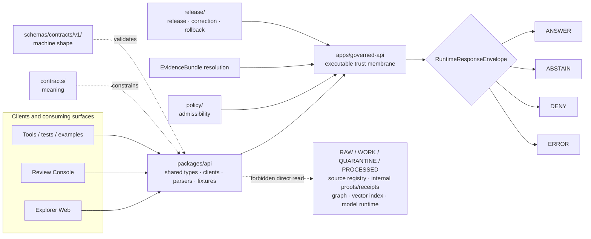

<!-- [KFM_META_BLOCK_V2]
doc_id: kfm://doc/packages-api-readme
title: API Package README
type: readme
version: v0.2
status: draft
owners:
  - <package-owner>
  - <api-steward>
  - <security-steward>
  - <schema-steward>
  - <policy-steward>
  - <docs-steward>
created: 2026-06-13
updated: 2026-07-14
policy_label: public
path: packages/api/README.md
related:
  - packages/README.md
  - apps/governed-api/README.md
  - docs/doctrine/directory-rules.md
  - docs/doctrine/trust-membrane.md
  - docs/doctrine/lifecycle-law.md
  - docs/adr/ADR-0004-apps-governed-api-is-the-trust-membrane.md
  - docs/architecture/governed-api.md
  - contracts/runtime/runtime_response_envelope.md
  - schemas/contracts/v1/runtime/runtime_response_envelope.schema.json
  - fixtures/contracts/v1/runtime/runtime_response_envelope/
  - tools/validators/validate_runtime_response_envelope.py
  - tests/schemas/test_common_contracts.py
  - .github/workflows/api-test.yml
tags: [kfm, packages, api, shared-library, governed-api, runtime-response-envelope, client-contracts, trust-membrane, finite-outcomes, evidence, policy, release, correction, rollback]
notes:
  - "v0.2 preserves the shared-package boundary from v0.1 and adds a repository-evidence snapshot, bounded-context profile, interface contract, dependency map, validation matrix, safe-change sequence, rollback guidance, and evidence ledger."
  - "Remote repository evidence was inspected on main at commit 916a13651c4a6596df8d9e7990bb6515b598365b."
  - "At the inspected ref, the target README was confirmed; package.json, pyproject.toml, and src/README.md were not present at their exact tested paths."
  - "The runtime response contract, paired schema, validator wrapper, fixture family, schema test harness, governed-api app README, CODEOWNERS file, and api-test workflow were confirmed at the inspected ref."
  - "No package implementation, exports, package manifest, dedicated tests/packages/api suite, consuming imports, workflow result, deployment, or runtime behavior is claimed without further evidence."
  - "ADR-0004 remains proposed; this README follows its trust-membrane posture without presenting the ADR as accepted implementation proof."
[/KFM_META_BLOCK_V2] -->

<a id="top"></a>

# API Package

> Shared, non-deployable API support for KFM clients and tests. `packages/api/` may help callers consume governed response contracts, but the executable public trust membrane remains `apps/governed-api/`.


> [!IMPORTANT]
> **Document status:** draft  
> **Repository evidence snapshot:** `main` at `916a13651c4a6596df8d9e7990bb6515b598365b`  
> **Responsibility root:** `packages/` — shared reusable implementation libraries  
> **Current package implementation:** only this README was observed under the indexed `packages/api/` surface; exact checks for `package.json`, `pyproject.toml`, and `src/README.md` returned no file  
> **Authority boundary:** this package is not the API server, schema authority, contract authority, policy authority, evidence authority, release authority, or lifecycle store  
> **Public path:** ordinary clients use `apps/governed-api/` and released, policy-safe projections

> [!CAUTION]
> A helper in this package must never turn a client into a direct reader of RAW, WORK, QUARANTINE, PROCESSED, source registries, internal proofs or receipts, graph internals, object stores, vector indexes, model runtimes, unpublished candidates, or restricted records.

---

## Quick jump

- [1. Purpose and audience](#1-purpose-and-audience)
- [2. Current repository state](#2-current-repository-state)
- [3. Bounded context and ubiquitous language](#3-bounded-context-and-ubiquitous-language)
- [4. Placement and authority](#4-placement-and-authority)
- [5. Owned responsibilities](#5-owned-responsibilities)
- [6. Explicit non-ownership](#6-explicit-non-ownership)
- [7. Public and internal interfaces](#7-public-and-internal-interfaces)
- [8. Trust-membrane flow](#8-trust-membrane-flow)
- [9. RuntimeResponseEnvelope alignment](#9-runtimeresponseenvelope-alignment)
- [10. Evidence, policy, release, and correction obligations](#10-evidence-policy-release-and-correction-obligations)
- [11. Identity and temporal handling](#11-identity-and-temporal-handling)
- [12. Directory contract](#12-directory-contract)
- [13. Implementation admission sequence](#13-implementation-admission-sequence)
- [14. Validation and test strategy](#14-validation-and-test-strategy)
- [15. Security and public-safe behavior](#15-security-and-public-safe-behavior)
- [16. Safe change, compatibility, and rollback](#16-safe-change-compatibility-and-rollback)
- [17. Definition of done](#17-definition-of-done)
- [18. Open verification register](#18-open-verification-register)
- [19. Evidence ledger](#19-evidence-ledger)
- [20. Maintainer checklist](#20-maintainer-checklist)

---

## 1. Purpose and audience

`packages/api/` is the bounded shared-library lane for reusable API-facing code that may be consumed by KFM applications, tests, tools, workers, examples, or generated clients.

The package may eventually provide:

- finite-outcome types and guards;
- `RuntimeResponseEnvelope` parsing and validation helpers;
- governed API client interfaces;
- citation, limitation, reason-code, and redaction-state helpers;
- reference helpers for evidence, policy, release, correction, and rollback objects;
- serialization and deserialization helpers;
- schema-generated types with traceable generator inputs;
- deterministic fixture builders and non-network test doubles;
- compatibility adapters for callers migrating to governed envelopes.

The package must remain **non-deployable**. Request routing, authorization, policy evaluation, evidence resolution, server-side model invocation, release-aware projection, and audit enforcement belong to the governed application and their owning authority roots.

**Primary audience**

- package maintainers;
- governed API maintainers;
- Explorer Web and Review Console client authors;
- schema, contract, policy, evidence, security, and release stewards;
- test and fixture maintainers;
- reviewers evaluating whether a proposed helper preserves the trust membrane.

[Back to top](#top)

---

## 2. Current repository state

The following table separates evidence confirmed at the inspected commit from proposed future package structure.

| Surface | Evidence at inspected ref | Status | Consequence |
|---|---|---|---|
| `packages/api/README.md` | Existing v0.1 README was read from `main`. | **CONFIRMED** | This revision updates the package boundary in place. |
| [`packages/README.md`](../README.md) | Lists `api/` as shared API support subordinate to `apps/governed-api/`. | **CONFIRMED** | This README must remain consistent with the package-root contract. |
| `packages/api/package.json` | Exact path returned no file. | **CONFIRMED absent at tested path** | Do not claim a JavaScript or TypeScript package yet. |
| `packages/api/pyproject.toml` | Exact path returned no file. | **CONFIRMED absent at tested path** | Do not claim a Python package yet. |
| `packages/api/src/README.md` | Exact path returned no file. | **CONFIRMED absent at tested path** | A source tree and exports are not established by current evidence. |
| Indexed `packages/api/` content | Repository search returned this README and no additional package-local result. | **CONFIRMED search result / incomplete tree proof** | Treat implementation depth as `UNKNOWN`; search indexing is not a full recursive tree listing. |
| Dedicated `tests/packages/api/` suite | Repository search found no dedicated package-test result. | **NOT OBSERVED** | Do not claim package-level tests or coverage. |
| [`RuntimeResponseEnvelope` contract](../../contracts/runtime/runtime_response_envelope.md) | Contract file exists and is paired to the runtime schema. | **CONFIRMED** | Package types must remain semantically subordinate to this contract. |
| [Runtime response schema](../../schemas/contracts/v1/runtime/runtime_response_envelope.schema.json) | Draft 2020-12 schema exists with ten required fields, four finite outcomes, EvidenceRef items, and closed additional properties. | **CONFIRMED / schema status PROPOSED** | Generated or hand-written package types must match the paired schema version. |
| [Validator wrapper](../../tools/validators/validate_runtime_response_envelope.py) | File exists and invokes the common JSON Schema runner against the runtime schema and fixture root. | **CONFIRMED file and wiring** | Shape validation has a concrete repository entry point. |
| [Fixture family](../../fixtures/contracts/v1/runtime/runtime_response_envelope/README.md) | One valid and one invalid fixture are documented; the valid fixture currently uses `ABSTAIN`. | **CONFIRMED** | Shape tests exist, but coverage remains minimal. |
| [Schema test harness](../../tests/schemas/test_common_contracts.py) | Discovers schemas and matching valid/invalid fixture directories. | **CONFIRMED file** | The package can reuse this contract-shape proof; the test was not run in this update. |
| [`apps/governed-api/README.md`](../../apps/governed-api/README.md) | Governed API app boundary README exists. | **CONFIRMED README / runtime depth UNKNOWN** | The deployable membrane stays outside this package. |
| [ADR-0004](../../docs/adr/ADR-0004-apps-governed-api-is-the-trust-membrane.md) | ADR exists with decision status `Proposed`. | **CONFIRMED document / PROPOSED decision** | Follow the boundary posture; do not describe it as accepted or deployed. |
| [`api-test` workflow](../../.github/workflows/api-test.yml) | Workflow triggers on pull requests and pushes to `main`; runs governed API smoke and abstain-route tests. | **CONFIRMED workflow file / run status UNKNOWN** | Documentation PRs may trigger ordinary API CI; workflow success is not assumed. |
| [CODEOWNERS](../../.github/CODEOWNERS) | `packages/api/` has no specific rule and falls under the repository-wide default. | **CONFIRMED** | Package-specific API ownership remains unresolved. |

### Evidence boundary

The repository connector did not expose a complete recursive directory listing for `packages/api/`. Exact-file checks and repository search support the current finding, but additional unindexed files remain possible. Therefore:

```text
README presence                  = CONFIRMED
package manifest                 = NOT OBSERVED at tested paths
source tree                      = NOT OBSERVED at tested path
package exports                  = UNKNOWN
package consumers                = UNKNOWN
dedicated package tests          = NOT OBSERVED
package build and publication    = UNKNOWN
runtime behavior                 = UNKNOWN
```

[Back to top](#top)

---

## 3. Bounded context and ubiquitous language

### Bounded context

Within KFM, `packages/api/` means **reusable client-side or cross-application support for governed API contracts**.

It does not mean:

- an HTTP server;
- a route registry;
- an authorization service;
- policy execution;
- evidence resolution;
- data access;
- publication;
- a canonical schema or contract home.

### Ubiquitous language

| Term | Meaning in this package |
|---|---|
| **Governed API** | The executable trust membrane under `apps/governed-api/`, not this package. |
| **Client helper** | Reusable code that calls or interprets the governed API without bypassing it. |
| **RuntimeResponseEnvelope** | Client-facing finite-outcome envelope constrained by the canonical contract and schema. |
| **Finite outcome** | Exactly one of `ANSWER`, `ABSTAIN`, `DENY`, or `ERROR`. |
| **EvidenceRef** | A reference carried by an envelope; not proof of evidence closure by itself. |
| **EvidenceBundle** | Resolved evidence support owned outside this package. |
| **Reason code** | Safe, controlled explanation of a finite outcome; never a leak of restricted content or internals. |
| **Policy state** | Policy-derived response posture reported to the client; not computed authoritatively here. |
| **Release reference** | Pointer to release state; not release approval. |
| **Correction state** | Client-visible correction, supersession, withdrawal, or rollback posture. |
| **Compatibility adapter** | Temporary, documented translation between API shapes with an explicit retirement path. |
| **Synthetic fixture** | Deterministic non-authoritative test data; never production evidence. |

[Back to top](#top)

---

## 4. Placement and authority

Directory Rules place shared reusable libraries under `packages/`. This path is therefore structurally appropriate **only** for reusable, non-deployable API support.

| Question | Answer | Status |
|---|---|---|
| Why `packages/`? | It owns shared reusable implementation libraries used by multiple KFM surfaces. | **CONFIRMED root contract** |
| Why an `api/` lane? | API contract helpers may be reused by clients and tests without becoming the executable membrane. | **PROPOSED package boundary; README exists** |
| Is this the public API server? | No. The normal public trust path is `apps/governed-api/`. | **CONFIRMED doctrine / ADR decision proposed** |
| May this package define object meaning? | No. Meaning authority remains in `contracts/`. | **CONFIRMED authority split** |
| May this package define canonical machine shape? | No. Schema authority remains in `schemas/contracts/v1/`. | **CONFIRMED authority split** |
| May this package evaluate policy authoritatively? | No. It may preserve policy state and refs only. | **CONFIRMED authority split** |
| May this package resolve evidence authoritatively? | No. It may carry refs or invoke a governed client method; resolution remains behind the membrane. | **CONFIRMED trust posture** |
| May this package approve publication, correction, or rollback? | No. It may preserve references and display obligations only. | **CONFIRMED release separation** |
| May this package read lifecycle stores? | Not as a normal public or client helper path. | **CONFIRMED trust-membrane posture** |

> [!IMPORTANT]
> A shared API package is not an API server, not a trust membrane, not schema authority, not contract authority, not policy authority, not evidence authority, not release authority, and not canonical truth.

[Back to top](#top)

---

## 5. Owned responsibilities

A future implementation may own reusable code for the following concerns.

### Contract-aligned types

- finite-outcome discriminated unions or equivalent type structures;
- runtime envelope types generated from or checked against canonical schemas;
- safe reference types for EvidenceRef, PolicyDecisionRef, ReleaseManifestRef, CorrectionNoticeRef, and RollbackCardRef;
- citation, limitation, freshness, correction, redaction, and generalization display types.

### Client behavior

- governed API client interfaces;
- bounded request builders;
- safe response parsers;
- exhaustive outcome dispatch;
- retry behavior only where endpoint semantics permit it;
- cancellation and timeout helpers that preserve safe failure;
- version and compatibility negotiation.

### Validation and test support

- pure envelope validation helpers;
- deterministic builders for valid and invalid synthetic payloads;
- non-network mock clients;
- schema-drift checks;
- negative-state assertions;
- helpers proving `ABSTAIN`, `DENY`, and `ERROR` cannot be coerced into `ANSWER`.

### Compatibility

- narrowly scoped adapters for a documented migration;
- deprecation warnings;
- old-to-new envelope translation only when semantic loss is impossible or explicitly surfaced;
- removal criteria and rollback notes.

A placement test:

> If the code is reusable API support, does not serve requests, does not read canonical stores, does not evaluate policy or evidence authoritatively, and does not publish claims, it may belong here.

[Back to top](#top)

---

## 6. Explicit non-ownership

| Does not belong here | Owning home or required posture |
|---|---|
| Public or semi-public route handlers | `apps/governed-api/` |
| Explorer Web rendering and route code | `apps/explorer-web/` |
| Review Console application code | `apps/review-console/` |
| Source acquisition and admission | `connectors/` and governed intake |
| Executable transformation logic | `pipelines/` |
| Pipeline declarations | `pipeline_specs/` |
| Canonical schemas | `schemas/contracts/v1/` |
| Object meaning | `contracts/` |
| Policy bundles and decisions | `policy/` |
| EvidenceBundle creation or proof authority | `data/proofs/` and governed evidence services |
| Source descriptors | `data/registry/sources/` |
| Lifecycle storage | `data/raw/`, `data/work/`, `data/quarantine/`, `data/processed/`, catalog/triplet/published lanes |
| Release approval, correction, and rollback authority | `release/` |
| Direct model clients and local model adapters | `runtime/`, behind the governed API |
| Repository-wide validators and generators | `tools/` |
| Package tests as primary home | `tests/packages/api/` when created |
| Package fixtures as primary home | `fixtures/packages/api/` when created |
| Secrets, credentials, raw prompts, private data, restricted geometry, or stack traces | Never commit; use approved secret, privacy, and log controls |
| Generated claims or mock payloads presented as truth | Forbidden |

### Anti-collapse rules

```text
shared package       != executable API
client helper        != trust membrane
DTO                  != contract authority
generated type       != schema authority
reason-code helper   != policy decision
EvidenceRef          != EvidenceBundle closure
release reference    != release approval
mock response        != production truth
passing shape test   != endpoint correctness
successful request   != permission to render
```

[Back to top](#top)

---

## 7. Public and internal interfaces

### Public-facing interface posture

A public or semi-public caller may interact with this package only as a helper around a governed API contract.

```text
client surface
  -> packages/api client or type helper
  -> apps/governed-api
  -> policy-safe, evidence-aware, release-aware projection
  -> RuntimeResponseEnvelope
  -> exhaustive client rendering
```

### Forbidden shortcut

```text
client surface
  -> packages/api
  -> RAW / WORK / QUARANTINE / PROCESSED
  -> source registry / proof store / receipt store
  -> graph / vector index / object store / model runtime
  -> unpublished or restricted candidate
```

### Interface classes

| Interface class | Direction | Package role | Authority limit |
|---|---|---|---|
| Governed API request builder | caller → governed API | Build bounded request data. | Must not add caller-controlled policy or release authority. |
| Governed API response parser | governed API → caller | Validate and parse the finite envelope. | Must not repair unsupported answers or drop obligations. |
| Outcome dispatcher | parsed envelope → UI/tool behavior | Require exhaustive handling. | Unknown or missing outcomes fail safely. |
| Reference helper | envelope → evidence/policy/release/correction links | Preserve opaque refs. | Must not dereference internal paths directly. |
| Synthetic client | tests/examples only | Return deterministic fixtures. | Must be unmistakably non-production and non-authoritative. |
| Generated type adapter | schema → package types | Produce traceable, versioned types. | Generator output cannot supersede the schema. |
| Compatibility adapter | old client shape → current shape | Support bounded migration. | Must expose loss, deprecation, and retirement state. |

[Back to top](#top)

---

## 8. Trust-membrane flow



The dotted edge is a prohibition, not an access path. Package code must make the governed path easier and the bypass path structurally difficult.

[Back to top](#top)

---

## 9. RuntimeResponseEnvelope alignment

The current paired schema confirms this required top-level field surface:

| Field | Current schema shape | Package obligation |
|---|---|---|
| `id` | string matching `^[a-z][a-z0-9_:.-]*$` | Preserve as opaque stable identifier; do not insert secrets or private context. |
| `spec_hash` | `sha256:` plus 64 lowercase hexadecimal characters | Preserve exactly; expose contract drift rather than rewriting the value. |
| `version` | string | Use for compatibility negotiation and deprecation. |
| `issued_at` | date-time string | Preserve emission time; do not relabel stale responses as current. |
| `outcome` | `ANSWER`, `ABSTAIN`, `DENY`, or `ERROR` | Dispatch exhaustively; no default-to-answer behavior. |
| `reason_code` | string | Preserve safe reason codes; do not expand them with restricted internals. |
| `evidence_refs` | array of canonical EvidenceRef objects | Preserve refs; do not claim resolution unless the governed API resolved them. |
| `policy_state` | string | Treat as policy-derived state, not a client override. |
| `freshness` | string | Preserve stale/degraded posture. |
| `correction_state` | string | Preserve correction, supersession, withdrawal, and rollback posture. |

The current schema sets:

```text
additionalProperties: false
```

Package models must therefore fail visibly on unknown fields unless a verified compatibility policy says otherwise. Silent field dropping can erase evidence, policy, release, correction, or limitation obligations.

### Finite outcomes

| Outcome | Package behavior | Forbidden behavior |
|---|---|---|
| `ANSWER` | Render or forward only with required evidence, policy, release, correction, limitation, and citation context. | Treating `ANSWER` as unconditional truth. |
| `ABSTAIN` | Preserve reason and limitations; show no inferred answer. | Converting missing evidence into partial success. |
| `DENY` | Preserve safe denial state without blocked payload leakage. | Showing restricted content, internal refs, or inferred details. |
| `ERROR` | Preserve a safe error envelope and retry only when permitted. | Exposing stack traces, raw prompts, secrets, paths, or adapter internals. |

There is no fifth public outcome. Unknown, missing, or malformed outcomes fail closed as a parse or contract error.

[Back to top](#top)

---

## 10. Evidence, policy, release, and correction obligations

Package helpers preserve trust-bearing references and obligations; they do not adjudicate them.

### Evidence

- Preserve `evidence_refs` without fabrication.
- Do not represent a non-empty ref array as proof that refs resolve.
- Do not infer claim support from a map feature, tile, graph edge, search hit, vector result, screenshot, or AI answer.
- Make missing, unresolved, stale, or conflicting support visible through finite outcomes and limitations.

### Policy

- Treat `policy_state` and policy decision refs as server-derived.
- Do not allow a caller to upgrade `DENY` or `ABSTAIN`.
- Do not remove obligations, redaction, generalization, embargo, role, or access constraints.
- Keep reason codes safe and controlled.

### Release

- Preserve release manifest refs, artifact versions, and digests where the API supplies them.
- Do not label a payload public or current based only on successful retrieval.
- Do not treat package version, schema version, or response version as release approval.
- Keep corrections and supersession visible when a release is no longer current.

### Correction and rollback

- Preserve `correction_state`, correction notice refs, withdrawal refs, and rollback refs.
- Ensure cached clients can invalidate or downgrade superseded content.
- Do not hide rollback state to maintain a smooth UI.
- Keep compatibility adapters reversible and retire them through explicit change records.

[Back to top](#top)

---

## 11. Identity and temporal handling

### Identity

Package code should treat identifiers and references as opaque unless the canonical contract explicitly defines safe parsing.

Requirements:

- preserve stable IDs byte-for-byte unless a versioned adapter governs translation;
- preserve `spec_hash` and artifact digests;
- never derive authority from a human-readable slug alone;
- never embed credentials, private prompts, exact protected locations, or personal data in IDs;
- distinguish request IDs, response IDs, evidence refs, policy decision refs, release refs, and audit refs.

### Time

KFM distinguishes multiple time kinds. Package types must not collapse them into one generic timestamp when the API supplies distinct semantics.

Potentially material times include:

- observation or valid time;
- source publication time;
- retrieval time;
- processing time;
- envelope `issued_at`;
- release time;
- correction, withdrawal, or supersession time;
- cache expiry or freshness deadline.

A client helper may format times for display, but it must not:

- replace source time with retrieval time;
- replace release time with current time;
- make stale state appear fresh;
- hide uncertainty or time-zone context;
- compare incompatible time kinds without an explicit rule.

[Back to top](#top)

---

## 12. Directory contract

### Confirmed current package surface

```text
packages/api/
└── README.md
```

This is the only package-local path observed through the current connector evidence. It is not proof that no unindexed file exists.

### Candidate future shape

The language and package manager remain undecided. Do not create parallel JavaScript and Python layouts.

```text
packages/api/
├── README.md
├── <one verified package manifest>
├── src/
│   ├── <verified package entry point>
│   ├── outcomes/
│   ├── envelopes/
│   ├── clients/
│   ├── refs/
│   ├── errors/
│   └── compatibility/
└── generated/              # only when a verified generator owns it
```

### Placement rules

1. Choose one implementation language and package manifest through a reviewable package decision.
2. Keep generated code separated from hand-written adapters.
3. Record the canonical schema inputs, generator version, command, output digest, and regeneration rule.
4. Keep tests under `tests/packages/api/` unless current repository convention proves a different canonical home.
5. Keep package fixtures under `fixtures/packages/api/`; contract-schema fixtures remain under `fixtures/contracts/v1/`.
6. Do not create schemas, contracts, policy bundles, release manifests, EvidenceBundles, or lifecycle artifacts under this package.
7. Do not create a deployable server, route tree, or local model adapter here.
8. Do not create a second `api` authority root or compatibility mirror without an ADR or migration note.

[Back to top](#top)

---

## 13. Implementation admission sequence

The smallest safe implementation path is additive and reversible.

### Step 1 — Decide the package runtime

Before code is added, record:

- language and package manager;
- package name and import path;
- supported consumers;
- build target;
- source and generated-code boundary;
- compatibility policy;
- ownership and review requirements;
- rollback method.

**Gate:** one package manifest, one source layout, no parallel implementation.

### Step 2 — Add finite-outcome primitives

Implement only:

- the four outcome constants or discriminated variants;
- exhaustive outcome guards;
- a safe unknown/malformed-envelope failure;
- no-network tests proving non-answer outcomes remain non-answers.

**Gate:** `ABSTAIN`, `DENY`, and `ERROR` cannot be coerced into `ANSWER`.

### Step 3 — Add RuntimeResponseEnvelope types

Bind package types to the current canonical contract and schema.

**Gate:** generated or hand-written types match required fields, enum, patterns, EvidenceRef shape, and closed-property behavior.

### Step 4 — Add a mock-first client

Provide a deterministic mock client using public-safe synthetic fixtures.

**Gate:** no network, lifecycle storage, source registry, proof store, graph, vector index, object store, or model runtime access.

### Step 5 — Add a governed API client adapter

Connect to verified governed API routes only after route, authorization, policy, evidence, release, correction, and audit behavior are evidenced.

**Gate:** client integration tests cover all finite outcomes and negative states.

### Step 6 — Adopt consumers one at a time

Migrate one consuming surface per bounded change.

**Gate:** old shape remains reversible until the new consumer passes contract, UI, accessibility, security, and rollback checks.

[Back to top](#top)

---

## 14. Validation and test strategy

### Current repository validation assets

| Check | Grounded command or path | What it proves | Status in this update |
|---|---|---|---|
| Runtime envelope validator | `python tools/validators/validate_runtime_response_envelope.py` | Current valid/invalid fixtures conform to the runtime schema runner. | **NOT RUN** |
| Common contract fixtures | `python -m pytest tests/schemas/test_common_contracts.py` | Matching schema fixture families accept valid and reject invalid cases. | **NOT RUN** |
| Governed API workflow | `.github/workflows/api-test.yml` | Workflow definition runs governed API smoke and abstain-route tests. | **FILE CONFIRMED; RUN STATUS UNKNOWN** |
| Package-local tests | `tests/packages/api/` | Would prove package-specific behavior. | **NOT OBSERVED** |
| Consumer integration tests | consuming app/test paths | Would prove clients preserve envelopes and negative states. | **UNKNOWN** |
| Type-generation drift check | generator-specific command | Would prove generated types match canonical schema inputs. | **NOT IMPLEMENTED / UNKNOWN** |

### Required package test families

When implementation begins, add deterministic coverage for:

```text
valid ANSWER with required support
valid ABSTAIN
valid DENY
valid ERROR
missing outcome
unknown outcome
invalid id pattern
invalid spec_hash pattern
invalid issued_at
unknown additional property
non-empty EvidenceRef array
unresolved EvidenceRef posture
stale freshness state
corrected / superseded / withdrawn state
redaction and generalization obligations
safe reason-code handling
safe error handling
timeout and cancellation
no direct lifecycle-store access
no direct model access
compatibility adapter round-trip or explicit loss
```

### What passing tests do not prove

A passing package suite does not prove:

- evidence is admissible or complete;
- policy evaluation is correct;
- a release is approved;
- a route is deployed;
- authorization is configured;
- sensitive data is safe to expose;
- citations support a claim;
- the UI obeys all obligations;
- rollback has been exercised;
- CI, deployment, monitoring, or operational response is mature.

[Back to top](#top)

---

## 15. Security and public-safe behavior

### Mandatory security posture

- No credentials, tokens, cookies, private keys, or secret-bearing examples.
- No raw prompts, hidden reasoning, chain-of-thought, stack traces, local paths, or adapter internals in public errors.
- No exact sensitive geometry, living-person private data, DNA/genomic details, restricted cultural data, or critical-infrastructure details in fixtures.
- No client-controlled policy, review, release, freshness, correction, or redaction authority.
- No automatic retry of non-idempotent operations.
- No unsafe deserialization or dynamic code execution.
- No silent fallback from validated envelopes to untyped JSON success.
- No logging of full restricted payloads.
- No browser-direct calls to model runtimes, internal stores, graph databases, vector indexes, or source endpoints.
- No package helper that turns internal filesystem or object-store references into public URLs.

### Public-safe fixture posture

Fixtures must be:

- synthetic or explicitly public-safe;
- small and deterministic;
- free of private or restricted source content;
- clearly labeled non-authoritative;
- suitable for no-network tests;
- reviewed when they model denial, redaction, or generalization.

[Back to top](#top)

---

## 16. Safe change, compatibility, and rollback

### Safe change pattern

1. Inspect the current contract, schema, fixtures, validator, package consumers, and governed API behavior.
2. Pin the base commit and package schema version.
3. Make the smallest coherent package change.
4. Add or update valid, invalid, denied, abstained, and error tests.
5. Run package-local and contract-schema checks.
6. Verify no direct internal-store or model-runtime dependency was introduced.
7. Migrate consumers through explicit version or compatibility handling.
8. Read the remote diff back and review generated outputs.
9. Keep correction and rollback behavior visible.

### Compatibility rules

- Prefer additive changes when semantics remain safe.
- Reject unknown response fields only as required by the active schema and compatibility policy.
- Never silently drop trust-bearing fields.
- Never translate `ABSTAIN`, `DENY`, or `ERROR` into an answer-like object.
- Mark deprecated fields and adapters with retirement criteria.
- Treat semantic changes to finite outcomes, evidence refs, policy state, freshness, or correction state as high-impact.
- Update contracts and schemas in their authority roots before regenerating package types.

### Rollback

For a documentation-only change, revert the implementation commit through a normal Git revert or pull-request revert and re-run documentation checks.

For future package code:

1. identify the last compatible package and schema version;
2. revert or disable the consuming integration;
3. restore the prior package artifact or commit;
4. invalidate incompatible caches;
5. preserve correction, withdrawal, and rollback references;
6. run contract, package, and consumer tests;
7. record the rollback reason and affected releases.

Do not rewrite shared history or hide a failed migration.

[Back to top](#top)

---

## 17. Definition of done

### README revision

This README revision is complete when it:

- preserves the package as shared, reusable, and non-deployable;
- states the current repository evidence boundary;
- distinguishes confirmed package documentation from unknown implementation;
- preserves `apps/governed-api/` as the executable membrane;
- records the current runtime contract, schema, validator, fixture, test-harness, workflow, and ownership evidence;
- defines bounded context, ubiquitous language, owned responsibilities, and explicit non-ownership;
- defines public/internal interfaces and anti-bypass rules;
- defines finite outcomes and current schema-aligned fields;
- covers evidence, policy, release, correction, identity, time, security, validation, compatibility, and rollback;
- keeps open verification items explicit.

### Future package implementation

A production-capable package is not done until:

- [ ] language, manifest, package name, and ownership are verified;
- [ ] source and generated-code boundaries are documented;
- [ ] package exports are explicit and minimal;
- [ ] types match the canonical contract and schema;
- [ ] all four finite outcomes are exhaustively handled;
- [ ] evidence, policy, release, freshness, correction, redaction, and limitation fields are preserved;
- [ ] no direct lifecycle, source-registry, internal proof/receipt, graph, vector, object-store, or model-runtime path exists;
- [ ] deterministic no-network fixtures cover positive and negative states;
- [ ] dedicated package tests exist;
- [ ] consuming integration tests exist;
- [ ] error output is safe;
- [ ] compatibility and deprecation rules exist;
- [ ] relevant stewards review the change;
- [ ] CI results are observed;
- [ ] rollback is documented and tested at the appropriate maturity level.

[Back to top](#top)

---

## 18. Open verification register

| ID | Question | Current status | Evidence needed |
|---|---|---|---|
| `PKG-API-001` | Is the package intended to use TypeScript, Python, another language, or generated artifacts only? | **UNKNOWN** | Accepted package manifest and source tree. |
| `PKG-API-002` | What is the canonical package name and import path? | **UNKNOWN** | Package manager metadata and consuming import. |
| `PKG-API-003` | Which exports are required by current consumers? | **UNKNOWN** | Repository import graph and app/test references. |
| `PKG-API-004` | Which generator, if any, owns runtime envelope types? | **UNKNOWN** | Generator config, command, version pin, receipt, and generated output. |
| `PKG-API-005` | Should package types reject unknown fields exactly as the current schema does? | **NEEDS VERIFICATION** | Versioning and forward-compatibility decision. |
| `PKG-API-006` | Which controlled vocabularies govern `policy_state`, `freshness`, and `correction_state`? | **NEEDS VERIFICATION** | Accepted contracts/schemas/policy vocabulary. |
| `PKG-API-007` | Which routes are implemented in `apps/governed-api/`? | **UNKNOWN** | Route files, tests, middleware, deployment, and runtime evidence. |
| `PKG-API-008` | Which package-specific tests and fixtures should be created first? | **PROPOSED** | Initial package implementation decision. |
| `PKG-API-009` | Which CI job should validate this package and generated-type drift? | **UNKNOWN** | Workflow change or existing job evidence. |
| `PKG-API-010` | Should `packages/api/` receive a specific CODEOWNERS rule? | **NEEDS VERIFICATION** | Stewardship decision; current default is repository-wide maintainers. |
| `PKG-API-011` | Does ADR-0004 become accepted, superseded, or replaced? | **NEEDS VERIFICATION** | ADR review state and decision record. |
| `PKG-API-012` | Which compatibility shapes already exist and need migration? | **UNKNOWN** | Consumer inventory and current API payload examples. |
| `PKG-API-013` | Are there package-local files not surfaced by the current search/index evidence? | **NEEDS VERIFICATION** | Complete recursive tree listing at a pinned ref. |
| `PKG-API-014` | Have the runtime validator, fixture harness, governed API workflow, and package consumers passed on the intended base? | **UNKNOWN** | Current CI/check results or trusted local execution. |

[Back to top](#top)

---

## 19. Evidence ledger

| Evidence | Precise repository location | Supports | Does not prove |
|---|---|---|---|
| Target document | `packages/api/README.md` | Existing package boundary and revision target. | Package code or runtime maturity. |
| Package root contract | [`packages/README.md`](../README.md) | `packages/` owns shared reusable libraries; `api/` remains subordinate to governed API. | Child package implementation. |
| Directory doctrine | [`docs/doctrine/directory-rules.md`](../../docs/doctrine/directory-rules.md) | Placement by responsibility root; packages are shared implementation libraries. | Current package files beyond inspected evidence. |
| Trust membrane doctrine | [`docs/doctrine/trust-membrane.md`](../../docs/doctrine/trust-membrane.md) | Public clients use governed interfaces rather than internal stores. | A deployed membrane. |
| ADR | [`docs/adr/ADR-0004-apps-governed-api-is-the-trust-membrane.md`](../../docs/adr/ADR-0004-apps-governed-api-is-the-trust-membrane.md) | Proposed single executable membrane and finite-outcome posture. | Accepted ADR state or runtime enforcement. |
| Governed API app README | [`apps/governed-api/README.md`](../../apps/governed-api/README.md) | Intended deployable boundary and workflow reference. | Live routes, deployment, authorization, or CI pass. |
| Runtime contract | [`contracts/runtime/runtime_response_envelope.md`](../../contracts/runtime/runtime_response_envelope.md) | Envelope semantics and authority separation. | Correct implementation. |
| Runtime schema | [`schemas/contracts/v1/runtime/runtime_response_envelope.schema.json`](../../schemas/contracts/v1/runtime/runtime_response_envelope.schema.json) | Required fields, enum, patterns, EvidenceRef array, and closed properties. | Semantic evidence or policy correctness. |
| Validator | [`tools/validators/validate_runtime_response_envelope.py`](../../tools/validators/validate_runtime_response_envelope.py) | Concrete schema-runner entry point and fixture root. | That the validator was run or covers runtime semantics. |
| Fixture family | [`fixtures/contracts/v1/runtime/runtime_response_envelope/README.md`](../../fixtures/contracts/v1/runtime/runtime_response_envelope/README.md) | Current valid/invalid fixture inventory and minimal coverage. | Endpoint, policy, evidence, or UI behavior. |
| Schema harness | [`tests/schemas/test_common_contracts.py`](../../tests/schemas/test_common_contracts.py) | Fixture discovery and valid/invalid schema assertions. | Package client behavior or CI pass. |
| API workflow | [`.github/workflows/api-test.yml`](../../.github/workflows/api-test.yml) | Pull-request/push trigger and governed API test commands. | Workflow safety beyond inspected YAML or successful run. |
| Ownership | [`.github/CODEOWNERS`](../../.github/CODEOWNERS) | Repository-wide default ownership and governed-api-specific rule. | Assigned package/API maintainers or active teams. |
| Repository search and exact-file checks | `main` at `916a13651c4a6596df8d9e7990bb6515b598365b` | README observed; selected manifest/source paths absent at exact locations. | Complete recursive absence of every possible file. |

[Back to top](#top)

---

## 20. Maintainer checklist

Before adding or changing package code:

- [ ] Pin the repository base and inspect the complete package tree.
- [ ] Confirm the implementation language, manifest, package name, and owner.
- [ ] Confirm the canonical contract and schema versions.
- [ ] Confirm generated-code ownership and regeneration receipts.
- [ ] Preserve exhaustive `ANSWER | ABSTAIN | DENY | ERROR` handling.
- [ ] Preserve evidence refs, citations, policy state, release state, freshness, correction state, limitations, and redaction obligations.
- [ ] Keep public clients behind `apps/governed-api/`.
- [ ] Add deterministic no-network tests.
- [ ] Add denied, abstained, error, stale, corrected, and malformed cases.
- [ ] Confirm no lifecycle-store, source-registry, internal proof/receipt, graph, vector, object-store, or model-runtime access.
- [ ] Confirm errors do not leak secrets, prompts, paths, stack traces, or restricted data.
- [ ] Run the relevant contract, package, and consumer checks.
- [ ] Record compatibility, deprecation, correction, and rollback behavior.
- [ ] Update this README when the observed package state changes.

---

## Maintainer note

Keep `packages/api/` small, reusable, contract-aligned, and subordinate to the governed API. The package should make safe client behavior straightforward, unsafe bypasses difficult, and every negative state explicit. When evidence is insufficient, preserve `ABSTAIN`; when policy blocks access, preserve `DENY`; when evaluation fails, preserve `ERROR`; never manufacture `ANSWER`.
