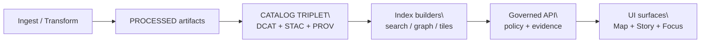
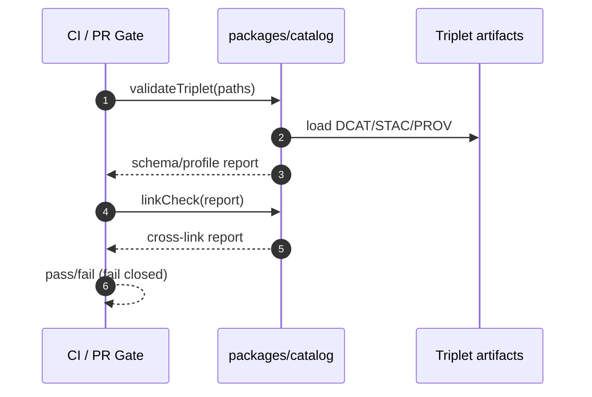

<!-- [KFM_META_BLOCK_V2]
doc_id: kfm://doc/05b1498e-07d5-4134-90af-e51ef045b7cc
title: packages/catalog — Catalog triplet validation and EvidenceRef helpers
type: standard
version: v1
status: draft
owners: KFM Engineering; Data Stewardship; Governance
created: 2026-02-22
updated: 2026-02-22
policy_label: public
related:
  - (not confirmed in repo) docs/kfm/KFM_GDG_vNext.pdf
  - (not confirmed in repo) docs/kfm/KFM_Implementation_Blueprint_v5.pdf
  - (not confirmed in repo) contracts/schemas/
tags: [kfm, catalog, dcat, stac, prov, provenance, validation]
notes:
  - This README is a contract description first; code paths and commands may change once wired into the repo.
[/KFM_META_BLOCK_V2] -->

# packages/catalog
Schema + cross-link validation for the **KFM catalog triplet** (**DCAT + STAC + PROV**) and **EvidenceRef** semantics.

**Status:** draft • **Owners:** KFM Engineering + Governance • **Policy:** public


## Quick navigation
- [Why this exists](#why-this-exists)
- [What this package does](#what-this-package-does)
- [Non-negotiable invariants](#non-negotiable-invariants)
- [Inputs and outputs](#inputs-and-outputs)
- [Recommended repo layout](#recommended-repo-layout)
- [API sketch](#api-sketch)
- [CI and promotion gates](#ci-and-promotion-gates)
- [Security and governance notes](#security-and-governance-notes)
- [Contributing](#contributing)
- [Appendix: diagrams](#appendix-diagrams)

---

## Why this exists
KFM treats catalogs as **contract surfaces** between pipelines and runtime. “Catalog” here is not optional metadata — it is the **interoperability and evidence surface** that enables:

- dataset discovery (Catalog UI / API),
- deterministic evidence resolution (“show me the thing this claim refers to”),
- promotion gates that **fail closed** when catalog/provenance are missing or inconsistent.

The contract is expressed as a **triplet**:

| Part | Primary question answered | Typical scope |
|---|---|---|
| **DCAT** | What is this dataset? Who published it? What license/rights apply? What are the distributions? | Dataset-level |
| **STAC** | What assets exist, where are they, and what are their spatiotemporal extents? | Collection/item/asset-level |
| **PROV** | How were outputs created (inputs, tools, parameters, environment, approvals)? | Run + lineage |

---

## What this package does
This package is intended to be the **shared implementation** of KFM’s catalog contract checks.

### Provides
- **Profiles** (KFM-minimum required fields) for:
  - DCAT dataset + distributions
  - STAC collections + items
  - PROV bundles
- **Schema validation** for DCAT/STAC/PROV artifacts (strict; predictable).
- **Cross-link validation** across the triplet:
  - DCAT ↔ STAC ↔ PROV
  - EvidenceRef schemes resolve without guessing
- **Typed results** for CI (machine-readable report + human summary).
- **Utilities**:
  - EvidenceRef parsing helpers (scheme + id + selectors)
  - DatasetVersion and policy label sanity checks
  - Optional: canonical JSON hashing helpers (for stable digests)

### Does NOT provide
- Policy evaluation (OPA/Rego) or authorization decisions.
- Evidence resolver HTTP endpoint (this is an API/runtime concern).
- Storage/indexing (PostGIS/search/graph/tiles builders).
- Ingest/transforms.

---

## Non-negotiable invariants
These rules are enforced by this package (or by the package’s CI integration).

| Invariant | Why it matters | Enforcement |
|---|---|---|
| **Fail closed** on schema/profile mismatch | Prevents “almost-valid” metadata from reaching runtime | Validator returns non-zero / `valid=false` |
| **Cross-links must be deterministic** | Evidence resolution must not guess | Link-checker validates explicit links |
| **Triplet must be complete per dataset version** | Runtime surfaces require DCAT+STAC+PROV coherence | `validateTriplet()` checks presence + ids |
| **Policy label is first-class metadata** | Geometry/attributes may need generalization; UI must badge trust | Required fields + sanity checks |
| **EvidenceRefs are resolvable identifiers** | Enables Story/Map/Focus citations | EvidenceRef parser + link rules |

### Cross-linking rules
These are the minimum “navigation edges” that make evidence resolution deterministic:

- DCAT dataset → distributions → artifact digests
- DCAT dataset → `prov:wasGeneratedBy` → PROV bundle / run activity
- STAC collection → `rel="describedby"` → DCAT dataset record
- STAC item → link to PROV activity and/or run receipt
- EvidenceRef schemes resolve into the above objects **without guessing**

---

## Inputs and outputs

### Inputs
At minimum, validators operate on (per `dataset_version_id`):

- **DCAT dataset record** (JSON-LD)
- **STAC collection** (JSON)
- **STAC items** (JSON) *(optional for earliest slices; required once assets are enumerated)*
- **PROV bundle** (JSON-LD)

Optional but recommended inputs for stronger checks:

- **Run receipt / run manifest** (checksums, environment, params digests)
- **Promotion manifest** (released artifacts + catalog digests)

### Outputs
Validators produce:

1) **Machine report** (JSON)
2) **Human summary** (console-friendly text)

Example (shape sketch):

```json
{
  "dataset_version_id": "2026-02.abcd1234",
  "valid": false,
  "checks": {
    "dcat_schema": true,
    "stac_schema": true,
    "prov_schema": false,
    "cross_links": false
  },
  "issues": [
    {
      "code": "PROV_MISSING_ACTIVITY",
      "path": "$.@graph[?].prov:Activity",
      "message": "No prov:Activity found for run",
      "severity": "error"
    }
  ]
}
```

---

## Recommended repo layout
> NOTE: The exact repo structure is **not confirmed in repo**. This section reflects the *intended* “contract-first” layout.

### Data outputs layout
Recommended placement for catalog artifacts generated by pipelines:

```text
data/
  catalog/
    dcat/
      datasets/                 # dataset-level DCAT records (jsonld)
        <dataset_slug>.jsonld
  stac/
    collections/
      <dataset_id>/collection.json
    items/
      <dataset_id>/
        <item_id>.json
  prov/
    <dataset_id>/
      <dataset_version_id>.jsonld
  manifests/
    <dataset_id>/
      <dataset_version_id>.promotion.json
```

### Package layout
Suggested internal structure:

```text
packages/catalog/
  src/
    index.ts
    profiles/
      dcat.ts
      stac.ts
      prov.ts
    validate/
      validateDcat.ts
      validateStac.ts
      validateProv.ts
      validateTriplet.ts
    links/
      linkChecker.ts
      resolvers.ts
    evidenceref/
      parse.ts
      format.ts
    report/
      reportTypes.ts
      renderHumanSummary.ts
  test/
    fixtures/
      valid/
      invalid/
    validateTriplet.test.ts
```

---

## API sketch
> This is an **illustrative contract** (not confirmed in repo). Keep the surface small and testable.

```ts
export type PolicyLabel =
  | "public"
  | "public_generalized"
  | "restricted"
  | "internal";

export interface ValidationIssue {
  code: string;
  message: string;
  path?: string;
  severity: "error" | "warning";
}

export interface ValidationReport {
  dataset_version_id: string;
  valid: boolean;
  checks: Record<string, boolean>;
  issues: ValidationIssue[];
}

export interface TripletPaths {
  dcat: string;
  stacCollection: string;
  stacItemsDir?: string;
  prov: string;
  promotionManifest?: string;
  runReceipt?: string;
}

export function validateTriplet(paths: TripletPaths): Promise<ValidationReport>;
```

---

## CI and promotion gates
Promotion moves a dataset version from **Raw/Work** into **Processed + Catalog/Lineage**, therefore into runtime surfaces. This package is designed to support the **fail-closed gates** related to **Catalogs** and **Cross-links**, and to contribute sanity checks to Identity/Policy gates.

### Minimal CI jobs
| Job | Inputs | Output | Fails build when… |
|---|---|---|---|
| `catalog:validate` | DCAT/STAC/PROV artifacts | JSON report | Any schema/profile errors |
| `catalog:linkcheck` | Triplet artifacts (+ optional manifests) | JSON report | Any required cross-link missing/unresolvable |
| `catalog:test` | `test/fixtures/*` | unit tests | Any “valid” fixture fails or “invalid” fixture passes |

### Gate mapping
| Promotion gate check | How this package helps |
|---|---|
| Identity & versioning (`dataset_version_id`, spec hash determinism) | Confirms the same `dataset_version_id` is present/consistent across DCAT/STAC/PROV; optionally checks `kfm:spec_hash` where available |
| Catalogs (DCAT/STAC/PROV schema-valid under profile) | Runs strict profile validation |
| Cross-links (all links resolve; EvidenceRefs resolve) | Enforces cross-link rules and EvidenceRef parseability |
| Policy (policy label assigned; obligations applied) | Ensures `policy_label` fields exist; warns on missing/unknown labels |
| QA/Audit (reports present; receipts emitted) | Produces a report artifact usable by CI and audit logging |

---

## Security and governance notes
- **Do not guess.** If a catalog link, EvidenceRef, digest, or dataset version cannot be resolved, **fail closed**.
- **Policy labels drive geometry/attribute constraints.**
  - STAC items may require **generalized geometry** under certain labels.
  - Any generalization must be explicit (obligations recorded elsewhere) and reflected in catalog metadata.
- **Avoid existence leaks.** Validators and reports should be safe to run in CI logs; redact any sensitive URLs/fields if policy indicates.

---

## Contributing
- When changing profiles:
  - Update fixtures (`test/fixtures/valid` and `test/fixtures/invalid`) first.
  - Ensure failures are readable (surface `code`, `path`, and actionable `message`).
- When adding a new EvidenceRef scheme:
  - Add parser + formatter tests.
  - Add link-check rules for deterministic resolution.
- Keep public API surface minimal; prefer adding *new check modules* over expanding the core types.

---

## Appendix: diagrams

### Where catalog validation sits in the KFM flow


### Validation pipeline


---

<details>
<summary><strong>Appendix: EvidenceRef scheme conventions</strong></summary>

These schemes are intended to be resolvable without guesswork:

- `dcat://<dataset_slug>@<dataset_version_id>` → DCAT dataset record/distribution
- `stac://<collection_id>/items/<item_id>` → STAC item/asset
- `prov://run/<run_id>` → PROV activity bundle / run receipt
- `doc://sha256:<digest>#page=…&span=…` → governed document citation anchor
- `graph://…` → entity relations (if enabled)

</details>

<p align="right"><a href="#packagescatalog">back to top</a></p>
