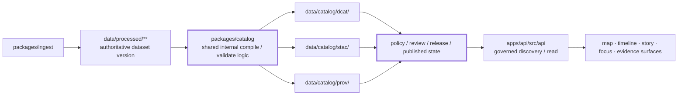

<!-- [KFM_META_BLOCK_V2]
doc_id: kfm://doc/<REVIEW_REQUIRED_UUID>
title: Catalog Package
type: standard
version: v1
status: review
owners: @bartytime4life
created: <TBD — NEEDS VERIFICATION>
updated: 2026-04-05
policy_label: <TBD — NEEDS VERIFICATION>
related: [../README.md, ../ingest/README.md, ../evidence/README.md, ../../README.md, ../../contracts/README.md, ../../policy/README.md, ../../data/catalog/README.md, ../../data/catalog/dcat/README.md, ../../data/catalog/stac/README.md, ../../data/catalog/prov/README.md, ../../data/registry/README.md, ../../apps/api/src/api/README.md, ../../tests/README.md]
tags: [kfm, packages, catalog, stac, dcat, prov]
notes: [Current public main confirms packages/catalog/ exists and the visible subtree is README-only. Created date, doc UUID, and policy label still need verification.]
[/KFM_META_BLOCK_V2] -->

# Catalog Package

Shared internal seam for building and validating KFM catalog closure from authoritative dataset versions.

> [!IMPORTANT]
> **Status:** experimental  
> **Document status:** review  
> **Owners:** `@bartytime4life` *(broad `/packages/` CODEOWNERS fallback; child-specific ownership still needs verification)*  
>      
> **Quick jump:** [Scope](#scope) · [Current public snapshot](#current-public-snapshot) · [Repo fit](#repo-fit) · [Accepted inputs](#accepted-inputs) · [Exclusions](#exclusions) · [Directory tree](#directory-tree) · [Quickstart](#quickstart) · [Usage](#usage) · [Diagram](#diagram) · [Reference tables](#reference-tables) · [Task list](#task-list-and-definition-of-done) · [FAQ](#faq) · [Appendix](#appendix)  
> **Repo fit:** `packages/catalog/README.md` · child of [`packages/README.md`](../README.md) · feeds [`data/catalog/README.md`](../../data/catalog/README.md) · consumed by [`apps/api/src/api/README.md`](../../apps/api/src/api/README.md)

> [!NOTE]
> Current public `main` proves `packages/catalog/` exists, but the checked-in visible subtree currently exposes `README.md` only. Treat package-local code, manifests, tests, fixtures, and executable entrypoints beneath this path as **UNKNOWN / NEEDS VERIFICATION** until they are verified on the branch under review.

| Field | Value |
| --- | --- |
| Path target | `packages/catalog/README.md` |
| Primary role | Shared internal catalog-closure compiler / validator seam |
| Current public surface | `README.md` only |
| Upstream posture | Authoritative dataset versions plus registry, policy, and release context |
| Downstream posture | `data/catalog/{dcat,stac,prov}/` plus governed API and evidence consumers |
| Current evidence posture | **CONFIRMED** path + adjacent repo surfaces · **INFERRED** package role · **UNKNOWN / NEEDS VERIFICATION** deeper implementation |

## Scope

`packages/catalog/` is the shared internal seam where KFM should compile and validate outward catalog closure from authoritative dataset versions.

In KFM doctrine, catalog is a real stage in the truth path, not an afterthought. This package therefore exists to help turn stabilized, release-bearing scope into linked outward `DCAT + STAC + PROV` artifacts without allowing catalog code to become a second truth source, a public-serving shortcut, or a hidden policy path.

Use this README to answer four questions quickly:

1. What does this package own?
2. What does it explicitly not own?
3. What is actually visible on public `main` today?
4. How should this package relate to `data/catalog/`, policy/review/release, and governed API consumers?

> [!WARNING]
> `packages/catalog/` must not become a side door around the trust membrane.  
>  
> If this package starts publishing directly, bypassing release review, or manufacturing authoritative truth from convenience inputs, the boundary has already drifted.

## Current public snapshot

| Observation | Status | Why it matters |
| --- | --- | --- |
| `packages/catalog/` exists on public `main` | **CONFIRMED** | This path is a live repo surface, not just a doctrine placeholder |
| The visible subtree currently shows `README.md` only | **CONFIRMED** | Docs here must not imply checked-in package code, fixtures, or build scripts that are not publicly visible |
| Parent `packages/` currently includes `catalog/`, `domain/`, `evidence/`, `genealogy_ingest/`, `indexers/`, `ingest/`, and `policy/` | **CONFIRMED** | `catalog/` is one reusable internal boundary among several |
| `data/catalog/` currently includes `dcat/`, `prov/`, `stac/`, and `README.md` | **CONFIRMED** | The outward catalog triplet now exists as real checked-in sibling lanes |
| `apps/api/src/api/` currently includes `README.md`, `middleware/`, and `routes/` | **CONFIRMED** | There is a real downstream runtime seam that should consume released closure through governed routes |
| Package-local code, manifests, tests, fixtures, import graph, and executable entrypoints under `packages/catalog/` | **UNKNOWN / NEEDS VERIFICATION** | The current public tree does not prove them |

[Back to top](#catalog-package)

## Repo fit

### Why this package exists

`packages/catalog/` belongs between KFM’s stronger top-level authority surfaces and its outward catalog artifacts.

It is the right home for logic when that logic is:

1. reused by more than one deployable or workflow surface,
2. non-deployable on its own,
3. easier to review as a stable internal boundary than as app-local glue,
4. still subordinate to stronger top-level contract, policy, data, and release authority.

### Upstream / lateral / downstream anchors

| Direction | Surface | Why it matters here |
| --- | --- | --- |
| Upstream | [`../../README.md`][repo-root] | Repo-wide truth path, inspectable-claim posture, and catalog-closure doctrine |
| Upstream | [`../README.md`][packages-root] | Parent package boundary and current child-package map |
| Upstream | [`../ingest/README.md`][ingest-readme] | Intake / normalization / receipt helpers feed authoritative versions into catalog work |
| Lateral | [`../../contracts/README.md`][contracts-readme] | Contract families should define closure inputs and outputs rather than leaving them implicit |
| Lateral | [`../../policy/README.md`][policy-readme] | Rights, sensitivity, obligations, and fail-closed behavior constrain what closure may hand forward |
| Lateral | [`../../data/registry/README.md`][registry-readme] | Registry identity and onboarding metadata are natural inputs to outward closure |
| Lateral | [`../../data/catalog/README.md`][data-catalog-readme] | Parent catalog lane defines the checked-in outward `DCAT + STAC + PROV` surface |
| Downstream | [`../../data/catalog/dcat/README.md`][dcat-readme] | Dataset / distribution discovery surface |
| Downstream | [`../../data/catalog/stac/README.md`][stac-readme] | Spatial / temporal asset discovery surface |
| Downstream | [`../../data/catalog/prov/README.md`][prov-readme] | Catalog-facing provenance bundle surface |
| Downstream | [`../../apps/api/src/api/README.md`][api-readme] | Governed read / discovery boundary that should consume released closure, not bypass it |
| Verification neighbor | [`../../tests/README.md`][tests-readme] | Positive / negative fixtures and release-significant proof should pressure this seam as it hardens |

### Boundary split that should remain explicit

| Surface | Owns | Does **not** own |
| --- | --- | --- |
| `packages/catalog/` | Shared internal compile / validate logic for catalog closure | Sovereign truth, raw/work storage, reviewed release decisions, or public route handlers |
| `data/catalog/**` | Checked-in outward `DCAT + STAC + PROV` artifacts and lane docs | Shared internal compilation logic or canonical processed payloads |
| `apps/api/src/api/` | Governed discovery / read behavior over released scope | Direct store access or hidden on-demand closure generation that bypasses review |
| `policy/` and release-bearing review surfaces | Decisions, obligations, denials, release / correction posture | Serializer-local hidden policy |

## Accepted inputs

Content belongs in `packages/catalog/` when it remains shared internal catalog logic rather than a public artifact or top-level authority surface.

### What belongs here

- builders that translate authoritative dataset-version metadata into a linked `CatalogClosure`
- validators that check identifier parity, cross-link integrity, and release linkage across `DCAT`, `STAC`, and `PROV`
- shared mappers / serializers that multiple consumers or workflows reuse
- package-local tests, fixtures, and examples **once they actually exist beneath this path**
- docs that explain the handoff from package logic into `data/catalog/**` and downstream governed consumers

### What this package consumes

- authoritative dataset-version or equivalent release-candidate inputs
- stable identifiers, version ids, support semantics, and valid-time context
- manifests, checksums, receipts, and other release-bearing metadata
- rights / sensitivity context supplied by policy and review lanes
- registry descriptors that help keep outward identity and distribution language consistent

## Exclusions

| Not here | Put it here instead | Why |
| --- | --- | --- |
| Source polling, connector auth, checkpointing | [`../ingest/README.md`][ingest-readme] | Fetching and source-native intake are upstream concerns |
| Raw, work, quarantine, or canonical processed payloads | `data/raw/`, `data/work/`, `data/quarantine/`, `data/processed/` | Catalog logic describes released scope; it does not become the lifecycle zone |
| Checked-in outward catalog artifacts as primary records | [`../../data/catalog/README.md`][data-catalog-readme] and its child lanes | Package code should emit or validate closure, not silently replace the outward surface |
| Review decisions, release manifests, correction notices, or proof packs as primary storage | release / review / correction / proofs lanes | Promotion is a governed state transition, not a serializer success |
| Public API handlers, middleware, or route contracts | [`../../apps/api/src/api/README.md`][api-readme] | Serving remains downstream of released closure |
| Policy bundles or hidden allow / deny logic | [`../../policy/README.md`][policy-readme] | Policy must stay explicit and inspectable |
| Evidence-resolution presentation logic as its own parallel authority path | [`../evidence/README.md`][evidence-readme] and governed downstream surfaces | Catalog compilation and evidence resolution should cooperate without collapsing into one package |

## Directory tree

Current public-tree snapshot, limited to surfaces directly visible from the inspected repo:

```text
packages/
├── README.md
├── catalog/
│   └── README.md
├── domain/
│   └── README.md
├── evidence/
│   └── README.md
├── genealogy_ingest/
│   └── README.md
├── indexers/
│   └── README.md
├── ingest/
│   └── README.md
└── policy/
    └── README.md

data/
├── catalog/
│   ├── README.md
│   ├── dcat/
│   │   └── README.md
│   ├── prov/
│   │   └── README.md
│   └── stac/
│       └── README.md
└── registry/
    └── README.md

apps/api/src/api/
├── README.md
├── middleware/
└── routes/
```

> [!TIP]
> The tree above is intentionally conservative. It reflects current public visibility, not a speculative hidden implementation. Add package-local code, fixtures, or build scripts here only after they are confirmed on the branch under review.

## Quickstart

### 1. Inspect the live boundary before you edit it

```bash
ls packages/catalog
sed -n '1,160p' .github/CODEOWNERS
sed -n '1,200p' packages/README.md
```

### 2. Inspect the outward catalog neighbors this package is supposed to feed

```bash
sed -n '1,220p' data/catalog/README.md
find data/catalog -maxdepth 2 -name README.md | sort
sed -n '1,160p' data/catalog/stac/README.md
```

### 3. Inspect the downstream governed consumer seam

```bash
sed -n '1,200p' apps/api/src/api/README.md
sed -n '1,200p' tests/README.md
git ls-files 'packages/catalog/**'
```

> [!NOTE]
> No checked-in public-main build or validate CLI entrypoint is currently confirmed for `packages/catalog/`.
> Replace inspection-only quickstart steps with exact executable commands only after those commands are visible in the branch or tree being documented.

## Usage

### 1. Start from authoritative inputs, not convenient ones

Catalog work should begin only after upstream materials are authoritative enough to carry stable identity, version, time semantics, and policy-visible scope. Ad hoc exports or unstable scratch objects are not sufficient inputs to closure logic.

### 2. Compile one linked closure, not three drifting lanes

The internal unit of work here is not “a STAC file”, “a DCAT file”, and “a PROV file” in isolation. It is the linked closure that keeps those three surfaces in identifier, lineage, and release parity.

### 3. Hand outward artifacts into `data/catalog/**`

This package should emit or validate closure logic, then hand outward artifacts and references into the checked-in catalog lanes. It should not quietly become the public catalog surface itself.

### 4. Stay downstream of policy / review / release

A package-local validator passing is necessary, not sufficient. Rights, sensitivity, correction, release, and publication posture still belong to explicit review and policy surfaces.

## Diagram


```mermaid
flowchart LR
    A["data/processed/**<br/>authoritative dataset version"] --> B["packages/catalog<br/>shared internal compile / validate logic"]
    B --> C["data/catalog/dcat/"]
    B --> D["data/catalog/stac/"]
    B --> E["data/catalog/prov/"]

    C --> F["policy / review / release / published state"]
    D --> F
    E --> F

    F --> G["apps/api/src/api<br/>governed discovery / read"]
    G --> H["map · timeline · story · focus · evidence surfaces"]

    I["packages/ingest"] --> A

    style B stroke-width:3px
    style F stroke-width:3px
```

Above: `packages/catalog/` is the internal compiler / validator seam; `data/catalog/**` is the outward catalog artifact surface; governed publication and API consumption remain downstream.

[Back to top](#catalog-package)

## Reference tables

### Closure object map

| Object | Role in KFM | Package relation |
| --- | --- | --- |
| `DatasetVersion` | Authoritative or release-candidate subject with stable id, version, support/time semantics, and provenance links | Primary upstream input |
| `CatalogClosure` | Linked outward closure that keeps `DCAT`, `STAC`, `PROV`, and release linkage aligned | Primary package output concept |
| `ReleaseManifest` | Release-bearing scope and publishability record | Downstream / adjacent handoff |
| `ReviewRecord` | Human review, approval, denial, or escalation | Downstream / adjacent |
| `EvidenceBundle` | Request-time support object for claims, exports, story / focus, or UI evidence drill-through | Downstream consumer, not this package’s sovereign output |
| `ProjectionBuildReceipt` | Proof that a derived surface was built from known released scope | Downstream of promotion |

### Current public evidence matrix

| Concern | Current public `main` signal | Reading rule |
| --- | --- | --- |
| Path existence | `packages/catalog/README.md` is checked in | **CONFIRMED** |
| Child package inventory | Visible subtree currently shows `README.md` only | **CONFIRMED** |
| Parent package contract | `packages/README.md` explicitly treats catalog / triplet build and validation as package-appropriate work | **CONFIRMED** |
| Outward sibling lanes | `data/catalog/` contains `dcat/`, `stac/`, and `prov/` | **CONFIRMED** |
| Downstream API seam | `apps/api/src/api/` contains `README.md`, `middleware/`, and `routes/` | **CONFIRMED** |
| Package-local implementation depth | Code, tests, fixtures, manifests, import graph, entrypoints | **UNKNOWN / NEEDS VERIFICATION** |

### Boundary questions

| Question | Answer |
| --- | --- |
| Does this package create authoritative dataset versions? | No. It consumes them or logic derived from them. |
| Does this package replace `data/catalog/**`? | No. It feeds or validates that outward surface. |
| Does this package approve publication? | No. Policy, review, and release-bearing surfaces do. |
| Can this package serve public client traffic directly? | It should not. Governed API routes remain downstream. |
| Can `DCAT`, `STAC`, or `PROV` drift independently if they still validate? | They should not. Closure parity matters, not just file-level syntax. |

## Task list and definition of done

A meaningful change touching `packages/catalog/` is not done until the following are true:

- [ ] the package README still matches the current branch tree honestly
- [ ] an authoritative input object or dataset-version source is identified
- [ ] closure members for `DCAT`, `STAC`, and `PROV` are emitted or validated together
- [ ] identifier parity, cross-links, and release linkage are checked together
- [ ] rights / sensitivity context survives into outward metadata instead of disappearing in serialization
- [ ] package-local tests / fixtures / examples exist **or** the README continues to state clearly that they are not yet visible
- [ ] the package does not fetch sources, serve public routes, or absorb explicit policy / release decisions
- [ ] downstream catalog lanes and governed API consumers still resolve closure without inventing their own parallel truth path
- [ ] docs and quickstart steps stay synchronized with the actual checked-in tree

## FAQ

### Why does this README say the package is README-only right now?

Because the current inspected public tree for `packages/catalog/` shows `README.md` only. This README should record that state honestly instead of pretending package-local code is already checked in.

### Why link both `packages/catalog/` and `data/catalog/**`?

Because they are different seams. `packages/catalog/` is the shared internal compiler / validator boundary. `data/catalog/**` is the outward catalog artifact surface.

### Why are `dcat/` and `prov/` linked explicitly now?

Because the current public `data/catalog/` tree confirms both sibling lanes exist, alongside `stac/`.

### Why is the owner no longer `TBD`?

The strongest public owner signal currently available is the broad `/packages/` fallback in `.github/CODEOWNERS`, which points to `@bartytime4life`. Narrower child-path ownership is still **NEEDS VERIFICATION**.

### Why is there no build command here yet?

No checked-in public-main package CLI or test entrypoint is currently verified under `packages/catalog/`. The quickstart stays inspection-first until those commands are real and reviewable.

## Appendix

<details>
<summary><strong>Evidence posture, verification backlog, and terminology crosswalk</strong></summary>

### Evidence posture for this README

| Item | Status | Why |
| --- | --- | --- |
| Catalog is a distinct stage in KFM’s truth path | **CONFIRMED** | Repo-root doctrine states `Source edge -> RAW -> WORK / QUARANTINE -> PROCESSED -> CATALOG -> PUBLISHED` |
| Catalog closure is outward `DCAT + STAC + PROV` plus release linkage | **CONFIRMED** | Repo-root doctrine names catalog closure explicitly |
| `packages/catalog/` exists as a checked-in public path | **CONFIRMED** | Visible on public `main` |
| Current visible subtree under `packages/catalog/` is `README.md` only | **CONFIRMED** | Visible on public `main` |
| `data/catalog/dcat/`, `data/catalog/stac/`, and `data/catalog/prov/` exist as sibling lanes | **CONFIRMED** | Visible on public `main` |
| Package-local code, manifests, tests, fixtures, and executable entrypoints | **UNKNOWN / NEEDS VERIFICATION** | Not proven by the currently inspected public tree |
| `CatalogClosure` as a shared internal build object under this package | **INFERRED** | Strongly implied by current doctrine and parent package contract, but not yet re-proven from checked-in child code |

### Verification backlog

- Replace the review placeholder `doc_id` with a real UUID or equivalent repo-approved identifier.
- Verify the original document `created` date if this README is being revised rather than created anew.
- Confirm the intended `policy_label` for README-level metadata in this repo.
- Add exact package-local commands only after a branch shows real code, fixtures, manifests, or test entrypoints under `packages/catalog/`.
- Keep `related:` paths synchronized with the live tree if `packages/` or `data/catalog/` is reorganized.
- Recheck owner scoping if narrower `/packages/catalog/` CODEOWNERS coverage is added later.

### Terminology crosswalk

| Term | Meaning in this file |
| --- | --- |
| `CatalogClosure` | The linked outward metadata unit that keeps `DCAT`, `STAC`, `PROV`, and release linkage aligned |
| `catalog triplet` | The outward `DCAT + STAC + PROV` surface under `data/catalog/**` |
| `package surface` | The current visible checked-in subtree for `packages/catalog/` |
| `outward catalog surface` | Checked-in outward metadata lanes under `data/catalog/**` |
| `inspectable claim` | KFM’s value unit: a statement that can be traced back through released evidence, scope, and lineage |

</details>

[Back to top](#catalog-package)

[repo-root]: ../../README.md
[packages-root]: ../README.md
[ingest-readme]: ../ingest/README.md
[evidence-readme]: ../evidence/README.md
[contracts-readme]: ../../contracts/README.md
[policy-readme]: ../../policy/README.md
[data-catalog-readme]: ../../data/catalog/README.md
[dcat-readme]: ../../data/catalog/dcat/README.md
[stac-readme]: ../../data/catalog/stac/README.md
[prov-readme]: ../../data/catalog/prov/README.md
[registry-readme]: ../../data/registry/README.md
[tests-readme]: ../../tests/README.md
[api-readme]: ../../apps/api/src/api/README.md
