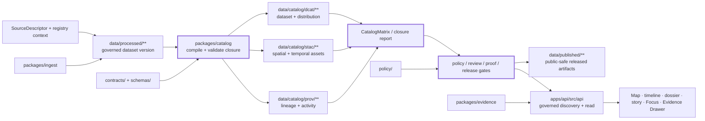

<!-- [KFM_META_BLOCK_V2]
doc_id: kfm://doc/NEEDS-VERIFICATION
title: packages/catalog
type: standard
version: v1
status: draft
owners: @bartytime4life
created: NEEDS-VERIFICATION
updated: 2026-04-23
policy_label: NEEDS-VERIFICATION
related: [../../README.md, ../README.md, ../ingest/README.md, ../evidence/README.md, ../../data/catalog/README.md, ../../data/catalog/dcat/README.md, ../../data/catalog/stac/README.md, ../../data/catalog/prov/README.md, ../../data/registry/README.md, ../../contracts/README.md, ../../schemas/README.md, ../../policy/README.md, ../../tests/README.md, ../../tools/README.md, ../../apps/api/src/api/README.md, ../../Makefile, ../../scripts/catalog_validate.py, ../../.github/CODEOWNERS]
tags: [kfm, packages, catalog, dcat, stac, prov, catalog-closure, evidence, release]
notes: [doc_id, created date, and policy_label need repo-side verification; owner is grounded in broad CODEOWNERS coverage for packages; package-local implementation depth remains NEEDS VERIFICATION beyond this README.]
[/KFM_META_BLOCK_V2] -->

<a id="top"></a>

# `packages/catalog`

Shared internal package seam for building and validating KFM catalog closure without becoming a second truth source.

> [!IMPORTANT]
> **Status:** experimental  
> **Document status:** draft  
> **Owners:** `@bartytime4life` *(broad `/packages/` ownership; verify child-specific ownership before merge)*  
> **Path:** `packages/catalog/README.md`  
> **Repo fit:** child of [`packages/`](../README.md) · upstream from [`data/catalog/`](../../data/catalog/README.md), [`data/catalog/dcat/`](../../data/catalog/dcat/README.md), [`data/catalog/stac/`](../../data/catalog/stac/README.md), [`data/catalog/prov/`](../../data/catalog/prov/README.md), and governed discovery/read surfaces under [`apps/api/src/api/`](../../apps/api/src/api/README.md)  
> **Quick jumps:** [Scope](#scope) · [Repo fit](#repo-fit) · [Accepted inputs](#accepted-inputs) · [Exclusions](#exclusions) · [Directory tree](#directory-tree) · [Quickstart](#quickstart) · [Usage](#usage) · [Diagram](#diagram) · [Reference tables](#reference-tables) · [Task list](#task-list--definition-of-done) · [FAQ](#faq) · [Appendix](#appendix)
>
> 
> 
> 
> 
> 
> 

> [!NOTE]
> This package README documents a **shared internal boundary**. It does not claim package-local code, fixtures, manifests, import graphs, or executable entrypoints exist until the active branch proves them.

---

## Scope

`packages/catalog/` is the internal package home for reusable catalog-closure logic.

Its job is to help KFM turn governed, release-candidate dataset versions into linked outward metadata across:

- **DCAT** for dataset and distribution discovery,
- **STAC** for spatial and temporal asset description,
- **PROV** for lineage, activities, agents, and replayability.

This package should support catalog closure. It must not replace canonical data, policy decisions, proof packs, release manifests, or governed API behavior.

> [!WARNING]
> `packages/catalog/` must not become a shortcut around the KFM trust membrane. A serializer success is not a promotion decision, a catalog file is not a proof pack, and outward metadata is not canonical truth.

### Evidence posture used here

| Claim type | Label | Reading rule |
|---|---:|---|
| KFM uses a governed truth path ending in catalog and publication | **CONFIRMED** | Root doctrine and data/catalog docs make catalog part of the lifecycle. |
| `packages/catalog/README.md` is the target file | **CONFIRMED** | This README is the target document for the package lane. |
| `packages/catalog/` should own reusable catalog-closure helpers | **INFERRED** | Strongly grounded in KFM package and catalog doctrine, but not proof of code. |
| Package-local implementation depth | **UNKNOWN / NEEDS VERIFICATION** | Do not claim modules, tests, fixtures, CLIs, or imports without branch evidence. |
| Future object shapes such as `CatalogClosure` | **PROPOSED** | Useful working vocabulary until schema and code confirm exact names. |

[Back to top](#top)

---

## Repo fit

`packages/catalog/` sits between governed upstream evidence/data surfaces and outward catalog artifacts.

It is not a data lifecycle zone. It is not a public route surface. It is not where policy is authored. It is a reusable package boundary for shared catalog work that would otherwise be duplicated in scripts, pipelines, apps, or one-off release jobs.

### Upstream, lateral, and downstream surfaces

| Relation | Surface | Why it matters |
|---|---|---|
| Root doctrine | [`../../README.md`](../../README.md) | Defines KFM as governed, evidence-first, map-first, and time-aware. |
| Parent package lane | [`../README.md`](../README.md) | Parent package boundary; currently thin and should be verified before relying on child inventories. |
| Upstream intake package | [`../ingest/README.md`](../ingest/README.md) | Intake helpers may create receipts or normalized metadata that later feed catalog closure. |
| Lateral evidence package | [`../evidence/README.md`](../evidence/README.md) | Evidence resolution and catalog closure cooperate but must not collapse into one authority. |
| Source/admission surface | [`../../data/registry/README.md`](../../data/registry/README.md) | Source identity, rights, cadence, and onboarding context are natural inputs to catalog metadata. |
| Outward catalog surface | [`../../data/catalog/README.md`](../../data/catalog/README.md) | Owns checked-in catalog metadata lanes and documents the DCAT/STAC/PROV triplet. |
| DCAT lane | [`../../data/catalog/dcat/README.md`](../../data/catalog/dcat/README.md) | Dataset and distribution discovery surface. |
| STAC lane | [`../../data/catalog/stac/README.md`](../../data/catalog/stac/README.md) | Spatial and temporal asset discovery surface. |
| PROV lane | [`../../data/catalog/prov/README.md`](../../data/catalog/prov/README.md) | Lineage and activity/entity/agent traceability surface. |
| Contracts | [`../../contracts/README.md`](../../contracts/README.md) | Contract language and object-family meaning should not be hidden inside package code. |
| Schemas | [`../../schemas/README.md`](../../schemas/README.md) | Machine-checkable schema authority belongs here or in the repo’s chosen schema home. |
| Policy | [`../../policy/README.md`](../../policy/README.md) | Rights, sensitivity, publication obligations, and fail-closed decisions constrain closure. |
| Verification | [`../../tests/README.md`](../../tests/README.md) | Valid/invalid fixtures and regression checks should pressure this package as it hardens. |
| Tooling | [`../../tools/README.md`](../../tools/README.md) | Durable validators may live in tools while calling shared package logic. |
| Public/runtime consumer | [`../../apps/api/src/api/README.md`](../../apps/api/src/api/README.md) | Governed API surfaces should consume released closure; they should not rebuild truth ad hoc. |

### Boundary split

| Surface | Owns | Does not own |
|---|---|---|
| `packages/catalog/` | Shared internal compile/validate helpers for catalog closure | Canonical data, raw/work/quarantine storage, policy decisions, public routes, or release approval |
| `data/catalog/**` | Checked-in outward DCAT/STAC/PROV metadata and lane docs | Shared package implementation or canonical processed payloads |
| `data/registry/` | Source/dataset admission identity and onboarding context | Catalog serialization logic |
| `policy/` | Allow/deny rules, obligations, sensitivity posture, publication constraints | Hidden serializer-local policy |
| `contracts/` / `schemas/` | Shared object grammar and validation definitions | Package-private undocumented contract drift |
| `apps/api/src/api/` | Governed discovery/read behavior over released scope | Direct raw store access or hidden on-demand publication |

[Back to top](#top)

---

## Accepted inputs

Content belongs in `packages/catalog/` when it is reusable, internal, evidence-aware catalog logic.

| Accepted input | What “good” looks like | Status |
|---|---|---:|
| Catalog closure builders | Build one linked closure across DCAT, STAC, PROV, release refs, identifiers, and digests | **PROPOSED** |
| Cross-link validators | Check subject/version parity across catalog triplet members and release references | **PROPOSED** |
| Shared serializers/mappers | Convert governed dataset-version metadata into outward catalog shapes without inventing truth | **PROPOSED** |
| Identifier and digest checks | Preserve stable identifiers, `spec_hash`, checksums, and release-safe references | **PROPOSED** |
| Package-local fixtures | Positive and negative examples committed under the package or tests once branch inventory proves the home | **NEEDS VERIFICATION** |
| Package-local docs | Boundary notes, object maps, and handoff rules that keep catalog work subordinate to policy/release | **CONFIRMED target** |

### Inputs this package may consume

- authoritative dataset-version or release-candidate metadata;
- stable dataset IDs, version IDs, spatial support, temporal support, and source refs;
- release-bearing manifests, checksums, run receipts, validation reports, and proof references;
- rights, sensitivity, review, correction, and publication posture from policy/review lanes;
- source descriptors and registry metadata needed for outward discovery.

> [!TIP]
> Treat “catalog input” as release-candidate metadata with enough identity and review context to be inspected. Do not feed scratch exports, raw source dumps, or unreviewed candidate payloads into package-level catalog closure.

[Back to top](#top)

---

## Exclusions

This package gets less trustworthy if it absorbs stronger authority surfaces.

| Do not keep here | Better home | Why |
|---|---|---|
| Source polling, authentication, checkpointing, or connector logic | [`../ingest/`](../ingest/README.md), [`../../pipelines/`](../../pipelines/README.md), or source-specific lanes | Catalog closure is downstream of governed intake. |
| Raw, work, quarantine, or canonical processed payloads | `data/raw/`, `data/work/`, `data/quarantine/`, `data/processed/` | Catalog code describes release-ready scope; it is not a lifecycle store. |
| Checked-in DCAT/STAC/PROV records as primary artifacts | [`../../data/catalog/`](../../data/catalog/README.md) and child lanes | Outward catalog artifacts belong in the data catalog surface. |
| Release manifests, proof packs, correction notices, or rollback refs as primary storage | release/proofs/correction surfaces | Promotion is a governed state transition, not a package-local write. |
| Policy bundles, reason catalogs, or hidden allow/deny logic | [`../../policy/`](../../policy/README.md) | Policy must remain explicit, executable, and reviewable. |
| API handlers, middleware, OpenAPI contracts, or route behavior | [`../../apps/api/src/api/`](../../apps/api/src/api/README.md), `contracts/`, and schema lanes | Serving discovery remains downstream of governed release. |
| Evidence Drawer presentation logic | UI/API/evidence surfaces | Catalog closure supports inspectability but does not render trust by itself. |
| Claims of package-local CLIs or tests that are not checked in | Active branch inventory first | Documentation must not overclaim implementation. |

> [!CAUTION]
> A catalog record that looks valid but points to unresolved rights, stale lineage, unreviewed scope, or mismatched release identity is a trust failure, not a cosmetic metadata issue.

[Back to top](#top)

---

## Directory tree

### Current conservative package snapshot

```text
packages/catalog/
└── README.md
```

### Adjacent catalog and control surfaces

```text
data/catalog/
├── README.md
├── dcat/
│   └── README.md
├── prov/
│   └── README.md
└── stac/
    └── README.md

data/registry/
└── README.md

scripts/
└── catalog_validate.py

Makefile
```

### Proposed package shape once implementation lands

```text
packages/catalog/
├── README.md
├── pyproject.toml                 # NEEDS VERIFICATION: only if repo adopts package-local Python metadata
├── src/                           # NEEDS VERIFICATION: exact language/package layout TBD
│   └── kfm_catalog/
│       ├── __init__.py
│       ├── closure.py
│       ├── dcat.py
│       ├── stac.py
│       ├── prov.py
│       └── validators.py
├── fixtures/
│   ├── valid/
│   │   └── catalog_closure.valid.json
│   └── invalid/
│       └── catalog_closure.mismatched-version.invalid.json
└── tests/
    └── test_catalog_closure.py
```

> [!NOTE]
> The proposed package shape is illustrative and must be adapted to the active repo’s actual package manager, test runner, import layout, and schema-home decision.

[Back to top](#top)

---

## Quickstart

Use the inspection path first. Upgrade to exact executable package commands only after code, fixtures, and package metadata exist on the branch under review.

### 1. Inspect the current package boundary

```bash
find packages/catalog -maxdepth 3 -type f | sort
sed -n '1,220p' packages/catalog/README.md
sed -n '1,180p' .github/CODEOWNERS
```

### 2. Read the outward catalog family

```bash
sed -n '1,220p' data/catalog/README.md
sed -n '1,180p' data/catalog/dcat/README.md
sed -n '1,180p' data/catalog/stac/README.md
sed -n '1,180p' data/catalog/prov/README.md
```

### 3. Check the repo-root catalog scaffold target

```bash
make catalog-validate
```

> [!NOTE]
> The current repo-root `catalog-validate` target is a scaffold check for required catalog README surfaces. It is useful as a presence check, not as proof of DCAT/STAC/PROV payload validity, proof-pack closure, or release readiness.

### 4. Search for real package implementation before documenting it

```bash
git ls-files 'packages/catalog/**'
git grep -n "CatalogClosure\|CatalogMatrix\|STAC\|DCAT\|PROV" -- \
  packages data docs contracts schemas policy tests tools scripts 2>/dev/null || true
```

### 5. Before adding the first real package command

Verify all of the following:

- package manager and test runner are known;
- schema home for catalog objects is settled or ADR-tracked;
- valid and invalid fixtures exist;
- closure checks cover DCAT, STAC, PROV, and release refs together;
- policy-sensitive fields are preserved through serialization;
- output lands in the correct data/catalog lane rather than becoming hidden package state.

[Back to top](#top)

---

## Usage

### Operating rule

A package-local catalog validator passing is necessary, not sufficient. KFM publication still requires evidence closure, policy/review state, catalog closure, proof objects, release manifest linkage, and rollback/correction posture where relevant.

### Recommended internal flow

1. Start from a governed dataset-version or release-candidate object.
2. Confirm source identity, rights, sensitivity, temporal scope, spatial support, checksums, and review state are available.
3. Build one linked `CatalogClosure`, not three disconnected metadata files.
4. Emit or validate DCAT, STAC, and PROV members together.
5. Check identifier parity, version parity, artifact digest parity, and release linkage.
6. Hand outward artifacts into `data/catalog/**`.
7. Let release/policy/proof surfaces decide whether the closure can move toward publication.
8. Let governed API consumers read released closure; do not make this package a client-facing route surface.

### Illustrative object sketch

```jsonc
{
  "object_type": "CatalogClosure",
  "closure_id": "kfm:catalog-closure:example",
  "subject": {
    "dataset_id": "kfm:dataset:example",
    "dataset_version": "v1",
    "spec_hash": "sha256:<64-hex>"
  },
  "members": {
    "dcat_ref": "data/catalog/dcat/datasets/example.v1.jsonld",
    "stac_ref": "data/catalog/stac/items/example.v1.json",
    "prov_ref": "data/catalog/prov/example.v1.prov.json"
  },
  "release_ref": "data/releases/example/release-manifest.v1.json",
  "checks": {
    "same_subject": true,
    "same_version": true,
    "digest_refs_match": true,
    "rights_visible": true,
    "sensitivity_visible": true
  },
  "decision": "PASS"
}
```

This sketch is **illustrative**. Do not treat it as a checked-in contract until the schema home and fixture suite confirm it.

[Back to top](#top)

---

## Diagram


```mermaid
flowchart LR
    A["SourceDescriptor + registry context"] --> B["data/processed/**<br/>governed dataset version"]
    B --> C["packages/catalog<br/>compile + validate closure"]

    C --> D["data/catalog/dcat/**<br/>dataset + distribution"]
    C --> E["data/catalog/stac/**<br/>spatial + temporal assets"]
    C --> F["data/catalog/prov/**<br/>lineage + activity"]

    D --> G["CatalogMatrix / closure report"]
    E --> G
    F --> G

    G --> H["policy / review / proof / release gates"]
    H --> I["data/published/**<br/>public-safe released artifacts"]
    H --> J["apps/api/src/api<br/>governed discovery + read"]

    J --> K["Map · timeline · dossier · story · Focus · Evidence Drawer"]

    L["packages/ingest"] --> B
    M["packages/evidence"] --> J
    N["policy/"] --> H
    O["contracts/ + schemas/"] --> C

    style C stroke-width:3px
    style G stroke-width:3px
    style H stroke-width:3px
```

The important boundary: `packages/catalog/` can help compile and validate closure, but release authority remains outside the package.

[Back to top](#top)

---

## Reference tables

### Object responsibility map

| Object / concept | Role in KFM | Package relationship |
|---|---|---|
| `DatasetVersion` | Stable subject with identity, version, time/support semantics, source refs, and validation context | Primary upstream input |
| `SourceDescriptor` | Source identity, role, rights, sensitivity, cadence, and activation context | Upstream input; never replaced here |
| `CatalogClosure` | Linked internal unit tying DCAT, STAC, PROV, release refs, and digest checks together | Primary package output concept; name **PROPOSED** until contract-confirmed |
| `CatalogMatrix` | Cross-surface closure report proving catalog/release/provenance consistency | Adjacent proof/promotion object; package may produce candidate report |
| `ReleaseManifest` | Release-bearing artifact set and alias target | Downstream / adjacent release object |
| `EvidenceBundle` | Evidence support bundle for consequential claims and trust-visible UI/API use | Downstream consumer; not this package’s sovereign output |
| `RunReceipt` | Process memory for a build/validation run | Package may emit or reference; receipt is not proof by itself |
| `CorrectionNotice` | Public correction, supersession, withdrawal, or replacement note | Downstream release/correction object |

### Closure checks worth making executable

| Check | Minimum expectation | Failure posture |
|---|---|---|
| Subject parity | DCAT, STAC, PROV, and release refs describe the same dataset/version subject | fail closed |
| Digest parity | Catalog records point to artifact digests that match the release or processed manifest | fail closed |
| Temporal scope | Valid time, observed time, publication time, and release time are not silently conflated | fail closed or hold |
| Rights visibility | License/access/sensitivity signals survive into outward metadata where required | deny/hold |
| Release linkage | Catalog closure references the release or promotion context that made it outward-safe | deny/hold |
| Correction lineage | Superseded or withdrawn records preserve old/new links | hold until corrected |
| No raw leakage | No RAW/WORK/QUARANTINE paths appear in public-facing closure | deny |

### Current status matrix

| Concern | Status | Notes |
|---|---:|---|
| README target exists | **CONFIRMED** | This file replaces the thin placeholder with a governed package README. |
| Broad owner signal | **CONFIRMED** | Broad `/packages/` ownership is `@bartytime4life`; child-specific ownership still needs verification. |
| Data catalog parent and triplet lanes | **CONFIRMED** | `data/catalog/`, `dcat/`, `stac/`, and `prov/` are documented as catalog surfaces. |
| Package-local code | **UNKNOWN** | Do not document modules or imports until branch inventory proves them. |
| Package-local fixtures/tests | **UNKNOWN** | Add only after schema/test home is settled. |
| Merge-blocking catalog closure validator | **NEEDS VERIFICATION** | Current root scaffold check is not full closure validation. |
| Catalog object schema home | **NEEDS VERIFICATION** | Avoid duplicating authority between `contracts/` and `schemas/`. |

[Back to top](#top)

---

## Task list / definition of done

A change touching `packages/catalog/` is not done until:

- [ ] this README still matches the active branch tree honestly;
- [ ] upstream input objects are identified and linked to source/registry/release context;
- [ ] DCAT, STAC, PROV, and release references are checked together, not as isolated files;
- [ ] rights, sensitivity, review, and correction posture survive serialization;
- [ ] no RAW, WORK, or QUARANTINE references leak into public-facing closure;
- [ ] package-local tests or fixtures are documented only when they exist;
- [ ] package-local commands are documented only when they are runnable on the branch;
- [ ] policy decisions remain in `policy/` or release/review surfaces, not hidden in serializers;
- [ ] outward records land in `data/catalog/**`;
- [ ] downstream API/evidence consumers read released closure instead of inventing parallel truth;
- [ ] relative links and Mermaid render cleanly on GitHub.

### Review gates

| Gate | Reviewer question |
|---|---|
| Boundary | Did the package stay internal and non-authoritative? |
| Evidence | Can every outward record resolve back to source/processed/release evidence? |
| Triplet closure | Do DCAT, STAC, and PROV agree on subject, version, and artifact identity? |
| Policy | Are rights, sensitivity, obligations, and denial/hold states preserved? |
| Release | Is there a release/proof/correction path outside this package? |
| Rollback | Can a bad closure be withdrawn or superseded without deleting prior meaning? |

[Back to top](#top)

---

## FAQ

### Does this package publish catalog records?

No. It may build or validate catalog closure, but publication is a governed transition involving policy, review, proof, release, and rollback/correction surfaces.

### Why distinguish `packages/catalog/` from `data/catalog/`?

Because they are different seams. `packages/catalog/` is shared internal logic. `data/catalog/` is the checked-in outward metadata surface for DCAT, STAC, and PROV.

### Can this package create authoritative dataset versions?

No. Authoritative or release-candidate dataset versions are upstream inputs. This package may describe them outwardly after they carry enough identity, validation, policy, and release context.

### Can DCAT, STAC, and PROV validate separately and still fail KFM closure?

Yes. File-level validity is not enough. KFM closure requires cross-link parity, shared subject/version identity, digest consistency, release linkage, and policy-visible context.

### Why is implementation depth marked `UNKNOWN`?

Because this README must not infer package-local modules, tests, fixtures, manifests, or CLIs from doctrine alone. Add exact implementation details only after branch files prove them.

[Back to top](#top)

---

## Appendix

### Verification backlog

- [ ] Replace `doc_id` with a real KFM document identifier.
- [ ] Verify the original creation date for this README.
- [ ] Confirm `policy_label` for package READMEs.
- [ ] Verify whether `/packages/catalog/` has narrower CODEOWNERS coverage.
- [ ] Confirm package manager, import layout, and test runner before adding package-local code commands.
- [ ] Decide whether catalog object schemas live under `contracts/`, `schemas/contracts/v1/`, or another canonical home.
- [ ] Add valid/invalid `CatalogClosure` fixtures once schema home is settled.
- [ ] Expand `make catalog-validate` only when the repo has real closure validation targets.
- [ ] Add a catalog cross-link report that checks DCAT/STAC/PROV/release alignment together.
- [ ] Ensure downstream API and Evidence Drawer docs consume released closure rather than bypassing it.

### Terminology crosswalk

| Term | Meaning in this README |
|---|---|
| Catalog closure | Cross-surface agreement among DCAT, STAC, PROV, release refs, digests, rights, and lineage |
| Catalog triplet | The outward DCAT + STAC + PROV metadata family |
| `CatalogClosure` | Proposed internal package output concept for one linked closure unit |
| `CatalogMatrix` | Proposed or shared proof/promotion object that records closure checks |
| Outward catalog surface | Checked-in catalog metadata under `data/catalog/**` |
| Trust membrane | Boundary that prevents raw, unreviewed, uncited, or policy-blocked material from becoming public truth |
| Inspectable claim | KFM’s value unit: a claim traceable to evidence, source role, policy posture, review state, release state, and correction lineage |

[Back to top](#top)
