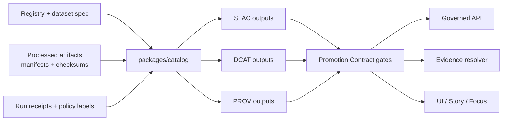

<!-- [KFM_META_BLOCK_V2]
doc_id: kfm://doc/<REVIEW_REQUIRED_UUID>
title: Catalog Package
type: standard
version: v1
status: review
owners: <TBD — NEEDS VERIFICATION>
created: <YYYY-MM-DD>
updated: <YYYY-MM-DD>
policy_label: <TBD — NEEDS VERIFICATION>
related: [../../README.md, ../ingest/README.md, ../../contracts/README.md, ../../policy/README.md, ../../data/registry/README.md, ../../data/catalog/stac/README.md, ../../apps/api/src/api/README.md]
tags: [kfm, catalog, stac, dcat, prov]
notes: [Mounted repo tree for packages/catalog was not directly inspectable in this session; UUID, owners, dates, and exact package internals remain review placeholders.]
[/KFM_META_BLOCK_V2] -->

# Catalog Package

Builds and validates KFM’s DCAT/STAC/PROV catalog closure from processed data.

> [!IMPORTANT]
> **Package status:** experimental  
> **Document status:** review  
> **Owners:** `TBD — NEEDS VERIFICATION`  
>     
> **Quick jump:** [Scope](#scope) · [Repo fit](#repo-fit) · [Accepted inputs](#accepted-inputs) · [Exclusions](#exclusions) · [Directory tree](#directory-tree) · [Quickstart](#quickstart) · [Usage](#usage) · [Diagram](#diagram) · [Reference tables](#reference-tables) · [Task list](#task-list-and-definition-of-done) · [FAQ](#faq) · [Appendix](#appendix)

> [!NOTE]
> This README keeps the **current repo path** `packages/catalog/`. Later replacement-grade manuals describe the same architectural seam as **catalog-closure** in a proposed future skeleton. Treat that as a naming crosswalk, not as a confirmed repo rename.

| Field | Value |
| --- | --- |
| Path | `packages/catalog/README.md` |
| Primary role | Build and validate KFM’s catalog triplet / closure |
| Primary outputs | `DCAT` + `STAC` + `PROV` |
| Upstream posture | Processed artifacts, registry/spec metadata, run receipts, policy labels |
| Downstream posture | Governed API, evidence resolution, Story/Focus surfaces, and promotion gates |
| Current truth posture | **CONFIRMED** role · **INFERRED** output conventions · **NEEDS VERIFICATION** mounted package contents |

## Scope

`packages/catalog/` is the package seam responsible for turning publishable processed scope into KFM’s **catalog triplet**: cross-linked **DCAT**, **STAC**, and **PROV** records that make discovery, lineage, and evidence resolution deterministic.

In KFM doctrine, the triplet is not decorative metadata. It is the outward-facing contract that sits between processed artifacts and governed publication. This package therefore exists to build, validate, and keep that contract clean.

**This package should:**

- emit and validate catalog artifacts for publishable dataset versions
- enforce cross-link integrity across DCAT, STAC, and PROV
- carry forward rights, sensitivity, provenance, and version identifiers into catalog outputs
- fail closed when triplet members are missing, invalid, or inconsistent

**This package should not:**

- fetch upstream source data
- normalize raw payloads into canonical publishable artifacts
- serve public client traffic directly
- replace policy enforcement, evidence resolution, or promotion review

[Back to top](#catalog-package)

## Repo fit

**Repo fit:** `packages/catalog/README.md`

The package sits between upstream ingest/canonicalization work and downstream governed discovery, evidence, and UI surfaces.

| Direction | Surface | Status | Why it matters |
| --- | --- | --- | --- |
| Upstream | [`../ingest/README.md`](../ingest/README.md) | CONFIRMED in project docs | Ingest emits normalized or validated material plus receipts that catalog construction depends on. |
| Upstream | [`../../data/registry/README.md`](../../data/registry/README.md) | CONFIRMED in project docs | Registry metadata supplies dataset identity, cadence, licensing, and source references. |
| Upstream | `../../data/processed/` | INFERRED / NEEDS VERIFICATION | Processed artifacts, manifests, and checksums are the publishable substrate the triplet describes. |
| Lateral | [`../../contracts/README.md`](../../contracts/README.md) | CONFIRMED in repo-grounded audit docs | Shared schemas, vocabularies, and fixtures constrain emission and validation behavior. |
| Lateral | [`../../policy/README.md`](../../policy/README.md) | CONFIRMED in repo-grounded audit docs | Rights, sensitivity, and publication obligations must survive into catalog outputs. |
| Downstream | [`../../data/catalog/stac/README.md`](../../data/catalog/stac/README.md) | CONFIRMED in project docs | STAC is a documented file-based outward surface. |
| Downstream | [`../../apps/api/src/api/README.md`](../../apps/api/src/api/README.md) | CONFIRMED in project docs | Governed discovery and read routes consume promoted catalog outputs. |
| Downstream | `packages/evidence`, `packages/indexers`, `apps/ui` | INFERRED | Evidence resolution, indexing, and public trust surfaces depend on promoted catalog closure. |

## Accepted inputs

### What belongs in this directory

- catalog emitters, serializers, and builders for **DCAT**, **STAC**, and **PROV**
- validators and cross-link consistency checks specific to catalog closure
- package-local fixtures and tests that prove valid and invalid triplet behavior
- README-level guidance for naming, versioning, linkage, and publication boundaries
- package code that translates processed artifacts and receipts into outward metadata

### What this package consumes at build/runtime

- processed dataset artifacts and their manifests
- deterministic dataset identifiers, versions, and spec hashes
- run receipts, provenance fields, and transform fingerprints
- license, rights, sensitivity, and obligation metadata
- controlled vocabularies and contract fixtures needed for validation

## Exclusions

| Not here | Goes instead | Why |
| --- | --- | --- |
| Upstream acquisition, polling, connector logic | [`../ingest/README.md`](../ingest/README.md) | Fetching is not catalog compilation. |
| RAW / WORK / QUARANTINE payload storage | `data/raw`, `data/work`, `data/quarantine` | Those are lifecycle zones, not package logic. |
| Canonical publishable artifact bodies | `data/processed/` | The triplet describes processed artifacts; it does not replace them. |
| Public API handlers and route contracts | [`../../apps/api/src/api/README.md`](../../apps/api/src/api/README.md) | Serving is downstream of catalog validation. |
| EvidenceRef → EvidenceBundle resolution | `packages/evidence` | Resolution consumes catalog outputs; it is not the catalog package itself. |
| Search indexes, map tiles, portrayal bundles | `packages/indexers` and portrayal workers | Those are derived projections, not catalog closure. |
| Policy bundles and approval rules | `policy/` | Policy constrains this package but should not be hidden inside it. |

> [!WARNING]
> Do not let `packages/catalog/` become a quiet replacement for source truth. In KFM, the catalog triplet is **authoritative outward metadata**, not the sole home of the underlying data.

## Directory tree

Only the **package slot** and its documented neighbors are shown below. Internal files under `packages/catalog/` were **not** directly inspectable in the mounted workspace during this session.

```text
packages/
├── ingest/                         # documented package family
├── catalog/                        # target package
│   └── README.md                   # this document
├── indexers/                       # documented package family
├── evidence/                       # documented package family
├── policy/                         # documented package family
└── domain/                         # documented package family

data/
├── registry/                       # documented metadata source
├── processed/                      # publishable artifacts; verify mounted tree
└── catalog/
    ├── stac/                       # documented path
    ├── dcat/                       # documented convention; verify mounted tree
    └── prov/                       # documented convention; verify mounted tree

apps/
├── api/
│   └── src/api/                    # documented downstream API surface
└── ui/                             # documented downstream UI family

contracts/
├── jsonschema/
├── openapi/
├── vocab/
└── fixtures/
```

## Quickstart

The command shapes below are **illustrative and review-friendly**, not a claim that every path is mounted exactly as written in the current workspace.

```bash
# Verify exact script names and locations in the mounted repo first.
make catalog-validate

python scripts/catalog/validate_stac.py \
  data/catalog/stac/items/<dataset>__<version>.json

scripts/catalog/validate_jsonld.sh \
  data/catalog/dcat/datasets/<dataset>__<version>.jsonld

python scripts/provenance/validate_prov.py \
  data/catalog/prov/<dataset>__<version>.prov.json

python scripts/evidence/crosslink_consistency.py \
  --stac data/catalog/stac/items/<dataset>__<version>.json \
  --dcat data/catalog/dcat/datasets/<dataset>__<version>.jsonld \
  --prov data/catalog/prov/<dataset>__<version>.prov.json \
  --manifest data/processed/<theme>/<dataset>/<version>/manifest.json
```

## Usage

### 1. Build the triplet from publishable scope

Feed the package stable, publishable inputs:

- processed artifact paths
- manifests and checksums
- dataset identity and version metadata
- run receipt / lineage metadata
- rights and sensitivity posture

### 2. Emit outward metadata without guessing

The package should generate:

- **STAC** for geospatial asset structure
- **DCAT** for dataset discovery and distribution
- **PROV** for lineage and transform history

### 3. Validate the closure as one object graph

Validation is not complete if only one member passes. The useful unit is the **cross-linked triplet**:

- identifiers line up
- links resolve
- distributions and assets agree
- provenance points to real build inputs and outputs
- policy-bearing fields survive translation

### 4. Hand forward only clean closure

Only after closure is valid should downstream governed surfaces consume it:

- governed API discovery/read routes
- evidence-resolution flows
- Story and Focus publication paths
- promotion / release gates

## Diagram


```mermaid
flowchart LR
    R["Registry + dataset spec"] --> C["packages/catalog"]
    P["Processed artifacts<br/>manifests + checksums"] --> C
    L["Run receipts + policy labels"] --> C

    C --> S["STAC outputs"]
    C --> D["DCAT outputs"]
    C --> V["PROV outputs"]

    S --> G["Promotion Contract gates"]
    D --> G
    V --> G

    G --> A["Governed API"]
    G --> E["Evidence resolver"]
    G --> U["UI / Story / Focus"]
```

Above: catalog construction turns processed artifacts plus receipts and policy-bearing metadata into cross-linked STAC/DCAT/PROV, then hands only validated closure forward to governed surfaces.

[Back to top](#catalog-package)

## Reference tables

### Catalog artifact matrix

| Artifact | Minimum expectation | Package duty | Typical destination |
| --- | --- | --- | --- |
| STAC Collection / Item | IDs, spatial/temporal scope, asset links, roles, self/collection/derived links | Build + validate | `data/catalog/stac/` |
| DCAT Dataset | Title, description, identifier, license, publisher, distribution links | Build + validate | `data/catalog/dcat/` |
| PROV Bundle | Entities, activities, agents, `used`, `wasGeneratedBy`, `wasDerivedFrom` | Build + validate | `data/catalog/prov/` |
| Cross-link report | Identifier parity, manifest parity, resolvable links, expected fields | Validate + fail closed | package-local reports / CI artifacts |
| Version readiness signal | Triplet completeness, checksums present, policy fields present | Validate + gate handoff | CI / promotion flow |

### Boundary map

| Question | Answer |
| --- | --- |
| Does this package own source acquisition? | No — upstream connectors and ingest lanes do. |
| Does this package own canonical dataset bodies? | No — processed artifacts live in lifecycle zones or canonical stores. |
| Is the triplet just a docs convenience layer? | No — it is the outward metadata contract for publishable versions. |
| Does this package serve clients directly? | No — governed API surfaces sit downstream. |
| Does this package decide policy? | No — it carries policy-bearing fields and validates their presence, but policy bundles and approvals live elsewhere. |
| Can this package silently publish partial metadata? | No — KFM’s promotion posture is fail closed. |

## Task list and definition of done

A package change touching catalog closure should be review-complete only when these gates are visibly satisfied:

- [ ] triplet members exist for the targeted publishable version
- [ ] **STAC**, **DCAT**, and **PROV** all validate independently
- [ ] cross-links across the three members resolve without guessing
- [ ] checksums, manifests, and version identifiers align with processed artifacts
- [ ] license, rights, and sensitivity fields are carried through
- [ ] public-facing distributions reference only publishable scope
- [ ] package-local tests include both valid and invalid fixtures
- [ ] at least one downstream governed retrieval path is still resolvable
- [ ] docs and rollback/update notes are refreshed when behavior changes

## FAQ

### Why is this package named `catalog` here if later manuals say `catalog-closure`?

Because this README documents the **current target path**. The later term clarifies the architectural seam; it does not, by itself, prove a mounted repo rename.

### Is the catalog triplet authoritative truth?

It is **authoritative outward metadata**. It is not the sole home of canonical measurements, raw source payloads, or processed artifact bodies.

### Why keep DCAT, STAC, and PROV together?

Because KFM’s publishable unit is not “some metadata.” It is a **cross-linked closure** that supports discovery, lineage, evidence resolution, and governed publication without guessing.

## Appendix

<details>
<summary><strong>Terminology crosswalk and verification backlog</strong></summary>

### Terminology crosswalk

| Term | Meaning |
| --- | --- |
| `CATALOG` | Lifecycle state in the KFM truth path. |
| catalog triplet | The linked **DCAT + STAC + PROV** artifact family required for a publishable version. |
| catalog closure | Replacement-grade manual term for the same outward metadata seam, emphasizing completeness and cross-linking. |
| authoritative outward metadata | The status of promoted catalog closure once emitted and validated. |

### Open verification steps for maintainers

- Inspect the mounted `packages/catalog/` tree and replace any package-in-context placeholders with real contents.
- Confirm whether `data/catalog/dcat/` and `data/catalog/prov/` exist exactly as written or use a different mounted layout.
- Replace `TBD` values in the KFM meta block with the real doc UUID, owners, dates, and policy label.
- Confirm the current CI entrypoints and keep only the commands that actually exist.
- Add package-local ownership markers if the repo uses CODEOWNERS or directory-level maintainers.
- Link this README from adjacent package and data-surface docs once path verification is complete.

</details>

[Back to top](#catalog-package)
