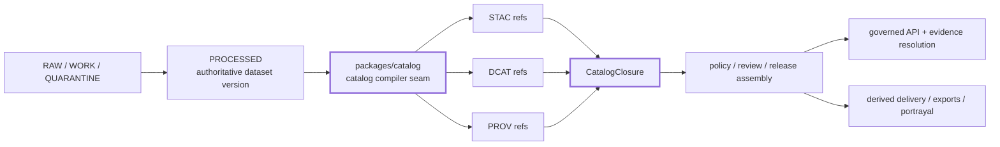

<!-- [KFM_META_BLOCK_V2]
doc_id: kfm://doc/<REVIEW_REQUIRED_UUID>
title: Catalog Package
type: standard
version: v1
status: review
owners: <TBD — NEEDS VERIFICATION>
created: <YYYY-MM-DD>
updated: <YYYY-MM-DD>
policy_label: <TBD — NEEDS VERIFICATION>
related: [../../README.md, ../ingest/README.md, ../../contracts/README.md, ../../policy/README.md, ../../data/registry/README.md, ../../data/catalog/stac/README.md, ../../apps/api/src/api/README.md]
tags: [kfm, catalog, stac, dcat, prov]
notes: [Target path supplied by task; mounted checkout for packages/catalog was not directly inspectable in this session. UUID, owners, dates, policy label, exact sibling paths, and concrete package internals remain review placeholders.]
[/KFM_META_BLOCK_V2] -->

# Catalog Package

Builds and validates KFM’s outward catalog closure for promoted dataset versions.

> [!IMPORTANT]
> **Status:** experimental  
> **Document status:** review  
> **Owners:** `TBD — NEEDS VERIFICATION`  
>     
> **Quick jump:** [Scope](#scope) · [Repo fit](#repo-fit) · [Accepted inputs](#accepted-inputs) · [Exclusions](#exclusions) · [Directory tree](#directory-tree) · [Quickstart](#quickstart) · [Usage](#usage) · [Diagram](#diagram) · [Reference tables](#reference-tables) · [Task list](#task-list-and-definition-of-done) · [FAQ](#faq) · [Appendix](#appendix)

> [!NOTE]
> This README is written for the target path `packages/catalog/README.md`, but the mounted checkout was **not** directly inspectable in this session. The doctrine behind the package is strong; the exact package tree, commands, sibling folders, and ownership markers still need checkout verification.

| Field | Value |
| --- | --- |
| Path target | `packages/catalog/README.md` |
| Primary role | Compile and validate KFM `CatalogClosure` objects |
| Outward metadata family | `STAC` + `DCAT` + `PROV` |
| Upstream posture | Promoted or promotion-candidate dataset versions, manifests, checksums, rights/sensitivity context |
| Downstream posture | Policy/review gates, release assembly, governed discovery/read APIs, evidence resolution |
| Current evidence posture | **CONFIRMED** doctrine · **INFERRED** package seam shape · **UNKNOWN** mounted package contents |

## Scope

In KFM doctrine, `CATALOG` is not a loose metadata afterthought. It is a distinct stage in the truth path, and its closure is expected to carry outward **STAC / DCAT / PROV** references plus release linkage. This package is therefore the catalog-compiler seam: it turns authoritative dataset versions into outward-facing, resolvable metadata that downstream publication and trust-visible surfaces can rely on.

**This package should:**

- compile outward `CatalogClosure` artifacts from authoritative dataset versions
- validate identifier parity and cross-link integrity across `STAC`, `DCAT`, and `PROV`
- preserve lineage, rights, sensitivity, and release linkage in outward metadata
- fail closed when closure is incomplete, inconsistent, or not publication-ready

**This package should not:**

- fetch or poll upstream sources
- normalize RAW or WORK payloads into authoritative dataset versions
- replace policy review, release assembly, or correction governance
- serve public client traffic directly

> [!WARNING]
> The catalog package is part of KFM’s **catalog / policy / review plane**, but it is **not** the whole plane. Catalog compilation feeds publication; it does not silently self-approve publication.

[Back to top](#catalog-package)

## Repo fit

**Repo fit:** target path `packages/catalog/README.md`

This README sits at the seam between authoritative dataset versions and public-safe release objects. The related docs below come from the task specification and surrounding corpus, but exact mounted file presence still needs checkout verification.

| Direction | Related surface | Why it matters here | Evidence posture |
| --- | --- | --- | --- |
| Upstream | [`../ingest/README.md`][ingest-readme] | Ingest and validation lanes produce source-native landings and receipts that later feed authoritative versions and closure work. | Task-supplied path; exact mounted doc needs verification |
| Upstream | authoritative dataset versions, manifests, checksums | Catalog compilation depends on stable IDs, time semantics, provenance links, and publishable scope. | **CONFIRMED** doctrinal dependency |
| Lateral | [`../../contracts/README.md`][contracts-readme] | Contract families define what a `CatalogClosure` must contain and how it should validate. | Task-supplied path; doctrinal fit **CONFIRMED** |
| Lateral | [`../../policy/README.md`][policy-readme] | Rights, sensitivity, reason codes, and obligations constrain what closure may hand forward. | Task-supplied path; doctrinal fit **CONFIRMED** |
| Lateral | [`../../data/registry/README.md`][registry-readme] | Registry-style metadata is the natural source of identity, steward, cadence, and distribution hints. | Task-supplied path; exact mounted doc needs verification |
| Downstream | [`../../data/catalog/stac/README.md`][stac-readme] | The task explicitly names a STAC catalog surface downstream of this package. | Task-supplied path |
| Downstream | [`../../apps/api/src/api/README.md`][api-readme] | Governed discovery and read surfaces should consume published closure, not bypass it. | Task-supplied path; doctrinal fit **CONFIRMED** |
| Downstream | evidence resolution and trust-visible shell surfaces | Evidence drawers, dossier/read routes, exports, and Focus depend on resolvable published scope. | **CONFIRMED** doctrinal dependency; exact repo paths **UNKNOWN** |

## Accepted inputs

### What belongs in this directory

- catalog builders, serializers, and validators centered on `CatalogClosure`
- cross-link integrity checks for `STAC`, `DCAT`, and `PROV`
- tests and fixtures for valid and invalid closure states
- package-local docs describing catalog boundaries, release handoff, and correction-aware behavior
- code that translates authoritative dataset versions into outward metadata and linkage objects

### What this package consumes

- authoritative `DatasetVersion`-like inputs or their repo-native equivalent
- stable identifiers, version IDs, support semantics, and valid-time context
- manifests, checksums, and other integrity-bearing release inputs
- lineage/provenance fields that must remain outwardly resolvable
- rights, sensitivity, and public-safe visibility context supplied by adjacent policy/review lanes

## Exclusions

| Not here | Goes instead | Why |
| --- | --- | --- |
| Source polling, connector auth, checkpointing | [`../ingest/README.md`][ingest-readme] and source/intake lanes | Fetching is upstream intake, not catalog closure |
| RAW / WORK / QUARANTINE handling | lifecycle zones and intake/canonical lanes | Closure describes promotable scope; it does not replace lifecycle staging |
| Canonical entity repair or authoritative data writes | canonical builder / repair lane | Catalog compilation depends on authoritative versions; it does not create authority by itself |
| Rights adjudication and approval workflows | [`../../policy/README.md`][policy-readme] and review lanes | Policy must remain explicit and inspectable, not buried inside serializers |
| Release manifest assembly and correction issuance | release / review / correction lanes | Promotion is a governed state transition, not just successful metadata output |
| Public API handlers and route behavior | [`../../apps/api/src/api/README.md`][api-readme] | Serving happens downstream of closure |
| Derived delivery artifacts such as tiles, search indexes, graph projections, scenes | derived delivery / projection workers | Those outputs depend on promoted scope and must remain rebuildable by default |

## Directory tree

**Documentation seam map** — review-oriented, **not** a direct `ls` snapshot.

```text
packages/
├── catalog/
│   └── README.md                     # this file (task target)
└── ingest/
    └── README.md                     # related upstream doc path from task

../../
├── README.md                         # repo root doc path from task
├── contracts/
│   └── README.md
├── policy/
│   └── README.md
├── data/
│   ├── registry/
│   │   └── README.md
│   └── catalog/
│       └── stac/
│           └── README.md
└── apps/
    └── api/
        └── src/api/
            └── README.md
```

> [!TIP]
> Keep this tree conservative. Add sibling package internals, test folders, or `data/catalog/dcat` / `data/catalog/prov` paths only after checkout verification confirms them.

## Quickstart

### 1. Inspect before you trust

```bash
# Inspection-first: verify the real package shape before adopting any placeholder path or command.
# These commands are examples of the *kind* of inspection to do, not a claim that every file exists exactly here.

ls packages/catalog
find packages/catalog ../../contracts ../../policy ../../tests -maxdepth 3 2>/dev/null | sed -n '1,120p'
grep -R "catalog" -n Makefile package.json pyproject.toml scripts .github/workflows 2>/dev/null | sed -n '1,120p'
```

### 2. Run the package’s real validation entrypoint

```bash
# ILLUSTRATIVE ONLY — replace placeholders with the repo's verified command set.
# Do not keep this block as-is once the mounted checkout is available.

<catalog-build-command> \
  --dataset <dataset-id> \
  --version <version-id>

<catalog-validate-command> \
  --stac <path/to/stac.json> \
  --dcat <path/to/dcat.jsonld> \
  --prov <path/to/prov.json> \
  --closure <path/to/catalog-closure.json>
```

## Usage

### 1. Start from authoritative, not convenient, inputs

Catalog work starts only after upstream material is authoritative enough to carry stable identity, time semantics, and lineage. A convenient export or ad hoc file drop is not sufficient if support, versioning, or rights posture are still unresolved.

### 2. Compile one closure, not three drifting files

The unit of work here is the **linked closure**, not disconnected metadata fragments. `STAC`, `DCAT`, and `PROV` should agree on identity, release scope, and outward linkage.

### 3. Validate both member objects and closure behavior

Independent schema validity matters, but KFM doctrine also expects **resolution** and **outward-link integrity**. The package is not done when three files merely parse; it is done when the closure resolves cleanly enough to support downstream publication and evidence drill-through.

### 4. Hand forward only publishable closure

After validation, the package hands closure forward to adjacent review/policy/release lanes. Those lanes own approval, denial, correction, rollback, and public-safe publication decisions.

## Diagram


```mermaid
flowchart LR
    A["RAW / WORK / QUARANTINE"] --> B["PROCESSED<br/>authoritative dataset version"]
    B --> C["packages/catalog<br/>catalog compiler seam"]

    C --> D["STAC refs"]
    C --> E["DCAT refs"]
    C --> F["PROV refs"]

    D --> G["CatalogClosure"]
    E --> G
    F --> G

    G --> H["policy / review / release assembly"]
    H --> I["governed API + evidence resolution"]
    H --> J["derived delivery / exports / portrayal"]

    style C stroke-width:3px
    style G stroke-width:3px
```

Above: the package sits after authoritative versioning and before policy/review/release assembly. It compiles outward closure; it does not bypass governance.

[Back to top](#catalog-package)

## Reference tables

### Closure object map

| Object | Role in doctrine | Package relation |
| --- | --- | --- |
| `DatasetVersion` | Authoritative candidate or promoted subject set with stable ID, version ID, support/time semantics, and provenance links | **Primary input** |
| `CatalogClosure` | Outward metadata closure and lineage linkage containing `STAC / DCAT / PROV` refs, identifiers, release linkage, and outward profile refs | **Primary build + validation object** |
| `DecisionEnvelope` | Machine-readable policy result | Adjacent/downstream; not the package’s core output |
| `ReviewRecord` | Human approval, denial, or escalation artifact | Adjacent/downstream |
| `ReleaseManifest / ReleaseProofPack` | Public-safe release assembly and proof | Downstream handoff |
| `ProjectionBuildReceipt` | Proof that a derived layer was built from known release scope | Downstream of promotion |
| `EvidenceBundle` | Request-time support package for claims, exports, stories, or answers | Downstream consumer of published closure |

### Outward vocabulary posture used in this README

| Vocabulary | Corpus-level role | Practical consequence here |
| --- | --- | --- |
| `STAC` | Common language for spatiotemporal assets | Closure must expose asset- and scene-facing metadata cleanly |
| `DCAT` | Dataset and distribution discovery vocabulary | Closure must support dataset/distribution discovery, not just file naming |
| `PROV` / `PROV-O` | Outward lineage vocabulary | Closure must preserve causality and lineage hints, not only discovery metadata |
| `JSON Schema` | Machine-validatable contract language | Validators, fixtures, and negative tests should be explicit rather than implied |

### Boundary questions

| Question | Answer |
| --- | --- |
| Does this package create authoritative dataset versions? | No. It consumes them. |
| Does this package approve publication? | No. Policy/review/release lanes do. |
| Can the closure be partial and still publish? | Only if adjacent gates explicitly allow that state and keep it visible; otherwise the system should fail closed. |
| Is the closure just for discovery? | No. In KFM doctrine it also carries lineage and release consequences. |
| Are map tiles, search indexes, and graph projections owned here? | No. Those are downstream derived delivery artifacts. |

## Task list and definition of done

A change in this package should not be treated as done until these conditions are visible:

- [ ] an authoritative input object or dataset version is identified
- [ ] closure members for `STAC`, `DCAT`, and `PROV` are emitted or updated together
- [ ] each member validates independently
- [ ] cross-link resolution across the closure passes
- [ ] identifier parity and release linkage are consistent
- [ ] rights/sensitivity context survives into outward metadata
- [ ] invalid fixtures cover broken IDs, broken links, missing policy-bearing fields, and schema failures
- [ ] downstream release or runtime consumers still resolve published closure correctly
- [ ] docs are updated when closure semantics, profiles, or handoff behavior change

## FAQ

### Why is the package named `catalog` here instead of `catalog-closure`?

Because the task targets `packages/catalog/README.md`. The corpus strongly uses **catalog closure** as the doctrinal concept, but that does not by itself prove a mounted repo rename.

### Why is only the STAC data-surface README linked explicitly?

Because the task explicitly named `../../data/catalog/stac/README.md`. In this session, exact `DCAT` and `PROV` README paths were not separately surfaced from a mounted checkout, so they are treated as downstream expectations rather than hard-linked repo facts.

### Does this package publish directly to the public shell?

No. Closure feeds policy/review/release assembly first, then governed APIs and downstream trust-visible surfaces.

### Can this package quietly become the source of truth?

No. KFM doctrine separates authoritative versions, catalog closure, derived delivery, and runtime trust surfaces on purpose.

## Appendix

<details>
<summary><strong>Evidence posture, verification backlog, and terminology crosswalk</strong></summary>

### Evidence posture for this README

| Item | Status | Why |
| --- | --- | --- |
| `CATALOG` is a distinct stage in the truth path | **CONFIRMED** | Strongly repeated in the mounted KFM doctrine corpus |
| `CATALOG` closure includes outward `STAC / DCAT / PROV` references | **CONFIRMED** | Explicit doctrinal statement |
| `CatalogClosure` is a named contract family | **CONFIRMED** | Explicit doctrinal statement |
| Exact `packages/catalog/` module inventory | **UNKNOWN** | No mounted checkout was directly inspected |
| Exact script names, tests, fixtures, and CI entrypoints | **UNKNOWN** | No mounted checkout was directly inspected |
| Related README paths listed in the task | **TASK-SUPPLIED / NEEDS VERIFICATION** | Useful for repo fit, but still subject to checkout verification |

### Verification backlog for maintainers

- Replace review placeholders in the KFM meta block with a real UUID, owners, dates, and policy label.
- Confirm the mounted `packages/catalog/` tree and add actual package-local files beneath the directory map.
- Replace illustrative quickstart placeholders with the repo’s real command entrypoints.
- Confirm whether the repo already has explicit `DCAT` and `PROV` catalog-surface docs.
- Link this README from adjacent docs once the mounted checkout confirms the surrounding structure.
- Add concrete tests/fixtures references only after the repo tree proves their exact locations.

### Terminology crosswalk

| Term | Meaning in this doc |
| --- | --- |
| `catalog compiler` | The component family that compiles resolvable `STAC / DCAT / PROV` closure and outward metadata |
| `CatalogClosure` | The outward metadata closure object carrying refs, identifiers, lineage linkage, and release linkage |
| `catalog closure` | The doctrinal concept behind `CatalogClosure`; often used more broadly than a literal schema name |
| `outward metadata` | Metadata intended for governed discovery, release, and evidence-aware consumption |
| `promoted scope` | Scope that has passed the relevant release/publication gates |

</details>

[Back to top](#catalog-package)

[repo-root]: ../../README.md
[ingest-readme]: ../ingest/README.md
[contracts-readme]: ../../contracts/README.md
[policy-readme]: ../../policy/README.md
[registry-readme]: ../../data/registry/README.md
[stac-readme]: ../../data/catalog/stac/README.md
[api-readme]: ../../apps/api/src/api/README.md
