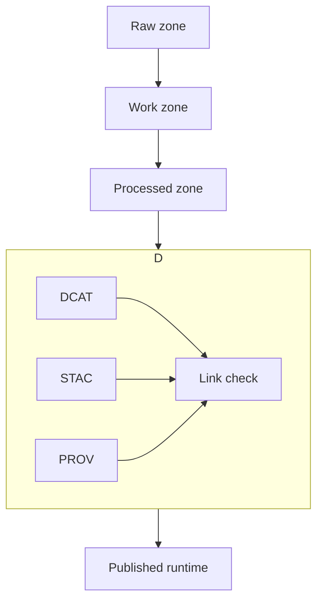

<!-- [KFM_META_BLOCK_V2]
doc_id: kfm://doc/018c267d-41f5-425f-887a-c6c9a92ed6a0
title: Catalog package source README
type: standard
version: v1
status: draft
owners: TBD
created: 2026-02-25
updated: 2026-02-25
policy_label: public
related:
  - ../../../docs/MASTER_GUIDE_v13.md
  - ../../../docs/standards/KFM_DCAT_PROFILE.md
  - ../../../docs/standards/KFM_STAC_PROFILE.md
  - ../../../docs/standards/KFM_PROV_PROFILE.md
tags: [kfm, catalog, dcat, stac, prov, evidence]
notes:
  - Documents the catalog-triplet implementation surfaces: DCAT, STAC, PROV.
  - Update related paths to match the repo layout in this codebase.
[/KFM_META_BLOCK_V2] -->

# Catalog package
Builds and validates the KFM catalog triplet so dataset versions are discoverable, auditable, and evidence-resolvable.

**Status:** draft • **Owners:** TBD • **Policy:** public

[](#)
[](#)
[](#)
[](#)

## Navigation
- [Purpose](#purpose)
- [Responsibilities](#responsibilities)
- [Key concepts](#key-concepts)
- [Inputs and outputs](#inputs-and-outputs)
- [How it fits in the system](#how-it-fits-in-the-system)
- [Validation and CI](#validation-and-ci)
- [Developer workflow](#developer-workflow)
- [Governance and safety](#governance-and-safety)
- [Appendix](#appendix)

## Purpose
This package is a **contract surface** between:
- **pipelines** that produce dataset artifacts, and
- **runtime** features that must prove where data came from and what is allowed to be shown.

It does that by producing a **cross-linked catalog triplet**:
- **DCAT** for dataset-level metadata,
- **STAC** for asset and spatiotemporal metadata, and
- **PROV** for lineage, run receipts, and environment capture.

## Where this fits in the repo
This folder lives at:

- `packages/catalog/src/`

In the KFM reference layout, catalog outputs typically live under `data/` (e.g., STAC, DCAT, PROV folders). Your repo may differ—treat those locations as targets and update links accordingly.

## Non-goals
This package does not:
- run ingestion/ETL pipelines or transform raw data
- implement map rendering or UI logic
- bypass policy enforcement “to make things work”
- store secrets, credentials, or private keys
- talk directly to production databases or object stores from client code

## Responsibilities
| Area | What this code must do | “Done” looks like |
|---|---|---|
| Triplet builders | Emit DCAT, STAC, and PROV artifacts for a single dataset version | Each artifact is schema-valid where schemas exist |
| Cross-linking | Ensure deterministic links among DCAT, STAC, PROV | Evidence references resolve without guessing |
| Deterministic identity | Use stable IDs for dataset versions and artifacts | Same inputs produce same IDs and digests |
| Policy-aware shaping | Respect `policy_label` and obligations | No restricted details leak into public artifacts |
| Validation hooks | Provide validators CI can run on changed artifacts | CI fails closed on validation errors |

## Key concepts
### The catalog triplet
- **DCAT** answers: what the dataset is, who publishes it, license, and distributions.
- **STAC** answers: spatiotemporal extents plus assets for collections and items.
- **PROV** answers: which inputs, tools, and parameters produced which outputs, with environment capture.

### Evidence references
The system uses scheme-based references so “citations” are resolvable objects, not URL guesses.

Expected schemes:
- `dcat://…` → dataset and distribution metadata
- `stac://…` → collection, item, and asset metadata
- `prov://…` → run lineage, run receipts, and provenance graph
- `doc://…` → governed docs and story citations
- `graph://…` → entity relations, if graph features are enabled

## Inputs and outputs
### Inputs this package expects
This package typically needs:
- Dataset identity: `dataset_slug` and `dataset_version_id`
- Dataset metadata: title, description, publisher, license or rights, themes
- Coverage: spatial and temporal extents
- Artifact inventory: outputs with `href` plus strong digests
- Run receipt metadata: toolchain, parameters, container digest, git commit
- Policy inputs: `policy_label` and any computed obligations

### Outputs it produces
Depending on wiring, outputs usually include:
- **DCAT dataset** plus distributions
- **STAC collection** plus items with assets
- **PROV bundle** with activity, entities, and agents
- Optional: a link index or manifest used by a link-checker

## How it fits in the system


### Cross-link rules
At minimum, cross-links should support deterministic navigation:
- DCAT dataset → distributions → artifact digests
- DCAT dataset → `prov:wasGeneratedBy` → PROV bundle
- STAC collection → `rel="describedby"` → DCAT dataset
- STAC item → link to PROV activity or run receipt
- EvidenceRef schemes resolve into these objects

## Validation and CI
This package should make it easy for CI to enforce catalog and provenance gates.

### Minimum checks
- [ ] JSON schema validation for DCAT, STAC, PROV profiles
- [ ] Link check: required cross-links exist and resolve in repo context
- [ ] Evidence resolver contract tests
  - [ ] public evidence resolves to bundle with allowed artifacts
  - [ ] restricted evidence denies with no sensitive metadata leakage
- [ ] spec hash stability tests
- [ ] Golden tests for canonicalization and deterministic outputs

### Local validation
> TODO: Replace the commands below with the scripts actually defined in `packages/catalog/package.json`.

```bash
# Examples only — update once package manager is confirmed.
pnpm -C packages/catalog test
pnpm -C packages/catalog lint
pnpm -C packages/catalog validate:catalog
```

## Developer workflow
### Adding a new dataset version
1. Ensure a stable dataset spec exists so versioning is deterministic.
2. Generate processed artifacts outside this package.
3. Use this package to generate DCAT, STAC, PROV and cross-links.
4. Run validators and link-checker.
5. Only then promote into governed runtime surfaces.

## Governance and safety
### Policy labels and sensitive locations
Catalog artifacts must never leak restricted information.

If a dataset is classified as sensitive location:
- Produce a restricted precise dataset version for authorized roles.
- Optionally produce a `public_generalized` dataset version if public representation is allowed.
- Document the generalization method and test for coordinate leakage.
- Ensure the UI can display a notice describing generalization and the reason.

### Default deny posture
If rights, sensitivity, or required citations cannot be verified:
- fail closed
- block promotion and publishing
- emit an audit-friendly error response

## Appendix
<details>
<summary>Glossary</summary>

- **DatasetVersion**: A versioned snapshot of a dataset tied to deterministic inputs.
- **Run receipt**: A machine-readable record of what ran, when, with which inputs and outputs, and under which policy decision.
- **EvidenceBundle**: The resolved, policy-filtered bundle of metadata and artifacts backing a claim or feature.

</details>

---
Back to top: [↑](#catalog-package)
