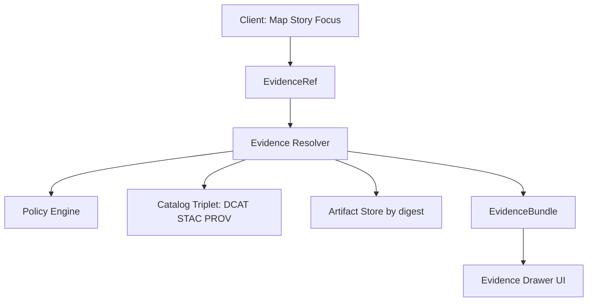

<!-- [KFM_META_BLOCK_V2]
doc_id: kfm://doc/3a8d5d4e-2b5c-4f2e-9c3a-4b10c3a8ef07
title: EvidenceRef — stable, parseable evidence identifiers
type: standard
version: v1
status: draft
owners: TBD (Catalog maintainers)
created: 2026-02-25
updated: 2026-02-25
policy_label: public
related:
  - TODO: link to repo governance + API contracts
tags: [kfm, catalog, evidence, provenance, citations]
notes:
  - EvidenceRef is the canonical, parseable identifier used in citations and evidence resolution.
[/KFM_META_BLOCK_V2] -->

<a id="top"></a>

# EvidenceRef
Stable, parseable evidence identifiers used for citations across KFM (Map, Story, Focus).


> [!IMPORTANT]
> **EvidenceRefs are not “just URLs.”** They are intended to remain resolvable across rehosting and infrastructure changes by using canonical IDs and immutable dataset versions.

---

## Navigation
- [Overview](#overview)
- [What belongs in this directory](#what-belongs-in-this-directory)
- [Core concepts](#core-concepts)
- [Scheme registry](#scheme-registry)
- [Parsing and normalization rules](#parsing-and-normalization-rules)
- [How EvidenceRefs are used](#how-evidencerefs-are-used)
- [Security and governance invariants](#security-and-governance-invariants)
- [Proposed API surface](#proposed-api-surface)
- [Testing and CI expectations](#testing-and-ci-expectations)
- [Extending with new schemes](#extending-with-new-schemes)
- [Troubleshooting](#troubleshooting)
- [Appendix](#appendix)

---

## Overview
**EvidenceRef** is the canonical reference type for *anything you can cite* inside KFM:
datasets, assets, provenance runs, documents/spans, and graph relationships.

It exists so that:
- citations remain **stable** and **inspectable** over time
- citations are **verifiable in CI** (story/narrative gates)
- resolution always goes through a **policy boundary** (no bypass)

> [!NOTE]
> This directory should focus on **representation + validation + canonicalization** of EvidenceRefs.
> **Resolution** (fetching/expanding into cards/metadata/artifacts) belongs to the Evidence Resolver service/module.

[Back to top](#top)

---

## What belongs in this directory

| In scope | Out of scope |
|---|---|
| EvidenceRef type definitions | Network calls to object storage / external URLs |
| Parsing + validation | Policy decisions (those live in policy engine / resolver) |
| Canonicalization / normalization | Full-text search results (“raw text”) |
| Scheme registry + extension hooks | Rendering UI cards (belongs to EvidenceBundle / UI layer) |
| Fixtures for valid/invalid refs | Any direct DB/storage access from clients |

[Back to top](#top)

---

## Core concepts

### EvidenceRef
A string (or structured object) that encodes **what evidence is being cited** in a way that is:
- deterministic to parse
- stable over time
- resolvable via the Evidence Resolver

### EvidenceBundle
The **resolved** form of evidence that is safe to show to a given user role. Typically contains:
- policy decision + obligations
- human-readable “cards”
- machine metadata (dataset_version_id, digests, provenance links)
- artifact links **only if allowed**

### DatasetVersion and digests
EvidenceRefs should ultimately ground into:
- a **dataset_version_id** (versioned dataset identity)
- **artifact digests** (immutable content addressing)

[Back to top](#top)

---

## Scheme registry

KFM guidance calls for a minimal scheme set. This module should treat those schemes as first-class.

> [!WARNING]
> The *exact* path grammar for each scheme is a **contract** and must be enforced by tests/schemas.
> If you change the grammar, you are changing citations; treat it as a breaking change.

### Minimal supported schemes (recommended)
| Scheme | Resolves to | Typical use | Example (illustrative) |
|---|---|---|---|
| `dcat://...` | dataset/distribution metadata | cite a dataset or distribution | `dcat://@<dataset_id>` |
| `stac://...` | collection/item/asset metadata | cite a layer, item, or asset | `stac://<collection>/<item>#asset=<asset_key>` |
| `prov://...` | lineage: activities/entities/agents | cite how something was produced | `prov://run/<run_id>` |
| `doc://...` | governed documents + spans | cite scanned/OCR docs with page+span | `doc://sha256:<digest>#page=12&span=1832:1935` |
| `graph://...` | entity relations (if enabled) | cite relationships/traversals | `graph://entity/<type>/<id>` |

> [!NOTE]
> Some extracted text may show `span;` (with a semicolon). Canonically, treat this as a query key like `span` (verify in schema).

[Back to top](#top)

---

## Parsing and normalization rules

### Hard requirements
- **Parseable without network calls**  
  Parsing/validation must not require fetching remote resources.
- **Policy-safe failures**  
  Validation errors must be safe to surface (no restricted metadata leakage).
- **Deterministic canonical form**  
  Normalization should produce a single stable string representation (for caching, signing, dedupe).

### Suggested canonicalization strategy (PROPOSED)
1. RFC 3986-ish parse: `scheme://authority/path?query#fragment`
2. Validate scheme is registered
3. Enforce scheme-specific invariants (required fragments/keys)
4. Normalize:
   - lowercase scheme
   - normalize percent-encoding
   - stable ordering of query keys (when relevant)
   - stable fragment key ordering (if fragment is treated as kv)

> [!TIP]
> Add a **round-trip invariant**: `format(parse(ref))` must equal `canonicalize(ref)` for valid refs.

[Back to top](#top)

---

## How EvidenceRefs are used

### Evidence resolution flow (conceptual)


### Typical call patterns
- **Feature inspect**: click feature → resolve its `evidence_ref` → show bundle
- **Story citations**: click citation → resolve → show bundle
- **Focus Mode**: every answer must attach EvidenceRefs that resolve to bundles; if they cannot be verified, the system must abstain or reduce scope

[Back to top](#top)

---

## Security and governance invariants

### Trust membrane rules (module-level)
- EvidenceRefs are **identifiers**, not access paths.  
  Treat them as inputs to a governed resolver, never as “go fetch this URL”.
- Search/retrieval outputs must map back to **EvidenceRefs**, not raw text.
- Never surface restricted metadata in parse errors or “not found” messages.

> [!IMPORTANT]
> If you ever find yourself wanting to add “just allow http(s):// …” as a citation scheme:
> stop and route it through governance. URL citations are discouraged because they break stability and policy enforcement.

[Back to top](#top)

---

## Proposed API surface

> [!NOTE]
> This is **PROPOSED** because this README was generated without inspecting the repo source tree.
> Adjust names/exports to match actual code.

```ts
// types.ts
export type EvidenceRef = string;

export type EvidenceRefKind = "dcat" | "stac" | "prov" | "doc" | "graph";

export interface EvidenceRefParts {
  kind: EvidenceRefKind;
  scheme: string;     // e.g. "stac"
  authority?: string; // optional
  path?: string;      // scheme-dependent
  query?: Record<string, string>;
  fragment?: Record<string, string> | string;
}

// parse.ts
export function parseEvidenceRef(input: string): EvidenceRefParts;

// validate.ts
export function validateEvidenceRef(input: string): { ok: true } | { ok: false; errors: string[] };

// canonicalize.ts
export function canonicalizeEvidenceRef(input: string): EvidenceRef;

// registry.ts
export const SUPPORTED_EVIDENCE_REF_SCHEMES: readonly EvidenceRefKind[];
```

### Convenience builders (doc + stac examples)
```ts
// doc builder: cite OCR span inside a digest-addressed artifact
buildDocEvidenceRef({
  ocrDigest: "sha256:abcd...",
  page: 12,
  spanStart: 1832,
  spanEnd: 1935
}); // -> doc://sha256:abcd...#page=12&span=1832:1935

// stac builder: cite a specific asset on an item
buildStacAssetEvidenceRef({
  collectionId: "noaa-storm-events",
  itemId: "2026-02-19-ks-001",
  assetKey: "source_csv"
}); // -> stac://noaa-storm-events/2026-02-19-ks-001#asset=source_csv
```

[Back to top](#top)

---

## Testing and CI expectations

### Minimum unit tests
- ✅ accepts each minimal scheme
- ✅ rejects unknown scheme
- ✅ rejects malformed fragments (e.g., missing `page` for `doc://`)
- ✅ canonicalization is idempotent
- ✅ parse/format round-trip for a fixture set

### CI gates this module should support (integration-level)
- syntax check for EvidenceRefs
- resolver check in test env
- policy check for intended policy label
- rights metadata check when media is cited

> [!WARNING]
> Story artifacts should fail merge/publish if citations cannot be validated.

[Back to top](#top)

---

## Extending with new schemes

<details>
<summary><strong>Checklist: add a new EvidenceRef scheme</strong></summary>

1. **Design**
   - Define the “resolves to” target surface (DCAT/STAC/PROV/DOC/GRAPH or new).
   - Specify grammar (required fields, allowed fragments).
   - Specify canonicalization rules.

2. **Implementation**
   - Update registry (`SUPPORTED_EVIDENCE_REF_SCHEMES`)
   - Add parser + validator branch
   - Add canonicalizer rules
   - Add fixtures (valid + invalid)

3. **Governance**
   - Ensure the Evidence Resolver can resolve it deterministically
   - Add CI contract tests for allow/deny behavior (policy-safe errors)

4. **Docs**
   - Update the scheme registry table in this README

</details>

[Back to top](#top)

---

## Troubleshooting

### “My EvidenceRef parses, but resolution fails”
- Check if you’re pointing at a **dataset_version_id** that exists in catalogs
- Confirm the scheme maps into the catalog triplet without guessing
- Ensure rights/policy allows resolution for your role

### “Why do we require spans for doc citations?”
- Without spans, reviewers cannot inspect the exact claim support; spans enable stable highlighting.

[Back to top](#top)

---

## Appendix

### EvidenceBundle (shape reminder)
This module does not define bundles, but EvidenceRef design is coupled to what the resolver returns.

```json
{
  "bundle_id": "sha256:bundle...",
  "dataset_version_id": "2026-02.abcd1234",
  "title": "Example evidence card title",
  "policy": {
    "decision": "allow",
    "policy_label": "public",
    "obligations_applied": []
  },
  "license": { "spdx": "CC-BY-4.0", "attribution": "Source org" },
  "provenance": { "run_id": "kfm://run/..." },
  "artifacts": [
    { "href": "processed/example.parquet", "digest": "sha256:...", "media_type": "application/x-parquet" }
  ],
  "audit_ref": "kfm://audit/entry/..."
}
```

[Back to top](#top)
