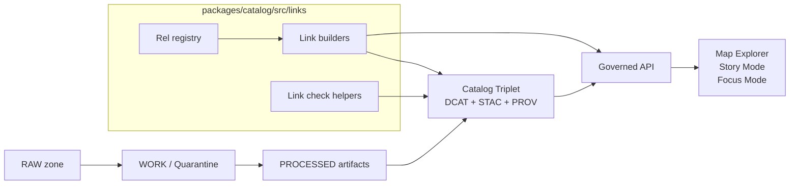

<!-- [KFM_META_BLOCK_V2]
doc_id: kfm://doc/8c19fbe4-11e7-4e8b-9f66-3ccf7c5b6d6c
title: Catalog Link Builders
type: standard
version: v1
status: draft
owners: [TBD]
created: 2026-02-25
updated: 2026-02-25
policy_label: public
related:
  - kfm://doc/TODO-kfm-master-guide
  - kfm://doc/TODO-kfm-catalog-readme
tags: [kfm, catalog, links, stac, dcat, prov, evidence]
notes:
  - Directory README for deterministic, policy-safe link generation across KFM catalog surfaces.
[/KFM_META_BLOCK_V2] -->

<a id="top"></a>

# Catalog Link Builders
Deterministic, policy-safe link generation for KFM catalog triplets (DCAT/STAC/PROV) and governed API navigation.


**Path:** `packages/catalog/src/links/`

Quick navigation:  
- [Why this folder exists](#why-this-folder-exists)  
- [Where it fits in KFM](#where-it-fits-in-kfm)  
- [Directory contract](#directory-contract)  
- [Link invariants](#link-invariants)  
- [Relation registry](#relation-registry)  
- [EvidenceRef schemes](#evidenceref-schemes)  
- [Examples](#examples)  
- [Tests and CI gates](#tests-and-ci-gates)  
- [Change checklist](#change-checklist)  

---

## Why this folder exists
KFM’s catalogs and provenance are not “nice-to-have docs”—they are **runtime trust surfaces**.  
To keep navigation + provenance deterministic, we generate and validate links as a **contract**:

- Cross-links between **DCAT ↔ STAC ↔ PROV** must exist and resolve without guessing.
- Evidence resolution depends on these links to produce an EvidenceBundle quickly and safely.
- CI must fail closed if links drift or break.

> **WARNING**  
> A broken link is not a “broken UX.” It’s a broken **trust path**. Treat link generation as part of the promotion contract.

[Back to top](#top)

---

## Where it fits in KFM



This folder sits in the **catalog package**, but the output is consumed by:
- **Promotion** (catalog generator emits cross-linked DCAT/STAC/PROV)
- **Runtime** (governed API returns navigable links without exposing raw storage)

[Back to top](#top)

---

## Directory contract

### What belongs here
✅ **Acceptable contents**
- A **relation registry**: canonical `rel` strings and their meanings.
- Pure functions that build link objects for:
  - STAC Collections / Items
  - DCAT datasets / distributions
  - PROV bundles / run receipts
- A minimal **href builder** (relative URL join + canonicalization rules).
- Link validation utilities (e.g., “link must resolve in repo context”).
- Fixtures + golden tests for deterministic ordering & formatting.

### What must NOT go here
🚫 **Exclusions**
- Policy evaluation logic (allow/deny, obligations) → belongs in the **policy engine**.
- Evidence resolution orchestration → belongs in the **evidence resolver**.
- Direct object-store URLs, signed URLs, or storage credentials.
- Network calls or filesystem I/O (prefer pure functions; I/O belongs in adapters).
- “Convenience” links that bypass the governed API boundary.

[Back to top](#top)

---

## Link invariants

These rules are **merge-blocking** for any change that affects promoted artifacts or API responses.

### Deterministic by construction
- Link arrays MUST be produced in **stable order**.
- `href` MUST be canonicalized (no accidental `//`, no environment-specific noise).
- Any “base URL” must be provided explicitly (dependency injection), not read implicitly.

### Policy-safe by default
- Links MUST NOT leak restricted artifacts or sensitive access paths.
- If a link target is policy-controlled, the href should point to the **governed API** endpoint that enforces policy.

> **NOTE**  
> The frontend and external clients must not hit storage directly; links are one of the main ways drift can accidentally pierce that boundary.

### Cross-links are required, not optional
At minimum, link builders must support the catalog triplet cross-link pattern:
- DCAT dataset → distributions → artifact digests
- DCAT dataset → PROV bundle/activity
- STAC collection → `describedby` → DCAT dataset
- STAC item → PROV activity/run receipt

[Back to top](#top)

---

## Relation registry

> **CONFIRMED (governance requirement):** Certain cross-links must exist and be checkable in CI.  
> **PROPOSED (repo convention):** Specific `rel` names for provenance links where not explicitly fixed by an upstream spec.

| Producer | `rel` | Target | Status | Notes |
|---|---|---|---|---|
| STAC Collection | `describedby` | DCAT Dataset | **CONFIRMED** | Enables deterministic dataset metadata discovery from map-layer assets. |
| DCAT Dataset | `distribution` | Artifact digests | **CONFIRMED** | Distributions must resolve to specific artifacts. |
| DCAT Dataset | `prov:wasGeneratedBy` (or equivalent) | PROV bundle / activity | **CONFIRMED** | Links DCAT metadata to lineage. |
| STAC Item | `via` *(PROPOSED default)* | PROV activity / run receipt | **PROPOSED** | Pick one rel and enforce across repo; CI should assert it. |
| Any | `self` | Self | **PROPOSED** | Consistent with typical web conventions; used for caching. |

### Adding a new relation
1. Add it to the rel registry (`rels.ts`, `rels.json`, etc.)
2. Add/adjust builders that emit it.
3. Add a link-check test that fails if the target doesn’t resolve.
4. Update this table.

[Back to top](#top)

---

## EvidenceRef schemes

KFM’s evidence system relies on predictable schemes that resolve into catalog/provenance objects:

- `dcat://...` → dataset/distribution metadata  
- `stac://...` → collection/item/asset metadata  
- `prov://...` → run lineage (activities/entities/agents)  
- `doc://...` → governed docs and story citations  
- `graph://...` → entity relations (if enabled)

**This folder’s role:** make it *possible* for these schemes to resolve without guessing by generating consistent, cross-linked hrefs (and offering helper formatters/parsers if the repo keeps them here).

[Back to top](#top)

---

## Examples

> These are **illustrative**. Update names/paths to match actual code conventions in this repo.

### Example: STAC Collection links
```ts
export function buildStacCollectionLinks(args: {
  collectionId: string;
  stacSelfHref: string;
  dcatDatasetHref: string;
}) {
  return [
    { rel: "self", href: args.stacSelfHref, type: "application/json" },
    { rel: "describedby", href: args.dcatDatasetHref, type: "application/ld+json" },
  ];
}
```

### Example: DCAT ↔ PROV cross-link
```ts
export function buildDcatProvLink(args: { provBundleHref: string }) {
  return { rel: "prov:wasGeneratedBy", href: args.provBundleHref, type: "application/json" };
}
```

### Example: Guardrail — forbid direct storage hrefs
```ts
export function assertPolicySafeHref(href: string) {
  // Pseudocode:
  // - forbid "s3://" "gs://" "file://" or signed URLs
  // - require "/api/" (or your governed boundary prefix)
  // - optionally allow relative repo paths for build-time validation
}
```

[Back to top](#top)

---

## Tests and CI gates

When this folder changes, CI must include (at minimum):

- ✅ JSON schema validation for KFM DCAT/STAC/PROV profiles  
- ✅ Link-check: cross-links exist and resolve in repo context  
- ✅ Evidence resolver contract tests (public resolves; restricted denies safely)  
- ✅ spec_hash stability tests  
- ✅ Golden tests for canonicalization & deterministic outputs  

> **TIP**  
> Treat “link-check” tests like migrations: if you change a URL pattern, update builders and fix all references in one PR.

[Back to top](#top)

---

## Change checklist

Use this checklist in PRs that touch link generation:

- [ ] New/changed `rel` is added to registry and documented in the table
- [ ] Links remain stable-ordered and canonicalized
- [ ] No direct storage URLs introduced
- [ ] Cross-links still satisfy DCAT/STAC/PROV requirements
- [ ] Link-check tests updated/added
- [ ] Golden tests updated (with explanation in PR description)

---

<details>
<summary>Appendix: Suggested (example) directory layout</summary>

> TODO: Replace with actual filenames once this folder is implemented.

- `README.md` — this file  
- `rels.ts` — canonical rel constants  
- `builders/` — link builder functions grouped by surface (stac/dcat/prov)  
- `validate.ts` — link safety + resolution helpers  
- `__tests__/` — deterministic + link-check tests  

</details>

[Back to top](#top)
