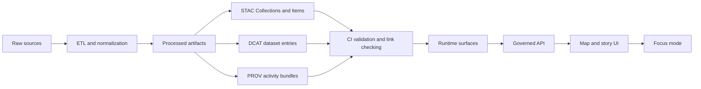

<!-- [KFM_META_BLOCK_V2]
doc_id: kfm://doc/7b1b3c1e-7f0e-4aa0-9b8a-1a9a1a8c5a8c
title: packages/catalog/src/profiles
type: standard
version: v1
status: draft
owners: TBD
created: 2026-02-25
updated: 2026-02-25
policy_label: public
related:
  - ../../../../docs/standards/KFM_DCAT_PROFILE.md
  - ../../../../docs/standards/KFM_STAC_PROFILE.md
  - ../../../../docs/standards/KFM_PROV_PROFILE.md
tags: [kfm, catalog, profiles, contracts, validation]
notes:
  - Directory README: contract-first catalog profile definitions for DCAT, STAC, and PROV.
[/KFM_META_BLOCK_V2] -->

# Catalog Profiles
> Contract-first profile definitions for KFM catalog boundary artifacts (DCAT, STAC, PROV).  
> These profiles exist to make validation strict, predictable, and testable — especially across links and policy/redaction constraints.


<!-- TODO: add repo-specific badges once workflow paths are known (CI, coverage, package version). -->

## Navigation
- [Overview](#overview)
- [Where this fits](#where-this-fits)
- [Directory layout](#directory-layout)
- [Profiles registry](#profiles-registry)
- [Cross-linking rules](#cross-linking-rules)
- [Validation and CI gates](#validation-and-ci-gates)
- [Adding or changing a profile](#adding-or-changing-a-profile)
- [Governance and policy constraints](#governance-and-policy-constraints)
- [FAQ](#faq)

---

## Overview

KFM uses three catalogs as *boundary artifacts* between the pipeline and runtime surfaces:

- **DCAT** answers: *What is this dataset? Who published it? What is the license? What are the distributions?*
- **STAC** answers: *What assets exist? What are their spatiotemporal extents? Where are the files?*
- **PROV** answers: *How were outputs created? Which inputs/tools/parameters produced them?*

A **profile** (in this directory) is the project’s **machine-checkable** contract for one of those standards:
- required fields (minimum set),
- controlled vocabulary constraints,
- policy label / redaction constraints,
- cross-link rules that make navigation deterministic,
- versioning expectations that preserve traceability across dataset versions.

> **Rule of thumb:** if you find yourself adding an ad-hoc metadata field “just for this domain”, stop — you probably need to extend a base profile instead.

---

## Where this fits



Profiles are the reusable contract layer that validators, link-checkers, and (optionally) runtime resolvers consume.

---

## Directory layout

This directory should contain only **profile definitions + helpers** (schema constraints, controlled vocabularies, link-rel rules), not pipeline jobs or API/UI logic.

> **NOTE:** The exact file names here depend on the package implementation. Update this tree to match reality once the folder is populated.

```text
packages/catalog/src/profiles/
  README.md                  # this file
  (expected) dcat/           # DCAT profile constraints + controlled vocab hooks
  (expected) stac/           # STAC Collection/Item profile constraints
  (expected) prov/           # PROV profile constraints
  (expected) vocab/          # controlled vocabularies (e.g., dcat:theme)
  (expected) index.*         # profile registry/export surface (language-dependent)
```

### Acceptable inputs
- JSON Schemas (or schema fragments) for DCAT / STAC / PROV profile validation
- Deterministic validators that operate on in-memory objects
- Controlled vocabulary lists + validation helpers
- Link-relation rules and helpers for cross-catalog navigation (e.g., `describedby`, `via`)
- Type definitions / interfaces for profile modules

### Exclusions
- ETL / ingestion code that *writes* STAC/DCAT/PROV outputs
- Network I/O, database access, object storage access
- API routes, controllers, UI code
- Dataset-specific one-off exceptions that bypass profiles

---

## Profiles registry

| Profile | Applies to | Purpose | Minimum required (high level) | Source of truth |
|---|---|---|---|---|
| **KFM DCAT profile** | Dataset record | Discovery + distributions + license/publisher | title, description, publisher, license/rights, theme (controlled), spatial+temporal, distributions, PROV link, policy label, dataset ids | `docs/standards/KFM_DCAT_PROFILE.md` |
| **KFM STAC profile** | Collection | Assets index + extents | id/title/description, extent, license, link to DCAT, dataset_version_id + policy label | `docs/standards/KFM_STAC_PROFILE.md` |
| **KFM STAC profile** | Item | Feature-level evidence + asset pointers | id, geometry/bbox consistent with policy label, datetime, assets with href+checksum+media_type, links to PROV + DCAT distribution | `docs/standards/KFM_STAC_PROFILE.md` |
| **KFM PROV profile** | Run bundle | Reproducibility + lineage | Activity per run, Entity per artifact, Agent(s), used/generated edges, policy decision refs, environment capture | `docs/standards/KFM_PROV_PROFILE.md` |

> The *minimum required fields* above are intentionally baseline. Tighten per standard + per KFM governance needs — but keep changes versioned and testable.

---

## Cross-linking rules

Cross-links must be explicit so navigation is deterministic (no guessing):

- DCAT dataset → distributions → artifact digests
- DCAT dataset → `prov:wasGeneratedBy` → PROV bundle
- STAC Collection → link `rel="describedby"` → DCAT dataset
- STAC Item → link to PROV activity (and/or run receipt) and/or DCAT distribution
- EvidenceRef schemes must resolve into these objects without guessing

> CI should include a **link-checker** that verifies cross-links for every promoted dataset version.

---

## Validation and CI gates

Profiles are part of the **fail-closed promotion contract**. At minimum, gates should ensure:

- catalogs are schema-valid under the active profile(s),
- cross-links resolve,
- EvidenceRefs resolve,
- policy label is assigned and policy checks pass (default-deny when unclear).

### What “passing” should mean (minimum)
- **Schema validation:** every record conforms to the profile (and underlying standard schemas).
- **Link validation:** every required cross-link resolves and points to the expected object type.
- **Policy validation:** records contain required policy metadata and don’t leak restricted detail.

> If this directory changes, CI should treat it like a contract change: test it against fixtures and ensure compatibility expectations are met.

---

## Adding or changing a profile

### When you should change a profile
- A new domain needs additional metadata beyond the base KFM profiles.
- A governance requirement adds/changes required policy fields.
- A new artifact class needs a new distribution/link rule.
- A new EvidenceRef scheme is introduced and needs deterministic resolution.

### Process
1. **Update the standard doc**  
   Update the corresponding doc under `docs/standards/` (DCAT/STAC/PROV).  
   Keep “minimum required” vs “recommended” clear.
2. **Update the profile implementation here**  
   Add/modify schema/validators and any controlled vocab constraints.
3. **Add fixtures + tests**  
   - happy-path records
   - fail cases (missing required fields, invalid vocab values, broken links)
4. **Update link-check expectations**  
   If a link is now required or its target type changed, enforce it in the link checker.
5. **Versioning + compatibility check**
   - If you remove/rename fields or tighten constraints, treat it as a breaking change.
   - Ensure dataset-level versioning is still traceable (e.g., revisions link correctly via DCAT/PROV).

### Local verification (repo-dependent)
```bash
# TODO: replace with the real monorepo commands once confirmed.
# Examples:
# pnpm -C packages/catalog test
# pnpm -C packages/catalog lint
# pnpm -C packages/catalog validate:catalog
```

---

## Governance and policy constraints

Profiles are where **policy expectations become machine-checkable**:
- every record should carry a policy label field where required,
- geometry/precision must be consistent with policy label (generalize when needed),
- export/surface contracts should not allow bypassing redaction via alternate fields.

If a profile change affects:
- policy labels,
- redaction/generalization behavior,
- what becomes link-resolvable evidence,

…treat it as a governance-sensitive change and route it through the appropriate review gate(s).

---

## FAQ

### Why keep profiles here instead of “just documenting them”?
Because the system’s trust membrane depends on **machine validation** at promotion time — profiles must be executable.

### Can domains add custom fields?
Yes, but **only via profile extension** (documented + validated), not ad-hoc one-offs. This keeps downstream systems (graph/API/UI/Focus) stable.

### Do profiles replace the underlying standards?
No. Profiles *constrain and extend* the standards with KFM-required fields, vocabularies, and link/policy rules.

---

[Back to top](#catalog-profiles)
