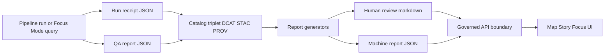

<!-- [KFM_META_BLOCK_V2]
doc_id: kfm://doc/7b9d5f34-b2fa-4f87-8f9a-4f0c5d54e2a8
title: Catalog Report Module
type: standard
version: v1
status: draft
owners: TODO
created: 2026-02-25
updated: 2026-02-25
policy_label: public
related:
  - kfm://doc/KFM_GDG_vNEXT_2026-02-20
tags: [kfm, catalog, report, governance]
notes:
  - Initial README scaffold for packages/catalog/src/report. Replace TODOs after verifying repo interfaces.
[/KFM_META_BLOCK_V2] -->

<a id="top"></a>

# Catalog Report Module (`packages/catalog/src/report`)
Evidence-first, policy-safe report generation for **catalog + provenance** workflows.


> [!NOTE]
> This README is a **governance-forward** contract for report generation. It intentionally:
> - **treats invariants as requirements** (testable, fail-closed),
> - marks repo-specific details as **TODO** until verified,
> - avoids implying any deployed topology or concrete implementation that isn’t evidenced.

---

## Quick links
- [Purpose](#purpose)
- [Where this fits](#where-this-fits)
- [Responsibilities](#responsibilities)
- [Inputs and outputs](#inputs-and-outputs)
- [Data flow](#data-flow)
- [Report contracts](#report-contracts)
- [Governance and safety](#governance-and-safety)
- [Testing and CI gates](#testing-and-ci-gates)
- [Directory rules](#directory-rules)
- [Open tasks](#open-tasks)

---

## Purpose
This folder defines **report-generation utilities** that turn catalog/provenance artifacts into:
- **machine-readable** records (for validation, promotion, audit, and replays), and
- **human-readable** summaries (for review gates, stewards, and release notes),

while preserving the KFM invariants:
- *domain logic does not reach into infrastructure directly* (layered architecture),
- *reports never bypass policy/redaction rules*,
- *outputs remain traceable to evidence + provenance*.

[Back to top](#top)

---

## Where this fits
This module lives under:

- `packages/catalog/…` — the library that owns **catalog + provenance** concerns (DCAT/STAC/PROV cross-linking, validators, and supporting structures).
- `src/report/…` — a sub-area that produces **auditable, deterministic, policy-safe reports** derived from canonical catalog/provenance inputs.

> [!IMPORTANT]
> Reports are **derived artifacts**. They must not become a new “source of truth”.
> Canonical sources should remain in the catalog/provenance/object-store layer; projections/indexes are rebuildable.

[Back to top](#top)

---

## Responsibilities
This directory SHOULD contain code that:

1. **Builds report DTOs** from canonical artifacts  
   Example report DTO families (names illustrative—verify actual exports):
   - `RunReceipt` (pipeline + Focus Mode receipts)
   - `QAReport` / `ValidationReport`
   - `CatalogValidationSummary` (DCAT/STAC/PROV profile + linkcheck results)
   - `PolicyDecisionSummary` (decision + obligations, with redaction-safe text)

2. **Serializes deterministically**  
   - stable field ordering / canonical JSON where required
   - digest-friendly output (hashable, cacheable)

3. **Enforces policy-safe rendering**  
   - never emits restricted fields into public reports
   - supports “public generalized” reporting where required (e.g., sensitive locations)

4. **Supports CI gating**  
   - report schemas validate
   - referenced EvidenceRefs resolve in test env (when applicable)
   - link checks / profiles pass before promotion

### Non-goals
This directory MUST NOT:
- implement pipelines/ETL transforms (belongs to pipeline runner / connectors),
- perform evidence resolution itself (belongs to evidence resolver),
- embed privileged credentials in any report/spec payload,
- output raw/restricted coordinates when policy forbids it.

[Back to top](#top)

---

## Inputs and outputs

### Inputs (typical)
| Input | Source | Notes |
|---|---|---|
| `dataset_slug`, `dataset_version_id`, `spec_hash` | dataset onboarding spec / pipeline metadata | IDs must be stable and reproducible. |
| Catalog triplet artifacts (DCAT/STAC/PROV) | catalog generator outputs | Cross-linked + validated before promotion. |
| `run_receipt` / `run_record` | pipeline runner + Focus Mode | Append-only audit receipt. |
| `validation` results | validators + QA subsystem | Prefer machine-readable reports. |
| `policy_decision` + `obligations` | policy engine | Default-deny when unclear. |
| rights metadata | catalogs / evidence metadata | Required when embedding media references. |

### Outputs (typical)
| Output | Audience | Intended use |
|---|---|---|
| `run_receipt.json` | machines + auditors | reproducibility, audits, promotion gates |
| `qa_report.json` | CI + stewards | quality checks, thresholds, quarantine decisions |
| `catalog_validation_summary.md` | humans | review gates, PR visibility |
| `promotion_summary.json` | machines | release manifests, publishing gates |

> [!TIP]
> If you’re unsure whether an output belongs here:  
> If it’s **derived** from canonical catalog/provenance artifacts *and* meant to be consumed by CI/review/audit, it likely belongs here.

[Back to top](#top)

---

## Data flow



[Back to top](#top)

---

## Report contracts

> [!WARNING]
> Contract names and file names below are **guidance**, not a guarantee of current repo implementation.  
> Keep the *shape* and *governance requirements*; update identifiers after confirming code.

### Run receipt v1
A run receipt is emitted for:
- every **pipeline run**, and
- every **Focus Mode query**.

Minimum expectations (paraphrased):
- identify the run (`run_id`, `run_type`)
- bind the run to dataset identity (`dataset_slug`, `dataset_version_id`, `spec_hash`)
- list **inputs** and **outputs** with digests + zones
- record **validation status** and constituent checks
- record **policy decision** + obligations
- capture environment (git commit, container digest, runtime, parameters)
- include timestamps (start/end)

<details>
<summary><strong>Example (trimmed) JSON shape</strong></summary>

```json
{
  "kfm_run_receipt_version": "v1",
  "run_id": "kfm://run/<timestamp>.<dataset>.<nonce>",
  "run_type": "pipeline",
  "dataset_slug": "<slug>",
  "dataset_version_id": "<version_id>",
  "spec_hash": "sha256:<...>",

  "inputs": [{ "artifact_id": "kfm://artifact/<...>", "zone": "raw", "digest": "sha256:<...>" }],
  "outputs": [{ "artifact_id": "kfm://artifact/<...>", "zone": "processed", "digest": "sha256:<...>" }],

  "validation": { "status": "pass", "reports": [{ "name": "schema_check", "status": "pass" }] },
  "policy": { "policy_label": "public", "decision_id": "kfm://policy_decision/<...>", "obligations": [] },
  "environment": { "git_commit": "<commit>", "container_image": "sha256:<image_digest>", "runtime": "<runtime>" },
  "timestamps": { "started_at": "<iso>", "ended_at": "<iso>" }
}
```

</details>

### QA report
QA reports SHOULD:
- be **machine-readable**
- be linkable from run receipts
- carry `dataset_version_id`, `run_id`, `generated_at`, and summary pass/fail
- include sections like schema checks, geometry validity, duplicates/id stability, temporal anomalies, spatial anomalies, and rights-metadata completeness.

### Evidence bundle adjacency (when reports reference evidence)
If report generation includes citations / evidence cards, bundles SHOULD include:
- bundle ID + digest
- policy decision + obligations
- renderable “cards”
- machine metadata tying back to dataset version, artifact digests, provenance links, rights metadata
- immutability by digest; never include restricted artifacts for unauthorized roles.

### Citation verification gate (if producing narrative-facing outputs)
If this module produces anything consumed as story/narrative content (or produces review reports for it), CI MUST ensure:
- EvidenceRef syntax validity
- resolver can resolve refs in a test environment
- policy allows citations for intended label
- rights metadata exists when media is referenced
- merge is blocked if citations fail.

[Back to top](#top)

---

## Governance and safety

### Default-deny + obligations
Treat policy as a **hard boundary**:
- if policy/rights/citations are unclear, reduce scope or fail closed
- reports must carry enough context to explain allow/deny + obligations without leaking restricted data

### Sensitive locations
For sensitive-location datasets, reports MUST support (and never undermine):
- explicit classification (e.g., restricted_sensitive_location)
- dual outputs: restricted precise + public generalized (when allowed)
- documented generalization method (grid aggregation, dissolve, etc.)
- tests that confirm no precise coordinates leak
- UX notice explaining generalization and why
- governance review prior to release

### Credentials and secrets
Do not embed secrets in:
- specs
- reports
- examples

If you must refer to private URIs, use redacted placeholders or policy-safe tokens.

[Back to top](#top)

---

## Testing and CI gates

### Required tests (minimum)
- **Schema validation** for all report JSON shapes (run receipts, QA reports, summaries)
- **Determinism tests** (golden fixtures; stable serialization / hashes)
- **Cross-link / linkcheck** tests (DCAT/STAC/PROV references don’t drift)
- **Policy fixture tests** verifying redaction and public-safe output behavior
- **Citation linting** (when evidence refs are included)

### Definition of Done (DoD)
- [ ] Report outputs are deterministic and fixture-tested
- [ ] Policy boundary is enforced (no restricted leaks)
- [ ] Schema validation is wired into CI
- [ ] Any evidence references are resolvable and rights-checked
- [ ] Documentation is updated (this README + examples)

[Back to top](#top)

---

## Directory rules

### What belongs here (acceptable inputs)
- Report DTOs and builders
- Report renderers (JSON / Markdown)
- Report schemas (or schema references) and validators
- Fixtures for determinism + policy safety
- Small templates for consistent report formatting

### What does not belong here (exclusions)
- Raw datasets or large data files
- Pipeline execution code
- UI components
- Anything requiring privileged credentials

### Expected local layout (adjust to actual)
```text
packages/catalog/src/report/
  README.md
  TODO: add files actually present in repo
  (examples)
    run_receipt.*
    qa_report.*
    catalog_validation_summary.*
    fixtures/
    schemas/
```

[Back to top](#top)

---

## Open tasks
- [ ] Replace TODO badges with real CI/coverage links.
- [ ] Confirm which report contracts are implemented here vs elsewhere.
- [ ] Add/point to JSON Schemas for `run_receipt` and `qa_report`.
- [ ] Add fixtures and determinism tests.
- [ ] Document the exact policy-redaction behavior for each report surface.

---

### Maintainer checklist (minimum verification)
1. Confirm real exports / entrypoints for this package.
2. Confirm where report schemas live (this package vs shared contracts).
3. Confirm CI gates that run on report changes.
4. Update this README’s “Expected local layout” to match reality.

