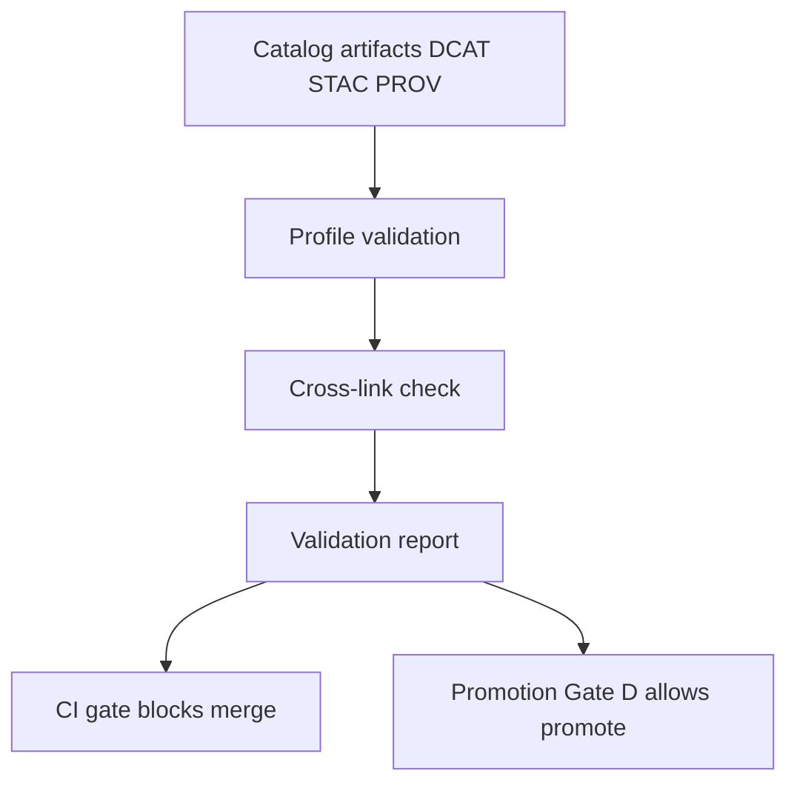

<!-- [KFM_META_BLOCK_V2]
doc_id: kfm://doc/2a3d6d2b-0f25-4c59-8b8d-0a58d04e0b66
title: packages/catalog/src/validate — Catalog Validation
type: standard
version: v1
status: draft
owners: TBD
created: 2026-02-25
updated: 2026-02-25
policy_label: public
related:
  - docs/architecture/system_overview.md
  - docs/architecture/promotion_contract.md
  - docs/standards/kfm_stac_profile.md
  - docs/standards/kfm_dcat_profile.md
  - docs/standards/kfm_prov_profile.md
tags: [kfm, catalog, validate]
notes:
  - This README documents the catalog validation layer used by CI and Promotion Gate D.
  - Some related docs/paths may differ across repo snapshots; update links to match this repo.
[/KFM_META_BLOCK_V2] -->

<a id="top"></a>

# Catalog validation (`packages/catalog/src/validate`)

Validation logic for the KFM “catalog triplet” (DCAT + STAC + PROV) and required cross-links. Designed to **fail closed**: errors block merge/promotion.


---

## Quick navigation

- [Purpose](#purpose)
- [Where this fits](#where-this-fits)
- [Inputs and naming conventions](#inputs-and-naming-conventions)
- [Validation rules](#validation-rules)
- [Cross-link rules](#cross-link-rules)
- [Outputs](#outputs)
- [CI and gates](#ci-and-gates)
- [Directory contract](#directory-contract)
- [Contributing](#contributing)
- [Appendix](#appendix)

---

## Purpose

This module validates that catalog metadata is:
1) **Profile-valid** (KFM DCAT / STAC / PROV profiles), and  
2) **Link-consistent** across the “catalog triplet” (dataset identity + version identity + references).

The outcome is a deterministic pass/fail signal suitable for:
- Pull request CI gates (merge blocked on failure)
- Promotion Contract “Gate D” (promotion blocked on failure)

[Back to top](#top)

---

## Where this fits

This folder is the *shared validation library* for catalog metadata.

Typical wiring (conceptual):



> NOTE: Repo layouts vary. In the implementation plan, validators and link-check tooling are also exposed as CLI-style tools (e.g., under `tools/validators/*` and `tools/linkcheck/*`). If those wrappers exist in this repo, they should call into this library instead of duplicating rules.

[Back to top](#top)

---

## Inputs and naming conventions

### Catalog triplet inputs (Promotion Gate D)

This validator assumes a catalog root containing:

| Artifact | Required path (relative to catalog root) | Primary identifier | Notes |
|---|---|---|---|
| DCAT dataset record | `dcat/dataset/<dataset_id>.jsonld` | `dataset_id` | JSON-LD (DCAT) |
| STAC collection | `stac/collection/<dataset_id>.json` | `dataset_id` | STAC Collection |
| STAC items | `stac/items/<dataset_id>/<item_id>.json` | `item_id` | STAC Item / Feature |
| PROV document | `prov/<dataset_version_id>.json` | `dataset_version_id` | W3C PROV (JSON) |

### Identity glossary

- **`dataset_id`**: stable dataset identity across releases
- **`dataset_version_id`**: immutable version identity (used for provenance + digests)

> IMPORTANT: Cross-linking rules rely on `dataset_id` and `dataset_version_id` being consistent across DCAT/STAC/PROV.

[Back to top](#top)

---

## Validation rules

This section captures **minimum required fields** for KFM profiles, plus what this folder is expected to enforce.

### STAC Collection profile (KFM minimums)

Required top-level fields (minimum):

- `id`
- `type`
- `bbox`
- `extent`
- `license`
- `providers`
- `links` with rels: `self`, `root`, `parent`, `items`

KFM extension fields (minimum):

- `kfm:dataset_id`
- `kfm:dataset_version_id`
- `kfm:policy_label`
- `kfm:artifact_digests`
- `kfm:temporal_resolution`
- `kfm:spatial_resolution`

### STAC Item profile (KFM minimums)

Required top-level fields (minimum):

- `id`
- `type` = `Feature`
- `geometry`
- `bbox`
- `properties.datetime` **or** `properties.start_datetime` + `properties.end_datetime`
- `assets` (with `roles`)
- `links` include a `collection` link

KFM extension fields (minimum):

- `kfm:dataset_id`
- `kfm:dataset_version_id`
- `kfm:artifact_digests`
- `kfm:checksum`
- `kfm:source`

### DCAT Dataset profile (KFM minimums)

Required fields (minimum):

- `dct:identifier`
- `dct:title`
- `dct:description`
- `dct:license`
- `dct:spatial`
- `dct:temporal`
- `dcat:distribution[]` with `accessURL` and `mediaType`

KFM extension fields (minimum):

- `kfm:policy_label`
- `kfm:dataset_version_id`
- `kfm:artifact_digests`
- `kfm:vocab_refs`

### PROV document profile (KFM)

This folder should validate PROV documents against the KFM PROV profile.

Because the exact required PROV JSON shape is repo-specific, treat the following as minimum expectations:

- The PROV document identity is keyed by the filename: `prov/<dataset_version_id>.json`
- The PROV document must be linkable from the STAC/DCAT triplet via `dataset_version_id`
- The PROV document must reference the produced artifacts (digests/checksums) sufficient to support promotion and evidence resolution

> TODO: Replace this section with a concrete required-field list once `docs/standards/kfm_prov_profile.md` (or equivalent) is confirmed in this repo.

[Back to top](#top)

---

## Cross-link rules

Cross-link validation is what turns “three individually valid files” into a **governed, navigable evidence graph**.

Minimum invariants:

1) **Stable identities**
   - `dataset_id` is consistent across DCAT + STAC Collection + STAC Items.
   - `dataset_version_id` is consistent across DCAT + STAC + PROV.

2) **Required link edges exist**
   - STAC Collection links to:
     - the DCAT dataset record, and
     - the PROV document
   - STAC Items link to their Collection
   - DCAT record includes a pointer to the STAC Collection (directly or via a known KFM field)

3) **No dangling references**
   - Every referenced file/ID must resolve within the provided catalog roots.

4) **Fail closed**
   - Any broken invariant is an error (blocks CI/promotion).

[Back to top](#top)

---

## Outputs

This folder should produce **machine-readable** and **human-readable** output.

### Proposed machine-readable report contract

> This is a proposed interface. Update to match actual implementation exports.

```ts
export type ValidationSeverity = "error" | "warning" | "info";

export type ValidationIssue = {
  /** stable code for filtering + test assertions */
  code: string;
  severity: ValidationSeverity;
  message: string;

  /** file path and/or JSON pointer if available */
  file?: string;
  jsonPointer?: string;

  /** optional related identifiers */
  dataset_id?: string;
  dataset_version_id?: string;
  item_id?: string;
};

export type ValidationReport = {
  ok: boolean;
  issues: ValidationIssue[];
  summary: {
    errorCount: number;
    warningCount: number;
    checkedFiles: number;
  };
};
```

### Human output

- A compact console summary is recommended for CI logs:
  - pass/fail
  - count of errors/warnings
  - first N errors with file + pointer + message
  - hint to rerun locally (repo-specific)

[Back to top](#top)

---

## CI and gates

This validator is expected to be wired so that:

- Validators run in CI on **changed catalog artifacts**
- Link checking runs in CI
- **Failing validation blocks merge**

Promotion Contract mapping:

- **Gate D** = “Catalog triplet validation” (DCAT + STAC + PROV + link checking)

> Design constraint: keep validation deterministic (no network calls, no time-based behavior) so CI and local runs match.

[Back to top](#top)

---

## Directory contract

### Acceptable inputs (what belongs here)

- Profile validators:
  - DCAT dataset record validation
  - STAC collection validation
  - STAC item validation
  - PROV validation
- Cross-link validation (link-check rules)
- Shared report types/helpers
- JSON Schemas (if the repo stores schemas colocated with validators)
- Unit tests and fixtures for the above

### Exclusions (what must not go here)

- ETL transforms or data processing logic
- Policy evaluation / access control (belongs in policy boundary)
- API route handlers / controllers
- UI code (Map/Story/Focus Mode)
- Network fetching / crawling of external URLs (validation must be deterministic)

[Back to top](#top)

---

## Contributing

### Add or change a validation rule

Checklist:

- [ ] Update the relevant profile definition (schema/rules)
- [ ] Add/modify fixtures to cover:
  - pass case
  - fail case (specific code asserted)
- [ ] Add/modify unit tests (golden outputs recommended)
- [ ] Ensure error codes are stable and documented
- [ ] Ensure CI will fail on violations (fail closed)

### Definition of Done (DoD) for this folder

- [ ] Covers DCAT/STAC/PROV profile minimums
- [ ] Enforces cross-link invariants
- [ ] Produces a machine-readable report consumed by CI and promotion gate(s)
- [ ] Deterministic across OS/runtime
- [ ] Tests include fixture catalogs for common failure modes

[Back to top](#top)

---

## Appendix

<details>
  <summary><strong>Suggested stable error codes</strong></summary>

- `DCAT_MISSING_REQUIRED_FIELD`
- `DCAT_INVALID_DISTRIBUTION`
- `STAC_COLLECTION_MISSING_LINK_REL`
- `STAC_ITEM_MISSING_COLLECTION_LINK`
- `KFM_MISSING_POLICY_LABEL`
- `KFM_DATASET_ID_MISMATCH`
- `KFM_DATASET_VERSION_ID_MISMATCH`
- `LINKCHECK_DANGLING_REFERENCE`
- `PROV_INVALID_PROFILE`

</details>

