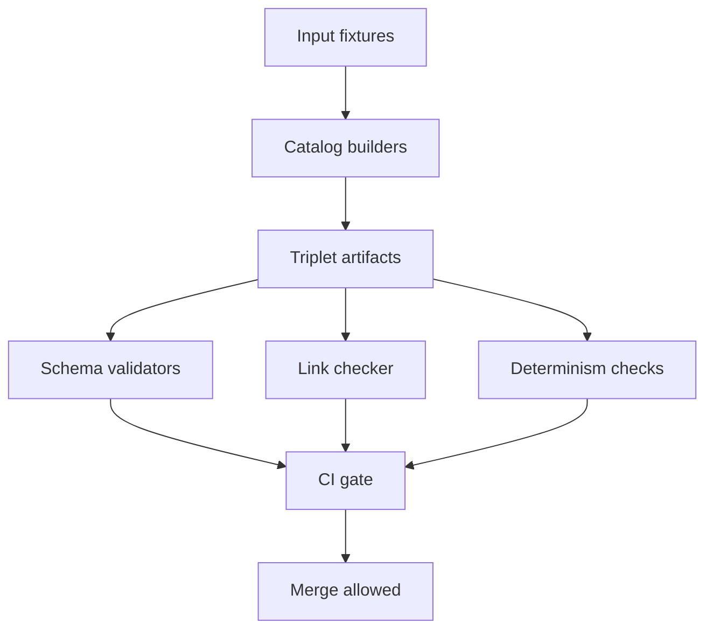

<!-- [KFM_META_BLOCK_V2]
doc_id: kfm://doc/7b5cc0d2-99a5-4c7b-8b2f-4de6c2d430af
title: Catalog Test Suite
type: standard
version: v1
status: draft
owners: TBD
created: 2026-02-25
updated: 2026-02-25
policy_label: TBD
related:
  - ../README.md
  - ../../../../docs/MASTER_GUIDE_v13.md
  - ../../../../docs/architecture/
  - ../../../../schemas/
tags: [kfm, catalog, tests]
notes:
  - This README documents how we test catalog and provenance outputs (DCAT, STAC, PROV).
  - Update placeholders (owners, commands, paths) once repo conventions are confirmed.
[/KFM_META_BLOCK_V2] -->

# Catalog Test Suite

**Purpose:** automated tests for the **Catalog/Triplet** surface: **DCAT + STAC + PROV**, plus cross-link, hashing, and policy gates.


> NOTE
> This folder is part of the KFM “trust membrane”: tests here are expected to **fail closed** when catalogs, evidence, or policy guarantees drift.

---

## Quick links

- [What lives here](#what-lives-here)
- [How to run](#how-to-run)
- [Test layers](#test-layers)
- [Fixtures and golden files](#fixtures-and-golden-files)
- [Promotion Contract alignment](#promotion-contract-alignment)
- [Adding a test](#adding-a-test)
- [Definition of Done](#definition-of-done)

---

## What lives here

This directory contains **tests and fixtures** for the `catalog` module/package.

### Where it fits in the repo

`packages/catalog/test/` sits alongside the catalog implementation and validates that catalog outputs are:

- **Schema-valid** (DCAT/STAC/PROV profiles)
- **Linked correctly** across the triplet (e.g., DCAT distribution ⇄ STAC assets ⇄ PROV entities)
- **Deterministic** (stable IDs, stable hashes, stable ordering)
- **Policy-safe** (no restricted leakage in public contexts; default-deny holds)

### Acceptable inputs

Put these here:

- Unit and integration tests for catalog builders, validators, registry readers.
- JSON fixtures for “known-good” and “known-bad” catalog artifacts.
- Golden snapshots (expected output JSON) for determinism checks.
- Minimal sample datasets that are:
  - small,
  - license-clear,
  - non-sensitive,
  - reproducible.

### Exclusions

Do **not** put these here:

- Large real-world raw datasets.
- Secrets, tokens, credentials, API keys.
- Sensitive site coordinates or culturally restricted knowledge.
- Any fixture you cannot legally redistribute.

---

## Test layers

| Layer | What it protects | Typical failures caught |
|---|---|---|
| Unit | Pure functions: ID builders, hashing, schema shims | hash drift, ordering drift, missing required fields |
| Contract | Stable JSON shape for produced artifacts | breaking schema changes, missing required properties |
| Link check | Cross-refs between DCAT, STAC, PROV | dangling links, wrong IDs, missing provenance edges |
| Policy | “Default deny” + obligations | accidental public leakage, missing redaction obligations |
| Integration | End-to-end build of a sample triplet | regression across modules, tool/version mismatches |

---

## How to run

> WARNING
> Commands below are templates. Replace them with the repo’s real test runner once confirmed.

### From repo root

Try one of the following patterns:

```bash
# Option A: monorepo workspace style
npm --workspace packages/catalog test

# Option B: pnpm
pnpm -C packages/catalog test

# Option C: yarn
yarn workspace @kfm/catalog test
```

### Run just catalog-triplet validation

```bash
# Example patterns — align with your repo tooling
./tools/validators/dcat_validator   ./path/to/dcat.jsonld
./tools/validators/stac_validator   ./path/to/stac.json
./tools/validators/prov_validator   ./path/to/prov.json
./tools/linkcheck/catalog_linkcheck ./path/to/catalog_bundle/
```

---

## Fixtures and golden files

A recommended layout (adjust to match the actual folder structure):

```text
packages/catalog/test/
├── README.md
├── fixtures/
│   ├── minimal_public_dataset/
│   │   ├── dcat.jsonld
│   │   ├── stac.collection.json
│   │   ├── stac.item.json
│   │   └── prov.json
│   └── negative_cases/
│       ├── missing_license_dcat.jsonld
│       ├── dangling_stac_asset.json
│       └── invalid_prov.json
├── golden/
│   └── expected_triplet_bundle.json
├── unit/
├── integration/
└── helpers/
```

### Fixture rules

- Keep fixtures **minimal**: represent one concept per fixture.
- Prefer **explicit** timestamps and IDs; avoid “now()” unless testing “now handling”.
- Every fixture should declare:
  - license/rights metadata,
  - policy label (or “TBD” if you’re building the mechanism),
  - deterministic identifiers.

---

## Promotion Contract alignment

KFM’s Promotion Contract treats the catalog triplet as a **contract surface**, and promotion is expected to be blocked unless required artifacts validate.

This test suite should map directly to the minimum gates:

- **Gate A: Identity and versioning**
- **Gate B: Licensing and rights metadata**
- **Gate C: Sensitivity classification and redaction plan**
- **Gate D: Catalog triplet validation**
- **Gate E: Run receipt and checksums**
- **Gate F: Policy tests and contract tests**

If a PR changes any catalog output shape, schema, or cross-linking behavior, tests in this folder should fail until:

- schemas are updated,
- validators are updated,
- golden snapshots (if used) are regenerated with an explicit justification.

---

## Architecture



---

## Adding a test

1. Pick the smallest surface you want to protect.
   - Example: “DCAT license field required”, “STAC assets link to processed artifacts”, “PROV entity IDs stable”.
2. Create or extend a fixture under `fixtures/`.
3. Add a test that:
   - generates or loads artifacts,
   - runs validators,
   - asserts deterministic IDs/hashes,
   - asserts policy behavior.
4. If using golden snapshots:
   - store the expected output under `golden/`,
   - document why changes are acceptable when updating snapshots.

---

## Definition of Done

A change touching catalog output or validators is “done” when:

- [ ] Unit tests pass
- [ ] Contract tests pass (schema + error model)
- [ ] Link checker passes
- [ ] Determinism checks pass (stable hashes/IDs)
- [ ] Policy tests pass (public vs restricted scenarios)
- [ ] Fixtures are minimal, license-clear, and non-sensitive

---

## Troubleshooting

<details>
<summary>Schema validation fails</summary>

- Check which profile changed (DCAT/STAC/PROV).
- Confirm whether the change is intended.
- If intended, update:
  - the schema/profile,
  - the validator,
  - any golden snapshots.

</details>

<details>
<summary>Hash drift detected</summary>

- Ensure canonical JSON serialization rules are applied.
- Ensure stable ordering of object keys and arrays where required.
- Recompute golden hashes only after confirming the canonicalization rules did not regress.

</details>

---

## Notes for maintainers

- Prefer **small diffs** and **reversible** test changes.
- When in doubt about data sensitivity, **generalize** fixtures and mark the gap for governance review.

_Back to top:_ [Quick links](#quick-links)
