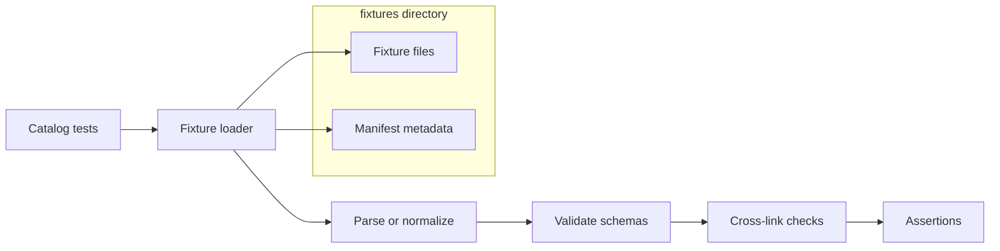

<!-- [KFM_META_BLOCK_V2]
doc_id: kfm://doc/288a29ab-6b62-4d00-82da-731cc30098cf
title: Catalog test fixtures
type: standard
version: v1
status: draft
owners: TBD (catalog maintainers)
created: 2026-02-25
updated: 2026-02-25
policy_label: restricted
related:
  - ../../README.md
  - ../../../README.md
tags: [kfm, catalog, tests, fixtures]
notes:
  - This README documents the contract for fixtures used by catalog tests.
  - "related" links are best-effort; adjust to match your repo layout.
[/KFM_META_BLOCK_V2] -->

# Catalog test fixtures

Deterministic, policy-safe fixture artifacts consumed by `packages/catalog` tests.


> **NOTE**
> This directory is **test-only**. Nothing in here is authoritative data.
> Fixtures may be synthetic, as long as they are *representative*, *safe*, and *deterministic*.

## Quick links

- [Overview](#overview)
- [How fixtures are used](#how-fixtures-are-used)
- [Directory contract](#directory-contract)
- [Fixture types](#fixture-types)
- [Suggested layout](#suggested-layout)
- [How to add a fixture](#how-to-add-a-fixture)
- [Naming and versioning](#naming-and-versioning)
- [Governance and safety](#governance-and-safety)
- [Definition of Done](#definition-of-done)
- [Fixtures registry](#fixtures-registry)
- [Troubleshooting](#troubleshooting)
- [Related docs](#related-docs)

---

## Overview

This folder contains **stable fixture files** used by unit/integration tests in the catalog package.

Fixtures exist to make tests:

- **Deterministic** (no time/ordering/randomness surprises)
- **Small** (fast in CI)
- **Portable** (no network calls; no external services)
- **Policy-safe** (no secrets, no PII, no precise sensitive locations)

If you need a fixture that looks like a “real” dataset, start from a public/permitted source, then:

1) **minimize**, 2) **redact/generalize**, 3) **freeze** (no drift), 4) **document** (manifest)

[Back to top](#catalog-test-fixtures)

---

## How fixtures are used



[Back to top](#catalog-test-fixtures)

---

## Directory contract

**Where it fits:** `packages/catalog/test/fixtures/` is part of the `packages/catalog` test suite.

**Primary consumers (typical):**

- Parsers / normalizers
- Schema / profile validators
- Cross-link checkers (e.g., “these artifacts reference each other correctly”)
- EvidenceRef / citation resolver checks (if the catalog package exercises those behaviors)

**Guarantees this directory should provide:**

1. Fixtures are **immutable once referenced** by tests (treat as “golden”).
2. Any breaking change to a fixture requires either:
   - a new fixture version, or
   - a deliberate update + snapshot regeneration + explicit note in the PR description.

[Back to top](#catalog-test-fixtures)

---

## Fixture types

The catalog package may need fixtures for multiple “contract surfaces.” Use the **smallest artifact** that exercises the behavior you want.

| Category | What you test | Typical files | Notes |
|---|---|---|---|
| Minimal valid | Happy-path parsing/validation | `*.json`, `*.jsonld`, `*.geojson` | Keep to minimum required fields. |
| Invalid / edge | Fail-closed behavior | `*_invalid.*`, `*_missing_field.*` | Prefer asserting stable error codes over full message strings. |
| Cross-linked sets | Link-checking across artifacts | folders with multiple files | Prefer one folder per scenario. |
| Redaction/generalization | “No sensitive fields leak” | `*_redacted.*` | Include both source-like + redacted variants if you test transforms. |

> **TIP**
> If your catalog logic models KFM’s “catalog triplet” concept (dataset metadata, asset metadata, lineage),
> prefer fixture sets that exercise **cross-links**, not just isolated files.

[Back to top](#catalog-test-fixtures)

---

## Suggested layout

This is a suggested *shape*; adjust to match existing conventions in this repo.

```text
fixtures/
  README.md
  <fixture_id>/
    manifest.json
    inputs/
      ...
    expected/
      ...
```

[Back to top](#catalog-test-fixtures)

---

## How to add a fixture

1. **Pick a fixture id**
   - short, descriptive, stable
   - examples: `dcat_minimal_v1`, `stac_crosslinks_v2`, `prov_minimal_v1`

2. **Create a fixture folder**
   - `fixtures/<fixture_id>/`

3. **Add fixture files**
   - Keep them small.
   - Avoid timestamps that will go stale.
   - Avoid reliance on OS directory iteration order (tests should sort filenames).

4. **Add/update `manifest.json`**
   - See template below.

5. **Wire into tests**
   - Use relative paths.
   - If the test reads a directory, ensure code sorts filenames to avoid OS ordering differences.

6. **Run tests locally**
   - Commands vary by repo tooling; common patterns:
     - `npm test`
     - `pnpm -C packages/catalog test`
     - `yarn workspace @kfm/catalog test`

[Back to top](#catalog-test-fixtures)

---

## `manifest.json` template

This file makes fixtures reviewable and auditable (even in tests).

```json
{
  "fixture_id": "stac_crosslinks_v1",
  "description": "Cross-linked mini-set for link-check tests",
  "policy_label": "restricted",
  "source": "synthetic",
  "license": "N/A",
  "contains_real_data": false,
  "contains_pii": false,
  "contains_precise_locations": false,
  "created": "2026-02-25",
  "updated": "2026-02-25",
  "notes": [
    "If you change semantics, create stac_crosslinks_v2 instead of editing in-place."
  ]
}
```

> **NOTE**
> `policy_label` here is about **fixture handling**, not runtime access.
> If you’re explicitly testing allow/deny + obligations, represent that inside the fixture artifacts and
> test it as an outcome.

[Back to top](#catalog-test-fixtures)

---

## Naming and versioning

### Naming rules (recommended)

- Folder names: `lowercase_with_underscores` or `kebab-case` (pick one for the repo)
- Include a version suffix: `_v1`, `_v2`, …
- If you need multiple files in a set, prefer `inputs/` and `expected/`.

### Versioning rules (fail-closed)

- If a fixture is referenced by a merged test, treat it as **append-only**:
  - create `<fixture_id>_vN+1` rather than editing old versions
  - keep old versions while any supported branch still uses them

[Back to top](#catalog-test-fixtures)

---

## Governance and safety

### What may go here

✅ Synthetic data designed to exercise catalog logic  
✅ Public-domain / permissively licensed snippets **after minimization**  
✅ Redacted/generalized examples demonstrating obligations / non-leakage  
✅ “Broken” fixtures that prove fail-closed behavior  

### What must not go here

❌ Secrets (API keys, tokens, credentials)  
❌ Real user PII (names, addresses, emails, phone numbers, persistent identifiers)  
❌ Precise coordinates for sensitive locations (archaeology, endangered species, etc.)  
❌ Proprietary/copyrighted datasets copied into the repo without explicit rights  

> **WARNING**
> When in doubt, treat a fixture as **restricted**, generalize it, and document the decision in `manifest.json`.
> Fail closed beats accidental disclosure.

[Back to top](#catalog-test-fixtures)

---

## Definition of Done

Use this checklist for PRs that add or modify fixtures:

- [ ] Fixture is minimal, deterministic, and runs without network access
- [ ] Fixture includes `manifest.json` with safety flags filled out
- [ ] No secrets, no PII, no precise sensitive locations
- [ ] Tests read fixtures deterministically (sorted filenames; stable JSON output)
- [ ] If semantics changed: new `_vN+1` fixture created (old versions preserved)
- [ ] Fixtures registry updated (below)

[Back to top](#catalog-test-fixtures)

---

## Fixtures registry

Keep this table in sync as you add new fixture sets.

| Fixture id | Purpose | Formats | Policy label | Tests | Notes |
|---|---|---|---|---|---|
| *(add rows)* |  |  |  |  |  |

[Back to top](#catalog-test-fixtures)

---

## Troubleshooting

### Snapshot diffs keep changing
- Ensure test code sorts lists/maps before serializing.
- Freeze time (fixed `now`) instead of calling system clocks.
- Normalize line endings if fixtures are text.

### Link-check tests fail on CI but pass locally
- Avoid assuming OS directory iteration order.
- Ensure fixtures use **relative** hrefs unless the test explicitly checks absolute URIs.

### A fixture needs “realistic” size
- Prefer *multiple* small fixtures that target specific branches, over one huge fixture.

[Back to top](#catalog-test-fixtures)

---

## Related docs

- `../../README.md` (catalog package overview — if present)
- `../../../README.md` (repo overview — if present)
- `policy/fixtures/` (policy decision fixtures — if present and kept separate from catalog fixtures)

[Back to top](#catalog-test-fixtures)
