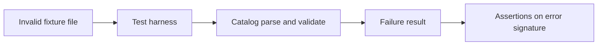

<!-- [KFM_META_BLOCK_V2]
doc_id: kfm://doc/8605c5ea-354e-4ba4-9481-2d309e3c3640
title: Catalog invalid test fixtures
type: standard
version: v1
status: draft
owners: catalog team
created: 2026-02-25
updated: 2026-02-25
policy_label: restricted
related:
  - packages/catalog/test/fixtures
tags: [kfm, catalog, tests, fixtures]
notes:
  - This directory contains intentionally invalid data used to assert fail-closed behavior.
  - Keep fixtures synthetic and non-sensitive.
[/KFM_META_BLOCK_V2] -->

# Invalid catalog fixtures
**Purpose:** Intentionally malformed fixtures used to verify that catalog parsing/validation **fails closed** (i.e., rejects bad inputs with expected errors).

**Status:** draft • **Owners:** Catalog Team • **Scope:** tests only

---

## Quick navigation
- [Purpose](#purpose)
- [Directory contract](#directory-contract)
- [How tests should use these fixtures](#how-tests-should-use-these-fixtures)
- [Adding a new invalid fixture](#adding-a-new-invalid-fixture)
- [Safety and governance](#safety-and-governance)
- [Fixture registry](#fixture-registry)
- [Troubleshooting](#troubleshooting)

---

## Purpose
This folder exists so tests can prove:

- The catalog **rejects** malformed inputs.
- Validation failures are **deterministic** (stable error codes/messages where applicable).
- Failure behavior is **scoped** (errors are specific to the violated rule, not a cascade of unrelated failures).

> WARNING  
> These fixtures are not examples, sample datasets, or documentation artifacts.  
> **Do not** reuse them in demos, Story Nodes, “Published” data, or production pipelines.

[Back to top](#invalid-catalog-fixtures)

---

## Directory contract

### Where this lives
`packages/catalog/test/fixtures/invalid/`

### What belongs here
- Small, synthetic fixtures that are **expected to fail** catalog ingest/parse/validate.
- One “reason to fail” per fixture whenever possible (minimal reproduction).
- Optional companion files used by tests (for example, a `.notes.md` describing the intent), if your test harness supports/needs them.

### What must NOT go here
- Real user data, credentials, secrets, PII, or sensitive location data.
- Large datasets (keep fixtures tiny and targeted).
- Anything that is *valid* (valid fixtures should live in a sibling `valid/` directory if your repo uses one).
- Golden outputs intended for production use.

[Back to top](#invalid-catalog-fixtures)

---

## How tests should use these fixtures
Tests should treat every file in this directory as:

1. **Input** to a parser/validator or ingest routine, and
2. **Expectation** that the operation fails with a known, asserted failure signature.

### Recommended assertion shape
When possible, assert **all** of the following:

- **Category** (parse error vs validation error)
- **Stable identifier** (error code, rule id, or canonical message key)
- **Human message** (only if stable; avoid brittle string matching if messages are localized/variable)
- **Relevant field/path** (which part of the input caused the failure)

### Why this matters
Negative tests are the “trust membrane” for your ingestion boundary: they ensure the system rejects inputs that cannot be promoted or trusted.

[Back to top](#invalid-catalog-fixtures)

---

## Process diagram

[Back to top](#invalid-catalog-fixtures)

---

## Adding a new invalid fixture

### Naming
Use a descriptive, stable name that explains the single reason it should fail.

**Examples (illustrative only):**
- `missing_required_field.json`
- `bad_date_format.yaml`
- `wrong_geometry_type.geojson`
- `schema_version_unknown.json`

### Checklist
- [ ] Fixture is **synthetic** and contains **no sensitive content**.
- [ ] Fixture is **minimal** (smallest input that triggers the failure).
- [ ] Failure reason is **singular** (avoid multi-error fixtures unless explicitly needed).
- [ ] A test exists (or is updated) that:
  - [ ] loads this fixture,
  - [ ] asserts the failure type and signature,
  - [ ] fails if the fixture unexpectedly becomes valid.
- [ ] Fixture is registered in the [Fixture registry](#fixture-registry) below.

[Back to top](#invalid-catalog-fixtures)

---

## Safety and governance
Even though this is test-only data, treat it as governed surface area:

- Prefer **synthetic** content.
- Avoid real names, addresses, phone numbers, emails, API keys, tokens, or internal URLs.
- Avoid precise coordinates for any vulnerable/private/culturally restricted site (use coarse placeholders if you must include spatial-like values).

> NOTE  
> If you discover a fixture is sensitive, remove/replace it immediately and rotate any leaked secrets.

[Back to top](#invalid-catalog-fixtures)

---

## Fixture registry
Maintain a lightweight index so reviewers can quickly understand intent and expected behavior.

| Fixture | Intent | Expected failure signature | Notes | Owner |
|---|---|---|---|---|
| *(add new rows)* | | | | |

**Registry guidance**
- “Expected failure signature” should be something stable (rule id / error code / canonical key).
- If your codebase does not have stable error IDs yet, document the **current** behavior and add a TODO to stabilize it.

[Back to top](#invalid-catalog-fixtures)

---

## Troubleshooting

### A fixture suddenly passes validation
This can happen when:
- validation rules change,
- defaults become more permissive,
- schema requirements are relaxed.

**Action:** Update the fixture to remain invalid *or* move it to valid fixtures if it’s genuinely acceptable now—then update the tests accordingly.

### A fixture fails for the “wrong reason”
This usually means multiple issues exist in the fixture.

**Action:** Reduce the fixture until it triggers exactly one targeted failure, or split it into multiple fixtures.

[Back to top](#invalid-catalog-fixtures)
