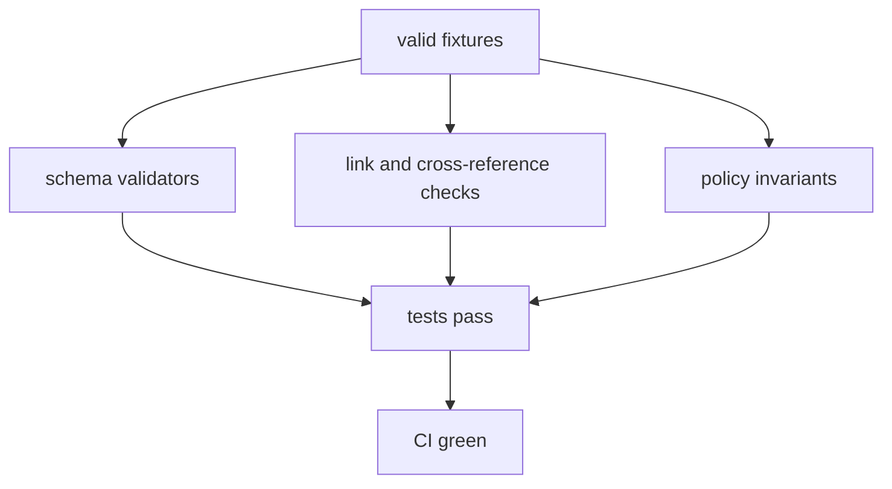

<!-- [KFM_META_BLOCK_V2]
doc_id: kfm://doc/22a199b7-f423-47f0-afc5-47f5a173c873
title: Valid catalog fixtures
type: standard
version: v1
status: draft
owners: TBD (Catalog + Policy)
created: 2026-02-25
updated: 2026-02-25
policy_label: public
related:
  - TBD
tags: [kfm, catalog, tests, fixtures]
notes:
  - Contract-first README for the valid fixtures directory; update placeholders once the harness is confirmed.
[/KFM_META_BLOCK_V2] -->

<a id="top"></a>

# Valid catalog fixtures

Minimal, deterministic, **schema-valid** fixture inputs for `packages/catalog` tests (the **positive / golden path**).


<!-- TODO: Add CI badge once the workflow name/path is confirmed -->

**Status:** draft • **Owners:** TBD (Catalog + Policy)

## Navigation

- [What this is](#what-this-is)
- [What belongs here](#what-belongs-here)
- [What must NOT live here](#what-must-not-live-here)
- [How fixtures are used](#how-fixtures-are-used)
- [Directory layout](#directory-layout)
- [Fixture invariants](#fixture-invariants)
- [Adding a new valid fixture](#adding-a-new-valid-fixture)
- [Review checklist](#review-checklist)
- [Troubleshooting](#troubleshooting)
- [Appendix: Minimal field expectations](#appendix-minimal-field-expectations)

---

## What this is

This folder contains **valid** (“should pass”) fixtures used to:

1) exercise catalog parsing/validation behavior, and  
2) act as stable golden inputs for CI gates that validate catalogs, provenance, and policy metadata.

> [!NOTE]
> If you also maintain negative test cases, prefer a sibling directory like `../invalid/` (or an equivalent pattern used by your test harness).

[Back to top](#top)

---

## What belongs here

Fixtures in `valid/` SHOULD be:

- **Small**: optimized for fast tests and easy review.
- **Deterministic**: stable IDs, stable ordering, no time-of-day / “now()” values.
- **Self-contained**: everything needed to validate the fixture lives in the fixture directory (or is referenced in a stable, offline-safe way).
- **Representative**: exercises one behavior clearly (e.g., “valid DCAT + STAC + PROV cross-links”).

Typical contents (illustrative, not prescriptive):

- A minimal **DCAT** dataset/distribution record (dataset-level metadata).
- A minimal **STAC** collection and/or item set (spatiotemporal asset metadata), when applicable.
- A minimal **PROV** bundle or **run receipt** describing lineage, inputs/outputs, and digests, when applicable.

[Back to top](#top)

---

## What must NOT live here

> [!WARNING]
> Fixtures must be safe to ship in-source and safe to run in CI.

Do **not** commit:

- Real secrets, tokens, API keys, credentials.
- Private/regulated data (PII, PHI, student records, etc.).
- Sensitive-location coordinates or “targetable” point locations (unless explicitly cleared and still appropriate for tests).
- Large binaries (COGs/PMTiles/Parquet) unless the repo explicitly allows it and CI budgets are proven.
- Non-deterministic outputs (random IDs, timestamps, unstable ordering) unless the test explicitly normalizes them.

[Back to top](#top)

---

## How fixtures are used

At a high level, these fixtures are meant to be consumed by a validator stack (schema + link integrity + policy invariants) and by unit/integration tests.



[Back to top](#top)

---

## Directory layout

Because repo layouts vary, keep the structure **predictable** and **reviewable**.

> [!TIP]
> Replace the template below with the *actual* contents once this directory stabilizes.

```text
packages/catalog/test/fixtures/valid/
  <fixture_slug_1>/
    ...fixture files...
  <fixture_slug_2>/
    ...fixture files...
  README.md
```

Suggested naming:

- `fixture_slug` is lowercase, `snake_case` or `kebab-case`
- One fixture directory = one “story” about validity (avoid bundling unrelated cases)

[Back to top](#top)

---

## Fixture invariants

These invariants make fixtures good “contracts”:

1. **Stable identity**  
   - Dataset IDs remain stable; versions are immutable and derived from a stable spec/hash.
2. **Explicit licensing + rights metadata**  
   - A fixture should never be “valid” if license/rights are unknown.
3. **Explicit policy labeling**  
   - Fixtures intended to be “valid” must carry a policy label (e.g., `public`, `restricted`) in the correct place(s).
4. **Catalog triplet completeness**  
   - If the fixture includes DCAT/STAC/PROV, cross-links must be present and resolvable.
5. **Receipts/checksums when lineage is in scope**  
   - If a run receipt is part of the fixture, inputs/outputs and their digests must be present and consistent.

[Back to top](#top)

---

## Adding a new valid fixture

1) **Copy the closest existing fixture** and rename it to a new `fixture_slug`.  
2) Make one change at a time (so diffs stay reviewable).  
3) Ensure the fixture is deterministic (no “today”, “now”, random IDs).  
4) Run the catalog tests locally.

### Local test commands (fill in the one your repo uses)

```bash
# TODO: replace with the actual workspace command(s) used by this repo.

# examples only:
# pnpm -C packages/catalog test
# npm test -w packages/catalog
# yarn workspace @kfm/catalog test
```

[Back to top](#top)

---

## Review checklist

- [ ] Fixture is minimal (only what’s needed to prove validity).
- [ ] No secrets, no PII/PHI, no sensitive locations.
- [ ] IDs are stable and versioning is immutable/deterministic.
- [ ] License/rights are explicit.
- [ ] Policy label exists and is appropriate for a “valid” fixture.
- [ ] If DCAT/STAC/PROV are present: they validate and cross-link cleanly.
- [ ] If receipts are present: they enumerate inputs/outputs with digests and stable parameters/environment.
- [ ] CI passes (schema validation + policy tests + catalog validators).

[Back to top](#top)

---

## Troubleshooting

### “Schema validation failed”
- Validate that required fields exist (title/description/license/etc.).
- Check that types and formats match the profile the validator expects.

### “Cross-link / referential integrity failed”
- Verify DCAT↔STAC↔PROV links exist and are resolvable via relative paths.
- Avoid absolute links to internal hosts in fixtures.

### “Test is flaky / passes locally but fails in CI”
- Look for non-deterministic fields (timestamps, unordered maps, random IDs).
- Normalize JSON output formatting in the test harness.

[Back to top](#top)

---

## Appendix: Minimal field expectations

<details>
<summary>Show a minimal “expectations” crib sheet (illustrative)</summary>

**DCAT (dataset-level) should capture:** title, description, publisher, license/rights, spatial/temporal coverage, distributions, and a link to provenance.

**STAC (asset-level) should capture:** id/title/description, extent (spatial + temporal), license, and links to the dataset record and provenance.

**PROV / run receipt should capture:** the producing activity, the agent/tool, and the input/output entities with digests.

</details>

[Back to top](#top)
