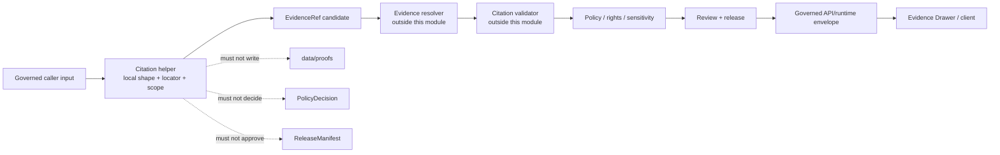

<!-- [KFM_META_BLOCK_V2]
doc_id: kfm://doc/packages-citation-src-citation-readme
title: packages/citation/src/citation/ — Governed Citation Helper Source Module
type: readme
version: v0.2
status: draft
owners:
  - OWNER_TBD — Citation package owner
  - OWNER_TBD — Citation steward
  - OWNER_TBD — Evidence steward
  - OWNER_TBD — Contract steward
  - OWNER_TBD — Schema steward
  - OWNER_TBD — Validator steward
  - OWNER_TBD — Runtime/API steward
  - OWNER_TBD — Security and rights steward
  - OWNER_TBD — Docs steward
created: 2026-06-13
updated: 2026-07-14
policy_label: "public; packages; citation; python-scaffold; reference-preservation; evidence-ref-aware; cite-or-abstain; deterministic; side-effect-minimal; no-network-by-default; non-authoritative; no-evidence-closure; no-policy-authority; no-release-authority; no-public-trust-membrane"
path: packages/citation/src/citation/README.md
truth_posture: CONFIRMED current README path and prior blob, parent package/source-root READMEs, Python project placeholder version 0.0.0, empty package initializer, bounded absence of tested citation/evidence_ref/validation modules, fielded closed EvidenceRef schema, EvidenceRef fixture family and generic schema harness, absent schema-declared EvidenceRef validator at its exact path, draft CitationValidationReport contracts, permissive citation-report schemas, citation-validator README and TODO-only workflow, evidence-versus-UI projection split, and neighboring evidence/evidence-resolver package boundaries / PROPOSED future pure citation-carrier, locator, normalization, reference-preservation, and validation-adapter helpers / CONFLICTED responsibility overlap between packages/citation and packages/evidence, parent citation resolver wording versus packages/evidence-resolver closure ownership, and evidence-family versus UI-family CitationValidationReport realization / UNKNOWN package exports, build backend, dependencies, import consumers, runtime wiring, release integration, and production behavior / NEEDS VERIFICATION accepted owners, canonical Citation semantic contract and schema, final package responsibility split, locator vocabulary, canonicalization profile, executable validators, package-specific tests and fixtures, CI enforcement, security review, correction invalidation, and rollback integration
evidence_snapshot:
  repository: bartytime4life/Kansas-Frontier-Matrix
  repository_id: "1059091169"
  visibility: public
  base_ref: main
  base_commit: b04e9b4a576557ec8cf2f48f6cbe45fd07fbec7a
  prior_blob: 179edc9ea66168f19ac0f4c566125c773be54c32
  bounded_module_search: README.md and parent src/README.md only
related:
  - ../../../README.md
  - ../../README.md
  - ../README.md
  - ../../pyproject.toml
  - ./__init__.py
  - ../../../../contracts/evidence/evidence_ref.md
  - ../../../../contracts/evidence/evidence_bundle.md
  - ../../../../contracts/evidence/citation_validation_report.md
  - ../../../../contracts/ui/citation_validation_report.md
  - ../../../../contracts/ui/evidence_drawer_payload.md
  - ../../../../contracts/runtime/runtime_response_envelope.md
  - ../../../../schemas/contracts/v1/evidence/evidence_ref.schema.json
  - ../../../../schemas/contracts/v1/evidence/citation_validation_report.schema.json
  - ../../../../fixtures/contracts/v1/evidence/evidence_ref/
  - ../../../../tests/schemas/test_common_contracts.py
  - ../../../../tools/validators/citation/README.md
  - ../../../../packages/evidence/README.md
  - ../../../../packages/evidence-resolver/README.md
  - ../../../../docs/doctrine/directory-rules.md
  - ../../../../docs/doctrine/trust-membrane.md
  - ../../../../docs/doctrine/truth-posture.md
  - ../../../../docs/doctrine/lifecycle-law.md
  - ../../../../.github/workflows/citation-validation.yml
tags: [kfm, packages, citation, python, source-module, evidence-ref, evidence-bundle, citation-validation, locator, reference-preservation, deterministic, cite-or-abstain, no-network, governance]
notes:
  - "v0.2 preserves the v0.1 citation-pointer-not-proof boundary and adds a commit-pinned repository evidence snapshot, actual scaffold inventory, package-overlap conflicts, interface boundaries, locator and reference rules, implementation admission sequence, validation matrix, rollback, safe-language guide, and evidence ledger."
  - "The package is currently a Python greenfield scaffold: pyproject.toml names kfm-citation version 0.0.0 and src/citation/__init__.py is empty."
  - "Exact checks for citation.py, evidence_ref.py, and validation.py returned no file; package.json, package-specific test README, and package-specific fixture README were also absent at their tested paths."
  - "EvidenceRef has a fielded closed schema and one valid/one invalid fixture family exercised by a generic schema harness, but its schema-declared validator path was not found."
  - "CitationValidationReport has draft semantic contracts, but its evidence-family schema is an empty permissive scaffold; package code must not present report fields as canonical machine shape."
  - "Only this Markdown file changes."
[/KFM_META_BLOCK_V2] -->

<a id="top"></a>

# Governed Citation Helper Source Module

`packages/citation/src/citation/`

> Python package-source boundary for reusable, deterministic, side-effect-minimal citation-carrier and reference-preservation helpers. The current repository surface is a **greenfield scaffold**, not an implemented citation library: `pyproject.toml` is version `0.0.0`, `__init__.py` is empty, and the tested helper-module paths were not found.


**Quick links:** [Purpose](#purpose) · [Authority](#authority-level) · [Status](#status) · [Belongs](#what-belongs-here) · [Exclusions](#what-does-not-belong-here) · [Inputs](#inputs) · [Outputs](#outputs) · [Validation](#validation) · [Review](#review-burden) · [Related](#related-folders) · [ADRs](#adrs) · [Last reviewed](#last-reviewed) · [Vocabulary](#bounded-context-and-ubiquitous-language) · [Interfaces](#module-interface-boundary) · [Locators](#locator-and-excerpt-boundary) · [EvidenceRef](#evidenceref-shape-adapter-boundary) · [Resolver](#resolver-and-evidencebundle-closure-boundary) · [Reports](#citationvalidationreport-adapter-boundary) · [UI](#ui-projection-and-rendering-boundary) · [Determinism](#determinism-canonicalization-and-local-identity) · [Security](#security-rights-sensitivity-and-data-minimization) · [Errors](#failure-and-error-semantics) · [Admission](#implementation-admission-sequence) · [Done](#definition-of-done) · [Backlog](#open-verification-register) · [Ledger](#evidence-ledger)

> [!IMPORTANT]
> **Document status:** draft `v0.2`  
> **Repository evidence snapshot:** `main` at `b04e9b4a576557ec8cf2f48f6cbe45fd07fbec7a`  
> **Observed module maturity:** Python `0.0.0` package placeholder, empty `__init__.py`, README-only indexed module surface, and no helper implementation at the exact tested paths  
> **Authority:** reusable package implementation support only  
> **Public posture:** public clients receive governed runtime/API projections; they do not import this module or read evidence, proof, source, catalog, or release stores directly

> [!CAUTION]
> A citation carrier is not evidence closure. A valid `EvidenceRef` is not an `EvidenceBundle`. A citation-validation finding is not a `PolicyDecision` or `ReleaseManifest`. A rendered citation is not permission to disclose restricted evidence. This module must preserve those separations even when doing so forces an upstream caller to abstain, deny, hold, or error.

---

## Purpose

`packages/citation/src/citation/` is the internal Python module lane for reusable citation-facing helpers inside the `packages/citation/` shared package.

A mature implementation may provide pure or side-effect-minimal helpers for:

- preserving citation carriers supplied by governed callers;
- validating local `EvidenceRef` shape against the accepted schema;
- preserving evidence, source, receipt, policy, review, release, correction, and rollback references without resolving or approving them;
- normalizing source-native locators without inventing location precision;
- retaining claim scope, source role, rights, sensitivity, freshness, caveats, and limitations;
- producing deterministic helper results and issue lists;
- preparing **candidate** citation-validation inputs or findings for validator/tooling lanes;
- preparing public-safe projection candidates from already policy-filtered input;
- supporting deterministic, no-network tests.

This module must remain reusable package code. It does not run ingestion, fetch sources, resolve proof closure, write lifecycle records, decide policy, approve release, serve public routes, render UI, or generate claims.

### Audience

This README is for:

- citation package maintainers;
- evidence, contracts, schemas, and validator stewards;
- governed API and Evidence Drawer maintainers;
- package consumers in apps, pipelines, tools, and tests;
- rights, sensitivity, security, correction, and release reviewers;
- reviewers deciding whether proposed code belongs in a shared package, validator, resolver, pipeline, or application.

[Back to top](#top)

---

## Authority level

**Implementation-bearing package source module, currently scaffolded; non-authoritative for meaning, proof, policy, release, or public rendering.**

| Concern | Authority in this module |
|---|---|
| Citation semantic meaning | **None established.** No accepted standalone `Citation` semantic contract or field-complete citation schema was verified in this task. |
| `EvidenceRef` meaning | **None.** Meaning belongs to [`contracts/evidence/evidence_ref.md`](../../../../contracts/evidence/evidence_ref.md). |
| `EvidenceRef` machine shape | **None.** Shape belongs to [`schemas/contracts/v1/evidence/evidence_ref.schema.json`](../../../../schemas/contracts/v1/evidence/evidence_ref.schema.json). |
| Evidence closure | **None.** `EvidenceBundle` and proof systems own claim-scope closure. |
| Resolver behavior | **None.** `packages/evidence-resolver/` is the documented closure-validation lane; final package implementation remains unverified. |
| Citation-validation report meaning | **None.** Evidence-family semantics belong to `contracts/evidence/`; UI projection semantics belong to `contracts/ui/`. |
| Source admission and source authority | **None.** Source registries, rights review, and admission workflows remain separate. |
| Rights and sensitivity decisions | **None.** Policy and review roots decide admissibility and disclosure. |
| Runtime finite outcome | **None.** Runtime/API envelopes own `ANSWER`, `ABSTAIN`, `DENY`, and `ERROR`. |
| Release, correction, withdrawal, rollback | **None.** Release roots and accepted records own those decisions. |
| Helper behavior | **Supporting only.** Code here may preserve, normalize, validate local shape, and return typed helper results. |

A helper may reference authority objects. It does not acquire their authority through importing a type, validating JSON, computing a hash, rendering text, or being used by a trusted application.

[Back to top](#top)

---

## Status

### Repository snapshot

| Field | Value |
|---|---|
| Repository | `bartytime4life/Kansas-Frontier-Matrix` |
| Repository ID | `1059091169` |
| Visibility | public |
| Base ref | `main` |
| Base commit | `b04e9b4a576557ec8cf2f48f6cbe45fd07fbec7a` |
| Prior target blob | `179edc9ea66168f19ac0f4c566125c773be54c32` |
| Current revision | documentation-only v0.2 proposal |

### Current repository evidence

| Surface | Evidence at inspected ref | Status | Consequence |
|---|---|---:|---|
| This README | Existing v0.1 file read from `main`. | **CONFIRMED** | v0.2 updates the module boundary in place. |
| Parent package README | `packages/citation/README.md` exists. | **CONFIRMED README** | This module remains subordinate to the parent package boundary. |
| Source-root README | `packages/citation/src/README.md` exists. | **CONFIRMED README** | `src/citation/` refines the source-root boundary. |
| Python project file | `packages/citation/pyproject.toml` contains only project name `kfm-citation` and version `0.0.0`. | **CONFIRMED greenfield placeholder** | Python intent is visible; build backend, dependencies, discovery, and publishing are not established. |
| Python initializer | `packages/citation/src/citation/__init__.py` exists and is empty. | **CONFIRMED scaffold** | No exports or initialization behavior are established. |
| JavaScript manifest | `packages/citation/package.json` returned no file at the exact path. | **CONFIRMED absent at tested path** | Do not claim a JavaScript or TypeScript package. |
| `citation.py` | Exact path returned no file. | **CONFIRMED absent at tested path** | Citation helper implementation is not established. |
| `evidence_ref.py` | Exact path returned no file. | **CONFIRMED absent at tested path** | EvidenceRef adapter implementation is not established. |
| `validation.py` | Exact path returned no file. | **CONFIRMED absent at tested path** | Package validation adapter is not established. |
| Bounded module search | Indexed search returned this README and the parent source README. | **CONFIRMED search result / incomplete tree proof** | Empty or unindexed files may exist; exhaustive absence is not claimed. |
| Package test README | `tests/packages/citation/README.md` returned no file. | **CONFIRMED absent at tested path** | No package-test lane is documented there. |
| Package fixture README | `fixtures/packages/citation/README.md` returned no file. | **CONFIRMED absent at tested path** | No package-specific fixture lane is documented there. |
| `EvidenceRef` contract | Field meaning and pointer/closure boundary are documented. | **CONFIRMED contract / draft** | Helpers must follow this meaning without becoming closure authority. |
| `EvidenceRef` schema | Requires `ref` and `kind`, allows optional `bundle_ref`, closes additional properties. | **CONFIRMED fielded schema / status PROPOSED** | Local shape adapters can bind to this schema version. |
| `EvidenceRef` fixture family | One valid and one invalid fixture are documented. | **CONFIRMED minimal coverage** | Coverage is real but narrow. |
| Generic schema harness | `tests/schemas/test_common_contracts.py` discovers the evidence fixtures. | **CONFIRMED code / run not performed here** | Schema-fixture behavior has a concrete test path. |
| Declared `EvidenceRef` validator | `tools/validators/validate_evidence_ref.py` returned no file at the exact schema-declared path. | **CONFIRMED path mismatch** | Package code must not claim validator wiring. |
| Evidence `CitationValidationReport` contract | Report semantics and non-authority boundary exist. | **CONFIRMED contract / draft** | Package may prepare candidate inputs/findings only. |
| Evidence report schema | Empty properties and `additionalProperties: true`. | **CONFIRMED permissive scaffold** | Report fields are not machine-canonical. |
| UI report contract | UI projection/profile exists separately. | **CONFIRMED contract / PROPOSED** | Package must not merge evidence validation and UI projection authority. |
| Citation validator lane | README exists and explicitly does not confirm executables. | **CONFIRMED README / implementation proposed** | Orchestration belongs in tools, not this source module. |
| Citation workflow | Pull-request workflow exists with TODO echo jobs only. | **CONFIRMED scaffold** | Workflow success is not citation enforcement proof. |
| CODEOWNERS | Repository wildcard only for this path. | **CONFIRMED placeholder** | Package-specific ownership remains unresolved. |

### Maturity summary

```text
Python package identity            = CONFIRMED placeholder
Python package version             = 0.0.0
package initializer                = CONFIRMED empty
implemented citation helpers       = NOT OBSERVED at tested paths
public exports                     = UNKNOWN
build backend                      = UNKNOWN
dependencies                       = UNKNOWN
package-specific tests             = NOT OBSERVED at tested README path
package-specific fixtures          = NOT OBSERVED at tested README path
EvidenceRef field schema           = CONFIRMED / PROPOSED status
EvidenceRef fixture harness        = CONFIRMED / not run in this change
EvidenceRef dedicated validator    = NOT FOUND at declared path
CitationValidationReport schema    = PERMISSIVE SCAFFOLD
citation validator executable      = NOT ESTABLISHED
citation workflow enforcement      = TODO SCAFFOLD
runtime/API integration            = UNKNOWN
production behavior                = UNKNOWN
```

[Back to top](#top)

---

## What belongs here

Only reusable Python helpers whose primary responsibility is local citation/reference handling belong in this module.

Appropriate future source files may include:

- immutable or value-like citation-carrier helpers, after a canonical semantic shape is accepted;
- `EvidenceRef` local shape adapters tied to an explicit schema version;
- reference-preservation helpers for source, bundle, receipt, policy, review, release, correction, and rollback refs;
- source-native locator parsing and normalization helpers;
- explicit page, line, paragraph, table-cell, feature, fragment, time-range, spatial-range, and byte/character-offset carriers;
- claim-scope and citation-scope comparison helpers that report mismatches without deciding truth;
- deterministic sorting and exact-identity deduplication helpers;
- limitation, caveat, freshness, access-state, redaction, and generalization carriers;
- safe issue/result models for callers and validators;
- adapters that prepare candidate inputs for citation validators;
- adapters that prepare already-filtered public-safe projection candidates;
- deterministic, synthetic, no-network helper fixtures when package convention is accepted.

A good placement test:

> If the code can be reused by multiple governed callers, is deterministic or side-effect-minimal, accepts explicit inputs, preserves authority boundaries, and returns a candidate/result without fetching, persisting, deciding policy, closing proof, or releasing content, it may belong here.

[Back to top](#top)

---

## What does NOT belong here

| Do not place here | Correct authority or implementation home |
|---|---|
| `Citation` semantic contract or canonical field definitions | `contracts/` after steward agreement |
| Citation/Evidence JSON Schemas | `schemas/contracts/v1/` |
| EvidenceBundle creation, closure, or proof storage | evidence/proof systems and `data/proofs/` |
| EvidenceRef-to-EvidenceBundle resolver authority | `packages/evidence-resolver/` or accepted resolver implementation |
| General evidence identity/digest helper ownership without reconciliation | `packages/evidence/` or ADR-backed package split |
| Citation-validation orchestration | `tools/validators/citation/` |
| CitationValidationReport semantic authority | `contracts/evidence/citation_validation_report.md` |
| CitationValidationReport UI projection authority | `contracts/ui/citation_validation_report.md` |
| Evidence Drawer payload meaning or rendering | `contracts/ui/`, `apps/explorer-web/`, governed API/runtime |
| Source descriptors, admission, or source-role assignment | `data/registry/sources/`, connectors, source governance |
| Network fetchers, URL dereferencing, file reads, database queries | connectors, resolvers, governed services, or explicit tools |
| RAW, WORK, QUARANTINE, PROCESSED, CATALOG, TRIPLET, or PUBLISHED records | the corresponding `data/` lifecycle roots |
| Policy, rights, sensitivity, or access decisions | `policy/` and review records |
| Release manifests, correction notices, withdrawals, rollback cards | `release/` |
| Public API routes and response decisions | `apps/governed-api/` and runtime envelopes |
| UI components, HTML/Markdown rendering, trust badges | UI/app packages and contracts |
| Generated citations, claims, summaries, or excerpts treated as proof | governed AI/runtime flow with evidence and receipts |
| Secrets, credentials, private endpoints, raw restricted evidence, hidden reasoning | nowhere in this package source or fixtures |

The module must not grow a local cache, hidden registry, embedded evidence store, implicit network resolver, or alternate schema/contract vocabulary for convenience.

[Back to top](#top)

---

## Inputs

Future helpers must accept explicit, typed, governed inputs. They must not discover missing facts from global state or hidden stores.

| Input family | Examples | Required handling |
|---|---|---|
| Evidence pointer | `ref`, `kind`, optional `bundle_ref` | Validate local shape; preserve exact values; do not claim resolution. |
| Source reference | source descriptor ref, source role, publisher/authority ref | Preserve role and authority labels; do not admit or upgrade source authority. |
| Claim context | claim ref, field path, temporal scope, spatial scope, significance | Keep citation scope bounded to the claim. |
| Locator | page label, page index, line range, paragraph id, fragment, selector, feature id, time range, bbox/cell ref | Preserve locator type, coordinate system, indexing convention, and source version. |
| Excerpt context | excerpt ref, start/end offsets, hash, language, redaction state | Prefer references and hashes; do not inline restricted or unlicensed content. |
| Rights/sensitivity context | license ref, attribution obligation, sensitivity tier, access class, redaction/generalization state | Preserve supplied state; fail closed when required context is absent. |
| Freshness/correction context | observed/retrieved/published time, stale state, supersession/correction/withdrawal refs | Do not silently retarget citations to “latest.” |
| Runtime context | request id, intended audience, finite-outcome candidate, policy/release refs | Preserve context; do not select final runtime outcome. |
| Validation context | schema id/version/hash, validator profile ref, expected finding classes | Return candidate findings; do not claim validator execution unless it occurred. |
| Fixture context | synthetic references, expected local result, no-network flags | Mark fixtures synthetic and non-production. |

Inputs must be immutable or copied defensively where practical. A helper must not mutate caller-owned dictionaries, lists, or models in place unless the interface explicitly documents that behavior and tests prove it.

[Back to top](#top)

---

## Outputs

This module may eventually emit in-memory **candidates** and helper results, not authority records.

Allowed output classes include:

- normalized citation-carrier candidates;
- normalized locator candidates;
- schema-bound `EvidenceRef` candidates;
- preserved reference collections;
- exact-identity deduplication results;
- deterministic sort keys;
- issue lists and local validation results;
- citation-scope comparison findings;
- candidate input fragments for citation validators;
- already-filtered public-safe projection fragments;
- receipt-ready metadata for an owning caller to persist elsewhere.

Outputs must not be presented as:

- an `EvidenceBundle`;
- a resolved proof result;
- a `CitationValidationReport` unless the accepted report schema and validator actually govern the serialized object;
- a `PolicyDecision`;
- a `RuntimeResponseEnvelope`;
- a `ReleaseManifest`;
- a receipt stored by the package;
- public response permission;
- evidence or claim truth.

### Side-effect rule

By default, helper functions should perform no:

- network access;
- filesystem reads or writes;
- database access;
- environment-variable discovery;
- clock reads when a timestamp can be passed explicitly;
- global cache mutation;
- logging of source content or sensitive references;
- lifecycle writes;
- receipt/proof/release persistence.

A future side-effecting adapter requires a separate placement review and must not be hidden behind a convenience helper.

[Back to top](#top)

---

## Validation

### Validation performed for this README revision

- one H1;
- required Directory Rules H2 sections present and ordered;
- no duplicate H2 headings;
- internal quick-link anchors checked with a GitHub-style slug approximation;
- fenced code blocks balanced;
- final newline present;
- bounded secret-pattern scan;
- one-file change scope planned;
- prior target blob recorded for rollback.

### Existing executable evidence

| Check surface | Current evidence | Safe claim |
|---|---|---|
| `EvidenceRef` JSON Schema | Fielded and closed; status `PROPOSED`. | Shape can be checked against this version. |
| `EvidenceRef` valid/invalid fixtures | One valid and one invalid fixture. | Minimal positive/negative shape examples exist. |
| Generic schema fixture test | Concrete pytest harness exists. | The harness can discover the fixture family; no run is claimed here. |
| Dedicated EvidenceRef validator | Declared path not found. | No dedicated validator wiring claim. |
| CitationValidationReport schema | Empty permissive scaffold. | No field-level report enforcement claim. |
| Citation validator lane | README only. | No executable citation validator claim. |
| Citation workflow | TODO echo jobs. | No citation-resolution or abstention enforcement claim. |
| Package tests/fixtures | Expected README paths absent. | No package-specific coverage claim. |

### Minimum future test matrix

Before source code is treated as implementation-bearing, add deterministic tests for:

1. valid and invalid `EvidenceRef` shape;
2. every `kind` enum value;
3. optional `bundle_ref` preservation without closure claims;
4. additional-property rejection for schema-bound EvidenceRefs;
5. locator type and indexing preservation;
6. page label versus page index distinction;
7. line/byte/character offset distinction;
8. inclusive/exclusive range semantics;
9. Unicode normalization and line-ending stability;
10. claim-scope versus citation-scope mismatch;
11. source role and authority preservation;
12. rights/sensitivity/freshness/correction propagation;
13. exact-identity deduplication without unsafe source merging;
14. deterministic ordering;
15. missing, malformed, stale, superseded, withdrawn, restricted, and unresolved reference handling;
16. no network, filesystem, database, or hidden-global access;
17. no EvidenceBundle closure;
18. no policy or release decision;
19. no public rendering or raw evidence leakage;
20. correction and supersession invalidation.

### Validation outcome vocabulary

Local helper outcomes must not impersonate runtime or validator authority. Until a shared result contract is accepted, use a clearly local namespace or typed result that distinguishes:

- valid local shape;
- invalid local shape;
- unsupported locator;
- missing required context;
- unresolved external dependency;
- restricted or redacted input state;
- stale or superseded input state;
- internal helper error.

Mapping these states to `PASS`, `FAIL`, `HOLD`, `ABSTAIN`, `DENY`, `ERROR`, or `ANSWER` belongs to the owning validator, policy, or runtime layer.

[Back to top](#top)

---

## Review burden

README-only changes require:

- citation package review;
- evidence/contracts review;
- docs review.

Any future code change additionally requires the applicable:

- schema steward, when binding or generating schema-backed types;
- evidence steward, when handling EvidenceRef or EvidenceBundle references;
- resolver owner, when interacting with closure results;
- validator steward, when preparing or consuming CitationValidationReport findings;
- runtime/API steward, when feeding governed response envelopes;
- UI/accessibility steward, when preparing display projections;
- rights/sensitivity/security reviewer, when locators or excerpts may disclose restricted material;
- correction/release steward, when refs can be superseded, withdrawn, corrected, or rollback-affected;
- package-boundary reviewer, when functionality overlaps `packages/evidence/` or `packages/evidence-resolver/`.

Current CODEOWNERS evidence provides only the repository wildcard for this path. Package-specific enforced ownership is **NEEDS VERIFICATION**.

Separation of duties should increase with consequence. The author of a helper that changes evidence closure, disclosure, or release-significant behavior should not be the sole approver.

[Back to top](#top)

---

## Related folders

### Package hierarchy

- [`../../README.md`](../../README.md) — citation package boundary.
- [`../README.md`](../README.md) — citation source-root boundary.
- [`../../pyproject.toml`](../../pyproject.toml) — current Python `0.0.0` package placeholder.
- [`./__init__.py`](./__init__.py) — current empty package initializer.
- [`../../../README.md`](../../../README.md) — packages responsibility-root guidance.

### Evidence meaning and shape

- [`../../../../contracts/evidence/evidence_ref.md`](../../../../contracts/evidence/evidence_ref.md) — governed pointer meaning.
- [`../../../../contracts/evidence/evidence_bundle.md`](../../../../contracts/evidence/evidence_bundle.md) — claim-scope evidence closure.
- [`../../../../contracts/evidence/citation_validation_report.md`](../../../../contracts/evidence/citation_validation_report.md) — evidence-family validation-report semantics.
- [`../../../../schemas/contracts/v1/evidence/evidence_ref.schema.json`](../../../../schemas/contracts/v1/evidence/evidence_ref.schema.json) — fielded EvidenceRef shape.
- [`../../../../schemas/contracts/v1/evidence/citation_validation_report.schema.json`](../../../../schemas/contracts/v1/evidence/citation_validation_report.schema.json) — current permissive report scaffold.
- [`../../../../fixtures/contracts/v1/evidence/evidence_ref/`](../../../../fixtures/contracts/v1/evidence/evidence_ref/) — minimal EvidenceRef fixtures.
- [`../../../../tests/schemas/test_common_contracts.py`](../../../../tests/schemas/test_common_contracts.py) — generic fixture harness.

### Resolver, validation, runtime, and UI

- [`../../../evidence/README.md`](../../../evidence/README.md) — overlapping general evidence helper package.
- [`../../../evidence-resolver/README.md`](../../../evidence-resolver/README.md) — documented EvidenceRef-to-EvidenceBundle closure-validation lane.
- [`../../../../tools/validators/citation/README.md`](../../../../tools/validators/citation/README.md) — citation validator boundary.
- [`../../../../contracts/ui/citation_validation_report.md`](../../../../contracts/ui/citation_validation_report.md) — UI projection/profile.
- [`../../../../contracts/ui/evidence_drawer_payload.md`](../../../../contracts/ui/evidence_drawer_payload.md) — UI evidence projection.
- [`../../../../contracts/runtime/runtime_response_envelope.md`](../../../../contracts/runtime/runtime_response_envelope.md) — finite client outcome envelope.
- [`../../../../.github/workflows/citation-validation.yml`](../../../../.github/workflows/citation-validation.yml) — current TODO-only workflow scaffold.

### Governance

- [`../../../../docs/doctrine/directory-rules.md`](../../../../docs/doctrine/directory-rules.md) — package placement and README contract.
- [`../../../../docs/doctrine/trust-membrane.md`](../../../../docs/doctrine/trust-membrane.md) — governed public-path posture.
- [`../../../../docs/doctrine/truth-posture.md`](../../../../docs/doctrine/truth-posture.md) — cite-or-abstain posture.
- [`../../../../docs/doctrine/lifecycle-law.md`](../../../../docs/doctrine/lifecycle-law.md) — lifecycle and promotion boundary.

Links identify neighboring responsibility surfaces. They do not prove current imports, deployment, validator execution, policy enforcement, release state, or production use.

[Back to top](#top)

---

## ADRs

No ADR is introduced or accepted by this README.

An ADR or equivalent governed migration decision is required before:

- merging `packages/citation/` into `packages/evidence/`;
- moving generic evidence/citation carriers between those packages;
- giving this package EvidenceRef-to-EvidenceBundle closure authority;
- moving citation-validation semantics from `contracts/evidence/` to `contracts/ui/` or vice versa;
- creating a standalone canonical `Citation` contract/schema family;
- adopting a cross-package locator vocabulary that changes serialized identity;
- standardizing helper result and reason-code vocabularies across package, validator, policy, runtime, and UI;
- adding network resolution, storage, or lifecycle writes to the package;
- changing the public trust path;
- changing evidence, proof, receipt, policy, or release authority boundaries.

Until those decisions are accepted, code must avoid parallel implementations and make adapters explicit.

[Back to top](#top)

---

## Last reviewed

**2026-07-14**, against `main@b04e9b4a576557ec8cf2f48f6cbe45fd07fbec7a`.

Review again before the first non-empty helper module, first public export, first build-backend/dependency addition, first package-specific test suite, first resolver integration, first citation-report serialization, or first governed API/UI consumer.

[Back to top](#top)

---

## Bounded context and ubiquitous language

### Bounded context

Within KFM, `packages/citation/src/citation/` means:

> Reusable local helpers that preserve citation carriers, EvidenceRefs, locators, limitations, and related references from explicit governed inputs, without resolving proof closure, deciding policy, authorizing release, or rendering a public trust surface.

It does **not** mean:

- evidence store;
- proof store;
- resolver service;
- citation validator service;
- source registry;
- policy engine;
- release service;
- public API;
- Evidence Drawer;
- generated-answer system.

### Ubiquitous language

| Term | Meaning in this module |
|---|---|
| **Citation carrier** | A local candidate that binds a source/evidence reference, locator, scope, and limitations for downstream validation. Not yet a canonical cross-repo object unless a contract/schema says so. |
| **EvidenceRef** | Schema-backed governed pointer with `ref`, `kind`, and optional `bundle_ref`. |
| **EvidenceBundle** | Claim-scope closure artifact outside this module. |
| **Locator** | A typed source-native location within a versioned source or artifact. |
| **Excerpt reference** | A locator/hash/reference to quoted or summarized material; not necessarily the material itself. |
| **Citation scope** | The exact claim, field, place, time, object, or assertion supported by a citation. |
| **Source role** | The admitted role supplied by source governance; never upgraded by citation code. |
| **Local shape validation** | Checking fields and syntax available without external resolution. |
| **Resolution** | Looking up and validating referenced evidence/bundles through governed resolver inputs; outside this module’s authority. |
| **Closure** | EvidenceBundle support sufficient for a claim scope; not produced here. |
| **CitationValidationReport** | A separate report object recording citation checks; package code may prepare candidates, not own semantics. |
| **Projection** | A policy-filtered, public-safe view for API/UI; not created from raw evidence here. |
| **Limitation** | A caveat, scope boundary, uncertainty, rights restriction, sensitivity condition, freshness condition, or access restriction that must survive transformations. |
| **Supersession** | A governed state indicating a ref, source version, report, or release was replaced; citations must not silently retarget. |

### Anti-collapse table

| Keep separate | Why |
|---|---|
| Citation carrier and EvidenceRef | A citation may carry a ref plus locator/scope; EvidenceRef has its own canonical shape. |
| EvidenceRef and EvidenceBundle | Pointer is not claim closure. |
| CitationValidationReport and EvidenceBundle | A report records checks; it does not close evidence. |
| Evidence report and UI report projection | Evidence semantics and display projection have different authorities. |
| Source role and citation count | More citations do not create stronger source authority. |
| Locator and source context | A page/line/fragment does not prove the surrounding source supports the claim. |
| Successful schema validation and claim support | Shape validity is not semantic support. |
| Resolver success and public `ANSWER` | Policy, rights, sensitivity, freshness, correction, and release still govern. |
| Citation display and disclosure permission | A reference may be restricted even when it exists. |

---

## Module interface boundary

No implemented public API is confirmed. The following interface posture is **PROPOSED** for review before code lands.

### Prefer explicit value inputs

Functions should accept explicit values or immutable models, for example:

```python
normalize_locator(locator, *, source_version, profile)
validate_evidence_ref(candidate, *, schema_validator)
compare_citation_scope(citation_scope, claim_scope)
preserve_reference_set(refs, *, exact_identity_profile)
build_citation_candidate(*, evidence_ref, locator, scope, limitations)
```

These names are illustrative, not committed exports.

### Avoid hidden behavior

Do not design helpers that:

```python
resolve_or_fetch(url)
find_best_source(claim_text)
guess_page_number(text)
upgrade_source_role(source)
publish_citation(candidate)
make_answer_supported(answer)
```

Those names imply network access, inference, authority upgrades, publication, or truth decisions outside the module boundary.

### Proposed local result shape

A local helper may return a typed object conceptually similar to:

```yaml
helper_result:
  profile: citation-helper/<version>
  ok: true | false
  value: <candidate-or-null>
  issues:
    - code: citation/<local-code>
      severity: info | warning | error
      field: <optional-field-path>
      detail: <safe-local-detail>
  limitations: []
  input_digest: sha256:<digest>
  output_digest: sha256:<digest>
```

This is not a repository contract. It must not be serialized as `CitationValidationReport`, `PolicyDecision`, `RuntimeResponseEnvelope`, receipt, or release record without the owning contract and validator.

---

## Locator and excerpt boundary

Citation correctness depends on preserving source-native location semantics.

### Locator requirements

A locator should record enough context to avoid guessing:

- locator type;
- source/artifact version;
- indexing convention;
- start and end semantics;
- inclusive or exclusive range;
- coordinate system or selector syntax;
- page label versus physical page index;
- line ending or text normalization profile;
- byte offset versus Unicode code-point or grapheme offset;
- table/sheet/row/column identifiers where applicable;
- feature/layer/object identifier where applicable;
- temporal or spatial scope where applicable;
- locator confidence or unresolved state.

### Do not normalize unlike locators into false equivalence

Examples:

```text
PDF printed page 12        != PDF object page index 11 by assumption
HTML fragment #methods     != paragraph number 4
CSV row 25                 != source record id 25
byte offset 100            != Unicode character offset 100
map feature id 7           != canonical object id 7
timestamp 2026-01-01       != forecast valid interval
county aggregate           != point observation
```

### Excerpts and quotations

This module should prefer:

- excerpt references;
- source offsets;
- content hashes;
- redaction state;
- rights/sensitivity flags;
- caller-supplied public-safe display text.

It should not:

- fetch source text;
- copy a larger passage automatically;
- bypass copyright, license, consent, cultural, privacy, or sensitivity rules;
- log restricted excerpts;
- reconstruct redacted content from offsets or hashes;
- treat generated paraphrase as source text.

### Locator invalidation

A locator is version-bound. When source content, OCR, page order, normalization, or canonicalization changes, callers must produce a new locator or explicit migration mapping. Do not silently retarget an old locator to a new source version.

---

## EvidenceRef shape-adapter boundary

The confirmed EvidenceRef schema currently defines:

```json
{
  "ref": "string",
  "kind": "measurement | record | dataset | artifact",
  "bundle_ref": "optional string"
}
```

with required `ref` and `kind`, and `additionalProperties: false`.

### Allowed local behavior

A future adapter may:

- validate required fields;
- validate the `kind` enum;
- reject unknown properties;
- preserve `bundle_ref`;
- return safe field-level issues;
- bind behavior to an explicit schema id/version/hash;
- construct an immutable local value from already-authorized input.

### Forbidden behavior

An adapter must not:

- infer `kind` from content without an accepted profile;
- invent `bundle_ref`;
- resolve `bundle_ref`;
- assert bundle membership;
- fetch referenced evidence;
- treat schema validity as evidence closure;
- upgrade a pre-closure ref into claim-grade support;
- drop unknown fields silently when that would hide schema drift;
- coerce malformed refs into apparently valid ones without reporting the transform.

### Fixture posture

The existing fixture family proves only a minimal slice:

- one valid object with `ref` and `kind`;
- one invalid object missing `ref`;
- a broad expected-error matcher.

Future package tests should add all enum values, optional `bundle_ref`, unknown-property rejection, empty strings, wrong types, malformed refs under an accepted ref profile, and safe error behavior.

---

## Resolver and EvidenceBundle closure boundary

`packages/evidence-resolver/` is the documented lane for EvidenceRef-to-EvidenceBundle closure validation. This source module must not duplicate that responsibility.

### Citation module may

- accept a resolver result supplied explicitly by a caller;
- preserve resolver outcome and refs;
- attach resolver issues to a candidate;
- compare resolved claim scope supplied by the resolver to citation scope;
- return abstain-ready or error-ready reason context to the caller.

### Citation module must not

- query proof stores directly;
- search RAW/WORK/QUARANTINE;
- resolve a ref from URL text;
- fabricate bundle contents;
- treat `bundle_ref` text as proof of resolution;
- decide that closure is sufficient for public release;
- convert resolver `RESOLVED` into runtime `ANSWER`;
- persist resolver results as proof or receipts.

### Expected flow



---

## CitationValidationReport adapter boundary

The evidence-family `CitationValidationReport` contract is detailed, but its paired schema is currently an empty permissive scaffold. Therefore, this package must not publish a field-complete report model as canonical.

### Allowed adapter role

A future module may:

- prepare a validator input candidate;
- normalize already-governed citation identifiers;
- preserve checked-subject refs;
- preserve EvidenceRef and bundle refs;
- preserve source record refs;
- prepare local finding candidates;
- preserve remediation and limitation text supplied by validators;
- validate an accepted report shape after the schema is expanded;
- translate an accepted report into a local immutable representation.

### Not allowed

A package helper may not:

- declare recommended contract prose to be machine-canonical;
- treat `additionalProperties: true` as complete validation;
- emit PASS merely because an object parses;
- create rights or sensitivity findings without policy inputs;
- make a report into EvidenceBundle closure;
- make PASS into release approval;
- store report/proof/receipt objects in package source;
- replace `tools/validators/citation/`.

### Evidence versus UI report split

The repository currently has:

```text
contracts/evidence/citation_validation_report.md  # evidence-family semantics
contracts/ui/citation_validation_report.md        # UI projection/profile
```

The final canonical split remains **NEEDS VERIFICATION**. Package code must use explicit adapter names and types so one representation cannot be mistaken for the other.

---

## UI projection and rendering boundary

This module is not a UI library.

It may prepare a public-safe projection **candidate** only when the caller has already supplied:

- policy-filtered fields;
- audience class;
- release/correction state;
- public-safe reason codes;
- allowed citation and source summaries;
- accessibility/trust-state inputs.

It must not:

- render HTML or Markdown as the canonical citation model;
- fetch evidence to fill missing UI fields;
- expose raw source URLs or internal paths automatically;
- expose restricted locators, excerpts, coordinates, identifiers, or source metadata;
- hide negative citation states;
- convert `FAIL`, `HOLD`, `DENY`, `ABSTAIN`, `ERROR`, or `NEEDS_VERIFICATION` into a supported display;
- decide trust badges or accessibility labels independently of the UI/runtime contract.

Public rendering belongs downstream of the governed API and accepted UI projection contracts.

---

## Determinism, canonicalization, and local identity

### Deterministic behavior

Given identical explicit inputs and the same helper/profile version, pure helpers should return identical outputs.

Do not let output vary with:

- dictionary insertion order;
- filesystem order;
- locale;
- host timezone;
- current clock unless passed explicitly;
- random values unless seeded and recorded;
- network state;
- environment variables;
- mutable global registries;
- Python object memory addresses.

### Local citation identity

A deterministic local citation key may be useful for grouping or cache identity, but it is not source identity, EvidenceRef identity, or release identity.

A key profile should explicitly name:

- included fields;
- excluded fields;
- field ordering;
- Unicode normalization;
- whitespace normalization;
- locator normalization;
- canonical serialization;
- digest algorithm;
- profile version.

Do not hash display text alone. Do not deduplicate different source versions, source roles, locators, claim scopes, rights states, or correction states merely because URLs or titles match.

### Digests are integrity hooks, not truth

```text
same digest under a declared profile -> same normalized bytes
same digest                         != same authority
same digest                         != claim support
same digest                         != release approval
```

---

## Security, rights, sensitivity, and data minimization

### No network by default

Package helpers must not dereference:

- `http://` or `https://` URLs;
- `file://` URLs;
- cloud object-store URLs;
- database DSNs;
- internal service names;
- localhost or link-local endpoints;
- redirects embedded in source metadata.

Network access belongs to governed connectors/resolvers with SSRF, authentication, rate-limit, rights, and audit controls.

### Data minimization

Do not log or include in exceptions:

- source payloads;
- restricted excerpts;
- exact sensitive locations;
- living-person or genomic data;
- sacred/cultural restricted knowledge;
- infrastructure-sensitive details;
- private endpoints;
- credentials or tokens;
- internal proof-store paths;
- chain-of-thought or hidden reasoning.

Prefer safe identifiers, field paths, counts, hashes, and public-safe reason codes.

### Reference safety

Treat all external strings as untrusted:

- validate length and type;
- prevent path traversal;
- reject control characters where not allowed;
- distinguish URI from filesystem path;
- do not execute selectors or expressions;
- do not interpret HTML/Markdown/CSV formula text as commands;
- preserve redaction and access state;
- cap issue-list and display-field sizes.

### Rights and sensitivity

A locally valid citation may still be unavailable or undisclosable. Helpers must preserve rights, sensitivity, attribution, access, and redaction state rather than stripping them for convenience.

---

## Failure and error semantics

### Fail visibly

Do not silently:

- drop missing citations;
- remove malformed refs;
- coerce unknown locator types;
- retarget stale refs;
- merge source versions;
- infer source authority;
- replace restricted citations with unrestricted summaries;
- convert unresolved evidence into empty successful output;
- convert errors into zero citations and continue.

### Proposed local issue families

These examples are local helper vocabulary only:

```text
citation/missing-required-field
citation/unsupported-locator
citation/invalid-range
citation/scope-mismatch
citation/evidence-ref-invalid
citation/external-resolution-required
citation/stale
citation/superseded
citation/withdrawn
citation/restricted
citation/rights-unknown
citation/schema-drift
citation/internal-error
```

A future shared reason-code decision may replace them.

### Caller mapping

The caller—not this helper—maps local state to:

| Owning layer | Example outcomes |
|---|---|
| Schema/validator | pass, fail, warn, skip; or accepted citation finding vocabulary |
| Resolver | resolved, unresolved, denied, error |
| Policy | allow, restrict, hold, deny, abstain |
| Runtime | `ANSWER`, `ABSTAIN`, `DENY`, `ERROR` |
| Release | promote, hold, reject, withdraw, rollback |

The helper should provide enough safe context for mapping without deciding outside its authority.

---

## Implementation admission sequence

Use the smallest reversible sequence.

### Phase 0 — settle boundaries

- confirm package owner;
- confirm `packages/citation/` versus `packages/evidence/` responsibilities;
- confirm resolver ownership remains outside this module;
- confirm whether a canonical `Citation` contract/schema is required;
- confirm locator vocabulary and canonicalization profile;
- record ADR/migration needs.

### Phase 1 — local EvidenceRef adapter

- add an explicit module name;
- bind to the existing EvidenceRef schema id/version;
- implement immutable local validation;
- add package tests for all fields and enum values;
- reuse or reference existing schema fixtures;
- keep resolver behavior out.

### Phase 2 — locator and scope helpers

- implement typed locator models;
- specify range/index semantics;
- add Unicode, line-ending, page-label, and version tests;
- implement claim/citation scope comparison;
- preserve limitations and source role.

### Phase 3 — citation carrier candidate

- only after semantic shape is reviewed;
- make field ownership explicit;
- add deterministic identity profile;
- add no-network and mutation tests;
- document public exports.

### Phase 4 — validator adapter

- wait for CitationValidationReport schema expansion or use an explicitly internal candidate type;
- integrate with `tools/validators/citation/`;
- add PASS and all negative-state fixtures;
- keep report persistence outside the package.

### Phase 5 — runtime/UI adapters

- consume governed resolver, policy, review, release, freshness, and correction results;
- emit only accepted runtime/UI candidates;
- test abstain/deny/error preservation;
- verify no raw/proof/source-store access.

### Phase 6 — release readiness

- package metadata and build backend complete;
- dependencies pinned;
- public exports documented;
- security and rights review complete;
- CI substantive;
- correction, supersession, invalidation, and rollback rehearsed.

---

## Compatibility, migration, correction, and rollback

### Compatibility

Do not create parallel classes for the same concept in:

- `packages/citation/`;
- `packages/evidence/`;
- `packages/evidence-resolver/`;
- `contracts/evidence/`;
- `contracts/ui/`;
- runtime/API DTO packages.

Where adapters are necessary, name the source and target representation explicitly.

### Schema and contract evolution

A behavior-changing field, enum, locator, identity, or result change requires:

- owning contract/schema review;
- versioning;
- compatibility mapping;
- old/new fixture parity;
- consumer audit;
- migration note;
- correction impact review;
- rollback target.

### Correction and invalidation

When a citation, source version, locator, EvidenceRef, bundle membership, report, policy state, or release is corrected, superseded, withdrawn, or rolled back:

- invalidate local caches keyed by the old identity;
- do not silently redirect old citations;
- preserve correction/supersession refs;
- notify owning callers through typed state;
- revalidate dependent report/projection candidates;
- invalidate downstream API/UI/export/AI candidates as directed by governing systems.

### README rollback

Before merge, close or abandon the review branch.

After merge, restore prior blob:

```text
179edc9ea66168f19ac0f4c566125c773be54c32
```

or revert the scoped commit through reviewed history. Do not force-push shared history.

---

## Definition of done

### README v0.2

- [x] Current repository evidence is pinned.
- [x] Existing v0.1 boundaries are preserved.
- [x] Python scaffold state is recorded.
- [x] Exact tested missing module paths are recorded without claiming exhaustive absence.
- [x] EvidenceRef contract/schema/fixture/harness evidence is recorded.
- [x] Missing declared EvidenceRef validator is surfaced.
- [x] CitationValidationReport permissive schema posture is recorded.
- [x] Package, resolver, validator, UI, policy, release, and public boundaries are separated.
- [x] Package-overlap conflicts are visible.
- [x] Validation, security, migration, correction, and rollback are documented.

### First implementation

- [ ] Owners and CODEOWNERS are accepted.
- [ ] Package responsibility versus `packages/evidence/` is resolved.
- [ ] Python build backend and package discovery are configured.
- [ ] Dependencies and supported Python versions are declared.
- [ ] Public exports are documented.
- [ ] Canonical Citation and locator semantics are accepted or local types are clearly internal.
- [ ] EvidenceRef adapter binds to an explicit schema version/hash.
- [ ] Resolver closure remains outside this module.
- [ ] CitationValidationReport adapter does not outrun its schema.
- [ ] Valid, invalid, stale, superseded, withdrawn, restricted, rights-unknown, and scope-mismatch tests exist.
- [ ] No-network, no-filesystem, no-hidden-global tests pass.
- [ ] Determinism and no-input-mutation tests pass.
- [ ] Security, rights, sensitivity, and data-minimization review passes.
- [ ] Runtime mappings preserve `ABSTAIN`, `DENY`, and `ERROR`.
- [ ] Correction/invalidation and rollback tests pass.
- [ ] Substantive CI runs the tests rather than TODO echoes.

---

## Open verification register

| ID | Item | Status | Resolution path |
|---|---|---:|---|
| `CIT-SRC-001` | Accepted package owner and CODEOWNERS | `OWNER_TBD` | Assign package/citation/evidence reviewers. |
| `CIT-SRC-002` | `packages/citation/` versus `packages/evidence/` helper split | `CONFLICTED` | Package-boundary ADR or explicit responsibility matrix. |
| `CIT-SRC-003` | Parent citation “resolution helpers” wording versus evidence-resolver closure ownership | `CONFLICTED` | Reconcile parent READMEs and imports before code. |
| `CIT-SRC-004` | Canonical `Citation` semantic contract | `NOT OBSERVED / NEEDS VERIFICATION` | Search/author under contracts only after steward decision. |
| `CIT-SRC-005` | Canonical `Citation` schema | `NOT OBSERVED / NEEDS VERIFICATION` | Add only under accepted schema home and contract. |
| `CIT-SRC-006` | Locator vocabulary and indexing rules | `NEEDS VERIFICATION` | Contract/profile plus fixtures. |
| `CIT-SRC-007` | Canonicalization/digest profile | `NEEDS VERIFICATION` | Adopt accepted standard/version. |
| `CIT-SRC-008` | Python build backend, discovery, dependencies | `UNKNOWN` | Complete `pyproject.toml`. |
| `CIT-SRC-009` | Public exports | `UNKNOWN` | Implement and document `__init__.py`. |
| `CIT-SRC-010` | Implemented helper modules | `NOT OBSERVED` | Add smallest module after boundaries settle. |
| `CIT-SRC-011` | Package-specific tests | `NOT OBSERVED` | Create accepted test lane. |
| `CIT-SRC-012` | Package-specific fixtures | `NOT OBSERVED` | Reuse contract fixtures or create accepted package fixtures. |
| `CIT-SRC-013` | EvidenceRef dedicated validator path | `DECLARED BUT NOT FOUND` | Implement or correct schema metadata through reviewed change. |
| `CIT-SRC-014` | CitationValidationReport field-complete schema | `PERMISSIVE SCAFFOLD` | Expand contract/schema/fixtures/validator together. |
| `CIT-SRC-015` | Evidence versus UI report split | `NEEDS VERIFICATION` | Confirm projection/authority relationship. |
| `CIT-SRC-016` | Citation validator executables | `NOT ESTABLISHED` | Implement in tools with fixtures and receipts. |
| `CIT-SRC-017` | Citation CI enforcement | `TODO SCAFFOLD` | Replace echo jobs with substantive checks. |
| `CIT-SRC-018` | Governed API/runtime consumers | `UNKNOWN` | Inspect imports/routes and test finite outcomes. |
| `CIT-SRC-019` | Evidence Drawer/UI consumers | `UNKNOWN` | Inspect governed projection flow. |
| `CIT-SRC-020` | Correction/supersession invalidation | `NEEDS VERIFICATION` | Add cache and downstream invalidation tests. |
| `CIT-SRC-021` | Production release integration | `UNKNOWN` | Verify release refs, policy, receipts, and rollback. |

---

## Safe language guide

| Avoid | Prefer |
|---|---|
| “The citation package validates citations.” | “The package is a Python scaffold; no helper implementation is established at the tested paths.” |
| “EvidenceRef is resolved.” | “The local EvidenceRef shape is valid; external resolution remains separate.” |
| “The citation proves the claim.” | “The citation points to support that must be resolved and evaluated for the claim scope.” |
| “The report passed, so publish it.” | “Citation validation is one gate; policy, review, evidence closure, release, and rollback remain separate.” |
| “The schema validates the report.” | “The current CitationValidationReport schema is permissive and field-incomplete.” |
| “The UI report is the evidence report.” | “The UI report is a projection/profile downstream of evidence validation.” |
| “Two citations are stronger than one.” | “Source role, authority, scope, independence, quality, and closure determine support; count alone does not.” |
| “Same URL means duplicate.” | “Deduplicate only under an accepted exact-identity profile that preserves source version, locator, scope, and state.” |
| “Latest source replaces the old citation.” | “Citations remain version-bound; supersession requires explicit correction or migration.” |
| “Missing citation returns an empty list.” | “Missing required citation returns a visible local issue for caller mapping.” |
| “The helper can fetch the source.” | “Network resolution belongs to governed connectors/resolvers, not this module.” |
| “CI verifies citation behavior.” | “The inspected citation workflow currently contains TODO echo steps.” |

---

## Evidence ledger

| Evidence | State | Supports | Does not prove |
|---|---|---|---|
| Prior target README | blob `179edc9e…`, v0.1 | Existing source-module and anti-collapse boundary. | Current implementation. |
| Parent citation README | blob `8516033c…`, v0.1 | Shared citation-package intent and non-authority posture. | Implemented package or settled overlap. |
| Source-root README | blob `90afd88e…`, v0.1 | Current README-backed source hierarchy. | Exhaustive source inventory. |
| `pyproject.toml` | blob `7037b7f2…`, project `kfm-citation`, version `0.0.0` | Python package intent. | Build backend, dependencies, installability. |
| `__init__.py` | empty blob `e69de29b…` | Python package initializer path. | Exports or behavior. |
| Exact module probes | `citation.py`, `evidence_ref.py`, `validation.py` not found | Tested helper paths absent. | Exhaustive absence. |
| Bounded code search | README paths only | No indexed implementation. | Empty or unindexed files. |
| Package test/fixture probes | expected README paths not found | No documented package-specific lanes at tested paths. | No tests anywhere. |
| EvidenceRef contract | blob `0f337cf0…`, v0.2 draft | Governed pointer meaning and closure boundary. | Validator/runtime execution. |
| EvidenceRef schema | blob `42f499df…`, fielded and closed, status PROPOSED | `ref`, `kind`, optional `bundle_ref` shape. | Evidence closure or policy/release. |
| EvidenceRef fixtures | blob `e1ba2030…`, one valid/one invalid | Minimal fixture family and missing-ref negative case. | Broad semantic coverage. |
| Generic schema harness | blob `b04342cc…` | Concrete discovery/validation code. | Test result in this change. |
| Declared EvidenceRef validator | exact path not found | Schema/repo wiring mismatch. | No alternative validator elsewhere. |
| Evidence CitationValidationReport contract | blob `36cdb2ba…`, draft | Report meaning and non-authority boundary. | Field-complete machine shape. |
| Evidence report schema | blob `3cdb7dca…`, empty permissive scaffold | Schema path/status. | Meaningful report validation. |
| UI CitationValidationReport contract | blob `b5c399d0…`, PROPOSED | UI projection split. | Final canonical home or rendering. |
| UI EvidenceDrawerPayload contract | blob `3502c457…`, PROPOSED | Projection-only boundary. | Runtime/UI implementation. |
| Citation validator README | blob `574848fa…` | Proposed tools boundary and negative states. | Executable validator. |
| Citation workflow | blob `644e60c9…`, TODO echo jobs | Trigger/job scaffold. | Citation resolution, abstention, or enforcement. |
| Evidence package README | blob `a74e29bf…` | Overlapping citation/evidence helper claims. | Accepted package split. |
| Evidence-resolver README | blob `8a6aa417…` | Closure-validation boundary. | Implemented resolver. |
| RuntimeResponseEnvelope contract | blob `b81d67dc…` | Finite runtime outcomes and EvidenceRef carriage. | Current runtime consumers. |
| Directory Rules | blob `2affb080…`, v1.4 draft | `packages/` reusable-library placement and README order. | Package implementation. |
| CODEOWNERS | blob `6adabefc…`, greenfield placeholder | Wildcard ownership only. | Package-specific enforced review. |

---

<details>
<summary><strong>Appendix A — no-loss preservation from v0.1</strong></summary>

v0.1 established:

- the citation source-module path;
- reusable citation/reference helper intent;
- citation pointer is not proof;
- no EvidenceBundle creation;
- no source admission;
- no lifecycle writes;
- no schema/contract authority;
- no policy or release decisions;
- no public trust membrane;
- proposed module families;
- tests/fixtures and open-question posture.

v0.2 preserves those controls and adds:

- current repository and prior-blob evidence;
- Python `0.0.0` scaffold and empty initializer;
- exact tested missing helper paths;
- parent/source/package boundary evidence;
- fielded EvidenceRef schema and fixtures;
- missing declared EvidenceRef validator;
- permissive CitationValidationReport schema;
- evidence/UI report split;
- citation/evidence/evidence-resolver package conflicts;
- locator, excerpt, scope, determinism, security, failure, correction, invalidation, and rollback rules;
- implementation admission sequence;
- validation matrix, safe-language guide, verification register, and evidence ledger.

No v0.1 safeguard is intentionally weakened.

</details>

<details>
<summary><strong>Appendix B — documentation-only change boundary</strong></summary>

This revision changes no:

- Python package metadata;
- package exports;
- source helper implementation;
- schemas or contracts;
- EvidenceRef fixtures or tests;
- validators or workflows;
- resolver behavior;
- source admission or rights state;
- lifecycle data;
- receipts or proofs;
- policy or review decisions;
- release, correction, withdrawal, or rollback objects;
- runtime/API outcomes;
- UI/Evidence Drawer behavior;
- public or AI answer behavior.

Only `packages/citation/src/citation/README.md` changes.

</details>

## Status summary

`packages/citation/src/citation/` is a README-backed Python `0.0.0` scaffold with an empty initializer and no helper implementation at the tested module paths. The repository has a meaningful `EvidenceRef` contract/schema/fixture slice, but its declared dedicated validator path is absent; CitationValidationReport semantics are draft and its evidence-family schema remains permissive. Citation helper ownership also overlaps with `packages/evidence/`, while closure validation is documented under `packages/evidence-resolver/`. Future code requires an explicit package split, accepted Citation/locator semantics, schema-bound local adapters, no-network deterministic tests, validator/runtime integration, correction invalidation, and rollback—without turning a helper into evidence, policy, release, or public authority.

<p align="right"><a href="#top">Back to top</a></p>
