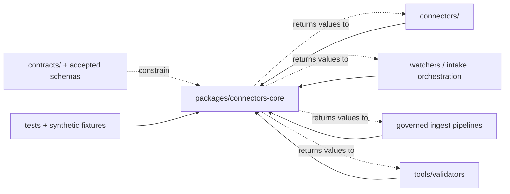
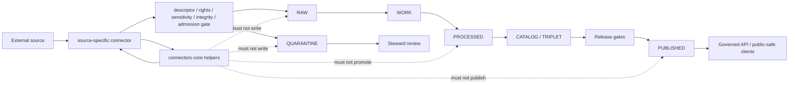

<!-- [KFM_META_BLOCK_V2]
doc_id: kfm://doc/packages-connectors-core-readme
title: Connectors Core Package README
type: readme
version: v0.2
status: draft; repository-grounded; python-package-scaffold; implementation-placeholder; PROPOSED package contract
owners:
  - OWNER_TBD — Package steward
  - OWNER_TBD — Connector steward
  - OWNER_TBD — Source steward
  - OWNER_TBD — Contracts steward
  - OWNER_TBD — Schema steward
  - OWNER_TBD — Validator steward
  - OWNER_TBD — Security / sensitivity steward
  - OWNER_TBD — Evidence steward
  - OWNER_TBD — Release steward
  - OWNER_TBD — Docs steward
created: 2026-06-13
updated: 2026-07-14
policy_label: public
supersedes: v0.1 (2026-06-13)
path: packages/connectors-core/README.md
repository_snapshot: main@8c8a8d8b216030ed32fb440deadb37968841e03e
related:
  - ./src/README.md
  - ./src/connectors_core/README.md
  - ./pyproject.toml
  - ../README.md
  - ../../connectors/README.md
  - ../../docs/sources/ADMISSION_PROCESS.md
  - ../../docs/adr/ADR-0017-source-descriptor-admission-process.md
  - ../../data/registry/sources/README.md
  - ../../contracts/source/source_descriptor.md
  - ../../contracts/source/ingest_receipt.md
  - ../../schemas/contracts/v1/source/source_descriptor.schema.json
  - ../../schemas/contracts/v1/sources/source_descriptor.schema.json
  - ../../schemas/contracts/v1/source/ingest_receipt.schema.json
  - ../../fixtures/contracts/v1/source/source_descriptor/README.md
  - ../../tests/schemas/test_common_contracts.py
  - ../../tools/validators/validate_source_descriptor.py
  - ../../tools/validators/connector_gate/README.md
  - ../../docs/doctrine/directory-rules.md
  - ../../.github/workflows/connector-gate.yml
  - ../../.github/CODEOWNERS
tags: [kfm, packages, connectors-core, python, shared-library, source-admission, connector-primitives, source-descriptor, ingest-receipt, retries, source-head, integrity, no-network, fail-closed, no-hidden-io, compatibility, correction, rollback]
notes:
  - "v0.2 replaces planning-heavy runtime uncertainty with a commit-pinned description of the current Python package scaffold."
  - "The project declares kfm-connectors-core 0.0.0; src/connectors_core/__init__.py is empty and core.py contains only a greenfield-placeholder comment."
  - "The merged src/README.md and src/connectors_core/README.md v0.2 files define the source-root and import-package boundaries."
  - "No package-specific tests, package-specific fixtures, public exports, build backend, dependency list, supported Python version, or indexed consumers are claimed."
  - "SourceDescriptor authority is conflicted: the fielded singular schema declares the plural path canonical, while the plural schema remains an empty permissive scaffold."
  - "SourceDescriptor validator and fixture metadata do not match the observed wrapper and common fixture harness."
  - "IngestReceipt has a fielded schema, but the schema-declared dedicated validator wrapper was not found at the tested path."
  - "The connector-gate workflow exists as echo-TODO jobs and does not prove connector output or receipt enforcement."
[/KFM_META_BLOCK_V2] -->

<a id="top"></a>

# Connectors Core Package

`packages/connectors-core/`

> Shared Python package boundary for reusable, source-agnostic connector primitives. The package may help governed connector and intake code represent transport observations, bounded retry decisions, integrity metadata, source-head state, safe failures, and contract-shaped values. It must not become a source-specific connector, source registry, admission authority, hidden lifecycle writer, authoritative receipt emitter, EvidenceBundle producer, policy engine, release authority, or public trust membrane.


> [!IMPORTANT]
> **Repository snapshot:** `main` at `8c8a8d8b216030ed32fb440deadb37968841e03e`  
> **Distribution:** `kfm-connectors-core`  
> **Version:** `0.0.0`  
> **Verified source layout:** `src/connectors_core/`  
> **Verified implementation:** empty `__init__.py` plus comment-only `core.py`  
> **Verified source contracts:** [`src/README.md`](./src/README.md) v0.2 and [`src/connectors_core/README.md`](./src/connectors_core/README.md) v0.2  
> **Build backend / dependencies / Python requirement / exports / consumers:** not established by current evidence  
> **Dedicated package tests / fixtures:** not found at the tested paths  
> **Connector-gate CI:** echo-TODO scaffold, not enforcement proof  
> **CODEOWNERS:** generic `@kfm/maintainers` fallback; no package-specific rule

> [!CAUTION]
> A successful fetch is not source admission. A retry that eventually succeeds is not validation. An ETag is not automatically a content digest. A matching checksum is not EvidenceBundle closure. A helper-produced dictionary is not an emitted receipt. This package may preserve facts and references; it cannot manufacture source authority, rights clearance, sensitivity clearance, review, lifecycle transition, release approval, or public truth.

---

## Quick jump

- [1. Purpose and audience](#1-purpose-and-audience)
- [2. Current repository state](#2-current-repository-state)
- [3. Bounded context and ubiquitous language](#3-bounded-context-and-ubiquitous-language)
- [4. Placement and authority](#4-placement-and-authority)
- [5. Current package surface](#5-current-package-surface)
- [6. Package responsibilities](#6-package-responsibilities)
- [7. Explicit non-responsibilities](#7-explicit-non-responsibilities)
- [8. Public API and export contract](#8-public-api-and-export-contract)
- [9. Import-time and side-effect contract](#9-import-time-and-side-effect-contract)
- [10. Dependency direction](#10-dependency-direction)
- [11. SourceDescriptor boundary and drift](#11-sourcedescriptor-boundary-and-drift)
- [12. IngestReceipt boundary](#12-ingestreceipt-boundary)
- [13. Transport, retry, timeout, and cancellation](#13-transport-retry-timeout-and-cancellation)
- [14. Source-head and integrity behavior](#14-source-head-and-integrity-behavior)
- [15. Result and failure semantics](#15-result-and-failure-semantics)
- [16. Secrets, configuration, and logging safety](#16-secrets-configuration-and-logging-safety)
- [17. Lifecycle and trust membrane](#17-lifecycle-and-trust-membrane)
- [18. Consumer integration contract](#18-consumer-integration-contract)
- [19. Generated code and schema adapters](#19-generated-code-and-schema-adapters)
- [20. Versioning and compatibility](#20-versioning-and-compatibility)
- [21. Proposed implementation sequence](#21-proposed-implementation-sequence)
- [22. Tests and fixtures](#22-tests-and-fixtures)
- [23. Packaging, installation, and CI gates](#23-packaging-installation-and-ci-gates)
- [24. Observability and operational safety](#24-observability-and-operational-safety)
- [25. Correction, supersession, and rollback](#25-correction-supersession-and-rollback)
- [26. Validation commands](#26-validation-commands)
- [27. Definition of done](#27-definition-of-done)
- [28. Open verification register](#28-open-verification-register)
- [29. Evidence ledger](#29-evidence-ledger)
- [30. Maintainer checklist](#30-maintainer-checklist)

---

## 1. Purpose and audience

`packages/connectors-core/` is the reusable package lane for connector support that is independent of any one source, agency, endpoint, domain, credential scheme, or product.

Its durable purpose is to make source-specific connectors safer and more consistent without moving source admission, registry authority, lifecycle authority, evidence closure, policy, or release into a shared convenience library.

The package may eventually provide:

- immutable source-agnostic transport result records;
- bounded retry, delay, timeout, deadline, and cancellation calculations;
- safe HTTP and source metadata normalization;
- ETag, Last-Modified, content-length, source-version, checksum, and source-head observations;
- streaming SHA-256 helpers;
- finite transport and intake-preflight failure categories;
- caller-supplied clock, sleeper, randomness, transport, limits, and redaction interfaces;
- adapters for already-governed `SourceDescriptor` and `IngestReceipt` shapes after authority drift is resolved;
- synthetic fake transports and builders used by tests through explicit test-support imports;
- compatibility helpers for reviewed connector API migrations.

The package must not:

- embed source-specific endpoints, queries, credentials, parsers, terms, or licensing decisions;
- activate, admit, retire, or reclassify a source;
- decide whether a record or payload may enter RAW;
- write lifecycle state as a hidden effect;
- mint authoritative receipts without governed run context;
- make an EvidenceBundle;
- decide policy, review, promotion, release, correction, withdrawal, or rollback;
- expose a public API or UI;
- convert generated language or a successful network operation into truth.

**Primary audience**

- package maintainers;
- source-specific connector and watcher authors;
- ingest and source-refresh pipeline maintainers;
- source, rights, sensitivity, evidence, policy, and release stewards;
- contracts, schema, validator, fixture, and CI maintainers;
- security reviewers;
- reviewers checking package boundaries and implementation maturity.

[Back to top](#top)

---

## 2. Current repository state

The table below separates directly observed repository facts from proposed package design.

| Surface | Evidence at snapshot | Status | Consequence |
|---|---|---|---|
| This README | Existing v0.1 package contract at `packages/connectors-core/README.md`. | **CONFIRMED** | Revised in place. |
| [`pyproject.toml`](./pyproject.toml) | Declares only `[project]`, name `kfm-connectors-core`, and version `0.0.0`. | **CONFIRMED minimal placeholder** | Python distribution identity is known; build and dependency behavior are not. |
| [`src/README.md`](./src/README.md) | Repository-grounded Python source-root contract v0.2. | **CONFIRMED** | Governs `src` layout, imports, dependencies, generated code, and packaging boundaries. |
| [`src/connectors_core/README.md`](./src/connectors_core/README.md) | Repository-grounded import-package contract v0.2. | **CONFIRMED** | Governs connector primitive semantics, retry/integrity behavior, and source-contract drift. |
| `src/connectors_core/__init__.py` | Exists and is empty. | **CONFIRMED** | Package marker only; no exports. |
| `src/connectors_core/core.py` | Contains only a greenfield-placeholder comment. | **CONFIRMED placeholder** | No executable connector primitive is established. |
| Indexed package search | Returned package docs/metadata and `core.py`; no implemented base/retry/result modules. | **NOT OBSERVED / search-limited** | Do not claim full recursive absence, but implementation is not proved. |
| Consumer imports | Search did not surface `from connectors_core`, `import connectors_core`, or `connectors_core.core` consumers. | **NOT OBSERVED / search-limited** | Do not claim production consumption. |
| Package tests | `tests/packages/connectors-core/README.md` returned 404. | **CONFIRMED absent at tested path** | No dedicated package test lane is established. |
| Package fixtures | `fixtures/packages/connectors-core/README.md` returned 404. | **CONFIRMED absent at tested path** | No dedicated package fixture lane is established. |
| SourceDescriptor semantic contract | Rich proposed contract exists. | **CONFIRMED document / PROPOSED object maturity** | Package code must remain subordinate to contract and schema authority. |
| SourceDescriptor singular schema | Fielded, closed schema exists under `schemas/contracts/v1/source/`. | **CONFIRMED** | It is the only field-complete observed schema, but its metadata declares another canonical path. |
| SourceDescriptor plural schema | Empty permissive scaffold under `schemas/contracts/v1/sources/`. | **CONFIRMED** | It cannot safely replace the fielded schema without governed migration. |
| SourceDescriptor wrapper | Root-level wrapper validates the singular schema against `fixtures/contracts/v1/source/source_descriptor`. | **CONFIRMED** | Does not match paths declared inside the fielded schema. |
| SourceDescriptor fixture family | Valid/invalid fixture family exists under `fixtures/contracts/v1/source/source_descriptor/`. | **CONFIRMED** | Fixture README records a root mismatch. |
| Common schema harness | Discovers `source` family schemas and fixture families under `fixtures/contracts/v1/`. | **CONFIRMED code / NOT RUN** | Harness existence does not prove current passing CI. |
| IngestReceipt contract/schema | Fielded, closed schema with finite outcomes exists. | **CONFIRMED** | Package may adapt values; authoritative emission remains outside the package. |
| IngestReceipt validator wrapper | Schema-declared path returned 404 during the preceding package review. | **CONFIRMED absent at tested path** | Do not claim dedicated validator enforcement. |
| Connector-gate workflow | Pull-request workflow contains only echo-TODO jobs. | **CONFIRMED scaffold** | Workflow success cannot prove connector output or receipt enforcement. |
| CODEOWNERS | Generic `* @kfm/maintainers`; no connectors-core-specific rule. | **CONFIRMED** | Required specialist review is not mechanically demonstrated. |
| Build/install behavior | No build backend, package discovery rule, dependencies, Python requirement, wheel/sdist config, or entry points in the inspected metadata. | **NOT OBSERVED** | Installation and publication readiness remain unknown. |
| Deployed runtime behavior | No logs, emitted receipts, package release artifacts, or live consumers were inspected. | **UNKNOWN** | This README is not runtime proof. |

### Truth boundary

```text
Python distribution identity                 = CONFIRMED
Python src layout                             = CONFIRMED
import package                                = CONFIRMED
empty initializer                             = CONFIRMED
comment-only core module                      = CONFIRMED
implemented connector primitives              = NOT OBSERVED
public exports                                = NOT OBSERVED
package consumers                             = NOT OBSERVED
dedicated package tests / fixtures             = NOT OBSERVED
build and installation behavior               = UNKNOWN
source contract/schema drift                  = CONFIRMED
connector-gate enforcement                    = NOT IMPLEMENTED by observed workflow
runtime safety                                = UNKNOWN
production readiness                          = UNKNOWN
```

[Back to top](#top)

---

## 3. Bounded context and ubiquitous language

### Bounded context

This package belongs to **connector support**, not connector execution or source governance.

It may represent observations and calculations that governed callers use. It must not own decisions that require source, rights, sensitivity, policy, review, lifecycle, evidence, or release authority.

### Terms

| Term | Meaning in this package | Not equivalent to |
|---|---|---|
| Connector primitive | Reusable source-agnostic implementation building block. | Source-specific connector. |
| Transport observation | Immutable facts observed from a transport operation. | Source admission or truth. |
| Fetch result | Bounded representation of transport outcome and safe metadata. | IngestReceipt or ValidationReport. |
| Retry decision | Pure calculation of whether and when a caller may retry. | Policy approval or hidden sleep. |
| Deadline | Caller-defined upper time bound for an operation. | Per-attempt timeout alone. |
| Source-head observation | ETag, Last-Modified, content length, version, digest, or explicit unavailable state. | Freshness proof by itself. |
| Digest | Algorithm-qualified content hash, normally SHA-256. | Signature, rights clearance, or evidence closure. |
| SourceDescriptor | Governed record of source identity and treatment posture. | Source truth, connector config, or admission decision by itself. |
| IngestReceipt | Governed record of a capture attempt and digest-pinned inputs. | Fetch result helper or release approval. |
| Admission | Governed pre-RAW decision. | Successful request or parse. |
| Quarantine | Governed fail-closed lifecycle route. | Exception swallowing or retry queue. |
| EvidenceBundle | Claim-scope evidence closure. | Checksum, manifest, or receipt. |
| Public trust membrane | Governed application/runtime interface. | Shared package import. |

### Anti-collapse rules

```text
fetch success              != source admission
retry success              != validation success
HTTP 200                   != usable source material
ETag                       != cryptographic digest
Last-Modified              != valid-time
checksum match             != EvidenceBundle closure
SourceDescriptor-shaped    != admitted SourceDescriptor
receipt-shaped dictionary  != emitted governed receipt
fixture                    != source authority
package test pass          != rights or sensitivity approval
connector output           != processed/catalog/published truth
```

[Back to top](#top)

---

## 4. Placement and authority

Directory Rules place shared reusable implementation under `packages/` and source-specific external-source behavior under `connectors/`.

| Responsibility | Correct home | Package posture |
|---|---|---|
| Reusable connector primitives | `packages/connectors-core/` | Owned here after implementation and tests. |
| Python source container | `packages/connectors-core/src/` | Owned here. |
| Python import package | `packages/connectors-core/src/connectors_core/` | Owned here. |
| Source-specific fetch/probe/intake | `connectors/<source-or-product>/` | Consumes helpers; not owned here. |
| Source admission doctrine | `docs/sources/` and accepted governance surfaces | Package is subordinate. |
| SourceDescriptor meaning | `contracts/source/source_descriptor.md` | Package must not redefine. |
| SourceDescriptor machine shape | Accepted schema under `schemas/contracts/v1/` | Currently conflicted; package must not choose implicitly. |
| SourceDescriptor instances and registry | `data/registry/sources/` | Package may receive refs/values; no activation authority. |
| IngestReceipt meaning and shape | Contract/schema roots | Package may support adapters; no authoritative emission. |
| RAW / WORK / QUARANTINE / PROCESSED / CATALOG / TRIPLET / PUBLISHED | `data/` lifecycle roots | No hidden writes. |
| Validators | `tools/validators/` and tests | Package may expose pure helpers, not validator authority. |
| Policy decisions | `policy/` | Package preserves decisions/refs only. |
| Evidence closure | Evidence contracts and proof roots | Package must not produce closure. |
| Release / correction / rollback | `release/` and governed data | Package must not decide. |
| Public API/UI | Governed apps/runtime | Package is not client-facing authority. |

### Authority rule

Being reusable does not make a package authoritative.

This package may be technically depended upon by many connectors while remaining semantically subordinate to:

1. accepted contracts;
2. accepted schemas;
3. source registry and source authority state;
4. rights and sensitivity policy;
5. validation and review;
6. lifecycle and receipt rules;
7. evidence closure;
8. release, correction, and rollback.

[Back to top](#top)

---

## 5. Current package surface

### Confirmed surface

```text
packages/connectors-core/
├── README.md
├── pyproject.toml
└── src/
    ├── README.md
    └── connectors_core/
        ├── README.md
        ├── __init__.py
        └── core.py
```

This is a bounded confirmed surface assembled from exact file checks and indexed search. It is not a full recursive tree guarantee.

### Current metadata

```toml
[project]
name = "kfm-connectors-core"
version = "0.0.0"
```

Not observed in the inspected metadata:

- `[build-system]`;
- Python requirement;
- runtime dependencies;
- optional dependency groups;
- package discovery configuration;
- entry points or console scripts;
- license metadata;
- authors/maintainers;
- project URLs;
- readme declaration;
- classifiers;
- wheel or sdist configuration.

### Current implementation

```text
src/connectors_core/__init__.py
  <empty>

src/connectors_core/core.py
  # connectors-core core — greenfield placeholder
```

The package is therefore **scaffolded**, not implemented.

[Back to top](#top)

---

## 6. Package responsibilities

After implementation evidence exists, appropriate responsibilities may include:

- pure retry/backoff calculations;
- timeout and deadline calculations;
- safe classification of retryable and non-retryable transport failures;
- immutable fetch-result records;
- response-size and content-length limit checks;
- safe header normalization and allowlisting;
- source-head observations;
- SHA-256 streaming digest helpers;
- normalized content identity records;
- caller-supplied cancellation checks;
- caller-supplied transport protocols;
- no-network test doubles;
- public-safe metadata redaction helpers;
- structural adapters for accepted SourceDescriptor and IngestReceipt schemas;
- compatibility shims with explicit removal dates;
- deterministic serialization helpers for package-owned records.

Every responsibility must remain:

- source-agnostic;
- policy-neutral;
- explicit about side effects;
- deterministic where practical;
- no-network by default in tests;
- bounded by caller-supplied limits;
- safe for sensitive metadata;
- independent of repository-relative working directories;
- subordinate to contracts and schemas;
- reversible.

[Back to top](#top)

---

## 7. Explicit non-responsibilities

This package must not contain or perform:

| Prohibited responsibility | Correct home or behavior |
|---|---|
| Hard-coded source endpoint, query, product, agency, domain, or source ID | Source-specific connector/config surface |
| Credentials, tokens, cookies, private keys, signed URLs, or secrets | Approved runtime secret mechanism |
| Source activation or retirement decision | Source registry/governance |
| Source role or authority upgrade | Source contract/policy/steward review |
| Rights or sensitivity decision | Policy and steward review |
| Hidden HTTP call at import | Forbidden |
| Hidden environment lookup that changes behavior | Explicit caller configuration |
| Hidden RAW/QUARANTINE or other lifecycle write | Governed caller/orchestration |
| Receipt ID minting without run context | Receipt emitter |
| Receipt persistence | Governed data/receipt lane |
| EvidenceBundle assembly or closure | Evidence workflow |
| Catalog/triplet assertion | Downstream governed pipeline |
| PolicyDecision generation | Policy engine |
| ReleaseManifest generation or approval | Release workflow |
| Public API route or UI behavior | Governed app roots |
| Source-specific parser | `connectors/<source>/` or accepted package |
| Network fixture recorded from sensitive production traffic | Forbidden; use synthetic/sanitized fixture |
| Generated model prose treated as source metadata | Deny |
| Parallel contract or schema definition | Contract/schema authority roots |

[Back to top](#top)

---

## 8. Public API and export contract

### Current state

`src/connectors_core/__init__.py` is empty. No public API is confirmed.

### Export admission rule

A symbol may become public only when:

1. its responsibility belongs to this package;
2. its name and behavior are documented;
3. input and output types are stable;
4. side effects are explicit;
5. security and redaction behavior are tested;
6. deterministic behavior is tested where applicable;
7. no-network tests cover the normal path;
8. negative tests cover bounds and failures;
9. compatibility impact is reviewed;
10. at least one verified consumer or approved near-term consumer exists;
11. package versioning reflects the API change.

### Internal-first posture

New modules should remain internal until their contract is stable.

PROPOSED convention:

```text
connectors_core/
  _internal/
    ...
  __init__.py
```

Do not create this directory solely for symmetry. Create it only with implementation and tests.

### `__all__`

When exports exist, define and test `__all__` or an accepted equivalent. Wildcard export of internal modules is prohibited.

### No import-through-file-layout contract

Consumers should import from documented package exports, not from unstable file paths. Temporary deep imports must be recorded as compatibility debt.

[Back to top](#top)

---

## 9. Import-time and side-effect contract

Importing `connectors_core` must not:

- access the network;
- resolve credentials;
- read secrets;
- inspect source endpoints;
- read or write lifecycle data;
- create directories or files;
- mutate environment variables;
- configure global logging;
- start threads, timers, event loops, or background tasks;
- sleep;
- evaluate source admission;
- evaluate policy;
- emit receipts;
- register a source;
- perform telemetry;
- load production payloads;
- call model or AI services.

Allowed import-time behavior should be limited to:

- definitions;
- immutable constants;
- enum/type declarations;
- pure registration that has no external side effects and is required by the language runtime.

### Import-safety test

A mature package should prove that import succeeds in a temporary environment with:

- network disabled;
- minimal environment variables;
- read-only repository files;
- no lifecycle directories;
- no credentials;
- no source registry;
- no current working directory assumptions.

[Back to top](#top)

---

## 10. Dependency direction

### Allowed direction



### Blocked direction

```text
connectors-core -> source-specific connector
connectors-core -> source registry mutation
connectors-core -> policy engine
connectors-core -> release workflow
connectors-core -> public UI/API
connectors-core -> hidden lifecycle store
connectors-core -> proof or receipt persistence
```

### Dependency rules

- The package may depend on small, stable, package-appropriate libraries after review.
- Avoid framework dependencies that turn the package into a service.
- Avoid importing source-specific connector packages.
- Avoid importing governed application layers.
- Avoid importing repository data paths as modules.
- Schema adapters must depend on an accepted authority, not whichever file is easiest to load.
- Optional integrations must remain optional and fail explicitly when unavailable.
- Dependency additions require license, security, size, maintenance, and offline-test review.

[Back to top](#top)

---

## 11. SourceDescriptor boundary and drift

### Semantic boundary

`SourceDescriptor` records source identity and how source material may be treated. It does not:

- make source claims true;
- admit every record;
- grant rights;
- lower sensitivity;
- approve release;
- replace EvidenceBundle closure;
- replace PolicyDecision;
- allow a connector to bypass review.

The package may eventually:

- accept a caller-provided descriptor object;
- validate shape using a caller-selected accepted validator;
- extract non-sensitive connector-relevant fields;
- preserve unknown-but-allowed extension data only when the accepted schema permits it;
- return findings without mutating the source registry.

The package must not:

- invent descriptor fields;
- silently fill missing authority, rights, or sensitivity;
- choose a canonical schema path by convenience;
- activate or persist a descriptor;
- downgrade restricted values;
- convert legacy fields without a migration record.

### Confirmed authority drift

| Concern | Observed state | Package rule |
|---|---|---|
| Fielded schema | `schemas/contracts/v1/source/source_descriptor.schema.json` is rich and closed. | Treat as observed implementation evidence, not final canonical authority by package fiat. |
| Declared canonical path | Fielded schema metadata names `schemas/contracts/v1/sources/source_descriptor.schema.json`. | Requires governed resolution. |
| Plural schema | Exists but has no declared fields and allows additional properties. | Must not replace fielded validation silently. |
| Validator metadata | Fielded schema names `tools/validators/sources/validate_source_descriptor.py`. | Path was not observed during the package review. |
| Observed wrapper | `tools/validators/validate_source_descriptor.py` validates singular schema. | Confirmed wrapper, not final path decision. |
| Fixture metadata | Fielded schema names `tests/fixtures/sources/source_descriptor/`. | Does not match observed fixture family. |
| Observed fixtures | `fixtures/contracts/v1/source/source_descriptor/`. | Confirmed and used by common harness. |
| Common harness | Discovers `source` schemas and fixtures under `fixtures/contracts/v1/source/`. | Confirms operational convention, not ADR acceptance. |

### Required resolution before generated adapters

Do not generate or publish SourceDescriptor package types until:

1. one canonical schema path is accepted;
2. contract and schema pointers agree;
3. validator path is accepted and present;
4. fixture root is accepted and present;
5. valid and invalid fixtures pass;
6. migration from the losing paths is documented;
7. aliases and compatibility window are defined;
8. rollback is documented;
9. package adapters pin schema/spec identity.

[Back to top](#top)

---

## 12. IngestReceipt boundary

The confirmed IngestReceipt schema requires:

- `id`;
- `source_id`;
- `run_id`;
- `started_at`;
- `finished_at`;
- `outcome`;
- `bytes_in`;
- `digests`.

Confirmed outcomes:

```text
SUCCESS
PARTIAL
FAIL
```

### Package may eventually provide

- pure field normalization;
- digest-map validation helpers;
- ID-format helpers after identity convention acceptance;
- temporal relation checks;
- builders that require all caller-supplied governed context;
- serialization helpers;
- structural adapters to accepted schema.

### Package must not

- claim a fetch result is an IngestReceipt automatically;
- assign `SUCCESS` solely because HTTP returned success;
- hide `PARTIAL`;
- overwrite `FAIL`;
- mint `source_id` or `run_id` without caller authority;
- persist receipts;
- imply admission, validation, evidence, or release from receipt outcome.

### Helper versus emitter

```text
package helper:
  validates / normalizes / constructs value under caller context

governed emitter:
  binds run identity + source identity + time + outcome + bytes + digests
  persists immutable receipt in accepted receipt lane
  participates in review, correction, and rollback
```

The package may host helpers. It is not the governed emitter.

[Back to top](#top)

---

## 13. Transport, retry, timeout, and cancellation

### Transport abstraction

A transport abstraction should:

- be supplied by the caller;
- expose explicit request inputs;
- return bounded response streams or values;
- support cancellation;
- preserve safe source metadata;
- not store credentials;
- not write lifecycle data;
- be replaceable by a no-network fake.

### Retry classification

PROPOSED finite retry classes:

```text
RETRYABLE_TRANSIENT
RETRYABLE_RATE_LIMIT
NON_RETRYABLE_CLIENT
NON_RETRYABLE_AUTH
NON_RETRYABLE_POLICY
CANCELLED
DEADLINE_EXCEEDED
RESPONSE_LIMIT_EXCEEDED
INTEGRITY_FAILURE
UNCLASSIFIED_FAILURE
```

These are package-internal design candidates, not accepted cross-repository enums.

### Retry invariants

- retries are bounded by attempts and total deadline;
- the caller supplies retry policy;
- backoff is deterministic when injected randomness is fixed;
- `Retry-After` is bounded by caller limits;
- authentication, policy, rights, sensitivity, or integrity failure is not retried by default;
- cancellation stops future attempts;
- response bodies from failed attempts are not silently merged;
- each attempt remains observable to the governed caller;
- eventual success does not erase prior failures;
- retries do not alter source admission or release state.

### Timeout model

Distinguish:

- connect timeout;
- read timeout;
- write timeout;
- per-attempt timeout;
- total deadline.

A package API must not use one ambiguous `timeout` value when the distinction affects safety.

[Back to top](#top)

---

## 14. Source-head and integrity behavior

### Source-head observation

A source-head observation may include:

- ETag;
- Last-Modified;
- content length;
- upstream version;
- revision ID;
- file list;
- checksum provided by the source;
- computed digest;
- observation time;
- explicit unavailable or not-applicable reason.

### ETag rules

An ETag must not be treated as a SHA-256 digest unless the source contract explicitly proves that equivalence.

Preserve:

```text
etag.value
etag.weak
etag.observed_at
etag.source_endpoint_ref
```

### Last-Modified rules

`Last-Modified` is a transport/source metadata observation, not necessarily:

- observation time;
- dataset valid-time;
- transaction-time;
- release-time;
- correction-time.

Time kind must remain explicit.

### Digest rules

- default to SHA-256 unless an accepted contract requires otherwise;
- stream large inputs rather than loading unbounded content;
- use algorithm-qualified values such as `sha256:<hex>`;
- bind a digest to a precisely defined byte sequence;
- do not hash secrets or sensitive values into public identifiers if dictionary attacks are plausible;
- report mismatch as integrity failure;
- never silently recompute and overwrite expected digest;
- preserve source-provided checksum separately from locally computed digest.

### Canonicalization

Structured payload canonicalization must be explicit. Hashing parsed JSON after reserialization is not equivalent to hashing received bytes unless the contract says so.

[Back to top](#top)

---

## 15. Result and failure semantics

A package result must distinguish transport facts from governance decisions.

### Proposed package-local result categories

```text
FETCH_OBSERVED
NOT_MODIFIED_OBSERVED
NO_CONTENT_OBSERVED
RATE_LIMIT_OBSERVED
AUTH_FAILURE_OBSERVED
CLIENT_FAILURE_OBSERVED
SERVER_FAILURE_OBSERVED
TIMEOUT_OBSERVED
CANCELLED_OBSERVED
RESPONSE_LIMIT_EXCEEDED
INTEGRITY_FAILURE
TRANSPORT_FAILURE
```

These names are PROPOSED and package-local until code and tests establish them.

### A result should carry

- category;
- attempt count;
- started/finished or elapsed time;
- request target reference, not necessarily raw sensitive URL;
- safe status code where applicable;
- safe allowlisted headers;
- byte count;
- source-head observations;
- computed/source-provided digest observations;
- retry recommendation or terminal state;
- public-safe error code;
- optional internal diagnostic reference;
- limitations.

### A result must not carry by default

- credentials;
- full signed URLs;
- cookies;
- authorization headers;
- unbounded response body;
- sensitive source payload;
- stack traces intended for public surfaces;
- policy decision;
- admission decision;
- release state inferred by the package.

### Failure preservation

Failures must remain first-class. Do not return an empty success object when:

- response size exceeded;
- digest failed;
- cancellation occurred;
- timeout expired;
- redaction failed;
- source metadata was malformed;
- caller limits were missing;
- schema authority was unresolved for a required adapter.

[Back to top](#top)

---

## 16. Secrets, configuration, and logging safety

### Configuration

Configuration must be passed explicitly or through an accepted runtime configuration object.

The package must not:

- read arbitrary environment variables during import;
- infer credentials from repository files;
- discover endpoints from current working directory;
- default to production endpoints;
- persist configuration;
- mutate global configuration.

### Secret handling

Secret values include:

- API keys;
- bearer tokens;
- OAuth tokens;
- cookies;
- passwords;
- private keys;
- credentialed query parameters;
- signed URLs;
- session IDs;
- private endpoint names when classified.

The package must not:

- log them;
- place them in exceptions;
- use them in deterministic IDs;
- write them to fixtures;
- include them in receipts or manifests;
- return them through public-safe metadata.

### Header handling

Use an allowlist for returned/logged headers. Deny by default:

```text
Authorization
Proxy-Authorization
Cookie
Set-Cookie
X-Api-Key
X-Amz-Security-Token
```

Header names and redaction rules must be case-insensitive.

### URL handling

- remove userinfo;
- redact configured sensitive query keys;
- treat unknown query keys conservatively;
- avoid logging full signed URLs;
- retain a safe endpoint reference or origin/path profile when needed.

### Logging

The package may return structured diagnostics to callers. It should not configure global logging or emit uncontrolled logs.

[Back to top](#top)

---

## 17. Lifecycle and trust membrane

The package participates only as reusable implementation support.



### Lifecycle rule

```text
RAW -> WORK / QUARANTINE -> PROCESSED -> CATALOG / TRIPLET -> PUBLISHED
```

Promotion is a governed state transition, not a package function or file move.

### Package outputs

Package outputs are implementation values. They become lifecycle artifacts only when governed callers bind:

- identity;
- source;
- time;
- bytes or refs;
- integrity;
- policy/review context;
- lifecycle destination;
- receipt identity;
- correction and rollback lineage.

### Public clients

Public clients must not:

- import this package as a source of truth;
- read package-internal fetch results;
- infer release from transport success;
- access RAW/WORK/QUARANTINE through package helpers;
- use package exceptions as public evidence;
- bypass governed runtime envelopes.

[Back to top](#top)

---

## 18. Consumer integration contract

### Source-specific connectors

A connector using this package remains responsible for:

- descriptor resolution;
- endpoint/source-specific behavior;
- credential injection;
- rights and sensitivity checks;
- source-role preservation;
- request limits;
- admission workflow;
- RAW/QUARANTINE routing;
- receipt emission;
- source-specific fixtures and tests.

### Watchers

A watcher may use pure source-head and retry helpers. It must remain a non-publisher and must not convert change detection into admission or release.

### Pipelines

An ingest pipeline may use integrity and shape helpers. It remains responsible for governed execution, receipts, lifecycle writes, validation, and policy.

### Validators

Repository validators may call package helpers, but validator semantics and final findings remain under the validator lane.

### Governed apps

Governed applications may indirectly depend on package-backed execution through services. They should not expose package-internal objects to public clients without governed projection.

### Consumer proof

Before a public export is added, verify at least one consumer with:

- pinned package version;
- import test;
- no-network unit tests;
- negative boundary tests;
- compatibility test;
- documented rollback.

[Back to top](#top)

---

## 19. Generated code and schema adapters

Generated code may reduce drift only after authority is settled.

### Prerequisites

- accepted source schema path;
- accepted contract pointer;
- accepted validator path;
- accepted fixture root;
- passing fixtures;
- generator identity and version;
- deterministic generator inputs;
- generated-file header;
- regeneration command;
- drift check in CI;
- rollback target.

### Generated output rules

Generated files must identify:

```text
generator
generator_version
source_contract
source_schema
schema_or_spec_hash
generated_at
manual_edit_policy
```

Prefer a deterministic content hash over generation time when reproducibility is important.

### No parallel authority

Generated types are implementation projections. They do not become a third contract or schema home.

### Manual edits

Generated files should be treated as generated. Manual edits must fail CI or be explicitly forbidden in file headers and review rules.

### Current block

SourceDescriptor generated adapters are **BLOCKED / NEEDS VERIFICATION** while singular/plural schema authority and tooling paths conflict.

[Back to top](#top)

---

## 20. Versioning and compatibility

The current version `0.0.0` accurately signals a placeholder.

### Version transition guidance

| Change | Suggested version posture |
|---|---|
| Docs-only clarification | No package version change unless release policy requires it. |
| First internal implementation without public exports | Remain `0.0.x` after packaging decision. |
| First reviewed public exports | Explicit pre-1.0 version with changelog and compatibility policy. |
| Additive public API | Minor version before 1.0 under documented policy. |
| Breaking public API | Versioned breaking change with migration and rollback. |
| Security fix | Patch/minor according to compatibility impact. |

Exact release policy is **PROPOSED / NEEDS VERIFICATION**.

### Compatibility promises

Do not promise compatibility for:

- internal modules;
- comment-only placeholders;
- proposed result enums;
- proposed file layout;
- unresolved schema adapters.

Once public exports exist, document:

- supported Python versions;
- stability tier;
- deprecation window;
- removal policy;
- semantic versioning interpretation;
- serialization compatibility;
- exception compatibility;
- consumer migration.

### Deprecation

A deprecated symbol should include:

- replacement;
- first deprecated version;
- removal target;
- migration example;
- affected consumers;
- rollback or compatibility shim.

[Back to top](#top)

---

## 21. Proposed implementation sequence

Use the smallest reversible sequence.

### Phase 0 — Resolve authority blockers

- resolve SourceDescriptor singular/plural schema authority;
- align contract, schema, validator, fixture, and policy pointers;
- reconcile fixture-root conventions;
- decide IngestReceipt validator path;
- record migration and rollback.

### Phase 1 — Complete package metadata

Add only after review:

- `[build-system]`;
- package discovery for `src` layout;
- supported Python version;
- license/readme metadata;
- maintainers;
- dependency policy;
- optional test dependency group;
- wheel/sdist behavior.

### Phase 2 — Import-safety baseline

- retain empty or explicit exports;
- test import with network disabled;
- test no environment mutation;
- test no filesystem/lifecycle writes;
- test no logging configuration;
- test no secret discovery.

### Phase 3 — Pure primitives

Implement low-risk pure code first:

- bounded retry calculation;
- deadline calculation;
- safe header allowlist/redaction;
- URL redaction;
- SHA-256 streaming digest;
- immutable source-head observation;
- finite package-local error category.

### Phase 4 — Source-agnostic transport protocol

- caller-provided transport;
- caller-provided clock/sleeper/randomness;
- explicit size/deadline/cancellation limits;
- synthetic fake transport;
- negative tests.

### Phase 5 — Contract adapters

Only after Phase 0:

- SourceDescriptor read-only adapter;
- IngestReceipt shape adapter/builder;
- schema/spec pinning;
- generated-code decision if used.

### Phase 6 — One low-risk pilot

Use one connector in a no-public-output path:

- source descriptor resolved;
- synthetic fixture first;
- no credentials committed;
- no hidden lifecycle writes;
- governed receipt emission outside package;
- rollback tested.

### Phase 7 — Public export and package release

- review exports;
- version package;
- publish changelog;
- verify consumer;
- run security and compatibility checks;
- retain rollback artifact.

[Back to top](#top)

---

## 22. Tests and fixtures

Dedicated package test and fixture READMEs were not found at the tested paths. The following is **PROPOSED**.

### Minimum test families

```text
tests/packages/connectors-core/
  test_import_safety.py
  test_public_exports.py
  test_no_source_specific_constants.py
  test_retry_bounds.py
  test_deadline_and_cancellation.py
  test_safe_header_redaction.py
  test_url_redaction.py
  test_response_size_limit.py
  test_source_head_observation.py
  test_sha256_streaming.py
  test_integrity_mismatch.py
  test_no_hidden_lifecycle_writes.py
  test_no_receipt_emission.py
  test_no_policy_or_release_decision.py
  test_schema_authority_block.py
  test_package_install.py
```

### Fixture guidance

```text
fixtures/packages/connectors-core/
  README.md
  transport/
  headers/
  source_head/
  integrity/
  errors/
```

Paths require Directory Rules and repository-convention review before creation.

### Fixture requirements

- synthetic or strongly sanitized;
- no secrets;
- no signed URLs;
- no sensitive source payloads;
- small and deterministic;
- clearly labeled non-authoritative;
- valid and invalid cases;
- no live network dependency;
- explicit encoding and content bytes;
- bounded-size cases;
- security regression cases.

### Negative-first cases

| Case | Required behavior |
|---|---|
| Import with no network | Pass without connection attempt. |
| Authorization header | Redacted/denied from safe metadata. |
| Signed URL | Sensitive query values removed. |
| Response over limit | Explicit terminal failure. |
| Retry attempts exhausted | Failure preserved. |
| Total deadline exceeded | Explicit deadline outcome. |
| Cancellation | No later retry. |
| Weak ETag | Preserved as weak; not digest. |
| Digest mismatch | Integrity failure; no success. |
| Missing caller limit | Fail safe according to API contract. |
| SourceDescriptor authority unresolved | Adapter unavailable or explicit error. |
| Receipt-shaped helper output | Not persisted or labeled emitted receipt. |
| Source-specific constant in package | Boundary test fails. |
| Lifecycle path write attempt | Boundary test fails. |

### Existing schema fixtures

The repository already has SourceDescriptor schema fixtures and a common schema harness. Those test contract shape, not this package's runtime behavior.

[Back to top](#top)

---

## 23. Packaging, installation, and CI gates

### Packaging gates

Before claiming installability:

- build backend configured;
- `src` package discovery configured;
- wheel builds;
- sdist builds;
- clean-environment install succeeds;
- import succeeds after install;
- package metadata is complete;
- no repository-root import shortcut is required;
- no undeclared dependency is imported;
- package excludes tests, secrets, payloads, and unintended files.

### Runtime gates

Before production use:

- connector primitive implementation exists;
- no-network tests pass;
- bounds and cancellation tests pass;
- secret and logging tests pass;
- source-specific boundary tests pass;
- lifecycle-write boundary tests pass;
- contract/schema adapters pin accepted authority;
- consumer integration test passes;
- rollback test passes.

### CI state

The current `connector-gate` workflow runs:

```yaml
- echo TODO connector-output-gate
- echo TODO ingest-receipt-presence
```

It is a scaffold. Its success does not prove:

- package build;
- tests;
- SourceDescriptor resolution;
- connector output restrictions;
- receipt presence;
- lifecycle safety;
- security;
- runtime integration.

### Required-check posture

Do not make a package-specific workflow required until it performs meaningful checks and has an emergency rollback path.

[Back to top](#top)

---

## 24. Observability and operational safety

### Package diagnostics

Return structured, bounded diagnostics to governed callers.

Recommended fields, **PROPOSED**:

```text
operation_id
attempt
category
elapsed_ms
status_code?
bytes_observed?
source_head_present
digest_present
retryable
terminal
safe_reason_code
diagnostic_ref?
```

### Cardinality and privacy

Do not use as metric labels:

- full URLs;
- source IDs with unbounded cardinality;
- run IDs;
- receipt IDs;
- error messages;
- user-supplied values;
- coordinates;
- credentials.

### Tracing

Tracing integrations must be caller-controlled and must apply the same secret/header/URL redaction rules.

### Errors

- Public-safe error text must not expose sensitive details.
- Internal diagnostics should be referenced, not embedded into public responses.
- Preserve causal chains for maintainers without exposing secrets.
- Do not turn an exception into a generic success or empty result.
- Avoid a global exception hierarchy until package APIs exist.

### Resource safety

All future IO must support explicit limits for:

- response bytes;
- redirect count;
- attempts;
- deadline;
- concurrent operations;
- decompressed size;
- archive members where relevant.

[Back to top](#top)

---

## 25. Correction, supersession, and rollback

### Documentation correction

When evidence changes:

1. identify the stale claim;
2. inspect current package files, tests, workflows, and consumers;
3. update truth labels;
4. preserve prior version in Git;
5. update source-root and child-module READMEs together where boundaries changed.

### Package supersession

Do not silently replace:

- result categories;
- retry semantics;
- source-head fields;
- digest canonicalization;
- public exports;
- schema adapters.

Provide migration and compatibility notes.

### Rollback triggers

Rollback is required if a change:

- performs network access at import;
- reads credentials implicitly;
- logs secrets;
- writes lifecycle data;
- admits a source;
- emits or persists receipts without governed context;
- chooses a conflicted schema path silently;
- treats fetch success as admission;
- treats checksum as evidence closure;
- breaks a verified consumer without migration;
- allows unbounded response or retry behavior;
- makes public clients depend on package-internal objects.

### Rollback method

- revert the package change;
- restore previous package version/API;
- disable affected consumer integration;
- preserve emitted governed artifacts and mark them corrected/withdrawn where required;
- do not rewrite shared history;
- record affected connectors and runs.

[Back to top](#top)

---

## 26. Validation commands

These commands are inspection and validation candidates. Commands that depend on unimplemented packaging or tests are marked proposed.

### Confirm current surface

```bash
find packages/connectors-core -maxdepth 4 -type f -print | sort
sed -n '1,160p' packages/connectors-core/pyproject.toml
sed -n '1,160p' packages/connectors-core/src/connectors_core/__init__.py
sed -n '1,160p' packages/connectors-core/src/connectors_core/core.py
```

### Search consumers and boundary violations

```bash
git grep -nE '(^|[[:space:]])(from|import)[[:space:]]+connectors_core' -- \
  ':!packages/connectors-core/**'

git grep -nE '(data/(raw|work|quarantine|processed|catalog|triplets|published)|ReleaseManifest|EvidenceBundle)' -- \
  packages/connectors-core
```

### Inspect contract/schema drift

```bash
sed -n '1,220p' schemas/contracts/v1/source/source_descriptor.schema.json
sed -n '1,120p' schemas/contracts/v1/sources/source_descriptor.schema.json
sed -n '1,120p' tools/validators/validate_source_descriptor.py
find fixtures/contracts/v1/source/source_descriptor -maxdepth 3 -type f -print | sort
```

### Existing schema harness

```bash
python -m pytest tests/schemas/test_common_contracts.py
```

**NOT RUN during this documentation update.**

### Proposed package checks

```bash
python -m build packages/connectors-core
python -m pip install --force-reinstall packages/connectors-core/dist/*.whl
python -c "import connectors_core"
python -m pytest tests/packages/connectors-core
```

These are not currently claimed to work.

### Documentation structure

```bash
grep -c '^# ' packages/connectors-core/README.md
```

[Back to top](#top)

---

## 27. Definition of done

### README revision complete

- [x] Package runtime identified as Python.
- [x] Current `0.0.0` placeholder state recorded.
- [x] Source-root and child-module v0.2 contracts linked.
- [x] Empty initializer and comment-only implementation recorded.
- [x] Build, dependency, export, consumer, test, fixture, and runtime claims bounded.
- [x] Package and source-specific connector responsibilities separated.
- [x] SourceDescriptor schema/tooling drift documented.
- [x] IngestReceipt helper/emitter boundary documented.
- [x] Import-time and hidden-side-effect rules documented.
- [x] Security, retry, integrity, and resource limits documented.
- [x] Lifecycle, evidence, policy, release, correction, and rollback boundaries preserved.
- [x] Implementation sequence and negative-first tests proposed.
- [x] Evidence ledger and open verification register included.

### Package implementation complete only when

- [ ] accepted owner and CODEOWNERS rule exist;
- [ ] SourceDescriptor authority drift is resolved;
- [ ] IngestReceipt validator path is resolved;
- [ ] package metadata has build backend and discovery;
- [ ] Python version and dependencies are declared;
- [ ] install/build tests pass;
- [ ] import-safety tests pass;
- [ ] package exports are documented and tested;
- [ ] connector primitives are implemented;
- [ ] package tests and fixtures exist;
- [ ] no-source-specific and no-hidden-write tests pass;
- [ ] security and resource-bound tests pass;
- [ ] at least one governed consumer integration is verified;
- [ ] meaningful CI runs;
- [ ] correction and rollback are tested;
- [ ] package version is advanced intentionally.

[Back to top](#top)

---

## 28. Open verification register

| ID | Question | Status | Evidence needed |
|---|---|---|---|
| `PKG-CONN-CORE-001` | Which SourceDescriptor schema path is canonical? | **CONFLICTED / NEEDS VERIFICATION** | Accepted ADR/migration and aligned schema metadata. |
| `PKG-CONN-CORE-002` | Which SourceDescriptor validator path is canonical? | **CONFLICTED / NEEDS VERIFICATION** | Validator inventory, CI usage, migration decision. |
| `PKG-CONN-CORE-003` | Which SourceDescriptor fixture root is canonical? | **CONFLICTED / NEEDS VERIFICATION** | Harness, schema metadata, fixture migration decision. |
| `PKG-CONN-CORE-004` | Where should the IngestReceipt validator live? | **NEEDS VERIFICATION** | Exact file, tests, workflow wiring. |
| `PKG-CONN-CORE-005` | Which build backend will package `src/connectors_core`? | **UNKNOWN** | `pyproject.toml` implementation and build proof. |
| `PKG-CONN-CORE-006` | Which Python versions are supported? | **UNKNOWN** | Package metadata and CI matrix. |
| `PKG-CONN-CORE-007` | Which runtime dependencies are justified? | **UNKNOWN** | Implemented APIs and dependency review. |
| `PKG-CONN-CORE-008` | What is the first stable public export? | **UNKNOWN** | Consumer need, implementation, tests, API review. |
| `PKG-CONN-CORE-009` | Which connectors currently or imminently consume the package? | **NOT OBSERVED** | Import inventory and integration plans. |
| `PKG-CONN-CORE-010` | Where will dedicated tests and fixtures live? | **NEEDS VERIFICATION** | Directory Rules check and repo test convention. |
| `PKG-CONN-CORE-011` | Which retry and timeout vocabulary is accepted? | **PROPOSED** | Contract/API decision and tests. |
| `PKG-CONN-CORE-012` | Which result/error vocabulary is accepted? | **PROPOSED** | API decision and consumer tests. |
| `PKG-CONN-CORE-013` | Is generated code needed? | **UNKNOWN** | Drift analysis and generator proposal. |
| `PKG-CONN-CORE-014` | Which package CI workflow will perform meaningful checks? | **UNKNOWN** | Workflow implementation and required-check decision. |
| `PKG-CONN-CORE-015` | How are security findings and dependency alerts owned? | **UNKNOWN** | Owner assignment and workflow evidence. |
| `PKG-CONN-CORE-016` | What package release channel and artifact registry are used? | **UNKNOWN** | Release design and artifact evidence. |
| `PKG-CONN-CORE-017` | What deprecation window applies before 1.0? | **PROPOSED** | Compatibility policy. |
| `PKG-CONN-CORE-018` | Which connector is the first low-risk pilot? | **UNKNOWN** | Source steward and connector owner selection. |
| `PKG-CONN-CORE-019` | How is rollback tested for a consumer integration? | **UNKNOWN** | Integration runbook and test evidence. |
| `PKG-CONN-CORE-020` | Should the package have a specific CODEOWNERS rule? | **NEEDS VERIFICATION** | Maintainer/steward assignment. |

[Back to top](#top)

---

## 29. Evidence ledger

Repository evidence inspected for this revision:

| Evidence | Blob / ref | Supports | Limitation |
|---|---|---|---|
| `packages/connectors-core/README.md` v0.1 | `5f8143304fdfa87b4dabc65d4436632aaf3fe018` | Existing package scope and prior planning language. | Stale on Python and source-layout status. |
| `packages/connectors-core/pyproject.toml` | `f49ef584549c29f87c5b44b7f89914604a1a8b6a` | Distribution name and `0.0.0` version. | No build, dependencies, or Python requirement. |
| `packages/connectors-core/src/README.md` v0.2 | `302265bdcd7f105bcc52deded01632e02a54e3b8` | Python source-root, packaging, import, dependency, generated-code boundaries. | Documentation contract, not build proof. |
| `packages/connectors-core/src/connectors_core/README.md` v0.2 | `dd27378932787efbfb9029dfc89b857ce4936626` | Module semantics, current placeholder state, SourceDescriptor/IngestReceipt drift. | Documentation contract, not runtime proof. |
| `src/connectors_core/__init__.py` | `e69de29bb2d1d6434b8b29ae775ad8c2e48c5391` | Empty package initializer. | No API. |
| `src/connectors_core/core.py` | `d30ad39b6b499ca9950d77798b44507b8b20f5c1` | Comment-only placeholder. | No behavior. |
| `contracts/source/source_descriptor.md` | `b57ae5ccc042c1423b75c168438800384c9b6713` | SourceDescriptor meaning and boundaries. | Contract status is proposed. |
| Singular SourceDescriptor schema | `582e70b834278c3c6ca9a8b31efbe0989c96f0bc` | Field-complete closed schema and metadata drift. | Declares plural path canonical. |
| Plural SourceDescriptor schema | `8d5cee60a711454a78cbf4a3c84eebbaed2503e8` | Confirms empty permissive scaffold. | Not field-complete. |
| SourceDescriptor wrapper | `9d0538e727b5eb49c043998a3550972349d2e790` | Observed singular schema and fixture paths used by wrapper. | No execution performed. |
| SourceDescriptor fixture README | `4df8a264ef6f8ba48dbfcf313d3d6390b557f5c5` | Valid/invalid fixture family and fixture-root mismatch. | Tests not run. |
| Common schema harness | `b04342cc034d7f1cc554e155fdd02d6e972976e6` | `source` family discovery and fixture convention. | Not run in this task. |
| IngestReceipt contract | `4273a9bad9edc7ce7f54c288075f8a49b0f2fe80` | Receipt meaning and helper/emitter separation. | Runtime wiring unverified. |
| IngestReceipt schema | `4e9707bec7da63049c5043562c9470564b77184f` | Required fields, finite outcomes, closed shape. | Declared validator not found at tested path. |
| Connector-gate workflow | `fc36ecced55bb0b4002d551cb28addfff0be918a` | Confirms echo-TODO jobs. | No meaningful enforcement. |
| Connector-gate validator README | `bfd5ff3875509f46e050c980891e23841cbae53e` | Proposed pre-RAW gate boundaries. | README says implementation not established. |
| Connectors root README | `bdd50032bed62ac36964c79f16cf5541b21759a6` | Source-specific connector and lifecycle handoff boundary. | Child implementation remains lane-specific. |
| Source admission process | `ab27618a4b1b0e6775d18bedca37aa7d6c514e6e` | Pre-RAW admission doctrine and fail-closed posture. | Specific implementation paths include proposals. |
| Directory Rules | `2affb080e6f0043867c64c7f06c1ca52030fbd55` | Shared package and responsibility-root placement. | Does not prove package implementation. |
| CODEOWNERS | `6adabefcbe58b9d281f105dbabaea451aa165619` | Generic maintainer fallback; no package-specific owner. | Placeholder staffing model. |
| Package tests exact path | 404 at snapshot | Dedicated README absent at tested path. | Does not prove every possible test file is absent. |
| Package fixtures exact path | 404 at snapshot | Dedicated README absent at tested path. | Does not prove every possible fixture file is absent. |
| Current repository snapshot | `8c8a8d8b216030ed32fb440deadb37968841e03e` | Commit-pinned package and merged source docs. | No runtime/log/deployment inspection. |

### Truth summary

```text
CONFIRMED:
  Python distribution and src layout
  package/source README surfaces
  empty initializer
  comment-only core module
  SourceDescriptor drift
  IngestReceipt fielded schema
  echo-only connector-gate workflow
  generic CODEOWNERS fallback

PROPOSED:
  package API
  retry/result vocabularies
  test and fixture layout
  implementation sequence
  generated-code approach
  versioning and release policy

UNKNOWN:
  build/install behavior
  dependencies
  consumers
  runtime safety
  operational use
  artifact publication
  meaningful CI
```

[Back to top](#top)

---

## 30. Maintainer checklist

Before changing this package:

- [ ] Confirm the change is reusable and source-agnostic.
- [ ] Read [`src/README.md`](./src/README.md) and [`src/connectors_core/README.md`](./src/connectors_core/README.md).
- [ ] Check Directory Rules before adding or moving files.
- [ ] Confirm no source-specific endpoint, parser, credential, or policy enters the package.
- [ ] Keep imports free of network, secret, environment, filesystem, lifecycle, telemetry, thread, and timer side effects.
- [ ] Keep caller limits explicit.
- [ ] Preserve retry failures and terminal states.
- [ ] Distinguish ETag, Last-Modified, source version, and digest.
- [ ] Use SHA-256 with explicit byte semantics where integrity is required.
- [ ] Redact authorization headers, cookies, tokens, signed URLs, and sensitive query values.
- [ ] Do not write RAW, QUARANTINE, receipts, proofs, catalog, or release state.
- [ ] Do not emit SourceDescriptor or IngestReceipt authority without governed caller context.
- [ ] Do not generate SourceDescriptor adapters while schema authority is conflicted.
- [ ] Add no-network and negative tests with implementation.
- [ ] Add build/install proof before claiming package readiness.
- [ ] Add a consumer test before stabilizing a public export.
- [ ] Update package version and changelog intentionally.
- [ ] Document compatibility and deprecation.
- [ ] Record correction and rollback.
- [ ] Keep public clients behind governed interfaces.
- [ ] Mark unverified implementation claims `UNKNOWN` or `NEEDS VERIFICATION`.

## Status summary

`packages/connectors-core/` is a **confirmed Python package scaffold**, not an implemented connector framework.

Its current value is a governed package boundary and a pair of detailed source contracts. The next sound change is not a broad framework build. It is to resolve SourceDescriptor authority drift, complete minimal Python packaging, prove import safety, and implement a small set of pure, bounded, no-network primitives with negative-first tests.

<p align="right"><a href="#top">Back to top</a></p>
