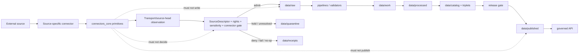

<!-- [KFM_META_BLOCK_V2]
doc_id: kfm://doc/packages-connectors-core-src-connectors-core-readme
title: Connectors Core Source Module README
type: readme
version: v0.2
status: draft; repository-grounded; implementation-placeholder; PROPOSED module contract
owners:
  - OWNER_TBD — Package steward
  - OWNER_TBD — Connector steward
  - OWNER_TBD — Source steward
  - OWNER_TBD — Contracts steward
  - OWNER_TBD — Schema steward
  - OWNER_TBD — Validator steward
  - OWNER_TBD — Security / sensitivity steward
  - OWNER_TBD — Evidence steward
  - OWNER_TBD — Docs steward
created: 2026-06-13
updated: 2026-07-14
policy_label: public
supersedes: v0.1 (2026-06-13)
path: packages/connectors-core/src/connectors_core/README.md
repository_snapshot: main@28db8aa8cadeed83d33ce6c48dde9fdcefe6d8dd
initial_evidence_snapshot: main@08bb75a60e60bcdea02c2098056a2d5b296bb212
related:
  - ../README.md
  - ../../README.md
  - ../../pyproject.toml
  - ../../../README.md
  - ../../../../connectors/README.md
  - ../../../../docs/sources/ADMISSION_PROCESS.md
  - ../../../../docs/adr/ADR-0017-source-descriptor-admission-process.md
  - ../../../../data/registry/sources/README.md
  - ../../../../contracts/source/source_descriptor.md
  - ../../../../contracts/source/ingest_receipt.md
  - ../../../../schemas/contracts/v1/source/source_descriptor.schema.json
  - ../../../../schemas/contracts/v1/sources/source_descriptor.schema.json
  - ../../../../schemas/contracts/v1/source/ingest_receipt.schema.json
  - ../../../../fixtures/contracts/v1/source/source_descriptor/README.md
  - ../../../../tests/schemas/test_common_contracts.py
  - ../../../../tools/validators/validate_source_descriptor.py
  - ../../../../tools/validators/connector_gate/README.md
  - ../../../../docs/doctrine/directory-rules.md
  - ../../../../.github/workflows/connector-gate.yml
tags: [kfm, packages, connectors-core, python, source-module, connector-primitives, source-descriptor, ingest-receipt, retry, source-head, integrity, no-network, fail-closed, source-admission, quarantine, receipts, rollback]
notes:
  - "v0.2 replaces planning-heavy runtime uncertainty with a commit-pinned description of the current Python package scaffold."
  - "The package declares kfm-connectors-core 0.0.0; connectors_core/__init__.py is empty; core.py contains only a greenfield-placeholder comment."
  - "No package-specific tests, package-specific fixtures, exported helper API, or indexed consumer imports were observed at the tested paths."
  - "The fielded SourceDescriptor schema is under schemas/contracts/v1/source/, but its metadata declares schemas/contracts/v1/sources/ canonical; the plural schema remains an empty permissive scaffold."
  - "SourceDescriptor validator and fixture metadata drift: schema metadata names tools/validators/sources/ and tests/fixtures/sources/, while the observed wrapper and fixture harness use tools/validators/validate_source_descriptor.py and fixtures/contracts/v1/source/."
  - "IngestReceipt has a fielded schema, but its declared validator wrapper was not found at the tested path."
  - "The connector-gate workflow exists as echo-TODO jobs and does not prove connector output or receipt enforcement."
[/KFM_META_BLOCK_V2] -->

<a id="top"></a>

# Connectors Core Source Module

`packages/connectors-core/src/connectors_core/`

> Python package-source boundary for reusable, source-agnostic connector primitives. Code here may normalize transport observations, bounded retry decisions, integrity metadata, source-head observations, and safe failure details for governed callers. It must not become a source-specific connector, source registry, admission decision-maker, hidden lifecycle writer, receipt authority, EvidenceBundle producer, policy engine, release authority, or public trust membrane.


> [!IMPORTANT]
> **Review-branch base:** `main` at `28db8aa8cadeed83d33ce6c48dde9fdcefe6d8dd`  
> **Detailed evidence snapshot:** `main` at `08bb75a60e60bcdea02c2098056a2d5b296bb212`; the target blob was rechecked unchanged and intervening changes affected only `configs/domains/flora/README.md`  
> **Current package metadata:** `kfm-connectors-core`, version `0.0.0`  
> **Current implementation:** empty `__init__.py` plus comment-only `core.py`  
> **Current exports and consumers:** not observed in indexed search  
> **Current package tests and fixtures:** not found at the tested package-specific README paths  
> **Current connector-gate CI:** echo-TODO scaffold  
> **Current source-contract posture:** fielded singular SourceDescriptor schema plus unresolved singular/plural authority and validator/fixture-path drift

> [!CAUTION]
> A successful fetch is not source admission. A matching checksum is not evidence closure. An ETag is not automatically a content digest. A retry that eventually succeeds does not resolve rights, sensitivity, source role, review, lifecycle, or release state. This package may preserve those facts and references; it cannot manufacture the governing decisions.

---

## Quick jump

- [1. Purpose and audience](#1-purpose-and-audience)
- [2. Current repository state](#2-current-repository-state)
- [3. Bounded context and language](#3-bounded-context-and-language)
- [4. Placement and authority](#4-placement-and-authority)
- [5. Current directory surface](#5-current-directory-surface)
- [6. Operating invariants](#6-operating-invariants)
- [7. Import and dependency direction](#7-import-and-dependency-direction)
- [8. Import-time and side-effect contract](#8-import-time-and-side-effect-contract)
- [9. SourceDescriptor boundary](#9-sourcedescriptor-boundary)
- [10. SourceDescriptor schema and tooling drift](#10-sourcedescriptor-schema-and-tooling-drift)
- [11. IngestReceipt boundary](#11-ingestreceipt-boundary)
- [12. Transport, retry, and source-head behavior](#12-transport-retry-and-source-head-behavior)
- [13. Integrity and digest behavior](#13-integrity-and-digest-behavior)
- [14. Result and failure semantics](#14-result-and-failure-semantics)
- [15. Secrets, metadata, and logging safety](#15-secrets-metadata-and-logging-safety)
- [16. Lifecycle and trust membrane](#16-lifecycle-and-trust-membrane)
- [17. Consumer contract](#17-consumer-contract)
- [18. Proposed implementation sequence](#18-proposed-implementation-sequence)
- [19. Tests and fixtures](#19-tests-and-fixtures)
- [20. Compatibility, correction, and rollback](#20-compatibility-correction-and-rollback)
- [21. Validation commands](#21-validation-commands)
- [22. Definition of done](#22-definition-of-done)
- [23. Open verification register](#23-open-verification-register)
- [24. Evidence ledger](#24-evidence-ledger)
- [25. Maintainer checklist](#25-maintainer-checklist)

---

## 1. Purpose and audience

`packages/connectors-core/src/connectors_core/` is the Python import-package lane for reusable connector support that is independent of any one source, agency, endpoint, credential scheme, domain, or product.

Its durable purpose is to make source-specific connectors safer and more consistent without moving source admission, lifecycle authority, or policy into a shared convenience library.

This module may eventually support:

- source-agnostic transport protocols and immutable result records;
- bounded retry and timeout calculations;
- safe HTTP/source metadata normalization;
- ETag, Last-Modified, content-length, checksum, and source-head observation records;
- streaming digest helpers;
- typed, finite transport failure categories;
- source-intake preflight inputs that do not decide admission;
- caller-supplied clock, sleeper, randomness, limits, and transport interfaces for deterministic tests;
- safe, synthetic fake transports for no-network tests;
- adapters that validate already-assembled `SourceDescriptor` or `IngestReceipt` objects against accepted schemas.

It must not:

- embed source-specific endpoints, credentials, query rules, parsers, or licensing decisions;
- decide whether a source, descriptor, record, or payload is admitted;
- activate, retire, or reclassify a source;
- write RAW, WORK, QUARANTINE, PROCESSED, CATALOG, TRIPLET, or PUBLISHED state as a hidden effect;
- mint authoritative receipts without the caller's governed execution context;
- produce evidence closure;
- make policy, review, release, correction, or rollback decisions;
- serve public clients directly.

**Primary audience**

- package and connector maintainers;
- source, rights, sensitivity, evidence, and release stewards;
- authors of source-specific connectors and watchers;
- ingest and source-refresh pipeline maintainers;
- validator and fixture maintainers;
- reviewers checking source-admission and lifecycle boundaries.

[Back to top](#top)

---

## 2. Current repository state

The following matrix distinguishes repository facts from intended design.

| Surface | Evidence at snapshot | Status | Consequence |
|---|---|---|---|
| This README | Existing v0.1 planning document. | **CONFIRMED** | Revised in place. |
| [`../../pyproject.toml`](../../pyproject.toml) | Declares only project name `kfm-connectors-core` and version `0.0.0`. | **CONFIRMED minimal placeholder** | Python is established; build backend, dependencies, and supported versions are not. |
| `__init__.py` | Exists and is empty. | **CONFIRMED** | Package marker only; no public exports. |
| `core.py` | Contains only `# connectors-core core — greenfield placeholder`. | **CONFIRMED placeholder** | No connector primitive behavior is implemented there. |
| Indexed package search | Surfaced the package READMEs, metadata, and `core.py`; no base/retry/result implementation. | **NOT OBSERVED / search-limited** | Do not claim full recursive absence, but no implementation is established. |
| Consumer imports | Searches for `from connectors_core`, `import connectors_core`, and `connectors_core.core` returned no results. | **NOT OBSERVED** | Public API and compatibility requirements remain unproven. |
| Package-specific tests | `tests/packages/connectors-core/README.md` was not found. | **NOT OBSERVED at tested path** | No dedicated package test lane is established. |
| Package-specific fixtures | `fixtures/packages/connectors-core/README.md` was not found. | **NOT OBSERVED at tested path** | No dedicated package fixture lane is established. |
| SourceDescriptor contract | [`contracts/source/source_descriptor.md`](../../../../contracts/source/source_descriptor.md) defines rich, proposed source-admission semantics. | **CONFIRMED contract / PROPOSED status** | Package helpers must remain subordinate to it. |
| Singular SourceDescriptor schema | [`schemas/contracts/v1/source/source_descriptor.schema.json`](../../../../schemas/contracts/v1/source/source_descriptor.schema.json) is fielded and closed. | **CONFIRMED** | It is the only inspected schema with real SourceDescriptor enforcement. |
| Plural SourceDescriptor schema | [`schemas/contracts/v1/sources/source_descriptor.schema.json`](../../../../schemas/contracts/v1/sources/source_descriptor.schema.json) is an empty permissive scaffold. | **CONFIRMED scaffold** | It cannot currently replace the fielded singular schema safely. |
| SourceDescriptor wrapper | [`tools/validators/validate_source_descriptor.py`](../../../../tools/validators/validate_source_descriptor.py) exists and uses the singular schema plus contract fixtures. | **CONFIRMED wrapper / NOT RUN** | Its path conflicts with schema metadata. |
| SourceDescriptor fixtures | [`fixtures/contracts/v1/source/source_descriptor/`](../../../../fixtures/contracts/v1/source/source_descriptor/README.md) has documented valid/invalid cases. | **CONFIRMED narrow coverage** | Fixture root conflicts with schema metadata. |
| Common fixture harness | [`tests/schemas/test_common_contracts.py`](../../../../tests/schemas/test_common_contracts.py) discovers the `source` family under `fixtures/contracts/v1/`. | **CONFIRMED harness / NOT RUN** | Does not prove CI pass or package behavior. |
| IngestReceipt contract/schema | Fielded contract and schema exist with finite outcomes and SHA-256 digest rules. | **CONFIRMED / PROPOSED contract status** | Helpers may construct candidates but cannot emit authoritative receipts alone. |
| IngestReceipt validator | Schema-declared `tools/validators/validate_ingest_receipt.py` was not found. | **NOT FOUND at tested path** | Validator wiring is incomplete. |
| Connector-gate validator lane | [`tools/validators/connector_gate/README.md`](../../../../tools/validators/connector_gate/README.md) exists but states executable behavior is unverified. | **CONFIRMED README / implementation NOT OBSERVED** | It is planning guidance, not an active gate. |
| Connector-gate workflow | [`.github/workflows/connector-gate.yml`](../../../../.github/workflows/connector-gate.yml) contains only echo-TODO jobs. | **CONFIRMED CI scaffold** | A green workflow run would not prove connector-output or receipt enforcement. |
| Runtime logs, releases, emitted receipts, or deployed consumers | Not inspected or unavailable. | **UNKNOWN** | This README is not runtime proof. |

### Evidence boundary

```text
Python package identity                    = CONFIRMED
package build/install behavior             = UNKNOWN
empty initializer                          = CONFIRMED
comment-only core.py                       = CONFIRMED
shared primitive implementation            = NOT OBSERVED
public exports                             = NOT OBSERVED
consumer imports                           = NOT OBSERVED
package tests/fixtures                     = NOT OBSERVED
fielded SourceDescriptor schema            = CONFIRMED under singular source/
plural canonical-path schema               = CONFIRMED empty scaffold
schema/validator/fixture path agreement     = CONFLICTED
fielded IngestReceipt schema               = CONFIRMED
connector-gate executable enforcement      = NOT OBSERVED
connector-gate workflow behavior           = TODO scaffold
production behavior                        = UNKNOWN
```

[Back to top](#top)

---

## 3. Bounded context and language

This module owns **source-agnostic connector mechanics**. It does not own **source governance**, **source-specific behavior**, **lifecycle state**, or **publication**.

| Term | Meaning in this module | Must not mean |
|---|---|---|
| Connector primitive | Reusable low-level type or pure helper used by multiple source connectors. | A deployable connector or source authority. |
| Source-specific connector | Implementation under `connectors/<source-or-product>/` that knows an upstream service or intake method. | Shared package code. |
| Fetch observation | Result of one transport attempt: status, timing, safe headers, byte count, and failure details. | Admission, validation, or evidence. |
| Source-head observation | ETag, Last-Modified, upstream revision, checksum, length, or equivalent identity/freshness signal. | Definitive freshness or content equality by itself. |
| Retry decision | Deterministic decision about whether and when another attempt may occur. | Permission to bypass rate limits, rights, or policy. |
| Integrity digest | Digest computed over explicitly defined bytes or canonical content. | EvidenceBundle closure or source truth. |
| Preflight | Assembly/checking of inputs needed by an admission or connector gate. | The admission decision itself. |
| Admission | Governed decision that material may enter the lifecycle under a SourceDescriptor and activation posture. | A successful HTTP request. |
| Quarantine | Governed lifecycle route for unresolved, unsafe, invalid, or restricted material. | An exception swallowed by package code. |
| IngestReceipt | Immutable record of a source-capture event and finite result/digests. | A package-local debug object or release approval. |
| EvidenceBundle | Claim-scope evidence closure. | A fetch manifest or checksum list. |

[Back to top](#top)

---

## 4. Placement and authority

The module belongs under `packages/` because its primary responsibility is reusable implementation support used by multiple connectors, pipelines, tools, or tests.

```text
packages/connectors-core/         = shared source-agnostic implementation
connectors/                       = source-specific fetch/probe/intake behavior
data/registry/sources/            = source identity and treatment registry
docs/sources/                     = source admission and descriptor guidance
contracts/source/                 = SourceDescriptor and IngestReceipt meaning
schemas/contracts/v1/source*/     = source object machine shape; path conflict unresolved
tools/validators/                 = executable validation and gate tooling
tests/ + fixtures/                = enforceability and synthetic examples
policy/                           = source, rights, sensitivity, and access decisions
data/raw/ + data/quarantine/      = governed intake destinations
data/receipts/                    = emitted execution memory
data/proofs/                      = EvidenceBundle and proof support
release/                          = publication, correction, withdrawal, rollback
apps/governed-api/                = public trust membrane
```

This module may consume accepted contracts/schemas, compute deterministic values from caller-supplied inputs, classify transport failures, and return result objects to governed callers.

It may not define canonical source contracts or schema homes, declare a source active or admitted, write registry/lifecycle records, choose policy outcomes, store receipts, expose public routes, or normalize direct client access to internal stores.

[Back to top](#top)

---

## 5. Current directory surface

Current verified package surface:

```text
packages/connectors-core/
├── README.md
├── pyproject.toml                   # name/version only
└── src/
    ├── README.md
    └── connectors_core/
        ├── README.md                # this file
        ├── __init__.py              # empty
        └── core.py                  # comment-only placeholder
```

This tree is based on direct file reads plus indexed package search, not a complete raw Git tree listing.

| Layer | Classification |
|---|---|
| Directory placement | **CONFIRMED** |
| Python package marker | **CONFIRMED** |
| Package metadata | **CONFIRMED minimal placeholder** |
| Build system | **NOT OBSERVED** |
| Dependencies | **NOT DECLARED** |
| Public API | **NOT OBSERVED** |
| Connector primitives | **NOT IMPLEMENTED at observed files** |
| Tests/fixtures | **NOT OBSERVED at package-specific homes** |
| Consumers | **NOT OBSERVED in indexed search** |
| Production readiness | **UNKNOWN / not established** |

[Back to top](#top)

---

## 6. Operating invariants

1. The module remains source-agnostic.
2. Importing it performs no network, filesystem, environment, credential, registry, lifecycle, logging-configuration, or clock-dependent work.
3. Live IO is caller-owned and explicit.
4. Retry behavior is bounded by attempts and deadline.
5. Cancellation and caller deadlines are preserved.
6. Errors remain typed and finite; failure is not converted to empty success.
7. ETag, Last-Modified, content length, status code, and checksums retain distinct meanings.
8. A checksum is computed over a named byte or canonicalization profile.
9. Source-head observations are drift signals, not automatic freshness proof.
10. SourceDescriptor references are consumed, never activated or edited here.
11. Unknown rights, sensitivity, source role, review state, or activation state never becomes implicit allow.
12. Package output does not write lifecycle state as a hidden effect.
13. A result does not become an IngestReceipt until a governed emitter binds source, run, time, outcome, bytes, and digests.
14. Receipt helpers do not store receipts.
15. Fetch success does not imply schema validity, admissibility, evidence sufficiency, or release readiness.
16. Tests use synthetic/no-network inputs by default.
17. Secrets and sensitive metadata are never returned in normal error text or logs.
18. Public clients use governed application/runtime envelopes, not this module.
19. Corrections and incompatible changes are versioned and reversible.
20. Schema, validator, fixture, and workflow drift is surfaced rather than hidden behind adapters.

[Back to top](#top)

---

## 7. Import and dependency direction

Allowed direction:

```text
source-specific connector / watcher / ingest workflow / validator / test
  -> connectors_core package
  -> Python standard library and explicitly declared dependencies
  -> accepted contract/schema adapters
```

Forbidden direction:

```text
connectors_core
  -> concrete source connector
  -> data registry instance
  -> lifecycle or release store
  -> public app route or UI component
```

Rules:

- Do not import from `connectors/<source>/`.
- Do not import application routes or UI components.
- Do not read mutable registry instances as module globals.
- Do not read repository-relative data paths inside reusable primitives.
- Do not make optional dependencies mandatory through eager imports.
- Declare every runtime dependency in package metadata before use.
- Keep generated contract/schema types separate from hand-written code and record provenance.
- Until a build backend is established, prefer the standard library and small explicit protocols.

[Back to top](#top)

---

## 8. Import-time and side-effect contract

At import time, this package must not:

- open sockets or call external services;
- read or write files;
- read credentials, tokens, cookies, environment variables, or secret stores;
- initialize a client session;
- inspect source registry state;
- load active policy bundles;
- configure global logging;
- sample current time or randomness for persistent identity;
- create directories or lifecycle artifacts;
- emit receipts or metrics.

Effects must be explicit at a caller-owned boundary. Prefer injected protocols such as:

```python
class Transport: ...
class Clock: ...
class Sleeper: ...
class RandomSource: ...
class DigestSink: ...
```

These names are illustrative, not existing exports.

[Back to top](#top)

---

## 9. SourceDescriptor boundary

`SourceDescriptor` is the governed source-treatment object. It records identity, source role, authority rank, rights, sensitivity, cadence, access, citation, source-head posture, admissibility limits, review/release state, and lifecycle posture.

This package may eventually:

- validate an already assembled descriptor against a caller-selected accepted schema;
- copy stable identifiers and safe treatment metadata into result context;
- require a descriptor reference before a caller performs live work;
- report missing or invalid descriptor context;
- preserve deprecated aliases only through an explicit migration adapter.

It must not:

- author or persist a descriptor as an automatic side effect;
- choose source role or authority rank;
- infer rights from endpoint reachability;
- infer sensitivity from absent fields;
- activate or retire a descriptor;
- mutate review, release, or lifecycle state;
- treat schema validity as admission or truth.

The source registry and source-admission flow remain the authority boundary.

[Back to top](#top)

---

## 10. SourceDescriptor schema and tooling drift

Current evidence exposes a material conflict that must be resolved before generated types or strict package adapters are admitted.

| Concern | Declared/observed path | Current state |
|---|---|---|
| Fielded schema | `schemas/contracts/v1/source/source_descriptor.schema.json` | Rich required surface, closed object, real validation constraints. |
| Schema-declared canonical path | `schemas/contracts/v1/sources/source_descriptor.schema.json` | Empty permissive scaffold with no contract pointer. |
| Schema-declared validator | `tools/validators/sources/validate_source_descriptor.py` | Not found at tested path. |
| Observed validator wrapper | `tools/validators/validate_source_descriptor.py` | Exists; uses singular fielded schema. |
| Schema-declared fixtures | `tests/fixtures/sources/source_descriptor/` | Not established by the inspected fixture lane. |
| Observed fixtures | `fixtures/contracts/v1/source/source_descriptor/` | One documented valid and one invalid family. |
| Common harness | `tests/schemas/test_common_contracts.py` | Discovers `fixtures/contracts/v1/source/<name>/`. |

### Required posture

- Do not generate package types from the empty plural schema.
- Do not silently copy the rich schema into a second home.
- Do not hard-code both paths as equivalent.
- Do not hide the mismatch with a package fallback that becomes de facto authority.
- Prefer explicit caller selection or refuse strict adapter initialization until authority is resolved.
- Repair schema metadata, validator placement, fixture metadata, tests, and docs in one reviewed migration.
- Preserve backward compatibility through a documented alias/migration window, not permanent duplicate truth.

### Resolution gate

Before strict SourceDescriptor helpers become public package API, require:

1. accepted canonical schema path;
2. one fielded canonical schema;
3. one validator path reflected in schema metadata;
4. one fixture-root convention used by tests;
5. passing valid/invalid fixture checks;
6. contract, registry, and admission docs aligned;
7. rollback/migration note for consumers.

[Back to top](#top)

---

## 11. IngestReceipt boundary

The current IngestReceipt schema confirms:

- `id`;
- `source_id`;
- `run_id`;
- `started_at` and `finished_at`;
- outcome `SUCCESS | PARTIAL | FAIL`;
- `bytes_in`;
- at least one `sha256:<64 lowercase hex>` digest;
- no additional properties.

This package may eventually provide pure candidate-construction and validation helpers. It must not become the authoritative receipt emitter or store.

A governed receipt emitter must additionally know:

- the actual source/activation context;
- the run identity and execution owner;
- lifecycle destination;
- timing source;
- exact bytes/canonicalization profile;
- final finite outcome;
- persistence destination and access policy;
- correction/supersession relationships.

`SUCCESS` means capture criteria passed. It does not mean source admission, record validity, evidence sufficiency, policy allow, or release approval.

The schema-declared `tools/validators/validate_ingest_receipt.py` was not found at the tested path; treat validator enforcement as **NEEDS VERIFICATION**.

[Back to top](#top)

---

## 12. Transport, retry, and source-head behavior

### Transport boundary

A reusable transport interface should accept explicit request data and limits and return immutable observations. It should not own source-specific endpoint selection, auth discovery, registry resolution, or lifecycle routing.

### Bounded retry

Retry must be controlled by both policy and caller-supplied limits.

Required properties:

- maximum attempts and/or absolute deadline;
- deterministic backoff with injected randomness when jitter is used;
- cancellation support;
- no retry after deadline;
- no automatic retry for permanent policy/rights/auth failures;
- explicit handling for `Retry-After` where permitted;
- bounded total bytes and response size;
- typed exhaustion result preserving prior attempts;
- no infinite redirect/retry loops.

### Source-head distinctions

Preserve these independently:

| Signal | Meaning | Guardrail |
|---|---|---|
| ETag | Upstream validator token; may be weak or strong. | Not automatically a SHA-256 digest. |
| Last-Modified | Upstream timestamp claim. | Not definitive content identity. |
| Content-Length | Declared/observed byte length. | Not integrity proof. |
| Upstream version/revision | Source-native release identity. | Preserve namespace and source. |
| Computed digest | Digest over named bytes/canonical content. | Must identify algorithm and profile. |
| Retrieval time | When KFM observed/fetched. | Distinct from source valid/effective time. |

A source-head observation can support no-op/drift checks; the caller still decides admission, quarantine, refresh, correction, or review.

[Back to top](#top)

---

## 13. Integrity and digest behavior

Digest helpers should be streaming, deterministic, and explicit.

Minimum rules:

- default to SHA-256 when a KFM contract requires `sha256:` values;
- hash exact bytes unless a named canonicalization profile is supplied;
- never silently decompress, normalize line endings, reorder JSON, or strip metadata before hashing;
- distinguish transport/content encoding from digest input;
- support incremental updates to avoid unbounded memory;
- compare digests in constant-time where adversarial comparison matters;
- retain algorithm prefix and lowercase hex format where contracts require it;
- return mismatch as a first-class failure;
- do not overwrite an expected digest with an observed digest;
- do not treat matching digests as rights, sensitivity, or evidence approval.

Illustrative value:

```text
sha256:0123456789abcdef0123456789abcdef0123456789abcdef0123456789abcdef
```

[Back to top](#top)

---

## 14. Result and failure semantics

Package-internal outcomes must remain distinct from SourceDescriptor activation, connector-gate, IngestReceipt, PolicyDecision, and runtime-envelope outcomes.

### Proposed internal transport categories

```text
SUCCESS
NOT_MODIFIED
PARTIAL
TIMEOUT
RATE_LIMITED
AUTH_REQUIRED
ACCESS_DENIED
NOT_FOUND
RETRY_EXHAUSTED
CANCELLED
RESPONSE_TOO_LARGE
INTEGRITY_MISMATCH
INVALID_RESPONSE_METADATA
UNSAFE_METADATA
TRANSPORT_ERROR
```

These are **PROPOSED**, not current exports or canonical contract enums.

### Required semantics

- Preserve HTTP/source-native status separately from internal category.
- Preserve partial bytes/counts only when safe.
- Never convert timeout, cancellation, rate limit, or denied access to empty success.
- Never retry an admission/policy denial as a transport failure.
- Keep public-safe messages separate from steward/internal diagnostics.
- Do not include credentials, signed URLs, authorization headers, cookies, or sensitive payload fragments.
- Caller maps package results into connector-gate findings, receipts, lifecycle routing, or runtime outcomes.

[Back to top](#top)

---

## 15. Secrets, metadata, and logging safety

Never store or emit:

- Authorization headers;
- API keys, bearer tokens, cookies, session IDs, or OAuth codes;
- signed URL query parameters;
- secret environment-variable names and values together;
- credentials in dataclass/model `repr`;
- private connection strings;
- raw sensitive response samples;
- exact restricted coordinates in errors or metrics.

Use allowlisted metadata. Potentially safe fields still require source policy:

- method and sanitized host/path template;
- status code;
- content type and length;
- ETag strength/value if releasable;
- Last-Modified;
- elapsed time;
- attempt count;
- digest algorithm/value when policy permits;
- source/run correlation references.

Redaction must occur before logging or exception formatting. Tests should assert secret-like tokens never appear in `repr`, logs, errors, metrics labels, snapshots, or fixtures.

[Back to top](#top)

---

## 16. Lifecycle and trust membrane



The package is upstream support, not a lifecycle actor. Source-specific governed callers own IO, routing, receipt emission, and gate orchestration.

Public clients must never import this module or read its observations as truth. They consume released, policy-filtered projections through governed interfaces.

[Back to top](#top)

---

## 17. Consumer contract

A consumer of this package must:

- supply source-specific request construction outside the package;
- resolve and enforce SourceDescriptor/activation context;
- supply auth without making it observable to package diagnostics;
- define deadlines, attempts, response limits, redirect limits, and digest profile;
- choose whether network access is permitted;
- map package results into governed outcomes;
- own lifecycle destinations and receipt writers;
- preserve source role, rights, sensitivity, citation, and freshness state;
- emit corrections/supersession when source identity or content changes;
- test no-network behavior by default.

A consumer must not:

- use retry success as admission;
- let the package select a production source silently;
- persist package results directly into PUBLISHED;
- bypass SourceDescriptor or connector-gate resolution;
- turn transport errors into uncited model explanations;
- expose internal diagnostics to public users without filtering.

[Back to top](#top)

---

## 18. Proposed implementation sequence

Use the smallest reversible sequence.

### Phase 0 — Resolve authority drift

Before generated types or strict public adapters:

- decide singular versus plural SourceDescriptor schema home;
- preserve one rich schema;
- align schema metadata, validator path, fixture root, and common harness;
- add migration/rollback notes;
- run schema fixtures.

### Phase 1 — Complete the Python scaffold

- choose and document a build backend;
- declare supported Python versions;
- define dependency policy;
- add package-local tests;
- prove clean install/import;
- assign package ownership.

### Phase 2 — Pure primitives only

First implementation slice should be side-effect-free:

- immutable safe header/source-head observations;
- bounded retry-delay calculation;
- streaming SHA-256;
- safe failure categories;
- secret-redaction utilities.

### Phase 3 — Contract adapters

After authority drift is resolved:

- SourceDescriptor schema adapter;
- IngestReceipt candidate validator/builder;
- connector-gate input projection;
- explicit compatibility tests.

### Phase 4 — One low-risk pilot

Use one source-specific connector with:

- public/open source posture;
- synthetic no-network fixture;
- bounded dry-run;
- RAW/QUARANTINE-only handoff;
- receipt and negative-path tests;
- no public output.

### Phase 5 — Public exports only after evidence

Export a symbol from `__init__.py` only after:

- at least two real consumers need it, or an accepted architecture decision requires it;
- API, failure, and compatibility semantics are stable;
- tests prove no hidden IO/admission/lifecycle authority;
- migration and rollback are documented.

[Back to top](#top)

---

## 19. Tests and fixtures

No package-specific test or fixture README was found at the tested paths. The following layout is **PROPOSED** and must be placement-checked before creation.

```text
tests/packages/connectors-core/
├── test_import_is_side_effect_free.py
├── test_retry_is_bounded.py
├── test_deadline_and_cancellation.py
├── test_source_head_preserves_semantics.py
├── test_streaming_sha256.py
├── test_integrity_mismatch_is_first_class.py
├── test_secret_redaction.py
├── test_no_hidden_lifecycle_writes.py
├── test_no_source_admission.py
├── test_source_descriptor_adapter.py
└── test_ingest_receipt_candidate.py

fixtures/packages/connectors-core/
├── transport/
├── source_head/
├── retry/
├── integrity/
└── secrets/
```

### Negative-first matrix

| Scenario | Expected package behavior |
|---|---|
| Missing descriptor reference where consumer requires one | Typed precondition failure; no fetch. |
| Timeout | `TIMEOUT`; no hidden retry beyond limits. |
| Cancellation | `CANCELLED`; preserve caller cancellation. |
| HTTP/source rate limit | `RATE_LIMITED`; safe `Retry-After` observation if allowed. |
| Permanent access denial | `ACCESS_DENIED`; no blind retry. |
| Response exceeds size limit | `RESPONSE_TOO_LARGE`; stop safely. |
| Digest mismatch | `INTEGRITY_MISMATCH`; no success conversion. |
| Weak ETag | Preserve weakness; do not label content digest. |
| Secret-bearing error | Redacted public/internal-safe result. |
| Partial stream | `PARTIAL` or typed failure; never full success. |
| Unknown rights or sensitivity | Package preserves unresolved state; caller gate decides. |
| Attempted lifecycle write | Test failure / forbidden dependency. |

Fixtures must be synthetic, small, no-network, safe to publish, and incapable of being mistaken for admitted source data.

[Back to top](#top)

---

## 20. Compatibility, correction, and rollback

### Compatibility

Before first stable public exports:

- keep implementation internal;
- avoid wildcard exports;
- use explicit immutable return types;
- document error-category changes;
- avoid accepting both conflicting schema homes indefinitely;
- treat schema-derived type changes as contract-significant;
- add consumer compatibility tests before renaming fields or outcomes.

### Correction and supersession

Triggers include:

- SourceDescriptor schema authority resolved or changed;
- validator/fixture metadata repaired;
- digest/canonicalization bug;
- source-head semantic bug;
- secret-redaction defect;
- retry behavior violating source terms;
- incorrect receipt candidate fields;
- a source connector using package output as admission/release authority.

Correct by issuing new package/schema/receipt versions and explicit supersession. Do not mutate historical receipts or registry records silently.

### Rollback

Rollback this README by reverting its commit or closing the draft PR without merge.

For future code changes, rollback should include:

- prior package version/commit;
- affected consumers;
- schema/validator/fixture version;
- receipt and lifecycle impact assessment;
- source refreshes or releases requiring invalidation;
- secret or integrity incident steps;
- proof that rollback does not restore duplicate authority.

[Back to top](#top)

---

## 21. Validation commands

These commands are grounded in observed repository files. They were **not run** during this connector-only documentation update.

```bash
# Validate SourceDescriptor fixtures through the observed wrapper.
python tools/validators/validate_source_descriptor.py

# Run the common contract fixture harness.
python -m pytest tests/schemas/test_common_contracts.py -q

# Inspect package importability and syntax once implementation lands.
python -m compileall packages/connectors-core/src/connectors_core
PYTHONPATH=packages/connectors-core/src python -c "import connectors_core"

# Inspect current package-specific files and consumers.
find packages/connectors-core -maxdepth 5 -type f -print | sort
git grep -nE 'from connectors_core|import connectors_core|connectors_core\.' -- .

# Inspect connector-core boundary violations.
git grep -nE 'data/(raw|work|quarantine|processed|catalog|triplets|published)|release/' -- \
  packages/connectors-core/src/connectors_core
```

A future CI workflow must execute real checks. Echo-only jobs are not acceptance evidence.

[Back to top](#top)

---

## 22. Definition of done

This README revision is complete when it:

- [x] identifies the verified Python package scaffold;
- [x] records empty `__init__.py` and comment-only `core.py`;
- [x] avoids claiming exports, consumers, tests, fixtures, or runtime behavior;
- [x] preserves source-specific connectors under `connectors/`;
- [x] preserves source registry, policy, lifecycle, receipt, evidence, and release authority;
- [x] surfaces SourceDescriptor singular/plural schema conflict;
- [x] surfaces validator and fixture-root drift;
- [x] documents the fielded IngestReceipt boundary and missing validator wrapper;
- [x] records connector-gate workflow as a TODO scaffold;
- [x] defines side-effect-free imports and explicit IO;
- [x] defines retry, source-head, integrity, failure, and secret-safety rules;
- [x] provides a reversible implementation sequence and validation plan.

The module is implementation-ready only when:

- [ ] SourceDescriptor schema/tooling authority is resolved;
- [ ] Python build metadata is complete;
- [ ] package ownership is assigned;
- [ ] pure primitives are implemented and tested;
- [ ] no-network fixtures exist;
- [ ] package tests pass;
- [ ] at least one governed connector pilot consumes the package;
- [ ] receipt/lifecycle boundaries are proven;
- [ ] real connector-gate CI runs and passes;
- [ ] compatibility and rollback are tested;
- [ ] no public/internal trust boundary is bypassed.

[Back to top](#top)

---

## 23. Open verification register

| ID | Question | Status | Evidence needed |
|---|---|---|---|
| `PKG-CONN-CORE-001` | Which SourceDescriptor schema path is canonical? | **CONFLICTED** | Accepted ADR/migration and one fielded canonical schema. |
| `PKG-CONN-CORE-002` | Is the singular schema legacy or current authority? | **NEEDS VERIFICATION** | Registry/validator/CI resolution. |
| `PKG-CONN-CORE-003` | Which SourceDescriptor validator path is canonical? | **CONFLICTED** | Tooling migration and CI wiring. |
| `PKG-CONN-CORE-004` | Which SourceDescriptor fixture root is canonical? | **CONFLICTED** | Fixture/test convention and metadata repair. |
| `PKG-CONN-CORE-005` | Which Python build backend and versions apply? | **UNKNOWN** | Completed metadata and install/test proof. |
| `PKG-CONN-CORE-006` | Which symbols should be public exports? | **UNKNOWN** | Consumer evidence, API review, compatibility tests. |
| `PKG-CONN-CORE-007` | Should the package own live transport or protocols/pure helpers only? | **PROPOSED decision** | Security/connector architecture review. |
| `PKG-CONN-CORE-008` | What retry profile vocabulary is canonical? | **UNKNOWN** | Contract/config decision and tests. |
| `PKG-CONN-CORE-009` | What safe error/finding-code registry applies? | **UNKNOWN** | Package API/contract decision. |
| `PKG-CONN-CORE-010` | What canonicalization profiles apply to digests? | **UNKNOWN** | Integrity/spec-hash standard and fixtures. |
| `PKG-CONN-CORE-011` | How are source-head observations persisted and superseded? | **UNKNOWN** | Receipt/registry/refresh-run evidence. |
| `PKG-CONN-CORE-012` | Who owns IngestReceipt candidate construction versus emission? | **NEEDS VERIFICATION** | Connector/pipeline/receipt-writer implementation. |
| `PKG-CONN-CORE-013` | Where is the IngestReceipt validator wrapper? | **NOT FOUND** | Implemented wrapper or corrected schema metadata. |
| `PKG-CONN-CORE-014` | What package-specific test/fixture homes are accepted? | **NEEDS VERIFICATION** | Directory Rules application and implementation PR. |
| `PKG-CONN-CORE-015` | Which connector will pilot the primitives? | **UNKNOWN** | Low-risk source and consumer plan. |
| `PKG-CONN-CORE-016` | Are unindexed consumers importing package internals? | **NEEDS VERIFICATION** | Recursive tree/local grep and build graph. |
| `PKG-CONN-CORE-017` | Which workflow must enforce connector-core behavior? | **UNKNOWN** | Real workflow steps, required checks, passing logs. |
| `PKG-CONN-CORE-018` | What CODEOWNERS rule protects this package? | **NEEDS VERIFICATION** | Maintainer/team decision. |
| `PKG-CONN-CORE-019` | How are secret/redaction policies tested across consumers? | **UNKNOWN** | Threat model, fixtures, tests, incident procedure. |
| `PKG-CONN-CORE-020` | What deprecation window applies after public exports? | **UNKNOWN** | Versioning and consumer migration policy. |

[Back to top](#top)

---

## 24. Evidence ledger

| Evidence | Blob SHA | Supports | Limit |
|---|---|---|---|
| Previous target README | `c1d0f979d6991f82773c9c87edbbec69f1fe6551` | Existing v0.1 module boundary. | Planning-heavy and stale on runtime evidence. |
| Package `pyproject.toml` | `f49ef584549c29f87c5b44b7f89914604a1a8b6a` | Python package name/version placeholder. | No build backend, dependencies, or install proof. |
| `connectors_core/__init__.py` | `e69de29bb2d1d6434b8b29ae775ad8c2e48c5391` | Package marker exists and is empty. | No export behavior. |
| `connectors_core/core.py` | `d30ad39b6b499ca9950d77798b44507b8b20f5c1` | Core implementation is comment-only placeholder. | Does not prove absence of every unindexed file. |
| Parent package README | `5f8143304fdfa87b4dabc65d4436632aaf3fe018` | Shared-package/source-specific connector boundary. | Implementation claims remain unverified. |
| Source-root README | `5ee3b60574e14de3c7ac158a3a56554705eac487` | `src` and module placement boundary. | Planning document; not code proof. |
| Connectors root README | `bdd50032bed62ac36964c79f16cf5541b21759a6` | Source-specific connector and raw/quarantine/receipt handoff boundary. | Child connector maturity varies. |
| Admission process | `ab27618a4b1b0e6775d18bedca37aa7d6c514e6e` | Pre-RAW admission and fail-closed lifecycle. | Specific paths partly proposed. |
| ADR-0017 | `0e8d03786bcc99b19f179680890df9e30a27633a` | Proposed descriptor/record admission and fixture-before-live shape. | ADR remains proposed. |
| Source registry README | `2821e9681273bff6b430920d0a45312c5643ba33` | Registry is pre-RAW admission membrane. | Contains planning-era path claims. |
| SourceDescriptor contract | `b57ae5ccc042c1423b75c168438800384c9b6713` | Rich semantics and explicit schema-path drift. | Contract status proposed. |
| Singular SourceDescriptor schema | `582e70b834278c3c6ca9a8b31efbe0989c96f0bc` | Fielded/closed v1 shape and drift metadata. | Declares a different canonical path. |
| Plural SourceDescriptor schema | `8d5cee60a711454a78cbf4a3c84eebbaed2503e8` | Canonical-path candidate is empty scaffold. | No rich validation. |
| Observed SourceDescriptor wrapper | `9d0538e727b5eb49c043998a3550972349d2e790` | Uses singular schema and contract fixtures. | Different from schema-declared wrapper. |
| SourceDescriptor fixture README | `4df8a264ef6f8ba48dbfcf313d3d6390b557f5c5` | Valid/invalid fixture lane and fixture-root mismatch. | Narrow coverage; tests not run here. |
| Common contract test | `b04342cc034d7f1cc554e155fdd02d6e972976e6` | `source` discovery under contract fixture root. | Not run in this task. |
| IngestReceipt contract | `4273a9bad9edc7ce7f54c288075f8a49b0f2fe80` | Receipt semantics and helper/emitter boundary. | Runtime integration unknown. |
| IngestReceipt schema | `4e9707bec7da63049c5043562c9470564b77184f` | Required finite outcome/digest shape. | Declared validator absent. |
| Connector-gate README | `bfd5ff3875509f46e050c980891e23841cbae53e` | Proposed pre-RAW validation boundary. | No executable confirmed. |
| Connector-gate workflow | `fc36ecced55bb0b4002d551cb28addfff0be918a` | Echo-TODO scaffold. | No enforcement proof. |
| Directory Rules | `2affb080e6f0043867c64c7f06c1ca52030fbd55` | `packages/` shared-library responsibility. | Does not prove implementation. |
| Detailed snapshot | `08bb75a60e60bcdea02c2098056a2d5b296bb212` | Commit-pinned package/contracts/tooling inspection. | Later changes require recheck. |
| Review-branch base | `28db8aa8cadeed83d33ce6c48dde9fdcefe6d8dd` | Target rechecked unchanged; intervening change unrelated. | Full runtime/tree remains unverified. |

### Truth summary

```text
CONFIRMED:
  Python package identity/version placeholder
  empty __init__.py
  comment-only core.py
  fielded singular SourceDescriptor schema
  empty plural SourceDescriptor scaffold
  validator/fixture path drift
  SourceDescriptor fixtures and common harness
  fielded IngestReceipt schema
  missing tested IngestReceipt validator path
  connector-gate README and TODO workflow

PROPOSED:
  module contract and invariants
  implementation phases
  internal result categories
  package tests/fixtures and exports

UNKNOWN:
  build/install behavior
  complete recursive inventory
  consumers and production integration
  real gate enforcement and emitted receipts
  runtime/deployment behavior
```

[Back to top](#top)

---

## 25. Maintainer checklist

Before changing this module:

- [ ] Confirm the change is reusable and source-agnostic.
- [ ] Recheck the current package tree and consumer imports.
- [ ] Read the parent package/source-root READMEs.
- [ ] Read the source admission process and SourceDescriptor/IngestReceipt contracts.
- [ ] Check singular/plural SourceDescriptor schema authority before generating or binding types.
- [ ] Do not hide validator or fixture-root drift.
- [ ] Keep import time free of IO and ambient configuration.
- [ ] Require caller-injected transport, clock, sleeper, randomness, limits, and sinks.
- [ ] Bound retries, deadlines, response size, redirects, and diagnostic output.
- [ ] Preserve weak/strong ETag, time, length, version, and digest distinctions.
- [ ] Keep secrets out of models, repr, logs, errors, metrics, and fixtures.
- [ ] Preserve partial, failure, cancellation, no-op, and checksum mismatch states.
- [ ] Do not activate/admit sources or infer rights/sensitivity.
- [ ] Do not write lifecycle, receipt, proof, registry, policy, or release state.
- [ ] Add synthetic negative-first tests with implementation.
- [ ] Add package ownership before trust-bearing public exports.
- [ ] Update docs/contracts/schemas/tests/fixtures/workflows together when behavior changes.
- [ ] Record correction, deprecation, migration, and rollback effects.
- [ ] Keep public clients behind governed application/runtime interfaces.
- [ ] Mark unresolved implementation claims `UNKNOWN` or `NEEDS VERIFICATION`.

## Status summary

`packages/connectors-core/src/connectors_core/` is currently a **Python greenfield implementation placeholder**, not a functioning shared connector library.

The next sound step is not to add broad connector abstractions. First reconcile SourceDescriptor schema, validator, and fixture authority. Then establish a tested Python package and implement the smallest pure primitives—bounded retry calculation, safe immutable transport/source-head observations, streaming SHA-256, and secret-safe failures—without network access, lifecycle writes, admission decisions, or public exports.

<p align="right"><a href="#top">Back to top</a></p>
