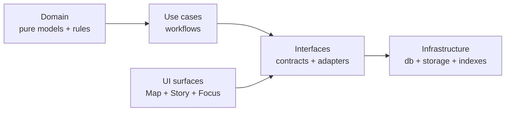

<!-- [KFM_META_BLOCK_V2]
doc_id: kfm://doc/3f0fc2e3-da79-4389-b8c0-9fc3652537db
title: packages/domain README
type: guide
version: v1
status: draft
owners: TBD
created: 2026-02-22
updated: 2026-02-22
policy_label: public
related:
  - kfm://doc/definitive-design-governance-guide@vNext
tags:
  - kfm
  - architecture
  - domain
notes:
  - Domain layer contract + invariants for KFM modules.
  - Update `owners` + `related` once repo doc registry is in place.
[/KFM_META_BLOCK_V2] -->

# packages/domain
Pure, IO-free domain models and invariants for Kansas Frontier Matrix (KFM).

**Status:** Draft • **Owners:** TBD


---

## Quick navigation
- [Purpose](#purpose)
- [Hard rules](#hard-rules)
- [What belongs here](#what-belongs-here)
- [What does not belong here](#what-does-not-belong-here)
- [Core domain vocabulary](#core-domain-vocabulary)
- [Identity, hashing, and time](#identity-hashing-and-time)
- [How other layers use domain](#how-other-layers-use-domain)
- [Directory map](#directory-map)
- [Definition of done for changes](#definition-of-done-for-changes)
- [Appendix](#appendix)

---

## Purpose
`packages/domain` is the **source of truth for KFM’s domain language**: the types, invariants, and rules that must remain stable across pipelines, catalogs, APIs, and UI surfaces.

This package exists so that:
- **Use cases** can orchestrate workflows without re-inventing definitions.
- **Interfaces** can map DTOs/contracts onto stable domain objects.
- **Infrastructure** can store/index without becoming “the model.”

> NOTE  
> This README defines the *contract* of the Domain layer. The actual exported symbols and folder layout must match the code in this repo. If they diverge, update this README as part of the same change.

[⬆ Back to top](#packagesdomain)

---

## Hard rules
These are non-negotiable constraints for anything that lives in `packages/domain`:

1) **No direct infrastructure access**
- No DB calls, file IO, network, env-var reads, clock reads, random UUID generation at runtime.
- Domain code must be deterministic given its inputs.

2) **No dependency on “outer” layers**
- Domain must not import from `packages/interfaces`, `packages/infrastructure`, server apps, UI apps, etc.

3) **Policy- and evidence-aware modeling**
- Domain types must be able to carry *policy labels* and *evidence references* where required, so downstream layers can enforce governance without guessing.

4) **Stable semantics**
- Domain changes are breaking unless proven otherwise, because they cascade into catalogs, APIs, and UI.

> WARNING  
> If you add “helpful shortcuts” that talk to storage or fetch data from services, you have broken the trust membrane and made policy enforcement unenforceable.

[⬆ Back to top](#packagesdomain)

---

## What belongs here
### Confirmed responsibilities
The Domain layer contains **pure domain models** and **rules** (e.g., `Dataset`, `Place`, `Event`, `EvidenceBundle`) and their invariants.  

Typical contents:
- Entities, value objects, and domain events
- Validation and invariants (pure functions)
- Deterministic identity utilities (e.g., `spec_hash` helpers)
- Canonical domain vocabulary and controlled vocab helpers
- Time modeling primitives (event/valid/transaction time)

### Proposed contents
These are common in KFM-style systems, but **verify against current repo code**:
- Minimal error types (domain-level, not HTTP)
- Lightweight parsers/serializers that are pure (e.g., canonical JSON normalization)
- Schema-friendly representations (but not OpenAPI DTOs)

[⬆ Back to top](#packagesdomain)

---

## What does not belong here
- Repository interfaces and adapters (belong in **Interfaces** layer)
- OpenAPI / GraphQL / REST DTOs (Interfaces)
- OPA/Rego execution, policy engine adapters (Interfaces/Infrastructure)
- Database schemas, migrations, PostGIS specifics (Infrastructure)
- Index builder logic (Infrastructure)
- Workflow orchestration (Use cases)
- UI view models or components (UI)

[⬆ Back to top](#packagesdomain)

---

## Architecture map


[⬆ Back to top](#packagesdomain)

---

## Core domain vocabulary
This section is intentionally “terminology-first.” If you create new concepts, add them here.

### Dataset
A **Dataset** is a logical dataset identity (e.g., “NOAA Storm Events”, “USGS NWIS Kansas”).  
It is not a file; it’s the stable conceptual dataset.

Suggested minimum fields (shape must match code):
- `dataset_slug` (stable identifier)
- `title`
- `publisher` or `authority`
- `themes/tags`
- `policy_label_intent` (initial classification intent)

### DatasetVersion
A **DatasetVersion** is an immutable promoted version of a dataset corresponding to a specific output set.

Suggested minimum fields:
- `dataset_version_id` (immutable)
- `dataset_slug`
- `spec_hash`
- `temporal_extent` and `spatial_extent`
- `artifacts[]`
- `policy_label` (assigned)
- `run_receipt_ref` (or digest/id)

### Artifact
An **Artifact** is a concrete output file/object (GeoParquet, PMTiles, COG, JSONL, PDF).  
KFM convention is to treat artifacts as **digest-addressed** for reproducibility.

Suggested minimum fields:
- `artifact_id`
- `digest` (e.g., sha256)
- `media_type`
- `zone` (`raw` | `work` | `processed`)
- `uri/path`

### EvidenceRef and EvidenceBundle
**EvidenceRef** is a stable reference to evidence using explicit schemes (examples: `dcat://`, `stac://`, `prov://`, `doc://`, `graph://`).  
**EvidenceBundle** is the resolved evidence view returned by an evidence resolver (outer layer), including policy decision results.

Domain responsibilities:
- Define the *structures* and *invariants* for `EvidenceRef` and `EvidenceBundle`.
- Do **not** implement network/storage resolution here.

### StoryNode
A **StoryNode** is a versioned narrative bound to map state and dataset versions.

A StoryNode version includes:
- narrative markdown
- citations (`EvidenceRef[]`)
- saved map state (camera, layers, time window, filters)
- policy label and review state

Stories are reproducible when map state + dataset versions are captured.

### PolicyLabel and obligations
A **PolicyLabel** is the primary access-control and sensitivity classification input.  
Policy evaluation returns:
- allow/deny
- obligations (redaction/generalization steps)
- reason codes (audit + UX)

Domain responsibilities:
- Model policy labels, obligations, and reason codes as stable enums/types.
- Provide pure helpers such as “is public-safe?” or “requires generalization?”

### RunReceipt and audit references
A **RunReceipt** (run record) is emitted for every pipeline run and every Focus Mode query, containing:
- inputs (by digest and/or upstream version)
- outputs (artifact digests)
- environment (container image digest, parameters)
- validation results
- policy decisions

Domain responsibilities:
- Define receipt schema shape + invariants (pure validation).
- Provide stable types for `audit_ref` / `run_id`.

[⬆ Back to top](#packagesdomain)

---

## Identity, hashing, and time
### Deterministic identity
Reproducibility depends on stable dataset identity and stable version identity.

Recommended pattern:
- `spec_hash` computed from canonical JSON (JCS / RFC 8785) to prevent “hash drift.”

Domain-level expectations:
- Hashing helpers must be deterministic.
- Any canonicalization rules must be stable and tested.

### Time modeling
KFM can require more than one time axis:
- **event time**: when something happened
- **valid time**: when a statement is considered true (e.g., boundary exists from X to Y)
- **transaction time**: when KFM recorded/published data

Recommended minimum posture:
- Start with **event time + transaction time**
- Add **valid time** where boundary changes/administrative history require it

[⬆ Back to top](#packagesdomain)

---

## How other layers use domain
### Use cases
Use cases should:
- create and validate domain objects
- orchestrate promotion workflows and call policy evaluation (through Interfaces)
- emit domain-defined run receipts

### Interfaces
Interfaces should:
- translate HTTP/GraphQL DTOs into domain objects
- map domain errors into stable API error codes
- call policy engines + evidence resolvers and return domain-defined types

### Infrastructure
Infrastructure should:
- persist artifacts and catalogs that are modeled in domain
- build projections (PostGIS/search/graph/tiles) from promoted artifacts
- never redefine domain semantics

[⬆ Back to top](#packagesdomain)

---

## Directory map
> NOTE  
> This is an *expected* layout. Update to match the actual repo once verified.

```text
packages/domain/
├─ README.md
├─ src/
│  ├─ dataset/           # Dataset, DatasetVersion, Artifact
│  ├─ evidence/          # EvidenceRef, EvidenceBundle, citation structures
│  ├─ story/             # StoryNode + map state binding structures
│  ├─ policy/            # PolicyLabel, obligations, reason codes
│  ├─ time/              # event/valid/transaction time primitives
│  ├─ identity/          # spec_hash + canonicalization helpers
│  └─ index.*            # public exports
└─ test/                 # invariant tests
```

[⬆ Back to top](#packagesdomain)

---

## Definition of done for changes
When you change anything in `packages/domain`, the change is not complete unless:

- [ ] **Semantic impact assessed**
  - [ ] Is this breaking for catalogs / APIs / UI?
  - [ ] Are migrations needed in interfaces/use-cases?

- [ ] **Invariants covered by tests**
  - [ ] new/changed validation rules have unit tests
  - [ ] canonicalization/hashing behavior is tested to prevent drift

- [ ] **Governance compatibility**
  - [ ] policy label handling remains explicit (no implicit defaults that leak data)
  - [ ] obligations are representable (redaction/generalization is not “hand-waved”)

- [ ] **Docs updated**
  - [ ] this README updated if terminology or responsibilities changed
  - [ ] any new vocabulary added to [Core domain vocabulary](#core-domain-vocabulary)

[⬆ Back to top](#packagesdomain)

---

## Appendix
<details>
  <summary>Example domain modeling patterns</summary>

### Value objects over primitives
Prefer strongly-typed IDs and enums to avoid mixing incompatible strings.

```ts
// Example only — adjust to repo language + conventions.
type DatasetSlug = string & { __brand: "DatasetSlug" };
type DatasetVersionId = string & { __brand: "DatasetVersionId" };
```

### Pure validation helpers
Keep validation functions side-effect free and easy to test.

```ts
// Example only — adjust to repo language + conventions.
export function isValidPolicyLabel(label: string): boolean {
  return ["public", "restricted", "restricted_sensitive_location"].includes(label);
}
```

</details>

[⬆ Back to top](#packagesdomain)
