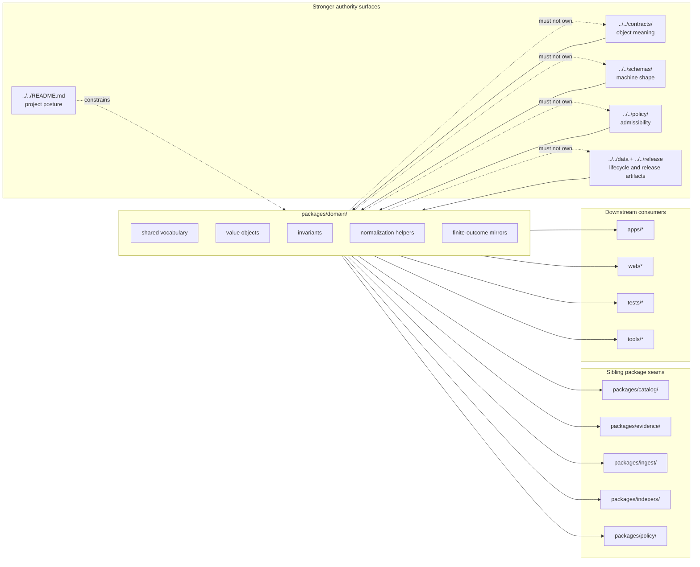

<!-- [KFM_META_BLOCK_V2]
doc_id: kfm://doc/NEEDS_VERIFICATION__packages_domain_readme
title: packages/domain
type: standard
version: v1
status: draft
owners: @bartytime4life (broad /packages/ fallback noted; child-specific ownership NEEDS VERIFICATION)
created: NEEDS_VERIFICATION__YYYY-MM-DD
updated: 2026-04-23
policy_label: NEEDS_VERIFICATION__public_or_internal
related: [../README.md, ../../README.md, ../../.github/CODEOWNERS, ../../contracts/README.md, ../../schemas/README.md, ../../policy/README.md, ../../tests/README.md, ../catalog/README.md, ../evidence/README.md, ../indexers/README.md, ../ingest/README.md, ../policy/README.md]
tags: [kfm, packages, domain, semantic-core, invariants, evidence-first]
notes: [README-like package boundary doc; current rendered public-main evidence shows packages/domain as README-only and semantic-core scoped; created date, final policy label, doc UUID, package-local code, package manifest, tests, exports, and branch-enforced ownership still need active-checkout verification.]
[/KFM_META_BLOCK_V2] -->

<a id="top"></a>

# `packages/domain`

Stable semantic core for KFM’s shared domain vocabulary, invariants, value objects, and cross-package meaning.

> [!IMPORTANT]
> **Status:** `experimental`  
> **Doc state:** `draft`  
> **Owners:** `@bartytime4life` *(broad `/packages/` fallback noted; child-specific ownership still NEEDS VERIFICATION)*  
> **Path:** `packages/domain/README.md`  
> **Authority class:** implementation-facing semantic package boundary; not doctrine, not policy law, not canonical schema authority, not lifecycle storage, and not release evidence  
> **Quick jumps:** [Scope](#scope) · [Repo fit](#repo-fit) · [Accepted inputs](#accepted-inputs) · [Exclusions](#exclusions) · [Current evidence snapshot](#current-evidence-snapshot) · [Directory tree](#directory-tree) · [Quickstart](#quickstart) · [Usage](#usage) · [Diagram](#diagram) · [Semantic fit table](#semantic-fit-table) · [Task list / definition of done](#task-list--definition-of-done) · [FAQ](#faq) · [Appendix](#appendix)


> [!WARNING]
> `packages/domain/` must not become a quiet side door around the KFM trust membrane. It may provide reusable semantic meaning to packages, apps, tests, and validators, but it must not own IO, transport, persistence, policy authority, schema authority, release records, model traffic, or public truth.

---

## Scope

`packages/domain/` is the reusable internal seam for **pure KFM meaning**.

It should hold semantic building blocks that are useful across more than one package or app surface: operating-lane vocabulary, subject and claim semantics, time/support/precision concepts, scoped identifiers, trust-state language, and side-effect-free invariant helpers.

A healthy domain package helps KFM prevent vocabulary drift as code spreads outward into catalog closure, evidence resolution, ingest helpers, indexers, policy adapters, governed APIs, MapLibre-facing surfaces, and tests.

### Truth posture used here

| Label | Meaning in this README |
|---|---|
| `CONFIRMED` | Supported by current repo-visible paths, rendered package documentation, broad ownership comments, or adjacent README surfaces inspected for this revision. |
| `INFERRED` | Strongly implied by KFM doctrine and package-boundary logic, but not proven as executable implementation in this package. |
| `PROPOSED` | Recommended hardening direction consistent with KFM doctrine and surrounding repo docs. |
| `UNKNOWN` | Not verified from the visible package subtree, mounted checkout, tests, manifests, exports, import graph, or runtime behavior. |
| `NEEDS VERIFICATION` | Concrete active-branch or platform evidence is required before a stronger claim is safe. |

[Back to top](#top)

---

## Repo fit

`packages/domain/` is a child package boundary beneath [`../README.md`](../README.md). It is implementation-facing, but it must stay downstream of stronger authority surfaces.

| Relationship | Path | Role for `packages/domain/` | Current posture |
|---|---|---|---|
| Root orientation | [`../../README.md`](../../README.md) | Project identity, evidence-first posture, lifecycle guardrails, and trust membrane. | `CONFIRMED` public path |
| Parent package contract | [`../README.md`](../README.md) | Decides what belongs under `packages/` at all. | `CONFIRMED` adjacent surface |
| Ownership routing | [`../../.github/CODEOWNERS`](../../.github/CODEOWNERS) | Broad owner fallback and future review routing. | `CONFIRMED` broad fallback note; enforcement `NEEDS VERIFICATION` |
| Contract meaning | [`../../contracts/README.md`](../../contracts/README.md) | Object meaning, field intent, lifecycle semantics, and compatibility posture. | `CONFIRMED` adjacent surface |
| Machine shape | [`../../schemas/README.md`](../../schemas/README.md) | JSON Schema and machine-checkable validation boundary. | `CONFIRMED` adjacent surface; schema-home still `NEEDS VERIFICATION` |
| Policy law | [`../../policy/README.md`](../../policy/README.md) | Rights, sensitivity, obligations, denial logic, release admissibility, and runtime trust decisions. | `CONFIRMED` adjacent surface |
| Verification | [`../../tests/README.md`](../../tests/README.md) | Deterministic fixtures, negative paths, runtime/release/correction drills. | `CONFIRMED` adjacent surface |
| Catalog sibling | [`../catalog/README.md`](../catalog/README.md) | Catalog-closure helpers and linked metadata checks. | sibling seam |
| Evidence sibling | [`../evidence/README.md`](../evidence/README.md) | `EvidenceRef` → `EvidenceBundle` resolution and evidence-safe packaging. | sibling seam |
| Indexer sibling | [`../indexers/README.md`](../indexers/README.md) | Rebuildable search, tile, graph, vector, or runtime projections. | sibling seam |
| Ingest sibling | [`../ingest/README.md`](../ingest/README.md) | Source-edge intake, normalization, validation, and receipt helpers. | sibling seam |
| Policy helper sibling | [`../policy/README.md`](../policy/README.md) | Shared policy adapters, not policy authority. | sibling seam |
| Downstream apps | [`../../apps/`](../../apps/) | Governed services and APIs that may consume domain semantics. | imports `UNKNOWN` |
| Presentation | [`../../web/`](../../web/) | Browser-delivered surfaces downstream of governed APIs and trust payloads. | imports `UNKNOWN` |

### Placement rule

Put code here only when it is:

1. semantic rather than transport-, storage-, workflow-, or UI-shaped;
2. reusable across more than one seam;
3. side-effect-free by default;
4. subordinate to stronger contract, schema, policy, data, review, and release authority;
5. backed by tests or fixtures once implementation code exists.

[Back to top](#top)

---

## Accepted inputs

The rule of thumb is simple: **pure meaning belongs here; side effects do not.**

| Accepted input | What belongs here | Why it belongs here | Must stay linked to |
|---|---|---|---|
| Shared vocabulary | Kansas lane names, subject kinds, trust-state names, semantic status names. | Avoids string drift across packages and apps. | `contracts/`, `docs/`, tests |
| Value objects | Time windows, support descriptors, precision/uncertainty wrappers, scoped identifiers. | Keeps meaning explicit and type-safe. | `contracts/`, `schemas/` |
| Invariant helpers | Checks that run without network, disk, database, queue, or runtime state. | Preserves correctness without coupling. | tests / fixtures |
| Normalization helpers | Canonicalization for shared internal concepts, not source-edge fetch logic. | Centralizes meaning before it reaches sibling packages. | `ingest/`, `policy/`, source registry |
| Code-facing mirrors | Internal types that mirror stronger contract/schema/policy concepts without replacing them. | Helps implementation align with top-level authority. | `contracts/`, `schemas/`, `policy/` |
| Package-local tests | Edge cases, negative-path fixtures, invariant tests, semantic smoke tests. | Proves the semantic boundary behaves as documented. | `tests/`, package-local test lane |

### Typical examples that fit

- Kansas operating-lane vocabulary reused by catalog, evidence, ingest, and app code.
- Time/support/precision value objects used by more than one package.
- Inspectable-claim subject semantics that do not require evidence resolution.
- Shared trust-state names when they remain semantic labels, not policy decisions.
- Finite outcome vocabulary names when they are code-facing mirrors, not runtime orchestration.
- Invariants that reject incompatible combinations before a package reaches a validator or policy gate.

[Back to top](#top)

---

## Exclusions

`packages/domain/` is not a catch-all. When in doubt, keep authority visible at the surface that owns the meaning.

| Does not belong here | Use instead | Why |
|---|---|---|
| HTTP handlers, route controllers, API middleware, request/response plumbing | [`../../apps/`](../../apps/) or API contract lanes | Transport belongs at app edges and governed APIs. |
| Direct database access, ORM models, SQL, migrations | persistence/runtime/data seam | Persistence is an outer concern, not semantic core. |
| Filesystem writes, artifact emission, background jobs, queues, schedulers | app, worker, pipeline, or tool lane | Deployable side effects do not belong in a pure package. |
| Canonical JSON Schemas, OpenAPI files, standards profiles | [`../../contracts/`](../../contracts/) and [`../../schemas/`](../../schemas/) | Prevents parallel contract universes. |
| Policy bundles, reason-code authority, obligation registries, decision engines | [`../../policy/`](../../policy/) | Policy authority must remain explicit and reviewable. |
| Source descriptors, ingest receipts, validation reports, release manifests, correction notices as authoritative artifacts | data lifecycle, contracts, schemas, policy, release lanes | Domain code may model concepts; it must not become their sovereign home. |
| Evidence resolution logic or `EvidenceBundle` assembly | [`../evidence/`](../evidence/) | Evidence packaging is a sibling responsibility. |
| Index build logic, embeddings, graph projections, PMTiles, search pipelines | [`../indexers/`](../indexers/) | Derived retrieval layers stay rebuildable and separate. |
| Connector code, web scraping, provider SDKs, external API fetches | [`../ingest/`](../ingest/) or [`../../pipelines/`](../../pipelines/) | Source-edge behavior is not semantic core. |
| Direct model runtime calls or prompt orchestration | governed API + runtime envelope + policy/citation checks | AI remains interpretive and evidence-subordinate. |

> [!TIP]
> A strong package-fit test: a `packages/domain/` module should still make sense inside an isolated unit-test process with no network, no database, no filesystem writes, and no deployment configuration.

[Back to top](#top)

---

## Current evidence snapshot

| Concern | Current signal | Status |
|---|---|---|
| `packages/domain/` path | public repo path resolves | `CONFIRMED` |
| `README.md` | current package boundary document is visible | `CONFIRMED` |
| Package content depth | visible package subtree presents this as README-only / boundary-first | `CONFIRMED` from rendered repo view; active checkout should reverify |
| Package role | parent package README assigns `domain/` stable semantic vocabulary and invariants | `CONFIRMED` adjacent contract |
| Broad ownership | repo-facing CODEOWNERS comments note `@bartytime4life` broad fallback across `packages/` | `CONFIRMED` note; enforcement `NEEDS VERIFICATION` |
| Child-specific owner | no narrower owner confirmed in this revision | `NEEDS VERIFICATION` |
| Package-local source files | not proven | `UNKNOWN` |
| Package manifest | not proven | `UNKNOWN` |
| Package-local tests / fixtures | not proven | `UNKNOWN` |
| Downstream imports | not proven | `UNKNOWN` |
| Runtime behavior | not proven | `UNKNOWN` |

> [!NOTE]
> This README is intentionally boundary-first. It may be correct for a directory to be README-first while its package contract is being clarified, as long as the document does not imply code, tests, exports, or runtime adoption that have not been directly verified.

[Back to top](#top)

---

## Directory tree

### Current repo-visible tree

```text
packages/
└── domain/
    └── README.md
```

### Doctrine-aligned growth shape

`PROPOSED`, not current implementation evidence:

```text
packages/domain/
├── README.md
├── package manifest              # package.json / pyproject.toml / go.mod / Cargo.toml as repo convention requires
├── src/
│   ├── lanes/                    # shared Kansas lane vocabulary
│   ├── ids/                      # scoped identifiers and refs
│   ├── time/                     # time windows, support periods, comparison basis
│   ├── support/                  # support/precision/uncertainty value objects
│   ├── trust/                    # trust-state labels and finite-outcome mirrors
│   ├── invariants/               # pure semantic checks
│   └── index.*                   # explicit package exports
├── tests/
│   ├── invariants/
│   ├── fixtures/
│   └── smoke/
└── docs/
    └── package-notes.md          # optional package-local implementation notes
```

> [!CAUTION]
> Do not add a manifest, `src/`, or tests just to make the tree look mature. Add them only when the active branch has real package-local code that needs a stable semantic home.

[Back to top](#top)

---

## Quickstart

Use read-only inspection before making stronger package claims.

```bash
# Confirm repository state.
git status --short
git branch --show-current
git rev-parse --show-toplevel

# Inventory this package.
find packages/domain -maxdepth 4 -type f | sort
find packages/domain -maxdepth 4 \
  \( -name package.json -o -name tsconfig.json -o -name pyproject.toml -o -name Cargo.toml -o -name go.mod -o -name Makefile \) \
  | sort

# Read the local and adjacent boundary docs.
sed -n '1,240p' packages/domain/README.md
sed -n '1,260p' packages/README.md
sed -n '1,220p' contracts/README.md
sed -n '1,220p' schemas/README.md
sed -n '1,220p' policy/README.md
sed -n '1,220p' tests/README.md
sed -n '1,160p' .github/CODEOWNERS

# Search for trust-surface vocabulary without assuming implementation maturity.
grep -RInE \
  'EvidenceRef|EvidenceBundle|DecisionEnvelope|RuntimeResponseEnvelope|SourceDescriptor|ReleaseManifest|CatalogMatrix|run_receipt|ai_receipt|spec_hash|ABSTAIN|DENY|ERROR|ANSWER|semantic core|invariant|support semantics|trust membrane' \
  packages contracts schemas policy data tests tools apps pipelines docs 2>/dev/null || true
```

> [!WARNING]
> These commands prove only what they inspect in the active checkout. They do not prove package publication, package-manager selection, build success, import graphs, CI enforcement, downstream runtime adoption, branch protection, or deployment posture.

[Back to top](#top)

---

## Usage

### Use this package when

- the concept is reused across more than one package, validator, app, or runtime seam;
- the concept is semantic, not transport- or persistence-shaped;
- the implementation can stay pure and testable in isolation;
- shared meaning would otherwise be duplicated across `catalog`, `evidence`, `ingest`, `indexers`, policy adapters, or apps;
- the stronger contract/schema/policy authority already exists, or is being added in the same governed change.

### Do not use this package when

- the code needs direct HTTP, DB, queue, filesystem, container, or deployment state;
- the concept is really a JSON Schema, OpenAPI contract, policy bundle, source descriptor, or release artifact;
- the code is a one-off helper for only one route, workflow, or pipeline;
- the package would become a dumping ground for “shared DTOs”;
- the change would make `packages/domain/` the quiet owner of a more important trust surface.

### Boundary rules

1. **Meaning first.** Keep the package centered on semantic meaning, not implementation convenience.
2. **Pure by default.** No hidden side effects.
3. **Mirror, do not replace.** Top-level contracts, schemas, policy bundles, and canonical artifacts remain stronger than code-level mirrors.
4. **Reuse must be real.** Add a shared type or invariant because multiple seams need it, not because “it might be useful later.”
5. **Kansas stays explicit.** If an object depends on Kansas lane logic, publication burden, time basis, sensitivity, or support semantics, say so plainly.
6. **Negative states are real states.** Do not collapse unsupported, stale, restricted, generalized, embargoed, or unresolved states into booleans.
7. **Docs move with behavior.** If this package hardens, this README and adjacent tests must harden with it.

[Back to top](#top)

---

## Diagram


```mermaid
flowchart LR
    subgraph Authority["Stronger authority surfaces"]
        ROOT["../../README.md<br/>project posture"]
        C["../../contracts/<br/>object meaning"]
        S["../../schemas/<br/>machine shape"]
        P["../../policy/<br/>admissibility"]
        D["../../data + ../../release<br/>lifecycle and release artifacts"]
    end

    subgraph Domain["packages/domain/"]
        V["shared vocabulary"]
        T["value objects"]
        I["invariants"]
        N["normalization helpers"]
        O["finite-outcome mirrors"]
    end

    subgraph Siblings["Sibling package seams"]
        CAT["packages/catalog/"]
        E["packages/evidence/"]
        ING["packages/ingest/"]
        IDX["packages/indexers/"]
        POL["packages/policy/"]
    end

    subgraph Consumers["Downstream consumers"]
        A["apps/*"]
        W["web/*"]
        X["tests/*"]
        TOOLS["tools/*"]
    end

    ROOT -. constrains .-> Domain
    C --> Domain
    S --> Domain
    P --> Domain
    D --> Domain

    Domain --> CAT
    Domain --> E
    Domain --> ING
    Domain --> IDX
    Domain --> POL
    Domain --> A
    Domain --> W
    Domain --> X
    Domain --> TOOLS

    Domain -. must not own .-> C
    Domain -. must not own .-> S
    Domain -. must not own .-> P
    Domain -. must not own .-> D
```

The direction matters: stronger authority surfaces flow into `packages/domain/`, then code-facing semantic meaning flows outward. The package should not invert that direction by becoming the sovereign home of policy, schemas, contracts, data artifacts, or release truth.

[Back to top](#top)

---

## Semantic fit table

The examples below are `PROPOSED` starter families. They describe what would fit once package-local code exists; they do not claim current exports.

| Semantic concern | Fits here? | What “good” looks like | Stronger authority to check first |
|---|---:|---|---|
| Kansas operating-lane vocabulary | Yes | Stable shared names and semantic groupings, not source inventories. | docs/domain docs, source registry |
| Scoped identifiers / refs | Yes | Pure value wrappers, stable comparison, no storage calls. | contracts, schemas |
| Time/support/precision concepts | Yes | Pure value objects and comparison helpers with explicit uncertainty. | contracts, GIS/domain docs |
| Inspectable-claim subject semantics | Yes | Code-facing meaning used by more than one seam, not evidence assembly. | contracts, evidence docs |
| Release / surface / trust-state vocabulary | Usually | Shared semantic enums or unions; no release decision logic. | policy, release contracts |
| Finite runtime outcome vocabulary | Usually | Names such as `ANSWER`, `ABSTAIN`, `DENY`, `ERROR` mirrored for type safety; no runtime orchestration. | RuntimeResponseEnvelope contract |
| Source role labels | Carefully | Shared labels only; no source activation, rights decision, or source registry authority. | data registry, policy |
| Policy reasons / obligations | No | At most typed mirrors imported from stronger policy authority. | policy |
| EvidenceBundle assembly | No | Domain types may support refs; assembly belongs to `packages/evidence/`. | evidence package, contracts |
| JSON Schema documents | No | Top-level schema authority stays outside this package. | schemas / contracts ADR |
| HTTP DTOs or route payloads | No | Transport belongs to apps/API contracts, not semantic core. | apps, OpenAPI contracts |
| Database-backed repositories or ORM models | No | Persistence is an outer adapter concern. | data/runtime seam |

[Back to top](#top)

---

## Task list / definition of done

A change touching `packages/domain/` is not done until these are true:

- [ ] The active branch was re-inspected and this README still matches the visible tree.
- [ ] The package role still matches the parent [`../README.md`](../README.md) contract.
- [ ] Any package-local manifests, `src/`, exports, tests, or fixtures now present are documented here.
- [ ] No hidden HTTP, DB, queue, filesystem, model-runtime, or deployment side effects were introduced.
- [ ] No stronger authority surface was silently duplicated inside this package.
- [ ] New invariants or semantic helpers have package-local or repo-level tests.
- [ ] New shared vocabulary is reused by more than one seam or has a written justification.
- [ ] Owner and review-routing claims are rechecked against [`../../.github/CODEOWNERS`](../../.github/CODEOWNERS).
- [ ] Links to contracts, schemas, policy, tests, and sibling packages are still valid from this file location.
- [ ] Unknowns remain visible instead of being polished into false certainty.
- [ ] Downstream import changes include migration notes and a rollback path.

> [!IMPORTANT]
> “Shared” is not enough by itself. In KFM, a module belongs in `packages/domain/` because it preserves meaning across governed boundaries, not because it is convenient to import from more than one place.

[Back to top](#top)

---

## FAQ

### Why is this separate from `contracts/` and `schemas/`?

Because contracts and schemas are stronger authority surfaces. `packages/domain/` is where code-facing semantic meaning can live after stronger meaning and shape are clear enough to mirror safely.

### Can ORM entities or persistence models live here?

Not by default. If a type is shaped by table layout, adapter behavior, SQL, migration constraints, or runtime persistence, it belongs outside the semantic core.

### Can this package call external services?

No, not as its normal job. A pure semantic package that suddenly needs network access is usually signaling boundary drift.

### Does this package own Kansas source descriptors or release artifacts?

No. It may expose shared semantic types that help other seams reason about them, but authoritative descriptors, receipts, proofs, manifests, catalog records, release objects, and correction records remain elsewhere.

### Does this README prove `packages/domain/` is fully implemented?

No. It records the boundary and the current visible posture. Deeper implementation remains `UNKNOWN` until direct checkout, file inventory, tests, manifests, exports, import graph, and runtime evidence prove it.

[Back to top](#top)

---

## Appendix

<details>
<summary>Appendix A — Current repo-visible package context</summary>

```text
packages/
├── README.md
├── catalog/
│   └── README.md
├── domain/
│   └── README.md
├── evidence/
│   └── README.md
├── genealogy_ingest/
│   └── README.md
├── indexers/
│   └── README.md
├── ingest/
│   └── README.md
└── policy/
    └── README.md
```

The current package family should be read as a set of boundary documents until active-branch inspection proves package-local code, manifests, tests, exports, and downstream imports.

</details>

<details>
<summary>Appendix B — PROPOSED starter hardening order</summary>

1. Keep this README aligned with the parent package contract.
2. Add package-local code only for the smallest reusable semantic surface.
3. Add tests before widening imports.
4. Add a package manifest only when real package-local code requires one.
5. Connect new code-facing mirrors back to contracts, schemas, and policy references.
6. Update sibling README references if the package starts owning new shared meaning.
7. Preserve rollback notes until the shape proves durable.

</details>

<details>
<summary>Appendix C — Reviewer prompts</summary>

Use these during PR review:

- Is the new code semantic and pure?
- Could `contracts/`, `schemas/`, `policy/`, `data/`, `release/`, or a sibling package own this more honestly?
- Does the change reduce drift across at least two seams?
- Does it keep Kansas lane logic, time semantics, support/precision, and trust-state meaning explicit?
- Would deleting the module force multiple packages to re-invent the same semantic rule?
- Did the PR add tests and README updates in the same change?
- Does the change preserve cite-or-abstain, deny-by-default, and governed lifecycle posture?

</details>

[Back to top](#top)
