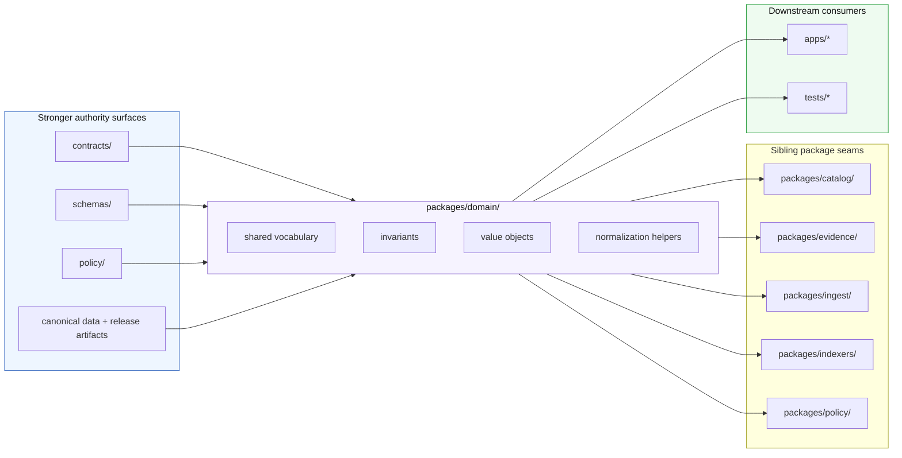

<!-- [KFM_META_BLOCK_V2]
doc_id: kfm://doc/<NEEDS_VERIFICATION-uuid>
title: domain
type: standard
version: v1
status: review
owners: @bartytime4life
created: <YYYY-MM-DD NEEDS VERIFICATION>
updated: 2026-04-04
policy_label: public
related: [../README.md, ../../README.md, ../../.github/CODEOWNERS, ../../contracts/README.md, ../../schemas/README.md, ../../policy/README.md, ../../tests/README.md]
tags: [kfm, domain, package]
notes: [current public main confirms a README-only package surface here; broad /packages/ ownership is confirmed in CODEOWNERS; doc UUID and original created date still need verification]
[/KFM_META_BLOCK_V2] -->

# domain

_Stable semantic core for KFM’s shared domain vocabulary, invariants, and cross-package meaning._

> **Status:** `experimental`  
> **Owners:** `@bartytime4life` _(fallback via [`../../.github/CODEOWNERS`](../../.github/CODEOWNERS); child-specific ownership still needs verification)_  
>        
> **Path:** `packages/domain/README.md`  
> **Repo fit:** child of [`../README.md`](../README.md); rooted in [`../../README.md`](../../README.md); adjacent to [`../../contracts/README.md`](../../contracts/README.md), [`../../schemas/README.md`](../../schemas/README.md), [`../../policy/README.md`](../../policy/README.md), [`../../tests/README.md`](../../tests/README.md), and sibling package seams under [`../catalog/`](../catalog/), [`../evidence/`](../evidence/), [`../indexers/`](../indexers/), [`../ingest/`](../ingest/), and [`../policy/`](../policy/)  
> **Quick jump:** [Scope](#scope) · [Repo fit](#repo-fit) · [Accepted inputs](#accepted-inputs) · [Exclusions](#exclusions) · [Directory tree](#directory-tree) · [Quickstart](#quickstart) · [Usage](#usage) · [Diagram](#diagram) · [Semantic fit table](#semantic-fit-table) · [Definition of done](#definition-of-done) · [FAQ](#faq) · [Appendix](#appendix)

> [!IMPORTANT]
> Current repo-visible state should be read conservatively: this package path is present, but current public `main` proves only a README surface here. This file therefore does two jobs at once:
> 1. records the package boundary truthfully, and
> 2. defines the package contract the directory should satisfy as implementation hardens.

> [!NOTE]
> In KFM, package boundaries are governed seams, not convenience folders. `packages/domain/` should stay pure, reusable, and subordinate to stronger top-level authority surfaces such as `contracts/`, `schemas/`, `policy/`, and canonical data artifacts.

## Scope

`packages/domain/` is the shared internal seam for **stable domain vocabulary, invariants, and semantic core**.

That means this package is where KFM should keep reusable, side-effect-free meaning that must stay consistent across more than one package or app surface: Kansas lane vocabulary, claim and subject semantics, time/support/precision concepts, release/trust-state language, and invariant helpers that stop meaning from drifting as code spreads outward.

This is **not** the place for deployable side effects, HTTP transport, filesystem work, database access, policy enforcement bundles, canonical JSON Schemas, or sovereign truth artifacts.

### Truth posture used in this README

| Label | Meaning here |
|---|---|
| **CONFIRMED** | Directly supported by current repo-visible evidence or surrounding documented package contracts |
| **INFERRED** | Strongly implied by repo doctrine and package boundary logic, but not proven as mounted implementation in this package |
| **PROPOSED** | Recommended starter direction for hardening this package |
| **UNKNOWN** | Not verified from the currently visible package subtree |
| **NEEDS VERIFICATION** | Reviewer should confirm before merge or before relying operationally |

[Back to top](#domain)

## Repo fit

The parent package contract on current public `main` already assigns `./domain/` a narrow and useful job: **stable domain vocabulary, invariants, and semantic core**. That role is the anchor for this README.

### Current repo-visible snapshot

| Concern | Current signal | Status |
|---|---|---|
| `packages/domain/` exists | current public `main` path resolves | **CONFIRMED** |
| `README.md` exists | current file is present | **CONFIRMED** |
| current package content depth | public `main` currently presents a README-only package surface here | **CONFIRMED** |
| broad ownership fallback | inherited from `/packages/` in [`../../.github/CODEOWNERS`](../../.github/CODEOWNERS) | **CONFIRMED** |
| broader package-family context | the wider `packages/` lane now visibly includes additional sibling surface beyond the original README-first cluster, but this path remains README-only | **CONFIRMED** |
| package-local code, manifests, tests, exports | not proven from the visible package subtree used for this draft | **UNKNOWN** |
| narrower child ownership | not separately confirmed | **NEEDS VERIFICATION** |

> [!NOTE]
> The broader `packages/` lane is no longer perfectly uniform. That makes `packages/domain/`’s narrow, pure boundary more—not less—important: it should stay the semantic-core seam, not drift toward an ingest starter or runtime convenience layer.

### Upstream and downstream relationship map

**Upstream authority**
- [`../../README.md`](../../README.md) — repo identity, governed truth posture, trust boundary
- [`../README.md`](../README.md) — package-boundary law for everything under `packages/`
- [`../../contracts/README.md`](../../contracts/README.md) — contract families and machine-readable shapes
- [`../../schemas/README.md`](../../schemas/README.md) — schema organization and validation boundary
- [`../../policy/README.md`](../../policy/README.md) — deny-by-default policy intent and decision grammar
- [`../../tests/README.md`](../../tests/README.md) — verification posture and package-level proof expectations

**Sibling seams**
- [`../catalog/`](../catalog/) — catalog and closure-facing work
- [`../evidence/`](../evidence/) — evidence resolution and support packaging
- [`../indexers/`](../indexers/) — rebuildable indexing and retrieval acceleration
- [`../ingest/`](../ingest/) — source-edge intake and connector logic
- [`../policy/`](../policy/) — shared internal policy support code, if and when mounted

**Downstream consumers**
- governed apps and services under [`../../apps/`](../../apps/)
- package-local or repo-level verification under [`../../tests/`](../../tests/)
- any runtime surface that must reuse stable semantic meaning without re-deriving it ad hoc

> [!WARNING]
> `packages/domain/` should not become a hidden side door around the trust membrane. If a change here quietly adds IO, transport coupling, schema authority, or policy authority, the boundary has drifted.

[Back to top](#domain)

## Accepted inputs

The rule of thumb is simple: **pure meaning belongs here; side effects do not.**

| Accepted input class | What belongs here | Why it belongs here |
|---|---|---|
| Shared semantic vocabulary | stable lane names, subject kinds, semantic status names, reusable value vocabularies | avoids string drift across packages |
| Domain value objects | time windows, support descriptors, precision/uncertainty wrappers, identifiers, scoped references | keeps meaning explicit and type-safe |
| Invariants | semantic checks that can run without network, disk, or DB access | preserves correctness without coupling |
| Domain normalization helpers | parsing and canonicalization for shared internal concepts | centralizes meaning instead of duplicating it |
| Code-facing mirrors of stronger authority | internal types that mirror contract/schema/policy concepts without replacing them | keeps implementation aligned with stronger top-level truth |
| Package-local tests and fixtures | invariant tests, edge-case fixtures, negative-path samples | proves the semantic boundary behaves as intended |

### Typical examples that fit

- Kansas operating-lane vocabulary used across multiple packages
- release/trust-state enums used by more than one runtime surface
- value objects for time support, comparison basis, or bounded scope
- invariant helpers that reject incompatible support/time combinations
- code-facing semantic wrappers used by `catalog`, `evidence`, `ingest`, and app surfaces

## Exclusions

| Does **not** belong here | Put it here instead | Why |
|---|---|---|
| HTTP handlers, route controllers, request/response DTO plumbing | `../../apps/` | transport belongs at app edges |
| Direct database access, ORM models, SQL, migrations | app/data/runtime seam | persistence is an outer concern |
| Filesystem access, artifact writes, background jobs | app/worker/runtime seam | deployable side effects do not belong in semantic core |
| Canonical JSON Schemas, OpenAPI files, standards profiles | `../../contracts/`, `../../schemas/` | those are stronger authority surfaces |
| Policy bundles, reasons/obligations registries, decision engines | `../../policy/` (or confirmed policy runtime seam) | policy authority must stay explicit |
| Source descriptors, ingest receipts, release manifests, correction notices as authoritative artifacts | canonical data / contracts / policy surfaces | domain code may model these, but should not become their sovereign home |
| Evidence resolution logic and bundle assembly | `../evidence/` | evidence packaging is a sibling responsibility |
| Index build logic, embedding pipelines, search graphs | `../indexers/` | derived retrieval layers stay rebuildable and separate |
| Connector code and external API fetches | `../ingest/` | source-edge behavior is not semantic core |

> [!TIP]
> A good test for package fit: if a module still makes sense when copied into an isolated unit-test process with **no** network, **no** database, and **no** filesystem, it is a strong candidate for `packages/domain/`.

[Back to top](#domain)

## Directory tree

### Current repo-visible tree

```text
packages/
└── domain/
    └── README.md
```

### What that means right now

The package boundary is documented before package-local code is proven here. That is acceptable in this repo, provided the README stays honest about current visibility and does not imply mounted implementation that has not been verified.

## Quickstart

Use this checklist before changing the boundary:

```bash
git rev-parse --show-toplevel 2>/dev/null || pwd

find packages/domain -maxdepth 4 -type f | sort

sed -n '1,220p' packages/domain/README.md
sed -n '1,260p' packages/README.md
sed -n '1,220p' contracts/README.md
sed -n '1,220p' schemas/README.md
sed -n '1,220p' policy/README.md
sed -n '1,220p' tests/README.md
sed -n '1,120p' .github/CODEOWNERS

grep -RIn "domain\|semantic core\|invariant\|lane\|support semantics\|release state" \
  packages contracts schemas policy apps tests docs 2>/dev/null | sed -n '1,200p'

find packages/domain -maxdepth 4 \
  \( -name package.json -o -name tsconfig.json -o -name pyproject.toml -o -name Cargo.toml -o -name go.mod \) \
  | sort
```

### Review sequence

1. Reconfirm the live tree under `packages/domain/`.
2. Reconfirm the parent package contract in [`../README.md`](../README.md).
3. Check whether any stronger top-level source now owns a concept you planned to add here.
4. Add or revise only the pure semantic pieces that are reused across boundaries.
5. Update tests and this README in the same change.

[Back to top](#domain)

## Usage

### Use this package when

- the concept is reused across more than one package or app surface
- the concept is semantic, not transport- or persistence-shaped
- the code can remain pure and testable in isolation
- the package will reduce vocabulary drift or duplicated invariant logic
- the stronger contract/schema/policy authority already exists, or is being added in the same governed change

### Do not use this package when

- the code needs direct access to HTTP, DB, queue, filesystem, or container/runtime state
- the concept is really a JSON Schema, standards profile, or policy bundle
- the code is a one-off helper for only one app route
- the package would become a dumping ground for “shared” DTOs
- the change would make `packages/domain/` the quiet owner of a more important truth surface

### Boundary rules

1. **Meaning first.** Keep the package centered on semantic truth, not implementation convenience.
2. **Pure by default.** No hidden side effects.
3. **Mirror, do not replace.** Top-level contracts, schemas, policy bundles, and canonical artifacts remain stronger than code-level mirrors.
4. **Reuse must be real.** Add a shared type or invariant because multiple seams need it, not because “it might be useful later.”
5. **Keep Kansas explicit.** If a semantic object depends on Kansas lane logic, publication burden, or support/time semantics, say so plainly.
6. **Update docs with behavior.** If this package hardens, the README must harden with it.

## Diagram


```mermaid
flowchart LR
    subgraph Authority["Stronger authority surfaces"]
        C["contracts/"]
        S["schemas/"]
        P["policy/"]
        D["canonical data + release artifacts"]
    end

    subgraph Domain["packages/domain/"]
        V["shared vocabulary"]
        I["invariants"]
        T["value objects"]
        N["normalization helpers"]
    end

    subgraph Siblings["Sibling package seams"]
        CAT["packages/catalog/"]
        E["packages/evidence/"]
        ING["packages/ingest/"]
        IDX["packages/indexers/"]
        POL["packages/policy/"]
    end

    subgraph Consumers["Downstream consumers"]
        A["apps/*"]
        X["tests/*"]
    end

    C --> Domain
    S --> Domain
    P --> Domain
    D --> Domain

    Domain --> CAT
    Domain --> E
    Domain --> ING
    Domain --> IDX
    Domain --> POL
    Domain --> A
    Domain --> X

    classDef strong fill:#eef6ff,stroke:#4472c4,color:#111;
    classDef seam fill:#f6f3ff,stroke:#6f42c1,color:#111;
    classDef consumer fill:#eefbf0,stroke:#2ea043,color:#111;

    class Authority strong;
    class Domain seam;
    class Consumers consumer;
```

### Reading the diagram

- Stronger top-level authority surfaces flow **into** `packages/domain/`.
- `packages/domain/` then exposes reusable semantics **outward** to sibling packages and apps.
- The package should not invert that direction by becoming the sovereign home of policy, schemas, or data artifacts.

[Back to top](#domain)

## Semantic fit table

The rows below are **PROPOSED examples** of the kinds of semantic families that fit this package well once code is mounted here.

| Semantic concern | Fits here? | What “good” looks like |
|---|---|---|
| Kansas operating-lane vocabulary | **Yes** | stable shared names and semantic groupings, not source inventories |
| Time/support/precision concepts | **Yes** | pure value objects and comparison helpers |
| Inspectable claim / subject semantics | **Yes** | code-facing meaning used by more than one seam |
| Release / surface / trust-state vocabulary | **Usually yes** | shared semantic enums or unions, not policy decision logic |
| Finite runtime outcome vocabulary | **Usually yes** | shared outcome names, not runtime orchestration |
| Policy reasons / obligations registries | **No** | authoritative policy source stays outside this package |
| JSON Schema documents | **No** | top-level schema authority stays outside this package |
| HTTP DTOs or route payload shapes | **No** | app transport boundary, not semantic core |
| Database-backed repositories or models | **No** | outer persistence layer, not pure domain seam |

## Definition of done

A change touching `packages/domain/` is not done until the following are satisfied:

- [ ] The live branch was re-inspected and this README still matches the visible tree.
- [ ] The package role still matches the parent package contract in [`../README.md`](../README.md).
- [ ] Any package-local manifests or source directories now present are documented here.
- [ ] No hidden HTTP, DB, queue, filesystem, or runtime side effects were introduced.
- [ ] No stronger authority surface was silently duplicated inside this package.
- [ ] Invariants or semantic helpers added here have package-local tests.
- [ ] Any new shared vocabulary is reused by more than one seam or has a written justification.
- [ ] Owner/fallback information is still accurate against [`.github/CODEOWNERS`](../../.github/CODEOWNERS).
- [ ] Unknowns remain visible instead of being polished into false certainty.

> [!IMPORTANT]
> “Shared” is not enough by itself. In KFM, a module belongs in `packages/domain/` because it preserves meaning across governed boundaries, not because it was convenient to import from more than one place.

[Back to top](#domain)

## FAQ

### Why is this separate from `contracts/` and `schemas/`?

Because those top-level surfaces remain the stronger machine-readable authority. `packages/domain/` is where code-facing semantic meaning can live **after** those stronger surfaces exist, not where their authority is recreated.

### Can ORM entities or persistence models live here?

Not as the normal rule. If a type is shaped by a database, table layout, or adapter concern, it belongs outside the semantic core.

### Can this package call external services?

It should not as its default job. A pure semantic package that suddenly needs network access is usually signaling boundary drift.

### Does this package own Kansas source descriptors or release artifacts?

No. It may expose shared semantic types that help other seams reason about them, but the authoritative descriptors and artifacts remain elsewhere.

### Does this README prove `packages/domain/` is fully implemented?

No. It proves the package path exists and documents the boundary it should satisfy. Deeper package-local implementation remains `UNKNOWN` until the mounted tree proves it.

## Appendix

<details>
<summary><strong>Appendix A — Current repo-visible state</strong></summary>

### Confirmed from the currently visible package path

```text
packages/domain/
└── README.md
```

### Broader visible `packages/` family context

```text
packages/
├── catalog/
├── domain/
├── evidence/
├── genealogy_ingest/
├── indexers/
├── ingest/
├── policy/
└── README.md
```

The wider `packages/` lane now includes more than the original README-first shared seam cluster. That does **not** change the directly confirmed state of `packages/domain/`, which still renders as `README.md` only on current public `main`.

### Still needs verification

- child-specific ownership narrower than `/packages/`
- package-local source files
- package-local tests
- package manifest(s)
- current downstream imports
- actual exported symbols
- current git-history dates for this README
- stable KFM doc UUID for metadata block

</details>

<details>
<summary><strong>Appendix B — PROPOSED starter hardening tree</strong></summary>

This tree is **illustrative**, not claimed as mounted repo fact.

```text
packages/domain/
├── README.md
├── package.json                # or equivalent manifest for the chosen runtime
├── src/
│   ├── lanes/
│   ├── ids/
│   ├── time/
│   ├── support/
│   ├── trust/
│   ├── invariants/
│   └── index.ts
├── tests/
│   ├── invariants/
│   ├── fixtures/
│   └── smoke/
└── docs/
    └── package-notes.md
```

### Hardening order

1. Add manifest only when real package-local code exists.
2. Start with the smallest reusable semantic surface.
3. Add tests before widening imports.
4. Update parent and sibling READMEs if the package starts owning new shared meaning.
5. Keep this tree reversible until the repo proves the long-term shape.

</details>

<details>
<summary><strong>Appendix C — Reviewer prompts</strong></summary>

Use these during PR review:

- Is the new code semantic and pure?
- Could a stronger top-level authority surface own this instead?
- Does this reduce drift across at least two seams?
- Does the change keep Kansas lane logic, time semantics, and trust-state meaning explicit?
- Would deleting the module force multiple packages to re-invent the same semantic rule?
- Did the change add tests and README updates in the same PR?

</details>

[Back to top](#domain)
