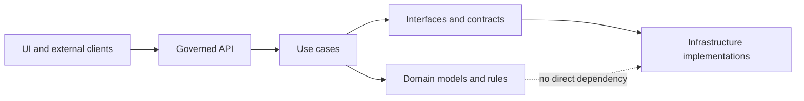

<!-- [KFM_META_BLOCK_V2]
doc_id: kfm://doc/3214271a-6804-4757-887e-c72592daaa95
title: Domain package source
type: standard
version: v1
status: draft
owners: TODO
created: 2026-02-25
updated: 2026-02-25
policy_label: public
related:
  - ../README.md
  - ../../../docs/MASTER_GUIDE_v13.md
tags: [kfm, domain]
notes:
  - Source root for the Domain layer. Keep pure, deterministic, and dependency-light.
[/KFM_META_BLOCK_V2] -->

# KFM Domain Source

**Purpose:** the pure Domain layer for Kansas Frontier Matrix — core models, invariants, and domain events.


<!-- TODO: replace/add repo-specific badges (CI, coverage, npm package, license) -->

## Navigation

- [What lives here](#what-lives-here)
- [Architecture rules](#architecture-rules)
- [Directory layout](#directory-layout)
- [How to add or change domain logic](#how-to-add-or-change-domain-logic)
- [Definition of Done](#definition-of-done)
- [FAQ](#faq)

---

## What lives here

This folder is **`packages/domain/src/`** — the source root for the **Domain** layer.

Domain code is:

- **Pure and deterministic** (no I/O, no network, no filesystem, no clocks).
- **Framework-free** (no web frameworks, DB drivers, map libraries, etc.).
- **Stable vocabulary** used by pipelines, API contracts, and UI evidence surfaces.

Typical contents:

- **Entities / aggregates** (e.g., Dataset, DatasetVersion, StoryNode).
- **Value objects** (e.g., IDs, digests, time ranges, spatial extents).
- **Domain services** (pure functions that enforce cross-entity rules).
- **Domain events** (facts emitted when a domain state transition happens).
- **Errors** (typed domain errors with reason codes that higher layers can map to UX).

> [!NOTE]
> If you need *side effects* (DB writes, HTTP calls, filesystem reads, clock time, UUID generation),
> that belongs in **Use cases** / **Infrastructure**, not here.

### What must NOT live here

- Database models/ORMs, SQL, migrations
- HTTP handlers, controllers, OpenAPI/GraphQL schemas (those are **Interfaces**)
- Policy engines / OPA adapters (those are **Interfaces** + **Infrastructure**)
- Logging, telemetry, metrics emitters
- Anything that reads from or writes to object storage

---

## Architecture rules

The KFM architecture is intentionally layered. The key rule for this folder:

> **Domain logic never talks directly to infrastructure.**  
> Domain types are used by higher layers through interfaces/repositories.



### Trust membrane implications for Domain

The “trust membrane” is the governance boundary: clients do not access storage directly, and core logic does not bypass repository interfaces. Domain types should make it easy for higher layers to:

- enforce policy decisions consistently
- record audit/run receipts
- build evidence bundles that can be cited or abstained

---

## Directory layout

> [!IMPORTANT]
> The tree below is a **target shape**. Update it to match the actual code as it evolves.

```text
src/
  index.ts                # package exports (keep explicit; avoid star exports if they hide churn)
  entities/               # aggregates/entities (state + invariants)
  value-objects/          # IDs, hashes/digests, time ranges, extents
  events/                 # domain events (immutable “something happened” records)
  rules/                  # pure rule functions (often reused by entities + services)
  services/               # domain services (pure orchestration across entities)
  errors/                 # typed domain errors + reason codes
  __tests__/              # fast unit tests (no integration tests here)
```

### Export hygiene

- Prefer a small, curated public surface in `src/index.ts`.
- Keep internal helpers un-exported (or exported from a `internal/` barrel, if needed).
- Avoid import cycles by keeping dependencies directional:
  - `value-objects` → `entities` is OK
  - `entities` → `value-objects` is OK
  - `entities` → `services` is usually a smell (prefer the other way around)

---

## How to add or change domain logic

### 1) Start from vocabulary and invariants

Before adding a new concept, confirm it’s aligned with the system vocabulary:

- Dataset / DatasetVersion / Artifact
- EvidenceRef / EvidenceBundle
- Policy labels + obligations (redaction/generalization)

If you can’t name the concept clearly, it probably belongs in a higher layer as a DTO or view model.

### 2) Encode invariants in code (and tests)

- Represent invariants as constructors/factories that can *refuse* invalid states.
- Make invalid states **unrepresentable** where feasible (use types, branded IDs, etc.).
- Add unit tests that prove the invariants.

### 3) Keep I/O outside

If you need to “look something up”, define that as an input argument to a pure function (provided by a use case), rather than calling a repository from here.

### 4) Add a domain event when state changes matter

If other parts of the system need to react to a domain transition, model it as an event (immutable record), emitted by the use case layer.

---

## Definition of Done

When you open a PR that changes this folder, it should satisfy:

- [ ] No new runtime dependency on infrastructure/framework packages
- [ ] No I/O (network/fs/db/clock) introduced
- [ ] Invariants encoded as types + constructors/factories
- [ ] Unit tests cover success + failure cases
- [ ] Public exports updated intentionally (`src/index.ts`)
- [ ] If a change affects policy/evidence semantics, update the relevant contract tests in higher layers

---

## FAQ

### Why is this README inside `src/`?

So the rules are visible where the code is written, not only at the package root.

### Where do repository interfaces live?

In the **Interfaces** layer/package (not here). This keeps the Domain layer pure and portable.

### Where do “policy decisions” live?

Domain defines the **shapes** (types) used by policy decisions, obligations, and reason codes.  
The *evaluation* and enforcement live outside the Domain layer.
