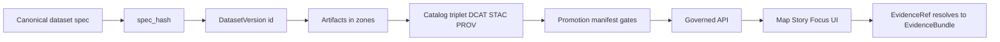

<!-- [KFM_META_BLOCK_V2]
doc_id: kfm://doc/41bdd425-a932-40f7-b1f9-012b84c3cbf2
title: Dataset Domain Model
type: standard
version: v1
status: draft
owners: TODO: assign (platform/domain)
created: 2026-02-25
updated: 2026-02-25
policy_label: internal
related:
  - TODO: link to KFM Definitive Design & Governance Guide (vNext)
  - TODO: link to Promotion Contract v1 docs/templates
tags: [kfm, domain, dataset]
notes:
  - This README is contract-oriented: it documents the domain types + invariants used across the KFM truth path.
  - It intentionally avoids infrastructure and IO details.
[/KFM_META_BLOCK_V2] -->

<a id="top"></a>

# Dataset domain
Domain model + contracts for **Dataset / DatasetVersion / Artifact** identity, promotion touchpoints, and evidence resolution.


<!-- TODO: add repo CI badge once workflow path is known -->

**Why this exists:** KFM’s runtime (API/UI/Focus Mode) is only as trustworthy as the **versioned dataset contracts** it can validate, cite, and trace.

---

## Quick navigation
- [Purpose](#purpose)
- [Where this fits](#where-this-fits)
- [Core concepts](#core-concepts)
- [Identifiers and hashing](#identifiers-and-hashing)
- [Controlled vocabularies](#controlled-vocabularies)
- [Promotion contract touchpoints](#promotion-contract-touchpoints)
- [Evidence surfaces](#evidence-surfaces)
- [What belongs here](#what-belongs-here)
- [What must not go here](#what-must-not-go-here)
- [Suggested directory layout](#suggested-directory-layout)
- [Testing expectations](#testing-expectations)
- [References](#references)

---

## Purpose
This folder defines the **domain-level, pure** types and rules that let the rest of KFM:

- refer to datasets and versions **predictably**
- enforce **fail-closed** promotion gates
- attach and resolve evidence consistently (DCAT/STAC/PROV ↔ EvidenceRef)
- keep policy labels and redaction obligations **explicit**

> **Design stance:** this package should be “dumb but strict”:
> - “dumb” = no IO, no environment coupling
> - “strict” = canonicalization + validation + stable identity

[Back to top](#top)

---

## Where this fits
KFM treats catalogs + provenance as **contract surfaces** between pipelines and runtime. This module is the **shared contract layer** for those surfaces.



[Back to top](#top)

---

## Core concepts

### Entities and value objects
| Concept | What it represents | What must be true (invariants) | Notes |
|---|---|---|---|
| `Dataset` | A stable “dataset family” (e.g., `noaa_ncei_storm_events`) | Slug is stable; does not include dates | Dataset is the *name*, not the *release*. |
| `DatasetVersion` | An immutable released version of a dataset | ID is derived from a stable `spec_hash` | Versions are what runtime serves. |
| `Artifact` | A concrete file/object (table, tileset, COG, text corpus, etc.) | Every artifact is addressable and has a digest | Artifacts exist in lifecycle zones. |
| `RunReceipt` | The audit record for a producing run | Enumerates inputs/outputs + digests + environment | Must exist for promotion. |
| `PromotionManifest` | The “release record” for a promoted version | Lists artifacts + catalogs + policy + approvals | Used to fail-closed in CI and review. |
| `EvidenceRef` | A resolvable reference to evidence | Has a recognized scheme (dcat/stac/prov/doc/graph) | Must resolve without guessing. |
| `EvidenceBundle` | Resolved evidence returned to UI/Focus Mode | Includes policy decision + obligations + provenance + allowed links | “Human card + machine metadata”. |

### Lifecycle zones
Artifacts move through zones; **promotion** is the act of admitting a DatasetVersion into runtime surfaces.

- **raw**: append-only; never mutate (supersede with new acquisition)
- **work**: intermediate transforms + QA reports + candidate redactions/generalizations
- **quarantine**: failed validation, unclear licensing, sensitivity concerns (not promoted)
- **processed**: publishable artifacts with checksums + derived runtime metadata
- **catalog**: DCAT + STAC + PROV cross-linked
- **published**: governed runtime serving *only* promoted dataset versions

[Back to top](#top)

---

## Identifiers and hashing

### Identifier families
**Confirmed pattern:** use URI-like identifier families with stable prefixes, and avoid embedding environment hostnames in canonical IDs.

Recommended families (illustrative):
- `kfm://dataset/<dataset_slug>`
- `kfm://dataset/@<dataset_version_id>`
- `kfm://artifact/sha256:<digest>`
- `kfm://run/<run_id>`
- `kfm://evidence/<bundle_id>`
- `kfm://story/@<story_id>`

### Dataset slug conventions
**Confirmed rules:**
- lowercase
- underscore-separated words
- include upstream authority when helpful
- **do not** include date (date belongs to version)

Examples:
- `usgs_nwis_kansas`
- `noaa_ncei_storm_events`
- `fema_disaster_declarations`

### DatasetVersion identity via `spec_hash`
**Confirmed pattern:** a DatasetVersion should be derived from a canonical “dataset specification” (connector config, normalization rules, validation rules, output artifact plan, intended policy label, cadence).

Then compute:

- `spec_hash = sha256( canonical_json(spec) )`  
- `dataset_version_id` is derived from the `spec_hash` (e.g., `YYYY-MM.<short>`)

> NOTE  
> Canonicalization must be stable across platforms. Use a canonical JSON method (the KFM blueprint calls out RFC 8785) and enforce it with a stability test.

#### Minimal spec fields (illustrative)
```json
{
  "dataset_slug": "noaa_ncei_storm_events",
  "upstream": { "authority": "noaa", "endpoint": "..." },
  "normalization": { "ruleset_version": "v1" },
  "validation": { "profile": "kfm.geodata.v1", "thresholds": { "geometry_valid": 0.999 } },
  "outputs": [{ "kind": "geoparquet" }, { "kind": "pmtiles" }],
  "policy_intent": "public",
  "cadence": "monthly"
}
```

[Back to top](#top)

---

## Controlled vocabularies
KFM uses controlled vocabularies so policy + lifecycle + evidence are machine-checkable.

| Vocabulary | Purpose | Starter values |
|---|---|---|
| `policy_label` | access + sensitivity | `public`, `public_generalized`, `restricted`, `restricted_sensitive_location`, `internal`, `embargoed`, `quarantine` |
| `artifact.zone` | lifecycle zone | `raw`, `work`, `processed`, `catalog`, `published` |
| `citation.kind` | evidence ref type | `dcat`, `stac`, `prov`, `doc`, `graph`, `oci` (optional), `url` (discouraged) |
| `geometry.generalization_method` | how geometry was generalized | `centroid_only`, `grid_aggregation_*`, `random_offset_*`, `dissolve_to_admin_unit`, `bounding_box_only`, `none` |

> WARNING  
> If a value isn’t in the vocabulary, it should fail validation (default-deny posture).

[Back to top](#top)

---

## Promotion contract touchpoints
This module should expose types/helpers that make promotion gates **testable**.

### Minimal fail-closed gates (domain-facing view)
Promotion should be blocked unless:

- **Identity & versioning**
  - DatasetVersion ID and `spec_hash` are deterministic
  - Promotion manifest exists

- **Artifacts**
  - Processed artifacts exist
  - Each has a digest
  - Predictable paths + media types are recorded

- **Catalogs**
  - DCAT/STAC/PROV exist and validate under KFM profiles

- **Cross-links**
  - Links resolve; asset hrefs exist; EvidenceRefs resolve

- **Policy**
  - `policy_label` assigned
  - Obligations applied
  - Default-deny tests pass

- **QA**
  - Validation reports exist; failures quarantined

- **Audit**
  - Run receipt emitted
  - Audit ledger append
  - Approvals captured when required

### Contract artifacts this module typically models
- `RunReceipt` (schema/type only; no IO)
- `PromotionManifest` (schema/type only; no IO)
- Optional: `DiffReport` for “what changed?” comparisons between versions

[Back to top](#top)

---

## Evidence surfaces

### EvidenceRef schemes
EvidenceRefs should resolve into catalog/provenance/doc surfaces without guessing:

- `dcat://...` → dataset/distribution metadata
- `stac://...` → collection/item/asset metadata
- `prov://...` → run lineage (activities/entities/agents)
- `doc://...` → governed docs / story citations
- `graph://...` → entity relations (if enabled)

### Evidence resolver expectation
The runtime evidence resolver (API concern) should accept an EvidenceRef (or structured reference) and return an EvidenceBundle that includes:

- policy decision + obligations applied
- license + attribution
- provenance/run pointer
- artifact links only if allowed
- digests + dataset_version identifiers
- audit references

> UX constraint: the UI should be able to use evidence resolution in **≤ 2 calls** or users stop trusting/using provenance.

[Back to top](#top)

---

## What belongs here

✅ **Acceptable contents**
- Pure domain types / value objects for Dataset, DatasetVersion, Artifact
- Deterministic ID + hashing helpers (slug validation, canonicalization, `spec_hash`)
- Controlled vocab enums and validators
- Contract types for:
  - RunReceipt
  - PromotionManifest
  - EvidenceRef / EvidenceBundle (as shapes)
- Small, pure helpers to validate invariants (no side effects)

[Back to top](#top)

---

## What must not go here

❌ **Exclusions**
- ETL / connectors / scrapers
- File system paths that assume a specific deployment
- DB queries, PostGIS/Neo4j clients, object storage SDKs
- API route handlers/controllers
- UI components
- OPA/Rego policy implementation (domain may define *labels*, not enforce access)
- Catalog generation logic (domain may define *shapes*, not produce files)

> TIP  
> If it depends on network, disk, environment variables, or credentials: it’s not domain.

[Back to top](#top)

---

## Suggested directory layout
> **PROPOSED (verify against actual repo tree):** this is a recommended split to keep concepts clean.

```text
packages/domain/src/dataset/
  README.md

  model/
    Dataset.*
    DatasetVersion.*
    Artifact.*

  ids/
    datasetSlug.*
    specHash.*
    kfmUri.*

  vocab/
    policyLabel.*
    artifactZone.*
    citationKind.*
    geometryGeneralization.*

  contracts/
    RunReceipt.*
    PromotionManifest.*
    EvidenceRef.*
    EvidenceBundle.*
    DiffReport.*              # optional

  __tests__/
    specHash.stability.test.*
    vocab.exhaustive.test.*
    id.validation.test.*
```

[Back to top](#top)

---

## Testing expectations
At minimum, this module should support CI-enforceable tests for:

- deterministic canonicalization + `spec_hash` stability
- dataset slug validation and normalization
- exhaustive controlled vocab coverage (no “magic strings”)
- contract shape checks for receipts/manifests (schema compilation, type tests)
- (integration-level, outside this folder) cross-link and evidence resolver contract tests

[Back to top](#top)

---

## References
- KFM “catalog triplet” contract (DCAT/STAC/PROV) + cross-linking rules
- Promotion Contract v1 (fail-closed gates)
- Identifier + vocabulary conventions (policy labels, artifact zones, citation kinds)

> TODO: Replace these bullets with **repo-local** links to the authoritative KFM governance docs once paths are confirmed.
