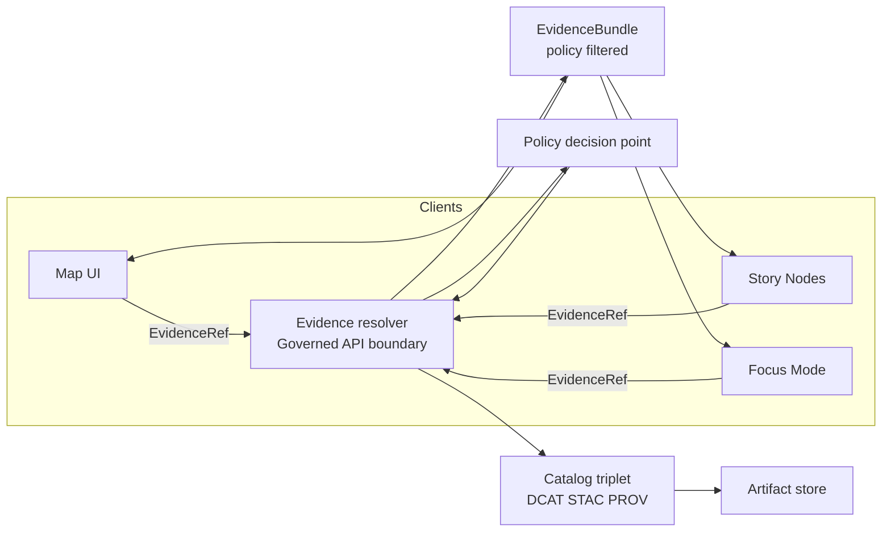

<!-- [KFM_META_BLOCK_V2]
doc_id: kfm://doc/7d4c7f6a-7e6e-4d5f-a4a5-0a642d60c792
title: Evidence Domain
type: standard
version: v1
status: draft
owners: TBD
created: 2026-02-25
updated: 2026-02-25
policy_label: public
related:
  - kfm://doc/kfm-governance-guide-vnext
  - ../../../../../../README.md
tags: [kfm, domain, evidence]
notes:
  - Domain-level contracts for EvidenceRef and EvidenceBundle.
  - Keep parsing and canonicalization pure and deterministic.
[/KFM_META_BLOCK_V2] -->

# Evidence

Domain contracts for **EvidenceRef** and **EvidenceBundle** so every claim can be traced to inspectable, policy-governed evidence.


---

## Navigation

- [Purpose](#purpose)
- [System context](#system-context)
- [Concepts](#concepts)
- [EvidenceRef schemes](#evidenceref-schemes)
- [EvidenceBundle contract](#evidencebundle-contract)
- [Directory boundaries](#directory-boundaries)
- [Determinism and hashing](#determinism-and-hashing)
- [Definition of done](#definition-of-done)
- [Appendix](#appendix)

---

## Purpose

This directory defines the **domain-level** representation of:

- **EvidenceRef**: a stable, parseable reference that points to a dataset version and an evidence span.
- **EvidenceBundle**: the resolved, policy-filtered bundle returned to humans and machines (UI, API clients, and Focus Mode).

This module exists to ensure that citations are **portable**, **inspectable**, and **governable** across infrastructure changes.

> WARNING  
> Evidence and citations are part of the *trust membrane*: clients must not bypass governed APIs to fetch artifacts or metadata directly.

[Back to top](#evidence)

---

## System context



**Key UX constraint:** resolving evidence should be usable in *two calls or fewer* from the UI (feature click or citation click should both land on the same evidence drawer).

[Back to top](#evidence)

---

## Concepts

### EvidenceRef

An **EvidenceRef** is a compact string reference (or structured equivalent) that:

- is **parseable without network calls**,
- remains stable under re-hosting,
- can be validated and linted in CI before publishing.

A citation is not “just a URL”. It should reference an immutable dataset version and an evidence span (row, page span, asset, etc.).

### EvidenceBundle

An **EvidenceBundle** is the resolver output that packages:

- the policy decision and any obligations applied,
- human-readable “cards” for UI rendering,
- machine-readable metadata (dataset version IDs, digests, provenance links),
- audit references for reproducibility and review.

Bundles are treated as **immutable by digest**.

[Back to top](#evidence)

---

## EvidenceRef schemes

KFM’s recommended minimal scheme set is:

| Scheme | What it points to | Example pattern | Notes |
|---|---|---|---|
| `dcat://@…` | DCAT dataset / distribution | `dcat://@<dataset_id>@<dataset_version_id>` | Use canonical IDs, not deployment URLs. |
| `stac://…#asset=…` | STAC item / asset | `stac://<collection>/<item_id>#asset=<asset_key>` | Asset keys should map to catalogued artifacts. |
| `prov://…` | PROV activity / run receipt | `prov://<run_id>` | Run receipts are part of provenance review. |
| `doc://…#page=…&span;=…:…` | Document page + text span | `doc://sha256:<doc_digest>#page=<n>&span;=<start>:<end>` | Span is typically character offsets; optional bbox may exist. |
| `graph://…` | Graph entity / edge | `graph://<entity_or_edge_id>` | Used for knowledge graph-backed claims. |

> NOTE  
> The **example patterns** above are illustrative. The exact IDs used in this repo must align with the catalog profiles and identifier strategy.

### Parsing and error rules

- EvidenceRefs **must be parseable without network calls**.
- The resolver must validate syntax and return **policy-safe errors** (no metadata leakage on deny).

[Back to top](#evidence)

---

## EvidenceBundle contract

A minimal EvidenceBundle should include at least:

- `bundle_id` and digest
- `policy` decision and obligations
- `cards` for rendering
- machine metadata:
  - `dataset_version_id`
  - artifact digests
  - provenance links
  - rights metadata

### Example shape

```json
{
  "bundle_id": "sha256:bundle...",
  "dataset_version_id": "YYYY-MM.xxxxxxxx",
  "title": "Human-readable evidence title",
  "policy": {
    "decision": "allow|deny",
    "policy_label": "public|restricted|…",
    "obligations_applied": []
  },
  "license": { "spdx": "CC-BY-4.0", "attribution": "…" },
  "provenance": { "run_id": "kfm://run/…" },
  "artifacts": [
    { "href": "processed/…", "digest": "sha256:…", "media_type": "…" }
  ],
  "checks": { "catalog_valid": true, "links_ok": true },
  "audit_ref": "kfm://audit/entry/…"
}
```

### Bundling rules

- Bundles are **immutable by digest**.
- Bundles may include **multiple cards** (dataset + run receipt + specific asset).
- Bundles must **not** include restricted artifacts for unauthorized roles.

[Back to top](#evidence)

---

## Directory boundaries

This is a **domain module**. Keep it pure.

### Allowed here

- Types and validators for `EvidenceRef` and `EvidenceBundle`
- Canonicalization utilities (stable ordering, normalized forms)
- Digest/spec-hash computation helpers (pure)
- Test fixtures and golden test inputs (if this repo colocates them in-domain)

### Not allowed here

- HTTP handlers or route wiring (`POST /api/v1/evidence/resolve` belongs to the API layer)
- Direct access to databases, object storage, or search indexes
- Policy engine integration (OPA/Rego clients, authn/z) — expose a domain interface instead
- UI components (Evidence drawer rendering belongs to web/UI packages)

### Expected usage boundaries

| Consumer | Uses this module for | Does not do here |
|---|---|---|
| Governed API | parse/validate refs, construct bundle DTOs | make policy decisions in UI |
| UI | render evidence cards, show policy badges | resolve evidence without API |
| Pipelines | emit refs into catalogs and outputs | “guess” IDs without catalogs |

[Back to top](#evidence)

---

## Determinism and hashing

Determinism is part of the trust surface:

- Canonicalize EvidenceRefs and bundle outputs so they are stable across runs.
- Keep a stable `spec_hash` (or equivalent) for contract checking and golden tests.
- Prefer “data in, data out” pure functions in this package.

> TIP  
> If you can’t make it deterministic, you can’t reliably audit it.

[Back to top](#evidence)

---

## Definition of done

Use this checklist when changing anything in `packages/domain/src/evidence`:

- [ ] EvidenceRefs remain parseable without network calls
- [ ] EvidenceRef syntax changes include a parser update and golden tests
- [ ] Resolver-facing DTOs remain backward compatible or include a migration plan
- [ ] Bundles remain immutable by digest and do not leak restricted artifacts
- [ ] CI includes citation linting:
  - [ ] EvidenceRef syntax checks
  - [ ] Resolver can resolve refs in a test environment
  - [ ] Policy check aligns with target policy label
  - [ ] Rights checks exist when media is cited
- [ ] Contract tests cover:
  - [ ] public evidence resolves to bundle with allowed artifacts
  - [ ] restricted evidence denies without sensitive metadata leakage

[Back to top](#evidence)

---

## Appendix

<details>
  <summary><strong>Glossary</strong></summary>

- **DCAT**: dataset discovery and distribution metadata.
- **STAC**: spatiotemporal asset catalog for geospatial items/assets.
- **PROV**: provenance for runs, inputs, tools, parameters, and generated artifacts.
- **PDP / PEP**: policy decision point / policy enforcement point.

</details>
