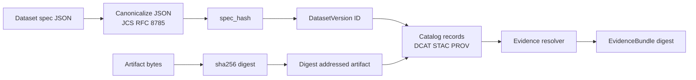

<!-- [KFM_META_BLOCK_V2]
doc_id: kfm://doc/43c3afa9-e9e1-41fa-94d4-049fcc3de273
title: Domain Identity
type: standard
version: v1
status: draft
owners: TBD
created: 2026-02-25
updated: 2026-02-25
policy_label: public
related:
  - kfm://doc/kfm-definitive-design-governance-guide-vnext (verify in repo)
tags:
  - kfm
  - domain
  - identity
  - hashing
  - provenance
notes:
  - This README is evidence-aligned to KFM invariants (deterministic identity + hashing, digest addressing).
  - Repo-specific exports, filenames, and owners MUST be verified against the current repository.
[/KFM_META_BLOCK_V2] -->

# Identity

Deterministic IDs + hashing + canonicalization primitives for KFM domain logic.


 <!-- TODO: verify policy label per governance -->

---

## Quick navigation

- [Overview](#overview)
- [Responsibilities](#responsibilities)
- [Core invariants](#core-invariants)
- [ID and digest surface](#id-and-digest-surface)
- [Canonicalization and hashing rules](#canonicalization-and-hashing-rules)
- [How it fits in KFM](#how-it-fits-in-kfm)
- [Directory contract](#directory-contract)
- [Testing requirements](#testing-requirements)
- [Change discipline](#change-discipline)

---

## Overview

This folder is the **single place** to implement and maintain KFM identity primitives:

- **Stable identifiers** (dataset identity, dataset version identity, document identity, etc.)
- **Digest addressing** (artifacts/evidence bundles addressed by content digests)
- **Deterministic hashing** (including `spec_hash` for canonical dataset specs)
- **Strict parsing/formatting** for identity strings / URIs (where applicable)

> [!IMPORTANT]
> This module should be **pure** and **deterministic**: it must not do network I/O, database calls, or depend on ambient state (clock, randomness, environment-specific ordering). Identity is part of the trust membrane.

---

## Responsibilities

### ✅ In-scope

- Deterministic hash functions for:
  - dataset spec canonical inputs (`spec_hash`)
  - artifact bytes (`sha256` or similar)
  - evidence bundles (digest immutability)
- Canonicalization utilities (especially canonical JSON)
- Identity types and validators (e.g., “is this a valid digest string?”)
- String formats and parsers (if KFM uses URI schemes like `kfm://...`)

### ❌ Out-of-scope

- Policy decisions (labels, obligations, redactions)
- Evidence retrieval / resolution (this module may format/parse refs, but must not fetch)
- Storage concerns (paths, buckets, DB tables)
- Crypto signing / key management (unless explicitly introduced as a governed contract)

---

## Core invariants

These are **non-negotiable** invariants that downstream systems rely on:

1. **Determinism**
   - Same logical input → same canonical bytes → same digest → same ID.

2. **Hash drift prevention**
   - JSON must be canonicalized prior to hashing (recommended: RFC 8785 / JCS).

3. **Explicit algorithms**
   - A digest must never be “just a string.” It must be associated with an algorithm (e.g., `sha256`).

4. **Digest addressing**
   - Artifacts and evidence bundles should be **addressed by digest**, not by mutable names.

---

## ID and digest surface

Because repo state is not available in this chat session, the exact exported API is **UNKNOWN**.
However, the *minimum conceptual surface* expected from this module is:

### 1) Digest types

| Concept | Status | What it represents | Proposed string form |
|---|---|---|---|
| `ArtifactDigest` | **CONFIRMED concept** | Digest of a concrete produced artifact (file/object) | `sha256:<hex>` |
| `SpecHash` | **CONFIRMED concept** | Deterministic hash of a canonical dataset spec | `sha256:<hex>` |
| `EvidenceBundleDigest` | **CONFIRMED concept** | Digest of a resolved evidence bundle view | `sha256:<hex>` |

> [!NOTE]
> The **exact encoding** (`hex`, `base32`, etc.) and prefix conventions are **PROPOSED** until verified in the repo. The important invariant is algorithm-explicit, stable encoding.

### 2) Identifier types

| Identifier | Status | Purpose | Notes |
|---|---|---|---|
| `DatasetId` | **CONFIRMED concept** | Logical dataset identity | Often derived from stable dataset metadata or a governed registry |
| `DatasetVersionId` | **CONFIRMED concept** | Immutable dataset version identity | Must be stable and reproducible |
| `DocId` | **CONFIRMED concept** | Stable document identity | Typically `kfm://doc/<uuid>`; UUID may be generated once and then fixed |
| `EvidenceRef` | **CONFIRMED concept** | Stable reference to resolvable evidence | Schemes such as `dcat://`, `stac://`, `prov://`, `doc://`, `graph://` |

---

## Canonicalization and hashing rules

### Canonical JSON (required when hashing structured specs)

When hashing a dataset spec (to produce `spec_hash`), first canonicalize the JSON to prevent drift.

**Required properties (conceptual):**
- stable key ordering
- stable number formatting
- UTF-8 encoding
- no insignificant whitespace

**Pseudo-code (language-agnostic):**
```text
canonical_bytes = JCS_CANONICALIZE(dataset_spec_json)
spec_hash       = SHA256(canonical_bytes)
```

> [!WARNING]
> Do **not** hash a pretty-printed JSON string, language-native object dump, or map iteration order output. That causes “hash drift” across runtimes and languages.

### Artifact digests (required for produced outputs)

Artifacts should be addressed by digest so catalog records can be immutable and verifiable.

**Pseudo-code:**
```text
artifact_digest = SHA256(file_bytes)
```

---

## How it fits in KFM

This module underpins the system’s “truth path” reproducibility story:

- Dataset specs are canonical inputs to `spec_hash`
- Dataset versions are identified immutably
- Artifacts are digest-addressed and referenced by catalogs
- Evidence bundles are immutable by digest and can be cached safely

### Conceptual flow



---

## Directory contract

### Where this fits in the repo

**Intended location:** `packages/domain/src/identity/`

- “Domain” means **core vocabulary + invariants**, not infrastructure.
- Other packages/modules should import identity primitives rather than re-implement hashing.

> [!NOTE]
> The repository layout in this README is a **target description**, not confirmed. Verify against the current repo tree.

### Acceptable inputs

- Canonical dataset specs (structured JSON)
- Raw bytes / buffers for hashing (artifacts, bundles)
- Identity strings that need strict validation (digests, URIs)

### Exclusions

- Anything that queries storage (DB/object store)
- Anything that applies policy labels, redaction, or auth
- Anything that depends on wall-clock time or randomness

### Expected contents (verify against repo)

```text
packages/domain/src/identity/
├── README.md
├── (canonicalization utilities)     # TBD
├── (hash + digest utilities)        # TBD
├── (ID types + parsers/validators)  # TBD
└── (tests)                          # TBD
```

---

## Testing requirements

Identity bugs are **system integrity bugs**. Minimum test expectations:

- **Golden vectors**: same input → same digest (checked into tests)
- **Round-trip tests**: parse(format(x)) == x
- **Cross-platform stability**: tests should pass on all supported runtimes
- **Negative tests**: invalid digests/URIs rejected strictly

### “Must not regress” checklist

- [ ] Changing canonicalization requires a version bump and migration plan
- [ ] Changing digest algorithm requires explicit opt-in and dual-read support
- [ ] Changing ID string formats requires backwards compatibility strategy

---

## Change discipline

When you modify identity behavior, treat it like a breaking API change:

1. Add golden test vectors for old + new behavior
2. Version the behavior (explicitly) if downstream reproducibility depends on it
3. Update docs and any governed contracts (catalog/provenance/evidence schemas)

---

<p align="right"><a href="#identity">Back to top ↑</a></p>
