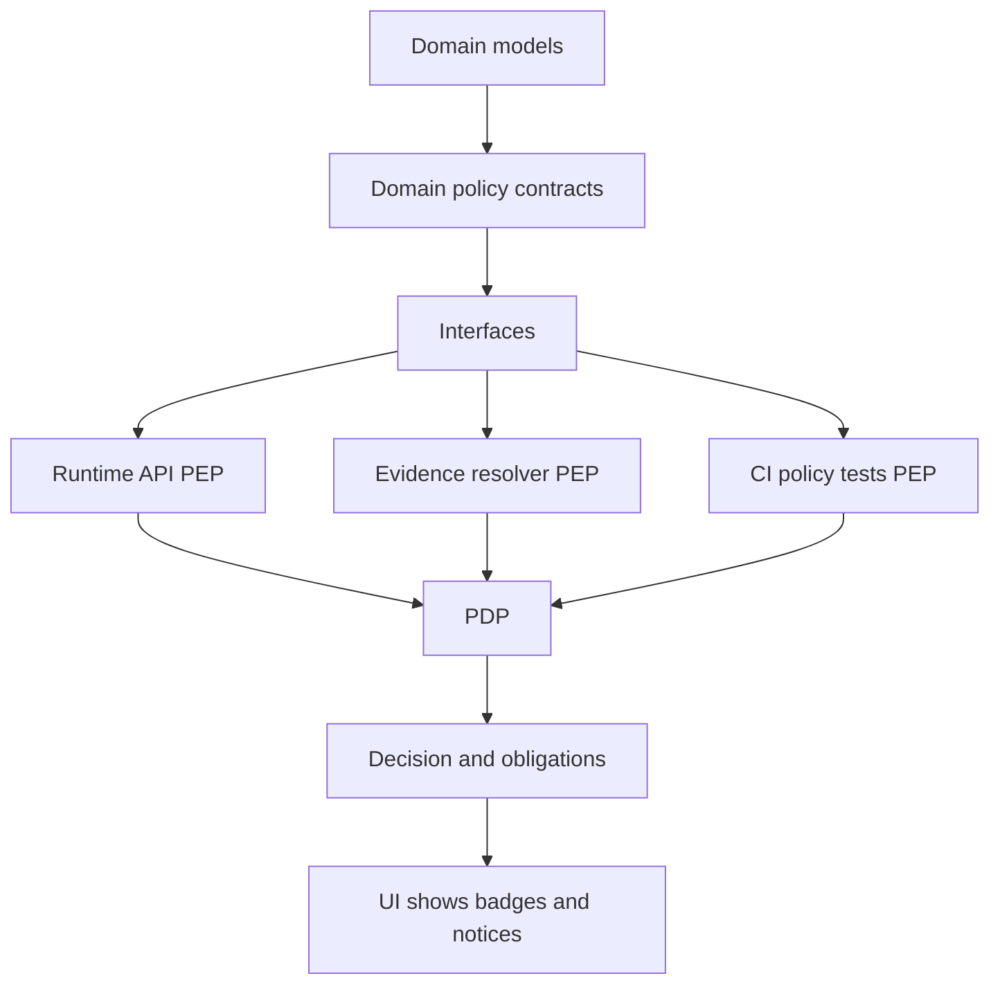

<!-- [KFM_META_BLOCK_V2]
doc_id: kfm://doc/5d3d2e8b-18ed-4f5b-9e9d-9c2e3b6c9b3f
title: Domain Policy
type: standard
version: v1
status: draft
owners: Policy Steward (TBD)
created: 2026-02-25
updated: 2026-02-25
policy_label: internal
related:
  - kfm://doc/definitive-design-governance-guide-vnext
tags: [kfm, domain, policy]
notes:
  - This README documents policy primitives and contracts used across KFM.
  - Update owners + related links when repo governance docs are wired in.
[/KFM_META_BLOCK_V2] -->

# 🛡️ Domain Policy

**Purpose:** Domain-level policy vocabulary, decision contracts, and obligations used across KFM’s **trust membrane**.

**Status:** draft • **Owners:** Policy Steward (TBD)


---

## Quick links

- [Purpose](#purpose)
- [Where this fits](#where-this-fits)
- [Non-negotiable rules](#non-negotiable-rules)
- [Policy labels](#policy-labels)
- [Roles](#roles)
- [Policy decision contract](#policy-decision-contract)
- [How enforcement works](#how-enforcement-works)
- [Directory layout](#directory-layout)
- [Change checklist](#change-checklist)
- [Testing and gates](#testing-and-gates)
- [Appendix](#appendix)

---

## Purpose

This directory is the **domain contract surface** for policy:

- Defines **policy labels** (classification) as a controlled vocabulary.
- Defines **policy decisions** (allow/deny) and **obligations** (required actions like notices, redactions, generalization).
- Provides **validation helpers** so all layers agree on what labels/decisions/obligations “mean”.

> NOTE  
> This folder is intentionally **domain-only**: deterministic, testable, and free of infrastructure concerns.

<a id="where-this-fits"></a>

## Where this fits

KFM layering (policy belongs in **Domain**; enforcement happens at boundaries):



- **PDP**: Policy Decision Point (e.g., OPA)  
- **PEP**: Policy Enforcement Point (CI, API, evidence resolver)

> WARNING  
> The UI can *render* policy outcomes (badges/notices) but **must not** be the decision-maker.

---

## Non-negotiable rules

These are invariants this directory exists to make hard to violate:

- **Fail closed**: if policy evaluation or inputs are missing/invalid → deny.
- **Default deny** posture, especially for sensitive locations and restricted datasets.
- **Same semantics in CI and runtime**: if CI fixtures don’t match runtime behavior, CI guarantees are meaningless.
- **No leakage**: do not leak restricted metadata in error responses.
- **Redaction/generalization is first-class**: treat as an explicit transform recorded in provenance, not an ad-hoc UI trick.

---

## Policy labels

Policy labels are a controlled vocabulary used across catalogs, APIs, evidence, and UI.

### Starter vocabulary

| policy_label | Intended meaning | Typical obligations |
|---|---|---|
| `public` | Safe for unauthenticated/public surfaces | Attribution, license display |
| `public_generalized` | Public *representation* is allowed, but geometry/fields must be generalized | `show_notice`, `generalize_geometry`, `redact_fields` |
| `restricted` | Not public; requires role-based access | Minimize metadata exposure; audit |
| `restricted_sensitive_location` | Precise coordinates are protected (heritage, sensitive sites/species) | Dual outputs; leakage tests; steward approval |
| `internal` | Internal-only operational artifacts | Role-gated access |
| `embargoed` | Time/condition-based restriction | Release rules; audit |
| `quarantine` | Not promotable; failed checks or unresolved issues | Block publish + block evidence resolution |

> TIP  
> If a dataset is `restricted_sensitive_location` and any public display is permitted, create a **separate** `public_generalized` dataset version.

---

## Roles

Policy is evaluated using user role and resource policy label.

| Role | What they can do (conceptual) |
|---|---|
| Public user | Read public layers/stories; Focus Mode limited to public evidence |
| Contributor | Propose datasets/stories; draft content; cannot publish |
| Reviewer / Steward | Approves promotions + story publishing; owns labels + redaction rules |
| Operator | Runs pipelines + manages deployments; cannot override policy gates |
| Governance council | Authority over culturally sensitive materials and restricted collections |

---

## Policy decision contract

All policy engines/adapters MUST produce a common decision shape.

### Minimal decision shape

```json
{
  "decision": "allow",
  "policy_label": "public",
  "obligations_applied": [
    {
      "type": "show_notice",
      "message": "Geometry generalized due to policy."
    }
  ]
}
```

### Obligations

Obligations are **required actions** that enforcement points must apply.

Recommended obligation types (starter):

| obligation.type | Enforced by | Example |
|---|---|---|
| `show_notice` | UI | “Generalized due to policy” banner |
| `generalize_geometry` | pipeline + API | grid aggregation / dissolve |
| `redact_fields` | pipeline + API | drop/blank PII-like fields |
| `require_attribution` | API + UI | auto-attach attribution text |
| `require_steward_review` | promotion gate | block until steward approval exists |

> NOTE  
> “Obligations” are what make policy *operational* (not just labels).

---

## How enforcement works

The KFM posture is:

- **PDP** decides: allow/deny + obligations
- **PEPs** enforce: CI blocks merges, API blocks unsafe responses, evidence resolver blocks unsafe citations
- **UI** displays: badges/notices, but does not decide

### Enforcement points

- **CI PEP**: schema validation + policy fixture tests block merges.
- **API PEP**: policy check before serving data/tiles/query slices.
- **Evidence resolver PEP**: policy check before resolving citations into bundles.

---

## Directory layout

> TODO  
> Update this tree to match the actual files in `packages/domain/src/policy/` once implemented.

```text
packages/domain/src/policy/
├── README.md
├── policy_label.*              # PolicyLabel vocabulary + validation
├── policy_decision.*           # PolicyDecision + obligations types
├── fixtures/                   # Canonical fixtures shared by CI and runtime
└── __tests__/                  # Unit tests for vocabulary + decision invariants
```

### Acceptable inputs

- Domain enums/types for labels, roles, actions, obligations
- Pure validation functions (no IO)
- Stable fixtures (JSON) used in CI and runtime tests
- Contract schemas for decision objects

### Exclusions

- OPA/Rego bundles (keep those in a dedicated `policy/` package or infra folder)
- Authn/authz middleware implementations
- Database adapters, network calls, secret management
- UI rendering components

---

## Change checklist

Use this checklist for any policy change (label, rule, obligation, adapter contract):

- [ ] Update controlled vocabulary (labels / roles / actions)
- [ ] Add/adjust fixtures (public, steward, restricted resource, etc.)
- [ ] Add/adjust CI tests so regressions block merges
- [ ] Confirm **CI semantics match runtime**
- [ ] Confirm no restricted metadata leaks via errors or logs
- [ ] If sensitive-location: ensure dual outputs + leakage tests + UX notice
- [ ] Update docs (this README + governance docs if applicable)

---

## Testing and gates

Policy is part of promotion gates and must be tested.

Minimum test expectations:

- [ ] Public can read `public`
- [ ] Public cannot read `restricted`
- [ ] `public_generalized` produces required obligations (e.g., `show_notice`)
- [ ] Evidence resolution fails closed when unauthorized
- [ ] Contract tests validate decision schema stability

> WARNING  
> If policy tests don’t run in CI and block merges, the trust membrane is not enforceable.

---

## Appendix

<details>
<summary><strong>Example: TypeScript-like domain typings</strong></summary>

```ts
// Pseudo / illustrative typings. Adjust to repo conventions.

export type PolicyLabel =
  | "public"
  | "public_generalized"
  | "restricted"
  | "restricted_sensitive_location"
  | "internal"
  | "embargoed"
  | "quarantine";

export type PolicyDecisionKind = "allow" | "deny";

export type PolicyObligation =
  | { type: "show_notice"; message: string }
  | { type: "generalize_geometry"; method: string }
  | { type: "redact_fields"; fields: string[] }
  | { type: "require_attribution"; text: string }
  | { type: "require_steward_review"; queue: "promotion" | "story" };

export interface PolicyDecision {
  decision: PolicyDecisionKind;
  policy_label: PolicyLabel;
  obligations_applied: PolicyObligation[];
}
```

</details>

---

### Back to top

[↑ Back to top](#-domain-policy)
