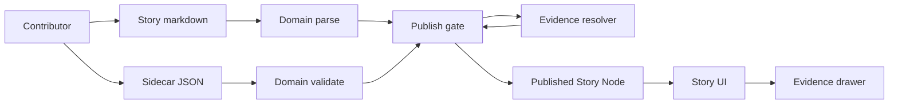

<!-- [KFM_META_BLOCK_V2]
doc_id: kfm://doc/33617c5d-6054-460f-82da-83445dc7f847
title: Story domain
type: standard
version: v1
status: draft
owners: TBD
created: 2026-02-25
updated: 2026-02-25
policy_label: public
related:
  - contracts/schemas/story_node_v3.schema.json
  - docs/templates/TEMPLATE__STORY_NODE_V3.md
  - docs/reports/story_nodes/
tags: [kfm, domain, story, story-node, evidence]
notes:
  - Domain-layer types + validators for Story Node v3. Pure logic only (no IO).
[/KFM_META_BLOCK_V2] -->

# Story domain

> Domain primitives for **Story Node v3**: narrative + map state + citations — designed to support a publish gate that fails closed.


**Path:** `packages/domain/src/story/`  
**Audience:** platform engineers, Studio/Story Mode implementers, stewards (review + governance tooling)  
**Scope:** parsing + validation + canonical types  
**Out of scope:** persistence, HTTP calls, UI rendering, policy decisions

## Jump to

- [Purpose](#purpose)
- [Where this fits](#where-this-fits)
- [Core concepts](#core-concepts)
- [Story Node contract](#story-node-contract)
- [Responsibilities](#responsibilities)
- [Directory layout](#directory-layout)
- [Validation and publish gate](#validation-and-publish-gate)
- [Usage](#usage)
- [Contributing](#contributing)
- [Appendix](#appendix)

---

## Purpose

This directory contains **domain-layer** building blocks that make Story Nodes safe, predictable, and testable:

- **Parseable**: extract metadata and citation markers from Story Node markdown
- **Validatable**: enforce schema + invariants for sidecar JSON and Story Node structure
- **Composable**: shared types for Studio authoring, API DTOs, Story Reader rendering, and publish gates
- **Governable**: carry `review_state` and `policy_label` through every layer

### Directory contract

| Category | Allowed here | Examples |
|---|---:|---|
| Domain types | ✅ | `StoryId`, `StoryVersionId`, `ReviewState`, `PolicyLabel`, `MapState`, `CitationRef` |
| Parsers / normalizers | ✅ | MetaBlock parsing, citation extraction, map-state canonicalization |
| Validators / lint rules | ✅ | sidecar schema validation, citation consistency checks, required sections checks |
| Test fixtures | ✅ | small, synthetic Story Node examples |
| UI components | ❌ | React components, styling, rendering logic |
| HTTP clients | ❌ | evidence resolver calls, API SDKs |
| Storage and DB | ❌ | database queries, blob reads, filesystem traversal of large content |
| Published story content | ❌ | keep Story Nodes in `docs/reports/story_nodes/...` (domain can reference fixtures only) |

> NOTE  
> If you need I/O, it likely belongs in an adapter layer or a service package — not domain.

[Back to top](#story-domain)

---

## Where this fits

Story Nodes are published artifacts that bind narrative to map state and citations. This directory provides the **shared domain contract** so API, UI, and CI gates all agree on what a Story Node is.



Key design stance:

- **Domain is pure**: deterministic functions + data structures.
- **Policy is enforced elsewhere**: policy decision points and evidence resolver should enforce allow/deny and obligations; domain only models those states.

[Back to top](#story-domain)

---

## Core concepts

### Story Node

A Story Node is a **pair**:

1. **Markdown**: human-readable narrative (with structured metadata and citation markers)
2. **Sidecar JSON**: machine metadata (map state, citations, policy label, review state)

### Evidence references

Story citations should be expressed as resolvable references (for example `dcat://...`, `stac://...`, `prov://...`, `doc://...`). The **domain layer does not resolve** citations; it only:

- extracts them from markdown
- validates they match the sidecar’s citation list
- hands the set of references to a caller that can resolve them

### Map state

Story Nodes capture enough map state to replay the view consistently:

- `bbox`
- `zoom`
- `layers` referencing `layer_id` and `dataset_version_id`
- `time_window`

This is treated as part of the publication contract.

[Back to top](#story-domain)

---

## Story Node contract

This section is a **developer-facing** summary of the v3 contract used across authoring, review, publish, and rendering.

### Required artifacts

| Artifact | Required | Format | Purpose |
|---|---:|---|---|
| Story markdown | ✅ | `.md` | Narrative + claim list + evidence section |
| Story sidecar | ✅ | `.json` | Map state + citations list + governance metadata |

### Sidecar shape

At minimum, a v3 sidecar should model:

- Versioning
  - `kfm_story_node_version: "v3"`
  - `story_id: "kfm://story/<uuid>"`
  - `version_id: "vN"` (or similar)
  - `status` and `review_state`
- Governance
  - `policy_label` (public, restricted, etc)
- Map replay
  - `map_state.bbox`, `map_state.zoom`, `map_state.layers[]`, `map_state.time_window`
- Citations
  - `citations[]` where each entry includes:
    - `ref` (EvidenceRef string)
    - `kind` (dcat, stac, prov, doc, etc)

### Citation markers in markdown

Markdown should include citation markers adjacent to claims, and an Evidence section that enumerates citations.

**Domain invariants to enforce:**

- Every claim-level citation marker must be present in the sidecar’s `citations[]`.
- The Evidence section should not list citations that do not appear elsewhere (unless explicitly allowed for “background sources”).
- All citation `ref` values must be parseable as EvidenceRef URIs.

### Versioning rule

When a Story Node is published, treat the published version as immutable; edits create a new version.

[Back to top](#story-domain)

---

## Responsibilities

### What this directory should provide

- Canonical types for:
  - Story identifiers and version identifiers
  - Map state and layer references
  - Citation reference objects and parsing
  - Review/policy enums and transitions
- Deterministic parsing:
  - MetaBlock extraction from markdown
  - Citation marker extraction from markdown
  - Evidence list extraction from markdown
- Deterministic validation:
  - Sidecar schema validation
  - Cross-file consistency checks (markdown ↔ sidecar)
  - “Required sections” checks (Summary, Claims, Evidence, etc)
  - “Publish-safe” checks that can run in CI without network access

### What this directory must not do

- Do not call `/api/v1/evidence/resolve` directly
- Do not fetch catalogs, tiles, or dataset records
- Do not decide allow/deny policy
- Do not render markdown to HTML (leave that to UI)

[Back to top](#story-domain)

---

## Directory layout

The exact file list is repo-specific; update this section to match the real tree when it exists.

```text
packages/domain/src/story/
  README.md                 # this file
  index.ts                  # public exports for story domain
  types.ts                  # StoryId, ReviewState, PolicyLabel, MapState, CitationRef
  metablock.ts              # MetaBlock v2 parsing + normalization helpers
  markdown.ts               # Story markdown parsing (sections, citation markers)
  sidecar_v3.ts             # Sidecar v3 types + schema integration glue
  validate.ts               # validation entrypoints
  __fixtures__/             # tiny example story nodes for tests
  __tests__/                # unit tests for parsing + validation
```

[Back to top](#story-domain)

---

## Validation and publish gate

### Domain-level validation

These checks should be runnable **offline** (CI-friendly):

- [ ] Sidecar JSON matches the v3 schema
- [ ] `policy_label` is present and in the allowed vocabulary
- [ ] `review_state` is present and in the allowed vocabulary
- [ ] `map_state` is structurally valid
  - [ ] bbox has 4 numbers and is well-ordered
  - [ ] zoom is a finite number in an allowed range
  - [ ] each layer has `layer_id` + `dataset_version_id`
  - [ ] time window is parseable ISO dates and start ≤ end
- [ ] Markdown has required sections
  - [ ] Summary exists
  - [ ] Claims exist
  - [ ] Evidence exists
- [ ] Citation consistency
  - [ ] every citation marker is present in sidecar citations
  - [ ] (optional) Evidence list equals the set of inline citations

### Publish gate requirements

These checks may require **network or privileged context** and should run as a publish gate in controlled environments:

- [ ] All citations resolve via the evidence resolver
- [ ] Rights are verified for included media
- [ ] Sensitivity scan passes
- [ ] Interpretive claims are labeled
- [ ] Governance review is triggered for sensitive topics when required

> WARNING  
> Story publishing should be blocked when citations do not resolve, rights are unclear, or sensitive locations are included without explicit policy approval.

[Back to top](#story-domain)

---

## Usage

> NOTE  
> Import paths and package name are repo-specific; treat the examples below as illustrative.

### Validate a Story Node before publish

```ts
import { parseStoryMarkdown, parseStorySidecarV3, validateStoryNodeV3 } from "./story"; // TODO: replace import

const md = /* read markdown (adapter layer) */;
const sidecar = /* read sidecar json (adapter layer) */;

const parsedMd = parseStoryMarkdown(md);
const parsedSidecar = parseStorySidecarV3(sidecar);

const report = validateStoryNodeV3({ markdown: parsedMd, sidecar: parsedSidecar });

if (!report.ok) {
  // fail closed
  console.error(report.errors);
  process.exit(1);
}
```

### Collect EvidenceRefs for resolution

```ts
import { collectEvidenceRefs } from "./story"; // TODO: replace import

const refs = collectEvidenceRefs({ markdown: parsedMd, sidecar: parsedSidecar });
// caller hands `refs` to evidence resolver service
```

[Back to top](#story-domain)

---

## Contributing

When you change Story Node structure or validation:

1. Update sidecar schema (if applicable)
2. Update domain types
3. Update parsers and validation logic
4. Add fixtures and unit tests
5. Ensure publish gate behavior stays fail-closed (no silent success on missing citations)

### Repo-specific TODOs

- [ ] Replace `owners: TBD` with the actual team
- [ ] Replace placeholder import paths in examples
- [ ] Replace placeholder badge links with real CI/package paths
- [ ] Replace “Directory layout” with the real tree once this directory is populated

[Back to top](#story-domain)

---

## Appendix

<details>
<summary>Minimal example artifacts</summary>

### Minimal story markdown example

```md
[KFM_META_BLOCK_V2]
doc_id: kfm://story/00000000-0000-0000-0000-000000000000@v1
title: Example Story
type: story
version: v3
status: draft
owners: Example Team
created: 2026-02-25
updated: 2026-02-25
policy_label: public
[/KFM_META_BLOCK_V2]

# Example Story

## Summary
A short scope statement including geography and time window.

## Claims
1. A factual claim. [CITATION: dcat://example_dataset@2026-02.example]

## Narrative
Longer narrative with additional citations where needed.

## Evidence
- [CITATION: dcat://example_dataset@2026-02.example]
```

### Minimal sidecar JSON example

```json
{
  "kfm_story_node_version": "v3",
  "story_id": "kfm://story/00000000-0000-0000-0000-000000000000",
  "version_id": "v1",
  "status": "draft",
  "policy_label": "public",
  "review_state": "needs_review",
  "map_state": {
    "bbox": [-102.0, 36.9, -94.6, 40.0],
    "zoom": 6,
    "layers": [
      { "layer_id": "example_layer", "dataset_version_id": "2026-02.example" }
    ],
    "time_window": { "start": "1950-01-01", "end": "2024-12-31" }
  },
  "citations": [
    { "ref": "dcat://example_dataset@2026-02.example", "kind": "dcat" }
  ]
}
```

</details>

[Back to top](#story-domain)
