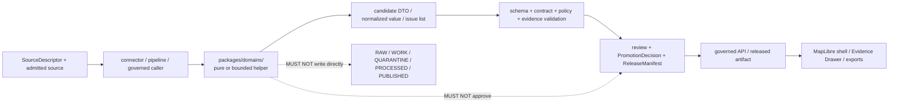

<!-- [KFM_META_BLOCK_V2]
doc_id: kfm://doc/packages-domains-readme
title: packages/domains/ — Governed Domain Helper Package Registry
type: readme; directory-readme; packages-subroot; domain-helper-registry; shared-library-boundary; mixed-maturity-index; compatibility-drift-index
version: v0.2
status: draft; repository-grounded; canonical-packages-subroot; mixed-maturity; placeholder-heavy; package-wide-validation-unestablished; non-authoritative
owners: OWNER_TBD — Package steward · Domain stewards · Consumer owners · Contract/schema/policy stewards · Evidence/release stewards · Validation/CI steward · Security and sensitivity reviewers · Docs steward
created: 2026-06-13
updated: 2026-07-23
supersedes: v0.1 planning-oriented domain-package contract
prepared_under_prompt: KFM Markdown Engineering, Modernization & GitHub Documentation Implementation Agent v5.0.0
policy_label: public-doc; packages; domain-helpers; shared-reusable-code; non-deployable; no-truth-authority; no-contract-authority; no-schema-authority; no-policy-authority; no-lifecycle-authority; no-release-authority; governed-interface-only; compatibility-aware; correction-aware; rollback-aware
current_path: packages/domains/README.md
truth_posture: >
  CONFIRMED existing packages/domains README and responsibility-root placement; Directory Rules v1.4
  required folder-README contract; parent packages root contract; CODEOWNERS /packages route;
  fifteen checked direct child README lanes; thirteen doctrine-aligned direct domain lanes with
  pyproject.toml surfaced by bounded current-commit search; sampled 0.0.0 greenfield manifests and
  src-layout scaffolds; settlement and transport compatibility/narrow READMEs without pyproject.toml
  at the checked direct paths; nested archaeology, fauna, flora, roads-rail-trade, and src helper
  lanes; domain-agriculture readiness workflow that records explicit validation/proof/release holds /
  PROPOSED package admission, dependency-direction, interface, test, fixture, compatibility,
  deprecation, correction, distribution, and rollback requirements /
  CONFLICTED settlement versus settlements-infrastructure; transport versus roads-rail-trade;
  child READMEs that still describe tracked package surfaces as unverified; package-local versus
  tests/domains and fixtures/domains validation homes; domain package names that can be mistaken
  for semantic or policy authority /
  UNKNOWN exhaustive recursive inventory, all manifests and exports, complete dependency graph,
  consumers, executable helper behavior, package-wide CI, build backends, Python requirements,
  dependency locks, registry distribution, runtime use, production health, and public effects /
  NEEDS VERIFICATION named owners, accepted slug and compatibility decisions, complete consumer
  map, package APIs, package-specific test commands, supply-chain admission, supported compatibility
  windows, distribution policy, deprecation records, correction propagation, and rollback drills
evidence_snapshot:
  repository: bartytime4life/Kansas-Frontier-Matrix
  repository_id: "1059091169"
  visibility: public
  base_ref: main
  base_commit: 939e1f1f742a9ed02997a3eef03f0c5b8a2e70a4
  prior_blob: 91ddf52a59932456b74b82d2710987f307bd0d80
  parent_packages_blob: 154e1c9a8b841397bceb52e6b4933b241906ab9a
  directory_rules_blob: 2affb080e6f0043867c64c7f06c1ca52030fbd55
  codeowners_blob: dd2a84aa514d8ecd9208bc347f90f9a2ed37dd61
  domain_agriculture_workflow_blob: 1dd9938b92de61c7d905f30170cf6394e6c06ea1
  direct_child_readme_lanes: 15
  doctrine_aligned_manifest_lanes_surfaced: 13
  compatibility_or_narrow_lanes:
    - settlement
    - transport
  checked_absent_alias_readmes:
    - packages/domains/air/README.md
    - packages/domains/ecology/README.md
    - packages/domains/people/README.md
    - packages/domains/land-ownership/README.md
  inventory_method: exact GitHub file reads and checked-path probes plus bounded current-commit code search; counts and absence findings do not establish a full recursive, all-branch, generated-file, ignored-file, or runtime-consumer inventory
related:
  - ../README.md
  - ../../package.json
  - ../../pyproject.toml
  - ../../Makefile
  - ../../docs/doctrine/directory-rules.md
  - ../../docs/doctrine/trust-membrane.md
  - ../../docs/doctrine/lifecycle-law.md
  - ../../docs/architecture/domain-placement-law.md
  - ../../docs/architecture/contract-schema-policy-split.md
  - ../../docs/adr/ADR-0001-schema-home--schemas-contracts-v1-is-canonical.md
  - ../../docs/adr/ADR-0002-contracts-vs-schemas-split.md
  - ../../docs/adr/ADR-0004-apps-governed-api-is-the-trust-membrane.md
  - ../../docs/adr/ADR-0011-receipts-vs-proofs-vs-manifests-vs-catalog-separation.md
  - ../../docs/domains/README.md
  - ../../contracts/domains/
  - ../../schemas/contracts/v1/domains/
  - ../../policy/domains/
  - ../../tests/domains/
  - ../../fixtures/domains/
  - ../../pipelines/domains/
  - ../../pipeline_specs/
  - ../../data/registry/sources/
  - ../../data/receipts/
  - ../../data/proofs/
  - ../../release/
  - ../../.github/CODEOWNERS
  - ../../.github/workflows/domain-agriculture.yml
tags: [kfm, packages, domains, domain-lanes, shared-libraries, python-scaffolds, package-boundary, source-role, sensitivity, trust-membrane, compatibility, drift, tests, correction, rollback]
notes:
  - "v0.2 is a same-path repository-grounded modernization; it changes this README and its generated provenance receipt only."
  - "The first twelve H2 sections follow Directory Rules §15 exactly."
  - "The bounded domain registry is an orientation index, not a recursive manifest, import graph, supported-package list, or implementation attestation."
  - "No package source, manifest, dependency, export, test, fixture, workflow, schema, contract, policy, lifecycle record, release object, deployment, runtime, or public artifact is created or changed."
  - "The v0.1 document remains recoverable through the recorded prior blob and the no-loss ledger."
[/KFM_META_BLOCK_V2] -->

<a id="top"></a>
<a id="packages-domains"></a>

# `packages/domains/` — Governed Domain Helper Package Registry

> **One-line purpose.** Index reusable, non-deployable helper-package lanes for KFM domains while keeping domain truth, object meaning, machine shape, policy, lifecycle state, evidence closure, release, and public delivery in their governing responsibility roots.

<p>
  <a href="#status"></a>
  <a href="#authority-level"></a>
  <a href="#current-bounded-domain-package-inventory"></a>
  <a href="#current-bounded-domain-package-inventory"></a>
  <a href="#status"></a>
  <a href="#compatibility-and-slug-drift"></a>
  <a href="#trust-membrane-and-public-boundary"></a>
</p>

> [!IMPORTANT]
> **A tracked README, `pyproject.toml`, `src/` tree, `0.0.0` version, importable module, or green workflow does not prove a supported domain capability.** Current repository evidence is placeholder-heavy and uneven. Package outputs remain candidates until the appropriate contracts, schemas, policy, evidence, lifecycle, and release gates close elsewhere.

> [!CAUTION]
> **Domain package names are not authority declarations.** A helper under `packages/domains/fauna/` cannot decide fauna truth; a normalizer under `packages/domains/soil/` cannot turn one support type into another; a people/DNA/land helper cannot infer consent or identity authority; and a transport or settlement alias cannot create a second canonical domain lane.

> [!WARNING]
> **Software packaging is not KFM publication.** Building or distributing a wheel, source archive, workspace package, image, or registry object does not promote domain data, validate evidence, allow policy, approve release, or make a claim `PUBLISHED`.

**Quick navigation**

| Required root contract | Repository inventory | Change and operation |
|---|---|---|
| [Purpose](#purpose) · [Authority](#authority-level) · [Status](#status) · [Belongs](#what-belongs-here) · [Exclusions](#what-does-not-belong-here) · [Inputs](#inputs) · [Outputs](#outputs) | [Validation](#validation) · [Inventory](#current-bounded-domain-package-inventory) · [Maturity](#package-maturity-model) · [Dependencies](#dependency-direction-and-boundaries) · [Sensitivity](#sensitive-domain-obligations) | [Review](#review-burden) · [Related](#related-folders) · [ADRs](#adrs) · [Admission](#package-admission-and-graduation) · [Compatibility](#compatibility-and-slug-drift) · [Rollback](#compatibility-versioning-correction-and-rollback) · [Open](#open-verification-register) |

---

## Purpose

`packages/domains/` is the KFM shared-library subroot for reusable domain-specific implementation helpers.

A helper belongs here when it is reusable across more than one governed caller—or is clearly a domain-bounded library—and its primary responsibility is implementation behavior rather than deployment, source acquisition, pipeline orchestration, repository-wide validation, semantic authority, machine-shape authority, policy, lifecycle storage, evidence closure, or release control.

```text
packages/domains/<domain>/   = reusable domain helper implementation
docs/domains/<domain>/       = domain scope, doctrine, status, and human control plane
contracts/domains/<domain>/  = domain object meaning
schemas/contracts/v1/domains/<domain>/
                             = domain machine-checkable shape
policy/domains/<domain>/      = domain admissibility and exposure rules
connectors/                   = source-specific acquisition and admission
pipelines/domains/<domain>/   = executable domain lifecycle transformations
pipeline_specs/<domain>/      = declarative run configuration
data/<phase>/<domain>/        = lifecycle state and emitted records
release/                      = release, correction, withdrawal, and rollback decisions
apps/governed-api/            = public dynamic trust membrane
apps/explorer-web/            = governed map-first client
```

This README is an orientation and governance surface. It does not activate a package, approve an API, accept a dependency, establish a test pass rate, authorize distribution, or publish a KFM claim or artifact.

[Back to top](#top)

---

## Authority level

**Implementation-bearing shared-library subroot under canonical `packages/`; non-authoritative for truth, object meaning, machine shape, policy, source admission, lifecycle state, evidence closure, release, deployment, and publication.**

| Question | Answer | Evidence posture |
|---|---|---:|
| Why does this subroot exist? | To group reusable domain-bounded helpers without creating domain roots at repository top level. | **CONFIRMED** placement doctrine |
| Does a package define domain truth? | No. It may transform explicit inputs into candidate outputs while preserving limitations and provenance. | **CONFIRMED** trust boundary |
| Does a package own contracts or schemas? | No. It may consume accepted contracts and generated/schema-bound types, but authority stays in `contracts/` and `schemas/`. | **CONFIRMED** authority split |
| May a package decide policy or sensitivity? | No. It may accept a `PolicyDecision` or transform instruction as input and return a candidate result; it may not invent the decision. | **CONFIRMED** policy boundary |
| May a package read or write lifecycle stores? | Not as hidden behavior. IO belongs in an authorized app, connector, pipeline, worker, or tool with explicit review and receipts. | **PROPOSED** package rule; current consumers **UNKNOWN** |
| May public clients import domain packages directly? | No. Public dynamic access crosses the governed API; released static artifacts cross governed delivery surfaces. | **CONFIRMED** trust-membrane posture |
| Does package distribution imply KFM release? | No. Software distribution and KFM domain publication are separate state machines. | **CONFIRMED** anti-collapse rule |

### Trust membrane and public boundary



The diagram is a responsibility model, not proof that every arrow is implemented.

[Back to top](#top)

---

## Status

| Surface | Current bounded status | Safe conclusion |
|---|---|---|
| Root README | **CONFIRMED** | `packages/domains/README.md` exists and previously described a planning-oriented package contract. |
| Direct child README lanes | **CONFIRMED: 15 checked** | Thirteen doctrine-aligned lanes plus `settlement/` and `transport/` compatibility/narrow lanes have tracked READMEs at checked paths. |
| Direct doctrine-aligned manifests | **CONFIRMED: 13 surfaced by bounded search** | `pyproject.toml` is present for the thirteen doctrine-aligned direct lanes. This does not prove buildability. |
| Sampled manifest posture | **PLACEHOLDER** | Sampled manifests declare only a project name and `0.0.0`; build backend, dependencies, Python requirement, exports, and distribution remain unestablished. |
| Nested helper/source lanes | **CONFIRMED mixed scaffolds** | Tracked nested READMEs exist in selected archaeology, fauna, flora, roads-rail-trade, and `src/` subtrees. Executable behavior is not inferred. |
| Compatibility/narrow lanes | **CONFIRMED READMEs** | `settlement/` and `transport/` exist as documentation surfaces; no direct `pyproject.toml` was found at the checked paths. |
| Package-wide test command | **NOT ESTABLISHED** | Root package scripts remain TODO-oriented and the Makefile does not define a package-domain test target. |
| Domain CI | **READINESS/HOLD oriented** | The inspected Agriculture workflow checks boundary presence and explicit holds; it does not execute package-domain behavior or prove release readiness. |
| Consumers/import graph | **UNKNOWN** | No exhaustive import graph or runtime consumer inventory was produced. |
| Build reproducibility and distribution | **UNKNOWN** | Lockfile strategy, build backend parity, registry publication, signatures, and compatibility support are unverified. |
| Production behavior or public effect | **UNKNOWN / DENY inference** | A package path or workflow cannot be cited as production or publication proof. |

### Truth labels used here

| Label | Meaning |
|---|---|
| `CONFIRMED` | Verified from current repository files, exact checked paths, or bounded current-commit search. |
| `PROPOSED` | A recommended interface, rule, test, migration, or maturity requirement not established as current behavior. |
| `CONFLICTED` | Current paths, slugs, or documents create competing expectations. |
| `UNKNOWN` | Not observable or not established from inspected evidence. |
| `NEEDS VERIFICATION` | Checkable, but not sufficiently proven for operational reliance. |
| `DENY` | A prohibited truth, policy, evidence, lifecycle, release, public-access, or publication interpretation. |

[Back to top](#top)

---

## What belongs here

Accepted content is reusable domain-bounded implementation code and its package-local support material, including:

- pure or side-effect-minimal mapping, parsing, normalization, comparison, and crosswalk helpers;
- candidate DTO builders that preserve source-native values, source role, evidence references, limitations, uncertainty, and time kinds;
- deterministic identity-input preparation that does not claim identity authority;
- schema-bound adapters or generated types with generator identity, schema version, hash, and regeneration tests;
- policy-instruction consumers that apply an already-authorized transform without inventing the policy decision;
- public-safe transformation helpers whose outputs remain candidates pending policy, review, evidence, and release;
- explicit finite-result and issue structures rather than silent coercion;
- package-local constants or value objects that do not duplicate contract or schema authority;
- synthetic, sanitized, no-network test helpers and fixtures when the accepted test-home convention permits them;
- compatibility adapters with documented old/new interfaces, consumer migration, sunset criteria, and rollback;
- package manifests, source trees, changelogs, and README files that truthfully describe the package maturity.

### Good placement test

> Put a file here only when its primary job is reusable domain implementation behavior. Move it elsewhere when its primary job is source acquisition, pipeline orchestration, repository-wide validation, object meaning, machine shape, policy, lifecycle storage, proof, release, deployment, or UI rendering.

[Back to top](#top)

---

## What does NOT belong here

| Prohibited or misplaced content | Correct responsibility home |
|---|---|
| Domain doctrine, scope, source-role law, or public interpretation rules | `docs/domains/<domain>/` |
| Object-family meaning | `contracts/domains/<domain>/` |
| `.schema.json` files or canonical field constraints | `schemas/contracts/v1/domains/<domain>/` |
| Allow/deny/restrict/hold/abstain logic | `policy/domains/<domain>/` and cross-cutting policy roots |
| Live-source clients, credentials, endpoint acquisition, or source admission | `connectors/`, `data/registry/sources/`, and policy |
| Executable lifecycle orchestration | `pipelines/domains/<domain>/` |
| Declarative run definitions | `pipeline_specs/<domain>/` |
| RAW, WORK, QUARANTINE, PROCESSED, CATALOG/TRIPLET, or PUBLISHED records | `data/<phase>/<domain>/` |
| Canonical receipts or proofs | `data/receipts/` and `data/proofs/` |
| Promotion decisions, release manifests, correction notices, or rollback cards | `release/` |
| Public API routes or trust decisions | `apps/governed-api/` |
| Map/UI components and renderer logic | `apps/explorer-web/` or accepted shared UI/MapLibre packages |
| Repository-wide validators and migration tools | `tools/` or `migrations/` |
| Source-shaped sensitive examples or exact protected locations | Governed fixtures only after policy review; otherwise quarantine or deny |
| Duplicate canonical domain slugs or alias implementations | Canonical lane plus an ADR-backed compatibility/migration plan |
| Secrets, tokens, local paths, private source data, or unrestricted personal/DNA data | Never commit; use approved secret and restricted-data controls |

### Anti-collapse rules

```text
package README       != implemented package
pyproject.toml       != buildable distribution
0.0.0 version        != supported API
parser output        != domain observation truth
normalizer output    != canonical identity
crosswalk output     != source authority
redaction candidate  != policy approval
validation helper    != validation pass
unit-test success    != lifecycle promotion
wheel publication    != KFM publication
```

[Back to top](#top)

---

## Inputs

Domain packages should receive explicit, bounded inputs from governed callers.

| Input class | Expected form | Required preservation |
|---|---|---|
| Candidate source record | In-memory object or schema-bound DTO supplied by caller | Native identifiers/values, source role, retrieval/source time, limitations |
| Contract/schema reference | Versioned contract/schema ID or generated type metadata | Version, hash/spec hash, generator identity where applicable |
| Evidence context | `EvidenceRef` identifiers or immutable evidence metadata | No fabrication, mutation, or silent dropping |
| Policy context | Existing `PolicyDecision`, transform instruction, access class, or sensitivity label | Decision ID/version, obligations, withheld/generalized fields |
| Temporal context | Valid, observed, source, retrieval, release, or correction times as applicable | Time-kind distinction and timezone/precision |
| Geometry context | Candidate geometry plus CRS, accuracy, provenance, sensitivity, and transform refs | Exact/public-safe separation and transform lineage |
| Configuration | Explicit caller-provided immutable config or accepted package config object | Config version/hash and deterministic defaults |
| Test data | Synthetic or sanitized no-network fixture | Public-safe classification and expected outcome |

A package should not silently read network endpoints, environment secrets, lifecycle stores, release state, or canonical databases. Where IO is genuinely required, the executable caller owns the adapter and emits the appropriate receipt.

[Back to top](#top)

---

## Outputs

Allowed outputs remain implementation candidates, not final truth objects:

- normalized values with original values retained or traceably referenced;
- candidate DTOs or value objects tied to contract/schema versions;
- deterministic local keys or identity inputs with method/version metadata;
- explicit issue, warning, limitation, and finite-result structures;
- candidate crosswalk relations that preserve both source classifications;
- candidate public-safe transforms with transform parameters and lineage;
- validation inputs or package-local validation diagnostics;
- serialized package objects only when the format is versioned and non-authoritative;
- test builders and expected-result objects for deterministic validation.

Outputs must not claim to be:

- an admitted source or `SourceDescriptor`;
- a canonical domain record solely because a package produced it;
- an `EvidenceBundle`, `PolicyDecision`, `PromotionDecision`, `ReleaseManifest`, or publication receipt;
- a direct lifecycle transition;
- a public API response or map layer authorized for display;
- legal, medical, emergency, title, consent, identity, or scientific decision authority.

### Expected caller handling

```text
package output
  -> caller validates against accepted contract/schema
  -> caller applies policy and sensitivity obligations
  -> caller resolves evidence and review state
  -> authorized pipeline or release process records lifecycle transition
  -> governed interface exposes only released/public-safe result
```

[Back to top](#top)

---

## Validation

### Current evidence

No package-domain-wide executable validation command was established in the inspected root scripts or Makefile.

The inspected `.github/workflows/domain-agriculture.yml` is a **readiness workflow**: it verifies expected boundary files and deliberately reports `WORKFLOW_HOLD` while executable tests and validators are absent. That is useful maturity evidence, but it is not package behavior, evidence closure, policy approval, or release proof.

### Minimum validation profile for a domain package

A package SHOULD graduate only with evidence for the applicable checks:

1. **Manifest validation** — parse metadata; require explicit build backend, Python/runtime range, dependencies, package discovery, and license posture before distribution.
2. **Source-layout validation** — import package and declared exports exist; no placeholder-only module is presented as implemented.
3. **Unit tests** — deterministic, no-network tests cover success, malformed input, unsupported value, ambiguity, and finite failure outcomes.
4. **Contract/schema parity** — generated or hand-written adapters round-trip accepted fixtures and fail closed on incompatible versions.
5. **Boundary tests** — package code does not import deployable apps, source connectors, executable pipelines, release writers, or canonical lifecycle stores.
6. **Policy non-authority tests** — package cannot invent allow/deny decisions or silently remove sensitivity obligations.
7. **Evidence-preservation tests** — evidence refs, source role, limitations, uncertainty, and time kinds survive transformations.
8. **Sensitive-domain tests** — exact locations, living-person/DNA data, infrastructure detail, cultural material, and rights-limited fields fail closed.
9. **Compatibility tests** — old/new interfaces, migration fixtures, deprecation windows, and rollback remain explicit.
10. **Consumer tests** — verified callers exercise the supported interface without bypassing the governed API or lifecycle.
11. **Supply-chain checks** — dependency review, vulnerability scanning, hashes/locks, and build reproducibility are recorded.
12. **Documentation checks** — README links, anchors, examples, commands, status, owners, and maturity claims match repository evidence.

### Validation evidence is bounded

A package can pass unit tests and still fail source admission, rights, sensitivity, evidence, release, or public-safety gates. The final outward states remain governed elsewhere.

[Back to top](#top)

---

## Review burden

`/.github/CODEOWNERS` currently routes `/packages/` to `@bartytime4life`. That is a GitHub review route, not proof of an assigned package steward, domain steward, sensitivity reviewer, or completed independent review.

Changes should receive review proportional to consequence:

| Change | Minimum review concern |
|---|---|
| README, comment, or non-semantic example | Package/docs owner; verify no maturity overclaim |
| Internal helper with no interface change | Package owner plus affected consumer |
| Public package interface or generated type | Package owner, consumer owner, contract/schema steward |
| Identity, temporal, crosswalk, evidence, or source-role logic | Domain steward plus evidence/identity/temporal reviewer |
| Redaction, generalization, rights, sensitivity, living-person, DNA, archaeology, rare-species, or infrastructure logic | Policy/sensitivity/security reviewer and affected domain steward |
| Dependency or build/distribution change | Package owner, supply-chain/security reviewer, CI owner |
| Alias creation, canonical slug change, move, merge, or retirement | Package/domain/docs stewards plus ADR/migration review |
| Change that affects a released consumer | Release/correction/rollback owner in addition to implementation reviewers |

The author or generator must not be treated as the sole approver for policy-significant or release-significant behavior.

[Back to top](#top)

---

## Related folders

| Responsibility | Related path |
|---|---|
| Parent shared-package contract | [`packages/README.md`](../README.md) |
| Domain doctrine and indexes | [`docs/domains/`](../../docs/domains/README.md) |
| Domain object meaning | [`contracts/domains/`](../../contracts/domains/) |
| Domain machine shape | [`schemas/contracts/v1/domains/`](../../schemas/contracts/v1/domains/) |
| Domain policy | [`policy/domains/`](../../policy/domains/) |
| Source-specific acquisition | [`connectors/`](../../connectors/README.md) |
| Domain transformations | [`pipelines/domains/`](../../pipelines/domains/) |
| Declarative pipeline specs | [`pipeline_specs/`](../../pipeline_specs/README.md) |
| Domain tests | [`tests/domains/`](../../tests/domains/) |
| Domain fixtures | [`fixtures/domains/`](../../fixtures/domains/) |
| Source registry | [`data/registry/sources/`](../../data/registry/sources/) |
| Receipts | [`data/receipts/`](../../data/receipts/README.md) |
| Proofs and EvidenceBundles | [`data/proofs/`](../../data/proofs/README.md) |
| Release, correction, and rollback decisions | [`release/`](../../release/README.md) |
| Public dynamic boundary | [`apps/governed-api/`](../../apps/governed-api/README.md) |
| Map-first client | [`apps/explorer-web/`](../../apps/explorer-web/README.md) |
| Package review routing | [`.github/CODEOWNERS`](../../.github/CODEOWNERS) |

A related path is not automatically canonical, implemented, complete, or accepted. Read its README, ADR status, and current repository evidence before relying on it.

[Back to top](#top)

---

## ADRs

The following decisions are materially related. Their presence does not imply acceptance; use the status recorded in each ADR and the current ADR index.

- [`ADR-0001 — schema home`](../../docs/adr/ADR-0001-schema-home--schemas-contracts-v1-is-canonical.md): machine schemas remain under `schemas/`, not domain packages.
- [`ADR-0002 — contracts versus schemas`](../../docs/adr/ADR-0002-contracts-vs-schemas-split.md): packages consume meaning and shape; they do not collapse them.
- [`ADR-0004 — governed API trust membrane`](../../docs/adr/ADR-0004-apps-governed-api-is-the-trust-membrane.md): packages are not a public client boundary.
- [`ADR-0011 — receipts, proofs, manifests, and catalogs remain separate`](../../docs/adr/ADR-0011-receipts-vs-proofs-vs-manifests-vs-catalog-separation.md): packages may preserve references but do not own these artifact families.

An ADR or accepted migration record is required before:

- creating a new canonical domain slug that competes with the domain register;
- converting `settlement/` or `transport/` into implementation-bearing parallel lanes;
- merging, renaming, or retiring direct domain package lanes;
- creating a second contract, schema, policy, source-registry, proof, receipt, or release home;
- changing package placement or dependency direction in a way that bends Directory Rules.

[Back to top](#top)

---

## Last reviewed

**2026-07-23**

Review this README again when any of the following occurs:

- a direct domain lane is added, removed, renamed, merged, or reclassified;
- a compatibility lane gains executable code or a manifest;
- package-wide test or build tooling lands;
- a domain package graduates from placeholder to supported interface;
- distribution, lockfile, or compatibility policy is accepted;
- a public or release-significant consumer begins using a domain package;
- six months pass without review.

[Back to top](#top)

---

## Current bounded domain-package inventory

The table below is a current-commit orientation index, not a recursive file manifest or implementation attestation.

| Lane | Direct README | Direct `pyproject.toml` surfaced | Bounded posture | Domain-specific caution |
|---|---:|---:|---|---|
| [`agriculture/`](agriculture/README.md) | Yes | Yes | Repository-grounded `0.0.0` Python scaffold; executable API unestablished | Field/operator/private-parcel and aggregation claims require policy and evidence |
| [`archaeology/`](archaeology/README.md) | Yes | Yes | Mixed scaffold with nested candidate, evidence, generalization, identity, and `src/` lanes | Exact locations and culturally sensitive context fail closed |
| [`atmosphere/`](atmosphere/README.md) | Yes | Yes | Python scaffold; package behavior unverified | Model fields, AQI, AOD, observations, and official advisories must not collapse |
| [`fauna/`](fauna/README.md) | Yes | Yes | Mixed scaffold with identity, normalize, public-safe, and `src/` lanes | Sensitive taxa and occurrence geometry require geoprivacy |
| [`flora/`](flora/README.md) | Yes | Yes | Python scaffold with multiple evidence/source-role helper lanes | Rare/protected/culturally sensitive plant locations fail closed |
| [`geology/`](geology/README.md) | Yes | Yes | Python scaffold; current README still overstates implementation uncertainty | Physical geology, modeled potential, legal rights, and extraction records remain distinct |
| [`habitat/`](habitat/README.md) | Yes | Yes | `0.0.0` Python scaffold; executable API unestablished | Suitability and connectivity models remain interpretive derivatives |
| [`hazards/`](hazards/README.md) | Yes | Yes | Python scaffold; domain workflow maturity remains bounded | KFM is not an emergency alert authority |
| [`hydrology/`](hydrology/README.md) | Yes | Yes | Python scaffold in the designated first proof-bearing domain; helper maturity still unverified | Regulatory flood context is not observed inundation; provisional data stays labeled |
| [`people-dna-land/`](people-dna-land/README.md) | Yes | Yes | Restricted-review Python scaffold | Living-person, DNA/genomic, consent, title, and residential detail deny by default |
| [`roads-rail-trade/`](roads-rail-trade/README.md) | Yes | Yes | Python scaffold with generalization, graph-projection, and `src/` lanes | Historical interpretation, legal access, operational status, and routing remain separate |
| [`settlements-infrastructure/`](settlements-infrastructure/README.md) | Yes | Yes | `0.0.0` Python scaffold; executable API unestablished | Sensitive infrastructure and legal/operational status require controlled exposure |
| [`soil/`](soil/README.md) | Yes | Yes | `0.0.0` Python scaffold with `src/` lane | Static survey, station observation, gridded derivative, satellite, and interpretation support must not collapse |
| [`settlement/`](settlement/README.md) | Yes | No at checked path | Narrow or compatibility lane; canonical relationship unresolved | Must not compete with `settlements-infrastructure/` |
| [`transport/`](transport/README.md) | Yes | No at checked path | Compatibility/search-aid lane | Must not compete with `roads-rail-trade/` |

### Checked alias results

At the exact current-commit paths inspected:

- `packages/domains/air/README.md` — not found;
- `packages/domains/ecology/README.md` — not found;
- `packages/domains/people/README.md` — not found;
- `packages/domains/land-ownership/README.md` — not found.

These checked-path results do not prove that the words, generated files, ignored files, historical branches, or differently named subtrees are absent elsewhere.

### Nested examples confirmed by bounded search

The repository also contains nested package documentation such as:

- `archaeology/candidate-classifier/`, `archaeology/evidence-projection/`, `archaeology/generalization/`, `archaeology/identity/`, and `archaeology/src/`;
- `fauna/identity/`, `fauna/normalize/`, `fauna/public_safe/`, and `fauna/src/`;
- `flora/evidence/`, `flora/flora_evidence_projector/`, `flora/source_role_resolver/`, and other helper lanes;
- `roads-rail-trade/generalization/`, `roads-rail-trade/graph_projection/`, and `roads-rail-trade/src/`;
- multiple domain `src/<import_package>/README.md` surfaces.

Nested documentation is not evidence that corresponding modules are executable, imported, supported, or correctly placed. Each child README and manifest must be verified independently.

[Back to top](#top)

---

## Package maturity model

| Level | Required evidence | Permitted claim |
|---|---|---|
| **L0 — documentation boundary** | README only or planning docs | “A governed package lane is documented.” |
| **L1 — scaffold** | Manifest, source layout, placeholder/empty module, version metadata | “A package scaffold exists.” |
| **L2 — executable helper** | Implemented interface, deterministic unit tests, invalid fixtures, explicit dependencies | “The named helper behavior works for tested cases.” |
| **L3 — integrated package** | Verified consumers, boundary tests, schema/contract parity, CI command, compatibility policy | “The package is integrated for the named governed callers.” |
| **L4 — supported distribution** | Reproducible build, lock/hash strategy, supply-chain review, versioning, release notes, rollback | “The software distribution is supported for its declared consumers.” |
| **KFM domain publication** | Evidence, policy, lifecycle, promotion, release manifest, correction, rollback | **Separate from package maturity; never inferred from L0–L4.** |

The current parent posture is **mixed L0–L1 with isolated nested scaffolds**. No repository-wide claim upgrades every domain lane to L2 or above.

[Back to top](#top)

---

## Dependency direction and boundaries

### Preferred direction

```text
apps / pipelines / workers / tools / tests
  -> packages/domains/<domain>
  -> shared packages such as identity, temporal, geo, hashing, evidence helpers
  -> explicit candidate output
```

### Prohibited or review-triggering direction

```text
packages/domains/<domain>
  -X-> apps/
  -X-> connectors/ live acquisition
  -X-> pipelines/ orchestration
  -X-> data/ lifecycle writes
  -X-> release/ approval or mutation
  -X-> direct public rendering or model client
```

A package may depend on another package only when the dependency is narrower, reusable, non-cyclic, and does not transfer authority. Cross-domain dependencies should usually pass through an explicit relation/crosswalk contract rather than importing one domain's internal model into another.

### Interface rules

A mature helper interface should be:

- intention-revealing and domain-bounded;
- deterministic where practical;
- explicit about units, CRS, precision, time kind, source role, uncertainty, and limitations;
- free of hidden network, secret, lifecycle, policy, or release access;
- versioned with compatibility behavior;
- able to return `ABSTAIN`, `DENY`, or structured failure where caller policy or evidence is insufficient;
- testable with public-safe no-network fixtures;
- documented without promising more than current evidence proves.

[Back to top](#top)

---

## Sensitive domain obligations

| Domain family | Package-level non-negotiable |
|---|---|
| Archaeology / cultural heritage | Preserve exact/internal versus public-safe geometry; never approve disclosure or infer site confirmation. |
| Fauna and flora | Preserve geoprivacy, sensitivity tier, source-obscured coordinates, and transform lineage. |
| People / DNA / land | Treat living-person, DNA/genomic, consent, relationship, title, residential, and culturally sensitive details as restricted by default. |
| Settlements / infrastructure | Keep public context separate from exact sensitive infrastructure, operational state, vulnerability, and access detail. |
| Roads / rail / trade | Do not turn graph connectivity into legal access, routing advice, current operational status, or historical certainty. |
| Hazards and atmosphere | Do not issue life-safety guidance or replace official authorities; preserve observation/model/advisory distinctions. |
| Soil, hydrology, geology, habitat, agriculture | Preserve support type, interpretation/model status, temporal scope, source role, scale, uncertainty, and fitness for use. |

Public-safe transformation logic may be implemented as a helper, but the decision to apply it and the authorization to expose the result remain policy/review/release responsibilities.

[Back to top](#top)

---

## Package admission and graduation

Before new implementation lands under a direct domain lane:

1. **Identity** — canonical lane and package name are verified; compatibility aliases are not used as parallel implementation homes.
2. **Responsibility** — the behavior is reusable library logic, not a connector, pipeline, validator, policy, lifecycle writer, app, or release tool.
3. **Consumers** — at least one grounded consumer is identified; shared placement is justified.
4. **Interface** — inputs, outputs, finite failures, side effects, and non-authority are documented.
5. **Contract/schema** — relevant object meaning and machine shape are accepted or explicitly versioned as proposed.
6. **Policy/sensitivity** — obligations and fail-closed behavior are identified before sensitive transforms are implemented.
7. **Evidence/time/identity** — refs, roles, limitations, uncertainty, and time kinds are preserved.
8. **Tests/fixtures** — deterministic no-network valid/invalid/sensitive cases exist.
9. **Dependencies** — build backend, runtime range, dependencies, lock/hash strategy, and supply-chain review are explicit.
10. **CI** — a command-bearing workflow runs the actual package checks rather than only verifying placeholders.
11. **Compatibility** — migration, deprecation, consumer impact, and rollback are documented.
12. **Documentation** — README maturity claims and examples match the actual code.

A package should not graduate because a README was expanded, a placeholder workflow stayed green, or a manifest was added.

[Back to top](#top)

---

## Compatibility and slug drift

### `settlement/` versus `settlements-infrastructure/`

`settlements-infrastructure/` matches the broader KFM domain lane and has a direct package manifest. `settlement/` is currently a tracked narrow/compatibility README without a direct manifest at the checked path.

Until an accepted ADR or migration record resolves the relationship:

- do not add duplicate implementation to both lanes;
- direct new shared domain implementation to `settlements-infrastructure/` unless a narrower accepted package boundary is documented;
- treat references to `settlement/` as compatibility or specialized scope, not canonical replacement;
- preserve links and consumers during any later move or retirement.

### `transport/` versus `roads-rail-trade/`

`transport/` explicitly identifies itself as a compatibility/search-aid surface. `roads-rail-trade/` is the doctrine-aligned implementation lane and has a direct package manifest.

Do not add executable code, schemas, policy, tests, fixtures, or lifecycle artifacts under `transport/` without an ADR-backed migration or alias strategy.

### Other slug cautions

The exact alias README checks for `air`, `ecology`, `people`, and `land-ownership` returned not found. Older docs or other responsibility roots may still use those words. Do not create matching package lanes merely for naming symmetry.

[Back to top](#top)

---

## Compatibility, versioning, correction, and rollback

A package change must distinguish four independent concerns:

1. **Software versioning** — package interface and distribution compatibility.
2. **Data/contract versioning** — domain object shape and meaning.
3. **KFM release state** — governed publication of domain data or claims.
4. **Documentation state** — what the README says is implemented.

### Reversible change rules

- preserve old/new interface fixtures during a compatibility window;
- record consumer migration before removing an export or moving a module;
- use `git mv` for path changes and update imports, docs, tests, workflows, and receipts;
- retain deprecation and supersession notes instead of silently deleting lineage;
- do not rewrite released domain artifacts merely because a package implementation changes;
- emit correction or reprocessing work through governed lifecycle/release processes when package defects affected released outputs;
- keep compatibility aliases documentation-only unless an accepted plan explicitly requires a temporary shim;
- remove a shim only after consumers and rollback have been verified.

### Rollback for this README

Revert this file and its generated provenance receipt together. The prior v0.1 blob remains the exact rollback target. No package source, dependency, test, workflow, lifecycle data, release state, or public artifact changes in this documentation-only update.

[Back to top](#top)

---

## Open verification register

| ID | Question | Current status |
|---|---|---|
| `PKG-DOM-001` | What is the complete recursive direct/nested package inventory at the review commit? | `NEEDS VERIFICATION` |
| `PKG-DOM-002` | Which direct manifests share the same placeholder shape, build backend gap, and `0.0.0` status? | `NEEDS VERIFICATION` |
| `PKG-DOM-003` | Which package modules contain executable behavior versus comments, empty initializers, or documentation only? | `UNKNOWN` |
| `PKG-DOM-004` | Which apps, pipelines, tools, workers, or tests import each package? | `UNKNOWN` |
| `PKG-DOM-005` | What package-manager, lockfile, build, and distribution strategy is accepted? | `UNKNOWN` |
| `PKG-DOM-006` | Where should package-local tests and fixtures live relative to `tests/domains/` and `fixtures/domains/`? | `CONFLICTED / NEEDS ADR OR ROOT CONTRACT` |
| `PKG-DOM-007` | Which command and workflow validate all domain packages with non-vacuity checks? | `UNKNOWN` |
| `PKG-DOM-008` | Are `settlement/` and `transport/` temporary aliases, permanent narrow packages, or retirement candidates? | `CONFLICTED / NEEDS ADR` |
| `PKG-DOM-009` | Which generated adapters exist, which schemas produced them, and how is regeneration verified? | `UNKNOWN` |
| `PKG-DOM-010` | Which cross-domain imports are allowed, and how are cycles/source-role collapse prevented? | `NEEDS VERIFICATION` |
| `PKG-DOM-011` | Which dependencies have rights, vulnerability, maintenance, and supply-chain approval? | `UNKNOWN` |
| `PKG-DOM-012` | Which packages have supported compatibility windows, deprecation records, and rollback drills? | `UNKNOWN` |
| `PKG-DOM-013` | Which domain package changes have affected released outputs and require correction/reprocessing lineage? | `UNKNOWN` |
| `PKG-DOM-014` | Which named stewards and independent reviewers are authorized for each domain? | `NEEDS VERIFICATION` |

[Back to top](#top)

---

## No-loss modernization ledger

| v0.1 material | v0.2 disposition |
|---|---|
| Shared-library purpose and non-authority boundary | Retained and strengthened in `Purpose`, `Authority level`, and anti-collapse rules |
| Placement comparison across docs/contracts/schemas/policy/pipelines/data/release | Retained and corrected to current responsibility roots and current domain test/fixture lanes |
| Allowed helper families | Retained under `What belongs here`, `Inputs`, `Outputs`, and interface rules |
| Prohibited content | Retained and expanded under `What does NOT belong here` |
| Domain scope list | Replaced by the repository-grounded fifteen-lane inventory |
| Domain slug posture | Expanded into checked aliases and explicit settlement/transport conflicts |
| Required gates | Recast as package admission, validation, sensitive-domain, and graduation gates |
| Proposed directory tree | Replaced by confirmed direct lanes and bounded nested examples |
| Tests and fixtures | Corrected from speculative `tests/packages/domains/` and `fixtures/packages/domains/` to current `tests/domains/` and `fixtures/domains/` counterparts, with the test-home conflict kept open |
| Definition of done | Replaced by the maturity model and admission/graduation evidence |
| Open questions | Retained, expanded, and given stable `PKG-DOM-*` IDs |
| Maintainer note | Preserved throughout the trust membrane, exclusions, review, compatibility, and rollback sections |

[Back to top](#top)

---

> **Maintainer rule.** Keep domain packages helper-focused, explicit-input, side-effect-minimal, source-role-aware, time-aware, sensitivity-aware, testable, and subordinate to contracts, schemas, policy, evidence, lifecycle, release, and governed public interfaces.

<!--
KFM footer
document: packages/domains/README.md
version: v0.2
status: draft; repository-grounded
last_reviewed: 2026-07-23
rollback: revert this README and its generated receipt together; prior blob 91ddf52a59932456b74b82d2710987f307bd0d80
-->
