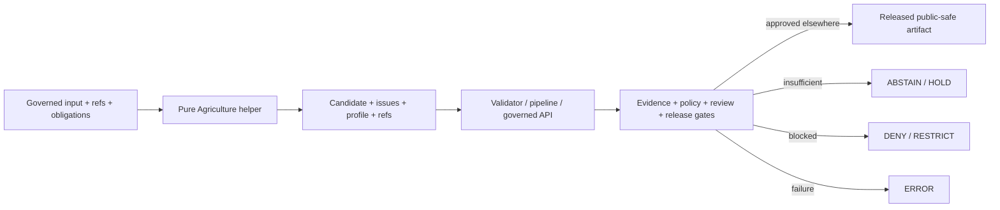

<!-- [KFM_META_BLOCK_V2]
doc_id: kfm://doc/packages-domains-agriculture-src-agriculture-readme
title: Governed Agriculture Helper Source Module
type: readme
version: v0.2
status: draft; repository-grounded; python-scaffold
owners:
  - OWNER_TBD — Agriculture package/domain steward
  - OWNER_TBD — Contract/schema/policy/evidence steward
  - OWNER_TBD — Validation/security/docs steward
created: 2026-06-13
updated: 2026-07-14
supersedes: v0.1
policy_label: public; packages; agriculture; no-network; field-level-deny-by-default; non-authoritative
path: packages/domains/agriculture/src/agriculture/README.md
truth_posture: CONFIRMED target and prior blob, package name/version, empty __init__.py, bounded absent helper paths, adjacent governance READMEs, Directory Rules v1.4, proposed ADR-0001, placeholder CODEOWNERS, and query-limited workflow evidence / PROPOSED future pure mapping, normalization, temporal, aggregation-support, and schema-adapter helpers / CONFLICTED contract/schema compatibility paths, aggregation-receipt naming, policy/runtime outcome vocabulary, and stale parent inventory / UNKNOWN exports, build backend, dependencies, consumers, executable helpers beyond tested paths, validators, CI, runtime, evidence, release, and production behavior
evidence_snapshot:
  repository: bartytime4life/Kansas-Frontier-Matrix
  base_ref: main
  base_commit: 8bb1d0b8b288781169e5592d60962cd7537fc37c
  prior_blob: 036767399c356a59a0f8c674e8f9a1da2aa0d79f
related:
  - ./__init__.py
  - ../README.md
  - ../../README.md
  - ../../pyproject.toml
  - ../../../../../docs/domains/agriculture/README.md
  - ../../../../../contracts/domains/agriculture/README.md
  - ../../../../../schemas/contracts/v1/domains/agriculture/README.md
  - ../../../../../policy/domains/agriculture/README.md
  - ../../../../../tests/domains/agriculture/README.md
  - ../../../../../fixtures/domains/agriculture/README.md
  - ../../../../../docs/doctrine/directory-rules.md
  - ../../../../../docs/adr/ADR-0001-schema-home--schemas-contracts-v1-is-canonical.md
tags: [kfm, agriculture, python, package, source-module, evidence, governance]
notes:
  - "v0.2 replaces planning-only language with commit-pinned repository evidence."
  - "Only this Markdown file changes."
[/KFM_META_BLOCK_V2] -->

<a id="top"></a>

# Governed Agriculture Helper Source Module

`packages/domains/agriculture/src/agriculture/`

> Reusable Agriculture helper-code boundary. The current surface is a **greenfield Python scaffold**, not an implemented library: the package is version `0.0.0`, `__init__.py` is empty, and the exact tested helper paths were not found.


**Quick links:** [Purpose](#purpose) · [Authority](#authority) · [Status](#current-status) · [Language](#bounded-context-and-language) · [Belongs](#what-belongs-here) · [Exclusions](#what-does-not-belong-here) · [Objects](#object-family-boundary) · [Trust](#trust-lifecycle-and-public-safety) · [Validation](#validation-and-admission) · [Rollback](#compatibility-correction-and-rollback) · [Backlog](#open-verification-register) · [Ledger](#evidence-ledger)

> [!IMPORTANT]
> **Snapshot:** `main@8bb1d0b8b288781169e5592d60962cd7537fc37c`<br>
> **Package:** `kfm-domain-agriculture` `0.0.0`<br>
> **Verified module:** empty `agriculture/__init__.py`<br>
> **Not found at exact tested paths:** `package.json`, `core.py`, `crop.py`, `field_identity.py`, `aggregation.py`, and `tests/packages/domains/agriculture/README.md`

> [!CAUTION]
> A mapped crop code is not a `CropObservation`; a geometry key is not a confirmed field; a yield adapter is not yield truth; and an aggregation helper is not an `AggregationReceipt`, policy approval, EvidenceBundle, or release authorization.

---

## Purpose

A future implementation may provide deterministic, side-effect-minimal helpers for:

- preserving source-native crop codes, labels, units, IDs, and timestamps;
- adapting governed inputs into **candidate** Agriculture DTOs;
- preserving source role, uncertainty, geometry lineage, and distinct time kinds;
- normalizing yield, rotation, irrigation, conservation, suitability, stress, and economy inputs;
- computing local keys only under an accepted identity profile;
- preparing aggregation/redaction candidates from caller-authorized inputs;
- validating local shape against accepted schemas;
- returning explicit missing, malformed, ambiguous, stale, restricted, or conflicted issues;
- supporting synthetic, no-network tests.

It must not fetch sources, admit data, write lifecycle state, decide truth or policy, close evidence, approve release, serve public routes, render maps, or generate authoritative claims.

[Back to top](#top)

---

## Authority

| Concern | Authority here |
|---|---|
| Agriculture doctrine/scope | None — `docs/domains/agriculture/`. |
| Object meaning | None — `contracts/domains/agriculture/` or accepted contract home. |
| Machine shape | None — `schemas/contracts/v1/domains/agriculture/` under proposed ADR-0001. |
| Source role/rights/cadence | None — source descriptors and registries. |
| Crop/field/yield/rotation/irrigation/suitability/stress/economy truth | None — candidate adaptation only. |
| Identity/time authority | None — apply accepted profiles; never invent them silently. |
| Policy/sensitivity | None — policy roots and steward review. |
| Evidence closure | None — EvidenceRef/EvidenceBundle systems. |
| Lifecycle writes | None — authorized connectors/pipelines/workers/tools. |
| Release/correction/rollback | None — `release/` and accepted records. |
| Public API/UI/map/AI | None — governed application/runtime roots. |
| Helper behavior | Supporting only — normalize, adapt, validate local shape, return explicit results. |

Using a trusted type, schema, hash, or app does not transfer upstream authority into this module.

[Back to top](#top)

---

## Current status

| Surface | Evidence | Status |
|---|---|---:|
| Target README | Existing v0.1, revised in place. | **CONFIRMED** |
| Parent package/source READMEs | Exist; source-root inventory is partly stale. | **CONFIRMED** |
| `pyproject.toml` | Name and `0.0.0` only. | **CONFIRMED placeholder** |
| `agriculture/__init__.py` | Empty. | **CONFIRMED scaffold** |
| `package.json` | Missing at exact path. | **CONFIRMED bounded absence** |
| Selected proposed helpers | `core.py`, `crop.py`, `field_identity.py`, `aggregation.py` missing at exact paths. | **CONFIRMED bounded absence** |
| Domain README | Twelve object families and field/operator deny-default posture. | **CONFIRMED repository document** |
| Contract/schema/policy READMEs | Indexes exist; coverage, enforcement, compatibility, and naming drift remain. | **CONFIRMED indexes / incomplete** |
| Domain test/fixture READMEs | README-backed lanes exist; executable inventory/results unverified. | **CONFIRMED indexes / NOT RUN** |
| Package-specific test README | Missing at exact tested path. | **CONFIRMED bounded absence** |
| CODEOWNERS | Placeholder; no Agriculture package rule. | **CONFIRMED placeholder** |
| Workflow evidence | No PR-triggered base runs surfaced; proposed workflow paths tested absent. | **QUERY-LIMITED** |
| Build, exports, consumers, runtime, evidence, release | Not established. | **UNKNOWN** |

Bounded inspected shape:

```text
packages/domains/agriculture/
├── README.md
├── pyproject.toml
└── src/
    ├── README.md
    └── agriculture/
        ├── README.md
        └── __init__.py   # empty
```

This is not a recursive tree proof.

[Back to top](#top)

---

## Bounded context and language

| Term | Meaning here | Not equivalent to |
|---|---|---|
| Candidate DTO | Helper output for validation/review. | Canonical object or promotion. |
| Native value | Source-provided code/label/unit/ID/time. | Normalized authority. |
| Crosswalk result | Versioned mapping candidate with ambiguity. | Silent source replacement. |
| Field candidate | Potential management unit with lineage/uncertainty. | Parcel/operator truth or public geometry. |
| Aggregation candidate | Derived result under a named method. | Receipt, policy approval, released layer. |
| Helper issue | Structured local finding. | PolicyDecision, ValidationReport, runtime envelope. |
| Source role | Role supplied by source governance. | Role inferred from filename/content. |
| Time kind | Named source/observed/valid/retrieval/release/correction time. | Generic timestamp. |
| Local helper key | Deterministic key under accepted profile. | Canonical identity unless contract says so. |

Agriculture combines statistics, remote sensing, soil/weather context, modeled products, candidates, and aggregates. Helpers must preserve those knowledge characters.

[Back to top](#top)

---

## What belongs here

- crop-code/name mappings that preserve native values and vocabulary version;
- candidate adapters for crop, field, yield, rotation, irrigation, conservation, suitability, stress, economy;
- identity/time parsers under accepted profiles;
- cross-lane reference preservation;
- aggregation/suppression/generalization support under caller obligations;
- local schema adapters against accepted versions;
- immutable result/issue types and safe error formatting;
- synthetic fixture factories when fixture policy permits.

Placement test: reusable across consumers, no hidden IO, preserves governance refs, and cannot decide truth, disclosure, promotion, evidence closure, or release.

[Back to top](#top)

---

## What does not belong here

| Does not belong | Correct home |
|---|---|
| Doctrine/source strategy | `docs/domains/agriculture/` |
| Contracts | `contracts/domains/agriculture/` |
| JSON Schemas | `schemas/contracts/v1/domains/agriculture/` |
| Executable policy | `policy/domains/agriculture/` |
| Source descriptors/admission | source registry roots |
| Source fetchers | `connectors/<source>/` |
| Executable transforms/specs | `pipelines/domains/agriculture/`, workers, tools, `pipeline_specs/agriculture/` |
| Lifecycle records | `data/<phase>/agriculture/` |
| Receipts/proofs | accepted `data/receipts/`, `data/proofs/` |
| Release/correction/rollback | `release/` |
| Public API/UI/map/AI | governed app/runtime roots |
| Secrets/restricted live payloads | secret manager or governed lifecycle stores |
| Validators/tests/fixtures | `tools/validators/`, `tests/domains/agriculture/`, `fixtures/domains/agriculture/` |

[Back to top](#top)

---

## Interface rules

`__init__.py` is empty, so no public API or compatibility promise exists.

Future interfaces must:

1. export reviewed symbols deliberately;
2. use typed documented inputs/outputs;
3. default to pure or side-effect-minimal behavior;
4. avoid import-time network, filesystem/database writes, secret loading, policy/evidence/model calls, telemetry, or global configuration;
5. preserve native values and governance references;
6. return explicit issues rather than guessing;
7. keep callers responsible for admission, policy, evidence, lifecycle, and release;
8. use migration notes/tests for breaking changes;
9. avoid misleading operations named `publish`, `approve`, `admit`, or `prove`.

No accepted package result contract was verified.

[Back to top](#top)

---

## Object-family boundary

| Object family | Potential helper role | Must not collapse into |
|---|---|---|
| `CropObservation` | Preserve crop/source/geography/period. | Confirmed observation. |
| `FieldCandidate` | Preserve geometry precision, uncertainty, lineage. | Parcel/operator truth or public geometry. |
| `CropRotation` | Parse ordered periods and gaps. | Invented management history. |
| `YieldObservation` | Normalize unit/period/geography/suppression. | Evidence or farm claim. |
| `IrrigationLink` | Preserve irrigation relation. | Water right/ownership/permit. |
| `ConservationPractice` | Preserve practice/program/effective period. | Proof of on-ground implementation. |
| `SoilCropSuitability` | Adapt interpretation while citing Soil refs. | Agriculture-owned Soil truth. |
| `AgriculturalEconomyObservation` | Preserve measure/geography/period/suppression. | Operator-level inference. |
| `SupplyChainNode` | Normalize candidate node/relation. | Unrestricted operational disclosure. |
| `DroughtStressIndicator` | Preserve method/input roles/uncertainty. | Official warning or loss fact. |
| `PestStressIndicator` | Preserve method/source/limitations. | Diagnosis/treatment/occurrence truth. |
| `AggregationReceipt` | Prepare deterministic inputs for authorized emitter. | Receipt or approval. |

Cross-lane refs to Soil, Hydrology, Atmosphere, Hazards, People/Land, Flora/Habitat, Infrastructure, and Frontier Matrix must preserve ownership and source role.

[Back to top](#top)

---

## Identity and time

Until accepted profiles exist:

- preserve source IDs and native values;
- keep normalized values alongside native values;
- do not hash private IDs to make them public;
- do not treat geometry digest as field identity;
- do not merge on similarity alone;
- return ambiguity;
- keep decisions reversible.

An identity profile must specify fields, normalization, null behavior, geometry precision, namespace, temporal scope, canonicalization/hash, version, collisions, and migration.

Preserve source, observed, valid, retrieval/processing, release, and correction times distinctly. Do not substitute retrieval time for observed/valid time or set release time as approval.

[Back to top](#top)

---

## Trust, lifecycle, and public safety



Required invariants:

```yaml
no_import_time_io: true
no_hidden_network_or_writes: true
no_secret_loading: true
no_source_admission_or_lifecycle_promotion: true
no_policy_decision: true
no_evidence_fabrication_or_closure: true
no_release_approval_or_public_bypass: true
native_values_source_roles_time_kinds_uncertainty_preserved: true
restricted_precision_not_expanded: true
helper_output_is_not_truth: true
```

Public-safety rules:

- field/operator/parcel-adjacent detail is denied by default;
- unclear rights, NASS-confidential, license-limited, and suppressed data fail closed;
- no small-cell re-identification or suppression reversal;
- hashing private IDs does not make them public;
- remote-sensing/model output must not masquerade as observation;
- logs/errors minimize source payload and restricted geometry;
- fixtures are synthetic or sanitized;
- aggregation requires explicit geography/version, thresholds, suppression/rounding/generalization, attribute allowlist, obligations, profile version, and deterministic ordering.

[Back to top](#top)

---

## Failure semantics

Future helpers distinguish:

`MISSING_REQUIRED` · `MALFORMED_VALUE` · `UNSUPPORTED_VALUE` · `AMBIGUOUS_MAPPING` · `STALE_PROFILE` · `RESTRICTED_PRECISION` · `CONFLICTED_AUTHORITY` · `INTERNAL_ERROR`

These are **PROPOSED** local classes pending an accepted registry. Helpers must not silently coerce meaning or leak restricted values.

Policy docs use `ALLOW`, `DENY`, `RESTRICT`, `HOLD`, `ABSTAIN`, `ERROR`; runtime docs use outcomes such as `ANSWER`, `ABSTAIN`, `DENY`, `ERROR`. This module must not choose or normalize that difference without an accepted adapter and parity tests.

[Back to top](#top)

---

## Validation and admission

| Area | Positive proof | Negative proof | Status |
|---|---|---|---:|
| Import/exports | Side-effect-free import; reviewed exports. | Detect network/write/secret/global config. | **NOT RUN** |
| Crop mapping | Native value retained under pinned vocabulary. | Unknown/ambiguous returns issue. | **NOT IMPLEMENTED** |
| Field candidate | Source/precision/lineage/uncertainty retained. | Cannot promote to confirmed/public geometry. | **NOT IMPLEMENTED** |
| Yield/rotation | Deterministic unit/sequence/method/gaps. | No suppressed-value or missing-year guesses. | **NOT IMPLEMENTED** |
| Identity/time | Stable under accepted profiles. | No similarity merge or time collapse. | **NOT IMPLEMENTED** |
| Aggregation | Deterministic and method-bound. | Small-cell/operator/restricted detail blocked. | **NOT IMPLEMENTED** |
| Policy/evidence/release | Caller refs/obligations preserved. | Cannot self-authorize/prove/promote/publish. | **NOT IMPLEMENTED** |
| Security/determinism | Safe errors; stable repeated output. | No restricted logging or environment drift. | **NOT IMPLEMENTED** |

Proposed future test/fixture child lanes, subject to parent review:

```text
tests/domains/agriculture/package_helpers/
fixtures/domains/agriculture/package_helpers/
```

Implementation order:

1. owners, CODEOWNERS, build backend, Python versions, src discovery, install/import test;
2. immutable result/issues with stable codes and no data leakage;
3. one low-risk crop mapping helper with synthetic no-network fixtures;
4. schema-bound adapter only after paired contract and field-complete schema;
5. field candidate last, after privacy/geometry/identity review and negative fixtures;
6. aggregation support with explicit caller obligations, not receipt/release;
7. one verified consumer at a time behind governed boundaries.

Review commands, not pass claims:

```bash
python -m compileall packages/domains/agriculture/src/agriculture
python -m pytest tests/domains/agriculture
python tools/validate_all.py
```

[Back to top](#top)

---

## Compatibility, correction, and rollback

README rollback blob:

```text
036767399c356a59a0f8c674e8f9a1da2aa0d79f
```

Unresolved drift:

- `contracts/domains/agriculture/` vs `contracts/agriculture/`;
- `schemas/contracts/v1/domains/agriculture/` vs `schemas/contracts/v1/agriculture/`;
- `aggregation-receipt` vs `aggregation_receipt`;
- policy vs runtime outcome vocabulary;
- parent source-root README inventory vs confirmed empty child `__init__.py`.

Do not settle these by code convention. Use the owning steward, ADR, drift, and migration process.

Any mapping, identity, temporal, aggregation, or suppression change needs a version/changelog, before/after fixtures, downstream impact, migration/recompile plan, correction/invalidation path, and rollback target.

[Back to top](#top)

---

## Definition of done

### README v0.2

- [x] Pinned target/ref/blob and scaffold evidence.
- [x] Directory Rules and authority separation preserved.
- [x] Object families, interfaces, identity/time, public safety, failures, tests, correction, rollback covered.
- [x] Build, exports, consumers, tests, CI, runtime, evidence, release kept bounded.
- [x] No code/schema/policy/data/release/path change implied.

### First helper

- [ ] Owners and package mechanics accepted.
- [ ] Contract/schema or explicit local-only scope accepted.
- [ ] Source-role, identity, and time profiles pinned.
- [ ] Positive, negative, ambiguous, restricted, no-network fixtures/tests pass.
- [ ] Determinism, import safety, and no hidden authority proved.
- [ ] Security/sensitivity and consumer review complete.
- [ ] Correction/migration/rollback documented.
- [ ] Meaningful CI gate exists.

[Back to top](#top)

---

## Open verification register

| ID | Question | Status |
|---|---|---|
| `PKG-AG-SRC-001` | Owners, CODEOWNERS, enforced review? | **UNKNOWN** |
| `PKG-AG-SRC-002` | Build backend, Python versions, install behavior? | **UNKNOWN** |
| `PKG-AG-SRC-003` | Complete tree, exports, consumers? | **NEEDS VERIFICATION** |
| `PKG-AG-SRC-004` | Result/issue, source-role, identity, time contracts? | **UNKNOWN** |
| `PKG-AG-SRC-005` | Accepted Agriculture contracts/schemas? | **NEEDS VERIFICATION** |
| `PKG-AG-SRC-006` | Policy-to-runtime outcome mapping? | **CONFLICTED** |
| `PKG-AG-SRC-007` | Test/fixture/validator/workflow binding? | **UNKNOWN** |
| `PKG-AG-SRC-008` | Generated-code admission? | **NEEDS VERIFICATION** |
| `PKG-AG-SRC-009` | Aggregation/suppression thresholds and rights? | **UNKNOWN** |
| `PKG-AG-SRC-010` | Safe field-candidate admission? | **NEEDS VERIFICATION** |
| `PKG-AG-SRC-011` | Correction replay/deprecation policy? | **UNKNOWN** |
| `PKG-AG-SRC-012` | Public path blocks direct internal access? | **NEEDS VERIFICATION** |

[Back to top](#top)

---

## Evidence ledger

| Source | Status | Supports | Limits |
|---|---|---|---|
| Current request/authoring contract | **CONFIRMED task authority** | Scope and one-file evidence-first implementation. | Not repo proof. |
| Prior target, parent READMEs | **CONFIRMED** | Existing boundaries and rollback. | Some planning/stale inventory. |
| `pyproject.toml`, `__init__.py`, exact path checks | **CONFIRMED** | Package identity and bounded scaffold state. | Not recursive/runtime proof. |
| Domain/contract/schema/policy/test/fixture READMEs | **CONFIRMED docs/indexes** | Object families, sensitivity, authority splits, scaffolds/drift. | Not executable closure. |
| Directory Rules v1.4 | **CONFIRMED doctrine** | Package placement, Domain Placement Law, trust/lifecycle split. | Some paths/ADRs proposed. |
| ADR-0001 | **CONFIRMED file / proposed** | Proposed schema home and four-layer split. | Not accepted. |
| Drift/CODEOWNERS/workflow evidence | **CONFIRMED files / query-limited** | Drift process and review/workflow boundaries. | No target resolution or CI pass proof. |
| Domain-Driven Design reference | **REFERENCE** | Bounded context and language. | Does not override KFM doctrine. |

[Back to top](#top)

---

## Status summary

This is a verified Python source-module path with an empty `__init__.py` in a `kfm-domain-agriculture` `0.0.0` scaffold. It is not yet a verified helper library, connector, pipeline, schema authority, policy engine, EvidenceBundle resolver, lifecycle writer, release authority, public API, UI package, or map/AI trust surface.

<p align="right"><a href="#top">Back to top</a></p>
