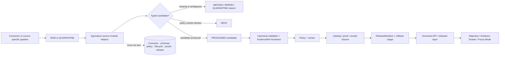

<!-- [KFM_META_BLOCK_V2]
doc_id: kfm://doc/packages-domains-agriculture-src-agriculture-readme
title: Agriculture Domain Package Source Module README
type: readme
subtype: package-domain-source-module
version: v0.2
prior_version: v0.1
status: draft
owners:
  - <package-owner>
  - <agriculture-domain-steward>
  - <schema-steward>
  - <evidence-steward>
  - <policy-steward>
  - <docs-steward>
created: 2026-06-13
updated: 2026-07-14
policy_label: public
path: packages/domains/agriculture/src/agriculture/README.md
responsibility_root: packages/
bounded_context: agriculture shared-helper source module
evidence_snapshot:
  repository: bartytime4life/Kansas-Frontier-Matrix
  base_ref: main
  base_sha: 8bb1d0b8b288781169e5592d60962cd7537fc37c
  target_blob_sha: 036767399c356a59a0f8c674e8f9a1da2aa0d79f
truth_posture:
  confirmed:
    - target README exists at the evidence snapshot
    - parent Agriculture package and source-root READMEs exist at the evidence snapshot
    - packages/ is the responsibility root for shared implementation libraries
    - schemas/contracts/v1/domains/agriculture/ is the proposed canonical machine-schema lane under ADR-0001
  proposed:
    - future module files, exports, result types, validators, and tests described below
  unknown:
    - concrete language runtime, package manifest, exported symbols, dependency graph, and runtime consumers
  needs_verification:
    - complete recursive child inventory, CI coverage, generated-type workflow, active policy integration, and release integration
related:
  - packages/domains/README.md
  - packages/domains/agriculture/README.md
  - packages/domains/agriculture/src/README.md
  - docs/doctrine/directory-rules.md
  - docs/adr/ADR-0001-schema-home--schemas-contracts-v1-is-canonical.md
  - docs/registers/DRIFT_REGISTER.md
  - docs/domains/agriculture/README.md
  - docs/domains/agriculture/CANONICAL_PATHS.md
  - docs/domains/agriculture/OBJECTS.md
  - docs/domains/agriculture/API_CONTRACTS.md
  - docs/domains/agriculture/MAP_UI_CONTRACTS.md
  - docs/domains/agriculture/SOURCE_REGISTRY.md
  - docs/domains/agriculture/DATA_LIFECYCLE.md
  - docs/domains/agriculture/RELEASE_INDEX.md
  - contracts/domains/agriculture/
  - schemas/contracts/v1/domains/agriculture/
  - policy/domains/agriculture/
  - tests/packages/domains/agriculture/
  - fixtures/packages/domains/agriculture/
  - data/proofs/agriculture/
  - release/
tags:
  - kfm
  - packages
  - domains
  - agriculture
  - source-module
  - bounded-context
  - crop-observation
  - field-candidate
  - yield
  - rotation
  - irrigation
  - suitability
  - aggregation
  - evidence
  - public-safe
notes:
  - "v0.2 replaces hypothetical placement language with a commit-bounded repository evidence snapshot."
  - "This module is a shared implementation helper lane, not Agriculture doctrine, object meaning, machine-schema authority, policy authority, lifecycle storage, evidence authority, or release authority."
  - "Success from a helper is a typed candidate result, never truth, policy approval, EvidenceBundle closure, promotion, or publication."
  - "Restricted agricultural detail remains deny-by-default for public use unless governed policy, evidence, review, aggregation or redaction, and release controls are satisfied elsewhere."
[/KFM_META_BLOCK_V2] -->

<a id="top"></a>

# Agriculture Source Module

> Bounded source-module lane for reusable Agriculture helpers inside `packages/domains/agriculture/`. Code placed here may normalize, map, validate, compare, aggregate, and prepare typed candidates, but it must remain subordinate to Agriculture contracts, schemas, policy, evidence, lifecycle, review, and release controls.


| Field | Value |
|---|---|
| **Path** | `packages/domains/agriculture/src/agriculture/README.md` |
| **Owning responsibility root** | `packages/` — shared implementation libraries |
| **Parent package** | [`packages/domains/agriculture/`](../../README.md) |
| **Parent source root** | [`packages/domains/agriculture/src/`](../README.md) |
| **Bounded context** | Reusable Agriculture mapping, normalization, validation, aggregation, and candidate-preparation helpers |
| **Authority class** | Implementation helper module; not a truth or governance authority |
| **Evidence snapshot** | `bartytime4life/Kansas-Frontier-Matrix@8bb1d0b8b288781169e5592d60962cd7537fc37c` |
| **Current implementation depth** | README contract is `CONFIRMED`; concrete runtime, exports, tests, and consumers remain `UNKNOWN` or `NEEDS VERIFICATION` |
| **Public posture** | No direct public interface; restricted field/operator detail is denied by default |

> [!IMPORTANT]
> A helper result is not an Agriculture claim. This module must not convert parsing success, a normalized identifier, a model score, a field candidate, a test pass, or an aggregation result into crop truth, yield truth, field identity authority, policy approval, EvidenceBundle closure, lifecycle promotion, or public release.

---

## Quick navigation

- [1. Purpose and bounded context](#1-purpose-and-bounded-context)
- [2. Evidence snapshot and current state](#2-evidence-snapshot-and-current-state)
- [3. Ubiquitous language](#3-ubiquitous-language)
- [4. Owned responsibilities](#4-owned-responsibilities)
- [5. Explicit non-ownership](#5-explicit-non-ownership)
- [6. Interface model](#6-interface-model)
- [7. Domain objects and invariants](#7-domain-objects-and-invariants)
- [8. Inputs and outputs](#8-inputs-and-outputs)
- [9. Identity and temporal handling](#9-identity-and-temporal-handling)
- [10. Source-role anti-collapse rules](#10-source-role-anti-collapse-rules)
- [11. Trust-membrane and lifecycle interaction](#11-trust-membrane-and-lifecycle-interaction)
- [12. Sensitivity and public-safe behavior](#12-sensitivity-and-public-safe-behavior)
- [13. Dependencies and authority surfaces](#13-dependencies-and-authority-surfaces)
- [14. Contracts, schemas, policy, fixtures, and validators](#14-contracts-schemas-policy-fixtures-and-validators)
- [15. Finite outcomes](#15-finite-outcomes)
- [16. Module layout and extension rules](#16-module-layout-and-extension-rules)
- [17. Validation strategy](#17-validation-strategy)
- [18. Evidence, release, correction, and rollback](#18-evidence-release-correction-and-rollback)
- [19. Maintenance workflow](#19-maintenance-workflow)
- [20. Definition of done](#20-definition-of-done)
- [21. Open questions](#21-open-questions)
- [Changelog](#changelog)

---

## 1. Purpose and bounded context

`packages/domains/agriculture/src/agriculture/` is the internal source-module boundary for Agriculture helpers that are reusable across governed apps, pipelines, workers, validators, and tests.

The module may help callers prepare or inspect Agriculture candidates involving:

- crop observations and source-native crop classifications;
- field or management-unit candidates;
- crop rotations and temporal sequences;
- yield observations and unit normalization;
- irrigation context that does not claim water rights;
- conservation-practice context;
- soil-crop suitability inputs and derived candidates;
- agricultural-economy and supply-chain context;
- drought- and pest-stress indicators;
- aggregation or redaction metadata for downstream governance.

The bounded context ends before truth, policy, lifecycle persistence, evidence closure, review, release, or public delivery. Callers own those transitions through the correct responsibility roots.

```text
source-native value
  -> Agriculture helper
  -> typed candidate + preserved context + finite failure state
  -> governed caller performs schema, evidence, policy, lifecycle, review, and release work
```

[Back to top](#top)

---

## 2. Evidence snapshot and current state

The statements in this section are bounded to the inspected repository and commit.

| Evidence | Observation | Status |
|---|---|---|
| `packages/domains/agriculture/src/agriculture/README.md@8bb1d0b8...` | Target README exists and defines a source-module boundary. | `CONFIRMED` |
| `packages/domains/agriculture/README.md@8bb1d0b8...` | Parent package defines Agriculture as reusable helper code under `packages/`. | `CONFIRMED` |
| `packages/domains/agriculture/src/README.md@8bb1d0b8...` | Parent source-root README identifies `agriculture/README.md` as the confirmed child module surface in its inspected tree. | `CONFIRMED` within inspected evidence |
| Repository search at `8bb1d0b8...` | No concrete Agriculture source files, manifest, or tests were located by the performed searches. | `NEEDS VERIFICATION`; absence is not proven recursively |
| `docs/doctrine/directory-rules.md@8bb1d0b8...` | `packages/` owns shared implementation libraries; domains remain segments under responsibility roots. | `CONFIRMED` doctrine |
| `docs/adr/ADR-0001-schema-home--schemas-contracts-v1-is-canonical.md@8bb1d0b8...` | Domain machine schemas belong under `schemas/contracts/v1/domains/<domain>/`; the ADR remains `proposed`. | `CONFIRMED` document state / `PROPOSED` decision status |

**Current practical conclusion:** this README is an implementation contract for a module surface whose concrete code is not yet proven by the inspected evidence. Future documentation must upgrade claims only when exact files, exports, tests, manifests, or runtime consumers are verified at a pinned commit.

[Back to top](#top)

---

## 3. Ubiquitous language

These terms are consumed from Agriculture doctrine and contracts. This module must not redefine their meaning.

| Term | Meaning at this boundary | Module rule |
|---|---|---|
| `CropObservation` | Source-backed observation about a crop classification or condition. | Preserve source-native code, normalized code, source role, time, and uncertainty separately. |
| `FieldCandidate` | Candidate spatial or logical field identity, not an authoritative parcel, operator, or ownership record. | Preserve provenance and ambiguity; never silently merge candidates. |
| `CropRotation` | Ordered crop sequence over explicit temporal support. | Keep gaps, unknown years, and source conflicts visible. |
| `YieldObservation` | Source-backed yield value with unit, spatial support, time, and limitations. | Do not convert estimates or models into observations. |
| `IrrigationLink` | Governed relation between Agriculture and irrigation context. | Never imply a water right, permit, withdrawal authorization, or ownership claim. |
| `ConservationPractice` | Evidence-backed practice record or context. | Preserve program/source authority and effective dates. |
| `SoilCropSuitability` | Derived or interpreted suitability candidate using Soil evidence. | Keep inputs, method, version, support scale, and uncertainty visible. |
| `AgriculturalEconomyObservation` | Source-backed economic observation at a declared geography and time. | Do not infer private business performance or operator identity. |
| `SupplyChainNode` | Contextual node in a governed agricultural supply-chain representation. | Keep facility, company, and infrastructure authority boundaries explicit. |
| `DroughtStressIndicator` | Derived indicator using Agriculture plus hydrology/atmosphere/hazard context. | Label as an indicator, not a direct crop observation or emergency alert. |
| `PestStressIndicator` | Derived indicator using Agriculture and fauna/taxonomy context. | Preserve method and taxonomic source; do not claim confirmed infestation without evidence. |
| `AggregationReceipt` | Trust object recording an aggregation transform used to reduce exposure risk. | This module may prepare receipt-ready metadata; it must not self-authorize publication. |
| `EvidenceRef` / `EvidenceBundle` | Reference to and resolved package of admissible support. | Preserve references; never fabricate or close evidence locally. |
| `ReleaseManifest` | Governed release-state record. | Consume or reference only; never issue or approve. |

[Back to top](#top)

---

## 4. Owned responsibilities

This source module may own implementation helpers for the following activities.

| Responsibility | Required behavior |
|---|---|
| Source-native mapping | Keep native values and normalized values distinct; preserve source identifiers and authority limits. |
| Normalization | Normalize codes, units, enums, dates, and optional fields without deleting uncertainty or caveats. |
| Candidate identity preparation | Produce deterministic candidate keys only where a schema- or contract-approved recipe exists. |
| DTO preparation | Build schema-ready candidate objects for governed callers without becoming the schema authority. |
| Temporal sequencing | Order crop rotations or observation series while preserving gaps, conflicts, and time-kind distinctions. |
| Unit handling | Normalize yield, area, moisture, stress, and economic units with explicit source and conversion metadata. |
| Crosswalk support | Preserve native classification, target classification, crosswalk version, confidence, and unresolved mappings. |
| Aggregation support | Prepare grouped values, thresholds, and transform metadata; do not decide public admissibility. |
| Redaction/generalization support | Prepare candidate transforms from caller-supplied policy inputs; do not choose sensitivity policy. |
| Validation adapters | Invoke or wrap canonical validators and return structured results; do not redefine canonical rules. |
| Receipt-ready metadata | Return input/output digests, method/version, reason codes, and transform summaries for pipeline-owned receipts. |
| Test helpers | Provide deterministic synthetic or sanitized builders when repository convention permits. |

Helpers should be deterministic, side-effect-minimal, explicit about inputs, and free of ambient authority.

[Back to top](#top)

---

## 5. Explicit non-ownership

| This module does **not** own | Owning responsibility surface |
|---|---|
| Agriculture doctrine, bounded-context meaning, or domain scope | `docs/domains/agriculture/` |
| Object semantics and invariants | `contracts/domains/agriculture/` |
| Machine-checkable object shape | `schemas/contracts/v1/domains/agriculture/` under the ADR-0001 convention |
| Rights, sensitivity, allow/deny/restrict/abstain decisions | `policy/domains/agriculture/` and cross-cutting policy roots |
| Source identity, rights, cadence, authority role, or activation | `data/registry/sources/agriculture/` or repo-confirmed registry home |
| Live source fetching, scraping, authentication, or admission | `connectors/`, `pipelines/domains/agriculture/`, and `pipeline_specs/agriculture/` |
| RAW, WORK, QUARANTINE, PROCESSED, CATALOG, TRIPLET, or PUBLISHED state | `data/<phase>/agriculture/` |
| Receipts and proof objects | `data/receipts/`, `data/proofs/agriculture/`, or repo-confirmed trust-object homes |
| EvidenceBundle resolution or claim authority | Evidence/proof services and governed APIs |
| Promotion, release manifests, corrections, withdrawals, or rollback cards | `release/` |
| Public API routes | `apps/governed-api/` |
| MapLibre styles, layers, Evidence Drawer, or Focus Mode UI | `apps/explorer-web/`, map packages, and governed UI roots |
| AI answers or model authority | Governed AI runtime and receipt surfaces |
| Parcel, ownership, title, or living-person truth | People / DNA / Land domain |
| Soil, hydrology, atmosphere, hazard, fauna, or flora canonical truth | Their respective domain lanes |

> [!WARNING]
> Do not add convenience code here that quietly acquires another root's authority. Hidden network access, lifecycle writes, policy decisions, evidence construction, release decisions, or public delivery are boundary violations even when technically easy.

[Back to top](#top)

---

## 6. Interface model

### 6.1 Internal interface

The intended interface is a library surface called by governed applications, pipelines, workers, validators, and tests.

A helper should accept explicit context rather than read ambient globals:

```yaml
candidate_input:
  source_ref: required
  source_role: required
  native_identity: required_when_available
  evidence_refs: preserved_not_resolved_here
  spatial_support: explicit
  temporal_support:
    observed_time: optional
    valid_time: optional
    source_time: optional
    retrieval_time: optional
  rights_context: explicit_or_abstain
  sensitivity_context: explicit_or_abstain
  payload: source_or_contract_specific
```

A helper should return a typed candidate or a finite failure state:

```yaml
candidate_result:
  status: typed_candidate | abstain | deny | error
  value: optional
  reason_codes: []
  source_refs: []
  evidence_refs: []
  warnings: []
  input_digest: optional
  output_digest: optional
  transform_summary: optional
```

These shapes are illustrative. Exact types and field names are `PROPOSED` until canonical contracts, schemas, and package exports are verified.

### 6.2 Public interface

This module has **no direct public interface**. Public clients must use released artifacts and governed APIs. A browser, notebook, external client, or AI surface must not import this module as a shortcut around evidence, policy, review, or release.

### 6.3 Side-effect rule

Helpers should not perform hidden IO. Any future file, database, network, queue, or object-store interaction must be explicit, bounded, separately owned, test-covered, and justified by repository evidence.

[Back to top](#top)

---

## 7. Domain objects and invariants

The module may prepare candidates for Agriculture object families, but contracts and schemas remain authoritative.

### 7.1 Core invariants

1. **Source-native fidelity.** Native identifiers, classifications, units, caveats, and source roles must remain recoverable.
2. **Observation/model separation.** Observations, estimates, predictions, classifications, and indicators must not be collapsed.
3. **Field-candidate humility.** A `FieldCandidate` is not a parcel, ownership record, operator identity, or final authoritative field.
4. **Cross-lane ownership.** Soil, water, atmosphere, hazard, fauna, flora, infrastructure, and people/land facts remain owned by their lanes.
5. **Time-kind separation.** Observed, valid/effective, source, retrieval, run, release, and correction times remain distinct where material.
6. **No helper-generated truth.** Derived values and normalized records are candidates until evidence, policy, validation, review, and release close elsewhere.
7. **Deterministic transformation.** The same inputs, configuration, and version should produce the same normalized output where practical.
8. **No silent coercion.** Unknown codes, units, classifications, or mappings must produce warnings, abstention, or errors rather than guessed values.
9. **Public-safe default.** Exact field/operator-sensitive outputs are not public by default.
10. **Reversibility.** Transform metadata should allow a reviewer to reconstruct inputs, method, version, and prior compatible behavior.

### 7.2 Forbidden assertions

A module function must not assert:

```text
normalized crop code == verified crop truth
field candidate == legal parcel or operated field
modeled yield == observed yield
irrigation relation == water right
suitability score == land-use decision
stress indicator == confirmed loss or emergency alert
aggregation completed == public release allowed
schema validation passed == evidence or policy passed
unit test passed == lifecycle promotion approved
```

[Back to top](#top)

---

## 8. Inputs and outputs

| Input family | Required context | Acceptable module output |
|---|---|---|
| Crop classifications | Source ID, native code/name, source role, vintage, crosswalk version | Preserved native value plus normalized candidate and confidence/warnings |
| Field or management-unit candidates | Source geometry/ID ref, CRS/support, uncertainty, source time, rights/sensitivity context | Candidate identity key, ambiguity record, geometry metadata, reason codes |
| Yield values | Value, unit, crop, geography/support, time, method, quality flags | Normalized candidate value and conversion provenance |
| Rotation sequences | Crop candidates, explicit temporal intervals, gaps, source refs | Ordered sequence with unresolved intervals/conflicts retained |
| Irrigation context | Agriculture record ref plus hydrology/water-source refs | Governed relation candidate; never a water-right assertion |
| Suitability/stress inputs | Method/version, source refs, spatial support, time, uncertainty | Derived candidate with method and limitations |
| Economic observations | Geography, period, currency/base year, source role, disclosure limits | Normalized aggregate candidate; no private operator inference |
| Aggregation request | Caller-supplied policy profile, threshold, grouping key, sensitivity class | Aggregated candidate plus receipt-ready transform metadata |
| Validation request | Candidate plus canonical schema/contract reference | Structured validation result; no release decision |

Outputs must carry enough context for downstream validators and reviewers to distinguish what happened from what was merely assumed.

[Back to top](#top)

---

## 9. Identity and temporal handling

### 9.1 Identity

The module must preserve at least three identity layers when available:

| Layer | Purpose |
|---|---|
| Source-native identity | Reconstruct the source record and citation lineage. |
| Candidate identity | Deterministic or source-scoped key used during normalization and review. |
| Released identity | Governed identity assigned or confirmed outside this module after evidence and release gates. |

A candidate identity recipe should include only contract-approved normalized fields and an explicit namespace/version. Geometry-only or name-only matching must not silently merge records.

### 9.2 Time

Do not collapse these time kinds:

- observation or event time;
- valid/effective interval;
- source publication or vintage time;
- source retrieval time;
- transformation/run time;
- review time;
- release time;
- correction or supersession time.

When a source exposes only one ambiguous timestamp, preserve the source field and mark the interpreted time kind as `NEEDS VERIFICATION` rather than inventing precision.

[Back to top](#top)

---

## 10. Source-role anti-collapse rules

| Input or derived role | Must not be collapsed into | Required handling |
|---|---|---|
| Cropland classification or remote-sensing label | Verified planted crop or producer report | Preserve product, year, class confidence, pixel/support scale, and limitations. |
| Survey or statistical aggregate | Field-level observation or private operator result | Preserve geography, sampling/design limits, disclosure rules, and source role. |
| Field boundary candidate | Legal parcel, ownership, tenancy, or operated-field truth | Preserve geometry source, confidence, date, and ambiguity. |
| Modeled yield | Observed or reported yield | Label method/version and keep observation/model distinction. |
| Soil-crop suitability | Crop presence, recommended action, or regulatory decision | Preserve Soil evidence, interpretation method, support scale, and uncertainty. |
| Irrigation context | Water right, permit, withdrawal authority, or ownership | Link to Hydrology/People-Land evidence without re-owning it. |
| Drought or pest stress indicator | Confirmed damage, loss, infestation, or emergency alert | Preserve method, evidence basis, and indicator status. |
| Aggregated public candidate | Released public artifact | Require downstream evidence, policy, review, receipt, and ReleaseManifest. |

[Back to top](#top)

---

## 11. Trust-membrane and lifecycle interaction



The lifecycle invariant remains:

```text
RAW -> WORK / QUARANTINE -> PROCESSED -> CATALOG / TRIPLET -> PUBLISHED
```

This module may participate in transformations between governed stages when called by an authorized pipeline or application. It does not own stage transitions and must not write hidden lifecycle state.

[Back to top](#top)

---

## 12. Sensitivity and public-safe behavior

Agriculture data can expose private operations, commercial activity, ownership relationships, or source-rights-limited detail.

### 12.1 Deny-by-default classes

- operator or producer identity;
- private owner/operator/parcel joins;
- exact field polygons where rights or sensitivity are unclear;
- source-rights-limited microdata;
- confidential business, production, or financial records;
- small-cell aggregates that enable re-identification;
- exact locations whose combination with other lanes raises exposure risk.

### 12.2 Public-safe helper behavior

A helper may prepare aggregation or generalization candidates only when the caller provides an explicit policy profile. It should return transform metadata such as:

- input support and output support;
- grouping key and threshold;
- suppression/generalization rule identifier;
- count before and after transform;
- fields removed or generalized;
- sensitivity labels before and after;
- input/output digests;
- reason codes and warnings.

The resulting candidate remains unpublished until downstream policy, evidence, review, receipt, release, correction, and rollback requirements pass.

[Back to top](#top)

---

## 13. Dependencies and authority surfaces

### 13.1 Upstream dependencies

| Dependency | Module expectation |
|---|---|
| Agriculture doctrine and object definitions | Consume terms and invariants; do not redefine them. |
| Canonical schemas | Validate or generate types from pinned versions; record provenance. |
| Source descriptors and registries | Receive source role, rights, cadence, caveats, and activation state from callers. |
| Cross-lane evidence | Reference Soil, Hydrology, Atmosphere, Hazards, Fauna, Flora, Infrastructure, and People/Land objects without copying their authority. |
| Policy context | Receive explicit allow/deny/restrict/abstain inputs; do not invent policy. |
| Configuration | Use explicit, non-secret, versioned configuration supplied by the caller. |

### 13.2 Downstream consumers

Potential consumers include governed pipelines, workers, API services, validators, review tooling, and tests. Concrete consumers are `UNKNOWN` until imports, build manifests, or runtime wiring are verified.

### 13.3 Dependency direction

```text
contracts / schemas / policy / registries
                 |
                 v
  governed caller -> agriculture helpers -> typed candidates
                 |
                 v
 validation / evidence / lifecycle / release / governed API
```

A reverse dependency in which schemas, policy, or release authority imports domain implementation details must be justified and reviewed for authority inversion.

[Back to top](#top)

---

## 14. Contracts, schemas, policy, fixtures, and validators

| Surface | Expected relationship | Current status |
|---|---|---|
| `contracts/domains/agriculture/` | Defines object meaning, invariants, field intent, compatibility, and lifecycle semantics. | Path referenced by current docs; concrete coverage `NEEDS VERIFICATION` |
| `schemas/contracts/v1/domains/agriculture/` | Defines machine-checkable shape under the ADR-0001 convention. | ADR status is `proposed`; concrete schemas `NEEDS VERIFICATION` |
| `policy/domains/agriculture/` | Defines public/private, rights, sensitivity, aggregation, denial, and review rules. | README/path evidence exists; executable policy coverage `NEEDS VERIFICATION` |
| `fixtures/packages/domains/agriculture/` | Holds deterministic synthetic or sanitized package fixtures when accepted by repository convention. | `PROPOSED` / `NEEDS VERIFICATION` |
| `tests/packages/domains/agriculture/` | Exercises module boundaries and behavior with no-network defaults. | No concrete tests located in performed search; `NEEDS VERIFICATION` |
| Canonical validators | Validate schema, identity, source role, units, time, sensitivity, and boundary behavior. | Exact commands and implementations `UNKNOWN` |
| `data/proofs/agriculture/` | Holds Agriculture proof material, not source-module output by default. | README/path evidence exists; integration `NEEDS VERIFICATION` |
| `release/` | Owns release, correction, supersession, and rollback decisions. | Authority boundary `CONFIRMED`; Agriculture integration `NEEDS VERIFICATION` |

Generated types, if introduced, must record canonical schema path, schema digest, generator name/version, generation command, and reproducibility expectations. Hand-maintained types must not silently diverge from canonical schemas.

[Back to top](#top)

---

## 15. Finite outcomes

A helper should fail finitely and inspectably.

| Outcome | Meaning | Required caller behavior |
|---|---|---|
| Typed candidate | Transformation completed within the helper's bounded responsibility. | Continue to canonical validation, evidence, policy, review, and lifecycle handling; do not treat as truth or release. |
| `ABSTAIN` | Required source role, mapping, evidence context, temporal support, rights, or sensitivity context is missing or ambiguous. | Preserve reason codes; narrow scope, supply evidence, or quarantine. |
| `DENY` | Explicit caller-supplied policy/sensitivity context forbids the operation or requested exposure. | Do not emit public candidate; preserve policy decision reference and reason code. |
| `ERROR` | Input is malformed, configuration is invalid, a deterministic invariant failed, or an internal operation could not complete. | Fail closed; record safe diagnostics without sensitive data. |

Do not convert `ABSTAIN`, `DENY`, or `ERROR` into empty-but-successful records. Do not use exceptions as the only public contract when a typed finite result is more inspectable.

[Back to top](#top)

---

## 16. Module layout and extension rules

### 16.1 Current inspected surface

```text
packages/domains/agriculture/src/agriculture/
└── README.md
```

This is the only child confirmed by the inspected README/search evidence. A complete recursive tree was not available, so additional files remain `UNKNOWN` rather than confirmed absent.

### 16.2 Potential future modules

```text
packages/domains/agriculture/src/agriculture/
├── crop.*                  # PROPOSED
├── field_candidate.*       # PROPOSED
├── rotation.*              # PROPOSED
├── yield_observation.*     # PROPOSED
├── irrigation_link.*       # PROPOSED
├── suitability.*           # PROPOSED
├── stress_indicator.*      # PROPOSED
├── aggregation.*           # PROPOSED
├── validation.*            # PROPOSED
└── types.*                 # PROPOSED; generated or schema-aligned only
```

The names above express responsibility families, not approved filenames.

### 16.3 Admission checklist for a new source file

A new module file must:

1. belong to the Agriculture shared-helper bounded context;
2. have one primary responsibility;
3. avoid hidden network, database, lifecycle, policy, evidence, or release authority;
4. identify canonical contracts and schemas it consumes;
5. preserve source-native values, identity, time, uncertainty, and source role;
6. define finite failure behavior;
7. include no-network tests and sanitized fixtures where applicable;
8. document rights/sensitivity implications;
9. remain deterministic where practical;
10. include a reversible compatibility plan when changing existing behavior.

Do not create parallel language trees, generated folders, or duplicate helper families without package-manifest evidence and a migration note.

[Back to top](#top)

---

## 17. Validation strategy

### 17.1 Proposed test families

```text
tests/packages/domains/agriculture/
├── test_module_boundary.py
├── test_source_native_value_preservation.py
├── test_unknown_mapping_abstains.py
├── test_field_candidate_ambiguity.py
├── test_yield_units_and_support.py
├── test_rotation_time_gaps.py
├── test_irrigation_not_water_right.py
├── test_model_vs_observation_separation.py
├── test_aggregation_not_release.py
├── test_restricted_detail_denied.py
├── test_no_hidden_io_or_lifecycle_write.py
├── test_deterministic_output.py
└── test_generated_types_match_schema.py
```

These filenames are `PROPOSED`; use repository-native conventions when verified.

### 17.2 Fixture classes

Fixtures should cover:

- valid source-native and normalized candidates;
- unknown crop codes and unmapped classifications;
- conflicting field candidates;
- missing or ambiguous time support;
- incompatible or unknown units;
- modeled-versus-observed confusion attempts;
- rights-limited and operator-sensitive inputs;
- aggregation below minimum threshold;
- explicit `ABSTAIN`, `DENY`, and `ERROR` outcomes;
- deterministic replay and digest stability;
- correction and supersession compatibility.

Fixtures must be synthetic, public, or sanitized. Restricted field/operator detail must not be copied into repository fixtures without explicit policy authorization.

### 17.3 What a passing suite does not prove

A passing package suite does not prove:

- source admissibility or current rights;
- evidence sufficiency;
- policy approval;
- lifecycle promotion;
- release readiness;
- public safety of a cross-domain join;
- correctness of untested source feeds;
- correctness of a deployed API or UI;
- publication or rollback readiness.

[Back to top](#top)

---

## 18. Evidence, release, correction, and rollback

### 18.1 Evidence expectations

The module may preserve and return:

- `source_ref` and source-native identifier;
- `evidence_refs` supplied by a governed caller;
- input and output digests;
- transform name/version;
- mapping/crosswalk version;
- warnings, caveats, and reason codes;
- temporal and spatial support;
- receipt-ready summaries.

It must not fabricate citations, resolve missing EvidenceRefs by guessing, or create an EvidenceBundle as a local convenience object.

### 18.2 Release expectations

No output from this module is public merely because it is valid or aggregated. Public exposure requires downstream:

1. canonical validation;
2. evidence closure;
3. rights and sensitivity policy;
4. review where required;
5. aggregation/redaction receipt where material;
6. catalog/proof/receipt closure;
7. `ReleaseManifest` or repo-confirmed release object;
8. correction and rollback target.

### 18.3 Correction and compatibility

Behavioral changes should preserve:

- prior result version or compatibility rule;
- reason for the change;
- affected inputs and outputs;
- migration or recompile requirement;
- expected digest changes;
- correction/supersession reference when public artifacts depend on the helper.

### 18.4 Rollback

README rollback is a normal Git revert of the documentation commit. Code rollback should restore the previous compatible helper version and re-run the relevant package, pipeline, evidence, policy, and release checks. Never rewrite shared history or delete correction lineage.

[Back to top](#top)

---

## 19. Maintenance workflow

Before changing this module or README:

1. pin the repository, base ref, and commit SHA;
2. re-read this README, the parent package/source-root READMEs, Directory Rules, relevant ADRs, and the drift register;
3. inspect the actual module tree, package manifest, exports, consumers, tests, fixtures, schemas, policies, and CI at that commit;
4. classify every implementation claim as `CONFIRMED`, `PROPOSED`, `UNKNOWN`, or `NEEDS VERIFICATION`;
5. keep the change within the `packages/` responsibility boundary;
6. run repository-native Markdown and package validation when available;
7. verify the remote diff and changed paths after mutation;
8. open or update a scoped draft pull request;
9. record validation, unresolved gaps, and rollback instructions.

Update this README when concrete source files, runtime ownership, exports, schemas, result envelopes, tests, consumers, or CI become verified. Do not leave confirmed code described as hypothetical, and do not describe proposals as implemented.

[Back to top](#top)

---

## 20. Definition of done

This README is complete for v0.2 when it:

- identifies the bounded context and responsibility root;
- records the pinned repository evidence boundary;
- separates confirmed current state from proposed future modules;
- defines ubiquitous language without claiming semantic authority;
- states owned responsibilities and explicit non-ownership;
- defines internal and public interface boundaries;
- records object-family invariants, identity, and time handling;
- protects source-role distinctions and public-safe behavior;
- connects contracts, schemas, policy, fixtures, validators, evidence, lifecycle, and release;
- defines finite failure outcomes;
- provides test, correction, compatibility, and rollback expectations;
- exposes unresolved implementation questions honestly.

A future source implementation is done only when its exact files, exports, contracts, schemas, tests, fixtures, consumers, CI checks, sensitivity behavior, evidence interactions, and rollback behavior are verified at a reachable commit.

[Back to top](#top)

---

## 21. Open questions

| ID | Question | Status | Evidence needed |
|---|---|---|---|
| `PKG-DOM-AG-SRC-001` | Which language/runtime and package manifest own this module? | `UNKNOWN` | Package manifest, build configuration, or verified imports |
| `PKG-DOM-AG-SRC-002` | Which concrete symbols are exported, and which apps/pipelines consume them? | `UNKNOWN` | Source tree, export surface, dependency graph, consumer imports |
| `PKG-DOM-AG-SRC-003` | Which Agriculture contracts and schemas are implemented and authoritative today? | `NEEDS VERIFICATION` | Contract/schema inventory, registry entries, validator coverage, ADR status |
| `PKG-DOM-AG-SRC-004` | What is the canonical candidate-result envelope for helper success and finite failure states? | `PROPOSED` | Accepted contract/schema plus tests |
| `PKG-DOM-AG-SRC-005` | Where do package fixtures live under current repository convention? | `NEEDS VERIFICATION` | Existing package tests/fixtures and contribution guidance |
| `PKG-DOM-AG-SRC-006` | Which identity recipes are approved for crop, field candidate, rotation, and observations? | `NEEDS VERIFICATION` | Contracts, schemas, ADR, fixtures, collision tests |
| `PKG-DOM-AG-SRC-007` | Which aggregation and redaction policies apply to field/operator-sensitive outputs? | `NEEDS VERIFICATION` | Policy bundle, tests, reason codes, receipt schema |
| `PKG-DOM-AG-SRC-008` | Which repository-native commands validate this module and README? | `UNKNOWN` | Workflow/config/test-runner evidence |
| `PKG-DOM-AG-SRC-009` | Are generated types permitted here, and what generator/provenance contract governs them? | `NEEDS VERIFICATION` | Generator config, source schema digest, reproducibility test, migration note |
| `PKG-DOM-AG-SRC-010` | Which corrections or released artifacts currently depend on this module? | `UNKNOWN` | Release manifests, dependency records, receipts, runtime evidence |

[Back to top](#top)

---

## Changelog

### v0.2 — 2026-07-14

- Added a commit-bounded repository evidence snapshot.
- Replaced hypothetical path language with confirmed responsibility-root and inspected-current-state statements.
- Added the package/domain bounded-context profile: ubiquitous language, responsibilities, non-ownership, interfaces, object families, invariants, dependencies, identity, temporal handling, finite outcomes, public-safe behavior, evidence, release, correction, and rollback.
- Added source-role anti-collapse rules for Agriculture-specific observations and derivatives.
- Added current-state versus proposed-future module layout.
- Added a no-network validation strategy and clarified what passing tests do not prove.
- Expanded the open-question register with concrete evidence needed to close each item.

### v0.1 — 2026-06-13

- Created the initial governed Agriculture source-module README scaffold.

---

## Related repository surfaces

- [`packages/domains/agriculture/README.md`](../../README.md)
- [`packages/domains/agriculture/src/README.md`](../README.md)
- [`packages/domains/README.md`](../../../README.md)
- [`docs/doctrine/directory-rules.md`](../../../../../docs/doctrine/directory-rules.md)
- [`ADR-0001 — schema home`](../../../../../docs/adr/ADR-0001-schema-home--schemas-contracts-v1-is-canonical.md)
- [`docs/registers/DRIFT_REGISTER.md`](../../../../../docs/registers/DRIFT_REGISTER.md)
- [`docs/domains/agriculture/README.md`](../../../../../docs/domains/agriculture/README.md)
- [`docs/domains/agriculture/CANONICAL_PATHS.md`](../../../../../docs/domains/agriculture/CANONICAL_PATHS.md)
- [`docs/domains/agriculture/OBJECTS.md`](../../../../../docs/domains/agriculture/OBJECTS.md)
- [`docs/domains/agriculture/API_CONTRACTS.md`](../../../../../docs/domains/agriculture/API_CONTRACTS.md)
- [`docs/domains/agriculture/MAP_UI_CONTRACTS.md`](../../../../../docs/domains/agriculture/MAP_UI_CONTRACTS.md)
- [`docs/domains/agriculture/SOURCE_REGISTRY.md`](../../../../../docs/domains/agriculture/SOURCE_REGISTRY.md)
- [`docs/domains/agriculture/DATA_LIFECYCLE.md`](../../../../../docs/domains/agriculture/DATA_LIFECYCLE.md)
- [`docs/domains/agriculture/RELEASE_INDEX.md`](../../../../../docs/domains/agriculture/RELEASE_INDEX.md)
- [`policy/domains/agriculture/README.md`](../../../../../policy/domains/agriculture/README.md)
- [`apps/governed-api/src/routes/agriculture/README.md`](../../../../../apps/governed-api/src/routes/agriculture/README.md)
- [`data/proofs/agriculture/README.md`](../../../../../data/proofs/agriculture/README.md)

---

**Maintainer rule:** keep this module small, explicit, deterministic, evidence-preserving, and subordinate to the KFM trust membrane. When a helper begins to own source admission, doctrine, object meaning, machine shape, policy, lifecycle state, evidence closure, public delivery, release, correction, or rollback, move that responsibility to its canonical root instead of expanding this module's authority.
