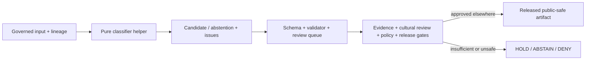

<!-- [KFM_META_BLOCK_V2]
doc_id: kfm://doc/packages-domains-archaeology-candidate-classifier-readme
title: Governed Archaeology Candidate Classifier Helper Boundary
type: readme
version: v0.2
status: draft; repository-grounded; bounded-readme-surface; classifier-not-implemented
owners:
  - OWNER_TBD - Archaeology package/domain steward
  - OWNER_TBD - Cultural/sensitivity/sovereignty review steward
  - OWNER_TBD - Contract/schema/evidence/policy steward
  - OWNER_TBD - Validation/security/release/docs steward
created: 2026-06-13
updated: 2026-07-20
supersedes: v0.1
policy_label: public-review; packages; archaeology; candidate-classifier; no-network; exact-location-deny-by-default; non-authoritative
path: packages/domains/archaeology/candidate-classifier/README.md
truth_posture: CONFIRMED target and prior blob, packages responsibility root, bounded absent package/runtime paths, CandidateFeature/LiDARCandidate/RemoteSensingAnomaly contracts and permissive scaffold schemas, domain test/fixture roots, CODEOWNERS routing, and Archaeology readiness-hold workflow / PROPOSED future pure adapters, candidate-result types, calibration and explanation helpers, safe local issue vocabulary, and deterministic no-network tests / CONFLICTED stale package-specific test and fixture paths, candidate-family overlap, shorter schema alias, policy-versus-helper outcome vocabulary, and parent planning language / UNKNOWN complete recursive directory inventory, package runtime, exports, dependencies, model family, model artifacts, consumers, accepted thresholds, executable classifier, package-specific tests, production evaluation, release use, and public behavior / NEEDS VERIFICATION owners, API compatibility, contract/schema field completeness, policy binding, cultural and sovereignty review, validator wiring, correction propagation, and rollback execution
evidence_snapshot:
  repository: bartytime4life/Kansas-Frontier-Matrix
  repository_id: "1059091169"
  base_ref: main
  base_commit: 0b9307b94c67920e3451e1d40b80d287e7364ee7
  prior_blob: b2413f877eb0ea354eaee49debb324f7a606a6f0
  directory_rules_blob: 2affb080e6f0043867c64c7f06c1ca52030fbd55
  candidate_contract_blob: 8167e1e3be69c177a069249b597947f1ef529695
  candidate_schema_blob: 103fa2d86448490f83a0b9918fcd1c2d445fe269
  archaeology_tests_blob: 229113afacc6acc0839e92318082ccce9e2ceab3
  archaeology_workflow_blob: 41e377f50ca310eccdc4b716ba8374c4fa8181db
related:
  - ../README.md
  - ../../README.md
  - ../../../README.md
  - ../../../../docs/domains/archaeology/README.md
  - ../../../../contracts/domains/archaeology/README.md
  - ../../../../contracts/domains/archaeology/candidate_feature.md
  - ../../../../schemas/contracts/v1/domains/archaeology/README.md
  - ../../../../policy/domains/archaeology/README.md
  - ../../../../tests/domains/archaeology/README.md
  - ../../../../fixtures/domains/archaeology/README.md
  - ../../../../docs/doctrine/directory-rules.md
  - ../../../../docs/adr/ADR-0001-schema-home--schemas-contracts-v1-is-canonical.md
tags: [kfm, archaeology, candidate-classifier, package-boundary, candidate-feature, remote-sensing, evidence, sensitivity, governance]
notes:
  - "v0.2 replaces planning-only package claims with commit-pinned repository evidence and bounded absence checks."
  - "The README and its required generated-work provenance receipt are the only intended changes."
  - "No classifier, package manifest, model artifact, threshold, schema, contract, policy, fixture, test, lifecycle object, or release state is created or activated."
[/KFM_META_BLOCK_V2] -->

<a id="top"></a>

# Governed Archaeology Candidate Classifier Helper Boundary

`packages/domains/archaeology/candidate-classifier/`

> Reusable helper boundary for possible future Archaeology candidate-classification support. The inspected surface is not a verified package or classifier: the README exists, common manifest and implementation paths were absent at the pinned snapshot, and no executable classifier API, model, threshold profile, package-specific test suite, or production consumer was established.


**Quick links:** [Purpose](#purpose) · [Authority](#authority-and-directory-rules-basis) · [Status](#current-evidence-and-maturity) · [Language](#bounded-context-and-language) · [Belongs](#what-belongs-here) · [Exclusions](#what-does-not-belong-here) · [Objects](#object-family-boundaries) · [Interface](#future-interface-rules) · [Model](#model-score-and-threshold-discipline) · [Sensitivity](#sensitivity-rights-and-cultural-governance) · [Trust](#trust-lifecycle-and-public-boundary) · [Validation](#validation-and-admission) · [Rollback](#compatibility-correction-and-rollback) · [Open](#open-verification-register) · [Evidence](#evidence-ledger)

> [!IMPORTANT]
> **Snapshot:** `main@0b9307b94c67920e3451e1d40b80d287e7364ee7`<br>
> **Verified target:** prior README blob `b2413f877eb0ea354eaee49debb324f7a606a6f0`<br>
> **Bounded implementation probes:** no `pyproject.toml`, `package.json`, root `__init__.py`, `src/README.md`, conventional `src/candidate_classifier/` initializer, selected classifier modules, or package-specific README-backed test/fixture lane at the exact checked paths<br>
> **Authority evidence:** draft semantic contracts and permissive scaffold schemas exist for candidate and related families; those surfaces do not prove classifier implementation or field enforcement.

> [!CAUTION]
> A score is not a feature; a candidate is not a site; a threshold pass is not evidence, review, policy approval, cultural consent, lifecycle promotion, fieldwork authorization, release approval, or publication permission. Candidate existence and geometry may themselves be sensitive.

---

## Purpose

A future implementation may provide deterministic, side-effect-minimal helpers that:

- adapt caller-supplied model or rule outputs into reviewable candidate-result shapes;
- preserve native labels, score semantics, units, method identifiers, source roles, and time kinds;
- keep `RemoteSensingAnomaly`, `LiDARCandidate`, `GeophysicsObservation`, and `CandidateFeature` distinct;
- record uncertainty, calibration version, limitations, and explanation codes without asserting truth;
- detect missing, malformed, unsupported, ambiguous, stale, restricted, or out-of-scope inputs;
- prepare safe review-queue payloads while leaving review decisions elsewhere;
- validate local candidate shape against an accepted, field-complete schema when one exists;
- support synthetic, deterministic, no-network tests.

It must not fetch sources, train models, admit data, write lifecycle state, confirm features or sites, decide policy or sensitivity, create evidence, represent cultural consent, approve field activity, emit release records, serve public routes, render maps, or generate authoritative narratives.

[Back to top](#top)

---

## Authority and Directory Rules basis

The existing path is consistent with the Directory Rules responsibility model only if the code is reusable package support. Topic alone does not confer authority.

| Concern | Authority here |
|---|---|
| Reusable candidate-classifier helper behavior | Supporting implementation only, if later implemented and accepted. |
| Archaeology doctrine and ubiquitous language | None - [`docs/domains/archaeology/`](../../../../docs/domains/archaeology/README.md). |
| Object meaning | None - [`contracts/domains/archaeology/`](../../../../contracts/domains/archaeology/README.md). |
| Machine-checkable shape | None - [`schemas/contracts/v1/domains/archaeology/`](../../../../schemas/contracts/v1/domains/archaeology/README.md), under proposed ADR-0001. |
| Admissibility, sensitivity, consent, and disclosure | None - [`policy/domains/archaeology/`](../../../../policy/domains/archaeology/README.md) and accepted policy authorities. |
| Source identity, role, rights, and cadence | None - accepted source descriptors and registries. |
| Evidence closure | None - EvidenceRef/EvidenceBundle and proof systems. |
| Cultural or steward review | None - reviewed records and authorities outside this helper. |
| Lifecycle admission and promotion | None - authorized connectors, pipelines, workers, and promotion controls. |
| Release, correction, withdrawal, and rollback | None - accepted release records and workflows. |
| Public API, map, UI, search, graph, export, and AI | None - governed delivery surfaces downstream of released artifacts. |

The path is not an independent model authority, schema authority, review authority, sensitive-location store, or public trust surface. No new root, parallel contract/schema/policy home, or lifecycle lane is created by this README.

[Back to top](#top)

---

## Current evidence and maturity

| Surface | Repository evidence at the pinned snapshot | Status |
|---|---|---:|
| Target README | v0.1 existed and described a future helper package. | **CONFIRMED prior document** |
| Package directory | GitHub resolves the requested directory and target file. | **CONFIRMED path** |
| Package manifest | `pyproject.toml` and `package.json` were absent at the exact checked paths. | **CONFIRMED bounded absence** |
| Conventional Python surface | Root initializer, `src/README.md`, `src/candidate_classifier/__init__.py`, and selected classifier modules were absent at exact checked paths. | **CONFIRMED bounded absence** |
| Runtime, exports, dependencies, model family | No accepted surface established by inspected evidence. | **UNKNOWN** |
| `CandidateFeature` contract | Draft v0.2 semantic contract exists. | **CONFIRMED contract file** |
| Candidate schema | Draft 2020-12 schema exists with `PROPOSED`, empty `properties`, and `additionalProperties: true`. | **CONFIRMED permissive scaffold** |
| Related candidate contracts/schemas | `LiDARCandidate` and `RemoteSensingAnomaly` draft contracts and permissive scaffold schemas exist. | **CONFIRMED documents/scaffolds** |
| Policy | Archaeology policy README defines deny-by-default intent; concrete enforcement remains unestablished there. | **CONFIRMED policy document / enforcement UNKNOWN** |
| Domain tests | Thirteen named modules are documented; sampled modules are placeholder docstrings. | **CONFIRMED names / executable coverage not established** |
| Candidate fixture | Synthetic candidate-feature README exists; payload inventory and bindings are unverified. | **CONFIRMED fixture README / NOT RUN** |
| Package-specific test/fixture paths named by v0.1 | Exact checked README paths were absent. | **CONFIRMED bounded absence / stale guidance** |
| Archaeology workflow | Structural readiness jobs explicitly hold validation, proof, and release maturity rather than running an accepted classifier suite. | **CONFIRMED readiness workflow** |
| CODEOWNERS | `/packages/` routes to `@bartytime4life`; governance role ownership and required-review enforcement remain separate. | **CONFIRMED routing / governance NEEDS VERIFICATION** |
| Production evaluation, consumer, release, public use | Not established by inspected evidence. | **UNKNOWN** |

Bounded checked surface:

```text
packages/domains/archaeology/candidate-classifier/
├── README.md                         # CONFIRMED
├── pyproject.toml                    # absent at exact path
├── package.json                      # absent at exact path
└── src/candidate_classifier/         # selected conventional paths absent
```

This is not a recursive tree proof. Connector searches returned no indexed classifier implementation, but search absence is query-limited and cannot prove permanent or repository-wide absence.

[Back to top](#top)

---

## Bounded context and language

| Term | Meaning here | Must not be treated as |
|---|---|---|
| Input signal | Caller-supplied observation, feature vector, or model/rule output with lineage. | Source truth or admitted evidence. |
| Classification result | Local helper result with method, score semantics, uncertainty, and issues. | PolicyDecision, ReviewRecord, or proof. |
| Candidate class | A review-routing label under a pinned vocabulary. | Confirmed object identity. |
| Candidate score | Method-specific numeric or ordinal output. | Universal probability or archaeological confidence. |
| Calibrated score | Score interpreted under a named calibration profile and population. | Truth outside that profile or dataset. |
| Threshold | Versioned local decision boundary for candidate routing. | Promotion, publication, fieldwork, or disclosure authority. |
| Explanation code | Bounded reason for a result or issue. | Cultural interpretation or causal proof. |
| Abstention | Refusal to classify because support is insufficient or unsafe. | Negative archaeological finding. |
| Review queue payload | Candidate package for an authorized downstream review flow. | Completed review or consent. |
| Public-safe candidate | Output transformed and released elsewhere for a named audience. | Permission to expose the internal candidate or reverse-engineer its location. |

Names such as `candidate`, `likely`, `high score`, or `public-safe` must never silently cross the candidate-to-confirmed or internal-to-public boundary.

[Back to top](#top)

---

## What belongs here

Subject to implementation review, this directory may contain:

- typed, model-agnostic adapter interfaces for caller-supplied outputs;
- immutable candidate-result and issue types;
- score parsing, normalization, and calibration helpers under pinned profiles;
- candidate vocabulary mappings that preserve native labels and ambiguity;
- deterministic rank and tie-handling helpers;
- explanation-code and limitation helpers that avoid sensitive detail;
- references to model, method, feature-schema, calibration, and source lineage;
- review-queue DTO adapters that preserve obligations without completing review;
- local shape adapters against accepted contract/schema versions;
- synthetic, minimized fixture builders when fixture policy permits;
- safe error formatting and log-minimization helpers.

Placement test: the implementation is reusable across authorized consumers, has no hidden I/O, preserves candidate and governance boundaries, and cannot decide source admission, identity confirmation, evidence closure, cultural consent, policy, promotion, field activity, release, or publication.

[Back to top](#top)

---

## What does not belong here

| Does not belong | Owning responsibility |
|---|---|
| Archaeology doctrine, terminology, source strategy, or sensitivity intent | `docs/domains/archaeology/` |
| Semantic contracts | `contracts/domains/archaeology/` |
| JSON Schemas | `schemas/contracts/v1/domains/archaeology/` or accepted schema home |
| Executable policy or consent decisions | `policy/` roots and accepted review systems |
| Source descriptors, activation, or rights records | Source registry and admission authorities |
| Source fetchers and watchers | `connectors/` or watcher roots; watchers remain non-publishers |
| Training, batch inference, promotion, or release pipelines | Accepted executable pipeline/runtime roots |
| Training data, feature stores, fitted weights, caches, run outputs, or sensitive candidates | Accepted governed data/model/artifact roots; exact home **NEEDS VERIFICATION** |
| Lifecycle records | `data/<phase>/archaeology/` under governed controls |
| Stored receipts and proofs | Accepted `data/receipts/` and `data/proofs/` lanes |
| Cultural/steward review records | Accepted review-record authorities |
| Release, correction, withdrawal, or rollback records | `release/` and accepted record homes |
| Domain tests and reusable fixtures | [`tests/domains/archaeology/`](../../../../tests/domains/archaeology/README.md) and [`fixtures/domains/archaeology/`](../../../../fixtures/domains/archaeology/README.md) |
| Public API/UI/map/search/graph/export/AI behavior | Governed app and runtime roots |
| Secrets or real protected examples | Secret manager or governed restricted storage, never this README/package |

The v0.1 package-specific test and fixture routes are not retained as facts because their exact checked README paths were absent and current repository test doctrine uses the domain roots.

[Back to top](#top)

---

## Object-family boundaries

| Object family | Possible relationship to a future classifier | Prohibited collapse |
|---|---|---|
| `RemoteSensingAnomaly` | Input or candidate-result family preserving sensor/method lineage. | Anomaly -> feature/site truth. |
| `LiDARCandidate` | Specialized candidate family preserving LiDAR derivation and uncertainty. | Terrain signal -> confirmed cultural feature. |
| `GeophysicsObservation` | Corroborating or contesting observation supplied by a governed caller. | Observation -> proof closure. |
| `CandidateFeature` | Candidate object a helper may prepare for validation and review. | Candidate -> `ArchaeologicalSite`. |
| `ArchaeologicalSite` | Downstream reviewed identity; never produced as a local classifier conclusion. | Score/label -> confirmed site. |
| `CulturalReview` | Downstream or referenced review posture. | Classifier explanation -> cultural review or consent. |
| `StewardReview` | Downstream review posture. | Review-queue entry -> completed steward review. |
| `SensitivityTransform` | External transform authority a result may reference. | Redaction hint -> transform execution or approval. |
| `PublicationTransformReceipt` / `RedactionReceipt` | External record of a performed, governed transform. | Helper metadata -> receipt. |
| `PolicyDecision` | External admissibility decision. | Threshold result -> allow/deny decision. |
| `EvidenceBundle` | External proof support for claim-bearing downstream use. | Model output -> evidence bundle. |

The classifier must preserve method and source-role differences. Multiple agreeing derived models do not become independent primary evidence merely because their scores agree.

[Back to top](#top)

---

## Future interface rules

No public API, import path, export list, or compatibility promise is currently established.

Any future interface must:

1. expose reviewed symbols deliberately rather than through wildcard exports;
2. use typed, documented inputs and outputs;
3. default to pure or side-effect-minimal behavior;
4. avoid import-time network access, filesystem/database writes, model downloads, secret loading, telemetry, or global configuration;
5. require caller-supplied method/model/calibration/profile references instead of ambient inference;
6. preserve native labels, source roles, time kinds, geometry precision, uncertainty, and limitations;
7. return explicit abstention or issue results rather than guessing;
8. avoid operations named `confirm_site`, `approve`, `publish`, `release`, `admit`, `prove`, or equivalent misleading authority verbs;
9. keep policy, evidence, review, lifecycle, and release duties with the caller and their owning systems;
10. use versioned migrations and parity tests for compatibility changes.

A possible local result vocabulary is **PROPOSED** pending a contract:

| Local result | Meaning | Not equivalent to |
|---|---|---|
| `CANDIDATE` | A bounded candidate result was produced. | Confirmed feature or site. |
| `ABSTAIN` | Support, calibration, safety, or scope is insufficient. | Negative finding. |
| `INVALID_INPUT` | Input failed local shape or invariant checks. | Policy denial. |
| `UNSUPPORTED` | Method, family, version, or value is not supported. | Evidence conflict resolution. |
| `ERROR` | Helper execution failed safely. | Permission to retry with weaker controls. |

Policy outcomes such as `ALLOW`, `DENY`, `RESTRICT`, `HOLD`, `ABSTAIN`, and `ERROR` belong to policy/runtime adapters. Identical words do not make the result families interchangeable.

[Back to top](#top)

---

## Model, score, and threshold discipline

Whether this package will be rule-based, statistical, machine-learning-based, or an adapter over several methods is **UNKNOWN**.

If a model-backed implementation is accepted, every consequential result should preserve references to:

- immutable model or ruleset identity and digest;
- code and feature-schema version;
- training/evaluation data lineage, rights, and temporal scope without embedding protected data;
- calibration population, method, version, and validity window;
- candidate vocabulary and mapping version;
- score definition, direction, range, null behavior, and comparability limits;
- threshold profile, intended use, owner, approval state, and change history;
- uncertainty and out-of-distribution handling;
- deterministic settings or documented nondeterminism;
- evaluation report, known failure modes, subgroup/geographic/temporal limitations, and rollback target.

Thresholds must not be guessed from examples, hidden in code without versioning, or treated as universal. A threshold change can alter review burden, exposure risk, false-positive patterns, and downstream correction scope; it therefore requires before/after fixtures, evaluation, review, migration, invalidation, and rollback planning appropriate to impact.

The package must not optimize a score by weakening abstention, sensitivity, evidence, cultural review, or release controls.

[Back to top](#top)

---

## Sensitivity, rights, and cultural governance

Archaeology candidate classification is a sensitive lane even before confirmation.

Required default posture:

- exact or reverse-engineerable candidate locations are denied for ordinary public output;
- candidate existence, cluster density, ranking, heatmaps, tiles, explanations, and review-queue order may reveal protected information;
- sacred, burial, human-remains, collection-security, sovereignty-bearing, private-land, oral-history, or looting-risk context fails closed;
- hashing an internal ID does not make it public-safe;
- low-confidence or negative results do not authorize disclosure or prove absence;
- errors, logs, traces, metrics, screenshots, and test failures must minimize payloads and geometry;
- examples must be synthetic or explicitly sanitized and must not permit reconstruction;
- cultural review, rights-holder authority, consent, revocation, embargo, and sovereignty obligations remain external governed inputs;
- public-safe output requires named transforms, receipts, policy, review, release, correction, and rollback support outside this package;
- revocation or correction must propagate to derived candidates, indexes, caches, embeddings, tiles, exports, and generated summaries through owning systems.

This README adds no sensitive record, real coordinate, operational threshold, private identity, source payload, credential, model artifact, or reconstructive example.

[Back to top](#top)

---

## Trust, lifecycle, and public boundary



The helper remains below the KFM trust membrane:

```text
RAW -> WORK / QUARANTINE -> PROCESSED -> CATALOG / TRIPLET -> PUBLISHED
```

It may transform caller-supplied in-memory values. It must not move data between lifecycle states, infer state from a path, create promotion or release records, write directly to canonical/internal stores, or provide a public bypass. Standard public clients remain downstream of governed interfaces and released artifacts.

Required invariants:

```yaml
no_import_time_io: true
no_hidden_network_or_model_download: true
no_secret_or_protected_payload_loading: true
no_source_admission_or_lifecycle_write: true
no_feature_or_site_confirmation: true
no_policy_or_review_decision: true
no_evidence_fabrication_or_closure: true
no_fieldwork_or_release_authorization: true
no_public_exact_or_reconstructive_location: true
candidate_output_is_not_truth: true
```

[Back to top](#top)

---

## Failure semantics

Future helpers should use stable, non-sensitive reason codes. The following local classes are **PROPOSED** pending an accepted registry:

`MISSING_REQUIRED` · `MALFORMED_VALUE` · `UNSUPPORTED_VERSION` · `UNSUPPORTED_FAMILY` · `AMBIGUOUS_MAPPING` · `UNCALIBRATED_SCORE` · `OUT_OF_DISTRIBUTION` · `STALE_PROFILE` · `RESTRICTED_DETAIL` · `CONFLICTED_AUTHORITY` · `INTERNAL_ERROR`

Failures must:

- fail closed without expanding access or precision;
- preserve safe lineage handles where permitted;
- avoid logging raw vectors, protected geometry, identities, source payloads, cultural context, or model internals that increase reconstruction risk;
- distinguish malformed input, unsupported scope, abstention, policy restriction, and internal failure;
- avoid converting missing evidence into a low score or negative archaeological claim.

[Back to top](#top)

---

## Validation and admission

| Area | Required positive proof | Required negative proof | Current status |
|---|---|---|---:|
| Package/import | Reviewed package mechanics and side-effect-free import. | No network, download, secret load, write, telemetry, or global mutation. | **NOT IMPLEMENTED** |
| Input shape | Accepted family/version and complete required refs. | Missing/malformed/unsupported inputs return safe issues. | **NOT IMPLEMENTED** |
| Candidate boundary | Candidate result preserves family, uncertainty, method, lineage, and status. | Cannot emit or imply `ArchaeologicalSite`. | **NOT IMPLEMENTED** |
| Score/calibration | Pinned definitions and reproducible calibration behavior. | Uncalibrated/incomparable/out-of-scope scores abstain. | **NOT IMPLEMENTED** |
| Thresholds | Versioned profile produces deterministic routing. | Threshold pass cannot approve policy, review, fieldwork, or release. | **NOT IMPLEMENTED** |
| Explanations | Stable, bounded explanation codes and limitations. | No sensitive geometry, cultural inference, or causal overclaim. | **NOT IMPLEMENTED** |
| Sensitivity | Obligations and precision constraints are preserved. | Exact/reconstructive output and unsafe logging fail closed. | **NOT IMPLEMENTED** |
| Evidence/review/policy | Caller refs survive unchanged. | Helper cannot create proof, consent, review completion, or PolicyDecision. | **NOT IMPLEMENTED** |
| Determinism/security | Stable ordering, safe errors, bounded resources. | Environment, input order, or hidden state cannot silently change results. | **NOT IMPLEMENTED** |
| Correction/rollback | Version and lineage support downstream invalidation. | Stale model/profile/results cannot remain silently active. | **NOT IMPLEMENTED** |

Current domain test and fixture homes are:

- [`tests/domains/archaeology/`](../../../../tests/domains/archaeology/README.md)
- [`fixtures/domains/archaeology/`](../../../../fixtures/domains/archaeology/README.md)

A classifier-specific child lane under those roots is **PROPOSED / NEEDS VERIFICATION** and must be reconciled with parent naming, fixture routing, owners, and collection behavior before creation. Do not recreate the stale `tests/packages/...` or `fixtures/packages/...` routes by assumption.

Smallest sound implementation sequence:

1. confirm owners, package runtime, build backend, Python/runtime support, import name, dependency policy, and public API;
2. accept a field-complete local result/issue contract and schema or explicitly bound internal-only type;
3. define source/model/method/calibration/threshold identities and safe finite outcomes;
4. implement immutable result and issue types with no I/O;
5. add one low-risk adapter using synthetic, no-network, non-geographic fixtures;
6. prove candidate-not-site, no-policy, no-review, no-evidence, no-release, and no-sensitive-log boundaries;
7. add score/calibration behavior only with an evaluation profile and rollback target;
8. add one governed consumer at a time after security, cultural, sensitivity, and domain review;
9. wire meaningful CI and retained safe reports without treating a green check as truth or release.

Review commands, not pass claims:

```bash
python -m pytest tests/domains/archaeology
python tools/validate_all.py
```

The current Archaeology workflow explicitly reports readiness holds. A green structural hold is not executable classifier validation.

[Back to top](#top)

---

## Compatibility, correction, and rollback

README rollback target:

```text
b2413f877eb0ea354eaee49debb324f7a606a6f0
```

Known drift and compatibility pressure:

- v0.1 package-specific test/fixture routes versus current domain test/fixture roots;
- `schemas/contracts/v1/domains/archaeology/` versus the shorter compatibility/index lane;
- permissive scaffold schemas versus detailed semantic contracts;
- overlap among `RemoteSensingAnomaly`, `LiDARCandidate`, `GeophysicsObservation`, and `CandidateFeature`;
- local helper outcomes versus policy/runtime outcome vocabularies;
- parent package planning language versus the bounded unimplemented child surface;
- model, method, calibration, threshold, and issue registries not yet accepted.

Do not settle these conflicts by filename, import convention, or classifier behavior. Use the owning steward, accepted ADR/migration process, explicit compatibility notes, and parity tests.

Any future model, feature, vocabulary, calibration, threshold, explanation, identity, sensitivity, or result-contract change needs:

- a version and immutable artifact/profile reference;
- before/after synthetic fixtures and evaluation evidence;
- impact analysis across consumers and sensitive/public surfaces;
- review of rights, cultural, sovereignty, bias, error, and reconstruction risk;
- migration or recomputation plan;
- correction, invalidation, cache/index/export cleanup, and notification scope;
- a tested rollback or safe disable target.

For this documentation-only change, rollback before merge is closing the draft PR and abandoning its branch. After merge, use a transparent revert restoring the prior README blob and removing the paired generated receipt. No classifier, model, data, policy, lifecycle, release, deployment, or public rollback is required because none changes.

[Back to top](#top)

---

## Definition of done

### README v0.2

- [x] Replaces planning-only implementation implications with pinned repository evidence.
- [x] Preserves the `packages/` helper boundary and routes authority to owning roots.
- [x] Corrects stale package-specific test/fixture guidance.
- [x] Grounds candidate contracts, scaffold schemas, placeholder tests, fixture posture, CODEOWNERS, and readiness workflow.
- [x] Separates signal, score, candidate, feature, site, evidence, review, policy, release, and publication.
- [x] Covers model/threshold discipline, sensitivity, cultural governance, validation, correction, and rollback.
- [x] Adds no executable classifier, model, schema, contract, policy, sensitive data, or release claim.

### First executable classifier helper

- [ ] Owners, runtime, build/install, import name, dependency policy, exports, and compatibility policy are accepted.
- [ ] Candidate-result, issue, method, model, calibration, threshold, and vocabulary contracts are accepted and field-complete.
- [ ] No-network/import-safety and bounded-resource behavior pass.
- [ ] Positive, negative, ambiguous, stale, out-of-distribution, restricted, and error fixtures pass.
- [ ] Candidate-not-site, no-evidence, no-review, no-policy, no-fieldwork, no-release, and no-public-bypass tests pass.
- [ ] Sensitive logging, reconstruction, cultural/sovereignty, rights, and revocation risks are reviewed.
- [ ] Evaluation limitations, correction cascade, invalidation, migration, and rollback are documented and tested.
- [ ] At least one governed consumer and meaningful CI gate are verified.

[Back to top](#top)

---

## Open verification register

| ID | Question | Status |
|---|---|---|
| `PKG-ARCH-CC-001` | Who owns package, model, domain, cultural, sensitivity, security, and release review? | **NEEDS VERIFICATION** |
| `PKG-ARCH-CC-002` | Is the directory intentionally README-only, or are differently named/generated files present? | **NEEDS VERIFICATION** |
| `PKG-ARCH-CC-003` | Which runtime, build backend, import name, versions, dependencies, and exports apply? | **UNKNOWN** |
| `PKG-ARCH-CC-004` | Is the helper rule-based, model-backed, adapter-only, or mixed? | **UNKNOWN** |
| `PKG-ARCH-CC-005` | Which model/method, feature, vocabulary, calibration, threshold, and issue registries are authoritative? | **UNKNOWN** |
| `PKG-ARCH-CC-006` | Which candidate/result fields and schema versions are accepted and field-complete? | **NEEDS VERIFICATION** |
| `PKG-ARCH-CC-007` | How are overlapping candidate families mapped without losing method or source role? | **CONFLICTED / NEEDS VERIFICATION** |
| `PKG-ARCH-CC-008` | Which finite helper outcomes map to policy/runtime envelopes? | **NEEDS VERIFICATION** |
| `PKG-ARCH-CC-009` | Which synthetic fixtures and executable tests bind the helper? | **UNKNOWN** |
| `PKG-ARCH-CC-010` | What evaluation, calibration, geographic/temporal, bias, and out-of-distribution evidence is required? | **UNKNOWN** |
| `PKG-ARCH-CC-011` | What resource, determinism, reproducibility, and safe-error limits apply? | **UNKNOWN** |
| `PKG-ARCH-CC-012` | How are exact/reconstructive geometry, logs, metrics, explanations, and review queues protected? | **NEEDS VERIFICATION** |
| `PKG-ARCH-CC-013` | How are cultural authority, sovereignty, consent, revocation, and embargo obligations propagated? | **NEEDS VERIFICATION** |
| `PKG-ARCH-CC-014` | Which authorized consumers exist, and do they preserve the governed trust membrane? | **UNKNOWN** |
| `PKG-ARCH-CC-015` | How do corrections invalidate candidates, caches, indexes, exports, and generated summaries? | **UNKNOWN** |
| `PKG-ARCH-CC-016` | Which CI check, review rule, rollback drill, and safe-disable mechanism govern activation? | **NEEDS VERIFICATION** |

[Back to top](#top)

---

## Evidence ledger

| Source | Status | Supports | Limits |
|---|---|---|---|
| Current request and KFM documentation prompt | **CONFIRMED task authority** | Scope, implementation route, evidence discipline, review, and provenance-receipt requirement. | Not repository or runtime proof. |
| Prior target blob `b2413f...` | **CONFIRMED** | Existing v0.1 purpose, candidate boundary, and rollback target. | Planning-oriented; stale test/fixture routes. |
| Exact package-path probes | **CONFIRMED bounded checks** | Common manifest, initializer, source, selected module, and package-specific README paths were absent. | Not a recursive tree, history, generated-workspace, or differently named file proof. |
| Directory Rules v1.4 | **CONFIRMED doctrine** | `packages/` responsibility and authority separation. | Specific implementations remain evidence-bound. |
| Parent package and Archaeology domain docs | **CONFIRMED documents** | Helper posture, candidate-not-site rule, sensitivity, cultural review, and lifecycle boundaries. | Do not prove child implementation. |
| Candidate and site contracts | **CONFIRMED draft contracts** | `CandidateFeature`, `LiDARCandidate`, `RemoteSensingAnomaly`, `CulturalReview`, `StewardReview`, and `ArchaeologicalSite` semantic separation. | Draft meaning is not machine enforcement or runtime proof. |
| Candidate schemas | **CONFIRMED permissive scaffolds** | Draft 2020-12 files and contract links exist. | Empty properties and `additionalProperties: true` do not enforce fields. |
| Archaeology policy README | **CONFIRMED policy documentation** | Deny-by-default intent and finite policy outcomes. | Concrete bundles, tests, CI, and runtime enforcement remain unverified. |
| Archaeology tests and fixture READMEs | **CONFIRMED names/docs** | Current root placement, thirteen named tests, placeholder samples, and synthetic candidate-fixture lane. | Payload inventory, collection, assertions, and pass results remain unverified. |
| `domain-archaeology` workflow | **CONFIRMED workflow** | Structural readiness holds for validation, proof, and release. | Does not run or prove classifier behavior. |
| CODEOWNERS | **CONFIRMED routing** | `/packages/` review request route. | Does not prove independent review, policy approval, release approval, or branch protection. |

[Back to top](#top)

---

## Status summary

`packages/domains/archaeology/candidate-classifier/` is a verified documentation path for a possible reusable helper boundary. It is not yet a verified installable package, classifier implementation, model runtime, training system, feature store, candidate authority, site-confirmation authority, cultural or steward review system, policy engine, EvidenceBundle resolver, lifecycle writer, fieldwork authority, release authority, public API, map layer, UI component, or AI truth surface.

Until implementation and governed admission are proved, the safe description is: **candidate-classifier helper boundary documented; executable classifier not established**.

<p align="right"><a href="#top">Back to top</a></p>
