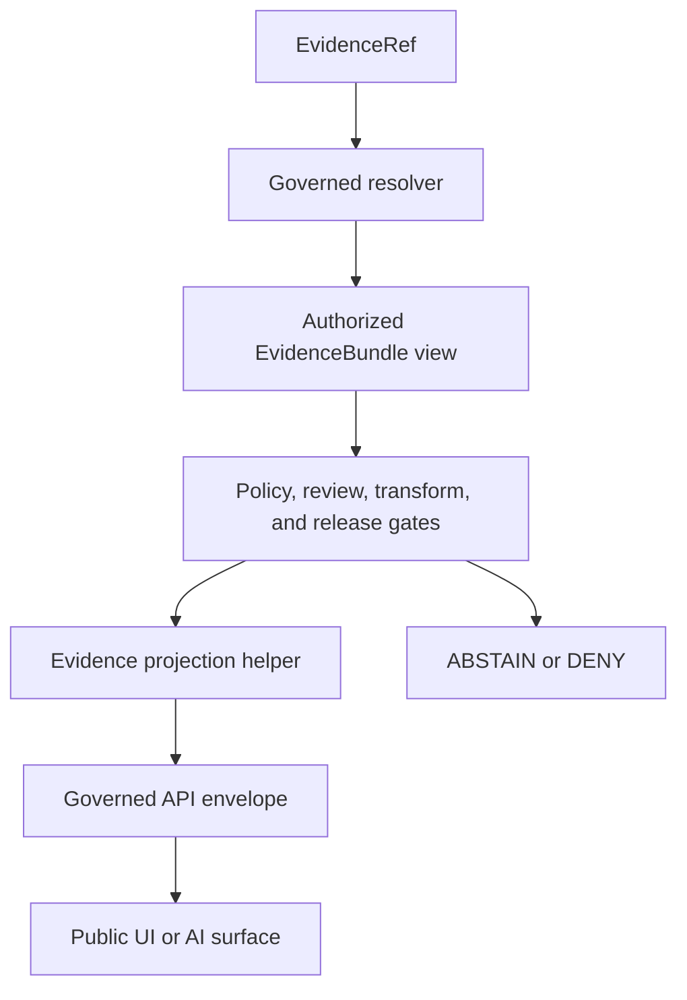

<!-- [KFM_META_BLOCK_V2]
doc_id: kfm://doc/packages-domains-archaeology-evidence-projection-readme
title: Governed Archaeology Evidence Projection Helper Boundary
type: readme
version: v0.2
status: draft; repository-grounded; bounded-readme-surface; projector-not-implemented; sensitive-domain; non-authoritative
owners:
  - OWNER_TBD - Archaeology package/domain steward
  - OWNER_TBD - Cultural/sensitivity/sovereignty review steward
  - OWNER_TBD - Evidence/contract/schema/policy steward
  - OWNER_TBD - Validation/security/release/docs steward
created: 2026-06-13
updated: 2026-07-20
supersedes: v0.1
policy_label: public-review; packages; archaeology; evidence-projection; no-network; exact-location-deny-by-default; non-authoritative
path: packages/domains/archaeology/evidence-projection/README.md
truth_posture: CONFIRMED target and prior blob, packages responsibility root, bounded absent package/runtime paths, fielded draft EvidenceRef and EvidenceBundle contracts/schemas, conflicting provisional Evidence Drawer payload homes, draft EvidenceBundle proof lane, domain test/fixture roots, and Archaeology readiness-hold workflow / PROPOSED future pure projection adapters, local projection-result vocabulary, projection profiles, deterministic canonicalization, and no-network tests / CONFLICTED stale package-specific test and fixture paths, evidence-versus-UI payload authority, generic citation-versus-domain projection ownership, and prior language that could imply catalog or triplet projection authority / UNKNOWN complete recursive directory inventory, runtime language, exports, dependencies, consumers, canonical output DTO, accepted policy evaluator, resolver behavior, public API behavior, production evidence inventory, and release use / NEEDS VERIFICATION owners, payload-home ADR, cultural and sovereignty review, schema expansion, validator wiring, policy binding, correction propagation, rollback execution, and public non-disclosure proof
evidence_snapshot:
  repository: bartytime4life/Kansas-Frontier-Matrix
  repository_id: "1059091169"
  base_ref: main
  base_commit: 031f7ac86c4d9801bd35267fb7cca0fd79ed4711
  prior_blob: cf4fcaee956bc393f953bea9c5778b06a5d3651a
  directory_rules_blob: 2affb080e6f0043867c64c7f06c1ca52030fbd55
  evidence_ref_contract_blob: afd3a964435445edbb694b5edf16e2b6ddd49a92
  evidence_bundle_contract_blob: 731c348832add23cddd14e796aa56ce2b9268259
  evidence_ref_schema_blob: 42f499df613a9d68e5ca6fc5ec75ff8058c155b9
  evidence_bundle_schema_blob: cf5256831b63dca46a5f68b168441adcf68b8751
  evidence_drawer_evidence_schema_blob: 662396d418be3a258c15ab7923a4186184ec2136
  evidence_drawer_ui_schema_blob: 0f0c984c950cdce86f5a0ffb5ccc7a337a17eb18
  archaeology_tests_blob: 229113afacc6acc0839e92318082ccce9e2ceab3
  archaeology_fixtures_blob: ab348d4a5345d52cb0999072138e7c0feb63e8f1
  evidence_bundle_proof_readme_blob: bf304383b725db95e0f8902f0c7c59d0a3cd0ee3
  archaeology_workflow_blob: 41e377f50ca310eccdc4b716ba8374c4fa8181db
related:
  - ../README.md
  - ../../README.md
  - ../../../README.md
  - ../../../citation/README.md
  - ../../../../docs/doctrine/directory-rules.md
  - ../../../../docs/domains/archaeology/README.md
  - ../../../../docs/domains/archaeology/SENSITIVITY.md
  - ../../../../docs/domains/archaeology/PUBLICATION_AND_POLICY.md
  - ../../../../contracts/evidence/evidence_ref.md
  - ../../../../contracts/evidence/evidence_bundle.md
  - ../../../../contracts/evidence/evidence_drawer_payload.md
  - ../../../../contracts/ui/evidence_drawer_payload.md
  - ../../../../schemas/contracts/v1/evidence/evidence_ref.schema.json
  - ../../../../schemas/contracts/v1/evidence/evidence_bundle.schema.json
  - ../../../../policy/domains/archaeology/README.md
  - ../../../../tests/domains/archaeology/README.md
  - ../../../../fixtures/domains/archaeology/README.md
  - ../../../../data/proofs/evidence_bundle/README.md
tags: [kfm, archaeology, evidence-projection, evidence-ref, evidence-bundle, citation, sensitivity, trust-membrane, governance]
notes:
  - "v0.2 replaces planning-only package claims with commit-pinned repository evidence and bounded absence checks."
  - "The README and its required generated-work provenance receipt are the only intended changes."
  - "No projector, resolver, output DTO, package manifest, schema, contract, policy, fixture, test, proof, lifecycle object, release state, API route, or UI component is created or activated."
[/KFM_META_BLOCK_V2] -->

<a id="top"></a>

# Governed Archaeology Evidence Projection Helper Boundary

`packages/domains/archaeology/evidence-projection/`

> Reusable helper boundary for a possible future Archaeology evidence projector. The inspected surface is not a verified package or projector: the README exists, conventional manifest and implementation paths were absent at the pinned snapshot, and no canonical output DTO, executable API, package-specific test lane, production consumer, or public release behavior was established.


**Quick links:** [Purpose](#purpose) · [Authority](#authority-and-directory-rules-basis) · [Status](#current-evidence-and-maturity) · [Language](#bounded-context-and-anti-collapse-rules) · [Belongs](#what-belongs-here) · [Exclusions](#what-does-not-belong-here) · [Contract](#future-projection-contract) · [Profiles](#projection-profiles-and-consumers) · [Sensitivity](#sensitivity-rights-and-cultural-governance) · [Trust](#trust-membrane-and-lifecycle) · [Validation](#validation-and-admission) · [Rollback](#compatibility-correction-and-rollback) · [Open](#open-verification-register) · [Evidence](#evidence-ledger)

> [!IMPORTANT]
> **Snapshot:** `main@031f7ac86c4d9801bd35267fb7cca0fd79ed4711`<br>
> **Verified target:** prior README blob `cf4fcaee956bc393f953bea9c5778b06a5d3651a`<br>
> **Bounded implementation probes:** no `pyproject.toml`, `package.json`, root `__init__.py`, `src/README.md`, conventional `src/evidence_projection/` initializer, selected root projector module, or package-specific README-backed test/fixture lane at the exact checked paths<br>
> **Authority evidence:** fielded draft EvidenceRef and EvidenceBundle schemas exist; both remain `PROPOSED`. Evidence Drawer payload authority is unresolved between evidence and UI contract/schema families.

> [!CAUTION]
> A pointer is not evidence closure; a bundle is not a policy decision; a projection is not a citation validation result, cultural review, sensitivity transform, release approval, public artifact, or permission to disclose. Exact or reconstructive Archaeology location and culturally controlled context fail closed.

---

## Purpose

A future implementation may provide deterministic, side-effect-minimal adapters that convert caller-supplied, already-authorized evidence material into bounded Archaeology projection shapes while preserving its provenance and limitations.

It may eventually:

- validate and copy `EvidenceRef` pointers without resolving them implicitly;
- project an already-resolved, authorized `EvidenceBundle` view into a narrower consumer shape;
- preserve claim scope, source role, citation, rights, sensitivity, transform, checksum, and specification references;
- preserve cultural-review, steward-review, policy-decision, transform-receipt, release, correction, and supersession references without asserting their completion;
- produce structured incomplete, blocked, unsupported, or invalid results without fabricating prose;
- apply an accepted, versioned projection profile after upstream authorization;
- canonicalize ordering and serialization for deterministic comparison;
- support synthetic, sanitized, no-network tests.

It must not fetch sources, resolve arbitrary references, open proof stores, create or amend EvidenceBundles, validate citation truth, infer support, decide policy, decide cultural authority, perform sensitivity transforms, write lifecycle state, approve release, serve public routes, render UI, or generate authoritative narratives.

[Back to top](#top)

---

## Authority and Directory Rules basis

The path is compatible with the Directory Rules responsibility model only as reusable package support. Topic, proximity, or a successful projection does not transfer authority into this package.

| Concern | Authority here |
|---|---|
| Reusable Archaeology projection mechanics | Supporting implementation only, if later implemented and accepted. |
| Archaeology doctrine and ubiquitous language | None - [`docs/domains/archaeology/`](../../../../docs/domains/archaeology/README.md). |
| Evidence meaning | None - [`EvidenceRef`](../../../../contracts/evidence/evidence_ref.md) and [`EvidenceBundle`](../../../../contracts/evidence/evidence_bundle.md) semantic contracts. |
| Machine-checkable evidence shape | None - canonical schemas under `schemas/contracts/v1/evidence/`. |
| Generic citation formatting and shared citation behavior | None - [`packages/citation/`](../../../citation/README.md), where accepted. |
| Archaeology sensitivity, access, consent, and disclosure policy | None - [`policy/domains/archaeology/`](../../../../policy/domains/archaeology/README.md) and accepted policy roots. |
| Evidence resolution and proof storage | None - governed resolvers and [`data/proofs/evidence_bundle/`](../../../../data/proofs/evidence_bundle/README.md). |
| Cultural or steward review | None - governed review records and authorities outside this helper. |
| Lifecycle admission and promotion | None - authorized connectors, pipelines, workers, and promotion controls. |
| Release, correction, withdrawal, and rollback | None - accepted release records and workflows. |
| Public API, Evidence Drawer, map, search, graph, export, and AI | None - governed delivery surfaces downstream of released artifacts. |

No new root, parallel contract/schema/policy home, hidden proof store, or release lane may be created here.

[Back to top](#top)

---

## Current evidence and maturity

### Confirmed at the pinned snapshot

| Evidence | Finding | Consequence |
|---|---|---|
| Target README | The v0.1 file exists at blob `cf4fcae...`. | This revision updates an existing planning document. |
| Package probes | Common manifest, initializer, source README, conventional source initializer, and selected projector module paths were absent. | Do not claim a runnable package, language, imports, exports, dependencies, or API. |
| EvidenceRef contract/schema | Draft semantic contract and a fielded `PROPOSED` schema exist. The schema requires `ref` and `kind`, permits optional `bundle_ref`, and rejects undeclared top-level fields. | A future projector may consume validated pointers; schema validity does not prove resolution or closure. |
| EvidenceBundle contract/schema | Draft semantic contract and a fielded `PROPOSED` schema exist. The schema requires claim scope, evidence/source/citation/rights/sensitivity/transform/checksum/specification fields and rejects undeclared top-level fields. | A future projector may consume an authorized bundle view; schema validity does not prove support, access, policy, or release. |
| Evidence Drawer payloads | Evidence-family schema has no declared fields and allows additional properties; UI-family schema requires only `id` and also allows additional properties. Both are `PROPOSED`. | The canonical output home and field set are unresolved. This README must not declare a production DTO. |
| EvidenceBundle proof lane | Parent README exists and lists Archaeology support as `PROPOSED`; global schema, concrete inventory, resolver, access controls, and enforcement remain verification-bound. | This helper cannot claim a usable Archaeology proof inventory. |
| Tests | [`tests/domains/archaeology/`](../../../../tests/domains/archaeology/README.md) documents 13 named modules, while sampled modules are placeholder-only. | File names and CI topology do not prove executable evidence-projection enforcement. |
| Fixtures | [`fixtures/domains/archaeology/`](../../../../fixtures/domains/archaeology/README.md) is the confirmed reusable fixture root; payload inventory remains unverified. | Use only synthetic or sanitized domain fixtures after consumer/test linkage is established. |
| Workflow | `domain-archaeology.yml` is an executable readiness-hold workflow with read-only contents permission. | It verifies maturity boundaries and intentionally does not prove validation, EvidenceBundle closure, or release. |

### Bounded absence, not global nonexistence

The probes establish only the named paths at the pinned commit. They do not prove permanent absence from history, branches, ignored workspaces, generated artifacts, external stores, differently named files, or later commits.

### Maturity statement

| Capability | Status |
|---|---|
| Responsibility boundary documented | `CONFIRMED` by this README revision. |
| EvidenceRef and EvidenceBundle semantic/schema inputs | `CONFIRMED` draft surfaces; both schemas are `PROPOSED`. |
| Canonical output contract and schema | `CONFLICTED` / `NEEDS VERIFICATION`. |
| Projector implementation and exports | `NOT IMPLEMENTED` at checked paths. |
| Resolver, proof-store access, and authorization integration | `UNKNOWN` / outside this helper. |
| Package-specific executable tests and fixtures | `NOT ESTABLISHED` at checked paths. |
| Public API, UI, catalog, graph, or release consumer | `UNKNOWN`. |
| Production readiness | `NOT ESTABLISHED`. |

[Back to top](#top)

---

## Bounded context and anti-collapse rules

Use these terms precisely:

| Term | Meaning in this boundary |
|---|---|
| `EvidenceRef` | Governed pointer. It may name a bundle but does not establish referential resolution or evidence closure. |
| `EvidenceBundle` | Claim-scope closure artifact with evidence, source, citation, rights, sensitivity, transform, checksum, and specification material. It is not policy or release authority. |
| Resolution | Authorized lookup and integrity verification of a reference. It is not an implicit projector side effect. |
| Projection | Deterministic narrowing or reshaping of authorized input while preserving required trust metadata. It is not proof creation. |
| Citation validation | Separate determination that a citation supports a claim under the accepted validator contract. Projection may preserve its reference, not manufacture the result. |
| Sensitivity transform | Governed redaction, suppression, or generalization operation with its own policy, review, and receipt burden. Projection may consume an approved output, not perform or approve the transform. |
| Evidence Drawer payload | Consumer-facing evidence projection whose canonical contract/schema home and field set remain unresolved. |
| Release | Governed decision and manifest state that allows a specific artifact and audience. A release reference is not release approval. |

Disallowed collapses:

```text
EvidenceRef -> resolved evidence
schema-valid EvidenceRef -> live target
EvidenceBundle -> claim truth
projection -> proof or citation validation
projection profile -> policy decision
omitted field -> approved redaction
transform ref -> transform execution
review ref -> review completion or consent
release ref -> release approval
Evidence Drawer payload -> public permission
catalog projection -> catalog truth
triplet projection -> graph truth
successful helper test -> lifecycle promotion
```

The projector must preserve source-role distinctions. A contextual source cannot become corroborating or primary because it was projected, summarized, ranked, or displayed. A candidate or anomaly cannot become an ArchaeologicalSite through projection.

[Back to top](#top)

---

## What belongs here

Only evidence-backed reusable support should be admitted. Possible future contents include:

- pure adapters from validated EvidenceRef values to bounded internal pointer views;
- pure adapters from an authorized EvidenceBundle view to a named, versioned projection profile;
- deterministic citation ordering and stable identifier preservation specific to Archaeology exposure needs;
- source-role, limitation, rights, sensitivity, transform, review, policy, release, and correction reference preservation;
- explicit incomplete/blocked/invalid result constructors that do not invent evidence or prose;
- schema-validation adapters that call canonical validators rather than reimplementing schema authority;
- safe diagnostic and reason-code mapping that cannot echo controlled values;
- synthetic fixture builders tied to executable domain tests.

Admission test:

> If code can remain a pure, deterministic Archaeology-specific projection helper with no network access, proof-store ownership, policy decision, lifecycle write, release approval, public routing, or sensitive-data disclosure, it may belong here after contracts and tests are accepted.

[Back to top](#top)

---

## What does not belong here

| Excluded concern | Responsibility home or disposition |
|---|---|
| Evidence semantics | `contracts/evidence/` and accepted domain contracts. |
| Canonical evidence schemas | `schemas/contracts/v1/evidence/`. |
| EvidenceBundle instances and proof artifacts | `data/proofs/evidence_bundle/` or another accepted proof lane. |
| Reference resolution, digest verification, or protected-store access | Governed backend resolver/service boundary. |
| Generic citation formatting | `packages/citation/`, when accepted and implemented. |
| Archaeology doctrine and sensitivity rules | `docs/domains/archaeology/` and accepted policy roots. |
| Policy evaluation or access decisions | `policy/` plus the governed policy evaluator. |
| Cultural review, sovereignty determination, or consent | Accepted review/authority records and workflows. |
| Redaction, suppression, generalization, or transformation authority | Accepted transform pipeline, policy, validator, and receipt lanes. |
| Catalog or triplet writes | `data/catalog/`, `data/triplets/`, and authorized producers. |
| Lifecycle records or promotion | Canonical `data/` lifecycle homes and governed pipelines/workers. |
| Release manifests, candidates, corrections, or rollback cards | `release/`. |
| Public API routes | Governed API application boundary. |
| Evidence Drawer or map rendering | Accepted UI application/package boundary. |
| AI answers or narrative generation | Governed runtime/AI boundary with cite-or-abstain enforcement. |
| Real coordinates, sensitive review notes, or restricted evidence | Never ordinary package code, tests, docs, examples, logs, or public artifacts. |

The stale v0.1 package-specific test and fixture locations are not current evidence. Until an accepted package convention is implemented, use the confirmed domain roots:

- tests: [`tests/domains/archaeology/`](../../../../tests/domains/archaeology/README.md);
- reusable fixtures: [`fixtures/domains/archaeology/`](../../../../fixtures/domains/archaeology/README.md);
- test-local wrappers: the test-owned fixture lane documented by the Archaeology test README.

[Back to top](#top)

---

## Future projection contract

This section is `PROPOSED` design guidance, not an implemented API or schema.

### Invocation boundary

A future projector should receive caller-supplied, in-memory values. It should not perform network, filesystem, database, registry, proof-store, or policy-engine access.

The caller remains responsible for:

1. authenticating the requesting principal and audience;
2. resolving references through an authorized resolver;
3. verifying bundle identity, checksums, specification hash, and freshness;
4. obtaining policy, cultural/steward-review, sensitivity-transform, and release decisions;
5. providing only the minimum authorized view to the projector;
6. enforcing the final governed API outcome.

### Conceptual input

An accepted implementation may need a typed request containing:

- a validated `EvidenceRef` or an already-resolved, authorized EvidenceBundle view;
- explicit claim and subject references;
- a named, versioned projection profile;
- authoritative audience and access-decision references;
- required cultural/steward-review references;
- sensitivity-transform and transform-receipt references;
- release, correction, supersession, and expiry references where applicable;
- a schema/specification version pin;
- a correlation identifier safe for logs.

These are conceptual responsibilities, not declared field names. The canonical output contract/schema decision must precede implementation.

### Local projection results

The helper must not invent policy outcomes. A future local result vocabulary may distinguish:

| Local result | Meaning | Not equivalent to |
|---|---|---|
| `PROJECTED` | Authorized input was deterministically mapped to the requested profile. | `ANSWER`, proof, release, or publication. |
| `BLOCKED` | Caller-supplied authoritative disposition or required gate prevented projection. | A new policy decision made by this package. |
| `INCOMPLETE` | Required evidence, metadata, review, transform, or release reference was absent. | Claim falsity. |
| `INVALID_INPUT` | Input failed the bound schema or invariant. | Evidence rejection for all contexts. |
| `UNSUPPORTED` | Profile, version, evidence kind, or feature is not implemented. | Permission to fall back unsafely. |
| `ERROR` | An unexpected local failure occurred without leaking controlled values. | Permission to retry publicly or expose internals. |

The governed API or runtime, not this package, maps authoritative policy and evidence state into public outcomes such as `ANSWER`, `ABSTAIN`, `DENY`, or `ERROR`.

### Required projection invariants

A future implementation must:

- preserve immutable identifiers and never synthesize a supporting reference;
- preserve source-native identity, source role, valid time, source time, limitations, and caveats;
- preserve or bind the evidence/schema/specification versions used;
- never widen an audience or remove a restriction;
- never include a field absent from the authorized input view;
- never treat omission as proof that a sensitivity transform occurred;
- never calculate public geometry from restricted geometry;
- never expose exact, reverse-engineerable, or joinable location data;
- never leak controlled values through counts, ordering, identifiers, URLs, messages, metrics, traces, snapshots, or cache keys;
- canonicalize collection ordering using documented stable keys;
- distinguish absent, withheld, inaccessible, invalid, unsupported, stale, and failed states;
- return a typed safe result instead of an unstructured exception or generated narrative;
- remain deterministic for identical inputs, profile version, and implementation version.

### No hidden fallback

If canonical payload shape, authorization, bundle resolution, citation support, rights, sensitivity, review, transform receipt, release state, or required version binding is missing, the helper must not guess. It returns a non-success local result so the owning runtime can abstain or deny.

[Back to top](#top)

---

## Projection profiles and consumers

Profiles are `PROPOSED` and require accepted contracts before code is admitted.

| Profile | Possible consumer | Minimum upstream burden | Must exclude |
|---|---|---|---|
| `internal_review` | Governed review tooling | Authorized reviewer, resolved bundle view, review scope, protected transport/storage. | Material outside reviewer scope; unsafe logs and exports. |
| `release_candidate` | Release assembly tooling | Evidence closure, policy decision, review references, transform receipt, validation, candidate manifest. | Any implication that the candidate is released. |
| `public_citation` | Governed API response | Released public-safe evidence view, citation validation, rights clearance, release binding. | Restricted source locators, controlled context, unreleased claims. |
| `public_evidence_drawer` | Evidence Drawer API/UI | Canonical payload ADR/schema, released view, finite outcome, accessibility-safe labels. | Direct proof-store access, raw bundle, exact/reconstructive location, unreviewed narrative. |
| `catalog_reference` | Authorized catalog producer | Accepted catalog contract and released or appropriately controlled projection. | Catalog writes by this package or conversion of projection into catalog truth. |
| `triplet_reference` | Authorized graph producer | Accepted triplet contract, evidence binding, policy and release rules. | Graph writes, inferred truth, or source-role collapse. |

No profile is accepted merely because it appears in this table.

[Back to top](#top)

---

## Sensitivity, rights, and cultural governance

Archaeology projection is a high-risk transformation surface. The package must fail closed for:

- exact site, candidate, artifact, excavation, burial, human-remains, sacred-place, or collection-security locations;
- coordinates or derivatives that can be reverse engineered through precision, tile, bounding box, centroid, H3/S2 cell, distance, ordering, stable identifier, timing, or cross-layer joins;
- restricted oral history, community-held knowledge, sovereignty-bearing context, culturally controlled interpretation, and reviewer identity or rationale;
- private landowner, access-route, security, custody, repository, or looting-risk detail;
- missing, expired, withdrawn, superseded, disputed, inaccessible, or unverifiable policy/review/release state;
- rights terms that do not authorize the requested audience and use.

Rules:

1. Exact or reconstructive location is not a valid public projection field.
2. A generalization label or transform reference is not enough; an accepted transform receipt and release binding must be supplied upstream.
3. Candidate/anomaly status and source role survive every projection.
4. Cultural review and steward review are separate records; neither is automatically consent, policy approval, or release approval.
5. Public projection receives only a released public-safe view, never the restricted source object with instructions to remove fields.
6. Safe errors reveal the gate and stable reason code, not the controlled value or its existence when existence itself is sensitive.
7. Logs, traces, fixtures, snapshots, metrics, and CI artifacts receive the same non-disclosure treatment as output payloads.

[Back to top](#top)

---

## Trust membrane and lifecycle



The projector sits downstream of resolution and authorization and upstream of a governed delivery envelope. It is not the trust membrane by itself.

Lifecycle rules:

- projection does not move an object from RAW, WORK, QUARANTINE, PROCESSED, CATALOG/TRIPLET, or PUBLISHED state;
- a projected object retains the identity, evidence, sensitivity, review, policy, release, and supersession bindings of its source;
- watchers and refresh processes may identify staleness but cannot publish a replacement;
- changed evidence, policy, transform, review, contract, schema, implementation, or release versions require explicit re-projection and downstream comparison;
- correction or withdrawal must propagate to caches, API envelopes, UI payloads, exports, search/graph references, and AI retrieval surfaces through their owning systems.

[Back to top](#top)

---

## Validation and admission

### Current validation posture

| Check | Current result |
|---|---|
| README structure, anchors, relative links, and whitespace | Required for this documentation change. |
| EvidenceRef field-schema validation | Confirmed bounded validator surface exists outside this package; resolution and closure are not proved. |
| EvidenceBundle field-schema validation | Draft fielded schema confirmed; runtime validator, resolver, inventory, and enforcement remain verification-bound. |
| Evidence Drawer payload schema | Not admission-ready: competing evidence/UI homes and permissive provisional shapes. |
| Projector unit tests | Not established. |
| Package-specific test and fixture lanes | Exact v0.1 paths absent at the pinned snapshot. |
| Domain test enforcement | Named modules exist; sampled modules are placeholder-only. |
| Non-disclosure and inference testing | Not established for this package. |
| End-to-end governed API/UI behavior | Not established. |
| Correction and rollback drill | Not established. |

### Minimum executable test families before implementation claims

Future tests should be placed under the accepted Archaeology test topology and cover at least:

- EvidenceRef validation without implicit resolution;
- schema-valid pointer with unresolved, inaccessible, stale, or digest-mismatched target;
- EvidenceBundle projection only from an authorized minimal view;
- preservation of claim scope, evidence identity, source role, rights, limitations, sensitivity, transforms, and version bindings;
- deterministic ordering and byte-stable canonical output where promised;
- missing gate produces `INCOMPLETE` or `BLOCKED`, never fabricated support;
- exact and reverse-engineerable location non-disclosure;
- culturally controlled detail and reviewer identity non-disclosure;
- count, identifier, error, log, metric, trace, cache-key, and timing leak resistance;
- candidate/anomaly remains candidate/anomaly;
- profile/version incompatibility fails closed;
- no network, filesystem, proof-store, registry, policy-engine, lifecycle, release, catalog, or graph side effects;
- correction, withdrawal, expiry, and supersession propagation;
- public outcome mapping only in the governed runtime;
- zero-case and placeholder-only suites fail the enforcement gate.

Fixtures must be synthetic or sanitized, compact, deterministic, explicitly sensitivity-labeled, and linked to executable tests. Do not use plausible real coordinates or identifiers.

### Admission gates

Do not claim implementation readiness until all are true:

1. the canonical projection contract/schema home is resolved by accepted authority;
2. runtime language, package manifest, exports, supported profiles, and versioning are explicit;
3. EvidenceRef and EvidenceBundle validators and resolver responsibilities are bound;
4. policy/review/transform/release inputs are typed and cannot be bypassed;
5. executable no-network tests cover positive, abstain, deny-pass-through, invalid, unsupported, and error paths;
6. non-disclosure, inference, logging, and diagnostics tests pass;
7. at least one governed consumer contract test passes without direct proof-store access;
8. correction and rollback are exercised;
9. cultural/sensitivity/sovereignty, evidence, policy, security, and release stewards review the slice;
10. CI collects nonzero tests and retains only public-safe artifacts.

[Back to top](#top)

---

## Smallest safe implementation sequence

1. Resolve the Evidence Drawer/evidence-projection contract and schema authority conflict.
2. Select one consumer and one narrow profile; do not implement all proposed profiles.
3. Define a typed input containing only an already-authorized minimal bundle view and authoritative gate references.
4. Define local projection results separately from public runtime outcomes.
5. Add canonicalization and safe diagnostic rules.
6. Add synthetic fixtures and executable unit tests under the accepted Archaeology test topology.
7. Implement a pure, no-I/O adapter for the single profile.
8. Add non-disclosure and inference-resistance tests before any consumer wiring.
9. Bind one governed backend consumer with contract tests.
10. Exercise correction, supersession, withdrawal, and rollback before promotion.

Each step requires evidence and review. Later steps do not retroactively authorize earlier assumptions.

[Back to top](#top)

---

## Compatibility, correction, and rollback

A future implementation must version:

- the input contract and schema;
- projection profile and canonicalization rules;
- implementation build;
- evidence, policy, review, transform, and release bindings;
- public consumer contract where applicable.

Compatibility rules:

- additive schema permissiveness is not automatic compatibility;
- unknown fields, enum values, evidence kinds, profiles, or versions fail closed unless explicitly supported;
- changes to sorting, omission, rounding, precision, identifiers, reason codes, or sensitivity handling are behavior changes;
- caches must include all version and authorization bindings required to prevent cross-audience reuse;
- no migration may widen exposure or silently reinterpret a prior projection.

Correction and rollback require owners outside this helper to:

1. identify affected evidence, projections, releases, caches, and consumers;
2. block or withdraw unsafe versions;
3. re-project from the corrected authorized view using pinned rules;
4. preserve supersession and receipt lineage;
5. invalidate downstream API/UI/search/graph/export/AI artifacts;
6. verify non-disclosure after rollback;
7. record the incident and preventive test.

For this README-only revision, rollback is a Git revert of the README and paired generated receipt. Reverting documentation does not alter evidence, policy, proof, lifecycle, or release state.

[Back to top](#top)

---

## Definition of done

This README revision is complete when it:

- states the inspected package's actual maturity without claiming implementation;
- corrects stale package-specific test and fixture paths;
- distinguishes EvidenceRef, EvidenceBundle, resolution, projection, policy, review, transform, release, and public response;
- records the conflicting provisional Evidence Drawer contract/schema homes;
- defines placement, sensitivity, no-I/O, deterministic, validation, correction, and rollback boundaries;
- labels future APIs, profiles, fields, results, tests, and implementation sequence as `PROPOSED`;
- links only to repository-grounded authority/evidence surfaces;
- changes no implementation, contract, schema, policy, proof, test, fixture, lifecycle, API, UI, or release artifact.

The future package is done only after the admission gates above are met. README completeness is not runtime completeness.

[Back to top](#top)

---

## Open verification register

| ID | Question | Status | Required evidence/owner |
|---|---|---|---|
| AEP-001 | What is the canonical projection output contract and schema home? | `CONFLICTED` | ADR/authority decision across evidence, UI, contract, and schema stewards. |
| AEP-002 | Is this a distinct package or a submodule of the Archaeology parent package? | `UNKNOWN` | Accepted package manifest and ownership decision. |
| AEP-003 | Which runtime language, namespace, exports, and compatibility policy apply? | `UNKNOWN` | Implemented manifest, source tree, and tests. |
| AEP-004 | Which single consumer/profile is first? | `NEEDS VERIFICATION` | Consumer contract and bounded thin-slice decision. |
| AEP-005 | Who resolves EvidenceRef and verifies target integrity? | `NEEDS VERIFICATION` | Accepted resolver contract, authorization model, tests, and owner. |
| AEP-006 | Which Archaeology EvidenceBundle instances and validators exist? | `NEEDS VERIFICATION` | Protected inventory evidence, schemas, validators, receipts, and safe CI proof. |
| AEP-007 | What policy-decision contract and evaluator bind projection? | `NEEDS VERIFICATION` | Accepted policy contract, evaluator, reason codes, and tests. |
| AEP-008 | Which cultural, sovereignty, rights-holder, and steward reviews are mandatory per profile? | `NEEDS VERIFICATION` | Accepted review matrix and separation-of-duties decision. |
| AEP-009 | Which sensitivity-transform and receipt contracts are canonical? | `NEEDS VERIFICATION` | Accepted profiles, schemas, validators, and rollback tests. |
| AEP-010 | How are released views distinguished from restricted bundle views? | `NEEDS VERIFICATION` | Typed contract, policy proof, release binding, and non-disclosure tests. |
| AEP-011 | Which local reason codes and public outcome mappings are accepted? | `PROPOSED` | Cross-runtime decision-envelope alignment and tests. |
| AEP-012 | Where do executable tests and fixtures live after topology reconciliation? | `CONFLICTED` | Test/fixture owner decision and implemented index. |
| AEP-013 | How are correction, expiry, withdrawal, and supersession propagated? | `NEEDS VERIFICATION` | End-to-end drill across resolver, cache, API, UI, export, and AI. |
| AEP-014 | What observability is safe for sensitive projection failures? | `NEEDS VERIFICATION` | Threat model, data classification, safe telemetry contract, tests. |
| AEP-015 | Can a profile leak existence or location through counts, IDs, ordering, cache, or timing? | `NEEDS VERIFICATION` | Inference and side-channel test plan with security/sensitivity review. |
| AEP-016 | Is projection used in production or release assembly? | `UNKNOWN` | Consumer inventory and deployment/release evidence. |

[Back to top](#top)

---

## Evidence ledger

| Evidence | Snapshot finding | Truth label |
|---|---|---|
| `packages/domains/archaeology/evidence-projection/README.md` | v0.1 planning README exists; target blob pinned above. | `CONFIRMED` |
| `docs/doctrine/directory-rules.md` | Establishes responsibility-root placement and forbids authority by convenience. | `CONFIRMED` |
| `contracts/evidence/evidence_ref.md` plus paired schema | Draft governed-pointer contract; fielded `PROPOSED` schema requires `ref` and `kind`. | `CONFIRMED` |
| `contracts/evidence/evidence_bundle.md` plus paired schema | Draft claim-scope closure contract; fielded `PROPOSED` schema requires evidence/provenance/rights/sensitivity/transform integrity fields. | `CONFIRMED` |
| Evidence-family Evidence Drawer contract/schema | Draft contract; schema has no declared fields and permits additional properties. | `CONFIRMED` provisional surface |
| UI-family Evidence Drawer contract/schema | Draft contract; schema requires only `id` and permits additional properties. | `CONFIRMED` provisional surface |
| `data/proofs/evidence_bundle/README.md` | Parent proof lane exists; Archaeology child support and enforcement remain proposed. | `CONFIRMED` parent / `PROPOSED` child |
| `tests/domains/archaeology/README.md` | Thirteen direct named modules documented; sampled modules placeholder-only. | `CONFIRMED` bounded evidence |
| `fixtures/domains/archaeology/README.md` | Reusable domain fixture root confirmed; payload inventory unverified. | `CONFIRMED` root / `NEEDS VERIFICATION` payloads |
| `.github/workflows/domain-archaeology.yml` | Read-only readiness-hold workflow; not evidence closure or release proof. | `CONFIRMED` |
| Exact package/runtime/test/fixture probes | Named conventional implementation and stale v0.1 package-specific test/fixture README paths absent at pinned snapshot. | `CONFIRMED` bounded absence |
| Repository-wide implementation and consumer inventory | Not exhaustively established by bounded search and direct reads. | `UNKNOWN` |

---

## Maintainer handoff

- **Current posture:** documentation boundary only; projector not implemented.
- **Safe next action:** resolve AEP-001 and choose one consumer/profile before creating code.
- **Do not do next:** create permissive DTOs, copy restricted bundles into UI shapes, add public routes, or treat a projection as evidence/release authority.
- **Required reviewers for implementation:** Archaeology domain, evidence, contract/schema, cultural/sensitivity/sovereignty, policy, security, validation, release, and consumer owners.

[Back to top](#top)
