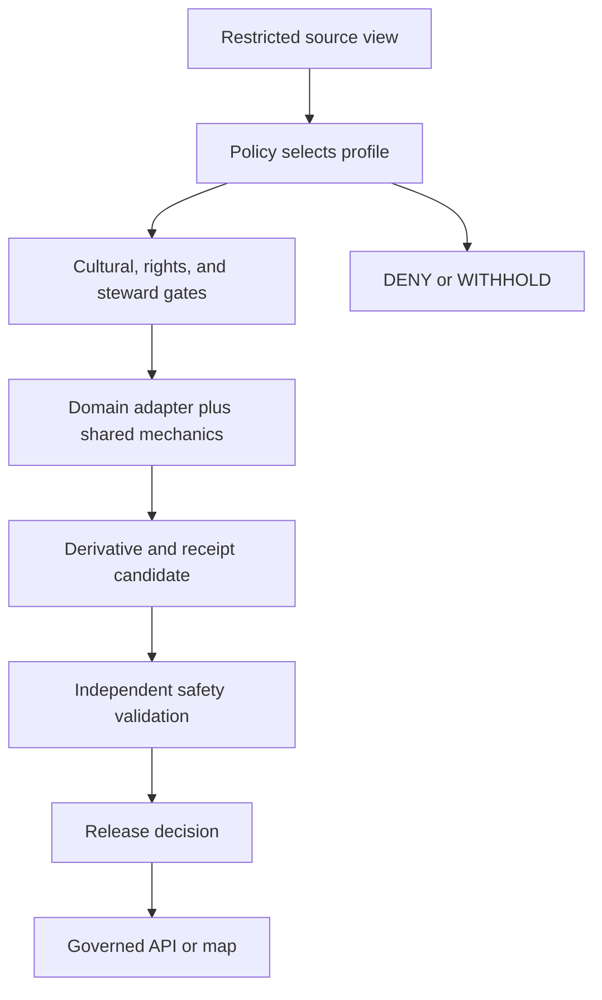

<!-- [KFM_META_BLOCK_V2]
doc_id: kfm://doc/packages-domains-archaeology-generalization-readme
title: Governed Archaeology Generalization Helper Boundary
type: readme
version: v0.2
status: draft; repository-grounded; bounded-readme-surface; generalizer-not-implemented; profiles-not-accepted; sensitive-domain; non-authoritative
owners:
  - OWNER_TBD - Archaeology package/domain steward
  - OWNER_TBD - Cultural/sensitivity/sovereignty review steward
  - OWNER_TBD - Geospatial/privacy/policy steward
  - OWNER_TBD - Evidence/contract/schema/validation/release/docs steward
created: 2026-06-13
updated: 2026-07-20
supersedes: v0.1
policy_label: public-review; packages; archaeology; generalization; no-network; exact-location-deny-by-default; non-authoritative
path: packages/domains/archaeology/generalization/README.md
truth_posture: CONFIRMED target and prior blob, packages responsibility root, bounded absent package/runtime paths, draft SensitivityTransform and PublicationTransformReceipt contracts with permissive scaffold schemas, shared RedactionReceipt draft with scaffold schema, placeholder redaction-profile registry, shared redaction package scaffold, domain test/fixture roots, and Archaeology readiness-hold workflow / PROPOSED future explicit-input deterministic domain adapters, local application-result vocabulary, transform-profile binding, inference-risk validation, and no-network tests / CONFLICTED stale package-specific test and fixture paths, shared-redaction versus domain-generalization ownership, RedactionReceipt versus PublicationTransformReceipt roles, county/region public floor versus lane-local H3-r7 refinement, and proposed deterministic-jitter recipe versus unresolved secret/seed custody / UNKNOWN complete recursive inventory, runtime language, exports, consumers, accepted transform profile, canonical public precision, transform implementation, validator behavior, production release use, and public non-disclosure effectiveness / NEEDS VERIFICATION owners, boundary ADRs, profile registry authority, cultural and sovereignty review, contract/schema expansion, policy binding, correction cascade, cumulative-release attack controls, rollback execution, and public safety proof
evidence_snapshot:
  repository: bartytime4life/Kansas-Frontier-Matrix
  repository_id: "1059091169"
  base_ref: main
  base_commit: 4f46eaaa444bb66f1f37d5c83b8311375ce8e572
  prior_blob: 3874ba04fb174c59a28b024bb74599252109943f
  directory_rules_blob: 2affb080e6f0043867c64c7f06c1ca52030fbd55
  sensitivity_transform_contract_blob: 5de68a7e2223d14128157792fcb415cc66d1cc5f
  sensitivity_transform_schema_blob: f72aa3c4504afa6c2c7ce669ad06fb5de514862e
  publication_transform_receipt_contract_blob: fee559d492c3d0145edc30a7ab39369ae7716dd8
  publication_transform_receipt_schema_blob: 379621207697fb9ad2bd16254cc96f6f7d230aae
  shared_redaction_receipt_contract_blob: c686cdf5c79a8b99ac66d4b01cd30d2f450f645f
  redaction_receipt_schema_blob: 6251119ecc2293cd219e4ddfa5bbde8b9d6f8f24
  redaction_profile_registry_blob: e928e91ccf278fe42ac0cd83f571ba323787573d
  shared_redaction_package_blob: c100eb332db3aba02395c1423b108005cb9bd5ed
  redaction_determinism_standard_blob: 9b3f54f23fc835d4c589c0edbeada72f88766f4d
  archaeology_sensitivity_blob: ca7888f2d43f022faeef5e1a6e16ab00526cf7aa
  archaeology_map_ui_blob: e9c15dbc71086dded7afca18a3b5a1a8f915be28
  archaeology_tests_blob: 229113afacc6acc0839e92318082ccce9e2ceab3
  archaeology_fixtures_blob: ab348d4a5345d52cb0999072138e7c0feb63e8f1
  archaeology_workflow_blob: 41e377f50ca310eccdc4b716ba8374c4fa8181db
related:
  - ../README.md
  - ../../README.md
  - ../../../README.md
  - ../../../redaction/README.md
  - ../../../../docs/doctrine/directory-rules.md
  - ../../../../docs/domains/archaeology/README.md
  - ../../../../docs/domains/archaeology/SENSITIVITY.md
  - ../../../../docs/domains/archaeology/PRESERVATION_MATRIX.md
  - ../../../../docs/domains/archaeology/MAP_UI_CONTRACTS.md
  - ../../../../docs/domains/archaeology/PUBLICATION_AND_POLICY.md
  - ../../../../contracts/domains/archaeology/sensitivity_transform.md
  - ../../../../contracts/domains/archaeology/publication_transform_receipt.md
  - ../../../../contracts/shared/redaction_receipt.md
  - ../../../../schemas/contracts/v1/domains/archaeology/sensitivity_transform.schema.json
  - ../../../../schemas/contracts/v1/domains/archaeology/publication_transform_receipt.schema.json
  - ../../../../schemas/contracts/v1/receipts/redaction_receipt.schema.json
  - ../../../../policy/redaction/profiles.yaml
  - ../../../../policy/domains/archaeology/README.md
  - ../../../../tests/domains/archaeology/README.md
  - ../../../../fixtures/domains/archaeology/README.md
tags: [kfm, archaeology, generalization, redaction, sensitivity-transform, geoprivacy, inference-risk, trust-membrane, governance]
notes:
  - "v0.2 replaces planning-only package claims with commit-pinned repository evidence and bounded absence checks."
  - "The README and its required generated-work provenance receipt are the only intended changes."
  - "No generalizer, transform profile, package manifest, schema, contract, policy, fixture, test, receipt, lifecycle object, release state, API route, map layer, or UI component is created or activated."
[/KFM_META_BLOCK_V2] -->

<a id="top"></a>

# Governed Archaeology Generalization Helper Boundary

`packages/domains/archaeology/generalization/`

> Reusable domain-adapter boundary for possible future Archaeology generalization support. The inspected surface is not a verified package or transform implementation: the README exists, conventional manifest and source paths were absent at the pinned snapshot, no accepted Archaeology transform profile was found, and no executable API, package-specific test suite, production consumer, transform receipt flow, or public release behavior was established.


**Quick links:** [Purpose](#purpose) · [Authority](#authority-and-directory-rules-basis) · [Status](#current-evidence-and-maturity) · [Language](#bounded-context-and-anti-collapse-rules) · [Belongs](#what-belongs-here) · [Exclusions](#what-does-not-belong-here) · [Contract](#future-transform-contract) · [Geometry](#geometry-and-attribute-safety) · [Profiles](#transform-classes-and-profile-posture) · [Threats](#sensitivity-rights-cultural-governance-and-threat-model) · [Trust](#trust-membrane-and-lifecycle) · [Validation](#validation-and-admission) · [Rollback](#compatibility-correction-revocation-and-rollback) · [Open](#open-verification-register) · [Evidence](#evidence-ledger)

> [!IMPORTANT]
> **Snapshot:** `main@4f46eaaa444bb66f1f37d5c83b8311375ce8e572`<br>
> **Verified target:** prior README blob `3874ba04fb174c59a28b024bb74599252109943f`<br>
> **Bounded implementation probes:** no `pyproject.toml`, `package.json`, root `__init__.py`, `src/README.md`, conventional `src/generalization/` initializer, selected root generalizer module, or package-specific README-backed test/fixture lane at the exact checked paths<br>
> **Authority evidence:** transform and receipt contracts exist only as draft semantics with permissive scaffold schemas; the redaction-profile file is a placeholder sourced from Habitat documentation and does not establish an active Archaeology profile.

> [!CAUTION]
> Generalization is a lossy protective transform, not proof of safety. A coarser point, cell, polygon, centroid, bound, label, time, count, or identifier can still disclose a site through reconstruction, linkage, repeated releases, or contextual inference. No output is public merely because a helper produced it.

---

## Purpose

A future implementation may provide deterministic, explicit-input Archaeology adapters around accepted protective-transform mechanics. Its role is to apply an already-selected, named, versioned profile to an already-authorized minimal view and produce a transform result plus receipt candidate for independent validation.

It may eventually:

- validate caller-supplied source geometry or attributes against an accepted input contract;
- adapt Archaeology object semantics to a shared redaction/generalization engine;
- apply only an upstream-authorized profile and audience scope;
- suppress, omit, aggregate, mask, clip, simplify, bin, delay, or generalize fields when the accepted profile requires it;
- preserve object identity, candidate/site status, source role, evidence, rights, review, sensitivity, transform, correction, and release references;
- produce deterministic output digests and a transform-receipt candidate without persisting either;
- return explicit blocked, no-output, invalid, unsupported, or error results without leaking controlled inputs;
- support synthetic, sanitized, no-network tests and cross-implementation parity vectors.

It must not select the profile, decide sensitivity, decide that an output is safe, expose exact or reconstructive detail, create evidence, satisfy cultural or sovereignty review, write receipts, write lifecycle state, approve release, serve public routes, build tiles, render maps, or generate authoritative narratives.

[Back to top](#top)

---

## Authority and Directory Rules basis

The existing path is compatible with Directory Rules only if it remains reusable Archaeology-specific adapter code. It does not gain policy or release authority from handling sensitive geometry.

| Concern | Authority here |
|---|---|
| Archaeology-specific transform input/output adaptation | Supporting implementation only, if later implemented and accepted. |
| Shared redaction/generalization mechanics | None by default - candidate shared home is [`packages/redaction/`](../../../redaction/README.md), whose implementation is also only a scaffold. |
| Archaeology doctrine and ubiquitous language | None - [`docs/domains/archaeology/`](../../../../docs/domains/archaeology/README.md). |
| SensitivityTransform meaning | None - [`contracts/domains/archaeology/sensitivity_transform.md`](../../../../contracts/domains/archaeology/sensitivity_transform.md). |
| Transform-event receipt meaning | None - [`PublicationTransformReceipt`](../../../../contracts/domains/archaeology/publication_transform_receipt.md) and [`RedactionReceipt`](../../../../contracts/shared/redaction_receipt.md) semantics, pending role reconciliation. |
| Machine-checkable shape | None - canonical schemas after accepted schema/home decisions. |
| Profile selection and admissibility | None - [`policy/domains/archaeology/`](../../../../policy/domains/archaeology/README.md), redaction policy, and the governed evaluator. |
| Evidence, rights, cultural/sovereignty review | None - owning evidence, registry, policy, and review authorities. |
| Executable orchestration and lifecycle writes | None - authorized pipelines/workers and canonical lifecycle homes. |
| Release, correction, withdrawal, and rollback | None - accepted release records and workflows. |
| Public API, tile, map, UI, export, search, graph, and AI | None - governed delivery surfaces downstream of released artifacts. |

### Shared-versus-domain dependency rule

If both packages mature, the preferred dependency direction is:

```text
Archaeology generalization adapter
  -> shared redaction/generalization mechanics
  -> third-party geometry/privacy libraries
```

The shared package must not depend on Archaeology domain semantics. This package must not duplicate general-purpose masking, canonicalization, pseudorandom, geometry, or receipt-building mechanics unless an accepted decision assigns them here.

[Back to top](#top)

---

## Current evidence and maturity

### Confirmed at the pinned snapshot

| Evidence | Finding | Consequence |
|---|---|---|
| Target README | v0.1 exists at blob `3874ba0...`. | This revision updates an existing planning document. |
| Package probes | Common manifest, initializer, source README, conventional source initializer, selected module, and package-specific test/fixture README paths were absent. | Do not claim an installable package, runtime, imports, exports, dependencies, API, or tests. |
| Shared redaction package | `packages/redaction/` has `0.0.0` metadata, boundary READMEs, an empty initializer, and a comment-only core placeholder. | It is an architectural candidate, not usable transform code. Domain/shared ownership remains unresolved. |
| SensitivityTransform | Draft semantic contract exists; paired `PROPOSED` schema declares no fields and permits additional properties. | Meaning guidance exists; no enforceable transform profile or input shape is established. |
| PublicationTransformReceipt | Draft domain contract exists; paired `PROPOSED` schema declares no fields and permits additional properties. | A receipt role is proposed, not field-enforced or emitted. |
| Shared RedactionReceipt | Draft shared semantic contract exists; schema home is open and paired scaffold declares no fields. | Shared-versus-domain receipt roles require reconciliation before implementation. |
| Profile registry | `policy/redaction/profiles.yaml` is a 175-byte `PROPOSED` placeholder sourced from `docs/domains/habitat/CANONICAL_PATHS.md`. | No active, versioned Archaeology transform profile is established. |
| Determinism standard | A detailed draft proposes seeded jitter and reproducibility rules but labels itself `PROPOSED`; repository paths and salt policy contain open questions. | Do not treat its algorithms, profile IDs, seed construction, or receipt paths as accepted implementation law. |
| Geometry floor | Archaeology sensitivity guidance proposes H3-r7; Map/UI guidance identifies county/region as the operating-contract public floor and calls tighter H3 guidance lane-local/proposed. | Public precision is conflicted; fail closed to the more restrictive authorized policy until resolved. |
| Tests and fixtures | Confirmed roots are [`tests/domains/archaeology/`](../../../../tests/domains/archaeology/README.md) and [`fixtures/domains/archaeology/`](../../../../fixtures/domains/archaeology/README.md); package-specific v0.1 paths were absent. | Do not create a competing topology or claim executable generalization tests. |
| Workflow | `domain-archaeology.yml` is a read-only readiness-hold workflow. | It does not prove transform correctness, inference resistance, receipt closure, or release safety. |

### Bounded absence

The named probes establish only those paths at the pinned commit. They do not prove permanent absence from history, branches, generated workspaces, external stores, differently named files, or later commits.

### Maturity statement

| Capability | Status |
|---|---|
| Generalization responsibility boundary | `CONFIRMED` by this README revision. |
| Domain transform/receipt semantics | `CONFIRMED` draft documents; schemas remain permissive `PROPOSED` scaffolds. |
| Shared protective-transform package | `CONFIRMED` scaffold; functional implementation not established. |
| Active Archaeology profile and canonical precision | `NOT ESTABLISHED` / `CONFLICTED`. |
| Generalizer implementation, exports, and dependencies | `NOT IMPLEMENTED` at checked paths. |
| Policy, review, receipt, validation, and release wiring | `UNKNOWN` / `NEEDS VERIFICATION`. |
| Package-specific executable tests | `NOT ESTABLISHED`. |
| Production consumer or released layer use | `UNKNOWN`. |
| Public safety and re-identification resistance | `NOT PROVED`. |

[Back to top](#top)

---

## Bounded context and anti-collapse rules

| Term | Meaning in this boundary |
|---|---|
| Sensitivity classification | Source/object risk and audience restrictions. A transform does not rewrite or erase the original classification. |
| Transform profile | Named, versioned policy-controlled specification of allowed input, operation, parameters, output, and obligations. |
| Generalization | Lossy reduction of spatial, temporal, attribute, or relational fidelity. It is one transform class, not a safety guarantee. |
| Redaction | Removal or masking of controlled content. An omission alone does not prove redaction was sufficient. |
| Suppression/withholding | Intentionally producing no value or no artifact for a controlled field/object. No output can be the only safe result. |
| Aggregation | Combining records into a coarser statistic or geography. It does not create differential privacy or k-anonymity automatically. |
| SensitivityTransform | Domain semantic object describing transform meaning or admissible intent; not executable code or approval. |
| PublicationTransformReceipt | Proposed Archaeology receipt recording a specific transform application/output; not release approval. |
| RedactionReceipt | Proposed shared receipt for a protective transform; role and schema home remain open. |
| Public-safe derivative candidate | Transform output awaiting independent validation, policy/review checks, and release. It is not yet public. |

Disallowed collapses:

```text
coarser geometry -> safe geometry
H3 cell or county label -> non-sensitive location
deterministic output -> privacy guarantee
random jitter -> anonymity
aggregation -> differential privacy
k records -> accepted k-anonymity
profile name -> active policy
transform execution -> sufficient transform
receipt candidate -> persisted valid receipt
receipt -> policy or release approval
review ref -> review completion or consent
public-safe flag -> ReleaseManifest
generalized candidate -> confirmed site
successful helper test -> lifecycle promotion
```

The original controlled record remains controlled. A derivative may receive a separate audience/release posture only through policy, review, validation, and release; transformation does not downgrade the source object in place.

[Back to top](#top)

---

## What belongs here

Only evidence-backed Archaeology-specific adapter behavior should be admitted. Possible future contents include:

- explicit conversion between accepted Archaeology contract types and shared transform-engine inputs;
- validation of domain-specific obligations before calling shared mechanics;
- preservation of candidate/site/object type, source role, rights, sensitivity, evidence, review, receipt, correction, and release references;
- binding of an upstream-selected profile ID/version without choosing it;
- safe construction of a domain transform-result and receipt candidate;
- domain-specific reason-code mapping that cannot echo controlled values;
- deterministic output labeling that states the transform class and remaining limitations;
- synthetic fixture builders and parity-vector adapters linked to executable tests.

Admission test:

> If code is Archaeology-specific adaptation around an already-authorized transform, remains pure and deterministic, performs no hidden I/O or policy selection, and cannot publish or disclose protected detail, it may belong here after the shared/domain boundary is accepted.

[Back to top](#top)

---

## What does not belong here

| Excluded concern | Responsibility home or disposition |
|---|---|
| General-purpose redaction/generalization mechanics | Candidate shared home: `packages/redaction/`, pending accepted boundary. |
| Sensitivity, audience, profile, or release decision | Policy evaluator and release authorities. |
| Archaeology doctrine or profile catalogue | `docs/domains/archaeology/` and accepted policy/profile roots. |
| Canonical transform/receipt contracts and schemas | `contracts/` and `schemas/contracts/v1/`. |
| Exact/controlled geometry and attributes | Governed restricted lifecycle/data homes; never ordinary package examples or logs. |
| EvidenceBundle or proof creation | Accepted proof producers and `data/proofs/`. |
| Cultural review, sovereignty determination, rights-holder decision, or consent | Accepted review and authority workflows. |
| Receipt persistence, signing, or registry writes | Accepted receipt producer/store and signing workflow. |
| Pipeline orchestration and lifecycle writes | `pipelines/`, workers, and canonical `data/` phases. |
| Tiles, layer manifests, public artifacts, or catalog/triplet writes | Authorized producers and their canonical roots. |
| Release candidates, manifests, promotion decisions, corrections, or rollback cards | `release/`. |
| Public API routes, map rendering, UI, export, search, graph, or AI answers | Governed delivery surfaces. |
| Realistic sensitive coordinates, IDs, names, access routes, or site narratives | Prohibited in public docs/tests/fixtures; use explicitly synthetic non-place data. |

Until a package-test topology is accepted, use the confirmed Archaeology roots instead of the stale v0.1 paths:

- tests: [`tests/domains/archaeology/`](../../../../tests/domains/archaeology/README.md);
- reusable fixtures: [`fixtures/domains/archaeology/`](../../../../fixtures/domains/archaeology/README.md);
- test-local wrappers: the test-owned fixture lane documented by the Archaeology test README.

[Back to top](#top)

---

## Future transform contract

This section is `PROPOSED` guidance, not an implemented API or canonical schema.

### Invocation boundary

A future adapter should receive caller-supplied, in-memory values and call only accepted pure transform mechanics. It must not access networks, filesystems, databases, registries, proof stores, source stores, policy engines, review systems, receipt stores, release systems, map services, or secrets directly.

The caller remains responsible for:

1. authenticating the principal and audience;
2. resolving source identity, evidence, rights, sensitivity, and current lifecycle/release state;
3. obtaining an authoritative policy decision and selected profile;
4. obtaining cultural, sovereignty, rights-holder, steward, and release review where required;
5. providing only the minimum authorized source view;
6. holding any required seed/key material through an accepted secret-custody mechanism;
7. independently validating the derivative and receipt candidate;
8. persisting receipts and approving release outside this package.

### Conceptual input

An accepted implementation may require typed values for:

- source object identity and type;
- authorized source geometry/attributes and explicit CRS/axis order;
- sensitivity rank and audience tier as distinct values;
- named profile ID, profile version, policy-decision reference, and effective time;
- evidence, rights, cultural/steward-review, transform, release, correction, and supersession references;
- implementation/specification version pins;
- transform-history or release-family context needed to detect cumulative disclosure;
- secret handle or deterministic context when an accepted profile requires it, never raw public seed material;
- safe correlation ID.

These are responsibilities, not declared field names. Contract/schema/profile decisions must precede implementation.

### Local application results

The helper does not create policy outcomes. A future local vocabulary may distinguish:

| Local result | Meaning | Not equivalent to |
|---|---|---|
| `APPLIED` | Accepted mechanics produced a derivative and receipt candidate. | Safe, allowed, released, or published. |
| `NO_OUTPUT` | The selected operation intentionally suppressed or withheld the value/artifact. | Error or evidence absence. |
| `BLOCKED` | A caller-supplied gate or cumulative-risk rule prevented application. | A new policy decision by this package. |
| `INVALID_INPUT` | Input failed the bound schema, CRS, geometry, or invariant checks. | Permanent rejection in every context. |
| `UNSUPPORTED` | Profile, version, object, geometry, or operation is not implemented. | Permission to fall back to a weaker transform. |
| `ERROR` | Unexpected local failure with public-safe diagnostics only. | Permission to expose input or retry publicly. |

The governed runtime maps authoritative policy and release state into `ANSWER`, `ABSTAIN`, `DENY`, or `ERROR`. An `APPLIED` result alone cannot produce `ANSWER`.

### Required invariants

A future implementation must:

- reject missing or unknown profile/version bindings;
- reject implicit CRS, axis order, unit, precision, or geometry-type assumptions;
- preserve immutable source identity and never rewrite the source in place;
- preserve candidate/anomaly/site type and source role;
- preserve source time, valid time, rights, evidence, limitations, sensitivity, review, policy, and correction bindings;
- produce a distinct derivative identity and digest;
- never widen audience or lower source sensitivity;
- never use fallback precision, default jitter, default centroid, or default cell size;
- never emit exact geometry, original bounds, exact centroid, Z/M values, topology, vertex order, or metadata unless the selected profile explicitly allows the already-authorized field;
- never expose seed/key/secret material or deterministic inputs that enable reversal or linkage;
- distinguish no-output, withheld, invalid, unsupported, blocked, stale, and error states;
- remain deterministic for the same authorized input, profile, implementation, and protected deterministic context when determinism is required;
- enforce explicit resource bounds and reject pathological geometry safely;
- return typed results instead of unstructured exceptions or generated prose;
- perform no persistence, publication, or hidden I/O.

[Back to top](#top)

---

## Geometry and attribute safety

### Geometry preconditions

Before any operation, an accepted implementation must validate:

- geometry type, emptiness, dimensionality, and validity;
- CRS identifier, axis order, units, and antimeridian/pole behavior where relevant;
- coordinate precision and source uncertainty;
- Z/M values, depth/elevation, bounds, centroids, and auxiliary indexes as independent disclosure surfaces;
- multipart topology, holes, adjacency, and relationships that may reveal the protected place;
- maximum feature, vertex, memory, and execution limits;
- whether existence itself is controlled.

Invalid geometry must not be repaired silently. Repair changes are transforms and require declared semantics, versioning, tests, and receipts where material.

### Geometry outputs

A derivative must state what it represents: generalized cell, region, aggregate, mask, omission, simplified footprint, or another accepted class. It must not be labeled or rendered as exact site geometry.

Do not emit hidden exactness through:

- bounding boxes, centers, tile extents, zoom-dependent layers, hover targets, or feature-state values;
- precision-preserving IDs, source URLs, local names, survey-unit references, parcel joins, route/access descriptions, or collection metadata;
- vertex count/order, simplification residue, shape fingerprints, topology, area/perimeter precision, or error messages;
- time stamps, observation cadence, release diffs, or multiple profile outputs that allow triangulation.

### Attributes, time, and counts

Spatial coarsening does not protect non-spatial context. Profiles must separately address:

- names, descriptions, cultural affiliations, oral-history text, custody/repository data, landowner/access information, and preservation/threat condition;
- precise dates, event sequences, excavation phases, collection times, and update cadence;
- small counts, rare categories, single-cell occupancy, differencing, and cross-filter reconstruction;
- images, thumbnails, 3D models, terrain context, sensor footprints, and embedded metadata.

Aggregation is not differential privacy. A `k` threshold is not k-anonymity until the population, equivalence classes, joins, suppression rules, and adversary model are defined and tested. Jitter is not anonymity and can increase false confidence.

### Precision conflict rule

Current docs conflict between a county/region public floor and a lane-local proposed H3-r7 refinement. Until accepted authority resolves that conflict:

1. this package exposes no hard-coded public precision;
2. policy must provide an accepted profile for the specific object, audience, and release;
3. the more restrictive applicable requirement wins;
4. if no safe profile is available, the output is `NO_OUTPUT` or the runtime returns `ABSTAIN`/`DENY`.

[Back to top](#top)

---

## Transform classes and profile posture

The following are transform classes, not accepted profiles:

| Class | Possible operation | Principal risk |
|---|---|---|
| Omission/withholding | Produce no public field or artifact. | Existence may still leak through metadata or differing behavior. |
| Attribute redaction | Remove or replace controlled text/values. | Remaining fields and joins may reconstruct the value. |
| Region/cell replacement | Replace a geometry with an approved region or cell. | Small/unique cells, centroids, and repeated releases may reveal the source. |
| Aggregation | Combine multiple records at an accepted geography/time. | Small counts, differencing, filtering, and composition attacks. |
| Simplification/clipping | Reduce geometry detail or extent. | Shape fingerprint, bounds, topology, or surviving vertices may remain identifying. |
| Deterministic jitter | Offset geometry using an accepted deterministic method. | Reversal, linkage, false precision, seed exposure, and multi-release triangulation. |
| Temporal generalization/delay | Coarsen or delay time. | Rare events, cadence, and cross-source correlation may still reveal location. |
| Controlled derivative rendering | Rasterize or derive a view under an accepted profile. | Pixel/terrain/context metadata and zoom levels may leak detail. |

No class is safe for every Archaeology object. Exact sites, burials/human remains, sacred places, sovereignty-restricted knowledge, looting-risk records, or highly distinctive features may permit only withholding.

### Profile admission

An accepted profile must be named, versioned, immutable for replay, policy-owned, audience-scoped, object/field-scoped, explicit about transform classes and parameters, explicit about prohibited outputs, and bound to:

- input and output contracts/schemas;
- CRS, units, precision, and canonicalization rules;
- deterministic or randomness requirements and secret custody;
- evidence, rights, review, and release prerequisites;
- cumulative-release and composition limits;
- required receipt family and fields;
- validation, inference, and parity tests;
- correction, revocation, expiry, and rollback behavior.

The current `policy/redaction/profiles.yaml` satisfies none of those burdens for Archaeology; it is only a placeholder.

[Back to top](#top)

---

## Sensitivity, rights, cultural governance, and threat model

### Fail-closed material

- exact or reconstructive site, candidate, artifact, excavation, burial, human-remains, sacred-place, collection, repository, or access-route detail;
- restricted oral history, community-held knowledge, sovereignty-bearing context, culturally controlled interpretation, or reviewer identity/rationale;
- private-landowner, collection-security, looting-risk, active-threat, custody, or fieldwork detail;
- unresolved, expired, withdrawn, superseded, disputed, inaccessible, or unverifiable evidence, rights, consent, review, transform, or release state;
- source/object existence where existence itself is controlled.

### Adversaries and failure modes

Assume an attacker may combine public KFM output with parcels, roads, imagery, terrain, LiDAR, historic maps, social media, collection catalogs, release history, browser/network metadata, and repeated queries.

Required threat cases include:

- differencing two releases or time windows;
- comparing multiple profiles, zoom levels, exports, or audiences;
- intersecting generalized cells with known land, terrain, route, survey, or ownership constraints;
- correlating stable IDs, counts, update times, cache behavior, errors, or latency;
- reconstructing from centroids, bounds, tile membership, Z/elevation, shape fingerprints, or topology;
- exploiting deterministic outputs or exposed seed material;
- poisoning profile selection, CRS, precision, geometry validity, or receipt references;
- denial of service through complex or malformed geometries;
- leakage through logs, traces, metrics, snapshots, CI artifacts, exceptions, or debug maps.

### Cultural and sovereignty boundary

A mechanical transform cannot decide cultural appropriateness, consent, narrative framing, or rights-holder authority. Public output receives only the material explicitly authorized for that audience; the package never receives sensitive consultation notes merely to remove them later.

[Back to top](#top)

---

## Trust membrane and lifecycle



The helper is one implementation step inside the membrane. It is not the trust membrane, policy engine, validator, receipt store, release gate, or public server.

Lifecycle rules:

- the source remains in its governed lifecycle state and sensitivity posture;
- the derivative is a distinct object with source, profile, implementation, policy, review, receipt, and digest lineage;
- transform output does not promote RAW, WORK, QUARANTINE, PROCESSED, CATALOG/TRIPLET, or PUBLISHED state;
- a receipt candidate is not a persisted receipt, and a persisted receipt is not release approval;
- every released derivative must be correctable, withdrawable, supersedable, and rollback-addressable;
- watchers may detect changed inputs, profiles, libraries, policies, or risks but cannot publish replacements;
- changed source, profile, implementation, CRS library, policy, review, receipt, or release binding requires re-evaluation;
- previously safe output may become unsafe as external data, attack methods, or cumulative releases change.

[Back to top](#top)

---

## Validation and admission

### Current posture

| Check | Current result |
|---|---|
| README structure, anchors, links, and whitespace | Required for this documentation revision. |
| Transform/profile schema | Not admission-ready; transform schema is an empty permissive scaffold and profile registry is placeholder-only. |
| Receipt schemas | Not admission-ready; shared and domain receipt schemas are empty permissive scaffolds. |
| Shared redaction mechanics | Not implemented beyond metadata/README/placeholder source evidence. |
| Archaeology generalizer unit tests | Not established. |
| Package-specific test/fixture paths | Exact v0.1 paths absent at pinned snapshot. |
| Geometry, parity, inference, composition, and resource tests | Not established for this package. |
| End-to-end receipt, release, API, and map behavior | Not established. |
| Correction/revocation/rollback drill | Not established. |

### Minimum executable test families

Future tests under the accepted Archaeology topology must cover at least:

- no active or unknown profile fails closed;
- no hidden profile selection or fallback parameters;
- explicit CRS, axis order, units, precision, and geometry-type enforcement;
- invalid, empty, multipart, antimeridian, high-dimensional, and pathological geometries;
- source identity preserved and derivative identity distinct;
- candidate/anomaly/site type and source role preserved;
- exact values, bounds, centers, Z/M, topology, identifiers, names, time, counts, and metadata not leaked;
- deterministic replay and cross-language/library parity where promised;
- seed/key material absent from output, receipts, logs, errors, and caches;
- repeated-release, multi-profile, differencing, linkage, and composition attacks;
- small-count, k-anonymity, and differential-privacy claims rejected unless their full accepted contracts are satisfied;
- cumulative transform history and release-family controls;
- receipt-candidate content is complete but contains no protected source value;
- transform application does not imply policy, review, release, lifecycle, or publication success;
- no network, filesystem, registry, proof-store, policy-engine, receipt-store, release, catalog, graph, tile, or UI side effects;
- safe errors, logs, metrics, traces, snapshots, and CI artifacts;
- resource ceilings and denial-of-service resistance;
- correction, profile revocation, dependency change, supersession, withdrawal, and rollback;
- nonzero executable collection so placeholder-only suites cannot pass.

Fixtures must be obviously synthetic, non-place data. Avoid Kansas-shaped plausible coordinates, real names, actual site identifiers, realistic access routes, or culturally specific narratives.

### Admission gates

Do not claim implementation readiness until all are true:

1. shared-redaction versus Archaeology-adapter ownership is accepted;
2. transform and receipt roles/homes are reconciled;
3. public precision and H3/county-region conflict is resolved;
4. at least one immutable Archaeology profile is accepted and versioned;
5. runtime, manifest, exports, dependencies, compatibility, and supply-chain policy are explicit;
6. typed inputs prevent missing policy, rights, review, sensitivity, evidence, profile, and release bindings;
7. pure mechanics and adapters have deterministic/parity/resource tests;
8. inference, composition, and cumulative-release tests pass;
9. receipt candidate, persistence owner, validator, signature, correction, and rollback flows are bound;
10. one governed consumer contract test passes without direct restricted-store access;
11. cultural/sensitivity/sovereignty, geospatial/privacy, policy, security, evidence, schema, validation, release, and consumer stewards approve the slice;
12. CI collects nonzero tests and retains only public-safe artifacts.

[Back to top](#top)

---

## Smallest safe implementation sequence

1. Decide whether this package is needed or whether `packages/redaction/` plus configuration is sufficient.
2. Reconcile SensitivityTransform, PublicationTransformReceipt, and RedactionReceipt roles and schema homes.
3. Resolve the public precision conflict and select one object/field/audience use case.
4. Author and review one immutable profile; do not implement a catalogue.
5. Define typed inputs, derivative identity, local results, and receipt candidate.
6. Add synthetic geometry/attribute fixtures and executable negative tests.
7. Implement or adopt the smallest pure shared mechanic.
8. Implement the thin Archaeology adapter with no I/O and no profile selection.
9. Add parity, inference, composition, cumulative-release, resource, logging, and dependency-change tests.
10. Bind one internal review or release-candidate consumer before any public route.
11. Exercise correction, profile revocation, withdrawal, supersession, and rollback.
12. Consider public use only after independent safety, cultural/rights, policy, and release review.

[Back to top](#top)

---

## Compatibility, correction, revocation, and rollback

A future implementation must version:

- source and derivative contracts/schemas;
- transform profile and profile registry;
- canonicalization, CRS, geometry, privacy, and shared-library implementations;
- deterministic/randomness method and protected context;
- receipt contract/schema;
- policy, review, evidence, rights, and release bindings;
- consumer contract and public renderer behavior where applicable.

Compatibility rules:

- changes in geometry library, CRS database, floating-point behavior, PRNG, secret/salt, canonicalization, sorting, simplification, rounding, or serialization are behavior changes;
- unknown fields, enums, profiles, versions, CRS values, geometry types, or operations fail closed;
- profile changes create a new immutable version; do not edit history in place;
- public cache keys must bind audience, profile, source version, implementation, policy/review/release state, and correction lineage as required;
- no migration may widen exposure, silently change precision, or silently reinterpret a receipt;
- reproducibility for reviewers does not require publishing protected source values, keys, or reversible seed material.

Correction/revocation workflow owners outside this helper must:

1. identify every affected source, derivative, receipt, release, tile, cache, API/UI payload, export, index, search/graph reference, and AI retrieval artifact;
2. block the profile/implementation version and stop new derivations;
3. withdraw or downgrade unsafe releases immediately;
4. preserve incident, correction, supersession, and rollback lineage;
5. re-evaluate cumulative disclosure from already released derivatives;
6. regenerate only from an authorized source view and accepted replacement profile;
7. verify downstream invalidation and non-disclosure;
8. add the failure as a permanent regression and threat-model case.

For this README-only revision, rollback is a Git revert of the README and paired generated receipt. Documentation rollback does not undo or authorize any transform or release.

[Back to top](#top)

---

## Definition of done

This README revision is complete when it:

- states the inspected package's actual maturity without claiming implementation;
- corrects stale package-specific test and fixture paths;
- separates transform semantics, mechanics, profile selection, application, receipt, validation, review, policy, lifecycle, and release;
- records the shared/domain package overlap, receipt-role ambiguity, placeholder profiles, and public-precision conflict;
- defines explicit-input, no-I/O, deterministic, geometry, attribute, inference, cumulative-release, validation, correction, and rollback burdens;
- labels future APIs, results, profiles, algorithms, fields, tests, and sequencing as `PROPOSED`;
- changes no implementation, profile, schema, contract, policy, proof, test, fixture, receipt, lifecycle, release, API, tile, map, or UI artifact.

README completeness is not transform correctness or publication safety.

[Back to top](#top)

---

## Open verification register

| ID | Question | Status | Required evidence/owner |
|---|---|---|---|
| AGN-001 | Is this package needed, or should shared `packages/redaction/` own all mechanics and adapters? | `CONFLICTED` | Package/domain architecture decision and consumer inventory. |
| AGN-002 | Which runtime, manifest, namespace, exports, and compatibility policy apply? | `UNKNOWN` | Implemented package evidence and tests. |
| AGN-003 | What are the distinct roles of SensitivityTransform, PublicationTransformReceipt, and RedactionReceipt? | `CONFLICTED` | Contract/schema/receipt ADR and migration plan. |
| AGN-004 | Which schema homes and required fields are canonical? | `NEEDS VERIFICATION` | Accepted fielded schemas, validators, fixtures, and owners. |
| AGN-005 | Which authority owns the transform profile registry? | `NEEDS VERIFICATION` | Policy/profile governance decision. |
| AGN-006 | What is the first accepted Archaeology profile and use case? | `NOT ESTABLISHED` | Reviewed immutable profile and threat model. |
| AGN-007 | Is the public floor county/region, H3-r7, object-specific, or always withholding for some classes? | `CONFLICTED` | Operating-contract/domain-policy reconciliation. |
| AGN-008 | Which CRS, geometry library, canonicalization, and precision rules are accepted? | `UNKNOWN` | Geospatial ADR, version pins, and parity vectors. |
| AGN-009 | Is seeded deterministic jitter allowed for Archaeology, and how are secrets/salts held and rotated? | `NEEDS VERIFICATION` | Privacy/security ADR, key custody, threat analysis, and tests. |
| AGN-010 | How are repeated releases and multi-profile composition prevented from triangulating a source? | `NEEDS VERIFICATION` | Release-family ledger and composition tests. |
| AGN-011 | Which objects/fields may only be withheld regardless of transform? | `NEEDS VERIFICATION` | Cultural/sovereignty/rights-holder and policy matrix. |
| AGN-012 | Which k-anonymity or differential-privacy contracts, budgets, and accountants are accepted? | `NOT ESTABLISHED` | Fielded contracts, policy, implementation, and adversarial validation. |
| AGN-013 | Who independently validates derivatives and re-identification risk? | `NEEDS VERIFICATION` | Separation-of-duties and validator ownership. |
| AGN-014 | Who persists/signs receipts and binds them to releases? | `NEEDS VERIFICATION` | Receipt producer/store/signature/release workflow. |
| AGN-015 | Where do executable tests and fixtures live after topology reconciliation? | `CONFLICTED` | Test/fixture owner decision and index. |
| AGN-016 | What logs, metrics, traces, and debugging surfaces are safe? | `NEEDS VERIFICATION` | Telemetry classification, threat model, and tests. |
| AGN-017 | How are dependency/profile vulnerabilities, corrections, revocations, and rollback propagated? | `NEEDS VERIFICATION` | End-to-end drill and consumer inventory. |
| AGN-018 | Is any generalization implementation or derivative currently used in production/release? | `UNKNOWN` | Deployment, consumer, receipt, and release evidence. |

[Back to top](#top)

---

## Evidence ledger

| Evidence | Snapshot finding | Truth label |
|---|---|---|
| `packages/domains/archaeology/generalization/README.md` | v0.1 planning README exists; target blob pinned above. | `CONFIRMED` |
| `docs/doctrine/directory-rules.md` | Establishes responsibility-root placement and separation of package, policy, data, release, and public-delivery authority. | `CONFIRMED` |
| `packages/redaction/README.md` and bounded source evidence | Shared package is a `0.0.0`/placeholder scaffold, not functional mechanics. | `CONFIRMED` scaffold |
| `contracts/domains/archaeology/sensitivity_transform.md` plus schema | Draft semantic object; paired schema has no fields and permits additional properties. | `CONFIRMED` draft / `PROPOSED` schema |
| `contracts/domains/archaeology/publication_transform_receipt.md` plus schema | Draft domain receipt; paired schema has no fields and permits additional properties. | `CONFIRMED` draft / `PROPOSED` schema |
| `contracts/shared/redaction_receipt.md` plus receipt schema | Draft shared receipt semantics; schema home/fields open and scaffold is permissive. | `CONFIRMED` draft / `NEEDS VERIFICATION` authority |
| `policy/redaction/profiles.yaml` | Placeholder only; Habitat source document; no active Archaeology profile. | `CONFIRMED` placeholder |
| `docs/standards/REDACTION_DETERMINISM.md` | Detailed draft mechanics, profile IDs, and seed rules remain `PROPOSED` with open custody/path questions. | `CONFIRMED` document / `PROPOSED` implementation |
| Archaeology sensitivity and Map/UI docs | H3-r7 lane guidance and county/region operating floor are not reconciled. | `CONFLICTED` |
| Archaeology policy README | Deny-by-default intent documented; concrete policy files, tests, CI/runtime binding remain unverified. | `CONFIRMED` README / `UNKNOWN` enforcement |
| Archaeology tests and fixtures | Domain roots confirmed; sampled tests placeholder-heavy and fixture payload inventory unverified. | `CONFIRMED` bounded evidence |
| Archaeology workflow | Read-only readiness-hold workflow; not transform or release proof. | `CONFIRMED` |
| Exact package/runtime/test/fixture probes | Named conventional implementation and stale package-specific README paths absent at pinned snapshot. | `CONFIRMED` bounded absence |
| Complete implementation, consumer, derivative, and release inventory | Not exhaustively established by bounded search/direct reads. | `UNKNOWN` |

---

## Maintainer handoff

- **Current posture:** documentation boundary only; generalizer and active profiles not implemented.
- **Safe next action:** resolve AGN-001, AGN-003, and AGN-007 before creating code.
- **Do not do next:** add a default H3/jitter/centroid profile, copy shared mechanics into the domain package, publish a reversible receipt, or wire a public map route.
- **Required reviewers for implementation:** Archaeology domain, cultural/sensitivity/sovereignty, rights-holder, geospatial/privacy, policy, evidence, contract/schema, security, validation, release, and consumer owners.

[Back to top](#top)
