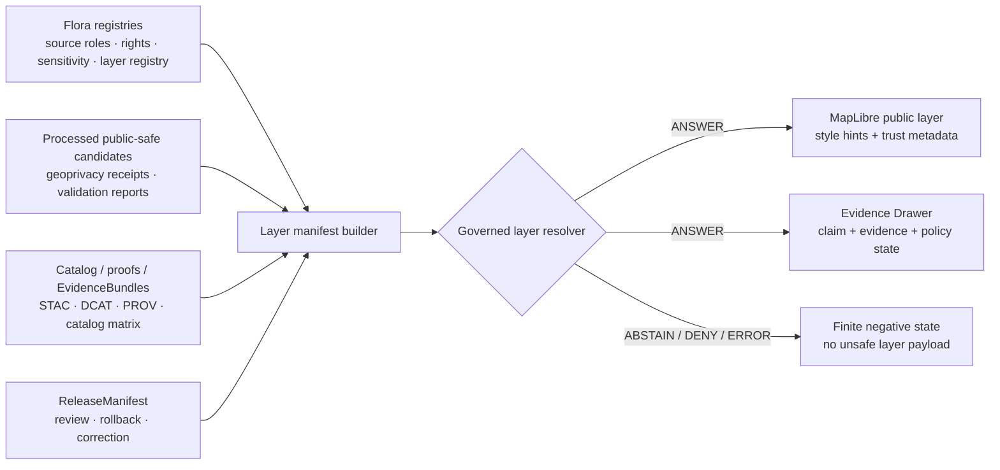

# Flora Layer Manifests

Layer manifest package notes for public-safe, evidence-bound Flora map-layer descriptors.


> [!IMPORTANT]
> **Status:** PROPOSED implementation package README  
> **Owner:** OWNER_TBD  
> **Path:** `packages/domains/flora/layer_manifests/README.md`  
> **Truth posture:** CONFIRMED KFM doctrine / PROPOSED Flora package boundary / UNKNOWN current mounted-repo implementation depth

**Quick jumps:** [Scope](#scope) · [Repo fit](#repo-fit) · [Inputs](#accepted-inputs) · [Exclusions](#exclusions) · [Manifest responsibilities](#manifest-responsibilities) · [Public-safety gates](#public-safety-gates) · [Example manifest](#illustrative-public-safe-manifest) · [Validation](#validation) · [Rollback](#rollback)

---

## Scope

`layer_manifests` is the Flora domain package area for building, validating, and documenting public-safe layer manifest payloads before they are consumed by governed API routes, MapLibre UI surfaces, Evidence Drawer payloads, Focus Mode context, exports, or release checks.

A Flora layer manifest is **not** the truth source. It is a downstream, reviewable descriptor that points to released artifacts, evidence support, policy/review state, freshness, source-role context, public-safe geometry behavior, and rollback/correction metadata.

This package should help answer one question before a layer is rendered:

> Can this Flora layer be shown, explained, cited, corrected, and rolled back without exposing restricted geometry or bypassing KFM governance?

---

## Repo fit

| Item | Value |
| --- | --- |
| Responsibility root | `packages/` — shared or reusable implementation package code. |
| Domain segment | `domains/flora/` — Flora-specific package lane. |
| Target path | `packages/domains/flora/layer_manifests/` |
| Upstream authorities | `data/registry/flora/`, `schemas/contracts/v1/...`, `policy/`, `data/catalog/...`, `data/proofs/...`, `release/...` |
| Downstream consumers | governed API layer resolver, MapLibre layer controls, Evidence Drawer, Focus Mode, release validation, public-safe exports |
| Implementation state | UNKNOWN until a mounted repo, package manager, tests, workflows, and adjacent package conventions are inspected. |

This package may contain reusable layer-manifest builder helpers, adapter code, package-local examples, and README-level implementation guidance. It must not become a parallel home for schemas, policy, release decisions, proof bundles, receipts, source registries, or lifecycle data.

### Authority boundary

| Concern | Canonical home | This package may do | Must not do |
| --- | --- | --- | --- |
| Layer object meaning | `contracts/` | Reference semantic contracts. | Redefine contract authority. |
| Machine shape | `schemas/contracts/v1/...` | Validate against the schema selected by ADR/repo convention. | Store canonical schemas here. |
| Source roles, rights, sensitivity | `data/registry/flora/` and policy surfaces | Read registry values and include references. | Invent source authority or rights status. |
| Allow / deny / restrict / abstain | `policy/` | Consume `PolicyDecision` results and reason codes. | Own policy law. |
| Evidence support | `data/proofs/...` / EvidenceBundle resolver | Carry EvidenceBundle references and support closure checks. | Treat manifest prose as evidence. |
| Catalog closure | `data/catalog/{stac,dcat,prov,...}` | Verify manifest references close. | Replace catalog records. |
| Release decision | `release/` | Link to ReleaseManifest and rollback/correction targets. | Publish or promote directly. |
| Public rendering | governed API + UI shell | Emit public-safe descriptors for consumers. | Let UI style JSON become truth. |

---

## Accepted inputs

Layer manifest generation should accept only governed, reviewable inputs or references:

- public-safe Flora layer candidate ID;
- layer registry record from `data/registry/flora/layer_registry.yaml` or repo-equivalent registry;
- source descriptor reference with source role, citation, rights, and cadence;
- resolved or resolvable EvidenceBundle references;
- public-safe artifact references such as released PMTiles, GeoJSON, TileJSON, MVT, COG, or static layer bundles;
- geoprivacy/redaction receipt references for any generalized, withheld, obscured, or transformed geometry;
- PolicyDecision reference and finite outcome;
- review record reference when sensitive taxa, steward review, or public eligibility requires it;
- catalog matrix / STAC / DCAT / PROV references;
- ReleaseManifest reference when the layer is public;
- rollback card or correction notice reference when the layer supersedes, corrects, or withdraws a prior public layer.

Missing source, evidence, policy, rights, review, release, or public-safe geometry context should return `ABSTAIN`, `DENY`, or `ERROR`; it should not silently degrade into an unlabeled map layer.

---

## Exclusions

Do **not** put these in this package:

| Do not place here | Correct home |
| --- | --- |
| Raw source downloads or source-native payloads | `data/raw/flora/` or controlled intake location. |
| Work or quarantine records | `data/work/flora/` or `data/quarantine/flora/`. |
| Processed canonical observations | `data/processed/flora/...` or repo-equivalent processed store. |
| Source registries or rights profiles | `data/registry/flora/`. |
| Canonical JSON Schemas | `schemas/contracts/v1/...`. |
| Policy rules | `policy/`. |
| Golden or invalid test fixtures | `fixtures/` or `tests/fixtures/`. |
| Validator entrypoints | `tools/validators/` or repo-standard test root. |
| Receipts and proof bundles | `data/receipts/` and `data/proofs/`. |
| Release decisions, rollback cards, correction notices | `release/`. |
| Public UI components | `apps/`, `packages/ui/`, `packages/maplibre/`, `ui/`, or repo-confirmed UI shell. |

---

## KFM trust boundary

Flora layer manifests sit after processing and public-safety transformation, and before public presentation.

```text
RAW -> WORK / QUARANTINE -> PROCESSED -> CATALOG / TRIPLET -> PUBLISHED
```

A public Flora layer manifest may point only at released or release-candidate public-safe artifacts that have passed the appropriate evidence, rights, sensitivity, policy, validation, review, catalog, proof, and rollback checks.

The manifest must never authorize public clients to read RAW, WORK, QUARANTINE, unpublished candidates, exact restricted geometry, source-native sensitive IDs, internal canonical stores, or direct model/runtime output.

---

## Manifest responsibilities

A Flora layer manifest should make the trust state of a map layer inspectable.

| Responsibility | Required behavior |
| --- | --- |
| Identify the layer | Stable `layer_id`, domain, label, version, release state, and layer kind. |
| Bound the claim | Spatial scope, temporal scope, knowledge character, and intended public use. |
| Carry source-role context | Source IDs, source roles, rights profile, citation requirements, and cadence/freshness. |
| Carry evidence support | EvidenceBundle refs and catalog/proof closure references. |
| Preserve public-safety posture | Geometry exposure class, geoprivacy transform refs, redaction reason codes, and review state. |
| Support finite outcomes | `ANSWER`, `ABSTAIN`, `DENY`, or `ERROR` from the layer resolver. |
| Separate style from truth | MapLibre paint/layout/style hints stay renderer hints, not evidence or policy. |
| Support rollback | ReleaseManifest, rollback target, correction notice, and supersession lineage. |

### Layer families

Initial Flora layer families should stay conservative until source rights, steward review, and exact public geometry thresholds are verified.

| Layer family | Public posture | Notes |
| --- | --- | --- |
| Generalized occurrence layer | Public only after geoprivacy transform, policy, review, and release. | No exact sensitive points. |
| Range / distribution layer | Public-safe derived or source-authorized layer. | Must not be represented as occurrence evidence. |
| Vegetation community layer | Public if source rights and sensitivity allow. | Link to source role and update cadence. |
| Invasive plant layer | Public-safe where rights and operational sensitivity allow. | Avoid exposing active response-sensitive details without policy. |
| Phenology / condition layer | Public-safe aggregate or modeled context. | Label observation vs model vs interpretation. |
| Habitat association summary | Derived context, not taxon occurrence proof. | Must cite habitat/covariate evidence. |
| Review candidate view | Internal/steward-only by default. | Public clients must be denied. |

---

## Layer manifest flow



Renderer style, layer visibility, filters, screenshots, and map interactions are downstream surfaces. They must not become evidence, policy, review, or release authority.

---

## Public-safety gates

The layer manifest builder should fail closed when a layer would expose unsafe or unsupported public state.

| Gate | Pass condition | Failure outcome |
| --- | --- | --- |
| Source gate | SourceDescriptor exists and carries role, citation, rights, cadence, and authority limits. | `ABSTAIN` or `DENY`. |
| Rights gate | Rights profile allows the intended public layer use. | `DENY`. |
| Sensitivity gate | Taxa/source/location sensitivity has been evaluated. | `ABSTAIN` or `DENY`. |
| Geoprivacy gate | Public geometry is generalized, withheld, or explicitly approved for public exact exposure. | `DENY`. |
| Evidence gate | EvidenceRefs resolve and support the bounded layer claim. | `ABSTAIN`. |
| Catalog gate | STAC/DCAT/PROV/catalog matrix references close and digests align. | `ERROR` or `ABSTAIN`. |
| Review gate | Required steward/reviewer record exists and scope matches the release. | `DENY`. |
| Release gate | ReleaseManifest or release-candidate context exists with rollback target. | `ABSTAIN`. |
| UI/API gate | Public resolver returns finite outcome and no internal references. | `ERROR` or `DENY`. |

### Public payload must not include

- exact sensitive coordinates;
- RAW / WORK / QUARANTINE paths;
- internal geometry refs;
- restricted source-native record IDs;
- unpublished candidate IDs;
- unreviewed steward-only flags as public attributes;
- model output framed as observation;
- style metadata framed as evidence;
- AI-generated summaries as source truth.

---

## Manifest shape expectations

The canonical machine schema belongs outside this package, but a Flora layer manifest should contain these semantic sections.

| Section | Required purpose |
| --- | --- |
| `manifest` | Manifest ID, version, digest, created time, builder version, spec hash. |
| `layer` | Stable layer ID, title, domain, layer family, public/private status. |
| `scope` | Spatial scope, temporal scope, scale/zoom guidance, intended use. |
| `knowledge` | Observation/model/interpretation/aggregate/source-declared character. |
| `source_context` | Source IDs, roles, citation text/refs, rights profile, update cadence. |
| `artifact_refs` | Public-safe tile/vector/raster/source bundle references and digests. |
| `geometry_safety` | Exposure class, precision bucket, transform receipt refs, reason codes. |
| `evidence` | EvidenceBundle refs, catalog/proof refs, validation reports. |
| `policy_review` | PolicyDecision, review state, obligations, access class. |
| `release` | ReleaseManifest, correction notice, rollback target, supersession state. |
| `renderer` | MapLibre source/layer hints, min/max zoom, style tokens, legend hints. |
| `outcome` | `ANSWER`, `ABSTAIN`, `DENY`, or `ERROR` plus reason codes. |

---

## Illustrative public-safe manifest

> [!NOTE]
> This example is illustrative. Field names must be synchronized with the repo's canonical schema before implementation.

```yaml
manifest:
  manifest_id: kfm://flora/layer-manifest/example-public-generalized-v1
  version: 1
  status: PROPOSED_EXAMPLE
  spec_hash: SPEC_HASH_TBD
layer:
  layer_id: flora.public.generalized_occurrences
  domain: flora
  family: generalized_occurrence
  public_state: public_safe_candidate
scope:
  spatial_scope: Kansas
  temporal_scope: 2020-01-01/2026-01-01
  intended_use: public_web_map_context
knowledge:
  character: observation_summary
source_context:
  source_ids: [SOURCE_ID_TBD]
  rights_profile: RIGHTS_PROFILE_TBD
  citation_required: true
artifact_refs:
  tilejson_ref: kfm://published/flora/tilejson/EXAMPLE_TBD
  pmtiles_ref: kfm://published/flora/pmtiles/EXAMPLE_TBD
  artifact_digest: DIGEST_TBD
geometry_safety:
  coordinate_exposure: generalized
  precision_bucket: county_level
  geoprivacy_receipt_refs: [RECEIPT_ID_TBD]
  reason_codes: [generalized_for_sensitive_flora]
evidence:
  evidence_bundle_refs: [EVIDENCE_BUNDLE_ID_TBD]
  catalog_matrix_ref: CATALOG_MATRIX_ID_TBD
policy_review:
  policy_decision_ref: POLICY_DECISION_ID_TBD
  review_state: review_required_or_approved_TBD
release:
  release_manifest_ref: RELEASE_MANIFEST_ID_TBD
  rollback_target_ref: ROLLBACK_TARGET_TBD
renderer:
  maplibre:
    source_type: vector
    source_layer: flora_generalized_occurrences
    minzoom: 5
    maxzoom: 12
  legend_hint: generalized public Flora occurrence context
outcome:
  value: ANSWER
  reason_codes: [public_safe_layer_manifest]
```

---

## Suggested internal package layout

Implementation filenames are PROPOSED and must be aligned with the actual repo language and package manager before use.

```text
layer_manifests/
  README.md
  __init__.py                  # if Python package style is confirmed
  builder.py                   # manifest assembly from governed refs
  decisions.py                 # finite outcome helpers
  geometry_safety.py           # public geometry exposure checks
  manifest_types.py            # package-local typed helpers, not schema authority
  render_hints.py              # MapLibre hint normalization
  reason_codes.py              # synced with schema/policy reason codes
  validators.py                # package-local checks; canonical validators live elsewhere
```

If the repo uses TypeScript or another package convention, map these responsibilities to the repo-native module shape instead of creating a parallel Python-only island.

---

## Validation

Minimum validation expectations:

- [ ] Manifest has stable ID, version, digest/spec hash, and builder/run context.
- [ ] Source refs resolve to source descriptors with role, rights, citation, and cadence.
- [ ] EvidenceBundle refs are present for consequential layer claims.
- [ ] Catalog/proof/release refs close and digests align.
- [ ] Sensitive Flora layers contain geoprivacy receipt refs and public-safe geometry class.
- [ ] Public manifest contains no RAW / WORK / QUARANTINE paths.
- [ ] Public manifest contains no exact restricted coordinates or internal geometry refs.
- [ ] MapLibre render hints are separated from evidence, policy, and release fields.
- [ ] Finite outcomes are validated: `ANSWER`, `ABSTAIN`, `DENY`, `ERROR`.
- [ ] Negative outcomes are visible to API/UI tests and are not hidden by style defaults.
- [ ] Tests run without live network access.
- [ ] Rollback and correction refs exist for public layer changes.

Suggested test families:

| Test family | Required proof |
| --- | --- |
| Schema fixture tests | Valid and invalid layer manifest fixtures. |
| Geoprivacy leak tests | No exact sensitive geometry in public manifests. |
| Catalog closure tests | Evidence, catalog, artifact, and release refs close. |
| Policy parity tests | Unknown rights, missing review, and public exact sensitive geometry deny. |
| MapLibre hint tests | Style hints cannot satisfy evidence/policy fields. |
| API outcome tests | Layer resolver returns finite outcomes and reason codes. |
| Rollback tests | Superseded layers retain rollback/correction refs. |

---

## Maintenance checklist

- [ ] Confirm this package path against the mounted repo before PR.
- [ ] Confirm adjacent package naming convention under `packages/domains/flora/`.
- [ ] Confirm schema home and layer manifest schema name.
- [ ] Confirm policy engine and reason-code registry.
- [ ] Confirm source registry paths and source ID format.
- [ ] Confirm published artifact homes for Flora layer bundles.
- [ ] Confirm ReleaseManifest, CorrectionNotice, and RollbackCard homes.
- [ ] Confirm MapLibre shell consumes manifests only through governed APIs or released artifacts.
- [ ] Confirm Evidence Drawer explains denied/withheld/generalized states without leaking restricted details.
- [ ] Confirm Focus Mode cannot use unpublished layer candidates as public truth.

---

## Rollback

Rollback is required when a layer manifest:

- exposes exact sensitive Flora coordinates;
- references RAW, WORK, QUARANTINE, unpublished, or internal-only stores in a public payload;
- loses EvidenceBundle, catalog, policy, review, release, or rollback closure;
- changes public layer semantics without supersession lineage;
- treats MapLibre style metadata as evidence;
- allows a public UI/API path to bypass governed interfaces.

Rollback should use the prior ReleaseManifest, prior layer manifest digest, prior public artifact digest, rollback card, correction notice, affected EvidenceBundle refs, and steward/reviewer decision where required.

Do not silently overwrite a public layer manifest. Create a superseding manifest and preserve lineage.

---

## Open verification items

- Confirm whether `packages/domains/flora/layer_manifests/` exists in the live repo and what language/package convention it uses.
- Confirm canonical schema name for Flora layer manifests.
- Confirm exact `LayerManifest` / domain layer descriptor object fields.
- Confirm source registry file names and source-role vocabulary.
- Confirm public geometry thresholds for rare/protected/culturally sensitive Flora.
- Confirm MapLibre layer descriptor consuming path.
- Confirm whether public layer manifests are stored under `data/published/layers/flora/`, `data/published/flora/manifests/`, `release/manifests/`, or a repo-specific split after ADR/repo inspection.
- Confirm how layer manifest digests, artifact digests, and ReleaseManifest digests are calculated.

---

## Maintainer rule

When the layer manifest cannot prove the public layer is evidence-bound, rights-compatible, sensitivity-safe, policy-supported, review-compatible, released or release-candidate bounded, and rollback-ready, the safe result is not a weak layer.

The safe result is a finite outcome:

```text
ABSTAIN when support is incomplete.
DENY when rights, sensitivit
