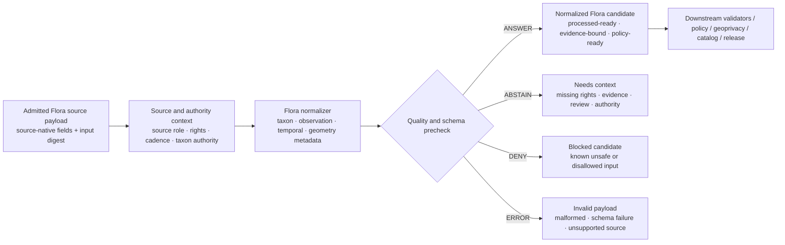

<!-- [KFM_META_BLOCK_V2]
doc_id: kfm://doc/NEEDS-VERIFICATION/packages-domains-flora-normalizers-readme
title: Flora Normalizers Package README
type: standard
version: v1
status: draft
owners: OWNER_TBD
created: 2026-06-14
updated: 2026-06-14
policy_label: public
related: [docs/domains/flora/README.md, docs/domains/flora/DATA_MODEL.md, docs/domains/flora/PIPELINES_AND_LIFECYCLE.md, docs/domains/flora/PUBLICATION_AND_POLICY.md, data/registry/flora/sources.yaml, data/registry/flora/source_roles.yaml, schemas/contracts/v1/domains/flora/, policy/domains/flora/, packages/domains/flora/geoprivacy_transformer/, packages/domains/flora/layer_manifests/]
tags: [kfm, flora, packages, normalizers, evidence, provenance, lifecycle]
notes: ["README-like package document; implementation depth remains NEEDS VERIFICATION until mounted repo files, package manifests, tests, and CI are inspected.", "This package must not become a schema, policy, source-registry, release, receipt, proof, or lifecycle-data authority."]
[/KFM_META_BLOCK_V2] -->

# Flora Normalizers

Normalize admitted Flora source payloads into evidence-bound, policy-ready Flora candidate objects without turning source records, model outputs, or public map layers into truth.

<p>
  
  
  
  
  
</p>

> [!IMPORTANT]
> **Status:** PROPOSED implementation package README  
> **Path:** `packages/domains/flora/normalizers/README.md`  
> **Owning responsibility root:** `packages/`  
> **Domain lane:** `flora`  
> **Repo implementation depth:** NEEDS VERIFICATION — package code, tests, schemas, workflows, and runtime behavior were not inspected in this file-generation pass.

## Quick links

- [Scope](#scope)
- [Repo fit](#repo-fit)
- [Accepted inputs](#accepted-inputs)
- [Exclusions](#exclusions)
- [Normalization flow](#normalization-flow)
- [Normalizer families](#normalizer-families)
- [Output expectations](#output-expectations)
- [Validation and quality gates](#validation-and-quality-gates)
- [Maintenance checklist](#maintenance-checklist)

---

## Scope

`normalizers/` is the Flora domain package for deterministic normalization helpers.

It turns admitted, source-specific Flora payloads into normalized, reviewable candidate records that downstream validators, catalog builders, policy checks, geoprivacy transformers, release gates, Evidence Drawer payloads, and layer-manifest builders can inspect.

The package should normalize source payloads such as:

- taxon names, common names, synonyms, and authority identifiers;
- occurrence, specimen, herbarium, survey, plot, checklist, and photo-voucher records;
- event dates, observed dates, collection dates, source update dates, and validity intervals;
- source-native IDs, batch IDs, citation fields, and provenance references;
- coordinate, geometry, location, precision, uncertainty, and spatial-reference metadata;
- source-specific quality flags, review flags, rights hints, and sensitivity signals;
- derived-but-not-public objects that still require validation, policy checks, and review.

A normalizer is not a publisher. It prepares structured candidates for the governed KFM lifecycle.

```text
RAW -> WORK / QUARANTINE -> PROCESSED -> CATALOG / TRIPLET -> PUBLISHED
```

Normalizers operate after source admission and before publication. They may help create `PROCESSED` candidates, validation payloads, and run receipts, but they must not bypass catalog closure, policy, review, geoprivacy, release, rollback, or governed API boundaries.

---

## Repo fit

```text
packages/domains/flora/normalizers/
```

This path is appropriate only for shared implementation code used by Flora pipelines, validators, test harnesses, or governed runtime adapters.

| Relationship | Expected location | Normalizer responsibility |
| --- | --- | --- |
| Upstream source fetch/admission | `connectors/`, `pipelines/`, `pipeline_specs/`, `data/raw/flora/`, `data/work/flora/`, `data/quarantine/flora/` | Consume admitted payloads or controlled work references; do not fetch live sources as hidden side effects. |
| Source roles, rights, sensitivity, cadence | `data/registry/flora/` and policy surfaces | Read registry context and preserve references in normalized candidates. |
| Semantic contracts | `contracts/` | Reference object meaning; do not redefine semantics locally. |
| Machine-readable schemas | `schemas/contracts/v1/...` | Validate against canonical schemas; do not store canonical schemas here. |
| Policy decisions | `policy/` | Provide normalized inputs to policy; do not own policy law. |
| Test fixtures | `fixtures/` or repo-standard test fixture root | Use no-network fixtures; keep package tests deterministic. |
| Validators | `tools/validators/` and `tests/` | Provide reusable helpers; do not become the repo-wide validator authority. |
| Receipts and proofs | `data/receipts/`, `data/proofs/` | Emit payloads for the owning pipeline to persist; do not create a parallel receipt/proof home. |
| Geoprivacy transform | `packages/domains/flora/geoprivacy_transformer/` | Preserve sensitivity and geometry context so geoprivacy can act later. |
| Public layer manifests | `packages/domains/flora/layer_manifests/` | Provide normalized, public-eligibility context; do not create map layers directly. |
| Release and rollback | `release/` | Supply release candidates and lineage; do not promote or publish. |

> [!WARNING]
> Do not place canonical source registries, JSON Schemas, policy rules, lifecycle data, receipts, proofs, release manifests, rollback cards, or public artifacts inside this package. Their homes remain under their owning responsibility roots.

---

## Accepted inputs

Normalizers should accept only governed inputs or references whose source admission state can be inspected.

| Input family | Accepted shape | Required handling |
| --- | --- | --- |
| Admitted source payload | Source-native JSON/CSV/GeoJSON/row envelope from a governed pipeline step. | Preserve source-native ID, raw field names where needed, source batch, and input digest. |
| Source descriptor reference | `source_id`, source role, citation, rights, cadence, authority limits. | Preserve the reference; do not infer source authority from the payload alone. |
| Taxon authority context | accepted name authority, synonym table, rank system, crosswalk version. | Emit accepted/provisional identity plus uncertainty flags. |
| Observation context | specimen, occurrence, survey, plot, checklist, photo voucher, or modeled source type. | Keep observation families distinct; do not collapse model/range/specimen/occurrence. |
| Temporal context | event date, collection date, source update date, valid time, transaction/run time. | Preserve temporal uncertainty and source-specific date precision. |
| Geometry context | internal geometry ref, source CRS, coordinate precision, uncertainty, locality text. | Normalize geometry metadata without leaking sensitive geometry to public outputs. |
| Sensitivity and rights hints | rare/protected/cultural/steward flags; license and redistribution hints. | Preserve as hints requiring policy/review; do not treat as final release authorization. |
| Run context | run ID, actor/service ID, normalizer version, spec hash, timestamp. | Emit deterministic run metadata and input/output digests. |

Missing source descriptor, source role, rights, evidence, or geometry precision context should return `ABSTAIN` or `ERROR` according to the package outcome rules rather than silently producing a public-ready object.

---

## Exclusions

| Do not use this package for | Correct home or owner |
| --- | --- |
| Live source fetching, scraping, API polling, credential handling | `connectors/`, `pipelines/`, `pipeline_specs/`, `configs/`, and environment secret stores. |
| RAW source storage | `data/raw/flora/`. |
| WORK / QUARANTINE storage | `data/work/flora/` or `data/quarantine/flora/`. |
| Canonical processed data persistence | `data/processed/flora/...` or repo-confirmed processed store. |
| Source registry, source roles, taxon authorities, rights profiles | `data/registry/flora/`. |
| Canonical contracts or schemas | `contracts/` and `schemas/contracts/v1/...`. |
| Policy / Rego / access rules | `policy/`. |
| Public geoprivacy transformation | `packages/domains/flora/geoprivacy_transformer/` plus policy/review gates. |
| Map layer manifests | `packages/domains/flora/layer_manifests/`. |
| Catalog, STAC, DCAT, PROV, catalog matrix | `data/catalog/...`. |
| Evidence bundles, proofs, receipt persistence | `data/proofs/` and `data/receipts/`. |
| Release manifests, rollback cards, correction notices | `release/`. |
| Public API or UI components | `apps/`, `packages/ui/`, `packages/maplibre/`, or repo-confirmed UI/API homes. |

---

## Normalization flow



The normalized candidate is still not a public record. It is a structured, evidence-bound candidate that later gates can validate, redact/generalize, catalog, review, promote, or reject.

---

## Outcome model

Every normalizer should return a finite result envelope.

| Outcome | Meaning | Public-safety posture |
| --- | --- | --- |
| `ANSWER` | Normalization succeeded and produced a processed-ready candidate envelope. | Not public by itself. Downstream gates still apply. |
| `ABSTAIN` | Required context is missing or inconclusive. | Do not promote; route to verification or quarantine review. |
| `DENY` | Payload is known unsafe, inadmissible, unsupported, or disallowed for the requested profile. | Do not create a processed candidate except a denial record/receipt if the pipeline requires one. |
| `ERROR` | Malformed payload, unsupported format, schema failure, or internal failure. | Do not continue; preserve diagnostics without exposing sensitive internals. |

---

## Normalizer families

| Family | Purpose | Must preserve | Must not collapse |
| --- | --- | --- | --- |
| `taxon_name_normalizer` | Normalize raw taxon/common-name text to accepted/provisional taxon context. | Raw name, accepted name, authority, rank, synonym/crosswalk version, uncertainty. | Taxon identity with occurrence evidence. |
| `occurrence_normalizer` | Normalize occurrence-like records into candidate occurrence envelopes. | Source record ID, event date, geometry metadata, evidence refs, quality flags. | Occurrence, specimen, survey, plot, range map, or model output. |
| `specimen_normalizer` | Normalize herbarium/specimen/voucher records. | Institution/collection references, voucher identifiers, collection date, collector/source citation where allowed. | Specimen evidence with live observation or public layer. |
| `survey_plot_normalizer` | Normalize survey, plot, checklist, or monitoring payloads. | Sampling method, plot/survey ID, observation effort, temporal scope, absence/presence semantics. | Survey effort with raw occurrence certainty. |
| `geometry_metadata_normalizer` | Normalize CRS, precision, uncertainty, locality, and internal geometry references. | Internal geometry reference, CRS, precision bucket, uncertainty, locality text. | Internal geometry with public-safe geometry. |
| `temporal_normalizer` | Normalize date/time fields and uncertainty. | Valid time, observed time, source update time, run/transaction time, date precision. | Event time with run time or release time. |
| `rights_sensitivity_hint_normalizer` | Preserve source-provided rights/sensitivity hints for policy review. | Rights hint, sensitivity hint, steward flag, source terms reference. | Hints with final policy/release decisions. |
| `quality_flag_normalizer` | Normalize source-specific QA flags into KFM reason codes. | Source QA code, mapped reason code, mapping version, unmapped flags. | QA hints with final validation decision. |
| `derived_surface_normalizer` | Normalize source-declared modeled/range/suitability payloads. | Model/source declaration, run/version, covariate links, uncertainty. | Model output with observed flora evidence. |

---

## Output expectations

The canonical schema belongs outside this package. Semantically, successful normalization should produce an envelope with these sections.

| Section | Required purpose |
| --- | --- |
| `normalization` | Normalizer family, version, spec hash, run ID, source profile, outcome, reason codes. |
| `source_context` | `source_id`, source role, citation reference, source record ID, batch ID, rights/cadence references. |
| `identity` | Stable candidate ID, source-native IDs, deterministic fallback inputs, raw-vs-normalized identity fields. |
| `taxon_context` | Raw taxon text, accepted/provisional taxon ID, authority, rank, synonym/crosswalk, uncertainty. |
| `observation_context` | Observation family, evidence character, method/source type, quality state, duplicate hints. |
| `temporal_context` | Event/observed/collection/update/run times, precision, validity intervals, timezone assumptions. |
| `spatial_context` | Internal geometry reference, CRS, precision, uncertainty, locality, coordinate exposure class. |
| `rights_sensitivity_context` | Rights hints, sensitivity hints, review obligations, release blockers. |
| `evidence` | EvidenceRef list or evidence closure requirements. |
| `digests` | Input digest, output digest, source payload digest where applicable. |
| `next_gates` | Required validation, policy, geoprivacy, catalog, review, and release gates. |

### Illustrative normalized candidate

> [!NOTE]
> This example is illustrative. Field names must be synchronized with the repo's canonical schemas before implementation.

```yaml
normalization:
  outcome: ANSWER
  family: occurrence_normalizer
  normalizer_version: 0.1.0-PROPOSED
  spec_hash: sha256:SPEC_HASH_TBD
  reason_codes: [flora.normalized.source_occurrence]
source_context:
  source_id: flora.source.SOURCE_ID_TBD
  source_record_id: SOURCE_RECORD_ID_TBD
  source_role: observation
  rights_profile_ref: data/registry/flora/rights_profiles.yaml#PROFILE_TBD
identity:
  candidate_id: kfm://flora/occurrence/sha256:CANDIDATE_HASH_TBD
  deterministic_id_recipe: source_id + source_record_id + event_date + normalized_geometry_ref + taxon_context
taxon_context:
  raw_name: RAW_TAXON_NAME_TBD
  accepted_taxon_id: TAXON_ID_TBD
  authority: TAXON_AUTHORITY_TBD
  identity_state: provisional | accepted | ambiguous
observation_context:
  object_family: flora_occurrence
  evidence_character: observation
  quality_state: needs_validation
spatial_context:
  internal_geometry_ref: INTERNAL_GEOMETRY_REF_TBD
  coordinate_exposure: internal_only
  precision_bucket: PRECISION_BUCKET_TBD
rights_sensitivity_context:
  sensitivity_state: needs_policy_check
  public_release_eligible: false
next_gates:
  - schema_validation
  - source_rights_check
  - sensitivity_policy
  - geoprivacy_transform
  - evidence_bundle_resolution
  - steward_review_if_required
  - release_manifest_before_public_use
```

---

## Validation and quality gates

Normalizers should be tested as pure, deterministic helpers wherever possible.

| Gate | Requirement | Failure outcome |
| --- | --- | --- |
| Source context gate | A `source_id` and source role are present or resolvable. | `ABSTAIN` or `ERROR`. |
| Shape gate | Input matches a known source profile or declared adapter. | `ERROR`. |
| Taxon gate | Raw taxon text is preserved and accepted/provisional identity state is explicit. | `ABSTAIN` or `ANSWER` with ambiguity flags, depending policy. |
| Temporal gate | Event/source/run time fields are not silently merged. | `ERROR` or flagged `ANSWER`. |
| Spatial metadata gate | CRS, precision, uncertainty, locality, or missing-geometry state is explicit. | `ABSTAIN` or `ERROR`. |
| Rights/sensitivity hint gate | Hints are preserved for policy; release eligibility is not invented. | `ABSTAIN`. |
| Evidence gate | EvidenceRefs or closure obligations are emitted. | `ABSTAIN`. |
| Digest gate | Input/output digests are stable for identical normalized content. | `ERROR`. |
| No-leak gate | Logs/errors do not expose exact sensitive geometry or restricted source IDs. | `DENY` or `ERROR`. |

Recommended test classes:

- golden source-profile fixture normalizes deterministically;
- missing source role returns `ABSTAIN`;
- malformed coordinate returns `ERROR`;
- rare/sensitive hint remains a policy obligation, not a public denial by itself;
- modeled range payload remains `derived_surface`, not `occurrence`;
- date precision is preserved;
- duplicate source-native IDs are flagged for reconciliation;
- exact internal geometry is never emitted in public-oriented debug output.

---

## Package layout

PROPOSED package-local layout:

```text
packages/domains/flora/normalizers/
├── README.md
├── __init__.py                    # NEEDS VERIFICATION if Python package convention is confirmed
├── base.py                        # shared finite outcome / helper interfaces
├── taxa.py                        # taxon/name/crosswalk normalization helpers
├── occurrences.py                 # occurrence/specimen/survey/plot normalizers
├── geometry.py                    # CRS / precision / geometry metadata helpers
├── temporal.py                    # date/time/validity normalization helpers
├── rights_sensitivity.py          # source hints, not final policy decisions
├── quality.py                     # source QA flag mapping helpers
├── derived_surfaces.py            # range/model/suitability payload helpers
└── adapters/
    └── SOURCE_PROFILE_TBD.py      # source-specific adapters only after source profiles are registered
```

> [!CAUTION]
> This tree is PROPOSED. Confirm the repo's language/package convention before creating code files. Do not create source-specific adapters until source descriptors, rights, and source profiles are registered.

---

## Maintenance checklist

- [ ] Confirm `packages/domains/flora/normalizers/` is the accepted implementation package home.
- [ ] Confirm owners and CODEOWNERS coverage.
- [ ] Link this README from the nearest Flora package/domain README.
- [ ] Confirm canonical schemas for normalized Flora candidates.
- [ ] Confirm source registry paths for Flora source roles, taxon authorities, rights profiles, and sensitivity profiles.
- [ ] Add deterministic no-network fixtures for each supported source profile.
- [ ] Add tests for `ANSWER`, `ABST
